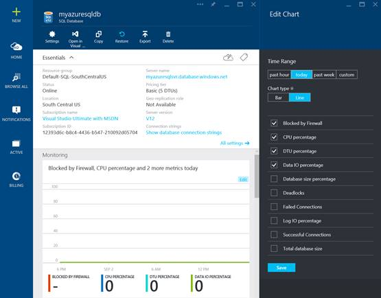
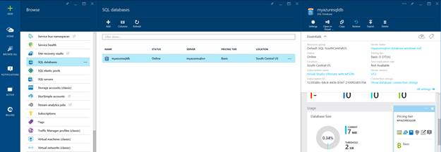

# 第 8 章 Azure SQL 数据库的性能考虑

在前几章中，您已经了解了设置、配置、管理和迁移到 Azure SQL 数据库是多么容易。减少设置时间、易于管理、按需容量扩展、降低成本和管理开销是使用 Azure SQL Database 作为应用程序后端的一些最大动机。然而，性能和安全性是决定选择数据库平台的商业决策的两个重要方面。在本章中，您将了解在 Azure SQL 数据库中运行数据库工作负载的性能监控工具和注意事项。

## 为您的工作负载选择合适的服务级别

在 SQL Server 的内部安装中，您可以选择合适的硬件、内存和存储，以确保获得可预测的性能。在 Azure 虚拟机(IaaS)上使用 SQL 时，您可以选择合适的虚拟机大小和存储(高级或标准)，以确保获得可预测的性能。同样，在使用 Azure SQL 数据库时，您需要为您的工作负载选择合适的服务层，以确保工作负载的可预测性能。因此，服务层通常被称为 Azure SQL 数据库的性能层。

下表可用作为您的工作负载选择合适的服务层的决策矩阵。

表 13:为您的工作负载选择合适的服务层

|  | 基础 | 标准 | 溢价 |
| 数据库大小 | < 2 GB | < 250 GB | < 500 GB |
| 并发 | 单一用户 | 小到中等 | 中型到大型 |
| 响应时间 | 高的 | 中等 | 低的 |
| 最适合 | Azure SQL 数据库入门或单用户开发 | 为中等流量的网站或中等报告流量的数据仓库工作负载提供服务 | CPU、内存和低延迟需求的繁重并发工作负载 |

如前所述，每个服务层支持的相对事务性能是根据数据单元来衡量的。在监控 Azure SQL 数据库时，要监控的一个重要指标是 DTU 百分比。DTU 百分比指标给出了当前工作负载的 DTU 值占该数据库服务层支持的最大 DTU 值的百分比。如果 DTU 百分比始终保持在 100，则意味着是时候转移或升级到下一个服务级别了。下一节说明如何查看或监控 Azure SQL 数据库的性能指标。

## 监控 Azure SQL 数据库的性能指标

在内部部署的 SQL Server 实例以及 Azure 虚拟机上的 SQL Server(IaaS)中，我们使用性能监视器数据、动态管理视图(DMVs)和扩展事件来监视 SQL Server 实例的性能指标。性能监视器(perfmon)计数器主要用于监视服务器上的资源利用率和 SQL Server 消耗的资源。dmv 对于跟踪等待统计信息、用户会话详细信息、阻塞等非常有用，而扩展事件会话就像运行在 SQL Instance 上的跟踪记录器，用于捕获 XEvents 会话中定义的各种事件或活动。

同样，Azure SQL Database 允许您使用性能监视器数据、动态管理视图(DMVs)和扩展事件(在 V12 中引入)来监视数据库性能。不同之处在于，您不需要配置或管理性能数据集合，因为默认情况下会持续捕获和管理数据。您可以按照以下步骤从 Azure 门户查看性能监视器数据。

### 使用性能图表监控资源使用情况

1.  登录到 Azure 管理门户，单击浏览所有> SQL 数据库，然后选择要监控的数据库。然后，单击监控子窗口上的编辑，如下图所示:


图 23:监控 Azure SQL 数据库的性能指标

2.  “编辑图表”子窗口允许您选择或取消选择默认情况下收集的各种计数器。



图 24:编辑性能监控图表

这些性能指标是不言自明的。如前所述，DTU 百分比指标告诉您当前数据库工作负载在该服务层支持的 max DTU 中所占的百分比，这是考虑转移到下一个服务层时的一个重要指标。同样，数据库大小百分比提供数据库的当前大小占该服务层支持的最大数据库大小的百分比，这是决定是否应将工作负载移动到下一个服务层时的另一个重要指标。通常，如果看到 CPU 百分比、DTU 百分比、数据输入输出百分比、日志输入输出百分比或数据库大小百分比始终为 100，您应该考虑移动到下一层，这样数据库的吞吐量就不会受到层限制的限制。

### 使用 dmv 监控资源使用情况

您也可以使用 **sys.resource_stats** 动态管理视图访问资源使用数据。它提供与性能监控图表相同的信息。

下面的查询提供了过去七天数据库 myazuresqldb 的资源利用率。

代码清单 26:使用车管所监控资源使用情况

```
      SELECT *
      FROM sys.resource_stats
      WHERE database_name = 'myazuresqldb' AND
            start_time > DATEADD(day, -7, GETDATE())
      ORDER BY start_time DESC;

```

为了评估您的工作负载与性能水平的匹配程度，您必须深入查看资源指标的各个不同方面:CPU、读取、写入、工作人员数量和会话数量。下面是一个修改后的查询，使用 **sys.resource_stats** 来报告这些资源度量的平均值和最大值。

代码清单 27:使用车管所监控资源使用情况

```
      SELECT
          avg(avg_cpu_percent) AS 'Average CPU Utilization In Percent',
          max(avg_cpu_percent) AS 'Maximum CPU Utilization In Percent',
          avg(avg_physical_data_read_percent) AS 'Average Physical Data Read Utilization In Percent',
          max(avg_physical_data_read_percent) AS 'Maximum Physical Data Read Utilization In Percent',
          avg(avg_log_write_percent) AS 'Average Log Write Utilization In Percent',
          max(avg_log_write_percent) AS 'Maximum Log Write Utilization In Percent',
          avg(active_session_count) AS 'Average # of Sessions',
          max(active_session_count) AS 'Maximum # of Sessions',
          avg(active_worker_count) AS 'Average # of Workers',
          max(active_worker_count) AS 'Maximum # of Workers'
      FROM sys.resource_stats
      WHERE database_name = 'myazuresqldb' AND start_time > DATEADD(day, -7, GETDATE());

```

通过监控一段时间内的平均 CPU 和 IO 趋势，您可以进一步决定是否应该转移到下一个服务层。

## 在 Azure SQL 数据库中向上或向下扩展

在服务层或性能级别之间移动之前，请确保服务器上有可用的配额。如果您需要额外的配额，您必须联系微软客户支持，以便能够在服务器上扩展。

您可以按照本节中描述的过程随时更改 Azure SQL 数据库的服务层:

1.  登录到 Azure 管理门户，然后单击浏览所有-> SQL 数据库。选择要更改其服务级别的数据库，然后单击数据库子窗口上的定价级别。



图 25:更改 Azure SQL 数据库的服务层

2.  您可以选择要移动到的服务层，然后单击选择升级到新的服务层。


图 26:更改 Azure SQL 数据库的服务层

更改数据库的服务层是一项在线操作，但应在非工作时间通过停止应用程序来执行。这将加快升级操作。也可以使用[Set-azure database](https://msdn.microsoft.com/en-us/library/dn546732.aspx)PowerShell cmdlet 更改数据库的服务层。

## 监控和排除不良指标设计

OLTP 数据库性能的一个常见问题与数据库的不良索引设计有关。通常，数据库模式的设计和交付都没有进行大规模测试(无论是负载测试还是数据量测试)。不幸的是，查询计划的性能在小范围内可能是可以接受的，但是当面对生产级数据量时，性能可能会大大降低。这个问题最常见的原因是缺少合适的索引来满足查询中的过滤器或其他限制。通常，当索引查找足够时，这表现为表扫描。

如果数据库的索引设计不好，转移到更高的服务层可以稍微缓解这个问题。但是，随着数据库大小的不断增长，查询的性能将继续下降，转移到下一个性能层可能无法解决性能问题。

Azure SQL 数据库包含缺失的 DMV 索引，类似于内部部署的 SQL 服务器，以帮助数据库管理员查找和修复常见的缺失索引情况。这允许数据库管理员快速猜测哪些索引更改可能会提高给定数据库及其实际工作负载的总体工作负载成本。

以下查询可用于评估潜在的缺失索引。

代码清单 28:使用车管所监控缺失的索引

```
      SELECT CONVERT (varchar, getdate(), 126) AS runtime,
          mig.index_group_handle, mid.index_handle,
          CONVERT (decimal (28,1), migs.avg_total_user_cost * migs.avg_user_impact *
                  (migs.user_seeks + migs.user_scans)) AS improvement_measure,
          'CREATE INDEX missing_index_' + CONVERT (varchar, mig.index_group_handle) + '_' +
                    CONVERT (varchar, mid.index_handle) + ' ON ' + mid.statement + '
                    (' + ISNULL (mid.equality_columns,'')
                    + CASE WHEN mid.equality_columns IS NOT NULL
                                AND mid.inequality_columns IS NOT NULL
                           THEN ',' ELSE '' END + ISNULL (mid.inequality_columns, '')
                    + ')'
                    + ISNULL (' INCLUDE (' + mid.included_columns + ')', '') AS create_index_statement,
          migs.*,
          mid.database_id,
          mid.[object_id]
      FROM sys.dm_db_missing_index_groups AS mig
      INNER JOIN sys.dm_db_missing_index_group_stats AS migs
          ON migs.group_handle = mig.index_group_handle
      INNER JOIN sys.dm_db_missing_index_details AS mid
          ON mig.index_handle = mid.index_handle
      ORDER BY migs.avg_total_user_cost * migs.avg_user_impact * (migs.user_seeks + migs.user_scans) DESC

```

以下查询可用于查找已更新但从未用于查找、扫描或查找的索引。该查询的结果显示了可能被删除的索引，因为它们是 DML 操作的开销，对加速表的查询毫无帮助。

代码清单 29:使用 DMV 监控未使用的索引

```
        SELECT
             DB_NAME()                       AS DatabaseName,
             OBJECT_NAME(i.OBJECT_ID)        AS TableName ,
             i.name                          AS IndexName,
             s.user_updates                  AS IndexUserUpdates

         FROM sys.indexes i 
         LEFT JOIN sys.dm_db_index_usage_stats s
             ON s.OBJECT_ID = i.OBJECT_ID
             AND i.index_id = s.index_id
             AND s.database_id = DB_ID()
         WHERE OBJECTPROPERTY(i.OBJECT_ID, 'IsIndexable') = 1
         -- index_usage_stats has no reference to this index (not being used)
         AND s.index_id IS NULL
         -- index is being updated, but not used by seeks/scans/lookups
         OR (
                 s.user_updates > 0
                 AND s.user_seeks = 0
                 AND s.user_scans = 0
                 AND s.user_lookups = 0
             )
         ORDER BY OBJECT_NAME(i.OBJECT_ID) ASC  

```

除了车管所，微软产品团队还推出了 Index Advisor，在撰写本文时，该产品目前处于预览阶段。索引顾问监视和分析不断冲击数据库的查询，并推荐对性能有最大积极影响的索引。它可以自动为您创建索引，并继续监视新创建的索引。如果新创建的索引没有重大影响，它将恢复并自动删除索引。该功能仍在 Azure SQL 数据库 V12 中预览，但您可以在下面的文章中找到关于该功能的更多详细信息:

[https://azure . Microsoft . com/en-us/documentation/articles/SQL-database-index-advisor/](https://azure.microsoft.com/en-us/documentation/articles/sql-database-index-advisor/)

## 使用查询存储进行查询优化

另一个新功能是查询存储，计划在 SQL 2016 的盒子版本中发布，目前正在 Azure SQL Database V12 中预览。随着您的数据库投入生产，现实世界的数据开始填充数据库，查询的行为不再像在开发或测试中那样。当这种情况发生时，需要很长时间来识别和排除由于查询计划的更改而导致的执行不良的查询，因为数据库中可能没有以前版本的查询计划。这个问题可以通过查询存储解决。查询存储功能充当了一个形象化的航空飞行记录器，存储查询和查询计划的历史数据，使您能够识别和了解一段时间内查询行为和查询计划的变化。

查询存储是数据库范围的功能，可以在数据库级别打开。您可以通过指定数据捕获或采样频率的最大限制来限制收集的数据。SQL 2016 Management Studio 允许您查看查询存储计划和对象的分析和报告。这允许您在一段时间的数据捕获中识别最消耗资源的查询或执行最慢的查询。如果您的工作负载包含以不同计划和可变性能执行的查询，您可以使用查询存储来强制 SQL Server 在将来的执行中始终使用最佳计划。对于存储过程或参数化查询对不同的参数值使用不同的计划的参数嗅探情况，这一点特别有用。如果坏计划首先缓存在 SQL Server cachestore 中，则存储过程或查询的所有后续执行都将使用坏计划，并且执行速度很慢。使用查询存储，您可以强制查询使用最佳计划。

由于该功能仍处于预览阶段，因此很难记录设置和分析查询存储的步骤，但您可以在下面的文章中找到实现步骤:

[http://azure . Microsoft . com/en-us/blog/query-store-a-flight-data-recorder-for-your-database/](http://azure.microsoft.com/en-us/blog/query-store-a-flight-data-recorder-for-your-database/)

## 使用 Azure SQL 数据库进行跨数据库分片或横向扩展

如果您认为由于业务或用户的高需求，Azure SQL Database 中最高高级服务层提供的资源和容量限制可能不足以处理您的工作负载，您可以考虑横向扩展或一种通常称为跨数据库分片的技术。使用跨数据库分片技术时，您可以跨多个数据库在单个维度上拆分数据。这是可能的，因为大多数 OLTP 应用程序执行的事务只适用于模式中的一行或一小组行。例如，如果一个数据库包含客户、订单和订单详细信息，那么可以通过将具有相关订单和订单详细信息的客户分组到单个数据库中，将这些数据分割成多个数据库。该应用程序将不同的客户分散到不同的数据库中，有效地将负载分散到多个数据库中。这不仅允许客户避免最大数据库大小限制，而且还允许 Azure SQL Database 处理明显大于不同性能级别限制的工作负载，只要每个单独的数据库适合其 DTU。

虽然数据库分片不会降低解决方案的总资源容量，但这种技术对于支持分布在多个数据库上的非常大的解决方案非常有效，并且允许每个数据库以不同的性能级别运行，以支持具有高资源需求的非常大的“有效”数据库。

微软最近发布了用于 Azure SQL 数据库的弹性数据库工具，这是一个客户端库和管理工具，用于在 Azure 数据库上创建分片数据库解决方案。下面的文章提供了更多关于使用 Azure SQL 数据库弹性数据库工具的详细信息:

[http://azure . Microsoft . com/documentation/articles/SQL-database-elastic-scale-入门/](http://azure.microsoft.com/documentation/articles/sql-database-elastic-scale-get-started/)