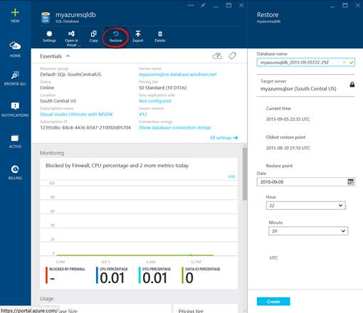
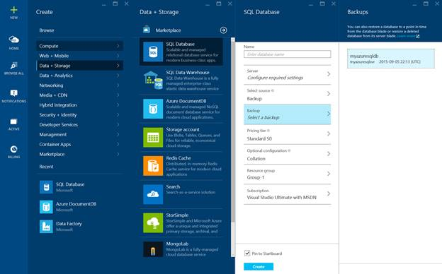

# 十、Azure SQL 数据库的业务连续性

Azure SQL Database 从头开始构建，是一个健壮、高可用性的数据库服务，它使用一个系统，在该系统中，每个数据库的三个或更多副本始终保持不变，更新在响应之前至少提交给两个副本。该高可用性系统解决了本地硬件和软件故障。尽管有如此高的冗余度，它仍然容易受到计划内和计划外停机的影响。微软提供的服务级别协议为 99.99%(四个 9)，相当于每年总停机时间为 52.56 分钟，但由于人为错误，例如数据库管理员在执行维护操作或应用程序升级时意外删除数据，或者由于区域性灾难，仍然可能会出现计划外停机。也可能存在计划内停机，例如当当前数据库处于服务维护或应用程序升级期间，您希望从不同的位置运行数据库。

如前所述，以下业务连续性功能在 Azure SQL 数据库的 V12 版本中可用。

表 14:Azure SQL 数据库中的业务连续性特性

| 能力 | 基本层 | 标准层 | 高级等级 |
| --- | --- | --- | --- |
| 时间点还原 | 7 天内的任何还原点 | 14 天内的任何还原点 | 35 天内的任何还原点 |
| 地理恢复 | 您的±12h RPO±1h | 您的±12h RPO±1h | 您的±12h RPO±1h |
| 标准地理复制 | 未包括在内 | ERT < 30s，RPO < 5s | ERT < 30s，RPO < 5s |
| 主动地理复制 | 未包括在内 | 未包括在内 | ERT < 30s，RPO < 5s |

ERT 指的是预计恢复时间，即恢复和恢复数据库直到恢复点的预计时间。

RPO 代表恢复点目标，它衡量数据库恢复并联机时丢失的数据量。

地理恢复、标准地理复制和主动地理复制相结合，为您提供了一系列选项来实施满足您的应用程序和业务需求的业务连续性解决方案。下表总结了一些常见的业务连续性场景，以及在每种场景下哪个解决方案会有用。

表 15:业务连续性场景

| 方案 | 地理恢复 | 标准地理复制 | 主动地理复制 |
| 区域性灾难 | 是 | 是 | 是 |
| 灾难恢复演习 | 是 | 是 | 是 |
| 在线应用程序升级 | 不 | 不 | 是 |
| 在线应用程序重新定位 | 不 | 不 | 是 |
| 读取负载平衡 | 不 | 不 | 是 |

在本章中，我们将详细讨论 Azure SQL 数据库中提供的所有业务连续性解决方案。

## 时间点恢复

使用完整数据库备份以及增量和事务日志备份，在 Azure 数据中心内持续备份 Azure SQL 数据库中的数据库。时间点还原允许您将数据库从备份还原到事务在指定时间点发生的时间。此功能在所有服务层中都可用，但还原点取决于每个服务层支持的保留策略。基本层最多支持 7 天，标准层最多支持 14 天，高级层最多支持 35 天。时间点恢复对于从人为错误中恢复特别有用，例如当用户意外丢失了表或覆盖了需要恢复的数据时。您可以使用 Azure 门户或 PowerShell 执行时间点恢复。

您可以按照本节中提到的步骤将数据库还原到指定的时间点。

1.  登录 Azure 门户网站。单击全部浏览并选择 SQL 数据库。选择要恢复的数据库，并在数据库子窗口顶部单击恢复，如下图所示。

图 32:Azure SQL 数据库的时间点恢复

2.  指定数据库名称和时间点，然后单击创建以使用新名称将数据库恢复到指定的时间点。
3.  可以从左侧的通知选项卡监控恢复过程。
4.  数据库恢复后，您可以像 SSMS 的任何其他 Azure SQL 数据库一样看到并连接到该数据库，并恢复所需的数据。

您也可以使用[Start-azure database restore](https://msdn.microsoft.com/library/dn720218.aspx?f=255&MSPPError=-2147217396)PowerShell cmdlet 将数据库还原到指定的时间点。

## 地理恢复

地理恢复提供了从地理冗余备份恢复数据库以创建新数据库的能力。数据库可以在任何 Azure 区域的任何服务器上创建。因为它使用地理冗余备份作为其源，所以即使数据库因宕机而无法访问，也可以使用它来恢复数据库。自动为所有服务层启用地理恢复，无需额外成本。

您可以按照本节中提到的步骤来执行 Azure SQL 数据库的地理恢复。

1.  登录 Azure 门户，点击门户左上角的新建。
2.  选择数据和存储，然后选择 SQL 数据库。
3.  提供要还原的数据库名称和逻辑服务器名称，并选择“备份”作为源。在备份子窗口中，选择要恢复的地理冗余备份，如下图所示。

图 33:执行 Azure SQL 数据库的地理恢复

4.  指定其余的数据库属性，然后单击创建。
5.  数据库恢复过程将开始，并且可以使用屏幕左侧的 NOTIFY 选项卡进行监控。
6.  数据库恢复后，您可以通过为客户端 IP 配置服务器级和数据库级防火墙规则，使用 SSMS 连接到数据库。

您也可以使用[Start-Azure Database recovery](https://msdn.microsoft.com/library/azure/dn720224.aspx)PowerShell cmdlet 执行 Azure SQL 数据库的地理恢复。

## 标准地理复制

标准地理复制允许您将数据库配置为在预定义的 Azure 区域中将提交的事务从主数据库异步复制到辅助数据库。标准地理复制基于与主动地理复制相同的技术构建，但它针对仅使用地理复制来保护应用程序免受区域故障影响的应用程序进行了优化。下表显示了标准地理复制与活动地理复制的不同之处:

1.  在微软定义的“灾难恢复配对”Azure 区域中，只能创建一个辅助数据库。
2.  辅助数据库在主数据库中可见，但在故障转移完成之前无法直接连接到(离线辅助数据库)。
3.  辅助数据库因不可读(离线)而按折扣率收费。

当您想要从区域性灾难中恢复时，或者在灾难恢复合规性演练期间，标准地理复制非常有用。

您可以按照本节中的步骤配置标准或主动地理复制。

1.  登录 Azure 门户，然后单击全部浏览。选择 SQL 数据库，并选择要为其配置地理复制的数据库。
2.  在数据库子窗口中，向下滚动到底部，直到看到“配置地理复制”，然后单击它。
3.  在地理复制子窗口中，您将看到 Azure 区域，您可以在其中托管辅助数据库以及推荐的区域。就性能而言，推荐区域是复制的首选区域，但是您可以选择您心目中的区域。如果您对辅助数据库的 Azure 位置没有任何偏好，您可以选择推荐的 Azure 区域。
4.  选择该区域将打开“创建辅助”子窗口，您可以在其中将辅助类型指定为可读或不可读。选择不可读使其成为标准地理复制，而可读使其成为主动地理复制。
5.  最后，您可以配置将托管辅助数据库的服务器设置。单击创建为地理复制配置辅助数据库。

图 34:配置标准或活动地理复制

6.  创建辅助复制副本后，您将看到它列在地理复制子窗口的辅助部分下。

当您想要执行故障切换时，如果主数据库出现中断，您将进入上图所示的同一个地理复制子窗口，在“辅助数据库”部分下，右键单击包含您想要恢复的数据库名称的行，然后单击**停止**以终止连续复制关系并使辅助数据库联机。有关终止连续复制关系的完整说明，您可以参考以下 MSDN 文章:

[https://azure . Microsoft . com/en-us/documentation/articles/SQL-database-灾难恢复/](https://azure.microsoft.com/en-us/documentation/articles/sql-database-disaster-recovery/)

您也可以使用[Stop-azure database copy](https://msdn.microsoft.com/library/dn720223)PowerShell cmdlet 终止连续复制关系以停止并故障转移到辅助服务器。

## 主动地理复制

主动地理复制可用于高级数据库，它提供了最丰富的解决方案，具有最小的数据丢失风险和最快的恢复时间。它扩展了标准地理复制，最多有四个地理复制辅助节点，这些辅助节点始终在线且可读，还可用于负载平衡或提供对世界任何地方复制数据的低延迟访问。

使用主动地理复制，您可以创建数据库的连续复制副本，该副本可以在对数据库或应用程序进行更新或维护之前立即冻结。如果在此过程中或之后检测到任何错误，很容易迅速退回到该副本。

|  | 提示:虽然主动地理复制在高级服务层中可用，但您仍然可以利用主动地理复制的优势来执行应用程序或服务升级，方法是在升级操作之前切换到高级服务层，使用主动地理复制执行升级，然后切换回较低的服务层以节省成本。 |

在配置标准地理复制时，您可以使用上面提到的步骤配置活动地理复制，但是对于活动地理复制，您可以将辅助类型配置为可读，并且最多可以有四个始终在线且可读的地理复制辅助。与标准地理复制类似，当您希望进行故障切换时，您可以转到该数据库的地理复制子窗口，右键单击要故障切换到的辅助数据库。单击“停止”终止连续复制关系，并使数据库以读写模式联机。

一旦您管理了故障切换过程，您将希望重建您以前使用的地理复制关系的相同模式，只是以新的生产数据库为主，以确保您拥有应用程序和业务连续性策略所需的地理冗余和负载平衡。

有关针对 Azure SQL 数据库的主动复制的更多信息，您可以参考以下 MSDN 文章:

[https://azure . Microsoft . com/en-us/documentation/articles/SQL-database-geo-replication-overview/](https://azure.microsoft.com/en-us/documentation/articles/sql-database-geo-replication-overview/)