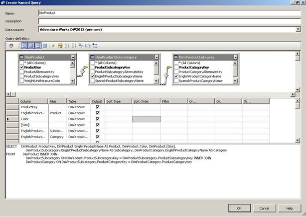

# 二、使用数据源视图

分析服务多维模型要求您使用一个或多个关系数据源。理想情况下，数据源被构造为一个[星型模式](http://en.wikipedia.org/wiki/Star_schema)，比如你通常在数据仓库或数据集市中找到的。如果没有，您可以调整数据源的逻辑视图来模拟星型模式。该逻辑视图在分析服务数据库中被称为数据源视图(DSV)对象。在本章中，我将解释如何创建一个 DSV，以及如何在准备开发维度和立方体时对其进行调整。

## 数据来源

DSV 至少需要一个数据源、定义要加载到多维数据集中的数据位置的分析服务项目中的文件类型、数据库中的维度对象以及成功连接到该数据所需的信息。您可以使用向导逐步完成创建此文件的过程。要启动向导，右键单击**解决方案资源管理器**中的**数据源**文件夹。如果已经定义了现有连接，可以在列表中选择它。否则，点击**新建**使用连接管理器界面，如图 8 所示，选择一个提供者、服务器和数据库。

图 8:新数据源的连接管理器

您选择的提供程序可以是托管的。NET 提供程序，例如 SQL 本机客户端。您还可以从其他关系源的几个本机 OLE 数据库提供程序中进行选择。无论如何，您的数据必须在关系数据库中。分析服务不知道如何从 Excel、像 SAS 这样的应用程序或平面文件中检索数据。您必须首先将这些类型文件中的数据导入数据库，然后才能在分析服务中使用这些数据。

选择提供程序后，您可以指定存储数据的服务器和数据库，以及每当 Analysis Services 需要连接到数据源时，是使用 Windows 用户还是数据库登录进行身份验证。此过程类似于在集成服务或报告服务或其他需要数据连接的应用程序中创建数据源。

在数据源向导的第二页上，必须定义模拟信息。数据源文件中的连接信息的目的是告诉分析服务在处理期间在哪里可以找到多维数据集和维度的数据。但是，由于处理通常是按计划进行的，因此分析服务不会在当前用户的安全上下文中执行处理，并且需要模拟信息来提供安全上下文。有四种选择:

*   **具体的 Windows 用户名和密码**。您可以使用此选项对特定的用户名和密码进行硬编码。
*   **服务账户**。这是运行分析服务的帐户，它可以是内置帐户，也可以是专门为该服务设置的 Windows 帐户。如果您的数据源在远程服务器上，并且您正在使用本地服务或本地系统帐户，这可能不是一个好的选择，因为这些内置帐户仅限于本地服务器。
*   **当前用户的凭证**。您可以选择使用当前用户凭据的选项，但这仅在手动处理数据库时有用。如果通过 SQL Server 代理或集成服务任务设置计划作业，处理将失败。
*   **继承**。该选项使用数据库级模拟信息(在**数据库属性**对话框中的**管理工作室**下可见)。如果数据库级模拟设置为**默认**，分析服务将使用服务帐户进行连接。否则，它将使用指定的凭据。

|  | 注意:无论您选择哪种模拟选项，请确保该帐户对数据源具有读取权限。否则，处理将失败。 |

## 数据源视图

DSV 的目的是在关系数据库中的物理源和 SSAS 的逻辑模式之间提供一个抽象层。您可以使用它来组合多个数据源，这些数据源可能无法通过关系连接在一起，或者模拟不允许您在基础数据源中进行的结构更改。或者，您可以使用它来简化具有大量表的源，以便您可以只关注构建分析服务数据库所需的表。通过将架构的元数据存储在项目中，您可以在与数据源断开连接时进行分析服务数据库设计。只有当您准备好将数据加载到分析服务中时，才需要连接。

### 数据源视图向导

构建 DSV 最常见的方法是使用数据集市或数据仓库中的现有表。这些表应该已经填充了数据。要启动数据源视图向导，右键单击**解决方案资源管理器**中的**数据源视图**文件夹，然后选择一个数据源。选择要用于开发维度和多维数据集的表或视图。当您完成向导时，您的选择以图表形式出现在工作区的中心，并以表格形式出现在工作区的左侧，如图 9 所示。

图 9:数据源视图

### 主键和关系

DSV 中的表继承数据源中定义的主键和外键关系。您应该看到一个[事实表](http://en.wikipedia.org/wiki/Star_schema#Fact_tables)和相关的[维度表](http://en.wikipedia.org/wiki/Star_schema#Dimension_tables)之间的外键关系，或者一个[雪花维度](http://en.wikipedia.org/wiki/Snowflake_schema)中的子级别之间的外键关系。图 9 包括两种关系的例子。FactResellerSales 表与两个维度表 DimProduct 和 DimDate 具有外键关系。此外，产品维度中的级别之间存在外键关系。具体来说，这些关系出现在 DimProductSubcategory 和 DimProductCategory 之间，以及 DimProduct 和 DimProductSubcategory 之间。

维度表的规则之一是它们必须有一个主键。如果由于某种原因您的表没有主键，您可以创建一个逻辑主键。通常，这种情况会在原型开发过程中出现，因为您没有真正的数据集市或数据仓库作为数据源。然而，有时数据仓库开发人员会将主键定义作为加载表的性能优化。要添加主键，右键单击包含唯一标识表中每条记录的值的列，并在子菜单上选择**设置逻辑主键**。您的更改不会更新数据库中的物理模式，而只是更新关于 DSV 表的元数据。

同样，您应该确保事实表和维度表之间存在正确的关系。有时，出于性能原因，这些关系不是在数据源中创建的，或者您可能正在使用来自不同数据源的表。不管缺少关系的原因是什么，您都可以通过将一个表中的外键列拖动到另一个表中的主键列来创建逻辑关系。注意定义一段关系的正确方向。例如，箭头的方向需要远离事实表并指向维度表，或者远离雪花维度中的子级别并指向父级别。

### 属性

当您选择特定的表或表中的列时，无论是在图表中还是在表列表中，您都可以在**属性**窗口中查看相关属性，默认情况下，该窗口显示在图表的右侧。如果出于某种原因，您没有直接在数据源中修改名称的必要权限，并且希望提供比源中可能存在的名称更友好的名称，则可以在此处更改表或列的名称。当您在开发过程中使用向导时，许多对象从 DSV 继承了它们的名称。因此，您在这里更新 FriendlyName 属性的工作越多，您在后面的开发任务中的工作就越容易。例如，在一个简单的 DSV 中，我有“日期”、“产品”、“地区”和“销售情况”表，我将每个表的“友好名称”属性分别更改为“日期”、“产品”、“地区”和“销售情况”。

### 命名计算

命名计算只是向 DSV 的表中添加一列的 SQL 表达式。当您对数据源具有只读访问权限并且需要以某种方式调整数据时，您可能会这样做。例如，您可能希望连接两列，以便为维度项(称为成员)生成更好的报表标签。

与本章中讨论的其他更改一样，添加命名计算不会更新数据源，只会修改 DSV。表达式直接传递到底层源代码，因此我们使用适用的语言。例如，如果 SQL Server 是您的数据源，您可以使用 Transact-SQL 语法创建命名计算。对话框中没有验证我们的表达式或表达式生成器。你必须在别处测试结果。

要添加命名计算，右键单击表格，然后在子菜单中单击**新建命名计算**。然后键入一个表达式，如图 10 所示。

图 10:命名计算

将表达式添加为命名计算后，DSV 中将显示一个带有计算器图标的新列。要测试表达式是否有效，右键单击表格并选择**浏览数据**。表达式将被求值，从而允许您确定是否正确设置了表达式。

### 命名查询

当您需要做的不仅仅是向表中添加列时，您可以使用命名查询而不是命名计算。使用命名查询，您可以完全控制返回数据的 SELECT 语句。这就像在关系数据库中创建一个视图。这样做的一个原因是从表中删除列，从而降低其复杂性。当您可以清除不需要的列时，您会更容易看到构建维度或多维数据集所需的列。另一个原因是向表中添加等效的派生列。如果需要以某种方式更改数据，可以使用表达式向表中添加一个新列，例如将名字和姓氏连接在一起，或者将销售数量乘以价格以得出交易的总销售额。

要创建命名查询，右键单击 DSV 的空白区域并选择**新建命名查询**或右键单击表格，指向**替换表格**，并选择**新建命名查询**。当您使用 SQL Server 作为命名查询的源时，您可以在设计查询时访问图形查询生成器界面，如图 11 所示。您也可以通过单击工具栏中的**运行**(绿色箭头)在命名查询编辑器中测试查询。

图 11:命名计算