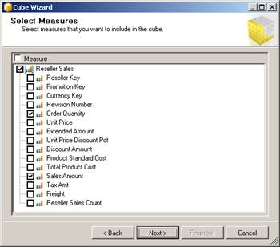
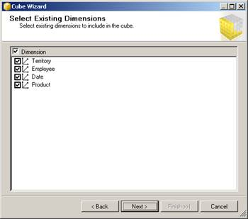
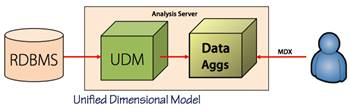
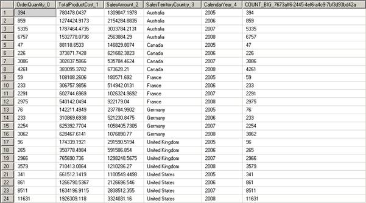
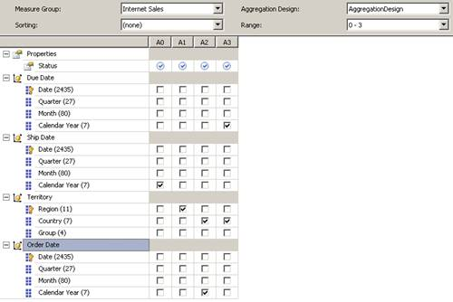
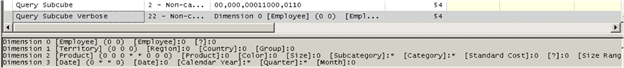
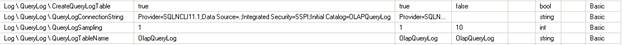
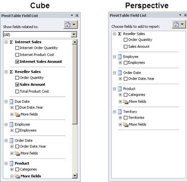

# 四、开发立方体

一般来说，我更喜欢在开发多维数据集之前构建大部分(如果不是全部)维度，但是当您使用多维数据集向导时，也可以生成骨架维度对象。正如我在本章中所解释的，您可以使用向导来选择成为多维数据集中度量值组的表，并标识要与多维数据集中的维度。完成向导后，您可以配置度量值的属性，并根据需要调整维度和度量值组之间的关系。作为多维数据集开发过程的一部分，您还可以配置分区和聚合来管理存储和查询性能。或者，您可以添加透视图来提供多维数据集的备用视图，并添加翻译来支持多种语言。

## 立方体向导

多维数据集向导提供了一系列页面来启动多维数据集的开发。要启动多维数据集向导，请右键单击解决方案资源管理器中的**多维数据集**文件夹。在向导的**选择创建方法**页面，保留默认选择，**使用现有表格**。就像维度向导一样，当您想要生成与指定要求相匹配的表时，多维数据集向导提供了其他选项。在**选择度量值组表**页面上，如图 38 所示，DSV 的所有表都是可见的，您可以选择要用作度量值组表的表。通常，度量值组表与星型架构中的事实表相同，但这里不使用该术语，因为您可以使用其他结构中的数据。通常，度量值组表是一个包含用户想要分析的数值的表，并且与 DSV 的维度表有外键关系。

图 38:多维数据集向导的选择度量值组表页面

|  | 提示:如果您不确定选择哪些表，请单击“建议”按钮。该向导检查 DSV 表之间的关系，并提出符合事实表一般特征的表。对于不是专业商业智能开发人员但想要构建多维数据集的人来说，此功能非常有用。 |

选择度量值组表后，您会在向导的下一页看到每个表中具有数字数据类型的所有列的列表，如图 39 所示。有些列可能不是度量值，而是维度的键，因此在选择所有项之前，请务必查看列表。此外，您不需要将表中的所有度量值添加到多维数据集中。

图 39:多维数据集向导的选择度量页面

向导的下一页显示数据库中已经存在的维度，如图 40 所示。也就是说，该列表包括当前在解决方案资源管理器中可见的维度。您可以选择部分或全部维度添加到多维数据集中。

图 40:选择多维数据集向导的现有维度页面

|  | 注意:如果向导检测到可以从度量值组表创建维度，在向导完成之前，您将在向导中看到另一页。这是一种先进的多对多关系设计，本书没有涉及。如果您不熟悉处理多对多关系，请清除此页面上的选项。要了解更多关于多对多关系的信息，请参见[多对多革命 2.0](http://www.sqlbi.com/articles/many2many/) 。 |

完成多维数据集向导后，您会在多维数据集设计器中看到结果，如图 41 所示。多维数据集设计器有许多不同的选项卡，其中一些将在本章中探讨，其他的将在第 5 章“使用 MDX 增强多维数据集”和第 6 章“管理分析服务数据库”中探讨第一个选项卡用于处理多维数据集结构。在左上角，您可以看到到目前为止添加到多维数据集中的所有度量。默认情况下，这些度量出现在树视图中。如果多维数据集中有多个度量值组，则可以看到每组度量值都组织在各自的度量值组下面。

图 41:多维数据集设计器的多维数据集结构选项卡

## 措施

构建多维数据集后要执行的第一项任务是查看每个度量的属性，并在适当的地方调整设置。您应该特别注意选择合适的聚合函数。如果您稍后决定向多维数据集添加更多度量值，则可以通过添加新的度量值组轻松添加单个度量值或多个度量值。

### 测量属性

您至少应该查看以下属性，如图 42 所示:**名称**、**格式字符串**、**可见**、**显示文件夹**和**聚合功能**。

图 42:测量属性

每项测量首先要检查的是其**名称**属性**。**确保名称出现正确，对用户来说不含糊。多维数据集中所有度量值组的度量值名称必须唯一。

接下来，为每个度量设置 **FormatString** 属性，以便在 Excel 等多维数据集浏览器中测试多维数据集时更容易读取值。您可以指定一个内置的格式字符串，例如**货币**或**百分比**，或者您可以像在 Excel 中一样使用自定义格式字符串。

您也可以通过将其**可见**属性更改为**假**来选择隐藏度量。如果执行此操作，度量将继续用于计算，但浏览多维数据集的任何人都无法看到该度量。

如果度量值组包含一长串度量值，您可以通过指定**显示文件夹**值将它们组织成组。第一次引用文件夹时，必须直接键入名称。之后，该文件夹在下拉列表中可用，以便您可以将其分配给其他度量。

最后，回顾一下最重要的属性 **AggregateFunction** 。默认值为**求和**，指示分析服务在返回查询结果时按维度将事实表中的每条记录相加。在下一节中，我将解释每个可用的聚合函数。

### 聚合函数

有几种不同类型的聚合函数可用:

*   **求和**。最常用的聚合函数是**求和**函数。当您在查询中使用函数时，维度成员的列表会在行或列(或两者)中显示，并且度量值会显示在交叉点上。当维度成员是“全部”级别或用户层次结构中有子代的级别时，度量值是您在特定行上看到的成员的子代值的总和，如图 43 所示。换句话说，Q1 2006 的值是 2006 年 1 月、2006 年 2 月和 2006 年 3 月的值的总和。同样，2006 年的值是 2006 年 Q1、2006 年 Q2、2006 年第三季度和 2006 年第四季度的值之和。

图 43:按维度成员聚合度量

*   **计数**。这是另一个常见的功能。您可以使用它来获取与当前维度成员的子代相关联的事实表中非空行的计数。
*   **最小值，最大值**。您可以使用这些函数来查找成员子代的最小值或最大值，尽管这些函数不太常用。
*   **区别计数**。此函数返回在事实表中找到的维度中唯一成员的数量。当您为度量分配不同的计数函数时，它会被放在单独的度量值组中以优化性能。为了获得最佳性能，请仅将整数值用于不同的计数。
*   **无**。当您的度量是由于某种原因无法分解的计算时，例如当您有一个要包含在多维数据集中用于其他计算的百分比值时，您可以通过将**聚合**功能设置为**无**来防止该度量的聚合。

有几个聚合函数被认为是半可加的。当使用半加性聚合函数时，只要当前维度不是**日期**维度，度量就使用**求和**函数进行聚合。在**日期**维度中，聚合行为取决于您为度量指定的半加法函数:

*   **通过账户**。当您使用此聚合函数时，您的多维数据集还必须包含一个具有帐户类型的维度，并正确设置属性类型，以便正确地将帐户标识为资产、负债、收入和费用。使用此聚合函数，事实表值会根据显示的帐户类型按时间适当相加。有关更多信息，请参见[将帐户智能添加到维度](http://msdn.microsoft.com/en-us/library/ms174759.aspx)。
*   **平均儿童**。例如，如果当前维成员是日历年层次结构(如 Q2 2008)的季度级别的成员，Analysis Services 将使用此聚合函数对其三个月的值(2008 年 4 月、2008 年 5 月和 2008 年 6 月)进行求和，并将结果除以 3。
*   **第一个孩子，最后一个孩子**。这些聚合函数对于快照度量很有用，例如库存计数，您可以在每月的第一天或最后一天加载带有余额的事实表。然后，Analysis Services 用第一天或最后一天的值按月响应查询，而按季度返回查询的第一个月或最后一个月的值。
*   **第一个非空，最后一个非空**。这些功能的表现很像**第一个孩子**和**最后一个孩子**。但是，Analysis Services 不是显式使用第一个或最后一个子级，而是仅当它有值时才使用第一个或最后一个子级。如果没有，分析服务会继续查看每个后续(或先前)子级，直到找到一个不为空的子级。例如，使用**first none empty**，Analysis Services 会查看第二子对象、第三子对象等，直到找到具有值的子对象。同样，使用**lastonempty**，它会查看倒数第二个孩子、之前的孩子和之前的孩子，以此类推。

|  | 注意:重要的是要知道，半加法函数仅在企业版和商业智能版中可用于生产。您还可以使用开发人员版创建一个项目，稍后将其部署到生产服务器。一个例外是 LastChild 函数，它在所有版本中都可用。 |

### 附加措施

开发多维数据集时，您可能会发现需要为多维数据集创建额外的度量。只要测量值在 DSV，您就可以在立方体设计器的**立方体结构**选项卡上的**测量值**窗格中的任意位置单击鼠标右键，并选择以下选项之一:

*   **新措施**。使用该选项从对话框中添加一个度量，如图 44 所示。您还必须指定用法，这将设置聚合函数。

图 44:添加新措施

*   **新度量组**。使用此选项，您可以看到 DSV 当前的表格列表。选择表时，所有具有数字数据类型的列都将作为度量值添加到多维数据集中。在这种情况下，您可能需要删除几个列，因为一个或多个维度键可能作为组的一部分添加。

图 45:添加新的度量值组

## 角色扮演维度

当一个维度在一个多维数据集中被多次用于不同的目的时，就会出现一种特殊的情况，称为角色扮演维度。在向您展示角色扮演维度的外观之前，让我解释一下数据库维度和多维数据集维度之间的区别，以及在 DSV 中支持多维数据集中角色扮演维度所需的数据结构。

考虑 AdventureWorksDW2012 示例数据库，它只包含一个日期表 DimDate，您可以在 Analysis Services 项目中为其创建维度对象。出现在解决方案资源管理器中的任何维度都是数据库维度。您不仅可以将数据库维度与添加到数据库中的一个或多个多维数据集相关联，还可以为多维数据集中的每个维度实例配置不同的属性。但是，每个多维数据集维度继续在数据库级别共享该维度的公共属性。

为了构建数据以支持角色扮演维度，DSV 中的事实表有多个与同一个维度表有关系的列，如图 46 所示。在本例中，经销商销售表(事实表)与日期表中的日期键列有多个关系，这些关系基于事实表的订单日期键、到期日期键和发货日期键。每一栏都有不同的含义。订单日期键存储销售日期的值，到期日期键存储承诺交货日期的值，发货日期键是发货日期。每一列都与同一个日期维度相关联，因为任何给定的日期都具有相同的属性——同一个月、同一个季度、同一年、同一天等等。

图 46:角色扮演维度的多个外键关系

当您将日期维度添加到多维数据集中时，多个关系的存在会触发将维度的多个版本作为角色扮演维度添加到多维数据集中，如图 47 所示。如果您愿意，您可以重命名每个角色扮演维度，或者根据用户的分析要求隐藏或删除它们。您可以在**多维数据集结构**选项卡上重命名维度，因为多维数据集维度的名称，无论它是否是角色扮演维度，都是在多维数据集级别设置的属性，不会影响数据库级别的维度名称。

图 47:分析服务中的角色扮演维度

## 维度用法

就像您在 DSV 定义事实表和维度表之间的外键关系一样，您也可以在多维数据集设计器的**维度用法**选项卡上定义度量值组和多维数据集维度之间的关系。事实上，如果您在 DSV 中正确定义了外键关系，则通常会正确定义维度使用关系，而无需您的进一步干预。但是，有时不会自动检测到关系，这在向现有多维数据集中添加度量值组时比使用多维数据集向导时更常见。

当您希望看到单独的值时，当您看到跨维度成员重复的度量的总计值时，您可以认识到维度使用中的问题。例如，在图 48 中，“销售额”列为每个类别显示单独的值，而“互联网销售额”列重复总计值。

图 48:由于缺少关系导致的聚合错误

在多维数据集设计器的维度用法选项卡上，如图 49 所示，您可以看到产品维度和互联网销售度量值组之间的交集是空的。维度用法是度量值组中的度量值与维度之间的链接。如果缺少链接，Analysis Services 无法按维度成员聚合事实表记录，并且只能显示所有事实表记录的聚合值。

图 49:多维数据集设计器的维度用法选项卡

若要添加正确的关系，请单击维度和度量值组之间的交集，然后单击显示的省略号按钮。在**定义关系**对话框中，如图 50 所示，在**选择关系类型**下拉列表中选择**常规**，然后在事实表中选择键列定义为外键列的属性。最后，在**测量组列**下拉列表中选择该外键。

图 50:维度使用关系定义

部署项目以更新多维数据集后，可以通过浏览多维数据集来测试结果。有了为维度使用定义的关系，现在可以正确显示互联网销售额的值，如图 51 所示。

图 51:校正的聚合

## 分区

分析服务将事实数据存储在名为分区的对象中。您可以使用多个分区来优化服务器上用户和管理任务的查询体验，但是您需要了解如何开发合适的分区策略来实现您的目标。进行分区的主要原因是管理物理存储，因此了解您拥有的不同选项非常重要。然后，如果以后需要更改多维数据集的物理结构，您可以执行设计分区和合并分区所需的步骤。

### 划分策略

对于最终用户来说，多维数据集看起来像一个单独的对象，但是您可以将多维数据集中的数据作为单独的分区进行管理。更准确地说，每个度量值组都在一个单独的分区中，但是您可以创建多个分区来实现多维数据集的特定性能和管理目标。您应该考虑将度量值组划分为单独的分区，主要有三个原因:

*   **优化存储**。您可以为每个分区定义不同的存储模式:MOLAP、HOLAP 或 ROLAP。您的选择会影响数据如何以及是否存储在磁盘上。您还可以将每个物理分区放在不同的驱动器上，甚至放在不同的服务器上，以分发磁盘输入/输出操作。我将在本章的下一节中解释更多关于 MOLAP、HOLAP 和 ROLAP 存储模式的内容。
*   **优化查询性能**。您还可以设计分区来控制每个分区的内容。当查询可以在单个分区中找到所有数据时，它会更快地检索这些数据。但是，即使数据分布在多个分区上，分区扫描也可以并行进行，并且比扫描单个大分区要快得多。此外，您可以为每个分区设置不同的聚合级别，这可能会影响存储聚合所需的额外存储量以及查询的运行速度。
*   **优化加工**。通常，加载到多维数据集中的数据不会改变。这意味着您可以加载一次，然后将它留在那里。处理是将数据加载到立方体中的机制，您将在[第 6 章](6.html#_Chapter_6_)中了解更多信息。如果将数据分成多个分区，则可以将处理限制在一个小分区中，以加载当前数据，并将其他未更改的数据保留在单独的分区中。这使得处理执行得更快。此外，即使您必须处理多个分区，您也可以并行处理它们，从而减少处理所需的总时间。您可以实现的并行度取决于您用于分析服务的服务器硬件。

创建分区策略时，可以使用不同的存储模式、聚合级别，并为每个分区分配可变的行数。例如，您可以在当年分区中拥有几个月的数据，在上一年拥有 12 个月的数据，在历史分区中拥有 5 年或 60 个月的数据。这种方法的另一个好处是能够维护移动的数据窗口。您可以轻松地丢弃旧数据并添加新数据，而不会中断您希望保留在多维数据集中的其他数据。

### 存储模式

默认存储模式称为 **MOLAP** ，是多维 OLAP 的缩写。使用 MOLAP，如图 52 所示，所有数据、元数据和聚合都由分析服务存储和管理。当您处理多维数据集时，会根据 UDM 中定义的规则从关系源中读取数据，该规则代表统一维度模型。UDM 是包含所有维度和多维数据集定义的元数据，描述了分析服务需要如何存储数据，并包含聚合设计，服务器在加载事实数据后处理聚合，以将聚合包含在存储在服务器上的数据中。当客户端应用程序向服务器发送 MDX 查询时，服务器通过查询多维数据集中的数据或聚合进行响应。

图 52: MOLAP 存储

|  | 注意:MOLAP 存储是在分区中存储数据的有效方法。它被高度压缩和索引，并且不需要像源数据那样多的空间来存储数据。 |

另一种存储模式称为 **HOLAP** ，代表混合动力 OLAP。使用 HOLAP，只有聚合数据和 UDM 存储在服务器上，但是数据保留在关系数据库中，如图 53 所示。处理多维数据集时，分析服务从关系源读取并计算聚合，然后将其存储在服务器上。当客户端应用程序向服务器发送 MDX 查询时，服务器会尽可能用从聚合中派生的结果进行响应，这是最快的查询类型。但是，如果不存在回答查询的聚合，则服务器使用 UDM 将 MDX 查询转换为 SQL 查询，然后将该查询发送到关系源。在这种情况下，查询性能可能会比数据存储在 MOLAP 中时慢。

图 53: HOLAP 存储

由于其他原因，当大型关系仓库就位，并且大多数查询可以由聚合来回答时，最常使用 HOLAP 存储。如果 MOLAP 和 HOLAP 之间的性能差异很小，那么当您想要避免创建 MOLAP 数据存储的额外处理开销，并且需要详细数据的查询数量很少时，HOLAP 可能是一个更好的选择。

第三种存储模式叫做 **ROLAP** ，代表关系型 OLAP。使用 ROLAP，只有 UDM 存储在服务器上，而数据和聚合保留在关系数据库中，如图 54 所示。处理多维数据集时，不会从关系源中读取任何数据，而是由分析服务在处理过程中检查分区元数据的一致性。此外，如果您为 ROLAP 分区设计聚合，分析服务会创建索引视图。因此，没有像 MOLAP 或 HOLAP 模式那样以详细或聚合形式存储在分析服务中的额外数据副本。

图 54: ROLAP 存储

在 ROLAP 模式下，当客户端应用程序向服务器发送 MDX 查询时，服务器将请求翻译成 SQL，并从源返回结果。查询性能比以 MOLAP 模式存储数据时要慢。然而，这种方法的好处是可以访问新鲜数据进行实时分析。在 MOLAP 模式下，数据仅与上次处理分区时一样新。

您也可以在 ROLAP 存储模式下存储维度数据。执行此操作时，维度数据不会在处理过程中被复制到分析服务。相反，仅在响应查询时检索维度数据。分析服务维护一个随每个请求更新的维度数据缓存。该缓存是分析服务在向关系源发出 SQL 查询之前首先查看的地方。您只能对具有数亿成员的非常大的维度使用此选项，这使得它成为分析服务中很少使用的功能。

您对正确存储模式的选择取决于您的要求。具有近实时数据访问需求的较大数据量受益于 ROLAP 模式。在这种情况下，对多维数据集的查询会在数据被插入关系数据库后立即返回数据，而不会产生处理数据所需的时间开销。另一方面，MOLAP 查询往往比 ROLAP 查询更快。

### 分区设计

创建新分区时，有两种设计方法:表绑定或查询绑定。

通过**表绑定**，一个度量值组有多个事实表，每个事实表包含一组单独的数据。例如，您可能有不同时间段的单独事实表。在这种情况下，您可以将每个单独的表绑定到特定的分析服务分区。

分区不需要有公共边界。这意味着一个分区可以有一个月的数据，另一个分区可以有一年的数据，第三个分区可以有五年的数据。无论如何，源事实表需要包含要加载到分区中的数据。使用表绑定方法时，无法从事实表中筛选出数据。该分区包含与整个表相关联的所有数据。

|  | 提示:表绑定的问题在于，对事实表结构的更改需要您手动更新每个分区定义以与之对应。避免这个问题的一种方法是将分区绑定到视图，而不是表。 |

另一种选择是使用**查询绑定**。这样，您可以将所有数据放在一个表中，这样在加载事实表时可能更容易管理。每个分区的查询都包含一个 WHERE 子句，用于限制分析服务在处理过程中从表复制到分区的行。

|  | 提示:查询绑定的潜在问题是您必须非常小心，不要让两个分区重叠。确保每个 WHERE 子句获得一组唯一的行。Analysis Services 不会跨分区检查重复的行，如果您无意中创建了此错误，则多维数据集中的数据将是错误的。您还应该知道，查询绑定会破坏度量值组与数据源视图的关系。因此，如果您稍后对数据源视图进行更改，这些更改不会更新分区。你必须手动操作。因此，设置分区应该是多维数据集开发过程的最后一步。 |

### 分区合并

您可能会决定在某个时候将两个或多个分区合并成一个。这个过程叫做合并分区。假设您有一个分区策略，将每年分配给一个单独的分区。随着查询模式的变化，您可能更喜欢将最早的两个分区合并成一个分区。为此，您可以使用 SSMS 的对话框手动合并分区。如果这是一个很少运行的进程，这是完成这项任务的绝佳方式。

如果您更喜欢自动化这个过程，您可以在 Management Studio 中创建一个 XMLA 脚本来运行合并。然后，您可以使用执行 DDL 任务将脚本合并到集成服务包中。您还可以在脚本中为分区标识符创建变量，以便可以重用它来合并其他分区。

## 聚合

分析服务中快速查询性能的关键是向每个多维数据集添加聚合。在分析服务数据库中拥有可用的聚合与在数据仓库中拥有汇总表非常相似，只是您不必像使用汇总表那样构建或维护聚合。分析服务完成大部分工作。

### 聚合向导

您可以通过启动聚合向导来开始添加聚合的过程。为此，请打开多维数据集设计器的**聚合**选项卡，然后单击第一个工具栏按钮。在向导的**查看聚合用法**页面上，您可以调整设置来微调聚合设计过程，但在大多数情况下，默认设置就足够了。

在向导的**指定对象计数**页面上，如图 55 所示，您可以单击**计数**从与度量值组和维度对象相关联的表中检索实际行计数，或者您可以键入一个估计计数，以便在开发数据库时更准确地反映您的生产环境。多维数据集对象列表包括用户定义的层次结构中包含的度量值组和属性。

聚合向导使用估计的计数来计算属性中成员相对于事实表行的比率，并确定该属性是否是聚合的候选属性。例如，由于**组**属性的成员数为 4，**factresellerselsales**中的记录数为 60，855(当使用 AdventureWorksDW2012 数据库作为源时)，聚合向导很有可能(但不能保证)会生成至少一个包含**组**的聚合。通常，如果属性成员的数量比事实表记录少 30%或更少，Analysis Services 会将该属性视为聚合的候选属性。

图 55:聚合向导的指定对象计数页面

在下一页，如图 56 所示，您可以选择以下聚合选项之一:

*   **预计储存量**。使用此选项可以限制聚合的磁盘空间要求。
*   **性能增益**。使用此选项可以添加足够的聚合，以便与针对没有聚合的多维数据集的查询相比，将查询速度提高指定的百分比。默认值为 30%，但应该从 5%到 10%之间的值开始。
*   **停止**。点击**停止**按钮，使用该选项中断聚合设计过程。
*   **不要设计聚合**。使用该选项或点击**取消**停止向导。

图 56:聚合向导的指定对象计数页面

|  | 注:详见[聚合设计策略](http://web.archive.org/web/20130829032108/http:/sqlcat.com/sqlcat/b/technicalnotes/archive/2007/09/11/analysis-services-2005-aggregation-design-strategy.aspx)。尽管本文是为 SQL Server 2005 Analysis Services 编写的，但这些原则仍然适用于 SQL Server 2012 Analysis Services 的所有更高版本。 |

在向导的最后一页，您可以选择部署更改并计算聚合，或者保存聚合设计而不将更改部署到服务器(以防您想先对数据库设计进行其他修改)。通过完成向导，您可以将一个或多个聚合设计添加到项目中。如果您还部署了聚合，分析服务将使用此聚合设计来计算聚合并将结果存储在磁盘上。

聚合设计是分析服务用来定义要包含在聚合中的维度的模板。虽然您可以在 SSDT 或数据库脚本中看到聚合设计，但是如果您对度量值组分区使用默认的 MOLAP 存储模式，则无法看到聚合值本身。但是，如果您使用 ROLAP 存储，您可以看到 Analysis Services 用于聚合的索引视图，如图 57 所示。要设置 ROLAP 存储，单击度量值组的多维数据集设计器的**分区**选项卡上的**存储设置**链接，选择**实时 ROLAP** ，单击**选项**按钮，并选择**启用 ROLAP 聚合**复选框。

图 ROLAP 聚合的索引视图

正如您将在[第 6 章](6.html#_Chapter_6_)中了解到的，ROLAP 存储将多维数据集的所有数据保存在关系数据库中，包括聚合。然而，MOLAP 存储以专有格式保存磁盘上的所有数据。当用户使用 MOLAP 存储对度量值组执行查询时，Analysis Services 执行的查询返回的数据与您在索引视图中看到的非常相似。本质上，它查询事实数据，并对指定的属性执行分组操作。但是，当度量值组使用 ROLAP 存储时，分析服务会对 ROLAP 数据执行关系查询。每次处理多维数据集时，每个聚合都会更新，以与度量值组数据保持同步。

### 聚合设计器

要了解聚合设计如何对应于聚合本身，让我们看看聚合设计器。要打开聚合设计器，如图 58 所示，单击多维数据集设计器的**聚合**选项卡。接下来，点击工具栏中的**高级视图**，在**度量组**和**聚合设计**下拉列表中进行选择。

图 58:聚合设计器

第一个聚合标记为 A0，这是聚合 0 的缩写。此列中的复选框标识要包含在聚合中的属性。在这种情况下，A0 仅包括日历年汇总。包含日历年和国家的 A3 聚合是对应于图 57 所示索引视图的聚合。当用户查询要求按发货日期日历年、按地区、按国家/地区和订单日期日历年或按到期日期日历年和国家/地区进行度量时，这四种聚合非常有用。此外，在“地区”维度中按组进行的销售查询可以使用按国家/地区进行的聚合来导出组值，这比在查询时将事实数据相加并按国家/地区进行分组要快得多。

但是，如果用户要求按地区和年份进行销售，分析服务不能使用任何这些聚合。相反，它必须将事实表中的单个事务相加，并按区域和年份分组，对于成千上万的行，这比这些聚合中的少数几行要长得多。同样，这些聚合无法回答按国家和订单日期季度进行的销售查询，也无法回答按国家和订单日期月份进行的销售查询。

Analysis Services 使用一种算法来生成最有助于回答查询的聚合集，试图在存储、处理时间和查询性能之间取得平衡，但不能保证它创建的聚合是最适合用户查询的聚合。分析服务可以使用任何属性来构建聚合。本质上，它进行成本效益分析，以确定与在运行时计算聚合值相比，它从聚合的存在中获得了最大的价值。

使用聚合向导后，或者即使选择不使用该向导，也可以使用聚合设计器添加新聚合或修改现有聚合。假设您已经意识到了一些查询性能问题。您可以使用 SQL Server Profiler 启动跟踪并查看跟踪结果，以了解是否正在使用聚合，并查看正在请求哪些数据。如果分析服务可以使用聚合，您将在跟踪中看到事件，如图 59 所示。您还可以通过将聚合与您在聚合设计器中看到的数字进行匹配来查看使用了哪个聚合。此外，您可以测量关联的查询子多维数据集事件的持续时间。如果持续时间少于 500 毫秒，聚合不需要任何更改。

图 59:具有聚合命中的 SQL Server 事件探查器跟踪

当您发现没有聚合但持续时间很长的查询子多维数据集事件时，可以使用查询子多维数据集详细事件中的信息来确定聚合设计中应该包含哪些属性。在文本字段中，任何旁边没有 0 的属性都是候选属性。例如，在图 60 中，您可以看到属性子类别、类别、日历年和季度都用星号显示。因此，您应该考虑为子类别和季度创建聚合。

图 60:具有聚合命中的 SQL Server 事件探查器跟踪

|  | 提示:没有必要为同一类别中较高级别的属性创建聚合。也就是说，您不需要为年份创建聚合，因为较低级别的季度聚合就足够了。同样，子类别聚合不需要创建类别聚合。 |

聚合设计器的“高级”视图中的工具栏允许您创建新的聚合设计，方法是从空聚合设计开始，或者创建现有设计的副本。如果查询所访问的分区上没有现有的聚合设计，或者想要替换现有的聚合设计，则可以这样做。只需点击工具栏上的**新建聚合设计**即可开始新的设计。然后，您可以单击工具栏上的**新聚合**来添加新聚合，并选择支持用户查询所需的层次结构的最低级别属性的复选框。在前面的示例中，选择仅包括子类别和季度属性。

### 基于使用的优化

聚合向导的问题在于，聚合设计过程是基于维度成员相对于事实记录的计数。实际上，如果聚合对实际执行的查询没有帮助，那么创建聚合就没有意义。幸运的是，您可以使用基于使用的优化(UBO)来找出哪些查询正在运行，并设计聚合来更好地支持这些查询。

要使用 UBO，首先需要在分析服务器上配置查询日志。打开 **SQL Server 管理工作室**，连接到分析服务，右键单击服务器节点，然后单击**属性**。有四个属性需要配置，如图 61 所示。

图 61:具有聚合命中的 SQL Server 事件探查器跟踪

默认情况下，查询日志记录机制未启用。要启用它，请将 **CreateQueryLogTable** 属性设置为 *true* 。对于**查询连接字符串**属性，您必须为要存储日志的 SQL Server 数据库提供连接字符串。此外，您需要指定采样率。对于查询的初始分析，您应该将**查询采样**值更改为 1 以捕获每个查询。最后，您可以在 **QueryLogTableName** 属性中自定义存储查询日志数据的表的名称。默认表名为 **OlapQueryLog** 。

|  | 提示:捕获完日志数据后，可以清除连接字符串以停止日志记录。如果保持查询日志记录处于活动状态，当您进行影响聚合设计的结构更改时，例如更改度量值组中的度量值数量、更改与度量值组关联的维度数量或更改为维度定义的属性数量，Analysis Services 会从表中删除记录。 |

启用查询日志后，您可以运行标准报告，或者让用户使用他们最喜欢的工具浏览多维数据集一段时间，例如一周或一个月。在此期间，有关查询的使用信息会添加到查询日志表中。此表按数据库、查询的分区和用户跟踪查询。它还记录使用的数据集、开始时间和查询持续时间。数据集的格式与您在探查器中看到的查询子多维数据集事件相匹配。

当您准备好根据使用情况设计聚合时，请启动基于使用情况的优化向导。在 SSDT，单击多维数据集设计器中**聚合**选项卡工具栏上的第二个按钮。启动向导后，您可以按日期、用户或最频繁的查询过滤查询日志的内容。如果需要按其他值进行筛选，可以执行一个 T-SQL 脚本来手动删除查询日志中的行。

当您逐步完成向导时，您可以看到有关查询的信息，例如使用的属性、查询中属性组合的频率以及查询的平均持续时间。您不能在此处更改任何信息，但您可以对其进行排序，并查看捕获了什么类型的活动。基于用途的优化向导中的其余步骤与聚合向导中的步骤非常相似。

## 视角

默认情况下，您在多维数据集中创建的所有对象对每个用户都是可见的，除非您对维度、维度成员或单元格应用安全性，如[第 6 章](6.html#_Chapter_6_)所述。当多维数据集包含许多对象时，您可以通过向多维数据集添加透视来简化用户的多维数据集导航体验。这样，用户在浏览元数据以选择查询对象时，只能看到立方体的一个子集，如图 62 所示。

图 62:浏览立方体与透视

要创建透视图，请在多维数据集设计器中打开**透视图**选项卡，然后单击工具栏上的**新透视图**。您可以为新的透视图指定一个名称，然后清除或选择复选框来分别标识要排除或包含的对象，如图 63 所示。

图 63:新视角

您可以在透视中包含以下任何对象类型:

*   度量值组
*   措施
*   计算
*   关键绩效指标
*   尺寸
*   等级制度
*   属性

|  | 注意:透视不能用作安全措施。它的唯一目的是通过在立方体中显示对象的子集来简化用户界面。为了防止用户查看敏感数据，您必须按照[第 6 章](6.html#_Security)所述配置安全性。 |

## 翻译

正如您可以显示第 3 章【开发维度】中描述的维度翻译一样，您也可以设置多维数据集的翻译。但是，没有从关系源检索翻译的选项。相反，您必须手动键入多维数据集、度量值组、度量值、维度和透视的翻译标题。要添加翻译，请打开多维数据集设计器的**翻译**选项卡，单击工具栏上的**新翻译**，并为每个对象键入适用的标题，如图 64 所示。

图 64:立方体中的翻译标题