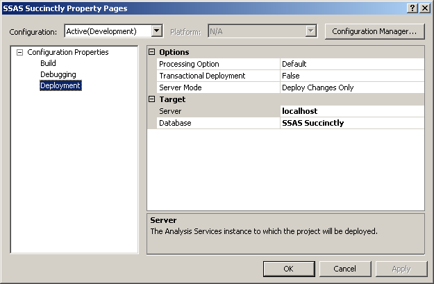
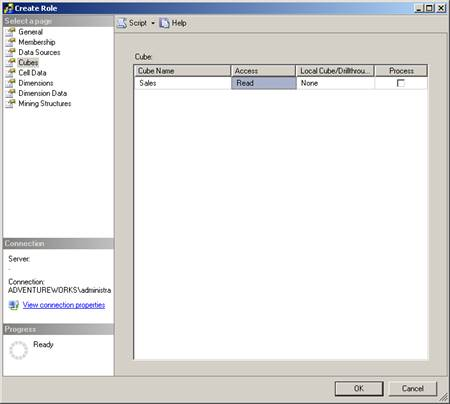
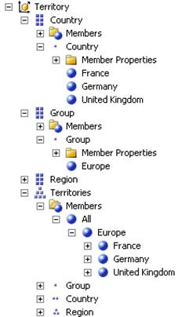
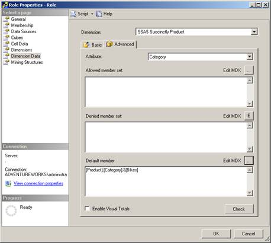
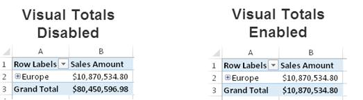
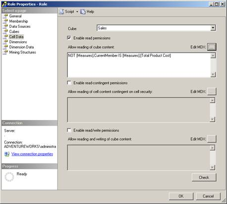
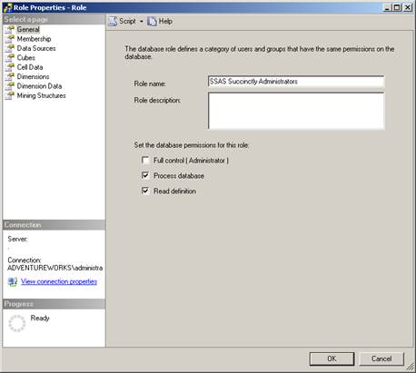
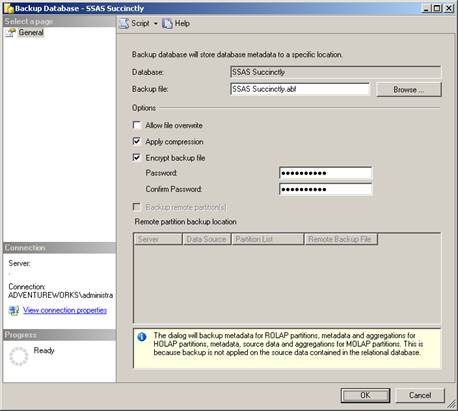

# 第 6 章管理分析服务数据库

到目前为止，我们的重点是开发过程。在开发过程中，您会定期使用 SSDT 的部署命令来部署和处理分析服务数据库。执行此操作时，您可以浏览维度并启动 Excel 来浏览多维数据集。但是，您还没有了解部署和处理数据库的真正含义。在本章中，我首先概述部署以及如何使用部署向导将分析服务数据库从开发转移到生产。然后我解释处理过程中会发生什么。接下来，我将向您展示如何配置安全性，以使用户和管理员能够访问数据库。最后，我回顾了为灾难恢复和横向扩展制作数据库副本的替代方案。

## 部署选项

完成开发任务后，有两种方法可以部署分析服务数据库:

*   部署命令
*   部署向导

### 部署命令

在第 3 章“[开发维度](3.html#_Chapter_3_)”中，您学习了如何在 SSDT 使用“构建”菜单上的“部署”命令。当您对 Analysis Services 数据库设计进行更改时，无论是更新多维数据集中的度量值组还是更改维度中的属性，您都必须部署在开发环境中所做的更改，以便服务器上的数据库反映这些更改，这允许您查看结果。现在让我们仔细看看这个命令执行的三个步骤:

*   建设
*   部署
*   过程

**构建**步骤从项目中的以下每个文件中合并项目中的数据库对象定义:DS、DSV、CUBE、DIM 和 ROLE。整合的结果是一个包含每个数据库对象的 XML 定义的单个 ASDATABASE 文件。

**部署**步骤将 ASDATABASE 文件复制到分析服务服务器的数据文件夹中。默认情况下，此文件夹位于/程序文件/微软 SQL Server/MSAS11。MSSQLSERVER/OLAP。然后从文件中读取单独的对象定义，并再次分解为单独的文件，与 SSDT 项目中的文件结构相匹配。

在**过程**步骤中执行的操作取决于在“项目属性”对话框的“部署”页面上定义的选项。在这里，您可以指定设置来确定是否进行处理，部署操作是否是事务性的，以及要部署哪些对象。

在配置属性中配置**处理选项**时，可以从以下设置中选择，如图 83 所示:

*   **默认**。分析服务根据使用“部署”命令时检测到的更改来确定要执行的处理类型。
*   **不处理**。如果您希望在部署后作为单独的步骤手动控制处理操作，请选择此选项。
*   **满**。如果希望分析服务在使用部署命令后完全处理每个对象，请使用此选项。



图 83:部署属性

项目属性中的另一个选项是事务性部署设置。默认情况下，此设置为“假”，但如果愿意，您可以将其更改为“真”。当您使用事务性部署时，数据库对象的部署和处理都必须成功，才能将更改保留在服务器上。否则，如果任一步骤失败，Analysis Services 会将服务器上的数据库恢复到部署更改之前的状态。

影响部署的最后一个设置是服务器模式，它有以下选项:

*   **仅部署变更**。这是默认设置。分析服务仅部署服务器上不存在或不再匹配的对象。这也是两个选择中比较快的设置。
*   **部署所有**。使用此设置时，分析服务会将所有数据库对象复制到服务器，并替换任何现有对象(如果适用)。

### 部署向导

如您现在所知，部署过程会在服务器上放置一个已更改文件的新副本，服务器使用该副本在处理过程中检索数据库对象的当前定义。虽然可以使用 XMLA 脚本来修改数据库对象，但最好的做法是使用 SSDT 进行设计更改，这样您就可以在源代码控制系统中保存您的工作。但是，在持续的基础上，您可以手动更新服务器上的角色来管理安全性，或者您可以使用脚本或自动化进程来更新数据库对象文件或添加新的分区来保存更新的数据。在这些情况下，您在 SSDT 部署到服务器的任何分区或角色定义都将清除您通过使用 XMLA 脚本直接在服务器上更新的任何内容。

为了在数据库投入生产后，或者当您作为开发人员缺乏将数据库直接部署到生产环境的权限时，更好地管理分区或角色，一个很好的替代方法是使用分析服务部署向导。在启动向导之前，请使用 SSDT 的“构建”命令生成 ASDATABASE 文件。通过打开 Microsoft SQL Server 的“程序组”菜单，然后导航到“分析服务”文件夹，启动可访问的向导。向导将引导您浏览以下页面(如果欢迎页面仍处于启用状态，则在欢迎页面之后):

*   **指定源分析服务数据库**。在这里，您必须提供 ASDATABASE 文件的路径和文件名，或者单击省略号按钮在文件系统中导航以找到并打开该文件。默认情况下，该文件位于项目的 bin 文件夹中。
*   **安装目标**。在此页面上，您必须在“安装目标”页面上指定项目的目标服务器和目标数据库名称。
*   **指定分区和角色的选项**。您在这里的选择会影响现有分区和角色的情况。默认情况下，现有分区将被开发文件中的任何分区定义所替换。如果您想保留服务器上的分区，您需要为分区选择替换选项。在这种情况下，数据库中已存在的度量值组的任何分区都将被忽略，只有新的度量值组及其分区才会部署到服务器。另一方面，角色的默认值是部署新角色，并保持服务器上已有的角色不变。您的其他选项可以是用项目中定义的角色替换服务器上的所有角色，或者忽略项目中的任何内容并保持服务器上的角色不变。
*   **指定配置属性**。您可以配置部署过程，以保留服务器上已经存储的任何现有配置和优化设置。此外，您可以更改数据源的连接字符串、用于处理的模拟信息、错误文件的位置、报告操作的报告位置以及数据库多维数据集、度量值组或分区的存储位置。
*   **选择加工选项**。在这里，您可以选择为与处理相关的项目属性设置设置值:处理方法和事务性部署。如果您的多维数据集配置为支持写回，则需要设置一个附加属性来控制 Analysis Services 是使用现有表进行写回还是创建新表。
*   **确认部署**。如果您希望向导调用部署过程，可以继续完成向导，而不创建部署脚本。另一方面，如果选择创建部署脚本，则必须指定存储向导生成的 XMLA 文件的位置。您可以稍后在 SSMS 打开此文件并执行它来执行部署。

## 处理策略

首次部署分析服务数据库时，它处于未处理状态，并且为空。这意味着没有人可以查询数据库。您需要执行数据库的完整过程，以便用数据加载维度和多维数据集分区。在初始过程之后，您有以下选项来保持数据库中的数据是最新的:

*   全过程
*   过程数据和过程索引
*   流程更新
*   流程添加

### 全过程

如果执行完整数据库进程所需的时间足够少，您可以选择每晚执行一次完整数据库进程。您可以将整个过程安排为 SQL Server 代理作业，或者将其作为分析服务处理任务包含在集成服务包中，如图 84 所示。但是，对于处理时间较长的大型多维数据集，您可能需要实施其他策略。每次执行完整的过程时，现有内容都会从数据库中删除，并且数据会完全重新加载到所有维度和多维数据集分区中。您可以选择在数据库级别、多维数据集级别、度量值组级别或维度级别执行完整的过程。要配置分析服务处理任务，选择流程的目标对象，并在**流程选项**下拉列表中选择**流程满**。


图 84:选择要处理的对象

当您右键单击 SSMS 的数据库、多维数据集、度量值组或维度，并在子菜单上选择 **Process** 命令时，会出现类似的用户界面。但是，在 SSMS，您不能在同一个对话框中选择多个对象进行处理。另一方面，如果打开**流程**对话框，可以点击对话框工具栏中的**脚本**生成如下脚本:

```sql
    <Batch >
    <Parallel>
    <Process xmlns:xsd="http://www.w3.org/2001/XMLSchema" xmlns:xsi="http://www.w3.org/2001/XMLSchema-instance" xmlns:ddl2="http://schemas.microsoft.com/analysisservices/2003/engine/2" xmlns:ddl2_2="http://schemas.microsoft.com/analysisservices/2003/engine/2/2" xmlns:ddl100_100="http://schemas.microsoft.com/analysisservices/2008/engine/100/100" xmlns:ddl200="http://schemas.microsoft.com/analysisservices/2010/engine/200" xmlns:ddl200_200="http://schemas.microsoft.com/analysisservices/2010/engine/200/200" xmlns:ddl300="http://schemas.microsoft.com/analysisservices/2011/engine/300" xmlns:ddl300_300="http://schemas.microsoft.com/analysisservices/2011/engine/300/300">
    <Object>
    <DatabaseID>SSAS Succinctly</DatabaseID>
    <CubeID>Sales</CubeID>
    </Object>
    <Type>ProcessFull</Type>
    <WriteBackTableCreation>UseExisting</WriteBackTableCreation>
    </Process>
    </Parallel>
    </Batch>

```

您可以重复此过程，为每个要处理的对象生成一个脚本。然后，您可以在创建的第一个 XMLA 脚本中将流程节点下每个脚本中的对象元素组合起来。这样，您可以并行处理多个对象。如果您喜欢按顺序处理对象(如果服务器内存受限，这可能是必要的)，您可以从脚本中删除 Parallel 元素。

“分析服务处理任务”和“SSMS”中的“处理”对话框包括一个**批处理设置摘要**部分。点击本部分**更改设置**更新以下设置:

*   **加工订单**。默认处理顺序为**并行**。您可以让服务器决定并行执行多少处理任务，或者设置特定的最大并行任务数。或者，您可以指定顺序处理。
*   **交易模式**。如果按顺序处理任务，则可以指定是将每个任务视为单个事务还是单独的事务。
*   **尺寸误差**。您可以保留默认错误配置，以便在尺寸加工过程中出现问题时自动失败加工，或者按照[加工选项和设置](http://msdn.microsoft.com/en-us/library/ms174774.aspx)中所述定义自定义错误配置。
*   **尺寸键错误日志路径**。如果设置了自定义错误配置，您可以指定一个路径，Analysis Services 将在其中存储包含维度键错误的日志文件。
*   **处理受影响的对象**。您可以指示分析服务处理所有依赖于选定对象的对象。

|  | 注意:如果对维度执行完整的处理，则必须对任何关联的多维数据集执行完整的处理。 |

优化处理的一种方法是在多维数据集中创建分区，如第 4 章“开发多维数据集”中所述常见的分区策略是为不同的时间段创建不同的分区。因此，只需要处理最新的分区，因为旧分区中的数据很少改变。因此，您可以通过仅对当前分区运行完整的进程来限制处理多维数据集所需的时间。分析服务仅删除该分区中的数据，从源重新加载数据，并重建聚合。如果当前分区与整体多维数据集大小相比相对较小，则分区上的完整进程将比处理所有分区更快、更高效。所有其他现有分区保持不变。

### 过程数据和过程索引

使用大型多维数据集或维度时，您可能会发现用“流程数据”和“流程索引”操作替换“流程完整”操作更有效。通过将这两个包含在“流程完整”中的操作分开，您可以使分析服务一次将资源集中在一个操作上，从而获得更好的性能。但是，这通常只有在处理大数据量时才有必要。

### 流程更新

另一个比“处理完整”操作花费更少时间的选项是只向数据库添加新数据或更新已更改的数据。此选项仅适用于尺寸。“进程更新”操作加载所有新的维成员，并根据需要对现有维成员进行更改。

在维度上执行“完全处理”后，执行“完全处理”更新不需要在多维数据集上执行“完全处理”操作。在多维数据集中，有在多维数据集分区中存储数据时创建的维度成员的内部标识符。当您在维度上运行“完全处理”时，即使加载了相同的数据，也不能保证每个维度成员都获得相同的内部标识符，因此多维数据集变得无效。使用进程更新，标识符保持不变。唯一潜在的问题是，如果将成员从层次结构中的一个父代移动到另一个父代，并且定义了灵活的属性关系，则该层次结构的任何聚合都将失效。可以查询多维数据集，但是查询可能会运行得更慢，直到使用多维数据集上的进程索引或进程默认操作重建聚合。

### 过程添加

如果已经加载的维度数据没有变化，并且只有新的维度记录要定期添加，则可以使用“处理添加”操作插入新记录。此操作比进程更新运行得更快，并且对多维数据集没有影响。添加新的维度成员时，不必重建聚合也不必处理多维数据集。另一方面，因为流程添加需要一些额外的配置，所以它不是一个特别简单的选项。Artis Consulting 的 SQL Server MVP 和 BI 架构师 Greg Galloway 在博客中提到了[流程添加示例](http://www.artisconsulting.com/blogs/greggalloway/Lists/Posts/Post.aspx?ID=4)，并解释了您可以根据自己的需求进行调整。

如果您使用的是标准版，则每个度量值组最多可以维护三个分区，但是您仍然可以通过使用进程添加将数据插入现有分区来有效地管理新分区数据。(顺便说一句，当您使用图形界面配置处理时，这显示为进程增量。)这种方法可能比在分区上运行 Process Full 要快得多。但是，重要的是不要让这成为您执行的唯一处理形式，因为当您经常这样做时，可能会出现一些碎片。考虑每晚运行进程添加，然后每周或每月运行进程满。聚合通过进程添加进行更新，因此之后无需运行单独的进程。

## 安全

当您在整个开发过程中构建和部署数据库时，其内容(多维数据集和维度)在默认情况下是安全的。除了数据库开发人员，没有人能够查询多维数据集。为了使用户查询可以访问数据库，需要执行一些额外的任务。此外，您可能需要为需要执行处理任务的用户配置管理安全性。最后，分析服务服务帐户需要特定的权限来支持处理，并在适用时支持查询日志记录和写回。

### 用户安全

您必须在每个数据库的多维数据集级别授予用户对分析服务的访问权限。在执行此操作之前，每个用户都必须有一个 Windows 登录名，并且可以选择将其分配给网络活动目录中的一个 Windows 组。分析服务使用基于角色的安全性，它依赖于 Windows 身份验证。至少，您要创建一个角色，为其分配 Windows 登录名，或者更好的是 Windows 组，并授予该角色访问多维数据集的权限。为了更精确的安全性，您需要采取额外的步骤。例如，您可以在维度级别配置安全性，选择您希望用户看到的成员并排除所有其他成员。通过控制用户可以看到或不能看到的单元格，您还可以获得更精细的安全性。

角色成员资格

要在打开数据库文件夹后在 SSDT 或 SSMS 创建角色，右键单击**角色**文件夹，选择**新角色**，并键入角色名称。不需要将数据库权限分配给只需要查询多维数据集的用户。在**创建角色**对话框的**成员资格**页面上，单击**添加**并从活动目录中检索用户登录名或窗口组名。

多维数据集安全性

创建角色并为其分配用户或组后，必须明确授予权限来授权用户可以看到或做的事情。至少，您需要在 SSMS 的**创建角色**对话框的**立方体**页面，如图 85 所示，或者在 SSDT 的角色设计器的**立方体**选项卡上，分配角色**读取**访问每个立方体。您还可以选择指定角色是否有权使用钻取功能或使用客户端工具创建本地多维数据集。



图 85:多维数据集读取权限的分配

维度安全性

使用维度安全性，您可以为维度中的任何或所有属性层次结构创建允许或拒绝的维度成员集。例如，如果您创建了一组允许的成员，用户只能看到分配给该组的成员。相反，如果您配置了被拒绝的集合，则用户可以看到属性层次结构中的所有成员，但该集合中的成员除外。通常，维度安全性限制对特定属性层次结构成员的访问。

假设您希望允许某个角色在“区域”维度的“组”属性层次结构中只看到欧洲。在**维度数据**页面，在页面顶部的下拉列表中选择**地域**维度，然后在**属性层次**下拉列表中选择**组**。选择**取消选择所有成员**清除成员选择，然后选择**欧洲**复选框，如图 86 所示。


图 86:维度安全性

|  | 注意:在维度数据的“高级”选项卡上，您可以使用 MDX 表达式来定义允许或拒绝的集合，而不是在“基本”选项卡上显式选择要包含的成员。 |

维度安全性会影响用户在多维数据集的元数据中看到的内容。图 87 显示了来自 SSMS 的元数据树，该用户被分配到一个角色，该角色在组属性层次结构中只有欧洲是允许的成员。如您所见，属性层次结构的其他成员都不可见:北美、北美和太平洋。用户根本看不到维度中存在这些其他成员。还要注意，在用户定义的区域层次结构中，欧洲仍然是组级别唯一可见的成员，但是欧洲的子代(法国、德国和英国)也是可见的，即使维度安全性没有明确排除这些成员。此外，国家属性层次结构也仅限于用户定义的领土层次结构中属于欧洲的国家。区域维度的属性关系定义基于维度安全性中定义的允许或拒绝成员的选择，控制维度中所有层次结构的安全性。



图 87:跨层次的可见成员

配置维度安全性时可用的另一个选项是指定默认成员。通过定义默认成员，您将为该成员的维度添加一个自动筛选器。例如，假设您有部门经理想要查看各自部门的销售情况。您可以为每个部门创建一个角色，然后为每个角色配置一个默认成员，一个用于自行车管理器，一个用于配件管理器，等等。这样，每次经理运行查询时，他们就不必明确询问他们部门的类别，因为 Analysis Services 会自动为他们各自的角色应用过滤器。但是，这与限制对维度成员的访问不同。如果经理在查询中要求所有类别，只要没有维度安全性限制该信息，他们就可以获得该信息。要添加默认成员，在**维度数据**页面的**基础**选项卡上选择适用的维度和属性层次，打开**高级**选项卡，然后提供成员唯一名称，如图 88 所示。



图 88:默认成员配置

您还可以控制属性的总计是仅显示可见成员的聚合，还是显示层次结构中所有成员的聚合。此功能称为视觉总计，可在**尺寸数据**页面的**高级**选项卡上配置。默认情况下，未选中“启用可视总计”复选框。在 dimension security 仅将用户限制在欧洲的情况下，层次结构的总计显示所有组的总计，如图 89 左侧所示。但是，当选中启用可视总计复选框时，总计将被调整为仅显示可见成员的聚合，如图 89 右侧所示。



图 89:视觉总计功能的效果

细胞安全

管理安全性的另一种方法是应用单元安全性。这将控制用户是否看到度量和尺寸的某些交叉点的数值。您可以在**单元格数据**页面上配置单元格安全性，并选择一个多维数据集，然后选择以下权限选项之一:

*   **启用读取权限**。您提供了一个计算结果为真或假的表达式来指示分析服务是否允许用户看到一个值，如图 90 所示。在这种情况下，表达式检查度量维度的当前成员是否为产品总成本，并且仅当结果为假时才显示值。因此，只有总产品成本度量对用户不可见。相反，会显示一个占位符标记来指示该值不可用。
*   **启用随机读取权限**。选择此选项时，还可以使用返回“真”或“假”的表达式。通常，对于读取或有权限，您引用的度量是基于其他度量的计算。如果用户能够基于读取权限查看所有其他度量，则用户也可以查看计算。例如，由于毛利润取决于销售金额和产品总成本，如果将“或有读取”权限分配给毛利润，则只有当用户对销售金额和产品总成本具有“读取”权限时，用户才能查看该值。
*   **启用读/写权限**。如果多维数据集已启用写回，则可以使用此选项来控制用户可以更新哪些单元格。同样，您使用返回真或假的表达式。



图 90:单元安全性

|  | 提示:如果要从视图中排除多个度量或多个条件，可以使用 or 和 and 运算符将表达式连接在一起。 |

### 管理员安全性

除了用户安全，您可能还需要配置管理员安全。管理员有两个安全级别:服务器和数据库。

服务器管理员安全性

在 SSMS，右键单击**对象资源管理器**中的分析服务服务器节点以访问服务器属性。在**属性**对话框中，安全页面允许您添加 Windows 组或用户作为服务器管理员。在服务器级别，这些用户可以配置安全选项并访问部署到服务器的任何数据库。

|  | 注意:服务器上的内置管理员自动拥有服务器范围的权限，即使没有明确分配给服务器管理员。 |

您还可以创建数据库级管理员。为此，打开一个数据库，为管理员添加一个新角色，然后定义数据库权限，如图 91 所示。例如，如果您希望一组用户能够处理数据库或读取数据库的 XMLA 定义，您可以为这些用户创建一个角色，然后在数据库级别授予这些权限。拥有数据库权限不会自动授予对数据库内容的访问权限。您还必须至少授予多维数据集访问权限，并在适用的情况下定义维度和单元安全性。



图 91:管理员的数据库权限

### 服务账户安全

安装分析服务后，将定义一个服务帐户来运行 windows 服务。定义服务帐户时，可以选择本地用户帐户、域用户帐户或内置系统帐户。最佳做法是使用低权限的域用户帐户。

无论您使用哪种类型的帐户，您都必须确保授予该帐户访问分析服务数据库数据源的权限。如果对多维数据集使用 MOLAP 或 HOLAP 存储，服务帐户只需要对数据源的“读取”权限。但是，如果使用 ROLAP 存储，则必须至少配置读取权限。如果 ROLAP 分区也包括聚合，您还必须配置写权限。

安装分析服务时，应自动设置正确的文件系统权限。如果在没有使用正确方法的情况下更改了服务帐户，则新帐户可能缺乏必要的权限。在其他情况下，当您启用查询日志记录或写回时，不会自动分配权限，因此您必须手动更新适用的数据库。特别是，服务帐户需要以下权限:

*   **备份文件夹**。服务帐户必须对程序文件有完全控制权限。MSSQL server \ OLAP \备份文件夹，以便保存备份文件。
*   **查询日志数据库**。如果启用查询日志为基于使用的优化做准备(在第 4 章“T2”开发多维数据集)中描述)，则服务帐户必须是要在其中创建查询日志的数据库的 db_owner 数据库角色的成员。
*   **写回数据库**。如果在多维数据集中的某个分区上启用了写回，则服务帐户还需要是存储写回表的数据库的 db_owner 数据库角色的成员。

|  | 注意:为了确保文件系统上服务帐户的所有权限都正确，如果需要更改本地或域用户帐户的服务帐户或密码，请确保使用 SQL Server 配置管理器。 |

## 数据库副本

将分析服务数据库投入生产后，您应该为灾难恢复进行备份。备份也是将数据库从一台服务器移动到另一台服务器的有用方法。例如，您可能希望在一台服务器上处理一个数据库，然后让它在另一台服务器上可供查询，或者您可能希望在多台服务器上放置一个副本，以便将查询负载分散到多台服务器上。不管什么原因，复制和移动数据库的方法不止一种。

### 备份和恢复

备份和恢复是一种简单的使用方法。这种方法的一个优点是，您不必在正常的例程中添加另一个操作，因为您应该已经在每次处理数据库时执行了备份。如果您有一个大型数据库，则在发生故障后，通过备份可以比在重新部署分析服务项目文件后执行完整的过程更快地使数据库恢复到工作状态。如果要将单个分析服务数据库分发到多台服务器，可以创建一个备份，根据需要制作多个副本，将每个副本分发到单独的服务器，然后运行恢复操作。

|  | 注意:用户不能在还原过程中查询数据库。 |

要手动执行备份，右键单击 SSMS 的数据库并选择**备份**命令。在对话框中，指定备份文件的名称，并选择选项来控制 Analysis Services 是否可以覆盖现有的备份文件、压缩文件或使用密码加密备份，如图 92 所示。作为另一个选项，您可以单击**脚本**按钮来生成 XMLA 脚本。您可以使用执行 DDL 任务在 SSIS 包中执行脚本，或者使用 SQL Server Analysis Services 命令步骤作为 SQL Server 代理作业执行脚本。



图 92:数据库备份

您可以备份的数据库大小没有限制。备份的实际内容取决于您对多维数据集分区使用的存储模式:

*   MOLAP 存储数据、聚合和数据库元数据。
*   HOLAP 只存储聚合和元数据。
*   ROLAP 只存储元数据。

### 同步

要使用同步，您需要一台分析服务服务器来托管源数据库，另一台分析服务服务器来托管同步副本。右键单击第一台服务器上的数据库，运行**同步**命令启动进程。分析服务会比较这两个数据库，以确定它们之间是否有任何差异。如果数据库不相同，分析服务将使用同步来更新第二台服务器，并且只以压缩形式发送更改。更改的数量会影响性能。另一方面，与还原过程不同，用户可以在同步过程中查询数据库。也就是说，当同步完成时，第二个服务器用更新的版本切换出数据库的旧版本，这不会花费很长时间，但是在此期间不允许任何查询。与备份一样，您可以使用 SSIS 代理或 SQL Server 代理编写同步过程的脚本以实现自动化。

### 分离并连接

使用此方法，您可以右键单击一台分析服务服务器上的数据库，然后选择**分离**命令。然后，您可以将关联的数据库文件移动到另一台服务器上，在那里您可以反转该过程。右键单击分析服务服务器节点，选择**附加**命令。这种方法是使数据库在另一台服务器上可用的一种非常快速的方法。您还可以将数据库放在只读模式的逻辑存储区域网络上，然后让多台服务器连接同一个数据库来创建横向扩展解决方案。