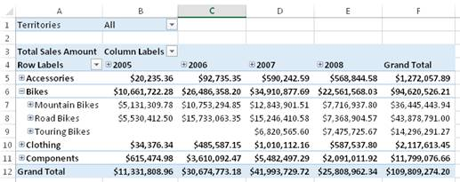
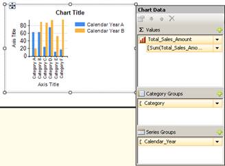
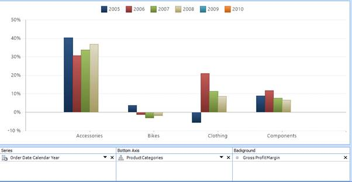
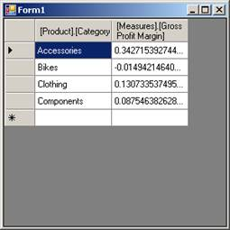

# 第 7 章使用客户端工具

创建分析服务数据库的全部意义在于允许用户查询多维数据集以快速获得业务问题的答案。在本章中，我将向您介绍微软商业智能堆栈中的工具，并向您展示如何使用这些工具连接到分析服务。我还描述了 ADOMD.NET 库中的关键类，您可以使用它们来创建自己的客户端工具。

## 微软商业智能堆栈中的工具

您可以使用 Microsoft 商业智能堆栈中的各种工具来查询分析服务数据库。有些工具主要用于报告多维数据集中的数据，与用户的交互最少，而其他工具主要用于探索多维数据集。在本节中，我将解释将以下工具连接到多维数据集并显示其数据的基础知识:

*   微软优越试算表
*   微软 SQL 服务器报告服务
*   Microsoft SharePoint 服务器

### 微软 Excel

Excel 在业务分析师中是一个受欢迎的工具，他们通常已经熟悉它的功能。连接到多维数据集后，数据透视表和数据透视表图表有助于探索多维数据集中的数据，而不需要了解 MDX 查询语言。

要连接到打开的 Excel 工作簿中的立方体，请单击功能区的**数据**选项卡上的**获取外部数据**，单击【其他来源的 T4】，然后从分析服务中选择**。在数据连接向导中，键入分析服务服务器名称，如果您没有使用 Windows 身份验证来连接自己的帐户，请提供凭据。在向导的下一页，在下拉列表中选择数据库，然后在多维数据集和透视图列表中选择要查询的多维数据集，如图 93 所示。在向导的最后一页，更改文件名并提供一个友好的名称(如果需要)，并将 Office 数据连接(ODC)文件保存到您的本地计算机上，或者使用**浏览**按钮将其保存到网络或 SharePoint 数据连接库中。**


图 93:Excel 中的分析服务数据连接

|  | 注意:虽然这些说明和截图是针对 Excel 2013 的，但 Excel 2007 和 Excel 2010 中也有类似的功能。 |

在出现的**导入数据**对话框中，您可以选择创建数据透视表、数据透视图或超级视图报表。对于本例，假设您想要创建一个数据透视表。在屏幕右侧，显示**数据透视表字段**列表，列表顶部显示按度量值组组织的度量值。您可以滚动列表来查找维度，用户定义的层次结构列在第一位，属性层次结构列在“更多字段”文件夹下。通过选中字段的复选框，可以将字段添加到报表中。当您做出选择时，度量显示在值区域，非日期属性显示在行区域，日期属性显示在列区域，如图 94 所示。如果要添加筛选器，必须将字段从字段列表拖到筛选器区域。


图 94:Excel 中的数据透视表字段列表

当您进行选择时(除非您选择了字段列表底部的**延迟布局更新**复选框)，查询将执行以从多维数据集中检索数据，并根据您在字段列表中定义的布局显示结果。如果向行或列添加用户定义的层次结构，可以单击标签旁边的加号来查看下面级别的数据，如图 95 所示。如果向报表添加筛选器，可以使用透视表上方的筛选器下拉列表进行新的选择并更新报表内容。



图 95:Excel 中的数据透视表字段列表

|  | 提示:您可以将多个字段添加到数据透视表字段列表布局部分的筛选器、列、行或值区域。将字段添加到布局部分后，还可以将其拖到不同的区域以重新排列报表布局。 |

### 微软 SQL Server 报表服务

报告服务是一个商业智能组件，作为 SQL Server 的一部分，支持从报告开发到管理再到用户访问的报告生命周期。尽管报告可以是交互式的，无论是允许用户通过更改报告参数值来过滤内容，还是在相同或不同的报告中从摘要数据钻取到详细数据，但与使用探索性工具(如 Excel)相比，报告更加静态，交互性更差。您必须预先计划您想要支持的交互类型，然后显式地构建该交互。

另一方面，SharePoint 中的 Power View 是 SharePoint 集成模式下最新版本的 Reporting Services 中的一项新功能，支持交互式即席报告。初始版本不支持多维模式下的分析服务连接，但是 [SQL Server 2012 Service Pack 1 累积更新 4](http://support.microsoft.com/kb/2833645) 增加了这一功能。但是，Excel 2013 中的 Power View 当前与多维分析服务不兼容。

要创建可以发布到报表服务服务器的报表，可以使用两种工具之一:SSDT 的报表设计器或报表生成器。报表设计器是为经常同时处理多个报表的专业报表开发人员设计的工具，而报表生成器则是为不太精通技术的用户设计的，他们一次只能处理一个报表。您可以通过在 SSDT 创建报表服务器项目来访问报表设计器，但是您可以从报表管理器 web 应用程序(通常位于 http:// <server>/reports)下载报表生成器。在每个环境中使用布局是相似的，但是两者之间的用户界面略有不同。在报表设计器中，您可以使用菜单、工具栏和工具箱来执行命令和处理报表项，但在报表生成器中，您可以使用功能区界面，就像在 Office 产品中一样。报表生成器还包括几个向导，可以引导您完成在报表中生成项的过程。</server>

|  | 注意:本节仅包括作为数据源连接到分析服务的基本信息。报告服务中的报告开发在可从 Syncfusion 获得的 Windows Azure SQL Reporting 简明电子书[中有更详细的介绍。尽管电子书的重点是 Windows Azure 版本的报告，但针对报告开发描述的功能也适用于内部版本的 SQL Server Reporting Services。](http://www.syncfusion.com/resources/techportal/ebooks/windowsazure) |

报表设计器

要在报表设计器中创建新报表，请在**解决方案资源管理器**窗口中右键单击报表服务器项目的**报表**文件夹，指向**添加**，然后单击**新建项目**。在**报表数据**文件夹中，右键单击**数据源**文件夹，选择**添加数据源**。在**数据源属性**对话框中，提供数据源名称，在**类型**下拉列表中选择**Microsoft SQL Server Analysis Services**，提供连接字符串(或使用**编辑**按钮打开用户界面生成连接字符串)，如图 96 所示。


图 96:报表设计器中的分析服务数据连接

接下来，创建一个数据集来保存查询定义。右键单击**报告数据**窗格中的**数据集**文件夹，选择**添加数据集**。在**数据集属性**对话框中，选择**使用嵌入在我的报表中的数据集**单选按钮，在下拉列表中选择数据源，点击**查询设计器**。在查询设计器中，可以通过单击左上角的省略号按钮并更改当前选择来选择不同的透视或多维数据集。然后，您可以将项目从左侧的元数据面板拖到右侧的查询数据面板中(如果您有一个简单的查询)，如图 97 所示。您可以在查询设计器顶部的过滤器窗格中添加一个维度，并选中该行最右侧的**参数**复选框，以允许用户在报告运行时交互式更改过滤器值。


图 97:分析服务查询设计器

|  | 提示:您可以单击查询设计器工具栏中的最后一个按钮，将设计模式从图形切换到文本。在文本设计模式下，您可以编写 MDX 查询来生成所需的结果。但是，与可以在 SSMS 或其他第三方工具中编写的 MDX 查询不同，您的查询必须只引用 COLUMNS 轴上的度量。只能在查询的 ROWS 轴上使用非度量维度。 |

创建数据集后，您可以设计报表布局。例如，可以通过将“图表”报表项从工具箱拖到报表设计图面上，从多维数据集数据创建图表。选择一种图表类型，如柱形图，然后单击设计图面上出现的图表占位符，打开**图表数据**窗格。单击出现在**图表数据**窗格每个部分的加号，为该部分分配一个字段，如图 98 所示。单击**预览**选项卡，执行数据集查询并查看渲染报告。可以进行进一步的调整来微调图表的外观，例如更改图表和坐标轴标题、更改图表的调色板或调整图表的大小，仅举几个选项。



图 98:报表设计器中的图表报表项

报表生成器

启动报表生成器后，您可以绕过提示您生成新报表的向导，像在报表设计器中一样开发新报表。按照上一节中描述的相同步骤添加新数据源和新数据集。创建数据集后，您可以使用功能区的**插入**选项卡(例如，表格、矩阵、列表或图表)创建任何类型的报告项，并将数据集中的字段添加到该报告项。要预览报告，请单击**主页**选项卡上的**运行**。

SharePoint 中的超级视图

如果您在 SharePoint 集成模式下配置了报表服务器，并且安装了所需的服务包，则可以使用超级视图交互式浏览多维分析服务数据库中的数据。通过阅读以下 TechNet 文章，您可以了解有关配置环境和使用 Power View 的更多信息: [SQL Server 2012 多维模型的 Power View](http://social.technet.microsoft.com/wiki/contents/articles/14700.sql-server-2012-with-power-view-for-multidimensional-models.aspx)。

|  | 注意:在撰写本文时，多维模型的 Power View 仅作为累积更新的一部分提供，并作为修补程序分发。因此，在下一个 SQL Server 2012 服务包中发布之前，它可能不适合生产环境。 |

### 微软 SharePoint 服务器

SharePoint Server 2013(像其前身 SharePoint Server 2010 和 Microsoft Office SharePoint Server 2007 一样)包括几个支持连接到分析服务的商业智能功能:

*   Excel 服务
*   仪表板过滤器
*   性能点服务

Excel 服务

您可以将包含数据透视表和数据透视表图表的 Excel 工作簿发布到 SharePoint，以使多个用户能够与同一工作簿进行交互。在 SharePoint Server 2013 中，桌面客户端应用程序中提供的许多交互功能也可以在浏览器中使用。在早期版本的 SharePoint 中，用户只能钻取、筛选或排序，但不能更改数据透视表或数据透视表图表的内容。

创建要发布的 Excel 工作簿时，最好将与 SharePoint 的 Analysis Services 连接相关联的 ODC 文件作为单独的文件发布，而不是将连接信息嵌入工作簿。要修改连接，请在功能区的**数据**选项卡上单击**连接**，选择适用的连接，然后单击**属性**。在**连接属性**对话框中，点击**定义**选项卡，然后点击**导出连接文件**。在**文件保存**对话框中，在**文件名**框中输入数据连接库的网址，按**进入**，然后输入 ODC 文件的名称进行保存。将显示**网络文件属性**对话框，询问 ODC 文件的标题、描述和关键词。保存文件后，可以在 Excel 的**连接属性**对话框中选择**始终使用连接文件**复选框。

如果数据透视表定义了筛选器，您可以将筛选器转换为参数，以便在必要时将其连接到仪表板中的筛选器。为此，单击包含筛选值的工作簿单元格，然后在公式栏左侧的框中，通过键入单元格的名称来替换单元格引用，如图 99 所示。


图 99:单元格名称分配

准备好将工作簿发布到 Excel Services 后，点击**文件** > **另存为** > **SharePoint** ，然后点击**浏览**。导航到要存储工作簿的文档库，键入工作簿的名称，但在单击**保存**之前，在**另存为**对话框中单击**浏览器视图选项**。在**浏览器视图选项**中，单击**参数**选项卡，单击**添加**，然后选中您为过滤器定义的单元格名称旁边的复选框。如本章下一节所述，当您创建仪表板过滤器时，此单元格名称将成为您引用的参数。

仪表板过滤器

如果在 SharePoint 中创建仪表板(也称为网页组件页)，则可以组合来自各种来源的内容，这些内容又会从分析服务中提取数据。例如，您可以创建一个仪表板，其中包含报表服务报表、Excel 工作簿和 PerformancePoint 内容(如记分卡、分析图表或分析网格)的任意组合。如果这些项目使用分析服务多维数据库作为源，您可以向仪表板添加一个 SQL Server 分析服务筛选器 Web 部件，从而允许用户通过一个选择来筛选相关内容。

让我们假设您在 SharePoint 2013 中有一个现有的仪表板，其中有一个报表服务报表和一个 Excel 工作簿，这两个报表服务报表和 Excel 工作簿都有相同的分析服务数据库作为源，并且您有编辑仪表板的权限。还假设报表和工作簿都有一个配置为按销售区域筛选的参数。打开仪表盘，点击功能区中的**页面**按钮，然后点击**编辑页面**。在其中一个仪表盘区域，点击**添加 Web 部件**链接，点击**类别**列表中的**过滤器**，在**部件**列表中选择 **SQL Server Analysis Services 过滤器**，然后点击**添加**。要配置过滤器，单击新添加的网页组件中的**打开工具窗格**链接。假设页面上没有状态列表 Web 部件，选择 **SharePoint 数据连接库**作为数据连接源，单击数据连接文本框右侧的按钮，导航到**数据连接**文件夹，选择与报告和工作簿共有的分析服务数据库关联的 ODC 文件，然后选择**插入**。如果您还没有分析服务数据库，请按照本章 Microsoft Excel 一节中的说明创建一个，并将其保存到 SharePoint 中的**数据连接**文件夹中。

在**维度**下拉列表中，选择**销售区域**维度。接下来，在**层次结构**下拉列表中，选择用户定义的层次结构或与报告和工作簿参数中使用的层次结构相匹配的属性层次结构，然后单击**确定**保存配置并关闭工具窗格。

下一步是将筛选器连接到报表和工作簿。为此，单击出现在**过滤网页组件**右上角的箭头图标。(您可能需要单击网页组件来显示图标。)在子菜单中，指向**连接** > **发送过滤值到**，然后点击报表标题，如图 100 所示。


图 100:过滤器 Web 部件和报表查看器 Web 部件之间的连接

在**配置连接**对话框中，选择过滤值适用的参数，点击**完成**。重复前面的步骤，将筛选器连接到工作簿。对于工作簿，显示的对话框要求连接，您应该将其设置为**获取多个参数的值**。点击对话框中的**配置连接**选项卡，在工作簿中选择适用的参数，点击**完成**。单击功能区中的**停止编辑**按钮完成您的更改，然后单击**浏览**按钮查看完成的仪表板。您可以通过单击筛选器框右侧的图标并选择一个或多个维度成员来测试筛选器。单击**确定**时，过滤器应用于报告和工作簿。

性能点服务

PerformancePoint Services 是 SharePoint 中可用的共享服务应用程序，允许您创建使用分析服务数据作为源的记分卡和分析报告。您可以在 PerformancePoint Services 中创建可存储在 SharePoint 仪表板库中的多页仪表板，也可以使用 Web 部件在标准 SharePoint 仪表板中显示记分卡和分析报告。通过查看[使用 PerformancePoint Services(SharePoint Server 2013)](http://technet.microsoft.com/en-us/library/jj571736.aspx)创建仪表板，您可以了解有关使用 performance point Services 的更多信息。

无论您要创建哪种类型的仪表板，都可以从在 PerformancePoint Services 中创建数据源对象开始。为此，请单击 SharePoint 网站左侧**快速启动**面板中的 **PerformancePoint 内容**链接，打开功能区中的 **PerformancePoint** 选项卡，然后单击**仪表板设计器**按钮。在**仪表板设计器**功能区的**创建**选项卡上，单击**数据源**，只有在工作区浏览器窗格中选择了“数据连接”文件夹时，该选项才可用。选择**分析服务**模板，点击**确定**。在**连接设置**中，输入服务器名称，在下拉列表中选择数据库，然后在下一个下拉列表中选择立方体。

接下来，选择一种身份验证方法。如果保留此处的默认设置，请确保多维数据集安全性授予 PerformancePoint Services 无人参与服务帐户读取权限。否则，您可以将应用程序标识设置为对存储的帐户选项使用安全存储服务，或者将用户安全性配置为使用每用户身份选项。您可以通过在**工作区浏览器**中编辑名称或在**属性**选项卡中键入名称来为数据源提供名称。

在**时间**选项卡上，您可以将日期维度(在大多数微软产品中称为时间维度)的成员映射到 PerformancePoint Services 理解的标准引用。在**时间维度**下拉列表中选择适用维度。然后，单击**参考成员**部分中的**浏览**按钮，并选择日期维度中存在的年初日期。任何一年都够了。在**层级**下拉列表中，选择所选日期所属的层级。接下来，在**参考日期**部分，单击图标使用日历查找与您选择的维成员对应的日期。最后，将日期维度中的每个成员级别映射到标准时间聚合描述，如年、季度、月等。完成后，单击功能区上方的**保存**图标，将数据源存储在 SharePoint 中的 PerformancePoint Services 内容库中。

现在您已经准备好使用数据源了。在工作区浏览器中点击**性能点内容**。要使用所选多维数据集中定义的关键绩效指标创建记分卡，请单击功能区的**创建**选项卡上的**记分卡**，然后选择**分析服务**模板。在向导中，选择您创建的数据源，单击**下一步**，然后选择导入关键绩效指标的选项。选中要导入的每个关键绩效指标的复选框，然后单击**下一步**。您可以选择添加筛选器来修改关键绩效指标中的衡量标准，并定义要显示在记分卡列上的成员。完成向导后，将显示基本记分卡。

您可以在**详细信息**窗格中展开**维度**节点，找到要添加到记分卡的维度。要获得如图 101 所示的结果，请将**类别**自定义层次拖动到记分卡中的**毛利**单元格，但将光标定位到该单元格的右边缘以显示“最后一个孩子”工具提示，然后松开鼠标按钮。在**选择成员**对话框中，选择要包含在记分卡中的单个类别，然后单击**确定**。在功能区的**编辑**选项卡上，点击**更新**按钮，按类别显示关键绩效指标值。您可以展开每个类别以深入到子类别，然后深入到产品级别以查看其他关键绩效指标值。


图 101:带有分析服务关键绩效指标的记分卡

|  | 注意:如果在关键绩效指标导入过程中出现错误，您可能需要从 SQL Server 2008 安装 Microsoft 分析管理对象(AMO)。如果 10.0.0.0 版的微软。SharePoint 服务器上的 Windows\assembly 文件夹中不存在 AnalysisServices，展开“安装说明”部分后，您可以在[Microsoft SQL Server 2008 Service Pack 2 功能包](http://www.microsoft.com/en-us/download/details.aspx?id=6375)页面下载 AMO 安装程序。安装成功完成后，以管理员身份打开命令提示符并运行 iisreset。 |

|  | 提示:请注意，对于您导入的每个关键绩效指标，PerformancePoint 内容文件夹中都会出现一个项目。通过选择关键绩效指标，然后单击编辑器中相应的数字格式单元格，可以配置值、目标和趋势金额的格式。您还可以控制列是否显示图像、趋势值或状态值或方差。右键单击记分卡中的单元格，并在对话框的“值”页面上选择“度量设置”。您可以指定指标的名称和要显示的关键绩效指标金额，如实际值、目标值、趋势值或差异值。 |

在 PerformancePoint 中与分析服务多维数据集交互的另一种方式是创建分析图表或分析网格。事实上，尽管您可以为记分卡使用许多不同的数据源类型，但您只能为分析报告使用分析服务数据源。创建这两个报告的过程是相似的。在仪表板设计器的**创建**选项卡上，选择您想要创建的报告类型的按钮。在下面的例子中，我使用了分析图表。接下来，选择分析服务的数据源。然后将维度和度量值拖到报表布局下方的系列、底轴或背景区域，如图 102 所示。对于底轴，默认报告显示层级的**全部**级别。要查看层次结构中的下一级，您必须单击层次结构名称旁边的箭头图标以显示**选择成员**对话框，然后选择要显示的成员。明确选择成员的另一种方法是右键单击**所有**成员，然后单击**选择子代**。这样，如果稍后向维度添加新成员，这些成员将自动出现在报告中。请确保清除默认成员的选择。



图 102:分析图表

|  | 提示:您可以右键单击报告并选择“格式化报告”选项来重新定位图例。它可以出现在报告的顶部，也可以出现在报告的右边缘。 |

分析报告是交互式的，允许您深入查看或透视报告。如果标签是用户定义的层次结构的一部分，您可以双击图例或水平轴上的标签。您也可以右键单击图表项目(如条形图)，当您想要将当前视图切换到备用维度时，选择选项**下钻至**，或者当您想要过滤报告以保留或隐藏所选项目时，选择选项**仅显示**或**移除**。右键单击报告时，子菜单上也提供了排序和筛选选项。您甚至可以通过右键单击报表，选择**报表类型**，然后选择可用选项之一，将条形图更改为网格图、折线图或饼图。

## 定制应用(ADOMD.NET)

如果希望在自定义应用程序中使用分析服务作为数据源嵌入报告和分析，可以使用 ADOMD.NET 对象模型。如果你有 ADO.NET 的经验，和 ADOMD.NET 一起工作会非常相似。您可以构建一个允许用户交互式浏览多维数据集的界面，也可以将 MDX 查询嵌入到您的应用程序中。在这个示例中，我向您展示了如何在 Visual Basic 中构建一个简单的 Windows 窗体应用程序来查询多维数据集。

第一步是在 Visual Studio 中创建新的 **Windows 窗体**项目。然后，将一个 **DataGridView** 控件从**工具箱**拖到窗体上。在 **DataGridView** 任务列表中，点击父容器中的**停靠链接完成表单。**

接下来，您需要添加对 ADOMD.NET 客户端库的引用。为此，在**解决方案资源管理器**中右键单击您的项目名称，选择**添加引用**，单击**浏览**选项卡，导航至**程序文件\微软。NET\ADOMD。NET\110** 文件夹，双击**Microsoft.AnalysisServices.AdomdClient.dll**。

现在是时候添加使用 ADOMD.NET 库的代码了。双击窗体的标题栏，为加载事件创建一个事件处理程序。添加以下代码作为第一行(在类声明上方):

```
    Imports Microsoft.AnalysisServices.AdomdClient

```

在加载事件中，添加以下代码来创建一个使用 Windows 身份验证的简单连接字符串，并将其分配给一个 [AdomdConnection](http://technet.microsoft.com/en-us/library/microsoft.analysisservices.adomdclient.adomdconnection.aspx) 对象:

```
    Dim ssasConn As New AdomdConnection("Data Source=localhost;Catalog=SSAS Succinctly")

```

接下来，添加代码来定义您分配给 [AdomdDataAdapter](http://msdn.microsoft.com/en-us/library/microsoft.analysisservices.adomdclient.adomddataadapter(v=sql.90).aspx) 的 MDX 查询。ADOMD.NET 数据适配器类似于 ADO.NET 数据适配器，只是它需要一个 AdomdConnection 对象作为创建时的第二个参数。

```
    Dim dataAdapter As New AdomdDataAdapter("select [Measures].[Gross Profit Margin] on columns, [Product].[Category].[Category].Members on rows from [Sales]", ssasConn)

```

现在，您需要从 **AdomdDataAdapter** 填充数据集:

```
    Dim ds As New DataSet()
    dataAdapter.Fill(ds)

```

最后，将结果分配给 **DataGridView** 控件，以便在表单中显示:

```
    DataGridView1.DataSource = ds.Tables(0)

```

|  | 注意:虽然 ADO.NET 和 ADOMD.NET 是相似的框架，使用相似的对象，但是 [CellSet](http://msdn.microsoft.com/en-us/library/microsoft.analysisservices.adomdclient.cellset.aspx) 对象是 ADOMD.NET 独有的。您不仅可以将 MDX 查询的结果存储在该对象中，还可以存储查询返回的对象的元数据。然后，您可以创建一个界面，允许用户以类似于报表服务中的透视表或查询设计器的方式浏览多维数据集。 |

按 **F5** 运行应用，查看结果如图 103 所示。当然，一旦将数据存储在数据适配器中，就可以执行许多更复杂的操作。您还可以更好地格式化数据。尽管如此，这个简单的示例提供了从分析服务数据库访问数据所需的关键代码元素。



图 103:ADOMD.NET 应用示例

|  | 注意:要部署应用程序，您必须将 ADOMD.NET 可再发行软件包作为应用程序安装过程的一部分。展开“安装说明”部分后，您可以从[微软 SQL Server 2012 功能包](http://www.microsoft.com/en-us/download/details.aspx?id=29065)页面下载该软件包。 |