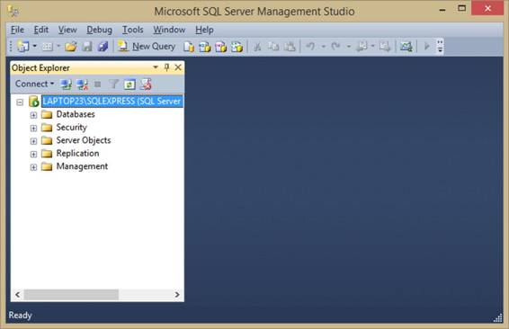
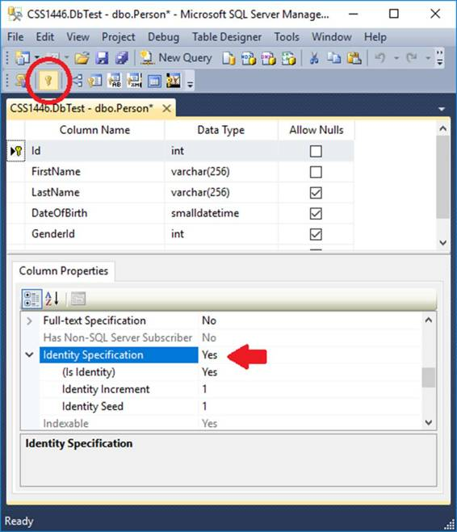
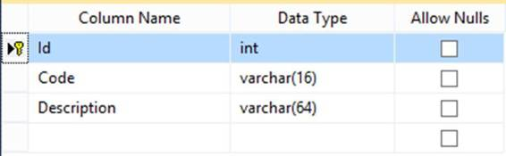
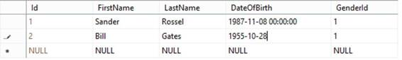
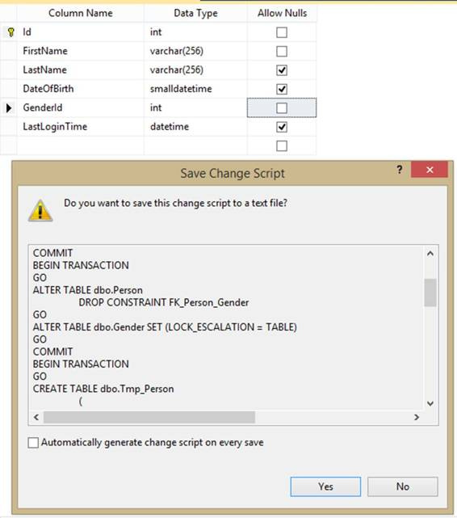

如果您按照介绍中的步骤进行操作，那么您现在已经拥有了 Visual Studio 和 SQL Server 的全新安装。所以让我们打开 SQL Server 管理工作室(简称 SSMS)。如果您遵循默认值，请使用 Windows 身份验证登录到您的默认实例，即本地主机\实例的名称(默认名称为 MSSQLEXPRESS)。您现在应该会看到以下窗口:



图 1:微软 SQL Server 管理工作室

我一直觉得 SSMS 非常直观好用。要执行任何脚本，只需点击工具栏中的**新查询**。确保在左上角选择正确的数据库(如果适用)(或者在脚本中放入`USE [database_name] GO`)。现在让我们创建一个数据库，以便在未来的示例中使用。在对象浏览器中，打开**数据库**节点。可能是空的，所以右键点击**数据库**节点，点击**新建** **数据库**。选择一个名称(对于这本书，我们将使用`SuccinctlyExamples`，保留所有默认值，然后单击**确定**。现在您有了一个数据库，您可以打开该节点并查看所有的表、视图和存储过程。

让我们创建一个表。右键点击**表格**节点，点击**表格**。现在创建下图中的表格。确保将**标识**列设置为主键，并使其自动递增(这是**身份规范**属性的作用)。



图 2:人员表

保存时，将表命名为“人员”。要在对象资源管理器中查看表格，您可能需要刷新(右键单击**表格**节点，然后单击**刷新**)。请注意，我已经为`GenderId`选择了数据类型`int`，这一开始似乎有点奇怪。然而，我想创建另一个包含所有可能性别的表，并在此引用该表。

|  | 注意:我称桌子为“人”(单数)，而不是“人”或“人”(复数)。对一些人来说，表的命名可能相当宗教化。单数命名的一个令人信服的理由是，当您打算使用对象关系映射器(ORM)时，它会让您的生活变得容易得多。关于更多的论点(支持和反对)，请查看 [StackOverflow](http://stackoverflow.com/questions/338156/table-naming-dilemma-singular-vs-plural-names) 上的这个线程。 |

|  | 注意:Related 是 GenderId 在 Person 中的命名(而不仅仅是 Gender)。这样命名的一个原因是，它实际上是一个指代性别的 ID。同样，当使用 ORM 时，这种命名约定会让你的生活变得更容易。也就是说，我也多次看到(并使用)了《性别》。 |

以与之前相同的方式，创建下表(这次在 Id 上没有身份规范):



图 3:性别表

保存此表时，将其命名为性别。

现在回到你的`Person`桌。如果已经关闭选项卡，可以右键单击表格，然后单击**设计**。现在右键单击任意位置，然后单击**关系**。添加一个新的，点击**表格和列规范**，确定如下图:


图 4:外键关系

SSMS 会自动给你的外键取名 FK _ 人 _ 性别，这样你就可以把剩下的都留下来保存了。您现在已经告诉 SQL Server，`Person`表中的`GenderId` 列可能只包含也是`Gender`表的`Id`列中的值。

|  | 注意:很多人认为关系数据库之所以这么叫，是因为可以定义表之间的外键关系。但事实并非如此。外键只不过是一种约束，保证了数据的完整性。关系数据库被如此称呼的实际原因是因为表的数学术语是关系。关系是一组无序的值。集合是唯一值的集合。SQL Server 中的值是一个元组，它是值的集合。主键保证了值的唯一性。这也意味着任何没有唯一主键的表(或视图)实际上都不是关系！ |

现在，右击`Gender`表格，点击**编辑前 200 行**。你插入什么并不重要，但也许你应该以我为榜样。


图 5:性别

现在我们也可以在`Person`表中插入一个或多个人物。



图 6:人

所以这很简单。我们设置了两个表，创建了一个外键，并插入了一些数据。但是我们错过了一件事…剧本！如果您想在不同的数据库(或另一个环境中的相同数据库)上执行这些步骤，您将需要脚本。幸运的是，SSMS 有一些生成脚本的选项。

第一种方法是右键单击一个对象，选择**脚本【对象】为** >，进行选择。不过，这只能写出整个对象的脚本。这可能对除了表之外的所有东西都很好(表不能在不丢失数据的情况下被覆盖)。例如`Person`表`CREATE`脚本如下:

代码清单 1: CREATE TABLE [dbo]。[人]

```cs

  CREATE TABLE [dbo].[Person](
        [Id]
  [int] IDENTITY(1,1) NOT NULL,
        [FirstName]
  [varchar](256)
  NOT NULL,
        [LastName]
  [varchar](256)
  NULL,
        [DateOfBirth]
  [smalldatetime] NULL,
        [GenderId]
  [int] NULL,
   CONSTRAINT [PK_Person] PRIMARY
  KEY CLUSTERED

  (
        [Id] ASC
  )WITH (PAD_INDEX = OFF, STATISTICS_NORECOMPUTE =
  OFF, IGNORE_DUP_KEY = OFF, ALLOW_ROW_LOCKS = ON, ALLOW_PAGE_LOCKS = ON) ON [PRIMARY]
  ) ON [PRIMARY]

  GO

  SET ANSI_PADDING OFF
  GO

  ALTER TABLE [dbo].[Person]  WITH CHECK ADD  CONSTRAINT [FK_Person_Gender] FOREIGN KEY([GenderId])
  REFERENCES [dbo].[Gender] ([Id])
  GO

  ALTER TABLE [dbo].[Person] CHECK CONSTRAINT [FK_Person_Gender]
  GO

```

太棒了，但是请注意我们首先需要`Gender`表，否则这个脚本会失败。我们稍后添加了外键约束，但它都在这个脚本中。

对于表的更新，我们可以进入设计窗口，添加一列，更改类型，添加约束，然后右键单击，选择**生成更改脚本**。例如，我添加了一个`LastLoginTime`列，并将`GenderId`更改为不可空。



图 7:保存更改脚本

如您所见，SQL Server 实际上创建了一个临时表，删除了该表并进行更改。比你想象的要多！您可以保存这个脚本，然后在另一个环境中毫不费力地执行它(甚至是自动化的)。不幸的是，删除和重新创建一个表是非常慢的，而且需要大量的资源，所以无论如何，您可能都想要编写自己的更改脚本。

可以使用屏幕左上角菜单中的**新建查询**按钮，或者使用 **Ctrl** + **N** 打开新的查询窗口。请注意确保您在正确的数据库上执行脚本(使用**执行**按钮或**F5**)——一个常见的错误是在主数据库上执行脚本，主数据库被选为默认数据库。

下面的简单脚本还将添加`LastLoginTime`列，并使`GenderId`不可为空。

代码清单 2:更改表格

```cs
  ALTER TABLE dbo.Person
  ADD LastLoginTime DATETIME

  ALTER TABLE dbo.Person
  ALTER COLUMN GenderId
  INT NOT NULL

```

|  | 提示:可以在一个查询窗口中只执行脚本的某些部分。只需选择要执行的查询部分，然后按 F5。当您在测试一些软件时，想要检查数据、重置数据、再次运行代码并重复时，这尤其方便。在单个窗口中编写 SELECT 语句和 UPDATE/INSERT/DELETE 语句，就可以独立执行这两个(或多个)语句，而不必一直切换窗口。 |

最后但并非最不重要的是，您可以编写一个包含所有或部分选定对象的数据库脚本，也可以包含或不包含数据。右键单击数据库，转到**任务** >，然后选择**生成脚本**。浏览向导并进行实验(这不是很复杂，但它有很多选项)。这是为`Gender`表生成的脚本，包括数据。

代码清单 3: CREATE TABLE [dbo]。[性别]包括数据

```cs
  CREATE TABLE [dbo].[Gender](
        [Id]
  [int] NOT NULL,
        [Code]
  [varchar](16)
  NOT NULL,
        [Description]
  [varchar](64)
  NOT NULL,
   CONSTRAINT [PK_Gender] PRIMARY
  KEY CLUSTERED

  (
        [Id] ASC
  )WITH (PAD_INDEX = OFF, STATISTICS_NORECOMPUTE =
  OFF, IGNORE_DUP_KEY = OFF, ALLOW_ROW_LOCKS = ON, ALLOW_PAGE_LOCKS = ON) ON [PRIMARY]
  ) ON [PRIMARY]

  GO
  SET ANSI_PADDING OFF
  GO
  INSERT [dbo].[Gender] ([Id], [Code],
  [Description]) VALUES
  (0, N'UNKNOWN', N'Not saying')
  GO
  INSERT [dbo].[Gender] ([Id], [Code],
  [Description]) VALUES
  (1, N'MALE', N'Male')
  GO
  INSERT [dbo].[Gender] ([Id], [Code],
  [Description]) VALUES
  (2, N'FEMALE', N'Female')
  GO

```

这是对 SQL Server 管理工作室的简单介绍。树视图与右键上下文菜单结合使用效果非常好。当然，如果你愿意，你可以使用各种快捷键；在菜单上查一下。在这本书里，我们将更多地使用 SSMS。

|  | 提示:在数据库中创建新对象时，针对这些新创建的对象编写查询时，您将无法获得完全的设计时支持。它们不会出现在自动完成中，如果您在查询中手动键入它们，SSMS 会告诉您这些对象不存在。不过，您的查询将会成功运行。即使是数据库刷新也不会对您有所帮助。很长一段时间，我认为重新启动 SSMS 是将新对象加载到 SSMS 对象缓存中的唯一方法。事实证明，Ctrl + Shift + R 也能做到这一点——在你刚刚创建的对象下不再有红色的曲线！ |