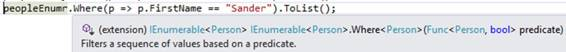

上一章的所有内容都是大量的打字，有点繁琐，也不太容易做。创建一个抽象层来自动将 select 语句中的字段映射到 C#对象上的属性并不难，但不会很漂亮。正确地做这样的事情有点难，但幸运的是已经有一些这样的抽象层存在。在本章中，我们将看一下微软的实体框架(EF)，这是一个对象关系映射器(ORM)，它完成了我们在上一章中所做的一切，但是要容易得多。

顾名思义，ORM 将关系数据库中的对象映射到代码中的对象。实体框架有两种开发模式。首先，也是最传统的，EF 从一个已经存在的数据库中生成 C#类。其次，您用属性、外键关系和主键来编码您的类，并让 EF 为您生成数据库。这两种模式分别称为数据库优先和代码优先。第三种选择是 EF 从现有的数据库中创建 C#类，但是假装你先使用了代码，允许你在现有的数据库中使用代码优先。在本章中，我将向您展示数据库优先和代码优先。从那里，使用现有数据库选项中的代码优先应该也不难。

要广泛讨论英孚，我们需要一本不那么简洁的书。事实上，我有一本超过 600 页的书，是从一个旧版本的英孚开始的，当时代码优先甚至不是一个选项。再加上你可以写的 LINQ 查询，你可以读完全不同的书，以及英孚使用的 T4 模板技术，你会明白我在这一章真的只能触及英孚的表面。本章的目标不是让你成为 EF 的专家，而是将前一章的经验应用到 ORM 中，并讨论一些更好的“抓住你了！”英孚的细节，以后会为你省下很多白发。

让我们先从数据库开始，因为它非常简单。创建一个新的 C#控制台应用程序项目，保存它，并通过 NuGet 安装 EntityFramework。在菜单中，转到**工具** > **获取包管理器** > **为解决方案管理获取包**。浏览搜索**实体框架**，在窗口右侧的项目列表中选择你的项目，安装。现在，向您的项目添加一个新项目，并选择**ADO.NET 实体数据模型**，并将其命名为简洁的示例模型。

实体数据模型向导为您提供了几个选项；从数据库中选择 **EF 设计师。在下一个屏幕中，您可以设置连接属性并选择一个数据库。选择您创建的`SuccinctlyExamples`数据库。创建连接后，您会看到一个包含数据库对象的树视图。检查表格(`dbo.Gender`和`dbo.Person`)，确保选中**将生成的对象名称**多元化或单一化，然后单击**完成**。**

您将看到一个名为`SuccinctlyModels.edmx`的文件被添加到您的项目中。edmx(实体数据模型扩展)文件保存了从数据库到代码的所有映射。右键单击 edmx 文件并选择**用**打开允许您选择一个 XML 编辑器并查看您的 XML 映射。您永远不应该需要 XML，但是如果您深入到 EF，您会发现自己编辑或检查它的程度超出了您的预期。不过，对于本教程，我们不打算看它。因此，如果双击 edmx 文件，您将获得一个图表，显示您之前导入的所有数据库对象。如果您想要导入更多对象或更新现有对象，只需右键单击模型中的某个位置，然后单击**从数据库更新模型**。不幸的是，如果您导入一个表，您将总是获得所有属性，并且更新也将更新所有已经导入的表。


图 8:实体框架图

注意`Gender`有`People`属性，`Person`有`Gender`属性(如果你只把`GenderId`命名为`Gender`，那么`Gender`属性就会被命名为`Gender1`，真恶心！).实体之间的细线描述了这种关系。A `Gender`有 0 到 n `People`(该*部分，`0..n`)，a `Person`有 0 或 1 `Gender`(该`0..1`部分，`0`因为可以为空)。如你所见，这些叫做`Navigation Properties`。如果你愿意，你可以在这里给所有东西重新命名(例如，如果你有`Gender1`，你可以把它重新命名为`GenderEntity`，或者你可以把`Gender`重新命名为`GenderId`，把`Gender1`重新命名为`Gender`)。如果属性是可空的，您也可以从模型中移除属性，但是如果您想要它们回来，您必须手动添加它们。最棒的是，现在这些是你可以使用的 C#类。

代码清单 28:在 C#中使用实体

```
  Person p = new
  Person();
  p.FirstName
  = "Mark";
  p.LastName = "Zuckerberg";
  p.Gender = new
  Gender();

```

展开 edmx 文件时，可以找到生成的代码。这是你会发现两个 T4 文件(文本模板转换工具包)；他们有。tt 分机。你也可以扩展这些。一个包含您生成的实体，另一个包含您的上下文类，即数据库的代码表示。T4 文件是使用 edmx 文件生成类的模板。请记住，您可以编辑生成的文件，但是一旦它们被重新生成，您的更改将被覆盖。如果您想生成一些额外的代码，最好的办法是编辑 T4 文件。

您可能已经猜到，连接字符串会添加到您的 app.config 文件中。EF 连接字符串包含一些额外的元数据。将您的实体放在一个单独的项目中，并从其他项目中引用该项目，这是一个很好的做法。启动项目的 App.config 或 Web.config 将需要此连接字符串，否则会出现运行时错误。所以一定要复制(包括元数据)。


图 9: T4 文件

如果想给单个类添加一些代码，可以使用`partial`关键字。您的所有实体都被创建为分部类。这意味着您可以在不同的文件中“扩展”它们。

代码清单 29:一个分部类

```
  public partial class Person
  {

  public string FullName

  {

  get

       {

  // FirstName and
  LastName are defined

  // in this class, but
  in another file.

  return $"{FirstName} {LastName}";
          }
      }
  }

```

让我们从数据库中获取一些数据。我们首先需要的是我们的上下文类，继承自`DbContext`。它为我们的每个表都有一个属性，为我们的每个存储过程都有一个方法。

代码清单 30:使用数据库上下文

```
  using (var
  context = new SuccinctlyExamplesEntities())
  {

  // Access the database.

  List<Person> people = context.People.ToList();
  }

```

这就是从您的数据库中获取所有人并将其加载到内存中是多么容易！

## 基化【基化】【基化】基化基化基化基化基化基化基化基化基化基化基化基化基化基化基化基化基化基化基化基化基化基化基化基化基化基

不幸的是，这一行代码中有很多内容，所以让我们详细说明一下。首先，`context.People`还没有真正做什么——是`ToList`强制数据库访问。这是一个非常重要的细节。`context.People`房产是`DbSet<Person>`，而 T3 又是`IQueryable<Person>`。`IQueryable<T>`界面在外观上看起来像任何集合(`IEnumerable`)，但行为非常不同。使用`IQueryable`时，会为数据源构建一个查询，在本例中是 SQL Server。查询仅在枚举`IQueryable`时执行，如调用`ToList`或`foreach`时。这允许您使用`Where`、`OrderBy`或`Select`创建查询，而无需访问数据库。如果我们必须多次访问数据库，你可以想象这会变得非常慢！

让我们构建一个更高级的查询。

代码清单 31:一个 IQueryable

```
  using (var
  context = new SuccinctlyExamplesEntities())
  {

  // Don't access the
  database just yet...

  IQueryable<Person> query = context.People

  .Where(p => p.GenderId == 2)

  .OrderBy(p => p.LastName);

  // Access the database.

  List<Person> women = query.ToList();
  }

```

这也允许您基于条件创建查询。

代码清单 32:使用条件构建查询

```
  using (var
  context = new SuccinctlyExamplesEntities())
  {

  bool orderResults = false;

  // Don't access the
  database just yet...

  IQueryable<Person> query = context.People

  .Where(p => p.GenderId == 2);

  if (orderResults)

  {

  query = query.OrderBy(p => p.LastName);

  }

  // Access the database.

  List<Person> women = query.ToList();
  }

```

如你所见，这比我们在第一章中使用的代码少了很多。额外的好处是，代码读起来也容易得多(一旦你习惯了 LINQ 语法)。根据您的需求创建不同的查询变得轻而易举，因为您可以重用部分查询(如面向对象的 SQL 查询！).

这里的另一个关注点是参数化。不要担心，一切都参数化得很好。只是在前面的例子中没有参数。我们查询具有`2`的`GenderId`的人。值`2`是一个常量，所以我们的查询没有任何参数。如果在代码中的其他地方，我们查询`1`的`GenderId`，我们将获得具有新计划的新查询。因此，假设我们想要参数化这个查询。我们该怎么办？简单—创建一个变量！

代码清单 33:参数化查询

```
  using (var
  context = new SuccinctlyExamplesEntities())
  {

  // Not parameterized.

  context.People.Where(p => p.GenderId == 2).ToList();

  int female = 2;

  // New, parameterized
  query.

  // Doesn't re-use the
  previous plan.

  context.People.Where(p => p.GenderId == female).ToList();

  int male = 1;

  // Parameterized, uses
  same query plan as above.

  context.People.Where(p => p.GenderId == male).ToList();
  }

```

当然`IQueryables`也有一些缺点。您对生成什么查询没有任何影响。有些查询是如此的可怕，以至于自己编写它们真的很划算，这就是一些 SQL 知识真正派上用场的地方。有时候 EF 就是不能从你的`IQuerable`生成干净的 SQL 查询，比如连接两个完全不相关的表。EF 会生成一个查询，它会给你你的数据，但不会很快或优雅。说到性能，使用 EF 会带来性能损失。如果这几毫秒很重要(通常不重要)，使用我们在第 2 章中讨论的技术。

在`IQueryable`中不能做的另一件事是使用数据源未知的任何函数或属性。这很有道理，因为查询必须转换为 SQL。例如，下面的代码将不起作用。

代码清单 34:无效查询

```
  using (var
  context = new SuccinctlyExamplesEntities())
  {

  Person sander =
  context.People.SingleOrDefault(p => p.FullName == "Sander Rossel");
  }

```

不幸的是，它编译得很好。只有在运行时，当实际编译查询时，您才会得到一个错误，因为您的表中没有`FullName`列，所以请务必始终针对您的实际数据源运行查询。您可能会惊讶于下面的查询会像预期的那样工作。

代码清单 35:有效代码

```
  using (var
  context = new SuccinctlyExamplesEntities())
  {

  List<Person> peopleWithS = context.People

  .Where(p => p.FirstName.ToLower() == "sander")

  .ToList();
  }

```

`ToLower`函数在 SQL Server 中是已知的，EF 团队确保了该函数的正确翻译。理论上，也可以将`StartsWith`函数转换为 SQL(使用 SQL 的`LEFT`，但这不受支持。对于一些额外支持的功能(如`LEFT`、`RIGHT`、`DIFFDAYS`等)。)，请查看`System.Data.Entity.DbFunctions`和`System.Data.Entity.SqlServer.SqlFunction`课程。也可以将自己的函数添加到 EF 中，但这超出了本书的范围。

上一个例子中的代码还有另一个缺陷。考虑下面的代码。

代码清单 36:延迟加载

```
  using (var
  context = new SuccinctlyExamplesEntities())
  {
      List<Gender> genders =
  context.Genders.ToList();
      foreach (Gender g in genders)

  {

  foreach (Person p in g.People)

  {

  Console.WriteLine($"{p.FirstName} is a {g.Description}.");

  }
      }
  }

```

这段代码多久访问一次数据库？唯一正确的答案是“我不知道。”我们首先得到所有可能的性别，这是一个数据库调用。但是然后我们通过性别循环，我们进入了那个`Gender`的`People`。你猜怎么着？`People`还没有被加载到我们的记忆中，所以每次我们访问`People`的时候，英孚都会访问数据库来获取那个`Gender`的所有人。

在这种情况下，我们有三个性别，所以我们有一个调用来获取所有性别，然后每个性别有一个额外的调用来获取人员，总共有四个数据库调用。在许多情况下，你真的不知道你得到了多少实体，在你知道之前，你正在做成千上万的数据库调用！这叫做延迟加载，可以在你的 EF 图中关闭。但是，关闭懒加载后，你的`People`将不会被加载，你可能看起来一个人都没有。我见过系统因为延迟加载而变得非常慢，但是如果使用得当，这是非常棒的。幸运的是，EF 为我们做了一些缓存，所以一旦加载了导航属性，EF 就不会再访问数据库了。“先思考后查询”是留言！

让我们来看看一些很酷的扩展，它们让使用`IQueryable`变得更加容易。处理日期总是一件痛苦的事情，所以让我们创建一个`OlderThan`扩展方法。我必须承认，我从堆栈溢出中获得了 SQL 查询，并将其转换为 LINQ。这个例子已经足够精确了。

代码清单 37:一个扩展方法

```
  public static class Extensions
  {

  public static IQueryable<Person> OlderThan(this IQueryable<Person> q, int age)

  {

  return q

  .Where(p => (DbFunctions.DiffHours(p.DateOfBirth, DateTime.Today) / 8766) > age);

  }
  }

```

用法简单易读。最初的查询对任何人来说都是不可读的，但是从名称(`OlderThan`)可以清楚地看出它是做什么的。这是一个双赢的局面。

代码清单 38:旧用法

```
  using (var
  context = new SuccinctlyExamplesEntities())
  {

  List<Person> people = context.People.OlderThan(45).ToList();
  }

```

请记住，您在`IQueryable`中使用的函数或属性必须存在于数据源中。这意味着创建一个接口并在不同的类型上使用它来重用您的扩展方法只有在接口成员与您的实体成员同名时才有可能。因此，如果您有多个带有`DateOfBirth`的实体，并且您想要重用您的扩展方法，这是可能的，但是只有当您将扩展方法实现为泛型函数时(毕竟，`IQueryable`对实体有效，而不是对接口类型有效)。类属必须是`class`，因为`struct`可能永远不是一个实体。

代码清单 39:使用接口

```
  public interface IDateOfBirth
  {

  DateTime? DateOfBirth { get; set; }
  }

  public partial class Person : IDateOfBirth
  {
  }

  public static class Extensions
  {

  public static IQueryable<T>
  OlderThan<T>(this
  IQueryable<T>
  q, int age)

  where T
  : class, IDateOfBirth

  {

  return q

  .Where(p => (DbFunctions.DiffHours(p.DateOfBirth, DateTime.Today) / 8766) > age);

  }
  }

```

如果你有多个不同属性名称的实体(例如`Machine`和`ManufacturedDate`，你就倒霉了。也许`Expression Trees`能帮到你。

要获取由 EF 生成并发送到数据库的查询，您可以使用您的`DbContext.Database.Log`属性，它是一个`Action<string>`，并将任何生成的 SQL 输出到委托。例如，您可以登录到控制台。

代码清单 40:向控制台输出 SQL

```
  using (CodeFirstContext context = new CodeFirstContext())
  {

  context.Database.Log = Console.Write;

  context.People.Where(p => p.GenderId == 1).ToList();
  }
  Console.ReadKey();

```

使用`IQueryable`的另一个细节是，它包含许多扩展方法，这些方法也在`IEnumerable`中定义。似乎是这样。下面的代码对于`IEnumerable`和`IQueryable`来说看起来是一样的，但是这两个中只有一个会让你的应用程序停止运行！

代码清单 41: IEnumerable 与 IQueryable

```
  using (var context = new SuccinctlyExamplesEntities())
  {
      IQueryable<Person> peopleQuery = context.People;
      IEnumerable<Person> peopleEnumr = context.People;
      peopleQuery.Where(p => p.FirstName == "Sander").ToList();
      peopleEnumr.Where(p => p.FirstName == "Sander").ToList();
  }

```

两种`Where`方法在输入参数和返回的内容上有所不同。`IQueryable`以`Expression<Func<Person, bool>>`为输入，返回`IQueryable`，而`IEnumerable`以`Func<Person, bool>`为输入，返回`IEnumerable`。


图 10: IQueryable。在哪里



图 11: IEnumerable。在哪里

`Expression<Func<SomeType, bool>>`基本上是对象图中`Func<SomeType, bool>`的表示。因此，不要像在`IEnumerable.Where`中那样传入一个方法，而是传入一些表示该方法的对象。在这种情况下，编译器会创建对象图，因此您不需要担心这一点。

在前面的例子中，这意味着`IEnumerable.Where`枚举集合，强制对数据库进行往返(毕竟`IEnumerable`变量实际上是一个`IQueryable`，只有在这之后它才执行`Where`函数。因此，你将从数据库中获得所有人，而不仅仅是那些拥有`FirstName`“桑德”的人。所以要非常小心，不要不小心把你的`IQueryable`链条弄断了。

只是为了好玩，这里是编译器实际上从那个 lambda 表达式创建的`Expression<Func<Person, bool>>`。

代码清单 42:一个表达式<func bool="">></func>

```
  ParameterExpression parameter = Expression.Parameter(typeof(Person), "p");
  Expression property = Expression.Property(parameter, typeof(Person).GetProperty("FirstName"));
  Expression constant = Expression.Constant("Sander");
  Expression binary = Expression.Equal(property, constant);
  Expression<Func<Person, bool>>
  lambda = Expression.Lambda<Func<Person, bool>>(binary, parameter);
  peopleQuery.Where(lambda).ToList();

```

这意味着当你想添加你自己的(扩展)方法时，你必须记住你正在处理`Expressions`。如果你想创建一些额外的抽象层，你甚至可能需要手动创建你自己的`Expressions`。手动创建`Expressions`对于本书来说有点太高级了，但是让我们来看看一个扩展方法。

例如，如果您想在扩展方法中包含额外的选择逻辑，会发生什么？请务必填写`Expression`。如果不这样做，将不会给出错误或警告，但会调用`IEnumerable`上的方法，在您的操作执行之前强制进行数据库调用。

代码清单 43:带有选择器的扩展

```
  public static List<T>
  SelectOlderThan<T>(this
  IQueryable<Person> q, int age,

  Expression<Func<Person, T>>
  selector)
  {

  return q

  .Where(p => (DbFunctions.DiffHours(p.DateOfBirth, DateTime.Today) / 8766) > age)

  .Select(selector)
          .ToList();
  }

```

用法也很简单。

代码清单 44:select older than 的用法

```
  var people =
  context.People.SelectOlderThan(45, p =>

  new

  {

  Name = p.FirstName,

  DateOfBirth = p.DateOfBirth

  });

```

让我们来看看 CRUD 操作。你不会相信这有多容易。

代码清单 45: CRUD 操作

```
  using (var
  context = new SuccinctlyExamplesEntities())
  {

  // Update Sander.

  Person sander =
  context.People.FirstOrDefault(p => p.FirstName == "Sander");

  sander.FirstName = "John";

  // Create Google CEO.

  Person sundar = new Person();

  sundar.FirstName = "Sundar";

  sundar.LastName = "Pichai";

  sundar.DateOfBirth = new DateTime(1972, 7, 12);

  sundar.GenderId = 1;

  context.People.Add(sundar);

  // Delete Mark
  Zuckerberg.

  Person mark =
  context.People.FirstOrDefault(p => p.FirstName == "Mark");

  context.People.Remove(mark);

  context.SaveChanges();
  }

```

仅此而已！太简单了，你真的不需要进一步解释。

记得我说过`“SELECT * …”`会对一个系统非常有害。我们现在做的基本上是。如果我们更新模型`Person`得到 100 个新字段，我们的系统会突然变慢很多。我们可以用`Select`解决这个问题。

代码清单 46:使用选择

```
  using (var
  context = new SuccinctlyExamplesEntities())
  {

  // Using an anonymous
  type.

  var satyaAnon = context.People.Where(p
  => p.FirstName == "Satya")

  .Select(p => new

  {

  Id = p.Id,

  FirstName = p.FirstName,

  LastName = p.LastName

  }).SingleOrDefault();

  // Use the anonymous
  type here...

  // Using a known type.

  PersonModel satyaKnown = context.People.Where(p
  => p.FirstName == "Satya")

  .Select(p => new PersonModel

  {

  Id = p.Id,

  FirstName = p.FirstName,

  LastName = p.LastName

  }).SingleOrDefault();

  // Use the known type
  here,

  // pass it to other
  functions,

  // or return it from
  this function.
  }

```

使用这种查询方式对更新和删除语句也有影响。既然你不想再得到整个实体，你就必须得到这个 ID(假设你还没有它)，并用它来做你的更新和删除。在大多数情况下，您会有自己的身份证，所以选择是不必要的。

代码清单 47:不获取整个实体的 CRUD

```
  using (var
  context = new SuccinctlyExamplesEntities())
  {

  // Update Sander.

  // Get Sander's ID.

  var sander = context.People.Where(p
  => p.FirstName == "Sander")

  .Select(p => new { Id = p.Id }).SingleOrDefault();

  // Create a new Person,
  but set the Id to an existing one.

  Person update = new Person();

  update.Id = sander.Id;

  // Attach Person with
  the given Id.

  context.People.Attach(update);

  // Fields that are set
  after attach will be tracked for updates.

  update.FirstName = "John";

  // Delete Mark
  Zuckerberg.

  // Get Mark's ID.

  var mark = context.People.Where(p =>
  p.FirstName == "Mark")

  .Select(p => new { Id = p.Id }).SingleOrDefault();

  Person delete = new Person();

  delete.Id = mark.Id;

  context.People.Attach(delete);

  context.People.Remove(delete);

  context.SaveChanges();
  }

```

这是对实体框架的快速概述。我们已经讨论了创建模型、导入表、创建查询、参数化、延迟加载和 CRUD 操作。不幸的是，正如您所看到的，在与 EF(或任何 ORM，就此而言)合作时，有许多“陷阱”。我知道这些事情是因为我过去做错了。我见过整个团队，凭借多年的经验，仍然会陷入本章中列出的一些陷阱。我经常听到“EF 很烂，因为它太慢了”，但更多的时候，这是因为没有参数化，不知道`IQueryables`什么时候执行(或者甚至根本不知道`IQueryable`)，懒加载，选择太多数据(或者只是数据库设计差，但这完全是另一个问题)。