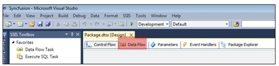
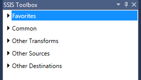
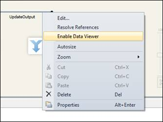
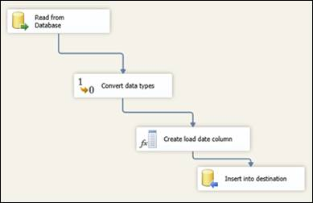
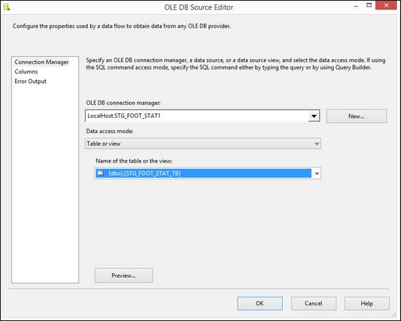
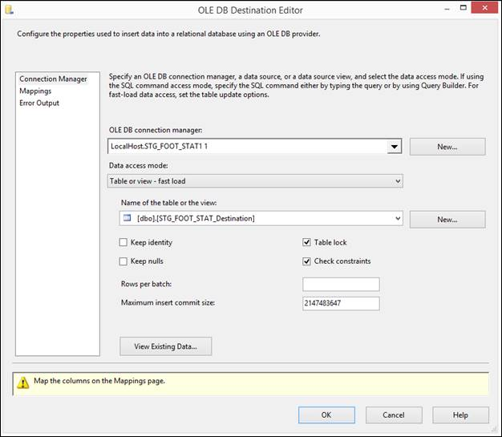
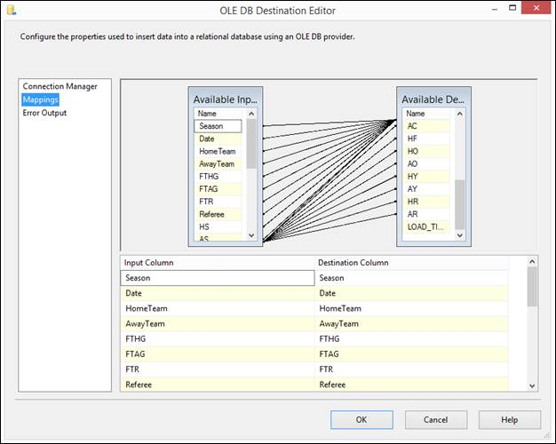

# 四、数据流

## 简介

数据流是所有数据提取、转换、映射和加载发生的地方。在开始开发数据流逻辑之前，您需要告诉控制流您将如何处理它。因此，您的第一项工作是将数据流任务添加到控制流中。

正如我之前解释的，一个包只能有一个控制流；但是，它可以拥有您想要的任意多的数据流。但是，在 SSIS 设计器中，只有一个数据流选项卡。这是因为它是一个动态选项卡；每当您单击数据流任务时，该选项卡将采用其中开发的对象。这样，如果将数据流任务添加到控制流中，可以双击它或选择“数据流”选项卡来打开数据流设计器。

图 57:打开数据流设计器

数据流对象可以有四种不同的类型:源、转换、目标和路径。关于数据流的一个有趣的事实是，当您从源中检索数据时，初始源对象之后的转换、目标和路径将在内存中执行，这使得它成为一个强大的引擎。

现在，让我们来看看这些物体是做什么的。源是您将从中检索数据的连接。目标是到您要插入或更新数据的目标的连接。在一个完美的世界里，源和目的地的模式是相同的，但正如你所知，它们不是。因此，转换很重要，因为它们允许您转换数据以遵循目标模式。这些转换允许您对数据集执行操作，如列转换、列创建，以及将在后面章节中解释的更多操作。

最后但同样重要的是，我们需要连接所有这些对象。为此，我们使用路径，类似于优先约束，但配置选项较少。但是，它们存在的目的是相同的:连接数据流内部的对象，并定义何时获取流(失败、匹配和不匹配)。路径的限制将在后面解释。

当您连接两个对象时，结果行为与控制流略有不同。这是因为，在这种情况下，连接没有定义要执行的下一个任务的条件。相反，它定义了当转换执行失败时，当转换成功时，或者其他选项，数据下一步将流向哪里。这意味着，当您建立连接时，信息是关于在数据流中可用的列在数据流路径的下一个组件中何时或何处变得可用。像控制流一样，这些对象是使用拖放设计器设计的，然后双击它们以打开它们的配置选项。现在让我们看看所有可用的对象。

图 58:带有数据流对象的 SSIS 工具箱

开发数据流的第一步是定义数据源。您可以拥有任意多的数据源，SSIS 数据流设计器允许您稍后加入或合并这些数据(例如，将其插入到单个目标中)。数据流工具箱中所有可用的对象都按其组进行组织，并在后面的章节中进行解释。

## 收藏夹

收藏夹组包含两个最重要的对象；它们允许您连接到外部数据源或目的地。您可以通过右键单击一个对象并选择**移动到收藏夹**向该组添加新对象。

表 5:收藏夹组中的数据流转换

| 形状 | 名字 | 描述 |
| --- | --- | --- |
|  | 目的地助理 | 此对象允许您将数据发送操作配置到各种目标平台。它的向导帮助您完成目标系统的配置。 |
|  | 来源助理 | 此对象允许您从各种源平台配置数据检索操作。它的向导帮助您完成目标系统的配置。 |

## 普通

“常见任务”组包括数据流中常用的对象。再次，您可以通过右键单击对象并选择**移动到公共**来将对象移动到该组。下表解释了您可以在其中找到的每个对象。

表 6:常见的数据流转换

| 形状 | 名字 | 描述 |
| --- | --- | --- |
|  | 总计 | 此对象允许您根据以下函数聚合数据:平均值、总和、计数、不同计数、最大值和最小值。 |
|  | 条件分割 | 此对象允许您根据可以在其中指定的条件将数据路由到多个输出。您可以使用条件来指定此对象的输出。 |
|  | 数据变换 | 此对象允许您在数据类型之间转换数据。例如，您可以使用它将整数转换为字符串。 |
|  | 派生列 | 此对象允许您基于应用于输入列的转换创建新列。例如，您可以基于其他三个输入列的值的串联来创建单个列。 |
|  | 检查 | 此对象允许您通过在表中查找值来将其他列连接到数据流。例如，这通常用于评估记录是否总是存在于数据仓库表中。 |
|  | 合并 | 此对象允许您将多个排序数据流中的行组合成一个排序数据流。如果排序不重要，请使用“联合所有”转换对象。 |
|  | 合并连接 | 该对象允许您使用 FULL、LEFT 或 INNER 连接将两个已排序的数据流组合成一个数据流。 |
|  | 多点传送 | 此对象允许您将每个输入行分配给一个或多个输出中的每一行。 |
|  | OLE 数据库命令 | 该对象允许您对数据流中的每一行运行 SQL 语句。这与控制流中的执行 SQL 任务不同，因为这会影响每一行；该任务应用于数据库—通常是 DDL 或 DML 之前的操作。 |
|  | 行数 | 此对象允许您计算数据流中的行数。 |
|  | 脚本组件 | 此对象允许您运行自定义脚本代码。您可以将其用作源、目标或转换对象。您可以使用 C#和 VB.NET 编程语言。 |
|  | 缓慢变化的尺寸 | 此对象允许您更新 SSIS 数据仓库维度表。这个对象在[第 5 章](5.html#_Handling_Slowly_Changing)中有详细的说明。 |
|  | 分类 | 此对象允许您按升序或降序对数据进行排序。它通常也用于移除重复的值，因为在使用此对象时，您可以告诉它在排序后移除重复的值。 |
|  | 联合所有 | 此对象允许您在不排序的情况下组合多个数据流。您可以使用它来组合来自多个对象输出的数据。 |

## 其他变换

“其他转换”组包括数据流中不常用的对象。虽然它们没有被经常使用，但是它们对您的 ETL 项目来说同样重要。

表 7:其他转换

| 形状 | 名字 | 描述 |
| --- | --- | --- |
|  | 审计 | 此对象允许您包含有关包运行环境的数据。将系统变量映射到新的输出列。 |
|  | 缓存转换 | 此对象允许您使用缓存连接管理器将数据写入缓存(一个. caw 文件)。 |
|  | 疾控中心分离器 | 此对象允许您根据变更类型(插入、删除和更新)将净变更记录流导入不同的输出。 |
|  | 字符映射表 | 此对象允许您将字符串函数应用于字符数据。例如，将大写转换为小写。 |
|  | 复制列 | 此对象允许您将输入列复制到转换输出中的新列。 |
|  | 数据挖掘查询 | 此对象允许您从分析服务中查询数据挖掘对象。 |
|  | dql 清理 | 此对象允许您使用数据质量服务(DQS)通过应用为连接的数据源或类似数据源创建的已批准规则来更正来自连接的数据源的数据。 |
|  | 导出列 | 此对象允许您从数据流中读取数据并将其插入文件。 |
|  | 模糊分组 | 此对象允许您识别潜在的重复行，并通过选择规范替换来帮助标准化数据。 |
|  | 模糊查找 | 此对象允许您执行数据清理任务，如标准化数据、更正数据和提供缺失值。使用模糊匹配从引用表中返回一个或多个相近的匹配项。 |
|  | 导入列 | 此对象允许您从文件中读取数据，并将其添加到数据流的列中。 |
|  | 百分比抽样 | 此对象允许您从输入数据流中随机抽取一定百分比的行。 |
|  | 在枢轴上转动 | 此对象允许您通过在列值上旋转输入数据流来压缩输入数据流，使其不太规范化。 |
|  | 行采样 | 此对象允许您从输入数据流中随机采样特定数量的行。 |
|  | 术语提取 | 此对象允许您从输入数据流中提取常用的、仅英语术语。 |
|  | 术语查找 | 此对象允许您确定特定术语在数据流中出现的频率。 |
|  | 联合国科特迪瓦行动 | 将未规范化的数据集转换为更规范化的版本。单个记录的多列中的值扩展到单个列中的多条记录。 |

## 其他来源

“其他源”组包括数据流中使用的其他源对象。

表 8:其他来源

| 形状 | 名字 | 描述 |
| --- | --- | --- |
|  | ADO.NET 来源 | 此对象允许您使用从 SQL Server、OLE DB、ODBC 或 Oracle 使用数据。NET 提供程序。 |
|  | 疾控中心来源 | 此对象允许您从 SQL Server CDC 影子表中读取已更改的数据。这个对象在[第五章](5.html#_Change_Data_Capture)中有详细的说明。 |
|  | Excel 源 | 此对象允许您连接到 Microsoft Excel 工作簿中的工作表或命名区域并从中提取数据。 |
|  | 平面文件源 | 该对象允许您从文本文件中读取和提取数据。您可以定义数据宽度或数据分隔符来标识行和列。例如，该对象用于 CSV 文件。 |
|  | ODBC 来源 | 此对象允许您从开放数据库连接数据库中提取数据。您可以使用它从表或视图中提取数据。 |
|  | OLE 数据库源 | 该对象允许您从 OLE 数据库关系数据库中提取数据。您可以使用它从表或视图中提取数据。 |
|  | 原始文件源 | 此对象允许您从原始文件目标先前写入的平面文件中提取原始数据。读取本地文件使用这个来优化包。 |
|  | XML 源 | 该对象允许您从 XML 文件中提取数据。 |

## 其他目的地

“其他目标”组包括数据流中使用的其他目标对象。

表 9:其他目的地

| 形状 | 名字 | 描述 |
| --- | --- | --- |
|  | ADO.NET 目的地 | 该对象允许您将数据加载到 ADO 中。NET 兼容的数据库，使用数据库表或视图。 |
|  | 数据挖掘模型训练 | 此对象允许您通过传递目标通过数据挖掘模型的算法接收的数据来训练数据挖掘模型。 |
|  | 数据读取器目标 | 此对象允许您通过使用 ADO.NET 数据读取器接口将数据流中的数据公开给其他应用程序。 |
|  | 维度处理 | 此对象允许您加载和处理 SQL Server 分析服务维度。 |
|  | Excel 目标 | 此对象允许您将数据加载到 Microsoft Excel 工作簿中的工作表或命名区域中。 |
|  | 平面文件目标 | 此对象允许您写入文本文件。 |
|  | ODBC 目标 | 此对象允许您将数据加载到符合开放数据库连接(ODBC)的数据库中。 |
|  | OLE 数据库目标 | 此对象允许您将数据加载到与 OLE 数据库兼容的关系数据库中，如 SQL Server。 |
|  | 分区处理 | 此对象允许您加载和处理 SQL Server 分析服务分区。 |
|  | 原始文件目标 | 该对象允许您编写不需要解析或翻译的原始数据。 |
|  | 记录集目标 | 此对象允许您创建和填充内存中的 ADO 记录集，该记录集在数据流之外可用。脚本和其他包元素可以使用记录集。 |
|  | SQL Server 压缩目标 | 此对象允许您将数据写入 SQL Server Compact 数据库中的表。 |
|  | SQL 服务器目标 | 此对象允许您连接到本地 SQL Server 数据库，并将数据大容量加载到 SQL Server 表和视图中。为了优化性能，建议您改用 OLE 数据库目标。 |

## 数据查看器

### 简介

数据查看器是很好的调试组件，因为它们允许您查看从一个数据流组件流向另一个数据流组件的数据。正如我之前所写的，路径通过将一个数据流组件的输出连接到另一个数据流组件的输入来连接数据流组件。数据查看器在这些路径中运行，允许您截取“通信”，并观察下一个组件或另一个角度(使用前一个组件产生的数据集)将使用什么输入。当您运行该包时，它将停止该数据查看器，并且只在您告诉它时才继续执行。通过使用数据查看器，您可以评估数据流组件的结果是否符合您的要求。如果没有，它允许您更正它。

使用数据查看器的一个重要但合乎逻辑的先决条件是，您的包控制流中必须至少有一个数据流，并且在该数据流中至少连接了两个组件。

### 使用数据查看器

要使用数据查看器，右键单击要评估的路径，然后选择**启用数据查看器**，如下图所示。

图 59:启用数据查看器

就这样。如果在数据流中使用数据查看器运行包，结果将如下图所示——一个窗口显示了在该特定路径中移动的数据。

图 60:数据查看器结果

## 创建简单的数据流

### 简介

为了向您展示这些组件是如何工作的，我们将创建一个简单的数据流，该数据流从 SQL Server 数据库中获取数据集，根据目标 SQL Server 表中的模式转换数据，然后将其插入。这是一个简单的数据流，允许我们第一次使用这些对象。我们将使用的组件有:

*   来源
*   转换
*   派生列
*   目的地

### 创建数据流

为了创建这个示例数据流，我们首先将所需的每个对象拖放到数据流设计器中，并在链接它们之后，进行所需的所有配置。让我们从定义流程开始。

图 61:简单的数据流

现在，开发数据流的方式总是相同的:将所需的对象添加到数据流设计器中，使用任务连接它们，然后配置它们的行为。因为我们已经完成了前两个步骤，现在是时候配置数据流中的每个对象了。首先要配置的对象是源对象。在这个对象中，您需要定义源数据库的连接管理器(如果不存在，则创建一个新的)以及表或视图名称。

图 62:源配置

配置完源对象后，点击**确定**关闭编辑器，双击**转换**对象。这将打开它的配置屏幕，您可以在其中创建表达式来根据需要转换列。在此屏幕中，从源表或视图中选择要转换的列。在转换网格中，选择目标数据类型和大小。

图 63:转换配置

现在，我们希望创建一个新列，并将其添加到现有的数据流列中。这将是一个加载日期值，表示插入该记录的时间。为此，双击**衍生列变换**。当编辑器打开时，您需要给这个列命名。在导出列选项中，选择**添加新列**，在表达式中，使用 GETDATE()函数获取当前日期和时间。

图 64:创建新的派生列

最后但同样重要的是，我们需要配置目标对象。如果双击目标对象，您会注意到它和源对象之间有很大的区别。您将在左侧看到一个名为“映射”的新选项卡。在此选项卡中，您将把数据流中已经转换或创建的列映射到目标表中的列。然而，第一步是配置连接管理器。

图 65:目标对象连接管理器

正如上图所示，编辑器底部有一个警告，告诉您需要将数据流中的列映射到目标表。所以让我们点击**映射**标签。

图 66:映射列

这个编辑器屏幕的目标是能够在可用的输入列和可用的目标列之间进行映射。完成此任务后，您可以运行包，数据将从源数据库移动到目标数据库。

|  | 注意:这只是一个介绍性的例子；它没有任何错误控制或验证。这意味着您可以看到如何开始开发控制流中包含数据流的包。 |