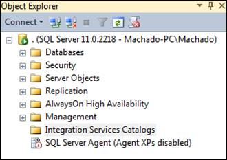
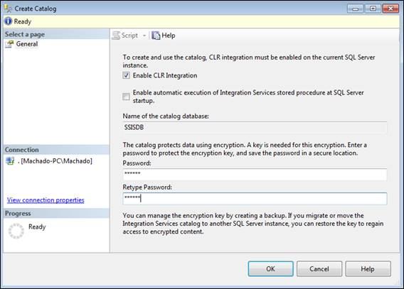

# 第 6 章部署包

## 简介

在您完成所有开发并检查以确保一切正常工作后，是时候将您的解决方案部署到服务器上了。为此，集成服务 2012 提供了两种部署模式:

*   项目部署模型
*   包部署模型

第一个模型，项目部署，是 SSIS 2012 的一个新功能。它使用应该在 SQL Server 实例中创建的 SSIS 目录来存储已部署项目中的所有对象。当您使用此模型部署项目时，它将聚合项目中的所有对象，并将它们作为一个对象部署到服务器，从而创建一个。ispac 文件。

在第二种情况下，包部署模型(自 SSIS 2005 年以来一直在使用)，包不是作为一个整体部署的；它们或者被分开处理，如果需要，您可以一次部署一个包，或者可以使用部署实用程序来部署所有包。

虽然与这些部署模型相关的关注点之一是项目对象的原子性，但是项目和包部署模型之间还有一些其他的区别。为了更好地理解差异，请看下表。

表 11:项目部署模型支持包部署模型

|  | 项目部署模型 | 包部署模型 |
| --- | --- | --- |
| 部署单位 | 项目 | 包裹 |
| 包属性的分配 | 因素 | 配置 |
| 文件输出 | 项目部署文件(。ispac 扩展)。 | 包(。dtsx 扩展)和配置(。dtsConfig 扩展名)分别保存到文件系统中。 |
| 部署 | 包含包和参数的项目被部署到 SQL Server 实例上的 SSISDB 目录中。 | 包和配置被复制到另一台计算机上的文件系统。包也可以保存到 SQL Server 实例上的 MSDB 数据库中。 |
| 包验证 | 目录中的项目和包可以在执行之前在服务器上进行验证。您可以使用 SQL Server Management Studio、存储过程或托管代码来执行验证。 | 包在执行前被验证。您也可以用 dtExec 或托管代码验证包。 |
| 运行和调度包 | 包在单独的窗口进程中运行。SQL Server 代理用于计划包执行。 | 与项目部署模型相同。 |
| 事件处理 | 在执行过程中，由包产生的事件被自动捕获并保存到目录中。 | 在执行过程中，包产生的事件不会被自动捕获。必须将日志提供程序添加到包中才能捕获事件。 |
| 环境特定变量 | 特定于环境的参数值存储在环境变量中。 | 特定于环境的配置值存储在配置文件中。 |
| CLR 集成 | 数据库引擎需要 CLR 集成。 | 数据库引擎不需要 CLR 集成。 |

现在我们已经理解了这两个模型之间的主要区别，让我们学习如何使用它们，以便我们的项目能够进入生产环境。

## 项目部署模型

正如我之前解释的，这是 SSIS 2012 推出的新部署模式。记住这一点非常重要，如果你想使用新的参数组件，你的项目应该使用这个模型来部署。因此，要使用这个模型部署一个项目，您必须首先创建一个新的 SSIS 目录来存储您部署的项目。为此，您应该打开 SQL Server 管理工作室。连接到要将项目部署到的 SQL Server 实例后，在对象资源管理器中找到**集成服务目录**文件夹。

图 102:集成服务目录文件夹

在对象浏览器中找到**集成服务目录**文件夹后，右键单击它并选择**创建目录**。这将打开一个新的**创建目录**窗口，您只需选择**启用 CLR 集成**复选框即可启用 CLR 集成；否则，您将无法创建目录和配置目录密码。不要忘记，这将存储您开发的包含所有参数的对象。因为你不希望任何人访问它们并破坏你的开发，所以能够设置密码是一个重要的特性。

图 103:创建新目录

设置完所有需要的属性值后，点击**确定**。现在，您可以在集成服务目录文件夹中看到一个新目录。如果您展开该文件夹，您将在其中看到新的目录文件夹。

图 104:创建新目录

现在您已经有了一个目录，您可以将您的项目部署到其中。要开始部署，请转到您的 SQL Server 数据工具并打开要部署的项目。打开项目后，右键单击项目节点(根)，选择**部署**，如下图所示。这将启动部署工具。

图 105:启动部署工具

一旦工具启动，您将需要完成一个向导来帮助您完成部署过程。该向导有以下四个步骤；但是，最重要的是选择源和选择目标:

*   选择来源
*   选择目的地
*   回顾
*   结果

在“选择源”屏幕中，您需要指定要部署的项目(这将是我们的示例)，以及是否希望另一个 SSIS 目录来自另一台服务器。在“选择源”屏幕中，选择项目部署文件选项，SSIS 会自动将项目路径设置为当前打开的路径。

图 106:选择要部署的项目

下一步是选择目的地。在“选择目标”屏幕中，您需要指定要将项目部署到的服务器，以及项目将部署到的 SSIS 目录文件夹的路径。因为 SSIS 目录可能存储多个 SSIS 项目，所以您需要为此新项目创建一个新文件夹。如果要重新部署解决方案，可以选择现有的解决方案。

图 107:选择目的地

就这样！最后一个屏幕允许您验证刚刚在“选择源”和“选择目标”屏幕中设置的设置。如果一切正常，点击**部署**完成部署。部署完成后，转到管理工作室，展开**集成服务目录**文件夹。现在您应该看到您的项目已经部署。如果您想知道如何查看和更改您的项目参数，请访问[变量、表达式和参数](5.html#_Chapter_5_)章节。

图 108:部署的项目

## 包部署模型

包部署模型是包部署的遗留模型，它基于包而不是项目。这意味着每个包都是独立部署的。在我个人看来，如果你正在开发新的 SSIS 项目，你应该采取项目模式的方法。然而，包部署模型对于您需要维护的遗留项目仍然很有用，例如。请再次注意，您不能在此项目模型中使用参数。

第一步是在项目中更改部署模型。为此，请转到“SQL Server 数据工具”并打开包含要部署的包的项目。打开项目后，右键单击项目节点(根)，选择**转换为包部署模型**，如下图所示。在此之前，您应该注意一些特别的事情:您不能拥有任何项目级的对象，例如连接管理器；相反，您可以使用数据源，但是您需要手动为每个包添加一个数据源。另一件需要注意的事情是，您没有可以使用的参数；相反，您需要使用包配置，再次手动将它们添加到每个包中。

图 109:转换到包部署模型选项

完成此步骤后，您的项目将处于包部署模型下。现在是时候部署我们各自的包了。为此，请打开要部署的包。接下来，点击控制流程中的空白区域，打开**文件**菜单。选择**保存【包名】**的副本，如下图所示。重要的是，您要知道可以通过使用部署清单一次部署所有的包。但是，与项目部署模型一样，这是一种“全有或全无”的方法，这意味着您无法选择要部署哪些包；它将部署所有这些。如果您想了解更多关于这种方法的信息，请参考微软 TechNet 网站上的[参考资料](http://technet.microsoft.com/en-us/library/ms137952.aspx)。在该页面上，它将解释如何创建部署实用程序(清单)。

图 110:保存包的副本

现在到了最后一步。我们将把这个包部署到一个 SQL Server 实例中。在保存程序包副本屏幕中，选择 **SQL Server** 作为**程序包位置**，并设置服务器名称和身份验证。最后，选择**包**根文件夹作为**包路径**。

图 111:保存到 SQL Server

现在，如果您使用 SQL Server 管理工具连接到您的集成服务服务器类型，您可以看到该包。它将位于 **MSDB** 文件夹中的**存储包**下。

图 112:连接到 SSIS 2012