# 三、描述性统计

## 基本术语

在探索**描述性统计**之前，我们定义了以下统计概念，这些概念将在本书的其余部分中使用。

**样本**:我们为了了解人群而分析的人群数据的子集。统计学领域的一个主要目标是根据样本的属性来推断一个群体。

**随机样本**:群体中每个成员都有同等机会被纳入的样本，其中一个成员的选择独立于所有其他成员的选择。

**随机变量**:代表随机样本值的变量。我们将使用字母表末尾的字母，尤其是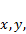和作为随机变量。

**独立随机变量**:研究者为了研究一些观察到的行为而选择然后测量或操纵的随机变量。

**因变量随机变量**:一个随机变量，其值取决于一个或多个自变量的值。

**离散随机变量**:取一组离散值的随机变量。这种随机变量通常取一组有限的值(例如，正面或反面、汽车品牌等)。)但是它们也可以包括取一组可数的值(例如，0、1、2、3 等)的随机变量。).

**连续随机变量**:即使在有限的区间内(如建筑物的高度、温度等)取值为无穷大的随机变量。).

**统计量**:从样本中计算出来的一个量，用于估计样本来源人群的相应特征(即**参数**)。

在本章的其余部分，我们定义了一些常用于表征数据的统计量。特别地，我们定义了中心趋势(例如，平均值和中值)、可变性(例如，方差和标准差)、对称性(即，偏斜度)和峰值(即，峰度)的度量。

我们还提供了一些用图形描述数据和分布的重要方法，包括直方图和箱线图。

## 中央趋势的度量

我们考虑一个随机变量和一个大小为的数据集 *S=* ，其中包含的可能值。数据可以代表正在研究的人群，也可以代表从人群中抽取的样本。

我们寻求一个单一的度量(即**统计**)，它以某种方式代表整个数据集的中心 *S* 。中心趋势的常用度量是平均值、中位数和众数。除了通常研究的平均值(也称为**算术**平均值)之外，我们还简要讨论了另外两种类型的平均值:**几何**平均值和**调和**平均值。

这些措施总结在表 1 中，其中 R 是 Excel 范围，包含样本或总体中的数据元素 *S* :

| 统计的 | Excel 2007 | Excel 2010/2013 |
| --- | --- | --- |
| 等差中项 | 平均值 | 平均值 |
| 中位数 | 中位数 | 中位数 |
| 方式 | 模式(右) | 时尚感。SNGL 模式。MULT(消歧义) |
| 几何平均值 | 几何学家 | 几何学家 |
| 调和平均值 | HARMEAN(R) | HARMEAN(R) |

表 1:中央趋势的度量

### 平均值

我们从**开始，意思是**，最常用的中枢倾向的度量。数据集 *S* 的**平均值**(也称为**算术平均值**)定义如下:

平均值在 Excel 中使用工作表函数 **AVERAGE** 计算。

**例**:T2 S 的平均值= {5，2，-1，3，7，5，0，2}为(2+5–1+3+7+5+0+2)/8 = 2.875。

我们通过使用图 7 中的公式=平均值(C3:C10)获得了相同的结果:

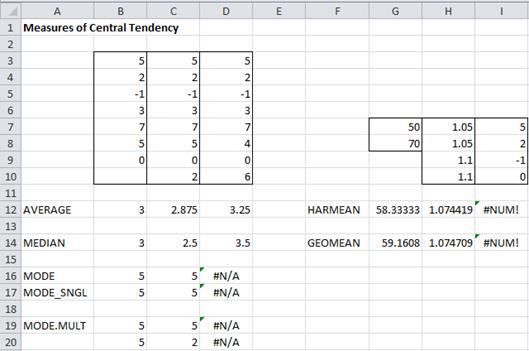

图 Excel 中的中心趋势示例

当数据集 *S* 是一个人口时，希腊符号用于表示平均值。当 *S* 为样本时，则使用符号。

### 中位数

如果将 *S* 中的数据按递增顺序排列，中间值为**中值**。当 *S* 有偶数个元素时，有两个这样的值。这两个值的平均值是中位数。

使用工作表函数**中值**在 Excel 中计算中值。

**例**:*S*的中位数= {5，2，-1，3，7，5，0}是 3，因为 3 是-1，0，2，3，5，5，7 中的中间值(即 7 个值中的第 4 个)。我们通过使用图 7 中的公式=中位数(B3:B10)获得了相同的结果。

请注意，图 7 中的每个函数都忽略了任何非数值，包括空格。因此，从=中值(B3:B10)获得的值与从=中值(B3:B9)获得的值相同。

*S* = {5，2，-1，3，7，5，0，2}的中位数为 2.5，因为 2.5 是-1，0，2，2，3，5，5，7 的两个中间值 2 和 3 的平均值。这与图 7 中的=中位数(C3:C10)的结果相同。

### 模式

数据集 *S* 的**模式**是最常出现的数据元素的值。

**示例**:*S*的模式= {5，2，-1，3，7，5，0}是 5，因为 5 出现两次，比任何其他数据元素都多。这是我们从图 7 中的公式=模式(B3:B10)得到的结果。当只有一种模式时，如本例，我们说 *S* 为**单峰**。

如果 *S* = {5，2，-1，3，7，5，0，2}，的模式由 2 和 5 组成，因为它们每个都出现两次，比任何其他数据元素都多。当有两种模式时，如本例，我们说 *S* 为**双峰**。

模式在 Excel 中用公式 **MODE** 计算。如果范围 R 包含单峰数据，则模式(R)返回该唯一模式。但是当 R 包含具有多个模式的数据时，MODE(R)返回这些模式中的第一个。对于我们的例子，这是 5(因为 5 发生在 2 之前，2 是数据集中的另一种模式)。因此，模式(C3:C10) = 5。

如果所有值只出现一次，则模式返回一个错误值。这是 *S* = {5，2，-1，3，7，4，0，6}的情况。因此，模式(D3:D10)返回错误值#不适用

Excel 2010/2013 提供一个数组函数 **MODE。MULT** 通过返回模式的垂直列表对多模式数据有用。当我们突出显示 C19:C20 时，然后输入数组公式=MODE。MULT(C3: C10)，然后按**Ctrl+Alt+回车**，我们看到两种模式都显示。

Excel 2010/2013 也提供 **MODE 功能。SNGL** 相当于 MODE。

### 几何平均值

数据集 *S* 的**几何平均值**定义如下:

如下例所述，这一统计数据通常用于衡量平均增长率。

在 Excel 中使用工作表函数**几何**计算几何平均值。

**例**:假设某产品前两年销量增长 5%，后两年增长 10%。过去四年的平均增长率是多少？

如果第一年的销售额是 1 美元，那么四年结束时的销售额是(1+. 05)(1+. 05)(1+. 1)(1+. 1)= 1.334。年增长率是这样的数量。= 1.334.由此可见，等于。= .0747.

同样的 7.47%的年增长率可以在 Excel 中使用公式 geoman(H7:H10)–1 = . 0747 获得。

### 调和平均值

数据集 *S* 的**谐波均值**计算如下:

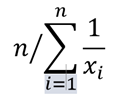

如下例所述，此统计数据可用于计算平均速度。

在 Excel 中使用工作表函数**harmain**计算谐波平均值。

**例**:如果你以每小时 50 英里的速度到达目的地，以每小时 70 英里的速度返回，你的平均速度是多少？

假设到目的地的距离为，到达目的地的时间为 /50 小时，返回的时间为 /70 小时，共计 /50 +  /70 小时。由于整个行程的距离为 2 ，您整个行程的平均速度如下:

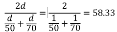

这相当于 50 和 70 的谐波平均值，因此可以在 Excel 中计算为 HARMAIN(50，70)，即图 7 中的 HARMAIN(G7:G8)。

## 可变性的度量

现在让我们考虑一个随机变量和一个大小为的数据集 *S =* 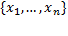，其中包含的可能值。数据集可以代表正在研究的人群，也可以代表从人群中抽取的样本。

[均值](http://www.real-statistics.com/descriptive-statistics/measures-central-tendency/ "Measures of Central Tendency")是最常用于表征 *S* 中数据中心的统计量。我们现在考虑围绕平均值的数据可变性的以下常用度量，即**标准偏差**、**方差**、**平方偏差**和**平均绝对偏差**。

此外，我们还来探讨一下其他三个与平均值无关的变异性指标，即**中值绝对偏差**、**范围**和**四分位数区间**。

在这些统计数据中，方差和标准差是最常用的。

表 2 总结了这些度量，其中 R 是 Excel 范围，包含样本或总体 S 中的数据元素:

| 统计的 | Excel 2007 | Excel 2010/2013 | 标志 |
| --- | --- | --- | --- |
| 总体方差 | VARP（R） | 凡 P(R) |  |
| 采样离散 | 哪里(r) | 风险值。南(右) |  |
| 总体标准差 | STDEVP（R） | STDEV。项目主任 |  |
| 样品标准偏差 | 标准电动汽车(右) | STDEV。南(右) |  |
| 平方偏差 | DEVSQ(R) | DEVSQ(R) |  |
| 平均绝对偏差 | AVEDEV(右) | AVEDEV(右) | 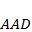 |
| 绝对偏差中位数 | 见下文 | 见下文 | 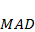 |
| 范围 | 最大(右)-最小(右) | 最大(右)-最小(右) |  |
| 四分位数范围 | =四分位数(R，3)–四分位数(R，1) | 见下文 | 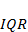 |

表 2:可变性的度量

### 方差

**方差**是数据围绕平均值的离差的度量。其中 *S* 代表一个人口，**人口方差**(符号)由人口平均值计算如下:

其中 *S* 代表一个样本，**样本方差**(符号)根据样本均值计算如下:

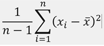

使用工作表函数 **VAR 在 Excel 中计算样本方差。S** 。在 Excel 中使用函数 **VAR 计算总体方差。P** 。在 Excel 2010 之前的 Excel 版本中，这些函数被称为 **VAR** 和 **VARP** 。

**例**:如果 *S* = {2，5，-1，3，4，5，0，2}代表一个总体，那么方差= 4.25。其计算方法如下:

首先，平均值= (2+5-1+3+4+5+0+2)/8 = 2.5，因此平方偏差 SS =(2–2.5)2+(5–2.5)2+(-1–2.5)2+(3–2.5)2+(4–2.5)2+(5–2.5)2 因此，方差= SS/n = 34/8 = 4.25。

如果取而代之 *S* 代表一个样本，那么平均值仍然是 2.5，但是方差= SS/(n–1)= 34/7 = 4.86。这些可以通过公式 VAR 在 Excel 中计算。p(B3；B10)和风险值。S(B3:B10)如图 8 所示:

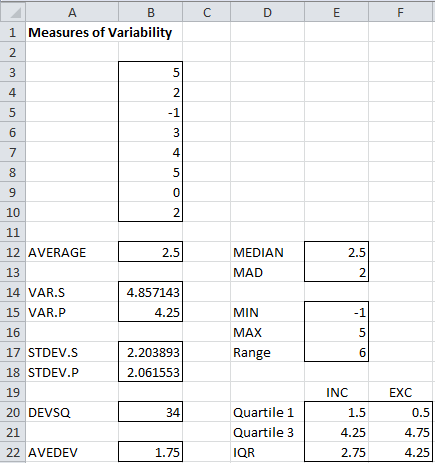

图 Excel 中可变性度量的示例

### 标准偏差

**标准差**是方差的平方根。因此，总体和样本标准偏差分别计算如下: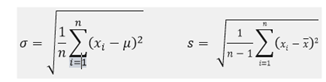

使用工作表函数 **STDEV 在 Excel 中计算样本标准差。S** 。在 Excel 中使用函数 **STDEV 计算总体方差。P** 。在 Excel 2010 之前的 Excel 版本中，这些函数被称为 **STDEV** 和 **STDEVP** 。

**例**:如果 *S* = {2，5，-1，3，4，5，0，2}是一个总体，那么标准差=总体方差的平方根，即: = 2.06。如果 *S* 是样本，那么样本标准差=样本方差的平方根= 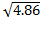 = 2.20。

这些是公式 STDEV 的结果。P(B3:B10)和 STDEV。S(B3:B10)如图 8 所示。

### 平方偏差

**平方偏差**(符号 *SS* 为**平方和**)最常用于 [**方差分析**](http://www.real-statistics.com/basic-concepts-anova/ "Basic Concepts for ANOVA") 及相关测试。计算如下:

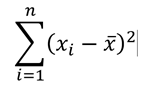

在 Excel 中使用工作表函数 **DEVSQ** 计算方差。

**例**:如果 *S* = {2，5，-1，3，4，5，0，2}，那么平方偏差= 34。这与公式 DEVSQ(B3:B10)的结果相同，如图 8 所示。

### 平均绝对偏差

数据集 *S* 的**平均绝对偏差** ( **AAD** )计算如下:

在 Excel 中使用工作表函数 **AVEDEV** 计算平均绝对偏差。

**例**:如果 *S* = {2，5，-1，3，4，5，0，2}，那么平均绝对偏差= 1.75。这与公式 AVEDEV(B3:B10)的结果相同，如图 8 所示。

### 中值绝对偏差

数据集 *S* 的**中值绝对偏差** ( **MAD** )计算如下，其中 =数据元素在 *S* 中的中值:

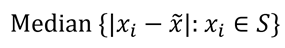

如果 R 是包含 *S* 中数据元素的范围，那么 *S* 的 MAD 可以在 Excel 中通过数组公式计算:

=中位数

即使值在单个单元格中呈现，也必须按 **Ctrl+Shift+Enter** 才能获得数组值，否则结果不会正确出来。

**例**:如果 *S* = {2，5，-1，3，4，5，0，2}，那么由于 *S* = {-1，0，2，2，3，4，5，5}所以 *S* 的中位数为(2+3)/2 = 2.5。因此，MAD = { 3.5，2.5，0.5，0.5，0.5，1.5，2.5，2.5}的中位数= {0.5，0.5，0.5，1.5，2.5，2.5，2.5，2.5，3.5}，即(1.5+2.5)/2 = 2。

该指标受数据极端情况(即**尾部**)的影响较小，因为尾部数据对中值计算的影响小于对平均值的影响。

### 范围

数据集 *S* 的**范围**是可变性的粗略度量，仅由 *S* 中最大值和最小值之间的差异组成。

如果 R 是包含 *S* 中数据元素的范围，那么 *S* 的范围可以在 Excel 中通过公式计算:

=最大值(R)–最小值(R)

**例**:如果 *S* = {2，5，-1，3，4，5，0，2}，那么范围= 5 –(-1)= 6

### 四分位数区间

数据集 *S* 的**四分位数区间** ( **IQR** )计算为 *S* 的第 75 百分位减去第 25 百分位。在 *S.* 中，IQR 提供了数据中心附近可变性的粗略近似值

如果 R 是包含 *S* 中数据元素的范围，那么 *S* 的 IQR 可以在 Excel 中通过公式计算:

=四分位数(R，3)–四分位数(R，1)

**例**:如果 *S* = {2，5，-1，3，4，5，0，2}，那么 IQR = 4.25–1.5 = 2.75

我们很快就会看到，在 Excel 2010/2011/2013 中，有两种方法可以使用 QUARTILE 计算四分位数。使用第二种方法，我们计算出 *S* 的 IQR 为 4.75–0.5 = 4.25。

方差、标准偏差、平均绝对偏差和中值绝对偏差衡量数据分布中心附近的可变性和尾部的可变性。平均绝对偏差和中间绝对偏差不会给尾部过多的权重。另一方面，范围只使用两个最极端的点，IQR 只使用数据的中间部分。

## 排名

表 3 总结了在所有版本的 Excel 中可用于数据集 r 的各种排名函数。我们将在本节的其余部分更详细地描述这些函数中的每一个，此外，我们还将描述仅在 Excel 2010/2013 中可用的其他排名函数。

| Excel 函数 | 定义 | 笔记 |
| --- | --- | --- |
| 最大值 | R 中的最大值(最大值) | =大(R，1) |
| 最小(右) | R 中的最小值(最小值) | =小(R，1) |
| 大型(拆装) | R 中的第 n 大元素 | 大(R，计数(R)) =小(R) |
| 小(R，n) | R 中的第 n 个最小元素 | 小(R，计数(R)) =最大(R) |
| 排名(c、R、d) | 元素 c 在 R 中的秩 | 如果 d = 0(或省略)，则排名按降序排列；否则，它是按递增顺序排列的 |
| 百分位数 | 第四百分位 R 中的元素 | 0 ≤ p ≤ 1。如果百分制(R，p) = c，则 p%的数据元素小于 c |
| PERC entrnk(r，c) | c 以下 R 中元素的百分比 | 如果 PERCENTRANK(R，c) = p，那么 PERCENTRANK(R，p) = c |
| 四分位数 | R 中第 n 个四分位数的元素 | n = 0，1，2，3，4 |

表 3:排名函数

### 最小、最大、小、大

**MIN**(R)= R 中的最小值，**MAX**(R)= R 中的最大值

**小** (R，n)= R 中的第 n 个最小值，**大** (R，n)= R 中的第 n 个最大值

这里，n 可以取 1 到 R 中元素个数的任意值，即 COUNT(R)。

**示例**:对于数据元素{4，0，-1，7，5}的范围 R:

最小值(R) = -1，最大值(R) = 7。

大(R，1) = 7，大(R，2) = 5，大(R，5) = -1

小(R，1) = -1，小(R，2) = 0，大(R，5) = 7

### RANK

所有版本的 Excel 都包含排名函数 RANK。对于从 Excel 2010 开始的 Excel 版本，也有等效函数 RANK.EQ。

**RANK** (c，R，d) =数据元素 c 在 R 中的排名，如果 d = 0(或省略)，则排名为降序，即 1 的排名代表 R 中最大的数据元素，如果 d ≠ 0，则排名为升序，因此 1 的排名代表 R 中最小的元素。

**示例**:对于数据元素{4，0，-1，7，5}的范围 R:

RANK(7，R) = RANK(7，R，0) = 1

。

RANK(7，R，1) = 5

RANK(0，R) = RANK(0，R，0) = 4

RANK(0，R，1) = 2

### RANK。AVG

Excel 的 RANK 和 RANK。均衡器功能不处理领带。例如，如果范围 R 包含值{1，5，5，0，8}，那么 RANK(5，R) = 2，因为 5 是范围 R 中排名第二高的元素。但是 5 也是范围中排名第三高的元素，因此对于许多应用程序来说，考虑排名为 2.5，即 2 和 3 的平均值是有用的。

从 Excel 2010 开始的 Excel 版本通过提供一个新的函数 **RANK 来解决这个问题。AVG** 采用与 RANK 相同的参数，但返回前面描述的相等等级的平均值。

对于 Excel 2010 之前的版本，您需要使用以下公式以类似的方式处理领带:

= RANK(c，R) + (COUNTIF(R，c)–1)/2

**示例**:使用 RANK。AVG 函数，找出图 9 中 E17:E23 范围内数据的等级:

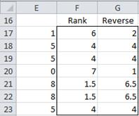

图 9:平均排名

结果如图 9 的 F 列所示。例如，8(单元格 E21 或 E22)的平均秩是 1.5，如单元格 F21(或 F22)所示，并使用公式=RANK 计算。AVG(E21，E17:E23)。相反，如果您想要以相反的顺序进行排名(其中最低值获得排名 1)，则结果显示在 g 列中。这一次使用公式=RANK。AVG(E21，E17:E23，1)，我们看到 8 的排名是 6.5，如单元格 G21 所示。

### 百分制

对于任何百分比 p(即，其中 0 ≤ p ≤ 1 或相当于 0% ≤ p ≤ 100%)，**百分点** (R，p)= PTH**百分点**处的元素。这意味着，如果 PERCENTILE，p) = c，那么 R 中 p%的数据元素小于 c。

如果 p = k/(n–1)对于某个整数值 k = 0，1，2，...n–1 其中 n = COUNT(R)，那么 percent(R，p) = SMALL(R，k+1)= R 中的第 k+1 个元素，如果 p 不是 1/(n-1) 的倍数，那么 percent 函数执行线性插值，如下例所述。

**例:**对于数据元素{4，0，-1，7，5}的范围 R，R 的五个数据元素将范围划分为大小为 25%的四个区间，即 1/(5-1)= 0.25。因此:

百分位(R，0)=-1(R 中的最小元素)

百分位(R . 25)= 0(R 中的第二小元素)

百分位(R . 5)= 4(R 中的第三小元素)

百分位(R . 75)= 5(R 中的第四个最小元素)

百分位(R，1)= 7(R 中的第五个最小元素)

对于 p 的其他值，我们需要插值。例如:

百分位(R . 8)= 5+(7–5)*(0.8–0.75)/0.25 = 5.4

百分位(R，. 303)= 0+(4–0)*(0.303–0.25)/0.25 = . 85

当然，Excel 的百分制函数会自动计算所有这些值，而无需您自己去计算。

### 百分制。EXC

从 Excel 2010 开始，微软推出了一个名为**百分点函数的替代版本。EXC** 。

如果 n = COUNT(R)，那么对于 1 ≤ k ≤ n 的任何整数 k

百分制。EXC(R，k/(n+1)) = SMALL(R，k)，即 R 范围内的第 k 个最小元素

对于 0 < p < 1, if p is not a multiple of 1/(n+1), then PERCENTILE.EXC(R, )是通过在 r 中的相应值之间进行线性插值来计算的。对于 p < 1/(n+1)或 p > n/(n+1)，不可能进行插值，因此百分制。EXC(R，p)返回一个错误。

Excel 2010/2013 也提供了新功能**percent。INC** 相当于百分制。

**示例**:使用百分制(或百分制)为图 10 中的数据找到 0–100 的百分位数，增量为 10%。INC)和百分点。EXC:

图 10:百分比计算的数据

结果如图 11 所示。例如，使用公式=百分制(B3:M3，O10)，第 60百分位数的得分为 58(单元格 P10)，而使用公式=百分制的得分为 59(单元格 S10)。EXC(B3:M3，R10)。

图 11:百分点与百分位的关系。EXC

### PERCENTRANK 和 PERCENTRANK。EXC

**百分点等级**(或**百分点等级。INC** )和 **PERCENTRANK。EXC** 是百分位和百分位的倒数。因此，PERCENTRANK(R，c) =值 p，这样百分位(R，p) = c。类似地，PERCENTRANK。EXC(R，c) =值 p，这样百分位。EXC(R，p) = c

**例**:参考图 10 和图 11，我们有:

PERC entrnk(B3:m3.54)= . 4

PERCENTRANK。EXC(B3:M3，S12)= 0.8

### QUARTILE 和 QUARTILE。EXC

对于任意整数，n = 0，1，2，3 或 4， **QUARTILE** (R，n)= percent(R，n/4)。如果 c 不是整数，但 0 ≤ c ≤ 4，则 QUARTILE(R，c) = QUARTILE(R，INT(c))。因此:

四分位(R，0) =百分位(R，0) =最小值(R)

四分位(R，1) =百分位(R . 25)

四分位(R，2) =百分位(R，. 5) =中位数(R)

四分位(R，3) =百分位(R，. 75)

四分位(R，4) =百分位(R，1) =最大值(R)

**示例**:对于数据元素{4，0，-1，7，5}的范围 R:

四分位(R，0) =百分位(R，0) = -1

四分位(R，1) =百分位(R . 25)= 0

四分位(R，2) =百分位(R，. 5) = 4

四分位(R，3) =百分位(R，. 75) = 5

四分位(R，4) =百分位(R，1) = 7

从 Excel 2010 开始，微软推出了四分位函数的替代版本 **QUARTILE。EXC** 。这个函数被定义为 QUARTILE。EXC(R，n) =百分位。EXC(R，n/4)。Excel 2010/2013 还提供了新功能 QUARTILE。相当于 QUARTILE 的 INC。

## 分布的形状

### 对称性和偏斜度

**偏斜度**作为对称性的度量。如果 *S* 的偏斜度为 0，那么 *S* 中的数据分布是完全对称的。如果偏斜度为负，则图表向左偏斜。如果偏斜度为正，则图表向右偏斜(参见图 12 和图 14 的示例)。

Excel 计算样本的偏斜度 *S* 使用公式:

其中为平均值，为 *S* 的标准差。为了避免被零除，这个公式要求 > 2。

当分布对称时，平均值=中值；当分布正偏时，均值>中值，当分布负偏时，均值

Excel 提供 **SKEW** 函数，作为计算 *S.* 偏斜度的方法，例如，如果 R 是 Excel 中包含 *S、*中数据元素的范围，那么 SKEW(R)=*S*的偏斜度。

公式给出的偏斜度还有一个总体版本:

该版本已经在 Excel 2013 中使用 **SKEW 函数实现。P** 。

对于 Excel 2013 之前的版本，您可以使用以下公式:

偏斜(R)*(n–2)/SQRT(n(n–1))

而不是 SKEW。P(R)，其中 R 包含 *S =* 中的数据，n = COUNT(R)。

### 峰度

**峰度**作为峰值或平坦度的量度。正峰度表示相对峰值的分布。负峰度表示相对平坦的分布。

峰度在 Excel 中计算如下:

**

其中为平均值，为 *S* 的标准差。为了避免被零除，这个公式要求 > 3。

Excel 提供 **KURT** 函数作为计算 *S* 峰度的方法。例如，如果 R 是 Excel 中包含 *S、*中数据元素的范围，那么 KURT(R)=*S*的峰度。

### 图解

我们现在看一个使用卡方分布的这些概念的例子:

图 12:偏斜度和峰度的例子

图 12 包含两个卡方分布图。稍后我们将研究卡方分布，但现在，请注意峰度和偏斜度的以下值:

图 13:偏斜度和峰度的比较

红色曲线( = 10)比蓝色曲线( = 5)更平坦，这反映在蓝色曲线的峰度值更低。

两条曲线都是不对称的，并且向右倾斜(也就是说，曲线的胖部分在左边)。这与两者的偏斜度都为正的事实是一致的。但蓝色曲线更向右偏斜，这与蓝色曲线的偏斜度更大的事实是一致的。

**例**:计算图 14 中 A4:A16 范围内数据的偏度和峰度；

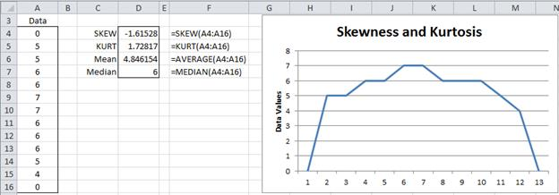

图 14:Excel 中偏斜度和峰度的计算

## 描述性统计数据分析工具

Excel 提供了**描述性统计**数据分析工具，该工具为数据集生成关键描述性统计的摘要。

**示例:**为图 15 的 A 列中的分数生成一个最常见的描述性统计表:

图 15:描述性统计数据分析工具的输出

该工具的输出显示在图 15 的右侧。使用该工具，选择**数据>分析|数据分析**并选择**描述性统计**。出现一个对话框，如图 16 所示:

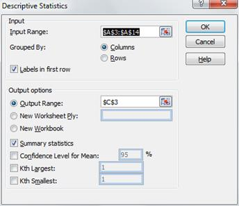

图 16:描述性统计对话框

现在点击**输入范围**并突出显示 A 列的分数(即单元格 A3:A14)。如果您按照这里所做的那样包括标题，请检查第一行中的**标签。由于我们希望输出从单元格 C3 开始，请单击**输出范围**并插入 C3(或单击单元格 C3)。最后点击**汇总统计**，按**确定**。**

请注意，如果我们选中了 **Kth 最大值**复选框，输出也将包含 LARGE(A4:A14，k)的值，其中 k 是我们在标签 **Kth 最大值**右侧的框中插入的数字。同样，勾选**最小**复选框输出小(A4:A14，k)。均值的**置信区间**选项使用第 7 章中解释的 t 分布生成置信区间。

## 数据的图形表示

### 频率表

当您有大量数据时，可以方便地将数据放入通常大小相等的容器中，然后创建每个容器中数据元素数量的图表。Excel 为此提供了**FREQUENCY**(R2 R1)数组函数，其中 R1 =输入数组，R2 = bin 数组。

要使用 FREQUENCY 数组函数，请将数据输入工作表，然后输入一个 bin 数组。仓位数组定义了组成仓位的区间。例如，如果 bin 数组= 10、20、30，则有四个 bin，即值为 ≤ 10 的数据、值为其中 10 <  ≤ 20 的数据、值为其中 20 <  ≤ 30 的数据，最后是值为 > 30 的数据。FREQUENCY 函数只返回一个数组，该数组由每个容器中的数据元素数量组成。

**示例**:基于 bin 数组 D4:D7 为图 17 的 A4:B14 范围内的 22 个数据元素创建频率表(单元格 D8 中的文本“超过 80”不是 bin 数组的一部分):

图 17:频率函数示例

要生成输出，突出显示范围 E4:E8(即比箱数多一个单元格的列范围)，并输入公式:

=频率(A4:B11，D4:D7)

因为这是数组公式，所以必须按 **Ctrl+Shift+Enter** 。Excel 现在在突出显示的范围内插入频率值。这里，E4 包含输入范围中值在第一个箱中的数据元素的数量(即，值≤ 20 的数据元素)。类似地，E5 包含输入范围中值在第二个箱中的数据元素的数量(即值为> 20 且≤ 40 的数据元素)。最终输出单元格(E8)包含输入范围内的数据元素数量，值>为最终箱的值(即本例中的> 80)。

### 直方图

**直方图**是前面描述的频率函数输出的图形表示。您可以使用 Excel 的图表工具来绘制输出，或者，您可以使用直方图数据分析工具来直接完成此操作。

要使用 Excel 的**直方图**数据分析工具，必须先建立一个 bin 数组(至于前面介绍的 FREQUENCY 函数)，然后选择直方图数据分析工具。然后在显示的对话框中，指定输入数据(**输入范围**)和箱数组(**箱范围**)。您可以选择包括这些范围的标签(在这种情况下，您可以单击**标签**)。

对于图 17 中的数据，**输入范围**为 A4:B14，**箱范围**为 D4:D7(未选中标签复选框)。输出如图 18 所示:

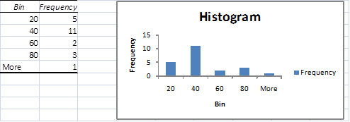

图 18:直方图数据分析示例

无论何时创建直方图，您都应该小心谨慎，以便以清晰准确的方式呈现数据。对于大多数目的来说，间隔大小相等是很重要的(除了第一个和/或最后一个无边界间隔)。否则，可能会呈现数据的失真图像。为了避免这个问题，通常应该使用等间距的间隔。

### 箱线图

表征数据的另一种方法是通过**方框图**。具体来说，箱线图提供了以下统计数据的图示:最大值、第 75 百分位、中值(第 50 百分位)、第 25 百分位和最小值。

正如我们将在后面看到的，当比较样本和测试数据是否对称时，箱线图特别有用。

**示例**:使用 Excel 的图表功能为图 19 中范围 A3:C13 所示的三个品牌创建方框图:

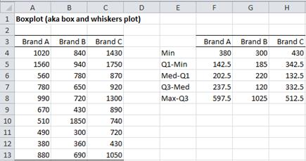

图 19:箱线图数据

选择包含数据的范围，包括标题(A3:C13)。现在，在 E3:H8 范围内创建表格。F 列的输出对应的是 a 列的原始数据，G 列对应的是 B 列，H 列对应的是 c 列，事实上，一旦构造了范围 F4:F8 的公式，就可以通过高亮显示范围 F4:H8 并按 **Ctrl+R** 来填充表格的其余部分。

“F4:F8”范围内单元格的公式如下:

| 细胞 | 内容 |
| --- | --- |
| 法乐四联症 | =最小值(A4:A13) |
| F5 | =四分位数(A4:A13，1)-F4 |
| F6 | =中位数(A4:A13)-四分位数(A4:A13，1) |
| F7 | =四分位数(A4:A13，3)-中位数(A4:A13) |
| F8 | =MAX(A4:A13)-QUARTILE(A4:A13，3) |

表 4:方框图表格中的公式

注意，或者，您可以用 QUARTILE 替换表 4 中的 QUARTILE 函数。EXC 函数。

构建好表格后，您可以创建相应的方框图，如下所示:

1.选择数据范围 E3:H7。请注意，标题包含在范围内，但不在最后一行

2.选择**插入>图表|列>堆叠列**

3.如有必要，选择**设计>数据|切换行/列**，以便轴代表品牌

4.选择图表中最低的数据系列(即 **Min** )，并将填充设置为无填充(如有必要，将边框颜色设置为无线条)以移除最低的框。这是通过右键单击图表中的三个**最小**数据系列框中的任意一个，并选择**格式化数据系列**完成的。在生成的对话框中，选择**填充|无填充**

5.对最低可见数据系列(即**Q1-最小**)重复上述步骤。即右键单击 Q1-民数据系列，选择**格式数据系列……>填充|不填充**。或者，右键单击 Q1-民数据系列并按下 **Ctrl+Y** 。

6.在仍然选择 Q1-最小数据系列的情况下，选择**布局>分析|误差线>更多误差线选项**。在出现的对话框(垂直误差线菜单)中，单击**减去**和**百分比**，并插入 **100%** 的百分比误差

7.点击 **Q3-Med** 数据系列(最上面的一个)，选择**布局>分析|误差线>更多误差线选项**。在生成的对话框(垂直误差线菜单)中，单击 **Plus** 和 **Custom** ，然后单击**指定值**。现在在出现的对话框中(在**正误差值**字段中)指定范围 F8:H8，即您之前创建的表的最后一行。

8.通过选择**布局>标签|图例>无**删除图例

得到的方框图是:

图 20:方框图

对于每个样品，箱线图由一个矩形盒组成，其中一条线向上延伸，另一条线向下延伸(通常称为**须**)。盒子本身分为两部分。特别是，方框图中每个元素的含义如表 5 所示:

| 元素 | 意义 |
| --- | --- |
| 上部须顶 | 样本的最大值 |
| 盒子顶部 | 样本的 75%百分位数 |
| 穿过箱子排队 | 样本的中位数 |
| 盒子底部 | 样本的 25%百分位数 |
| 下部须底部 | 样本的最小值 |

表 5:方框图元素

从方框图中(见图 20)，我们可以看到品牌 C 的得分往往高于其他品牌，品牌 B 的得分往往较低。我们还看到，品牌 A 的分布相当对称，至少在 1 st 和 3 rd 四分位数之间的范围内，尽管对于更高的值存在一些不对称(或者存在潜在的异常值)。品牌 B 和 C 看起来不太对称。由于长的上须(特别是相对于盒子)，品牌 B 可能有一个异常值。

本节中描述的方法非常适用于非负数据。当数据集具有负值时，需要将-MIN(R)添加到所有数据元素中，其中 R 是包含数据的数据范围。这将使 y 轴向上移动–MIN(R)。例如，如果 R 的范围从-10 到 20，那么图表中描述的范围将从 0 到 30。

我们还可以通过单击图表并选择**插入>图表|条形图>堆叠条形图**将箱线图转换为数据的水平表示(如图 21 所示):

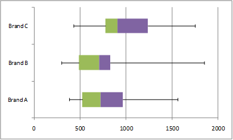

图 21:水平方框图

## 异常值

我们在分析数据时面临的一个问题是存在**异常值**或比其他数据元素大得多或小得多的数据元素。

例如，样本{2，3，4，5，6}的平均值为 4，而{2，3，4，5，60}的平均值为 14.4。60°的外观完全扭曲了第二个样本的平均值。一些统计数据，如中位数，对这种异常值更有抵抗力。事实上，两个样本的中位数都是 4。对于这个例子，很明显 60 是一个潜在的异常值。

处理异常值的一种方法是丢弃过大或过小的数据。Excel 提供了处理这个问题的 TRIMMEAN 函数:

**trimesan**(R，p)–在第一次扔掉 p%的数据后，计算 R 范围内数据的平均值，一半从顶部开始，一半从底部开始。如果 R 包含 n 个数据元素，并且 k =最大整数≤ np/2，则在计算平均值之前移除 k 个最大项和 k 个最小项。

**例**:假设 R = {5，4，3，20，1，4，6，4，5，6，7，1，3，7，2}。那么 trieman(R，0.2)的工作原理如下。由于 R 有 15 个元素，k = INT(15 * 2/2)= 1。因此，从 R 中移除最大的元素(20)和最小的元素(1)以得到 R′= { 5，4，3，4，6，4，5，6，7，1，3，7，2}。TRIMMEAN 现在返回这个范围的平均值，即 4.385，而不是 R 的平均值 5.2。

## 缺失数据

我们在收集数据时面临的另一个问题是，一些数据可能会丢失。例如，当进行一项有 10 个问题的调查时，可能参加调查的一些人没有回答所有的 10 个问题。

Excel 处理缺失数据的主要方式是忽略缺失的数据元素。例如，在本章的各种函数中(AVERAGE，VAR。s、RANK 等。)，任何空白或非数字单元格都将被忽略。