# 四、分布

## 离散分布

离散随机变量的(**概率** ) **频率函数** ，也称为**概率密度函数**(缩写为 **pdf** )被定义为对于随机变量域中的任何值:

其中=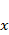取值的概率

对应的(**累计** ) **分布函数** 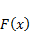定义为

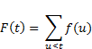

对于随机变量域中的任何值。

对于在具有频率函数和分布函数的域 *S* 上定义的任何离散随机变量:

中的所有

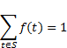

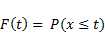

频率函数可以表示为表格或条形图，如下例所述。

**例**:求图 22 中 A、B 列给出的频率函数的分布函数。此外，显示频率和分布函数的图表:

图 22:定义频率和分布函数的表格

给定在图 22 的范围 B4:B11 中定义的频率函数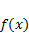，我们可以通过将公式=B4 放在单元格 C4 中，公式=B5+C4 放在单元格 C5 中，然后将该公式复制到单元格 C6 到 C11 中(例如，通过突出显示范围 C5:C11 并按下 **Ctrl+D** )来计算范围 C4:C11 中的分布函数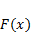。

从图 22 的表格中，我们可以创建图 23 中的图表:

| 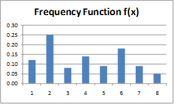 |  |

图 23:频率和分布函数图表

## 连续分布

而对于离散型随机变量，取值在和之间(不含)的概率由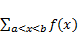给出，连续型随机变量的频率函数可以取无穷多个值(即使在有限的区间内)，所以我们不能简单地用普通的方式对这些值求和。对于连续变量，等效公式是取值在和之间的概率由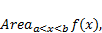给出，即图形下由 x 轴和直线和围成的区域。

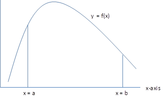

图 24:曲线下面积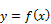

对于连续随机变量 是**频率函数**，也称为**概率密度函数** ( **pdf** )，前提是:

是特定随机变量的**频率函数**，通常称为**概率密度函数**，前提是图 24 所示区域的面积代表取值介于和之间的概率。只取非负值，如果和 x 轴之间的面积为 1，则取曲线之间的面积。

对应的(**累计** ) **分布函数** 定义为:

对于任何具有分布函数的连续随机变量:

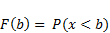

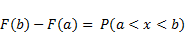

注意取任意特定值的概率不是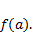事实上，对于任意特定值，取值的概率被认为是 0。

本质上，曲线下的面积是处理连续体中无限范围值时的一种求和方式。对于熟悉微积分的人来说，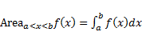。

## Excel 分布函数

下表汇总了 Excel 提供的各种分布函数。标记为 PDF/CDF 的条目指定了概率密度函数(其中函数的最后一个参数为 FALSE)以及(左尾)累积分布函数(其中函数的最后一个参数为 TRUE):

| 分配 | PDF/CDF | 相反的 | 右/双尾 | 试验 |
| --- | --- | --- | --- | --- |
| 贝塔 | BETA 测试版。距离(DIST) | BETA。（同 Inventor）发明者 |  |  |
| 二项式 | 距离 BINOM | inv BOM 表 |  |  |
| 卡方 | 谁啊？距离(DIST) | chiq . inv . inv . inv .不，不，不，不，不，不，不，不，不，不，不，不，不，不，不，不，不，不，不，不，不，不，不 | 谁啊？RT 距离谁啊？INV.RT .型态 | 琪琪。测试 |
| 指数的 | 距离指数 |  |  |  |
| F | F.距离(DIST) | F.（同 Inventor）发明者 | F.RT 距离F.投资部 | F.试验 |
| 微克 | 伽玛(GAMMA)。距离(DIST) | INV 范围 |  |  |
| 超几何的 | HYPGEOM .距离(DIST) |  |  |  |
| 对数正态的 | LOGNORM.DIST | 日志标准. INV |  |  |
| 负二项式 | Negbinom.断续器 |  |  |  |
| 常态 | 距离标准 | NORM。（同 Inventor）发明者 |  |  |
| 泊松 | 鱼啊鱼啊鱼啊鱼啊鱼啊鱼啊鱼啊鱼啊鱼啊鱼啊鱼啊鱼啊鱼啊鱼啊鱼啊鱼啊鱼啊鱼啊鱼啊鱼啊鱼啊鱼啊鱼啊鱼。距离(DIST) |  |  |  |
| 标准正态 | NORM。DIST | NORM。S.INV |  | Z.试验 |
| 学生 T | T.距离(DIST) | T.（同 Inventor）发明者 | T.RT 距离T.距离 2TT.INV.2T | T.试验 |
| （统计学家）威伯尔（或韦布尔） | 威布尔。断续器 |  |  |  |

表 6: Excel 分布函数

表 6 中列出的功能不适用于 Excel 2010 之前的版本。对于早期版本的 Excel，类似的函数集合如表 7 所示:

表 Excel 2010 之前版本的分布函数

| 分配 | 累积分布函数（Cumulative Distribution Function 的缩写） | 便携文档格式 | 相反的 | 试验 |
| --- | --- | --- | --- | --- |
| 贝塔 | 贝特宙斯 |  | 贝达 INV |  |
| 二项式 | BINOMDIST | BINOMDIST | 克里特比侬 |  |
| 卡方 | CHIDIST |  | 奇 INV | 奇塔特 |
| 指数的 | EXPONDIST | EXPONDIST |  |  |
| F | FDIST |  | 费夫 | 福斯特 |
| 微克 | GAMMADIST |  | GAMMAINV |  |
| 超几何的 |  | HYPEGEOMDIST |  |  |
| 对数正态的 | LOGNORMDIST |  | 登录到 |  |
| 负二项式 |  | NEGBINOMDIST |  |  |
| 常态 | NORMDIST | NORMDIST | NORMINV |  |
| 泊松 | POISSON | POISSON |  |  |
| 标准正态 | NORMSDIST |  | 正常的 | z 测试 |
| 学生测试 | 电信标准化组织 |  | 婷婷 | 塔特 |
| （统计学家）威伯尔（或韦布尔） |  | （统计学家）威伯尔（或韦布尔） |  |  |