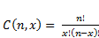

# 第六章二项分布

## 基本概念

假设一个实验具有以下特征:

*   实验由 n 个独立的试验组成，每个试验都有两个互斥的结果(**成功**和**失败**)
*   对于每次试验，成功的概率为 p(因此失败的概率为 1–p)

每一次这样的试验被称为**伯努利试验**。设为离散随机变量，其值为试验的成功次数。那么的概率分布函数称为**二项分布**，定义如下:

其中和 n **因子**为。

可以在 Excel 中使用 **COMBIN** (n，x)函数进行计算。

图 30 显示了 n = 10 且 p = .25 的二项式分布的概率密度函数图:

图 30:二项分布

这个分布的平均值是 np，方差是 NP(1–p)。

## Excel 函数

Excel 提供了以下关于二项式分布的函数:

**BINOM。DIST** (x，n，p，cum)，其中 n =试验次数，p =每次试验成功的概率，cum 取值 TRUE 或 FALSE

BINOM。DIST(x，n，p，FALSE) =二项式分布在 x 处的概率密度函数值，即在 n 次试验中有 x 次成功的概率，其中任何试验的成功概率为 p

BINOM。DIST(x，n，p，真)=二项式分布在 x 处的累积概率分布值，即在任何试验的成功概率为 p 的 n 次试验中最多有 x 次成功的概率

**BINOM。INV** (n，p，1–α)=临界**值**；也就是 x 的最小值，比如 BINOM。DIST(x，n，p，真)≥1–α

对于 Excel 2010 之前的 Excel 版本，改为使用以下函数: **BINOMDIST** ，相当于 BINOM。DIST 和相当于 BINOM.INV 的 **CRITBINOM**

Excel 2013 引入了以下新函数(其中 x ≤ y ≤ n):

**BINOM。DIST.RANGE** (n，p，x，y) =在 n 个试验中，x 和 y 成功的概率(包括在内)，其中任何试验的成功概率为 p

因此，

BINOM 距离范围(n，p，0，y) = BINOM 距离(y，n，p，TRUE)

对于 x > 0

BINOM 距离范围(n，p，x，y) = BINOM 距离(y，n，p，TRUE)

binom .距离(x–1、n、p、TRUE)

y 参数可以省略，在这种情况下，我们有:

binom！binom！距离范围(n，p，x) = BINOM。距离(x、n、p、FALSE)

**例**:一个骰子掷 10 次，会上来一个 6 四次的概率是多少？

我们可以使用 n = 10 且 p = 1/6 的二项式分布对此问题建模，如下所示:

或者，可以使用 Excel 公式解决该问题:

BINOM 距离(4，10，1/6，FALSE) = 0.054266

骰子至少出现 4 次 6 的概率可以用 Excel 公式计算:

1-binom 距离(3，10，1/6，TRUE) = 0.06728

## 假设检验

**例**:假设你有一个骰子，你怀疑它偏向数字 3。所以你做了一个实验，你掷骰子 10 次，然后计算数字 3 出现 4 次。确定芯片是否有偏差。

群体随机变量= 10 次试验中 3 出现的次数具有二项分布。假设是与任何试验的成功概率相对应的群体参数。我们定义了以下无效假设和替代假设:

h0:≤1/6；也就是说，骰子没有偏向数字 3

h1:T2>1/6

现在，设置α = .05，我们有:

 (  ≤ 4) = BINOM。距离(4，10，1/6，true)= 0.984538>0.95 = 1–α。

因此我们以 95%的置信水平**拒绝零假设。**

 ****例**:我们怀疑一枚硬币偏向正面。当我们抛硬币九次时，需要有多少个人头上来，我们才有信心硬币偏向人头？

我们使用以下无效假设和替代假设:

h0:≤5

h1:>5

使用 95%的置信水平(即，α = .05)，我们计算:

binom inv(n，p，1-α)= binom inv(9.5，. 95) = 7

所以 7 是临界值。如果有七个或更多的头像出现，那么我们有 95%的信心硬币偏向头像，所以我们可以拒绝零假设。

请注意，BINOM。DIST(6，9，. 5，真)= .9102 < .95 而比诺姆。DIST(7，9，. 5，真)= .9804 ≥ .95。**