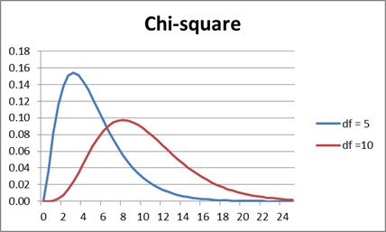
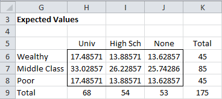
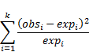
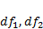

# 第八章卡方分布和 f 分布

## 卡方分布

### 基本概念

k 个自由度的卡方分布具有概率密度函数:

其中是伽玛函数，k 不一定是整数，可以是任意正实数。注意，卡方一般写成。

以下是自由度 df= 5 和 10 的概率密度函数图。随着 df 变大，曲线的脂肪部分向右移动，变得更像正态分布图:

图 43:卡方分布图

卡方与正态分布的关键关系是，如果具有标准正态分布，那么具有一个自由度的卡方分布。

### Excel 函数

Excel 提供了以下关于卡方分布的函数:

**CHISQ。DIST** (x，df，cum) =当 cum =假时，具有 df 自由度的卡方分布在 x 处的概率密度函数值，以及当 cum =真时，在 x 处的相应累积分布函数

**CHISQ。INV** (p，df) =值 x，使得 CHISQ。DIST(x，df，真)= p，即 CHISQ 的倒数。DIST(x，df，真)

**CHISQ。DIST。RT**(x，df) =具有 df 自由度的卡方分布 x 处的右尾

**CHISQ。INV.RT** (p，df) =值，这样 CHISQ。DIST。RT(x，df) = p，即 CHISQ 的倒数。DIST

这些功能在 Excel 2010 之前不可用。下表列出了这些函数的使用方法，以及在 Excel 2010 之前使用的函数 **CHIDIST** 和**chininv**的等效用法:

| 尾巴 | 分配 | 相反的 |
| --- | --- | --- |
| 右尾 | chisq 距离 RT(x，df)= chiq 距离(x，df) | 谁啊？INV.RT( α，df) = CHIINV( α，df) |
| 左尾巴 | chiq . dist(x，df，TRUE) =1-CHIDIST(x，df) | 谁啊？INV( α，df) = CHIINV(1- α，df) |

表 Excel 中卡方分布的公式

### 应急表

卡方分布通常用于确定两组数据是否相互独立。如下例所述，这些数据被组织在所谓的**应急表**中。

**示例**:对 175 名父母被划分为富人、中产阶级或穷人的年轻人进行了一项调查，以确定他们的最高受教育水平(例如，大学毕业、高中毕业或两者都没有)。结果总结在图 44(观测值)的列联表中。根据收集的数据，一个人的受教育程度与父母的财富无关吗？

图 44:应急表(观测值)

我们将零假设设定为:

H 0 :达到的最高学历与父母的财富无关。

为了使用卡方检验，我们需要计算对应于图 44 表格中观察值的期望值。为了实现这一点，我们使用这样一个事实，如果两个事件是独立的，那么两个事件发生的概率等于每个事件发生的概率的乘积。

我们还假设样本的比例是期望值概率的良好估计。

我们现在展示如何构建期望值表(见图 45)。我们从图 44 中得知，样本中的 175 人中有 45 人来自富裕家庭。所以样本中有人来自富裕家庭的概率是 45/175 = 25.7%。同样，样本中有人大学毕业的概率为 68/175 = 38.9%。但基于零假设，来自富裕家庭与大学毕业无关，因此，两者的预期概率只是这两个事件的乘积，即 25.7%∙38.9% = 10.0%。因此，基于零假设，我们预计 175 人中有 10.0% = 17.5 人来自富裕家庭并已从大学毕业:

图 45:期望值

因此，例如，可以通过公式计算单元 H6 = H $ 9 * $ K6/$ K $ 9。如果突出显示范围 H6:J8，然后按 **Ctrl+D** ，然后按 **Ctrl+R** ，您将填写表格的其余部分。

或者，您可以通过突出显示范围 H6:J8 并输入数组公式来填写期望值表:

=MMULT(K6:K8，H9:J9)/K9

### 独立性测试

皮尔逊卡方检验统计量定义为:

对于足够大的样本，皮尔逊卡方检验统计量近似具有(行计数–1)(列计数–1)个自由度的卡方分布。

测试要求满足以下条件:

*   随机抽样:数据必须来自人口的随机抽样
*   独立性:观察必须相互独立。这意味着卡方不能用于测试相关数据(例如，匹配对)

*   单元格大小:列联表中的所有预期频率值都至少为 5，尽管对于大型表，偶尔低于 5 的值可能仍会产生良好的结果。对于 2×2 的列联表，最好有更大的频率值。

在图 46 中，我们展示了如何使用卡方检验进行分析:

图 46:卡方检验

由于 p-value = 0.003273 < .05 = α*，*我们拒绝了无效假设，并得出一个人的受教育程度与父母的财富无关的结论。

Excel 提供了以下函数，用于执行列联表独立性的卡方检验:

**CHISQ。测试**(R2 R1)= CHISQ。DIST。RT(x，df)其中 R1 =观测数据数组，R2 =期望值数组，x 是卡方统计量，df =(行数–1)(列数–1)。

举个例子，CHISQ。测试(B6:D8，H6:J8) = 0.003273。

CHISQ。测试功能仅在从 Excel 2010 开始的 Excel 版本中可用。对于以前版本的 Excel，可以使用等效函数 **CHITEST** 。

## F 分布

### 基本概念

如果和分别具有带有和自由度的卡方分布，那么商 F =  / 具有带有自由度的 **F 分布**。

f 分布通常用于比较两个方差。它在方差分析、回归和其他常用测试中很有用。特别地，如果我们分别从两个具有相同方差的不同正态总体中抽取大小为和的两个独立样本，那么这两个样本方差的商具有带有自由度的 F 分布。

### Excel 函数

Excel 提供了以下关于 F 分布的函数:

**F.DIST** (x，df，cum) =当 cum =假时，具有 df 自由度的 F 分布在 x 处的概率密度函数值，以及当 cum =真时，在 x 处的相应累积分布函数

**F.INV** (p，df) =值 x，使得 F.DIST(x，df，真)= p，即 F.DIST(x，df，真)的倒数

**F.DIST.RT** (x，df) =具有 df 自由度的 F 分布 x 处的右尾

**F.INV.RT** (p，df) =值，使得 F.DIST.RT(x，df) = p，即 F.DIST.RT(x，df)的倒数

这些功能在 Excel 2010 之前不可用。下表列出了如何使用这些函数，以及使用 Excel 2010 之前可用的函数 **FDIST** 和 **FINV** 的等效函数:

| 尾巴 | 分配 | 相反的 |
| --- | --- | --- |
| 右尾 | F.DIST.RT(x，df 1 ，df 2 ) = FDIST(x，df 1 ，df 2 | F.INV.RT( α，df 1 ，df2= finv(α，df 1 ，df 2 |
| 左尾巴 | F.DIST(x，df 1 ，df 2 ，真)= 1–FDIST(x，df 1 ，df 2 | F.INV( α，df 1 ，df2= finv(1-α，df 1 ，df 2 |

表 10:Excel 中的 F 分布公式

### 假设检验

正如我们之前观察到的，如果我们分别从两个具有相同方差的不同正态总体中抽取大小为和的两个独立样本，那么这两个样本方差的商具有带有自由度的 F 分布。

这个事实可以用来检验两个总体的方差是否相等。为了专门处理分布的右尾，当取样本方差的比率时，我们应该把较大的方差放在商的分子中。

为了使用该测试，必须具备以下条件:

*   两个种群都是正态分布的
*   两个样本都是独立抽取的。
*   在每个样本中，观察值是随机采样的，并且彼此独立

### 示例

一家公司正在比较生产高精度螺栓的两种方法，希望选择可变性最小的方法。使用图 47 左侧表格中给出的两种方法，对螺栓长度进行了取样:

图 47:比较两个差异的 f 检验

为了进行测试，我们使用了 Excel 的 **F-Test 两样本方差**数据分析工具，和往常一样，可以通过选择**数据>分析|数据分析**来访问该工具。结果显示在图 47 的右侧。

由于 p 值= . 271364 > . 05 =α，我们不能拒绝零假设。所以我们必须得出结论，这两个方差之间没有显著差异。

### Excel 测试功能

Excel 提供以下测试统计功能:

**F 检验**(R2 R1)=比较 R1 和 R2 范围内样本方差的双尾 f 检验= R1 和 R2 范围内数据方差无显著差异的双尾概率。

请注意，与单尾的 F-Test 数据分析工具或 F.DIST、F.DIST.RT、F.INV 和 F.INV.RT 函数不同，F.TEST 函数是双尾的。对于前面的示例:

F.测试(A4:A18，B4:B18) = .5427

这是图 47 单元格 E11 中单尾 p 值的两倍。