# 九、方差分析

## 攻略

本质上，方差分析**(方差分析)是两样本假设检验的扩展，用于比较两个以上样本的平均值(当方差未知时)。**

 **我们从单因素案例开始。我们将在后面定义因子的概念，但是，现在，我们简单地将这种类型的分析视为具有相等总体方差的两个独立样本 t 检验的扩展。

## 单因素方差分析

### 单向方差分析示例

一家食品公司想确定他们的三种花生酱新配方是否比旧配方更美味。他们随机制作了四个样本，每个样本 10 个人(每种花生酱一个)，并要求每个样本中的人品尝该样本的花生酱。然后，他们要求所有 40 个人填写一份问卷，对他们尝试的花生酱的味道进行评分。

根据图 48 中的数据，确定四种花生酱之间是否有显著差异:

图 48:样本数据

这个例子的无效假设是，四种花生酱之间的任何差异都是由于偶然，即:

H 0 : 

### 基本概念

在我们继续分析这个例子之前，我们应该回顾几个基本概念。

假设我们有样本，我们称之为**组**(或**治疗**)。这些是我们分析中的列(对应于示例中的四种花生酱)。我们将使用索引进行这些操作。每组由尺寸为的样品组成。样本元素是分析中的行。我们将使用索引进行这些操作。

假设第组样本为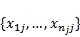，因此总样本由所有元素组成。我们将使用缩写表示第组样本的平均值(称为**组平均值**)和表示总样本的平均值(称为**总**或**大平均值**)。

让第组的**平方和**为。我们现在定义以下术语:

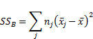

是**总**样本的平方和，也就是偏离总平均值的平方和。是组内的平方和**，即所有组的平方平均值之和。是**组样本均值之间的平方和**，即组均值与大均值的方差的加权和。**

我们还定义了以下自由度，其中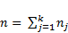:

最后，我们定义**均方**，为，如此:

我们在下表中总结了这些术语:

|  |  |  |  |
| --- | --- | --- | --- |
|  |  | 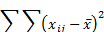 |  |
|  |  |  |  |
|  |  |  | 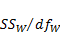 |

表 11:方差分析术语汇总

显然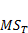是总样本的方差，是组样本方差之和，是“样本间”的方差，即的方差。

也不难看出:

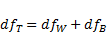

原来，如果零假设为真，那么和都是同一误差的度量。因此，零假设变得等同于这些统计的总体版本相等的假设，即:

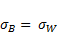

因此，我们可以使用第八章中描述的 f 检验来确定是否拒绝零假设。这意味着如果独立正态分布，所有相等(零假设)，所有相等(方差齐性)，那么检验统计量:

具有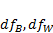自由度的 F 分布。

### 分析

为了进行示例分析，我们将使用**方差分析:单因素**数据分析工具。要访问该工具，按下**数据>分析|数据分析**并填写如图 49 所示的对话框:

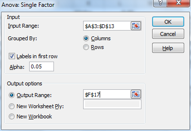

图 49:方差分析对话框:单因素数据分析工具

输出如图 50 所示:

图 50:方差分析:单因素数据分析

图 50 中的所有字段都是按照前面的描述计算的。我们可以看到测试统计是 F = 3.206928。由于 p 值= F.DIST.RT(3.206928，3，36) = 0.034463 < .05 = *α* ，我们拒绝四种不同类型花生酱的评价没有显著差异的零假设。

### 随访分析

虽然我们现在知道这四种花生酱有很大的区别，但我们仍然不知道区别在哪里。

从图 50 中可以看出，新 2 比其他类型的花生酱具有更高的评级。我们可以使用 t 检验来确定新 2 和新 1 的评分是否有显著差异，新 1 是评分第二高的花生酱。结果如图 51 所示:

| t 检验:假设方差不相等的双样本 |
|  |  |  |
|  | *新增 1* | *新增 2* |
| 均值 | Thirteen point one | Sixteen point six |
| 差异 | 21.21111 | 7.155556 |
| 观察 | Ten | Ten |
| 假设平均差异 | Zero |  |
| Df | Fourteen |  |
| t 州 | -2.07809 |  |
| P(T<=t)单尾 | 0.028289 |  |
| 临界单尾 | 1.76131 |  |
| P(T<=t)双尾 | 0.056577 |  |
| 临界双尾测试 | 2.144787 |  |

图 51:后续分析:新 1 与新 2

从图 51 中，我们看到基于双尾检验(0.056577 > .05)，两种类型的花生酱之间没有显著差异。如果我们将 New 2 与旧公式进行比较，我们会得到如图 52 所示的结果:

| t 检验:假设方差不相等的双样本 |
|  |  |  |
|  | *旧* | *新增 2* |
| 均值 | Eleven point one | Sixteen point six |
| 差异 | 18.76667 | 7.155556 |
| 观察 | Ten | Ten |
| 假设平均差异 | Zero |  |
| Df | Fifteen |  |
| t 州 | -3.41607 |  |
| P(T<=t)单尾 | 0.001915 |  |
| 临界单尾 | 1.75305 |  |
| P(T<=t)双尾 | 0.003829 |  |
| 临界双尾测试 | 2.13145 |  |

图 52:后续分析:旧与新 2

这一次，我们使用双尾 t 检验发现这两种花生酱有显著差异(. 003829 < .05)。

这种方法的问题在于，进行多次测试会产生更大的实验误差。请记住，当我们使用显著性水平α = .05 时，我们接受有 5%的时间会出现 I 型错误。如果我们执行三个这样的测试，那么我们将基本上将我们的 I 型总体误差增加到 1 –( 1 –. 05)3= . 14。这意味着 14%的情况下，我们会有一个高于我们预期的 I 型错误。

解决这个问题的一般方法是，要么使用 **Bonferroni 的校正**来减少α(例如，对于三个测试，我们使用α/3 = .05/3 = .0167)，要么使用不同类型的测试(例如， **Tukey 的 HSD** 或 **REGWQ** )，这超出了本书的范围。

### 勒温的测试

如前所述，方差分析测试要求群体方差相等。这里有很大的回旋余地，即使当一组的方差是另一组的四倍时，分析也会很好。检验群体方差同质性的另一种选择是使用**勒文检验。**

对于莱文测试，来自单元平均值的组平均值的残差计算如下:

然后对残差的绝对值进行方差分析。如果组方差相等，那么所有组的残差的平均大小应该相同。

测试有三个版本:使用平均值(如上所述)、使用中位数或使用修剪平均值。

**示例**:使用勒文检验(中位数的残差)确定方差分析示例中的四组是否具有显著不同的总体方差。

我们首先计算每组的中位数(图 53 的 B14:E14 范围)。例如，单元格 B14 包含公式=中位数(B4:B13)。

接下来，我们用中值的绝对残差创建表格(范围 B19:E29)。我们通过在单元格 B20 中输入公式=ABS(B4-B$14)，突出显示范围 B20:E29，然后按 **Ctrl+R** ，然后按 **Ctrl+D** 来实现。

最后，我们使用本章前面关于输入范围 B19:E29 中描述的**方差分析:单因素**数据分析工具。输出如图 53 右侧所示:

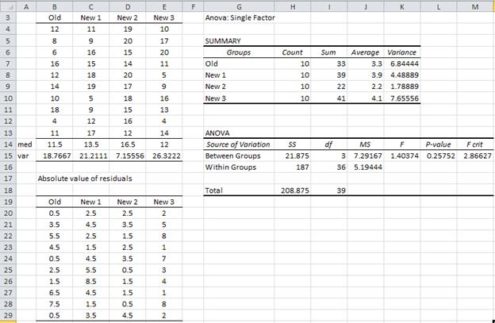

图 53:莱文测试

由于 p 值= .25752 > .05 = α，我们不能拒绝零假设。因此，我们可以得出结论，四组方差之间没有显著差异。因此，先前进行的方差分析测试满足方差均一性假设。

## 因子方差分析

### 示例

开发了一种新的肥料来提高农作物的产量。这种肥料的制造商希望更好地了解这种肥料的三种配方(或混合物)中哪一种对小麦、玉米、大豆和水稻(作物)最有效。他们在四种作物的五个样本上测试了三种混合物中的每一种。12 个组合中每一个组合的五个样本的作物产量如图 54 所示。

根据这三种肥料确定作物产量是否有差异。

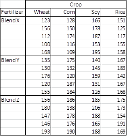

图 54:双因素方差分析的样本数据

在我们继续分析这个例子之前，我们应该回顾几个基本概念。

### 基本概念

我们现在将前面描述的单因素方差分析模型扩展到具有多个因素的模型。

A **因子**为自变量。一个因素方差分析解决了因素。最后一个示例的模型包含两个因素:作物和混合。

A **级**是某个因素的某个方面；这些就是我们在前面描述的单因素分析中所说的分组或治疗。混合因子包含三个级别，裁剪因子包含四个级别。

让我们更详细地看看双因素模型。

假设我们有两个因子，A 和 B，其中因子 A 有级，因子 B 有级。我们将因子 A 的级别组织为行，将因子 B 的级别组织为列。我们对行使用索引(即因子 A)，对列使用索引(即因子 B)。

这产生了一个 × 表，其条目为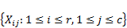，其中是因子 A 的水平和因子 b 的水平的样本。这里，我们进一步假设的大小都相等，并使用作为样本条目的索引。

我们使用(或)等术语作为平均值的缩写

我们还将前面描述的单因素模型的平方和、均方和自由度的定义扩展到双因素模型，如表 12 所示:

| *SS* | *Df* | *MS* |
| --- | --- | --- |
| 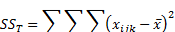 | 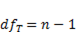 | 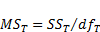 |
|  |  | 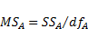 |
| 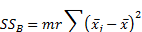 |  | 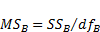 |
| 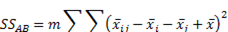 |  | 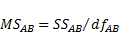 |
|  | 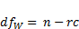 |  |

表 12:双因素方差分析术语

请注意，除了 A 和 B 因素之外，模型还包含这些因素之间的交集(表中标记为 AB)，该交集由每个因素级别的 × 组合中的元素组成。

不难看出:

原来，如果零假设为真，那么和都是同一误差的度量。因此，零假设等同于这些统计量的总体版本相等的假设，即:

因此，我们可以使用第 8 章中描述的 f 检验来确定是否拒绝零假设，也就是说，如果独立且正态分布，并且所有相等(零假设)，并且所有相等(方差的同质性)，那么检验统计量:

具有自由度的 F 分布。

### 分析

为了进行最后一个例子的分析，我们将使用**方差分析:双因素复制**数据分析工具。如往常一样，要访问该工具，选择**数据>分析|数据分析**并填写如图 55 所示的对话框:

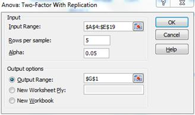

图 55:方差分析对话框:带有复制分析工具的双因素

按下**确定**后，出现图 56 和 57 所示的输出:

| 方差分析:复制的双因素 |  |  |  |
|  |  |  |  |  |  |
| 摘要 | 小麦 | 玉米 | 大豆 | 米 | 总数 |
| *混合 X* |  |  |  |  |  |
| 数数 | five | five | five | five | Twenty |
| 总和 | Six hundred and fifty-nine | Six hundred and seventy-seven | Eight hundred and seventy-nine | Seven hundred and six | Two thousand nine hundred and twenty-one |
| 平均的 | One hundred and thirty-one point eight | One hundred and thirty-five point four | One hundred and seventy-five point eight | One hundred and forty-one point two | One hundred and forty-six point zero five |
| 差异 | Eight hundred and forty-four point two | Seven hundred and seven point eight | Two hundred and seventy-eight point seven | Three hundred and fifty-four point two | 782.3658 |
|  |  |  |  |  |  |
| *混合 Y* |  |  |  |  |  |
| 数数 | five | five | five | five | Twenty |
| 总和 | Seven hundred and sixteen | Seven hundred and ninety-eight | Seven hundred and one | Eight hundred and twenty-seven | Three thousand and forty-two |
| 平均的 | One hundred and forty-three point two | One hundred and fifty-nine point six | One hundred and forty point two | One hundred and sixty-five point four | One hundred and fifty-two point one |
| 差异 | Four hundred and ninety-eight point seven | Nine hundred and seventy-eight point three | One hundred and sixty-five point seven | Two hundred and seventeen point three | 511.0421 |
|  |  |  |  |  |  |
| *混合 Z* |  |  |  |  |  |
| 数数 | five | five | five | five | Twenty |
| 总和 | Eight hundred and twenty-two | Eight hundred and sixty-eight | Nine hundred and thirty-two | Eight hundred and sixty-two | Three thousand four hundred and eighty-four |
| 平均的 | One hundred and sixty-four point four | One hundred and seventy-three point six | One hundred and eighty-six point four | One hundred and seventy-two point four | One hundred and seventy-four point two |
| 差异 | Four hundred and forty-three point three | Four hundred and twenty-eight point eight | Two hundred and twelve point three | One hundred and seventy-five point eight | 330.6947 |
|  |  |  |  |  |  |
| *总计* |  |  |  |  |  |
| 数数 | Fifteen | Fifteen | Fifteen | Fifteen |  |
| 总和 | Two thousand one hundred and ninety-seven | Two thousand three hundred and forty-three | Two thousand five hundred and twelve | Two thousand three hundred and ninety-five |  |
| 平均的 | 146.4667 | One hundred and fifty-six point two | 167.4667 | 159.6667 |  |
| 差异 | 705.8381 | 871.0286 | Six hundred and five point nine eight one | 404.9524 |  |

图 56:双因素方差分析描述性统计

| 方差分析 |  |  |  |  |  |  |
| *变异来源* | *SS* | *df* | *MS* | *F* | *P 值* | *F 暴击* |
| 样品 | Eight thousand seven hundred and eighty-two point nine | Two | Four thousand three hundred and ninety-one point four five | 9.933347 | 0.000245 | 3.190727 |
| 列 | Three thousand four hundred and eleven point six five | three | One thousand one hundred and thirty-seven point two one seven | 2.572355 | 0.064944 | 2.798061 |
| 互动 | Six thousand two hundred and twenty-five point nine | six | One thousand and thirty-seven point six five | 2.347138 | 0.045555 | 2.294601 |
| 在…之内 | Twenty-one thousand two hundred and twenty point four | Forty-eight | 442.0917 |  |  |  |
|  |  |  |  |  |  |  |
| 总数 | Thirty-nine thousand six hundred and forty point eight five | Fifty-nine |  |  |  |  |

图 57:双因素方差分析

我们现在可以从图 57 中的方差分析表中得出一些结论。既然 p 值(作物)= .0649 > .05 = α，我们就不能拒绝 B 因子零假设。因此，我们可以得出结论(有 95%的把握)，不同作物的肥料效力没有显著差异。

由于 p 值(混合)= .00025 < .05 = α，我们拒绝因子 A 零假设，并得出混合之间存在统计差异的结论。

我们还看到 p 值(相互作用)= .0456 < .05 = α，因此我们得出结论，作物和混合物之间的相互作用存在显著差异。我们可以通过绘制两个因素之间的平均相互作用来更仔细地观察相互作用(见图 58)。大致平行的线表示缺乏相互作用，而不大致平行的线表示相互作用。

从第一张图表中，我们可以看到品牌 X 与其他品牌有着完全不同的模式(尤其是大豆)。虽然不太引人注目，但品牌 Y 也不同于品牌 Z(特别是因为品牌 Y 的线条倾向于大豆，但倾向于大米，与品牌 Z 完全相反):

图 58:交互图

虽然有更多的可能性，但后续测试是针对单向方差分析进行的。

## 重复测量的方差分析

### 基本概念

**重复测量方差分析**是配对样本检验的 t 检验对两个以上变量的扩展。至于配对样本 t 检验，这种类型的方差分析和我们到目前为止考虑的检验之间的关键区别是考虑的变量不是独立的。

这种类型分析的一些例子有:

*   一项研究由 30 名受试者组成，每个人都被要求参加驾驶汽车、船和飞机的测试
*   一项研究由 30 只老鼠组成，每只老鼠每天接受一次训练，持续 10 天，每天记录它们的得分
*   一项对 30 对已婚夫妇进行的研究将丈夫的智商与妻子的进行了比较

每一个例子的重要特点是治疗方法不是相互独立的。这些分析中最常见的是比较一段时间内给予同一参与者的某些治疗的结果(如第二个例子)。

### 示例

已经开发了一个项目来降低新妈妈的焦虑程度。为了确定该项目是否成功，选择了 15 名女性样本，并在项目开始前测量了她们的焦虑水平(分数低表示焦虑水平较高)。他们的焦虑程度也在项目开始后的一、二和三周进行了测量。根据图 59 中的数据，确定该计划在减少焦虑方面是否有效。

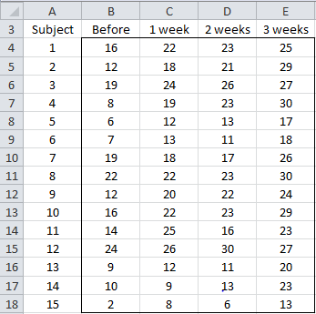

图 59:样本数据

### 分析

为了进行重复测量的方差分析，我们使用 Excel 的**方差分析:无复制的双因素**数据分析工具。

要访问该工具，请按**数据>分析|数据分析**并填写如图 60 所示的对话框:

图 60:方差分析对话框:无复制的双因素

按下**确定**后，出现图 61 和 62 所示的输出:

| 方差分析:无复制的双因素 |  |  |
|  |  |  |  |  |
| *总结* | *计数* | *总和* | *平均值* | *方差* |
| one | four | Eighty-six | Twenty-one point five | Fifteen |
| Two | four | Eighty | Twenty | Fifty |
| three | four | Ninety-six | Twenty-four | 12.66667 |
| four | four | Eighty | Twenty | 84.66667 |
| five | four | Forty-eight | Twelve | 20.66667 |
| six | four | forty-nine | Twelve point two five | 20.91667 |
| seven | four | Eighty | Twenty | 16.66667 |
| eight | four | Ninety-seven | Twenty-four point two five | 14.91667 |
| nine | four | seventy-eight | Nineteen point five | 27.66667 |
| Ten | four | Ninety | Twenty-two point five | 28.33333 |
| Eleven | four | seventy-eight | Nineteen point five | 28.33333 |
| Twelve | four | One hundred and seven | Twenty-six point seven five | Six point two five |
| Thirteen | four | fifty-two | Thirteen | 23.33333 |
| Fourteen | four | Fifty-five | Thirteen point seven five | 40.91667 |
| Fifteen | four | Twenty-nine | Seven point two five | 20.91667 |
|  |  |  |  |  |
| 以前 | Fifteen | One hundred and ninety-six | 13.06667 | 39.35238 |
| 1 周 | Fifteen | Two hundred and seventy | Eighteen | 34.28571 |
| 两周 | Fifteen | Two hundred and seventy-eight | 18.53333 | 44.69524 |
| 3 周 | Fifteen | Three hundred and sixty-one | 24.06667 | 26.35238 |

图 61:方差分析描述性统计

| 方差分析 |  |  |  |  |  |  |
| *变异来源* | *SS* | *df* | *MS* | *F* | *P 值* | *F 暴击* |
| 行 | One thousand seven hundred and two point eight three three | Fourteen | One hundred and twenty-one point six three one | 15.82722 | 1.95E-12 | 1.935009 |
| 列 | 910.9833 | three | 303.6611 | 39.51389 | 2.69E-12 | 2.827049 |
| 错误 | 322.7667 | forty-two | 7.684921 |  |  |  |
|  |  |  |  |  |  |  |
| 总数 | Two thousand nine hundred and thirty-six point five eight three | Fifty-nine |  |  |  |  |

图 62:重复测量的双因素方差分析

对于重复测量的方差分析，我们对行的分析不感兴趣，只对列感兴趣，列对应于时间的变化。由于图 62 中的检验统计量 F = 29.13 > 2.83 = F-crit(或 p 值= 2.69E-12 < .05 = α)，我们拒绝零假设。我们可以得出结论，平均焦虑水平按周有显著差异。

### 假设

匹配样本的方差分析要求如下:

*   受试者是独立的，从人群中随机选择
*   正态性(或至少是对称性)——尽管限制过多，但每次处理(即数据范围内的每一列)都满足这个条件就足够了
*   球形

当样本之间的成对方差都相等时，数据满足**球形度**属性。这个假设比前面描述的其他版本的方差分析的同质性假设更强。

我们在图 63 中进行球形度测试:

图 63:球形度

虽然图 63 的 U 列中的值不相等，但它们之间的距离并不太远。此外，特别是由于图 62 中获得的 p 值如此之低，我们认为球形度对于这个例子来说不是什么大问题。

当球形度有问题时，我们可以使用多种校正因子来改善方差分析结果。不幸的是，解释这一点将使我们远离我们在这里的目的。如果您想了解更多信息，请点击这里的。

### 随访分析

由于第三周的平均分数为 24.07，远高于之前的平均分数 13.07(见图 61)，因此参加该项目似乎会产生积极的影响。我们可以通过使用配对样本 t 检验来证实这一点，比较前三周和后三周，如图 64 所示:

| t 检验:两个样本配对的平均值 |  |
|  |  |  |
|  | *在*之前 | *3 周* |
| 均值 | 13.06667 | 24.06667 |
| 差异 | 39.35238 | 26.35238 |
| 观察 | Fifteen | Fifteen |
| 皮尔逊相关 | 0.718509 |  |
| 假设平均差异 | Zero |  |
| Df | Fourteen |  |
| t 州 | -9.66536 |  |
| P(T<=t)单尾 | 7.11E-08 |  |
| 临界单尾 | 1.76131 |  |
| P(T<=t)双尾 | 1.42E-07 |  |
| 临界双尾测试 | 2.144787 |  |

图 64:配对 t 检验:三周前与三周后

我们看到 p 值= 1.42E-07，这比. 05 要小得多，从而证实了前三周和后三周之间存在显著差异。

事实上，我们可以从图 65 中看到，即使在一周后，分数也有显著提高:

| t 检验:两个样本配对的平均值 |  |
|  |  |  |
|  | *在*之前 | *1 周* |
| 均值 | 13.06667 | Eighteen |
| 差异 | 39.35238 | 34.28571 |
| 观察 | Fifteen | Fifteen |
| 皮尔逊相关 | 0.810897 |  |
| 假设平均差异 | Zero |  |
| Df | Fourteen |  |
| t 州 | -5.09437 |  |
| P(T<=t)单尾 | 8.17E-05 |  |
| 临界单尾 | 1.76131 |  |
| P(T<=t)双尾 | 0.000163 |  |
| 临界双尾测试 | 2.144787 |  |

图 65:配对 t 检验:一周前与一周前

事实上，即使我们使用. 05/2 = .025 应用 Bonferroni 的校正系数(因为我们现在已经执行了两次 t 检验)，我们也可以看到 p-value = .000163 < .025)，这证实仅一周后就有显著的改善。**