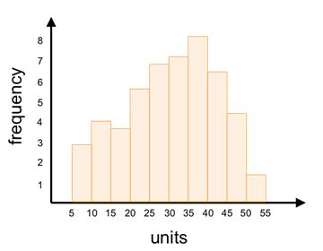
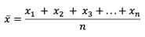
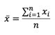
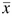

# 中心倾向

**中心趋势**是描述一组值聚集的一个点的术语。**中心的度量**是描述中心趋势的统计量。你可能听说过三种最常用的中心度量:**表示**、**中间值**和**模式**。本章将定义和描述如何计算每一个。知道它们是什么很重要，知道它们是什么意思也很重要，尤其是相互之间的关系。通过观察平均值、中位数和模式之间的相互比较，我们可以更好地理解数据所讲述的故事。

#### 方式

该模式是数据集中大多数数字出现的地方，即**频率**最大的地方。这可以是一个数字或一组数字。例如，在小数据集{2，3，3，4，6}中，模式为 3，因为频率为 2 (3 出现两次)，而其他值的频率为 1。

一个**直方图**是可视化一个分布模式最常见的方法。直方图是一种特殊类型的条形图，在 x 轴上显示数据集的值，在 y 轴上显示这些值的频率。x 轴上的值被分组到指定范围或类别的箱中。


图 1:数据集{2，3，3，4，6}的直方图显示模式为 3。

模式不一定是数字。比如说当地的高中生物课，10%的学生得了 A，40%得了 B，35%得了 C，15%不及格。在这种情况下，模式是 b 的等级。这种类型的数据集是**分类数据**(与**数值数据**相对)的一个例子，其中数据按类别排列(在这种情况下，类别中的等级)。


图 2:在这个分类数据集中，模式是 b 级。

|  | 注意:图 2 中的 y 轴显示的是相对频率——每个类别相对于其他类别的频率——而不是绝对频率，绝对频率描述的是每个类别中的绝对数字。 |

对于大型连续数据集，模式是频率最高的范围。下面的直方图显示了十个面元，每个面元的宽度为 5 个单位。您可以很容易地看到模式是范围(35，40)。请记住，模式是*，其中*出现最大频率(沿 x 轴的值)，而不是*频率是什么(即模式不是 8)。*



图 3:这个直方图显示的数据集的模式是范围(35，40)。

#### 中位数

中位数是衡量中心的另一个标准。这个统计数据是一个数据集中 50%的值较小，50%的值较大的数字。对于具有奇数个值的数据集，中值是数据集中的实际值，正好位于中间。例如，数据集{5，6，8，12，15}的中位数为 8。两个值小于 8，两个值大于 8。

当一个数据集有偶数个值时，中位数是两个中间数的平均值。数据集{4，6，9，11，17，18}的中位数是 10，即 9 和 11 的平均值。三个值小于 10，三个值大于 10。

您可能已经注意到值必须是有序的；否则无法计算中位数。还要注意，我们不能找到分类数据的中位数，但我们可以找到数字数据的中位数。

|  | 注意:与模式不同，我们不能通过查看直方图轻易看出中位数在哪里。我们需要将这些值按顺序排列，找到中间的数字。 |

请注意，小于或大于中间值的数字可以是任何数字(只要它们保持小于或大于中间值)，并且中间值将保持不变。例如，以下数据集都具有相同的中位数:

{5, 6, 8, 12, 15}

{5, 6, 8, 20, 300}

{-100, -16, 8, 12, 15}

{-100, -16, 8, 20, 300}

因此，中位数本身并不能充分描述一个数据集。

有一个统计数据来说明每个值也是有帮助的。这就是为什么更常见的衡量中心的标准是平均值。

#### 均值

与模式和中值不同，平均值(也称为算术平均值)在计算中使用数据集中的每个值。

|  | 注:存在其他类型的平均值(如几何平均值、调和平均值)，但算术平均值是最常见的。这是“算术”，因为它是通过将数据集中的每个值相加，然后除以值的数量来计算的。 |

对于一个数据集{ *x* <sub class="calibre24">1</sub> ，*x*T6】2，*x*T10】3，…*x*T14】n}，其中 *n* 是数据集中的数值个数，平均值用 (x-bar)表示，等于:



我们可以改写为:



希腊文大写字母 sigma ( )象征取和。底部和顶部的 *i* = 1 和 *n* 表示我们应该在求和中使用的 *i* 的值:1、2、3、… *n* 。所以，我们应该把下标 *i* 从 *x <sub class="calibre24"> i </sub>* 替换为 1、2、3，一直到 *n* (其中 *n* 可以是任意数字)。这就转化为求 *x <sub class="calibre24"> 1 </sub>* 、 *x <sub class="calibre24"> 2 </sub>* 、 *x <sub class="calibre24"> 3 </sub>* 的和，一直到 *x <sub class="calibre24"> n </sub>* 。然后我们将总和除以 *n* 求平均值。

我们用符号 (x-bar)表示样本的平均值，用符号μ (mu)表示总体的平均值。一般来说，我们在描述样本时使用小写字母，在描述总体时使用大写字母(*X<sub class="calibre24">I</sub>T4】是样本的值， *n* 是样本大小，而*X<sub class="calibre24">I</sub>T10】是总体的值， *N* 是总体大小)。因此，一个总体的平均值表示为:**


|  | 注意:如果你想知道为什么统计符号必须如此复杂，你并不孤单。但是一旦你掌握了它，这种语言是一种非常有用的工具，可以快速方便地交流复杂的统计思想。 |

因为平均值在其计算中使用每个值，**异常值**(数据集中与同一数据集中的其他值有显著差异的值)会严重影响它。以下面两个数据集为例，其中一个有异常值:

{4，6，7，10}  = 6.75

{4，6，7，100}  = 29.25

这个例子说明了为什么平均值并不总是衡量中心的最佳标准。如果我们只知道第二个数据集的平均值，我们会认为这些值聚集在 29.25 左右，而实际上 75%的值小于 8。

当数据集的平均值、中值和模式大致相等时，平均值用于计算许多其他统计数据(例如，数据的分布情况)，以执行大量分析。因此，平均值是最常用的中心度量。

让我们看看如何使用 NCES 数据找到 R 中的平均值、中位数和众数。(如果还没有下载数据，导入 R，运行 **attach()** 功能，先这样做。)

代码清单 2

```py
  >  mean(income2011)  #outputs
  the mean of respondents’ income in 2011
  [1] 27302
  >  median(income2011)  #outputs
  the median of respondents’ income in 2011
  [1] 24000
  >  hist(income2011)  #outputs
  a histogram of respondents’ income in 2011

  >  hist(income2011, breaks=20) #outputs a histogram with smaller bin sizes

```

您可以看到变量“income2011”有很大的偏差(即大多数值都落在整个数据范围的一侧)。大多数学生的家庭收入低于 5 万美元。

这种偏斜导致平均值大于中位数。回想一下，中位数不受异常值的影响，因为它是精确的中间值，而平均值受数据集中每个值的影响。在这种情况下，离群值(家庭收入为 25 万美元的学生)将平均值向右拉。当平均值不同于中位数时，表明存在异常值和偏斜分布，如本例所示。

总的来说，平均值、中值和模式可以对数据集提供有用的描述。在下一章中，您将学习计算数据集可变性的方法，换句话说，就是“分散”的值是如何相互关联的。在描述数据时，可变性和中心的度量一样重要。