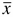
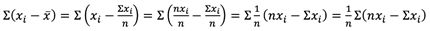
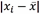
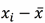
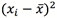
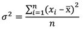
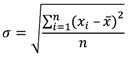
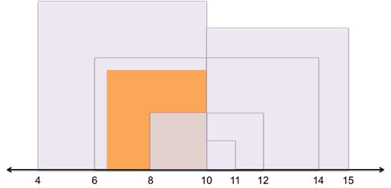
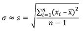

# 二、可变性

虽然中心度量描述了数据集中的值聚集的位置，但是**分布度量**描述了数据集中的**可变性**(分布值的方式)。

考虑这个简单的例子，它说明了为什么我们可能想知道现实世界中的可变性——决定假期带什么衣服的任务。假设你的目的地城市的平均气温是华氏 74 度。仅根据这个数字，你可能只会带短裤和 t 恤。但是如果高点是 102 华氏度，低点是 34 华氏度呢？了解了这个范围后，你可能会想带一件外套和一套泳衣。

在本章中，你将学习测量传播的常用方法。

#### 范围

在温度示例中，**范围**是一个有用的传播度量。要计算它，从最大值中减去最小值:102 华氏度–34 华氏度= 68 华氏度。这是一个相当大的温差！范围是衡量传播的最简单标准。它可以说明一部分情况，但是，像许多孤立的统计数据一样，范围有时可能具有欺骗性。

比如说你想买房。您分析了该地区其他房屋的属性值，发现在一个特定的社区中，房屋具有以下值:

35.5 万美元
$299，995
$323，500
$286，350
$333，290
$410，280
$810，975

范围相当大(810，975-286，350 美元= 324，625 美元)。从数据中可以看出，其中一栋房子的房产价值比其他房子大得多(810，975 美元)，其他房产价值在 20-40 万美元之间。因此，你可以考虑**四分位数区间(IQR)** ，而不是用一个简单的区间来衡量价差。

#### IQR

我们现在知道中位数把数据分成了两半。使用同样的方法，我们可以将数据分成四份，这样 25%的数据小于第一个值，25%在第一个和第二个值之间，25%在第二个和第三个值之间，25%大于第三个值。在这样做的时候，我们会找到三个值，用来计算 IQR。

第一个值称为第一个四分位数，缩写为 Q<sub class="calibre24">1</sub>；第二个值是中位数，也称为第二四分位数，缩写为 Q<sub class="calibre24">2</sub>；第三个值是第三个四分位数，缩写为 Q <sub class="calibre24">3</sub> 。Q <sub class="calibre24">3</sub> 和 Q <sub class="calibre24">1</sub> 的区别(换句话说，中间 50%的数据集)是 IQR，统计学家经常计算这一点，以减少异常值对范围计算的影响。

为了进行这种计算，我们需要将这些值按数字顺序排列。

对数据排序后，我们首先找到中位数。然后，我们找到每一半数据的中位数(Q1 和 Q3)。请注意，Q1 和 Q3 的计算不包括中间值。

表 1:我们将使用的数据集来寻找一系列社区房价的内部收益率。

| 四分位数 | 房屋价值 |
|  | $286,350 |
| Q <sub class="calibre24">1</sub> | $299,995 |
|  | $323,500 |
| Q <sub class="calibre24">2</sub> | $333,290 |
|  | $410,280 |
| Q <sub class="calibre24">3</sub> | $355,000 |
|  | $810,975 |

在这个例子中，IQR = Q<sub class="calibre24">3</sub>–Q<sub class="calibre24">1</sub>= $ 355，000 - $299，995 = $55，005。

**异常值**正式定义为小于 Q <sub class="calibre24">1</sub> - 1.5(IQR)或大于 Q <sub class="calibre24">3</sub> + 1.5(IQR)的任何值。在这种情况下，如果值小于 299，995 美元–1.5 美元(55，005 美元)= 217，487.5 美元或大于 355，000 美元+ 1.5 美元(55，005 美元)= 437，507.5 美元，则该值为异常值。在这种情况下，唯一的异常值是 810，975 美元。异常值由方框图上的点表示。

一个**方框图**显示了最小值和最大值，Q <sub class="calibre24">1</sub> ，Q <sub class="calibre24">2</sub> ，Q <sub class="calibre24">3</sub> ，以及任何异常值之间的关系。请注意，最小值和最大值是不被视为异常值的最小值和最大值。


图 4:箱线图显示了最小值、第一个四分位数(最小值 25%的截止值)、第二个四分位数(即中位数)、第三个四分位数(最大值 25%的截止值)、最大值和异常值之间的相互关系。

现在，您将使用 R 来查找最小值、第一个四分位数、第二个四分位数、第三个四分位数和最大值，以便绘制箱线图。

代码清单 3

```py
  >  summary(income2011)  #outputs
  the min, Q1, Q2, Q3, max, and mean

    Min. 1st Qu.  Median    Mean 3rd Qu.    Max. 

      0   10000   24000   27300   38000  250000
  >  boxplot(income2011)  #creates
  a box plot

  >  IQR(income2011)  #calculates
  the IQR 
  [1] 28000

```

IQR 是一个有用的传播统计数据，但是注意 IQR 只考虑了两个值(Q <sub class="calibre24">1</sub> 和 Q <sub class="calibre24">3</sub> )。换句话说，任何其他值都可以改变(只要它们保持在 Q <sub class="calibre24">1</sub> 和 Q <sub class="calibre24">3</sub> 之间或之外——无论它们最初是什么)，IQR 将保持不变。

因此，我们倾向于使用**标准偏差，**，它将数据集中的每个值都考虑在内，比 IQR 更常见。

#### 标准偏差

在了解标准偏差是什么或它是如何计算的之前，让我们首先考虑如何使用数据集中的每个值来计算一个测量分布的统计量。

考虑这个样本数据集:{11，10，4，12，15，8，14，6}。

现在看看每个单个值与平均值的**偏差**(即每个值与平均值之间的距离，等于)。对于该数据集，平均值()为 10。

表 2:找出每个单个值与平均值 10 的偏差。

| *x<sub class="calibre24">I</sub>T3】* |  |
| Eleven | one |
| Ten | Zero |
| four | -6 |
| Twelve | Two |
| Fifteen | five |
| eight | -2 |
| Fourteen | four |
| six | -4 |

您可以计算平均偏差，找出一个值与平均值的平均差异。有道理，对吧？然而，如果你计算平均偏差，你得到 0。你可以看到代数上偏差之和等于 0(因此平均值也是 0):



而我们知道∑(*NX<sub class="calibre24">I</sub>*-∑*x<sub class="calibre24">I</sub>*)= 0 是因为


平均偏差等于 0，所以作为一个传播的统计数据没有多大帮助。要解决这个问题，可以使用平均绝对偏差，其中每个绝对偏差为。(符号||取一个数的绝对值。)

表 3:使用数据集{11，10，4，12，15，8，14，6}和每个绝对偏差找到平均绝对偏差。

| *x<sub class="calibre24">I</sub>T3】* |  |
| Eleven | one |
| Ten | Zero |
| four | six |
| Twelve | Two |
| Fifteen | five |
| eight | Two |
| Fourteen | four |
| six | four |

如果你取平均绝对偏差，你得到 3。所以每个值与平均值的平均距离是 3。

平均绝对偏差是衡量价差的标准，但**标准偏差**更常用。我们不是取每个偏差的绝对值，而是用标准差平方每个偏差(记住平方一个数总会产生一个正值)，求平均平方偏差，然后求平方根。如果我们只看数据集(6)中的一个值，我们可以直观地看到偏差和方差。


图 5:该图通过正方形的边长可视化偏差，通过正方形的面积可视化偏差的平方。

如果我们计算每个平方偏差并取平均值，我们得到一个称为**方差(****【σ】**<sup class="calibre57">**)**的价差度量。在我们的例子中，方差是 12.75。</sup>



方差表达式的分子通常被称为**平方和(SS)** 。这应该是有意义的，因为这是每个平方偏差的总和。

如果我们取方差的平方根，我们得到标准差(≘):



本质上，这是求平均平方偏差的边长。

使用图 6，我们可以可视化数据集中的每个值(4、6、8、10、11、12、14、15)、平均值(10)、每个平方偏差(紫色方块)、方差(橙色方块)和标准偏差(橙色方块的边长)。



图 6:该图显示了每个正方形边长与平均值(10)的偏差；每个平方偏差乘以每个平方的面积；和橙色正方形的平均平方偏差。

让我们计算例子中的标准偏差。

表 4:使用数据集、绝对偏差和每个绝对偏差的平方来找到标准偏差。

| *x<sub class="calibre24">I</sub>T3】* |  |  |
| Eleven | one | one |
| Ten | Zero | Zero |
| four | six | Thirty-six |
| Twelve | Two | four |
| Fifteen | five | Twenty-five |
| eight | Two | four |
| Fourteen | four | Sixteen |
| six | four | Sixteen |


所以，这里每个值和平均值之间的标准距离是 3.57。

标准差的计算用于总体(即当我们有某个变量的所有值时)。然而，我们通常没有整个人口的数据，所以我们必须使用样本(较小的子集)来得出结论。通常，样本的方差比总体的方差小，因为随机选择的值可能更接近中心的度量。因此，为了更好地逼近∑(总体的标准差)，我们从分母中减去 1，使整个计算稍微大一点。我们表示这个近似值 s，并将其称为**样本标准偏差**。



默认情况下，R 计算样本标准偏差。但是，你可以用简单的代数计算总体标准差。

代码清单 4

```py
  >  sqrt( sum((income2011- mean(income2011))^2)/ length(income2011))
   #outputs the population standard deviation (the
  sum-of-squares divided by n)
  [1] 24531.3
  >  sd(income2011)
   #outputs the sample standard deviation (s)
  [1] 24532.78

```

标准差和样本标准差用于各种统计测试，使您能够根据数据告诉您的内容得出结论并做出决策。您将在第 4 章开始学习这些测试，但是现在您应该知道平均值和标准差可以帮助您确定某个值是否可能出现。如果你知道一个数据集中的大多数值离平均值有一定的距离，而你得到的值离平均值远得多，你就知道发生了一些奇怪的事情。

在进入统计测试之前，我们将研究分布的形状——了解数据时需要考虑的另一个因素。