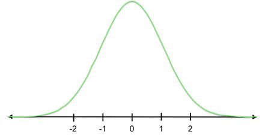
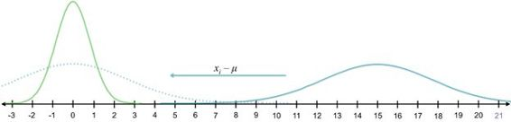
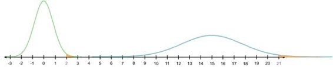
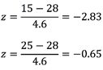
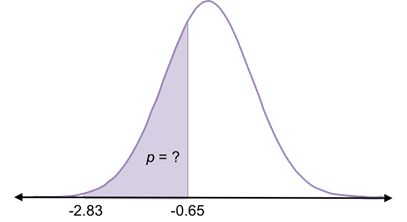
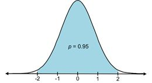
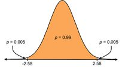

# 五、标准化

在前一章中，我们研究了将正态分布转换为标准正态分布(μ = 0，∑ = 1)，这样我们就不必集成 PDF 来计算概率。将任何正态分布转换为标准正态分布的过程称为**标准化**。它允许我们比较两种不同的正态分布。具体来说，假设您正在分析一个正态分布的值以及另一个不同正态分布的值。根据它的分布，你怎么知道哪个值离标准更远？这就是你将在这一章学到的。

考虑μ = 15 且∑ = 3 的以下分布。

图 16:该曲线是平均值为 15、标准偏差为 3 的正态分布的 PDF。

我们如何将其转换为标准正态分布(均值= 0，标准差= 1)？

图 17:该曲线为标准正态分布 N(0，1)，均值为 0，标准差为 1。当我们标准化正态分布时，我们将其转换为标准正态分布。

换句话说，假设 21 是原始数据集中的一个值。如果我们把分布转移和收缩成标准正态分布，21 会有什么新的值？

图 18:如果我们想要标准化蓝色曲线，我们需要开发一个系统来将其转换成绿色(标准正态)曲线。

你可能已经猜到我们首先需要从 21 中减去平均值。更广泛地说，为了将整个分布转换为标准正态分布，我们首先必须从数据集中的每个值中减去平均值( *x i* - μ)。这将数据向左移动，使新的平均值为 0。

图 19:为了将右边的蓝色曲线转换成左边的绿色(标准正态)曲线，我们从分布中的每个值中减去蓝色分布的平均值(将整个分布移动到平均值为 0)，然后除以标准偏差(缩小分布以匹配绿色分布)。

你可以看到 21 的新值是 6。

现在每个分布的平均值是一样的，但是我们原始数据集的标准差是 3，我们希望它是 1。那么，我们如何缩小差距呢？我们除以标准差。因此，21 的标准值是(21-15)/3 = 2。

在我们的原始数据集中，21 是平均值的两个标准差(回想一下，标准差是 3，平均值是 15)。当我们标准化 21，它变成 2 时，它仍然是平均值的两个标准偏差(现在平均值为 0，标准偏差为 1)。

想象一下用这种方法标准化——你只是简单地计算一个值与平均值的标准偏差的数量。这个数字被称为 **z 分数**，表示为 z。

来自具有相同 z 分数的不同正态分布数据集的值将具有相同的被选择概率。换句话说，曲线下大于或小于具有相同 z 分数的值的面积是相同的。这是因为任何 PDF 下的总概率都是 1。

图 20:2 以上标准正态曲线下面积等于 21 以上原始曲线下面积( *μ* = 15， *∑* = 3)。2 和 21 都是高于各自数据集平均值的两个标准偏差。

通过标准化分布并为每个感兴趣的值找到 z 分数，我们可以使用标准正态分布来计算我们所有的概率(即 PDF 下的区域)。位于本电子书末尾的 z 表列出了任何 z 分数的累积概率。

表体中的数字是小于特定 z 分数的累积概率(p)。例如，随机选择小于 z = 1.22 的值的概率为 0.8888(即 P(x < 1.22) = 0.8888)。

图 21:在标准正态曲线中，随机选择小于 1.22 的值(即高于平均值 1.22 个标准差)的概率为 0.89。

|  | 注:在概率记数法中，我们通常用 x 来表示变量的值。请注意，在这个例子中，因为我们感兴趣的值遵循标准正态分布，所以 x 值也是 z 分数。 |

在查看 z 分数表时，您会发现它只显示了正 z 分数的累积概率。但是，由于正态分布是对称的，您也可以使用此表来计算负 z 分数的概率。例如:

P(x >-1.22)= 0.8888
P(x<-1.22)= 1–0.8888 = 0.1112

图 22:由于正态分布是对称的，随机选择小于+1.22 的值的概率与随机选择大于-1.22 的值的概率相同，后者为 0.89。曲线下所有概率相加为 1，意味着随机选择大于+1.22 的值的概率为
1–0.89 = 0.11，这与选择小于-1.22 的值的概率相同。

现在你知道如何做基本的统计分析了。给定任何数据集，您都可以对其进行描述、可视化，并计算特定范围的值出现的概率(对正态分布的数据使用 z 表，或使用 PdF 对其他分布的数据进行建模)。

现在让我们来看一个简单的真实例子。

例子

你想上吉他课。不知何故，你知道你所在地区吉他教师的小时工资通常分布在μ= $28 和σ = $4.6 之间。如果你看着吉他老师的联系方式列表，随机选择一个打电话，这个老师收费在 15 美元(找一个像样老师的最低要求)到 25 美元(你愿意支付的最高要求)之间的概率是多少？

首先，我们将通过找到 15 美元和 25 美元的 z 分数来标准化分布。因为这个价格区间低于平均值，所以我们预计 z 值为负。

所以，你要找到标准法线曲线下-2.83 到-0.65 之间的区域。换句话说，你在寻找从平均值-2.83 标准偏差和平均值-0.65 标准偏差之间随机选择一个值的概率。

图 23:您可以使用 z 表来查找从正态分布的平均值中随机选择-2.83 和-0.65 标准差之间的值的概率。

现在你可以用 z 表找出小于正 2.83 的累积概率，然后减去小于正 0.65 的累积概率。因为正态分布是对称的，这与图 23 中描述的概率相同。

P(x< 2.83) = P(x >-2.83)= 0.9977
P(x<0.65)= P(x>-0.65)= 0.7422
P(0.65<x<2.83)= P(-2.83<x<-0.65)= 0.9977–0.7422 = 0.2555

因此，随机选择一个每小时收费在 15-25 美元之间的吉他老师的概率约为 0.2555，即 25.55%。这意味着打了四个电话后，你可能会找到一个吉他老师。

正态分布的形状——均值、中值和模式周围的高频和尾部的低频——允许我们确定某个特定值或样本是否发生了奇怪的事情(即，如果我们随机选择了一个极不可能随机选择的值或样本)。

在许多情况下，我们可能希望通过统计来确定某个值是否与平均值有显著差异。一个领域是健康:例如，知道你的心率或胆固醇水平是高还是低是不健康的。

在正态分布中，大多数值(约 68%)位于平均值的 1 个标准偏差内，几乎所有值(约 95%)位于平均值的 2 个标准偏差内。

 

图 24:在正态分布中，约 68%的值位于平均值的一个标准偏差内，约 95%的值位于平均值的两个标准偏差内。

因此，随机选择一个在两个方向上偏离平均值超过两个标准差的值是非常不可能的。一般来说，如果选择一个值的概率小于 0.05，我们就认为某件事在统计上是不太可能的。概率小于 0.01 更不可能发生，概率为 0.001 真的*真的*不太可能发生。这些概率(0.05、0.01 和 0.001)被称为**α水平****(****【α】)**，也称为显著性水平，因为如果选择一个值或样本的概率小于α，结果被认为是“显著的”

例如，在吉他课的例子中，15 美元的 z 分数是-2.83。这比平均值低两个标准差以上，也就是说，从统计上看，找一个每小时收费 15 美元或更低的吉他老师是不太可能的。

确定概率是否小于α称为**假设检验**。本章涵盖 **z 检验**:当我们知道总体参数μ和∑时的假设检验。对于这个测试，我们继续使用 z 表。(当我们不知道人口参数时，我们有不同的分布，使用不同的表。这将是第六章的重点。)

我们可以使用三种假设检验:

*   左尾检验
*   右尾检验
*   双尾检验

所有测试都使用相同的α水平；然而，在被认为重要或不重要的事情之间，每个都有不同的截止位置。左尾检验分析一个值或样本是否明显低于平均值(即在底部α)；右尾检验分析一个值或样本是否显著高于平均值(即位于顶部α)；双尾检验分析一个值或样本是否在任一方向上(即在底部α/2 或顶部α/2)与平均值显著不同。

图 25:Z-临界值(z*)标记了临界区域的截止值，它与α相加。

在图 25 中，橙色区域是**临界区域**，截止值是 **z 临界值**，这是基于所选的α水平。如果一个值或样本落在 z 临界值之外的尾部，则结果被认为是显著的。

基于我们的假设，我们选择运行哪个测试(左尾、右尾或双尾)。如果我们的假设表明某个特定值会明显小于平均值，我们就做一个左尾检验。如果我们不确定，或者如果我们只是推测值会不同，我们做一个双尾测试。

让我们计算每个α水平上双尾测试的 z 临界值。从 z 表中可以看出，对于 0.05 的α水平，每个尾部都有 0.025 的比例，因此 z 临界值为 1.96。然后我们说，如果一个值的 z 值小于-1.96 或大于 1.96，则在 p < 0.05 时具有统计学意义。

对于双尾测试，0.01 和 0.001 的α水平的 z 临界值是多少？嗯，分布的两个尾部之间的 0.01 分割表明每个尾部有 0.005 (0.5%)。这意味着直到 z 分数标记前 0.5%的累积概率为 0.995。如果你在 z 表体中发现 p = 0.995，你会看到对应的 z 分值约为 2.58。所以，2.58 是α = 0.01 的 z 临界值。同样，3.27 是α = 0.001 的 z 临界值。最常见的用于检验显著性的α水平是 0.05。

  

图 26:0.05、0.01 和 0.001 的α水平的 Z 临界值为 * 1.96、*  * 2.58 和*  * 3.27。*

接下来，我们将使用这个概念来估计给定样本的总体均值。