# 方差分析

当我们有三个或三个以上的样本，并且我们想要确定其中任何两个样本是否有显著差异时，我们使用一种叫做**方差分析(ANOVA)** 的统计测试。该测试分析了一个**因变量**如何基于一个或多个**自变量**而不同。例如，我们可能想知道在学校 A、学校 B 和学校 C(学校是自变量)的学生之间，标准化数学考试的分数(因变量)是否有显著差异。

因变量应该是连续的(数学考试成绩是连续的)，近似正态分布，并且每个组的值具有同质方差。自变量应该是具有互斥值的分类变量(其中“学校 A”、“学校 B”和“学校 C”是不同的值)。自变量也应该近似正态分布。

本章包括单向和双向方差分析。在单因素方差分析中，有一个自变量；在双向方差分析中，有两个自变量。

无效假设和替代假设是:

H<sub class="calibre24">0</sub>:μ<sub class="calibre24">1</sub>=μ<sub class="calibre24">2</sub>=…=μ<sub class="calibre24">k</sub>T8】H<sub class="calibre24">a</sub>:至少两个群体均值有显著差异

那里有 k 个样本。

该测试包括测量**组间变异性**—本质上是样本均值的方差—并将组间变异性除以**组内变异性**—每个样本方差的组合测度。得到的商是 f 统计量。

F =(组间变异性)/(组内变异性)

F 越大，越有可能至少两个群体存在显著差异。如果你想一想这个商，更大的组间可变性表明样本平均值彼此分布得更远，这意味着它们更有可能显著不同。

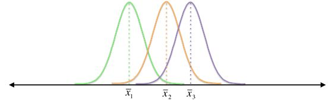

较小的组间差异

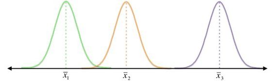

更大的组间可变性

图 37:在上图中，组内可变性是相同的，但是组间可变性改变了。随着组间变异性的增加，样本更有可能显著不同，并且 f 统计量增加。

另一方面，更大的组内可变性表明每个样本的标准偏差更大，这意味着样本不太可能显著不同。

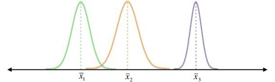

较小的组内可变性

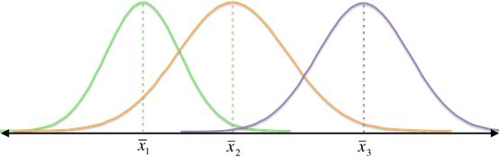

更大的组内可变性

图 38:在该图中，组间变异性相同，但组内变异性变化。随着组内可变性的增加，样本不太可能有显著差异，并且 f 统计量减少。

因此，分子(组间变异性)越大，分母(组内变异性)越小，F 统计量就越大。让我们依次计算每一个。

#### 组间可变性

测量样本均值的分布就像计算方差一样。首先，我们找到**的大平均值** ( 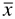 <sub class="calibre24">G</sub> )，它是来自每个样本的所有值的总和除以每个样本大小的总和。

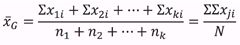

在第一个表达式中，x <sub class="calibre24">1i</sub> 代表来自样本 1 的所有值，x <sub class="calibre24">2i</sub> 代表来自样本 2 的所有值，等等。，而 n <sub class="calibre24">1</sub> 是样品 1 的尺寸，n <sub class="calibre24">2</sub> 是样品 2 的尺寸，等等。，对于 k 个样本；在第二个表达式中，j 是范围从 1 到 k 的样本数，而 I 是每个相应样本中的数值。

要计算组间可变性:

1.  计算每个样本平均值与总平均值的偏差:。
2.  平方各偏差: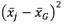。
3.  将每个平方偏差乘以相应样本的样本量，以加权平方偏差乘以样本量:。
4.  各加权平方偏差之和: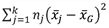。
5.  这给了我们组间变异性的平方和 **(SS <sub class="calibre24">在</sub> )** 之间。
6.  通过将之间的 SS <sub class="calibre24">除以自由度来计算平均平方偏差，其中</sub>之间的 df<sub class="calibre24">= k–1。这个商数被称为组间变异性的均方(MS<sub class="calibre24">之间)，这是我们对组间变异性的最终测量。</sub></sub>

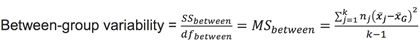。

#### 组内可变性

这是一种误差度量，它结合了每个样本中的误差。要计算组内可变性:

1.  计算每个值与其样本平均值的偏差:。
2.  平方各偏差: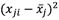。
3.  偏差平方和: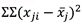。
4.  我们现在有了组内可变性的平方和(在内的 SS <sub class="calibre24">)。</sub>
5.  通过将内的 SS <sub class="calibre24">除以</sub>内的 df <sub class="calibre24">(每个样本的自由度之和)，求出每个值与其各自样本平均值的平均平方偏差。 其中 df <sub class="calibre24">在</sub>以内=(N<sub class="calibre24">1</sub>-1)+(N<sub class="calibre24">2</sub>-1)+…+(N<sub class="calibre24">k</sub>-1)=(N<sub class="calibre24">1</sub>+N<sub class="calibre24">2</sub>+…+N<sub class="calibre24">k</sub>-k = N–k .该商是组内变异的均方(MS <sub class="calibre24">在</sub>以内)，是我们对组内变异的最终度量</sub>

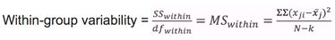

#### 总可变性

如果我们取每个单个值与总平均值的偏差，对每个偏差进行平方，并求出平方偏差之和，我们就得到总平方和(SS <sub class="calibre24">total</sub> )，这是总可变性的一种度量。酷的是 SS <sub class="calibre24">总计</sub>是和内 SS <sub class="calibre24">之间的总和。</sub>

SS <sub class="calibre24">间</sub> + SS <sub class="calibre24">内</sub> = SS <sub class="calibre24">合计</sub>

我们经常用方差分析表来组织我们所有的计算。

表 5:方差分析表有助于组织变异性计算。

|  | 圣人 | df | 女士 | F |
| 因素 | 之间的 SS | 之间的 df | 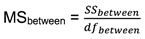 | 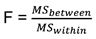 |
| 错误 | 内的 SS | 内的 df | 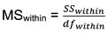 |  |
| 总数 | 在和内的<sub class="calibre24">之间</sub> | 之间的 df<sub class="calibre24">+在</sub>内的 df |  |  |

#### f 分布

与 z-和 t-统计一样，F-统计遵循特定的分布。在我们对组内和组间变异性的计算中，我们(本质上)发现了平均平方偏差。因此，F 永远不能为负，分布位于正 x 轴。


图 39:F 分布在右边(正 x 轴)有一条尾巴。关键区域在这条尾巴上。

在我们测试的背景下，这也是有意义的——我们只是想知道是否至少有两个群体明显不同，而不是一个群体明显小于或大于另一个群体。

一旦我们计算出 F 统计量，我们就使用 F 表来确定 **F 临界值，
F(α，df <sub class="calibre24">在</sub>之间，内的 df<sub class="calibre24">)</sub>**。你会在 F 表中看到列标题在之间为 df <sub class="calibre24">，行标题在</sub>内为 df <sub class="calibre24">。每个 alpha 级别都有一个特定的 F 表。</sub>

例子

作为一个数字营销人员，你总是试图确定最有效的在线广告手段。假设您在每个网页的不同位置放置了带有大量在线出版物的广告，您决定进行方差分析，以确定不同位置是否有更好的点击率(点击率，即点击广告的用户百分比与网站访问者总数之间的比率)。三个最常见的广告位置在页面的顶部、中部和侧面。在你的研究中，你发现了 600 多个广告的点击率。

表 6:这个方差分析表有助于组织组间和组内变异性的计算。

| 顶端 | 中间 | 侧面 |
| n <sub class="calibre24">T</sub> = 235 <sub class="calibre24"> T </sub> = 35%s <sub class="calibre24">T</sub> = 3.2% | n <sub class="calibre24">M</sub> = 169 <sub class="calibre24"> M </sub> = 28%s <sub class="calibre24">M</sub> = 4.3% | n <sub class="calibre24">S</sub> = 210 <sub class="calibre24"> S </sub> = 38%s <sub class="calibre24">S</sub> = 2.5% |

这为我们提供了计算组间和组内可变性所需的一切。

组间可变性:

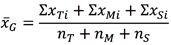

我们知道:


因此，


这就引出了=(35–34.1)<sup class="calibre57">2</sup>+(28–34.1)<sup class="calibre57">2</sup>+(38–34.1)<sup class="calibre57">2</sup>= 53.23 之间的 SS

我们还知道组间可变性的自由度(df <sub class="calibre24">在</sub>之间)= 2(因为我们的自变量有三个类别(顶部、中间、侧面)，我们减去 1。

现在我们可以发现群体间的可变性。

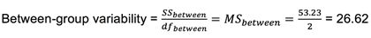

组内可变性:

通过了解每个样本的平方和，我们可以在内找到 SS <sub class="calibre24">。</sub>


= 3.2<sup class="calibre57">2</sup>(235–1)+4.3<sup class="calibre57">2</sup>(169–1)+2.5<sup class="calibre57">2</sup>(210–1)= 6808.73

我们还知道，组内可变性的自由度(在之间的 df <sub class="calibre24">)等于值的总数减去类别的数量。</sub>

n–k = 235+169+210–3 = 611

最后，我们可以通过将内的 SS <sub class="calibre24">除以</sub>内的 df <sub class="calibre24">来找到组内变异性(即</sub>内的 MS <sub class="calibre24">)。</sub>


f-统计:

最后，我们可以找到 F 统计量。


我们可以在方差分析表中组织我们所有的计算。当你在 R 中做方差分析测试时，你会得到相同的输出，但是 SS 和 df 列会被切换。

表 7:使用 f 统计结果进行组间和组内变异性计算的结果。

|  | 圣人 | df | 女士 | F |
| 页面位置 | Fifty-three point two three | Two | Twenty-six point six two | Two point three nine |
| 错误 | Six thousand eight hundred and eight point seven three | Six hundred and eleven | Eleven point one four |  |

一旦我们计算出 F 统计量，我们就可以将其与 F 临界值
F <sub class="calibre24">(0.05，2，611)</sub> = 3 进行比较。

因为 F-统计量小于 F <sub class="calibre24">(0.05，2，611)</sub> ，所以结果不显著。因此，我们不能拒绝无效，我们得出结论，没有证据表明任何两个群体——每个群体是所有出版物每个广告位置的点击率——是显著不同的。换句话说，网页上不同广告位置的点击率没有显著差异。

现在我们已经手工执行了单向方差分析，让我们用 NCES 数据在 R 中执行它。假设我们想知道 SES 是否因种族而有显著差异(其中受试者如果是“白人”则被编码为 0——参见附录中对应于其他种族的标签)。我们将首先应用 **tapply()** 函数，它告诉我们我们将为一个特定变量指定的统计量(例如，平均值、中位数)被另一个变量分解。 **tapply(ses，race，mean)** 功能将把 ses 的平均值作为按种族划分的值。

接下来，我们将使用术语“适合”来命名方差分析测试，然后我们将总结“适合”来查看结果。

代码清单 11

```
  >  tapply(ses, race, mean)  #calculates
  the mean of income2011 based on the variable “race”

          0           1           2          
  3           4 

 0.26154596 -0.29982456  0.06211096 -0.15877778
  -0.39424116 

          5           6 

-0.17442561  0.09525253
  > fit =  aov(ses ~ as.factor(race))  #label
  “fit” as the ANOVA test, ensure that the variable “race” is treated as a
  factor using as.factor() function
  >  summary(fit)  #summarize
  results of the ANOVA test

                  Df Sum Sq Mean Sq F value
  Pr(>F)    

as.factor(race)    6    354   58.94     119
  <2e-16 ***

Residuals       8240   4080   
  0.50                   

---

Signif. codes:  0 ‘***’ 0.001 ‘**’ 0.01 ‘*’ 0.05
  ‘.’ 0.1 ‘ ’ 1

```

从 **tapply()** 函数可以看出，白人学生(代码= 0)的 SES 高于其他种族的学生。方差分析检验证实这些差异是显著的，因为 f 统计量很大(119)。星号(*)的存在也意味着重要性。

在确定至少两个群体显著不同之后，我们可以通过运行**后特别测试**来确定哪两个群体。选择哪种事后测试最适合我们的需求将取决于我们的初始数据。如果我们的原始数据具有大约相同的方差(即方差的同质性)，我们可以使用一个称为图基的 HSD 的测试(对于“诚实的显著差异”)。如果没有，我们可以使用游戏豪威尔测试。首先，让我们通过一个测试来确定方差是否是同质的。

#### 方差齐性的勒温检验

在该测试中，无效假设和替代假设是:

H<sub class="calibre24">0</sub>:∑<sub class="calibre24">1</sub><sup class="calibre57">2</sup>= s<sub class="calibre24">2</sub><sup class="calibre57">2</sup>=…= s<sub class="calibre24">k</sub><sup class="calibre57">2</sup>
H<sub class="calibre24">a</sub>:至少两个群体差异显著。

统计数据是如何计算的超出了本电子书的范围；但是，您将在 r 中学习如何做到这一点

因为 R 是开源的，全世界的人都在开发包含执行各种统计测试的新函数的包。例如，“lawstat”包包含 levene.test()函数，您可以安装这个包来运行这个方差齐性测试。

首先从[cran.r-project.org/web/packages/lawstat/](http://cran.r-project.org/web/packages/lawstat/)下载包。下面的代码清单解释了如何在 R 中安装包，以及如何使用 SES 因种族而异的方差分析示例来运行 Levene 的测试。

代码清单 12

```
  >  install.packages("lawstat")   #installs the package
  into R
  --- Please select a
  CRAN mirror for use in this session --- 
   #select the location
  closest to your current location
  >  row.names(installed.packages())  #ensure that “lawstat” is listed as one of the packages
  currently installed
  >  library(lawstat)  #load
  the packages into R
  >  levene.test(ses, race)  #run
  Levene’s Test for homogeneity of variance

      modified robust Brown-Forsythe Levene-type
  test based

      on the absolute deviations from the median

data:  ses

Test Statistic = 19.4668, p-value < 2.2e-16

```

|  | 提示:如果你不确定如何在 R 中使用特定的函数，你可以键入？后跟函数名，R 将输出关于函数的每个输入的信息。比如打字？levene.test()并点击“enter”将向您展示如何使用该功能。 |

根据这一测试，方差不是同质的。因此，我们将使用 Games Howell 测试来确定哪些学生因种族而具有显著不同的 SES。首先，让我们假设莱文的测试结果并不重要，并回顾一下我们将如何在 r

#### 图基的 HSD(方差是同质的)

**TukeyHSD()** 测试输出每组平均值之间的绝对差异(在这种情况下，平均值 SES 之间的差异)、这些差异的 95%置信区间的下限和上限以及 p 值(其中 p 值小于 a 确实表示显著差异)。

代码清单 13

```
  >  TukeyHSD(fit)

  Tukey multiple comparisons of means

    95% family-wise confidence level

Fit: aov(formula = ses ~ as.factor(race))

$`as.factor(race)`

           diff         lwr         upr     p
  adj

1-0 -0.56137052 -0.83770881 -0.28503223
  0.0000000

2-0 -0.19943500 -0.28097831 -0.11789169
  0.0000000

3-0 -0.42032374 -0.49867291 -0.34197456
  0.0000000

4-0 -0.65578712 -0.75465341 -0.55692083
  0.0000000

5-0 -0.43597157 -0.53047888 -0.34146427
  0.0000000

6-0 -0.16629343 -0.27444148 -0.05814539
  0.0001191

2-1  0.36193552  0.07668733  0.64718372
  0.0034779

3-1  0.14104678 -0.14330479  0.42539835
  0.7669639

4-1 -0.09441660 -0.38509128  0.19625807
  0.9627701

5-1  0.12539895 -0.16382216  0.41462006
  0.8619244

6-1  0.39507709  0.10111583  0.68903835 0.0014499

3-2 -0.22088874 -0.32644573 -0.11533175
  0.0000000

4-2 -0.45635212 -0.57791786 -0.33478639
  0.0000000

5-2 -0.23653657 -0.35458451 -0.11848864
  0.0000001

6-2  0.03314156 -0.09608570  0.16236883
  0.9888601

4-3 -0.23546339 -0.35491007 -0.11601670 0.0000001

5-3 -0.01564783 -0.13151240  0.10021673
  0.9996921

6-3  0.25403030  0.12679443  0.38126618
  0.0000001

5-4  0.21981555  0.08919952  0.35043158
  0.0000146

6-4  0.48949369  0.34869271  0.63029467
  0.0000000

6-5  0.26967814  0.13190294  0.40745333
  0.0000002

```

你可以从图基的 HSD 测试结果中看到，仅有的没有显著不同 SES 水平的种族介于:

*   第 3 组和第 1 组(“黑人或非裔美国人，非西班牙裔”和“美国人”。印第安人/阿拉斯加土著人，非西班牙裔)。
*   第 4 组和第 1 组(“西班牙裔，无种族区分”和“美国人”。印第安人/阿拉斯加土著人，非西班牙裔)。
*   第 5 组和第 1 组(“西班牙裔，特定种族”和“美国人”。印第安人/阿拉斯加土著人，非西班牙裔)。
*   第 6 组和第 2 组(“不止一个种族，非西班牙裔”和“亚洲人，夏威夷/太平洋”。岛民、非西班牙裔”)。
*   第 5 组和第 3 组(“西班牙裔，特定种族”和“黑人或非裔美国人，非西班牙裔”)。

但是，请记住，数据没有通过我们的方差齐性检验，所以让我们看看 Games Howell 检验有什么要说的。

#### 游戏豪威尔(差异不是同质的)

一个名为“user friendly science”[【2】](12.html#_ftn2)的包包含一个方便的**单向()**函数，除了方差分析结果之外，它还可以输出我们指定的多个测试的结果，包括莱文测试和 Games Howell 测试。让我们在 R 中运行**单向()**功能，并包括莱文测试的结果，以与我们之前从“lawstat”包中获得的结果进行比较。

代码清单 14

```
  >  install.packages("userfriendlyscience")   #installs the package
  into R
  --- Please select a
  CRAN mirror for use in this session --- 
   #select the location
  closest to your current location
  >  library(userfriendlyscience)  #load the packages into R
  >  oneway(ses,  as.factor(race),
  posthoc="games-howell", levene=TRUE)  #this
  will run ANOVA for the variable “ses” by the factor “race”, and additionally
  perform the Games Howell post hoc test and Levene’s test

### Oneway Anova for y=ses and x=as.factor(race)
  (groups: 0, 1, 2, 3, 4, 5, 6)

Eta Squared: 95% CI = [0.07; 0.09], point
  estimate = 0.08

                                     SS   Df   
  MS      F

Between groups (error + effect)  353.64    6
  58.94 119.05

Within groups (error only)      4079.57 8240  
  0.5       

                                    p

Between groups (error + effect) <.001

Within groups (error only)           

### Levene's test:

Levene's Test for Homogeneity of Variance
  (center = mean)

        Df F value    Pr(>F)    

group    6  19.864 < 2.2e-16 ***

      8240                      

---

Signif. codes:  0 ‘***’ 0.001 ‘**’ 0.01 ‘*’ 0.05
  ‘.’ 0.1 ‘ ’ 1

### Post hoc test: games-howell

        t      df     p

0:1  6.24   57.23 <.001

0:2  6.14  876.58 <.001

0:3 16.02 1058.23 <.001

0:4 19.25  561.13 <.001

0:5 12.40  613.47 <.001

0:6  4.91  462.84 <.001

1:2  3.82   70.29  .005

1:3  1.52   64.71  .731

1:4  0.99   71.89  .954

1:5  1.31   73.09  .845

1:6  4.15   71.62  .002

2:3  5.58 1434.84 <.001

2:4 10.10 1135.28 <.001

2:5  5.14 1191.55 <.001

2:6  0.74 1000.13  .990

3:4  5.75  984.95 <.001

3:5  0.37 1042.74 1.000

3:6  6.24  839.26 <.001

4:5  4.66 1009.76 <.001

4:6 10.60  867.93 <.001

5:6  5.74  914.77 <.001

```

我们使用**单向()**函数对方差分析和莱文检验得到相同的结果。我们从方差分析中知道，至少有两组存在显著差异(即至少有两个种族具有不同的 SES 水平)，并且我们从 Levene 的检验中知道，不同种族之间的 SES 不存在方差的同质性。

最后，事实证明 Games Howell 测试给我们的结果与 Tukey 的 HSD 相同。

您刚刚学习了单向方差分析，它基于一个独立变量(即一个因素)比较各组。在我们的例子中，该因素是广告在网页上的位置(顶部、中间或侧面)。因变量是广告的点击率。

现在让我们使用**双向方差分析**，它基于两个因素测试显著性差异。例如，你可能想看看 2011 年的收入是如何因性别而异的，以及学生是否取得好成绩会影响收入。你不仅对基于性别和年级的收入差异感兴趣，而且对性别和年级之间可能的**互动效应**感兴趣(即，收入差异在性别之间是否一致，与所获得的年级无关，以及收入差异在年级之间是否一致，与性别无关？).

双向方差分析中有三个无效假设:

*   因子 1 的平均值相等。
*   因子 2 的平均值相等。
*   因子 1 和因子 2 之间没有交互作用。

双向方差分析为每个假设输出一个 f 统计量，决定我们是拒绝还是拒绝它。手工计算这些统计数据变得非常复杂，因此我们将在 r 中执行分析之前简单回顾一下基本原理。

每个因素都有一定数量的类别(例如，在 NCES 的数据中，“性别”因素有两个类别:“男性”和“女性”；“成绩”这一因素有两类:“是”和“否”(关于学生是否被认为成绩好)。假设因子 1 有 k 个类别，因子 2 有 q 个类别。

每个类别包含一定数量的数值。让我们用 n 来表示因子 1 中的值的数量，其中 n <sub class="calibre24">1</sub> 是因子 1 的类别 1 中的值的数量，n <sub class="calibre24">2</sub> 是因子 1 的类别 2 中的值的数量，等等。，通过 n <sub class="calibre24">k</sub> ，这是因子 1 的 k 类值的数量。

让我们用 m 来表示因子 2 中的数值个数，其中 m <sub class="calibre24">1</sub> 是因子 2 的类别 1 中的数值个数，m <sub class="calibre24">2</sub> 是因子 2 的类别 2 中的数值个数，等等。，通过 n <sub class="calibre24">q</sub> ，这是因子 2 的类别 q 中的值的数量。

表 8:双向方差分析有两个因素(即自变量)。假设因子 1 有 k 个类别和 n 个总值，因子 2 有 q 个类别和 m 个总值。

| 因素 1 | 类别 1类别 2…种类 | n <sub class="calibre24">1</sub> 值n <sub class="calibre24">2</sub> 值…n <sub class="calibre24">k</sub> 值 |
| 因素 2 | 类别 1类别 2…种类 | m <sub class="calibre24">1</sub> 值m <sub class="calibre24">2</sub> 值…m <sub class="calibre24">q</sub> 值 |

我们在双向方差分析中的目标与在单向方差分析中的目标相同:我们想要计算组间变异性的度量，并除以误差度量(组内变异性)来计算我们的 F 统计量。然而，这次我们将计算两个额外的 F 统计量:一个用于第二个因素，一个用于两个因素之间的相互作用。我们用一个乘法符号来象征这种相互作用。

让我们首先计算因子 1 和因子 2 的平方和(每个因子的之间的 SS <sub class="calibre24">)、因子 1 和因子 2 的交互作用(SS <sub class="calibre24">1</sub> <sub class="calibre24">×</sub> <sub class="calibre24">2</sub> )、误差(SS <sub class="calibre24">在</sub>内)和 SS <sub class="calibre24">总计</sub>。</sub>

我们可以通过在表格中组织每个类别的方法来简化这些计算。

表 9:均值表基于每个因子组织每个子集的均值和边际均值(每个因子的每个类别中所有值的均值)。边际平均值用于计算组间变异性，而每个时段的平均值(在每个因素的特定类别中)用于计算组内变异性。

平均值表

|  |  | **因子 1 (k 类)** |  |
|  |  | 第 1 类
n <sub class="calibre24">1</sub> 值 | 第 2 类
n <sub class="calibre24">2</sub> 值 | 第 3 类
n <sub class="calibre24">3</sub> 值 | 边际平均值 |
| 因素 2(q 类) | 第 1 类
m <sub class="calibre24">1</sub> 值 | 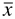 <sub class="calibre24"> 1，1</sub> |  <sub class="calibre24"> 2，1</sub> |  <sub class="calibre24"> 3，1</sub> |  <sub class="calibre24"> i，1 </sub> =因子 2 类别 1 中所有值的总和除以 m <sub class="calibre24"> 1</sub> |
| 第 2 类
m <sub class="calibre24">2</sub> 值 |  <sub class="calibre24"> 1，2</sub> |  <sub class="calibre24"> 2，2</sub> |  <sub class="calibre24"> 3，2</sub> |  <sub class="calibre24"> i，2 </sub> =因子 2 类别 2 中所有值的总和除以 m <sub class="calibre24"> 2</sub> |
|  | 边际平均值 |  <sub class="calibre24"> 1，j </sub> =因子 1 类别 1 中所有值的总和除以 n <sub class="calibre24"> 1</sub> |  <sub class="calibre24"> 2，j </sub> =因子 1 类别 2 中所有值的总和除以 n <sub class="calibre24"> 2</sub> |  <sub class="calibre24"> 3，j </sub> =因子 1 类别 3 中所有值的总和除以 n <sub class="calibre24"> 3</sub> |  <sub class="calibre24"> G </sub> =数据集中所有值的总和除以值的总数(N) |

 <sub class="calibre24">G</sub> 也可以通过取每个类别平均值的加权平均值，即选择其中一个因子，将每个类别的平均值乘以样本量，再除以 N，其中 N = N<sub class="calibre24">1</sub>+N<sub class="calibre24">2</sub>+N<sub class="calibre24">3</sub>= m<sub class="calibre24">1</sub>+m<sub class="calibre24">2</sub>。


您可以看到，我们有六个值桶，分别与因子 1 中的一个类别和因子 2 中的一个类别相关联。

现在我们可以计算因子 1 和因子 2 的平方和。SS <sub class="calibre24">1</sub> 是通过从因子 1 的每个类别的平均值中减去总平均值 <sub class="calibre24">G</sub> ，对每个偏差进行平方，将每个平方的偏差乘以该类别的样本量，并取和而得到的。同样，SS <sub class="calibre24">2</sub> 也是从因子 2 等各类别的平均值中减去 <sub class="calibre24">G</sub> 得到的。


|  | 注:这些方程假设因子 1 有 k 个类别，因子 2 有 q 个类别；然而，表 1 显示 k = 3，q = 2。 |

要计算组内可变性的平方和(我们的误差项)，从桶中的每个值中减去每个桶的平均值(因子 1 类别 I 和因子 2 类别 j)，对每个偏差进行平方，然后取和。

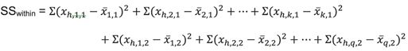

|  | 注意:这里有一个翻译——这个等式取因子 1，类别 1 和因子 2，类别 1 中的第一个值(平均值表中左上角的框)，减去因子 1，类别 1 和因子 2，类别 1 中所有值的平均值，然后对数据集中的每个值继续这个等式。换句话说，它将每个值与同一个桶中所有值的平均值的平方偏差相加(因子 1 类别 I 和因子 2 类别 j)。上式中内的 SS <sub class="calibre191">用 h 表示每个类别的第 h 个值(x <sub class="calibre191">h，1，1</sub> 是第 1 类因子 1 和第 1 类因子 2 的第 h 个值)。</sub> |

总平方和是数据集中每个值与总平均值的平方偏差之和。


因为所有平方和与 SS <sub class="calibre24">之和</sub>(SS<sub class="calibre24">1</sub>+SS<sub class="calibre24">2</sub>+SS<sub class="calibre24">1</sub><sub class="calibre24">×2</sub>+SS<sub class="calibre24">在</sub> = SS <sub class="calibre24">之和</sub>之内)，我们可以通过减去 SS <sub class="calibre24">1</sub> ，SS<sub class="calibre24">1</sub>×2 来计算交互作用的平方和(SS<sub class="calibre24">1<sub class="calibre24">×2</sub></sub>

在找到每个平方和之后，我们需要知道自由度以便计算每个因子的均方(MS <sub class="calibre24">1</sub> 和 MS <sub class="calibre24">2</sub> )、误差(MS <sub class="calibre24">在</sub>内)和交互作用(MS <sub class="calibre24">1</sub> <sub class="calibre24">×2</sub> )。在内，F-统计将是每个均方除以 MS <sub class="calibre24">。</sub>

同样，它有助于将这些计算组织在一个表中。

表 10:方差分析表组织了因子 1、因子 2、交互作用(因子 1 ×因子 2)、误差(组内变异性)和总计的平方和；自由度；均方值，即标准差/标准差；以及 F 统计量(F)，它告诉我们因变量的值是否因因子 1、因子 2 或两者之间的相互作用而显著不同。

|  | 圣人 | df | 女士 | F |
| 因素 1 | SS <sub class="calibre24">1</sub> | df<sub class="calibre24">1</sub>= k–1 | MS<sub class="calibre24">1</sub>=
SS<sub class="calibre24">1</sub>/df<sub class="calibre24">1</sub> | MS <sub class="calibre24">1</sub> /MS <sub class="calibre24">在</sub>内 |
| 因素 2 | SS <sub class="calibre24">2</sub> | df<sub class="calibre24">2</sub>= q–1 | MS2 =
SS <sub class="calibre24">2</sub> / df <sub class="calibre24">2</sub> | MS <sub class="calibre24">2</sub> /MS <sub class="calibre24">在</sub>内 |
| 互动 | SS<sub class="calibre24">1</sub>T2【2】T3 | df <sub class="calibre24">1</sub> df <sub class="calibre24">2</sub> | MS<sub class="calibre24">1</sub><sub class="calibre24">×</sub><sub class="calibre24">2</sub>=
(SS<sub class="calibre24">1</sub>×SS<sub class="calibre24">2</sub>)/
(df<sub class="calibre24">1</sub>×df<sub class="calibre24">2</sub> | MS<sub class="calibre24">1</sub><sub class="calibre24">×</sub><sub class="calibre24">/MS</sub><sub class="calibre24">内</sub> |
| 错误 | 内的 SS | 内的 df<sub class="calibre24">=
N–q×k</sub> | MS <sub class="calibre24">在</sub>内=
SS <sub class="calibre24">在</sub>内/df <sub class="calibre24">在</sub>内 |  |
| 总数 | SS <sub class="calibre24">合计</sub> =SS<sub class="calibre24">1</sub>+SS<sub class="calibre24">2</sub>+SS<sub class="calibre24">1</sub>×SS<sub class="calibre24">2</sub>+SS<sub class="calibre24">在</sub>内 | df <sub class="calibre24">合计</sub> =df<sub class="calibre24">1</sub>+df<sub class="calibre24">2</sub>+
df<sub class="calibre24">1</sub>×df<sub class="calibre24">2</sub>+df<sub class="calibre24">在</sub>内=n–1 |  |  |

这应该会让你知道我们如何找到每个 f 统计量，就像单向方差分析一样，是组间变异与组内变异的比率。

现在让我们用 R 对 NCES 数据进行方差分析，以“收入 2011”作为因变量，“性别”和“成绩”作为两个因素或自变量。我们将男性受试者编码为 0，女性受试者编码为 1。成绩不好的科目编码为 0，成绩好的科目编码为 1。

代码清单 15

```
  > tapply(income2011, gender, mean)  #find the mean of income2011 by each
  gender

  0        1 
  30968.73
  24013.91
  > tapply(income2011, grades, mean)  #find the mean of income2011 by
  whether or not the student was recognized for good grades

  0        1 
  23995.63
  30166.17

  > income = aov(income2011 ~ as.factor(gender)*as.factor(grades))  #test whether or not gender, grades, and the interaction between gender and grades are significant
> summary(income)  #return the F statistics
                                      Df    Sum Sq   Mean Sq F value Pr(>F)    
as.factor(gender)                      1 9.943e+10 9.943e+10 172.127 <2e-16 ***
as.factor(grades)                      1 9.928e+10 9.928e+10 171.875 <2e-16 ***
as.factor(gender):as.factor(grades)    1 2.600e+09 2.600e+09   4.501 0.0339 *  
Residuals                           8243 4.762e+12 5.777e+08                   
---
Signif. codes:  0 ‘***’ 0.001 ‘**’ 0.01 ‘*’ 0.05 ‘.’ 0.1 ‘ ’ 1

```

我们可以使用 **tapply()** 函数进行一些观察:2011 年，男性平均比女性多赚了大约 7000 美元，而成绩优秀的学生每年多赚 6000 美元。

当我们进行方差分析时，我们发现不仅收入因性别和学生成绩是否良好而显著不同——这两个因素之间也有相互作用，表明当你按性别区分学生时，不同年级之间的收入并不一致。我们可以通过找出四组(成绩好的男性、成绩好的女性、成绩不好的男性和成绩不好的女性)的平均收入来更好地理解这种互动效应。

代码清单 16

```
tapply(income2011[grades=="0"], gender[grades=="0"], mean)  #find the mean income in 2011 for students who did not receive good grades, separated by gender (again, for those who did not receive good grades)
       0        1
28179.41 19272.01
>  tapply(income2011[grades=="1"], gender[grades=="1"], mean)  #find the mean income in 2011 for students who received good grades, separated by gender (again, for those who received good grades)
       0        1
33998.32 27357.42

```


图 40:这个条形图显示了每个群体的平均收入。现在，我们可以更清楚地看到性别和年级之间的相互作用:女性因年级而产生的收入差异比男性大。

在接受方差分析结果之前，确保你理解数据。例如，您的数据是否有异常值？通过将平均值拉向第一类错误(事实上为真时拒绝零假设)或第二类错误(事实上存在显著差异时未能拒绝零假设)，因此平均值不是衡量中心的好标准。

要使方差分析有准确的结果，因变量应该是正态分布的，样本量大致相等，方差大致相等。当然，这种情况并不常见，但是有一些方法可以转换您的数据，使其不再违反这些假设。这些额外的测试和转换方法超出了我们的材料范围，但是网上有大量的信息描述了您可以为数据的情况做些什么。

在下一课中，您将学习列表数据的统计测试——确定频率(而不是特定值)是否与预期有显著差异。