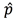
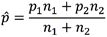
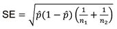
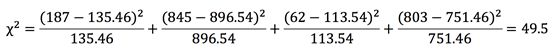

您已经学习了如何确定由连续数据组成的两个或多个样本是否存在显著差异。我们还可以对列表数据(符合各种类别的受试者计数)进行假设测试，以确定比例是否显著不同，以及数据子集的值数量是否与预期值数量显著不同。前者涉及 z 检验；后者涉及卡方检验。

#### 比例差异

z-test 测试类似于第 5 章中学习的比例测试。然而，这次我们比较的是两个样本，而不是一个比例与预期比例的比较。无效假设和替代假设是:

h0:p1= p2
ha:p1p2

例如，假设你想知道离婚更有可能发生在城市还是郊区的专业人士中。你向美国各大城市和郊区随机挑选的 30-50 岁的专业人士发送调查问卷，询问他们是否离婚过(回答是“是”或“否”)。你会得到来自城市专业人士的 1032 个回复和来自郊区专业人士的 865 个回复。结果列于表 11。

表 11:用于 z 检验的调查结果。

|  | **你离婚过吗？** |
|  | 是 | **否** |
| 城市的 | One hundred and eighty-seven | Eight hundred and forty-five |
| 郊区的 | Sixty-two | Eight hundred and three |

您可以使用 z 检验来确定这些结果是否有意义，以及一个群体的离婚率是否高于另一个群体。

正如我们在第 7 章中所学的，我们需要通过找到两个比例之间的差异(城市专业人员以一种方式响应的比例和郊区专业人员也以这种方式响应的比例)来计算 z 分数，并将该差异除以标准误差。

我们来分析一下回答“是”的比例。对于城市专业人士，p 1 = 187/1032 = 0.18。对于郊区专业人士，回答“是”的比例为 p 2 = 62/865 = 0.07。因此，我们将查看 0.18 和 0.07 之间的差异，并将该差异除以标准误差。

在这种情况下，标准误差会发生变化，因为我们需要考虑两个样本比例以及两个样本大小。为此，我们计算混合样本比例。

然后我们用计算标准误差 se。

现在，我们可以计算我们的 z 统计量。

让我们用我们的例子对比例进行这个 z 检验，从计算混合样本比例开始。

我们现在可以计算标准误差。

最后，我们可以计算 z 分数。

因为这个 z 分数远远大于 1.96，在α = 0.05 时双尾测试的 z 临界值，我们将拒绝 null，并可以得出结论，这两个比例是显著不同的——城市专业人士更有可能离婚。

#### 卡方检验

我们可以用**卡方检验**来分析同样的列表数据，该检验与 z 检验的不同之处在于，它将出现的频率与我们在两个因素独立的情况下可能预期的频率进行了比较，即我们不能通过了解另一个因素来预测另一个因素的水平。

H 0 :两个因素是独立的。
H a :两个因素不是独立的(我们可以通过知道一个因素的频率来预测另一个因素的频率)。

表 12:卡方检验中使用的调查结果。

|  | **你离婚过吗？** |  |
|  | 是 | 不 | **总计** |
| **市区** | One hundred and eighty-seven | Eight hundred and forty-five | One thousand and thirty-two |
| 郊区的 | Sixty-two | Eight hundred and three | Eight hundred and sixty-five |
| 总数 | Two hundred and forty-nine | One thousand six hundred and forty-eight | One thousand eight hundred and ninety-seven |

在这种情况下，我们会期望已经离婚的城市人的数量与已经离婚的总人数的比例相同(249/1897 = 0.13)。所以，如果大约 13%的人已经离婚，我们有 1032 个都市人的回答，我们会预计 0.13 × 1032 = 134.16 个都市人已经离婚。看一下我们的数据，我们发现离婚数量(187)高于这个期望值(134)。我们想确定这种差异是否显著。让我们先更深入地了解一下如何找到期望值。

为了简化寻找期望值的过程，我们将边际总和相乘，然后除以总计(1，897)。

表 13:期望值(绿色)是通过将每个边际总额相乘并除以总总额得出的。

|  | 你离婚过吗？ |  |
|  | 是 | 不 | 总数 |
| 城市的 | One hundred and eighty-seven | Eight hundred and forty-five | One thousand and thirty-two |
| **郊区** | Sixty-two | Eight hundred and three | Eight hundred and sixty-five |
| 总数 | Two hundred and forty-nine | One thousand six hundred and forty-eight | One thousand eight hundred and ninety-seven |

在计算期望值之后，我们计算一个卡方( **c 2 )** 统计量

其中 f 0 为观测值，f E 为期望值。下面是我们的例子:

同样，我们使用另一个表来确定我们的结果(即我们的观察值和期望值之间的差异)是否显著。自由度等于(n-1)(m-1)，其中 n 是因子 1 的类别数，m 是因子 2 的类别数。在这种情况下，有两类地点(城市和郊区)和两类离婚(是和否)。因此，df = (2-1)(2-1) = 1。卡方表告诉我们，对于 df = 1，α = 0.05，临界 **c 2** 值为 3.84。因为我们计算出的 **c 2** 统计值大于临界值，所以我们得出结论，位置(城市还是郊区)和是否有人离婚是相互独立的。