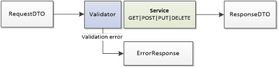
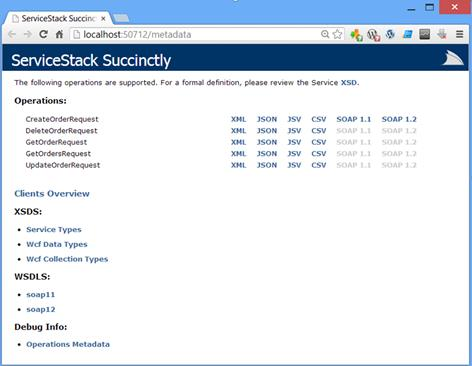

# 第 2 章服务堆栈基础

在本章中，我们将介绍关于 ServiceStack 的各种概念和背景信息，包括路由、依赖注入、内容协商以及验证和错误处理。

## 应用主机

ServiceStack 的基本入口点是`AppHost`(应用程序主机)。应用程序主机的概念是定义一个中心点，用于将请求配置和连接到服务。每个应用程序只能有一个应用程序主机。

一般来说，服务堆栈服务可以作为控制台应用程序、窗口服务或与 ASP.NET 或 ASP.NET MVC 应用程序混合托管在互联网信息服务(IIS)上。

Web 应用程序将实现`AppHostBase`类，而控制台和 Windows Service 应用程序将实现 `AppHostHttpListenerBase`。

在 web 应用程序中，应用程序主机只需在应用程序启动时启动一次。这可以通过调用`Application_Start`方法中的`Init`方法在`Global.asax.cs`文件中完成。下面的代码显示了必须配置的最小值。

```cs
     public class Global : HttpApplication
    {
        protected void Application_Start(object sender, EventArgs e)
        {
            new ServiceAppHost().Init();
        }
    }

    public class ServiceAppHost : AppHostBase
    {
        public ServiceAppHost()
            : base("Order Management", typeof (ServiceAppHost).Assembly)
        {
        }

        public override void Configure(Container container)
        {
        }
    }

```

要配置控制台应用程序，样式实际上是相同的。除了从不同的基类继承并在`Main()`方法中而不是在`Global.asax.cs`文件中启动应用程序之外，没有什么区别。

```cs
    public class ServiceAppHost : AppHostHttpListenerBase 
    {
        public ServiceAppHost() :
             base("Order Management System", typeof (ServiceAppHost).Assembly)
        {
        }

        public override void Configure(Container container) 
        {           
        }
    }

    static void Main()
    {
        ServiceAppHost  appHost = new ServiceAppHost();
        appHost.Init();
        appHost.Start();
        Console.Read();
    }

```

## 服务

历史上，有几种方法可以创建 web 服务。早期版本的 ServiceStack 中使用的接口使用了`IRestService`和`IService<T>`。但是，目前推荐的方式是使用`S` `erviceStack.ServiceInterface.Service`，这是本书使用的方法。

```cs
    public class OrderService : ServiceStack.ServiceInterface.Service { }

```

如下代码所示，`Service`基类实现并公开了几个非常有用的方法和属性，如`Request`和`Response`，这是服务中使用最多的两个对象，提供了大量的操作和检查可能性。

```cs
    public class Service : IService, IRequiresRequestContext, IServiceBase, IResolver, IDisposable
    {
        public virtual IResolver GetResolver();
        public virtual IAppHost GetAppHost();
        public virtual Service SetResolver(IResolver resolver);
        public virtual T TryResolve<T>();
        public virtual T ResolveService<T>();
        protected virtual TUserSession SessionAs<TUserSession>();
        public virtual void PublishMessage<T>(T message);
        public IRequestContext RequestContext { get; set; }
        protected virtual IHttpRequest Request { get; }
        protected virtual IHttpResponse Response { get; }
        public virtual ICacheClient Cache { get; }
        public virtual IDbConnection Db { get; }
        public virtual IRedisClient Redis { get; }
        public virtual IMessageProducer MessageProducer { get; }
        public virtual ISessionFactory SessionFactory { get; }
        public virtual ISession Session { get; }
    }

```

### 请求

`Request`实现了。NET 内置的`IHttpRequest`接口，因此公开了我们可能需要知道的关于当前请求的所有信息。其他需要注意的是检查`Headers`、`QueryString`和当前`HttpMethod`的能力。

想象一下下面的 HTTP 请求。

```cs
    GET http://<servername>/orders?page=1
    Accept: application/json

```

在服务中，我们可以轻松检索所有信息。

```cs
    public class OrderService : ServiceStack.ServiceInterface.Service
    {
        public object Get(GetOrdersRequest request)
        {
            //value = 1
            var pageQueryStringValue = this.Request.QueryString["page"];
            //value = application/json
            var acceptHeaderValue = this.Request.Headers["Accept"];
            //value = GET
            var httpMethod = this.Request.HttpMethod;
            return null;
        }
    }

```

### 回应

`Response`表示客户端最终将接收的对象。其中，`Response`对象公开的最有用的方法之一是`AddHeader`方法，它操纵返回给客户端的头。我们来看一个`AddHeader`用法的例子。

```cs
    public class OrderService : ServiceStack.ServiceInterface.Service
    {
        public object Get(GetOrdersRequest request)
        {
             this.Response.AddHeader("Location", "http://<servername>/orders");
            return new HttpResult {StatusCode = HttpStatusCode.OK};   
        }
    }

```

下面的代码显示了返回给客户端的`Result`。

```cs
    HTTP/1.1 200 OK
    Cache-Control: private
    Content-Type: application/json
    Location: http://<servername>/orders
    Date: Sun, 28 Jul 2013 22:45:42 GMT

```

### 网络服务方法返回类型

web 服务方法可以返回以下内容之一:

*   序列化为响应类型的响应 DTO 对象。
*   任何基本的。净值。
*   `HttpResult`:需要完全控制客户端接收的内容时使用。
*   `HttpError`:用于向客户端返回错误消息。
*   `CompressedResult` ( `IHttpResult`)为定制的 HTTP 响应。

以下两种方法都产生相同的结果。

```cs
    public class OrderService : ServiceStack.ServiceInterface.Service
    {
        public List<GetOrderResponse> Get(GetOrdersRequest request)
        {
            return new List<GetOrderResponse>();
        }

        public HttpResult Get(GetOrdersRequest request)
        {
            return new HttpResult(response: new List<GetOrderResponse>(),
                                  contentType: "application/json",
                                  statusCode: HttpStatusCode.OK);
        }
    }

```

### REST HTTP 方法

服务堆栈框架实际上支持所有可用的 HTTP 方法。要执行的 web 服务方法将在运行时通过组合路由和请求的 HTTP 方法来确定。服务堆栈将执行对应于实际 HTTP 方法名称的服务方法。HTTP 动词`GET`由`Get()`执行，`POST`由`Post()`执行，以此类推。

下表包含一些关于基本 HTTP 动词、它们的作用以及它们的使用时间的提示。

表 3: HTTP 动词

| `GET` | 

*   Retrieve resources.
*   Safe (guaranteed not to cause side effects), idempotent, [<sup>[5]</sup>](SS_0016.xhtml#_ftn5) cacheable.
*   Never change the state of resources.

 |
| `POST` | 

*   Create a new resource.
*   Unsafe; HTTP does not specifically define the effect of this verb.
*   Nonidempotent

 |
| `PUT` | 

*   Update existing resources.
*   Can be used to create new resources when the client knows the URI.
*   It can be called *n* -the sum of degrees always produces the same effect (idempotent).

 |
| `DELETE` | 

*   Remove existing resources.
*   It can be called *n* -the sum of degrees always produces the same effect (idempotent).

 |
| `PATCH` | 

*   Not safe, not idempotent.
*   Same as `PUT`, but allows full and partial update of resources.

 |

该服务可以多次实现相同的 HTTP 谓词，但是输入参数应该与任何其他正常方法重载不同。

```cs
    public class OrderService : ServiceStack.ServiceInterface.Service
    {
        public object Get     (SomeRequest request) {...}
        public object Get     (SomeRequest2 request) {...}

        public object Post    (SomePostRequest request) {...}
        public object Post    (SomePostRequest2 request) {...}
    }

```

## 内容协商

如果没有另外指定，ServiceStack 主要提供三种协商资源内容类型的方法:

*   HTTP 接受头。
*   `format`查询字符串参数。
*   文件扩展名(如 http:// <servername>/orders **)。json** )。</servername>

使用 HTTP `Accept`头被许多人认为是一种推荐的、更优雅的无因内容类型的方式，它是 HTTP 标准。然而，这是一个热门话题，关于是否直接在 URI 通过格式指令存在争议。我认为两者兼而有之是好的，因为两者各有利弊。

既然你应该已经熟悉了如何使用 HTTP`Accept`[<sup>【6】</sup>](SS_0016.xhtml#_ftn6)报头，我们就不赘述了。下表显示了服务堆栈中可用的选项。

表 4:服务堆栈中的内容协商

| 查询字符串样式 | 文件扩展名样式 | 接受标题 |
| `…/orders?format=json` | `…/orders.json` | 接受:应用程序/json |
| `…/orders?format=xml` | `…/orders.xml` | 接受:应用程序/xml |
| `…/orders?format=jsv` | `…/orders.jsv` | 接受:应用程序/jsv |
| `…/orders?format=csv` | `…/orders.csv` | 接受:申请/csv |

|  | 提示:可以通过在 AppHost 实例中设置 `Config.AllowRouteContentTypeExtensions =` `false`来禁用文件扩展名样式。 |

定义响应内容类型有不同的方法:

*   通过配置应用主机，将每个请求的内容类型强制为`JSON`。

```cs
    public class ServiceAppHost : AppHostBase
    {
        public ServiceAppHost()
            : base("Order Management", typeof(ServiceAppHost).Assembly)
        {
             base.Config.DefaultContentType = ContentType.Json;
        }
    }

```

*   通过使用`AddHeader`过滤器或通过指定`ContentType`在服务方法级别指定内容类型。

```cs
      [AddHeader(ContentType = ContentType.Json)]
    public object Get(GetOrdersRequest request) { /*..*/}

```

或者，可选地:

```cs
    public object Get(GetOrdersRequest request)
    {
         base.Response.ContentType = ContentType.Json;
        return /*..*/
    }

```

*   通过`HttpResult`返回修饰响应。

```cs
    public object Get(GetOrdersRequest request)
    {
        return new HttpResult(responseDTO, ContentType.Json);
    }

```

## 路由

路由是选择发送请求的路径的过程。为了确定对请求执行哪个操作，ServiceStack 必须保留路由列表，并且必须在应用程序启动时明确指示。路线有几种注册方式:

*   使用默认路由。
*   使用`RouteAttribute`或 Fluent API 创建自定义路线。
*   动态路径。
*   自动注册路径。

### 默认路由

默认情况下，对于每个 DTO 请求，服务堆栈将以以下形式创建默认路由:

`/api?/[xml|json|html|jsv|csv]/[reply|oneway]/[servicename]`

假设我们想要支持一个定制的路由，http:// <servername>/orders，并且我们公开了一个名为`GetOrders`的请求 DTO。在这种情况下，在不指定任何路由的情况下，ServiceStack 将自动创建 http://<servername>/XML/reply/GetOrders。</servername>

### 定制路线

通过使用 Fluent API，可以在请求 DTO 级别或`AppHostBase`中将路线直接声明为类属性。路由可以选择定义一个或多个 HTTP 谓词。

#### 路线属性

通过使用`RouteAttribute`，可以在请求 DTO 对象处直接声明路线。

```cs
    [Route("/orders", "GET POST", Notes="…", Summary="…")]
    public class GetOrders { }

```

#### 流畅的应用编程接口

不使用`RouteAttribute`，同样可以通过在应用主机声明中定义路由来实现。

```cs
    public class ServiceAppHost : AppHostBase
    {
        public ServiceAppHost()
            : base("Order Management", typeof(ServiceAppHost).Assembly)
        {
            Routes
                .Add<GetOrders>("/orders", "GET")
                .Add<CreateOrder>("/orders", "POST")
                .Add<GetOrder>("/orders/{Id}", "GET")
                .Add<UpdateOrder>("/orders/{Id}", "PUT")
                .Add<DeleteOrder>("/orders/{Id}", "DELETE")
        }
    }

```

### 动态路径

ServiceStack 的路由机制提供了一种方法，可以动态绑定 URL 中发送的参数，并在对象到达服务后对其进行反序列化。在下面的代码示例中，我们可以看到在路由中有一个`{Id}`声明。在运行时，作为`{Id}`发送的值将被反序列化为`GetOrder.Id`属性。

```cs
     [Route("/orders/{Id}", "GET")]
    public class GetOrder
    {
        public string Id { get; set; }
    }

```

### 自动注册路径

通过使用`Routes.AddFromAssembly(typeof(OrderService).Assembly)`方法，我们可以自动映射和定义所有路线。

```cs
    using ServiceStack.ServiceInterface;

    //Request DTO (notice there is no route defined as the Attribute!)
    public class GetOrderRequest
    {
        public string Id { get; set; }
    }

    // Service
    public class OrderService : ServiceStack.ServiceInterface.Service
    {   
        public List<OrderResponse> Get(GetOrdersRequest request) { … }
        public object Post(CreateOrder request) { … }
    }

    // Autoregistering the routes in the application host.
    public class  ServiceAppHost : AppHostBase
    {
        public  ServiceAppHost (): base("Order Management",
            typeof(OrderService).Assembly)
        {
            Routes.AddFromAssembly(typeof (OrderService).Assembly);
        }
    }

```

通过使用反射，ServiceStack 将检查`OrderService`，确定请求的参数类型，并自动生成路由。

对于前面的代码示例，生成的路线将是`/GetOrders` ( `GET`)和`/CreateOrder` ( `PUT`)。

### 路由通配符

有一种方法可以在路由中定义通配符；当路线变得太复杂时，这尤其有用。

下面是一个使用通配符的路由示例。

```cs
    Routes.Add("/orders/{CreationDate}//{Others*}", "GET");

```

在这种情况下，请求将是`/orders/2012-11-12/SomeOther/InfoGoes/Here`。

这将被翻译和反序列化如下。

`CreationDate = 2012-11-12; Others = “SomeOther/InfoGoes/Here”`

所以`Others`关键字就照原样取，然后可以在应用程序代码中进一步处理。

### 路线申报放在哪里

我个人比较喜欢用`AppHost`作为所有路径都要声明的唯一地方。虽然使用`RouteAttribute`没有错，但我喜欢在一个地方一起申报所有路线。

如果请求和响应 DTOs POCO 对象被放在一个程序集中，它可以在没有任何外部依赖的情况下被分发到客户端。如果在这种情况下使用`RouteAttribute`，这将意味着服务堆栈库需要作为依赖项包含在内，并一起运送到客户端。

## IoC 容器

ServiceStack 内置了对依赖注入的支持。为了实现这一点，它使用了稍微修改版本的**Funq**[<sup>【7】</sup>](SS_0016.xhtml#_ftn7)框架。Funq 既快又好用。ServiceStack 通过注入对象的生存期范围增强了 Funq 的基本版本，因此支持:

*   **重复使用示波器。默认**:默认范围，相当于重用范围层次结构。
*   **重复使用示波器。层次**:类似于单例范围。实例在容器层次结构中重用。实例在执行注册的容器中创建(如有必要)，并由所有后代容器重用。
*   **重复使用示波器。容器**:单例范围(每个应用程序生命周期使用一个实例)。
*   **重复使用示波器。请求**:请求范围(每个请求生命周期使用一个实例)。
*   **重复使用示波器。无**:瞬态范围(每次都会创建一个新实例)。

所有的配置都可以直接在应用程序主机中完成，声明对象与在任何其他框架中没有太大区别。

```cs
    public class  ServiceAppHost : AppHostBase
    {
       public override void Configure(Container container)
        {
            container.Register<IOrderRepository>(new OrderRepository());
            container.Register<IProductMapper>(x => new ProductMapper ())
                                 .ReusedWithin(ReuseScope.Container);        
        }
    }

```

如果服务公开一个公共属性或者如果它有一个构造函数，引用将被自动注入，参数是注册的 IoC 类型之一。

```cs
    public class OrderService : ServiceStack.ServiceInterface.Service
    {
        public IOrderRepository OrderRepository { get; set; }

        public OrderService(IProductRepository productRepository){ /*..*/}
    }

```

### 定制容器

ServiceStack 支持通过`IContainerAdapter`接口集成第三方 IoC 框架。这仅公开了两种方法。

```cs
    public interface IContainerAdapter
    {
        T Resolve<T>();
        T TryResolve<T>();
    }

```

微软 Unity[<sup>【8】</sup>](SS_0016.xhtml#_ftn8)、nineject[<sup>【9】</sup>](SS_0016.xhtml#_ftn9)、structure map[<sup>【10】</sup>](SS_0016.xhtml#_ftn10)、Windsor、[<sup>【11】</sup>](SS_0016.xhtml#_ftn11)和 Autofac[<sup>【12】</sup>](SS_0016.xhtml#_ftn12)。

微软统一容器适配器安装包:

```cs
    PM> Install-Package ServiceStack.ContainerAdapter.Unity

```

n 对象容器适配器安装包:

```cs
    PM> Install-Package ServiceStack.ContainerAdapter.Ninject

```

## 验证

ServiceStack 有一个围绕 Fluent 验证库构建的验证框架。[<sup>【13】</sup>](SS_0016.xhtml#_ftn13)

启用验证后，验证框架将在调用服务方法之前检查预定义的规则。在验证错误的情况下，`ErrorResponse`对象将返回错误详细信息(如图 4 所示)。很高兴知道验证是在服务器端执行的。



图 4:验证

要启用验证，只需要两个操作:

*   创建验证器实现类:在我们的例子中，创建`GetOrderValidator`类。该类将只负责验证`GetOrdersRequest`请求 DTO 对象。`Validator`类必须从`AbstractValidator`类继承，并将请求 DTO 指定为泛型参数类型。
*   在应用程序主机中注册`ValidationFeature`和验证器实现。这将启用验证框架并注册特定的验证器类，在我们的例子中为`GetOrderValidator`。使用`Plugins.Add()`方法进行注册。

在下面的代码示例中，验证器将仅在 GET 或 POST 方法的情况下使用，这是用`RuleSet`方法定义的。`RuleFor`改为指定适用于给定 DTO 物业的规则。正如您将看到的，可以指定自定义的错误消息。

```cs
    public class GetOrderValidator : AbstractValidator<GetOrdersRequest>
    {
        public GetOrderValidator()
        {
            //Validation rules for GET request.
            RuleSet(ApplyTo.Get | ApplyTo.Post, () =>
                {
                    RuleFor(x => x.Id)
                       .GreaterThan(2)   
                       .WithMessage("OrderID has to be greater than 2");
                });
        }
    }

    public class ServiceAppHost : AppHostBase
    {
        public ServiceAppHost()
             : base("Order Management", typeof(ServiceAppHost).Assembly)
    {
        //Enabling the validation.

           Plugins.Add(new ValidationFeature());

```

`typeof`(**`GetOrderValidator`**)；

}

在无效请求的情况下，如`GET/orders/1`，框架将返回以下错误(在指定格式为 XML 的情况下)。

```cs
    <ErrorResponse>
      <ResponseStatus>
        <ErrorCode>GreaterThan</ErrorCode>
        <Message>OrderID has to be greater than 2</Message>
        <StackTrace i:nil="true" />
        <Errors>
          <ResponseError>
            <ErrorCode>GreaterThan</ErrorCode>
            <FieldName>Id</FieldName>
            <Message>'Id' must be greater than '2'.</Message>
          </ResponseError>
        </Errors>
      </ResponseStatus>
    </ErrorResponse>

```

## 客户端工具

由于 ServiceStack 公开了基于纯 HTTP 的标准 RESTful web 服务，任何支持 HTTP 的客户端都能够访问和使用它。使用哪种编程语言或框架并不重要；重要的是通过使用 HTTP 启用通信的能力。

有几个。NET 客户端目前可用的有:RestSharp、[<sup>【14】</sup>](SS_0016.xhtml#_ftn14)这是一个开源实现，还有几个内置的微软。NET 类的有 HttpClient、[<sup>【15】</sup>](SS_0016.xhtml#_ftn15)WebClient、[<sup>【16】</sup>](SS_0016.xhtml#_ftn16)和 HttpWebRequest。[<sup>【17】</sup>](SS_0016.xhtml#_ftn17)

然而，服务堆栈框架提供了自己的客户端实现，这些实现针对服务堆栈进行了高度优化(例如，异常处理和路由)。客户端有不同的实现，可以是通用的 C#客户端、Silverlight 客户端、JavaScript 客户端、Dart[<sup>【18】</sup>](SS_0016.xhtml#_ftn18)客户端，也可以是 MQ 客户端。[<sup>【19】</sup>](SS_0016.xhtml#_ftn19)

客户端针对内容类型进行了优化。所以目前的两个 SOAP 版本有一个`JsonServiceClient`、`XmlServiceClient`、`JsvServiceClient`和两个 SOAP 客户端`Soap12ServiceClient`和`Soap11ServiceClient`。客户端之间的区别在于使用的序列化程序/反序列化程序。如下例所示，使用 ServiceStack 客户端相对容易。

```cs
    JsonServiceClient client = new JsonServiceClient("http://localhost:50712/");
    OrderResponse order = client.Get<OrderResponse>("/orders/1");

```

## 元数据页面

默认情况下，在访问 web 应用程序时，ServiceStack 会公开一个`metadata`页面。`metadata`页面包含有关操作、可用内容类型、网络服务描述语言(WSDL)和当前应用程序主机中公开的其他对象的信息。它非常有用，因为它充当了可用操作和使用类型的文档(参见图 5)。

对于每种格式(XML、JSON 等)。)有一个输入和输出对象的例子。这意味着我们可以看到服务接受什么作为请求和响应 dto。



图 5:元数据页面

默认情况下，该页面处于启用状态。它在 http:// <servername>/metadata 上可用，可以通过在应用程序宿主的`Configure`方法中放置以下代码来禁用。</servername>

```cs
    SetConfig(new EndpointHostConfig
    {
        EnableFeatures = Feature.All.Remove(Feature.Metadata)
    });

```