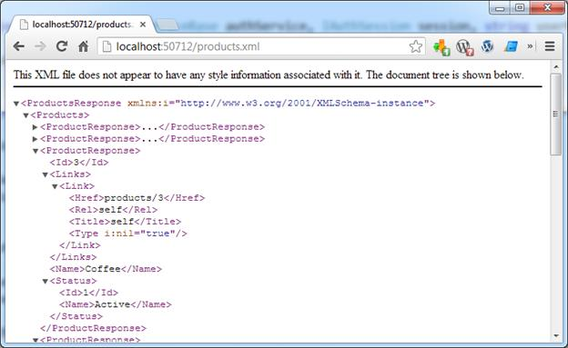

# 五、服务实现

在本章中，我们将详细描述如何构建[第 3 章](03.html#_Chapter_3_)中提到的每个服务。我们还将描述如何实现所有相关组件，这些组件支持我们想要实现的功能。

我们的解决方案将包含三个服务，这三个服务都将实现所有的 HTTP 方法。下表包含将实现的动词列表和各自的路由。

表 9:具有各自业务的服务

| 服务 | 描述 |
| `OrderService` | 包含插入、删除、创建和更新订单的方法。

*   `GET` `/orders`
*   `GET` `/orders/{id}`
*   `POST` `/orders`
*   `PUT` `/orders/{id}`
*   `DELETE` `/orders/{id}`

 |
| `ProductService` | 包含插入、删除、创建和更新产品的方法。

*   `GET` `/products`
*   `GET` `/products/{id}`
*   `POST` `/products`
*   `PUT` `/products/{id}`
*   `DELETE` `/products/{id}`

 |
| `OrderItemService` | 包含操作与订单关联的订单项目的方法。

*   `GET` `/orders/{id}/items`
*   `GET` `/orders/{id}/items/{id}`

 |

对于所有三种服务，我们将实现以下组件:

*   服务模型(请求和响应 DTO)对象定义。
*   路线说明。
*   映射器实现。
*   验证器实现。
*   服务实现。
*   配置(应用程序主机)将一切连接在一起。

## 附加信息

### 链接和状态 dto

所有响应 DTO 对象都将使用`Status`和`Link`类。我把代码放在这里作为参考。

```cs
    public class Status
    {
        public int Id { get; set; }
        public string Name { get; set; }
    }

    public class Link
    {
        public string Rel { get; set; }
        public string Href { get; set; }
        public string Title { get; set; }
        public string Type { get; set; }
    }

```

`Link`类将包含与资源相关的超媒体信息。

### 测试项目

要测试各种服务，创建一个名为`ServiceStack.Succinctly.Host.IntegrationTest`的新项目，该项目引用以下程序集:

*   从 NuGet 包:`ServiceStack.Common`，将安装`ServiceStack.Common`、`ServiceStack.Text`和`ServiceStack.Interfaces`dll。
*   `Microsoft.VisualStudio.QualityTools.UnitTestFramework`，这是标准的微软。包含测试属性的. NET 程序集。
*   `ServiceStack.Succinctly.ServiceInterface`，这是包含我们的 DTO 实现的项目。

### 删除命名空间

要从 XML 返回的对象中移除多余的名称空间，请将以下代码添加到`ServiceStack.Succinctly.ServiceInterface`项目中的`Assembly.cs`中。

```cs
    [assembly: ContractNamespace("", ClrNamespace="ServiceStack.Succinctly.ServiceInterface.OrderModel")]
    [assembly: ContractNamespace("", ClrNamespace="ServiceStack.Succinctly.ServiceInterface.OrderItemModel")]
    [assembly: ContractNamespace("", ClrNamespace="ServiceStack.Succinctly.ServiceInterface.ProductModel")]
    [assembly: ContractNamespace("", ClrNamespace="ServiceStack.Succinctly.ServiceInterface")]

```

## 产品服务

在我们的解决方案中，`Product`类可以被视为参考数据类，因为它是`OrderItem`类的属性。由于一个`Product`可以分配给几个`OrderItems`，因此需要有一个单独的服务专门管理一个`Product`本身。`ProductService`是经典的创建、读取、更新和删除(CRUD)服务。

### 服务模式

作为服务的一个特性，我选择创建两个独立的 dto 来管理插入和更新。我这样做是为了表明有这种可能性，我们可以微调实际的请求。事实上，`CreateProduct`类特别没有`Id`，因为客户在创建产品时不应该知道`Id`。但是，您可以选择不以这种方式实现它，而是使用更一致的对象(正如我们将在`OrderService`实现中看到的)。

以下五个类将用作服务的请求 dto。`GetProducts`类故意没有属性；它主要用于将请求路由到正确的服务方法，我们将在后面看到。

```cs
    public class GetProducts { }

    public class GetProduct 
    {
        public int Id { get; set; }
    }

    public class CreateProduct
    {
        public string Name   { get; set; }
        public Status Status { get; set; }

    }

    public class UpdateProduct
    {
        public int    Id     { get; set; }
        public string Name   { get; set; }
        public Status Status { get; set; }
    }

    public class DeleteProduct
    {
        public int Id { get; set; }
    }

```

几乎所有的服务方法都会返回`ProductResponse`对象。`ProductResponse`是`Product`的一面镜子，正如我们将看到的，它可以包含或多或少的信息。在我们的例子中，它包含了一个`Links`的列表，并且没有关于`Product.Version`的信息，它只用于乐观并发控制。

`ProductsResponse`反而会持有`ProductResponse`的列表。这很有帮助，因为我们可以重用这个对象，并用对分页、导航等有用的更多属性来丰富它。

```cs
     public class ProductResponse
    {
        public int        Id     { get; set; }
        public string     Name   { get; set; }
         public Status     Status { get; set; }
        public List<Link> Links  { get; set; }
    }

    public class ProductsResponse
    {
        public List<ProductResponse> Products { get; set; }
    }

```

### 路线规范

在应用主机(`Global.asax.cs`)中，我们需要注册与`Product`服务相关的各种路由。正如我们在前面几章中看到的，这是在应用程序宿主的构造函数或`Configure`方法中完成的。我之所以选择使用构造函数，是因为我只想对与 IoC 相关的项目使用`Configure`方法。

```cs
    using ServiceStack.Succinctly.Host.Extensions;

    public ServiceAppHost():                    base("Order Management", typeof (ServiceAppHost).Assembly)
    {
        Routes
          .Add<GetProducts>  ("/products",      "GET",    "Returns Products")
          .Add<GetProduct>   ("/products/{Id}", "GET",    "Returns a Product")
          .Add<CreateProduct>("/products",      "POST",   "Creates a Product")
          .Add<UpdateProduct>("/products/{Id}", "PUT",    "Updates a Product")
          .Add<DeleteProduct>("/products/{Id}", "DELETE", "Deletes a Product");
    }

```

ServiceStack `Routes.Add()`方法目前没有公开我们刚刚看到的方法签名。为了实现这一点，我创建了一个扩展方法。`Routes`属性实现了`IServiceRoute`接口，一旦我们知道了这一点，就很容易扩展了。

```cs
    public static class RoutesExtensions
    {
        public static IServiceRoutes Add<T> (this IServiceRoutes routes, 
                                 string restPath, string verbs, string summary)
        {
            return routes.Add(typeof (T), restPath, verbs, summary, "");
        }

        public static IServiceRoutes Add<T>(this IServiceRoutes routes, 
                   string restPath, string verbs, string summary, string notes)
        {
            return routes.Add(typeof(T), restPath, verbs, summary, notes);
        }
    }

```

### 产品映射器实现

我们需要将数据从领域对象模型来回映射到服务对象模型(DTOs)。最好的方法是创建一个特定的类，使应用程序能够将`Product`域对象转换为`ProductResponse`，将`CreateProduct/UpdateProduct`域对象转换为`Product`。因为在大型类的情况下这可能是相当重的工作量，所以我建议您使用一些特定的库，例如自动映射器[<sup>【21】</sup>](SS_0016.xhtml#_ftn21)，因为这将减少必要的代码量。解释自动映射器如何工作超出了本书的范围，但是正如我们将看到的，它非常直观且易于使用。

将自动映射库添加到项目中就像运行以下 NuGet 命令一样简单:

```cs
    PM> Install-Package AutoMapper

```

`ProductMapper`实现了`IProductMapper`接口，这将使其更容易注入到服务中。让我们在`ServiceStack.Succinctly.Host.Mappers`命名空间下的`ServiceStack.Succinctly.Host`项目中创建以下文件。

下面的代码示例显示了`IProductMapper`界面的定义。

```cs
    using OrderManagement.Core.Domain;
    using ServiceStack.Succinctly.ServiceInterface.ProductModel;

    namespace ServiceStack.Succinctly.Host.Mappers
    {
        public interface IProductMapper
        {
           Product ToProduct(CreateProduct request);
           Product ToProduct(UpdateProduct request);
           ProductResponse ToProductResponse(Product product);
           List<ProductResponse> ToProductResponseList(List<Product> products);
        }
    }

```

以下代码是`ProductMapper`的实现。

```cs
    using OrderManagement.Core.Domain;
    using SrvObjType = ServiceStack.Succinctly.ServiceInterface;
    using SrvObj = ServiceStack.Succinctly.ServiceInterface.ProductModel;

    namespace ServiceStack.Succinctly.Host.Mappers
    {
        public class ProductMapper : IProductMapper
        {
            static ProductMapper()
            {
                Mapper.CreateMap<SrvObjType.Status, Status>();
                Mapper.CreateMap<Status, SrvObjType.Status>();
                Mapper.CreateMap<SrvObj.CreateProduct, Product>();
                Mapper.CreateMap<SrvObj.UpdateProduct, Product>();
                Mapper.CreateMap<Product, SrvObj.ProductResponse>();
            }

            public Product ToProduct(SrvObj.CreateProduct request)
            {
                return Mapper.Map<Product>(request);
            }

            public Product ToProduct(SrvObj.UpdateProduct request)
            {
                return Mapper.Map<Product>(request);
            }

            public SrvObj.ProductResponse ToProductResponse(Product product)
            {
               var productResponse = Mapper.Map<SrvObj.ProductResponse>(product);

               productResponse.Links = new List<SrvObjType.Link>
                    {
                        new SrvObjType.Link
                            {
                                Title = "self",
                                Rel = "self",
                                Href = "products/{0}".Fmt(product.Id),
                            }
                    };
               return productResponse;
            }

            //Transforms a list of products into a list of ProductResponses.
            public List<SrvObj.ProductResponse> ToProductResponseList(
                                                          List<Product> products)
            {
                var productResponseList = new List<SrvObj.ProductResponse>();
                products.ForEach(x => 
                             productResponseList.Add(ToProductResponse(x)));
                return productResponseList;
            }
        }
    }

```

|  | 注意:我们所有的服务在设计上都有一个映射器类，因为我们希望将请求和响应 DTOs(服务模型)与应用程序域模型分开。 |

### 验证实现

正如我们在上一章中看到的，我们可以创建一些定制的验证逻辑。在这种情况下，我们将创建一些，因为我们想让我们的实现更强大一点。对于我们当前的示例，我们将确保在创建或更新`Product`时，我们检查`Name`属性是否已设置且不超过 50 个字符。我们将在`ServiceStack.Succinctly.Host.Validation`命名空间中创建以下两个类，并将在应用程序宿主中注册这两个验证器。

```cs
    public class CreateProductValidator : AbstractValidator<CreateProduct>
    {
        public CreateProductValidator()
        {
            string nameNotSpecifiedMsg = "Name has not been specified.";
             string maxLenghtMsg = "Name cannot be longer than 50 characters.";

            RuleFor(r => r.Name)
                .NotEmpty().WithMessage(nameNotSpecifiedMsg)
                .NotNull().WithMessage(nameNotSpecifiedMsg)
                .Length(1, 50).WithMessage(maxLenghtMsg);
        }
    }

    public class UpdateProductValidator : AbstractValidator<UpdateProduct>
    {
        public UpdateProductValidator()
        {
            string nameNotSpecifiedMsg = "Name has not been specified.";
            string maxLenghtMsg = "Name cannot be longer than 50 characters.";

            RuleFor(r => r.Name)
                .NotEmpty().WithMessage(nameNotSpecifiedMsg)
                .NotNull().WithMessage(nameNotSpecifiedMsg)
                .Length(1, 50).WithMessage(maxLenghtMsg);
        }
    }

```

### 应用主机配置

下面的代码显示了应用程序宿主的完整实现。

```cs
    public class ServiceAppHost : AppHostBase
    {
      public ServiceAppHost()
            : base("Order Management", typeof(ServiceAppHost).Assembly)
       {
        Routes
        .Add<GetProducts>  ("/products", "GET", "Returns a collection of Products")
        .Add<GetProduct>   ("/products/{Id}", "GET", "Returns a single Product")
        .Add<CreateProduct>("/products", "POST", "Create a product")
        .Add<UpdateProduct>("/products/{Id}", "PUT", "Update a product")
        .Add<DeleteProduct>("/products/{Id}", "DELETE", "Deletes a product")
        .Add<DeleteProduct>("/products", "DELETE", "Deletes all products");

         Plugins.Add(new ValidationFeature());
       }

        public override void Configure(Container container)
        {
            container.Register<IProductRepository>(new ProductRepository());
            container.Register<IProductMapper>(new ProductMapper());

            container.RegisterValidator(typeof(CreateProductValidator));
            container.RegisterValidator(typeof(UpdateProductValidator));
        }
    }

```

### 服务实现

`ProductService`执行两个`Get`方法，一个`Post`，一个`Put`，一个`Delete`。每个服务栈服务都必须从`ServiceStack.ServiceInterface.Service`类继承。

如下面的代码示例所示，`ProductService`有两个属性:`ProductMapper`和`ProductRepository`，它们将保存运行时由 IoC 容器注入的实例。

```cs
    public class ProductService : ServiceStack.ServiceInterface.Service
    {       
        public IProductMapper ProductMapper { get; set; }
        public IProductRepository ProductRepository { get; set; }

        public ProductResponse Get(GetProduct request){…}
        public List<ProductResponse> Get(GetProducts request){}
        public ProductResponse Post(CreateProduct request){…}
        public ProductResponse Put(UpdateProduct request) {…}
        public HttpResult Delete(DeleteProduct request){…}
    }

```

#### 按标识获取产品

调用`GET /product/1`时，将调用以下方法。如您所见，实现非常简单:

*   从存储库中获取数据。
*   如果没有找到，则返回`404 Not Found`状态码(可以使用`Response.StatusCode`属性)。
*   如果存储库返回了一些东西，那么通过使用`ProductMapper`，我们转换`Product`(将域模型转换为`ProductResponse`服务模型)。

```cs
    public ProductResponse Get(GetProduct request)
    {
        var product = ProductRepository.GetById(request.Id);
        if (product == null)
        {
            Response.StatusCode = (int)HttpStatusCode.NotFound;
            return default(ProductResponse);
        }

        //Transform to ProductsResponse and return.
        return ProductMapper.ToProductResponse(product);
    }

```

为了调用上例中的`GET`服务方法，我们可以使用任何 web 客户端。以下示例显示了一个单元测试(使用微软测试框架)，该测试使用内置的服务栈`JsonServiceClient`在`/products/{Id}` URI 上执行`GET`。

```cs
    [TestMethod]
    public void GetProductByProductId_ReturnsValidProduct()
    {
        //ARRANGE --- 
        int PRODUCT_ID = 1;
        var client = new JsonServiceClient("http://localhost:50712/");

        //ACT  ------ 
        var product = client.Get<ProductResponse>("/products/" + PRODUCT_ID);

        //ASSERT ---- 
        Assert.IsTrue(product!=null);
        Assert.IsTrue(product.Id == PRODUCT_ID);
    }

```

如果我们使用浏览器导航到 http://localhost:50712/products/1 . XML，我们将得到以下响应。

```cs
    <ProductResponse xmlns:i="http://www.w3.org/2001/XMLSchema-instance">
      <Id>1</Id>
      <Links>
        <Link>
          <Href>products/1</Href>
          <Rel>self</Rel>
          <Title>self</Title>
          <Type i:nil="true"/>
        </Link>
      </Links>
      <Name>Pizza</Name>
      <Status>
        <Id>1</Id>
        <Name>Active</Name>
      </Status>
    </ProductResponse>

```

#### 退回所有产品

在这种情况下，服务接受一个`GetProducts`消息，它本身没有任何属性。但是，正如我们将在后面看到的，作为返回的集合，我们可以构建分页、排序、过滤等。目前，我们只需传递一个请求，服务方法将:

*   从存储库中获取数据。
*   将数据从领域模型转换到服务模型(DTO)。

```cs
    //Returns all the Products.
    public ProductsResponse Get(GetProducts request)
    {
    //Get data from the database.
    List<Product> products = ProductRepository.GetAll();

    //Transform to ProductsResponse and return.
    return new ProductsResponse()
        {
            Products = ProductMapper.ToProductResponseList(products)
        };
    }

```

要调用`/products`以获取可用产品的列表，客户端应该如下所示。

```cs
    [TestMethod]
    public void GetAllProducts_ReturnsValidProductList()
    {
        //ARRANGE --- 
        var client = new JsonServiceClient("http://localhost:50712/");

        //ACT  ------ 
        var products = client.Get<ProductsResponse>("/products");

        //ASSERT ---- 
        Assert.IsTrue(products != null);
        Assert.IsTrue(products.Products.Count > 0);
    }

```

如网络浏览器所示:



图 8:产品列表

#### 创建新产品

创建新的`Products`时，有几点需要注意:

*   创建对象时，使用`POST`方法。
*   一旦`Product`被创建并成功发送到存储库(数据库)，我们将像处理`GET /products/1`一样将完整的`Product`返回给客户端。
*   要注意对象已经创建，我们将在标题中添加`Location`，并通知客户端对象的新位置。
*   状态码`201 Created`将返回给客户端。

```cs
    //Returns all the orders.
    public ProductResponse Post(CreateProduct request)
    {
       //Transform the request to Domain.Product.
       var domainProduct = ProductMapper.ToProduct(request);

       //Storing data to database.
       var newProduct = ProductRepository.Add(domainProduct);

       //Transform to ProductResponse.
       var response = ProductMapper.ToProductResponse(newProduct);

       //Manipulate the header and StatusCode.
       Response.AddHeader("Location", Request.AbsoluteUri + "/" + newProduct.Id);
       Response.StatusCode = (int)HttpStatusCode.Created;

       return response;
    }

```

要使用 ServiceStack 客户端插入新产品，我们将测试响应是否返回`201 Created` HTTP 状态，以及`Location`报头是否已经与新的 URI 一起返回。

```cs
    [TestMethod]
    public void CreateNewProduct_ReturnsObjectAnd201CreatedStatus()
    {
        //ARRANGE --- 
        WebHeaderCollection headers = null;
        HttpStatusCode statusCode = 0;
        const string PRODUCT_NAME = "Cappuccino";
        const string SITE = "http://localhost:50712";
        const string PRODUCTS = "/products";
        const string URI = SITE + PRODUCTS;

        var client = new JsonServiceClient(SITE)
            {
                //Grabbing the header once the call is ended.
                LocalHttpWebResponseFilter =
                    httpRes =>
                    {
                        headers = httpRes.Headers;
                        statusCode = httpRes.StatusCode;
                    }
            };

        var newProduct = new CreateProduct
            {
                Name = PRODUCT_NAME,
                Status = new Status {Id = 1}
            };

        //ACT  ------ 
        var product = client.Post<ProductResponse>(PRODUCTS, newProduct);

        //ASSERT ---- 
        Assert.IsTrue(headers["Location"] == URI + "/" + product.Id);
        Assert.IsTrue(statusCode == HttpStatusCode.Created);
        Assert.IsTrue(product.Name == PRODUCT_NAME);
    }

```

调用`POST`方法后，下面是来自服务、头和体的响应。如您所见，`201 Created`动词和`Location`标题被指定并返回给客户端。

```cs
    HTTP/1.1 201 Created
    Cache-Control: private
    Content-Type: application/xml
    Location: http://localhost:50712/products/10
    Server: Microsoft-IIS/8.0
    X-Powered-By: ServiceStack/3.956 Win32NT/.NET
    Date: Tue, 13 Aug 2013 22:15:42 GMT
    Content-Length: 277

    <ProductResponse>
      <Id>10</Id>
      <Links>
        <Link>
          <Href>products/10</Href>
          <Rel>self</Rel>
          <Title>self</Title>
          <Type i:nil="true" />
        </Link>
      </Links>
      <Name>Cappuccino</Name>
      <Status>
        <Id>1</Id>
        <Name>Active</Name>
      </Status>
    </ProductResponse>

```

#### 更新产品

为了更新产品，我们的服务将执行`PUT`方法，该方法将接受`UpdateProduct`消息。

在做任何工作之前，我们检查我们正在更新的资源在存储库中是否可用。如果不是，我们就强制使用`404 Not Found`状态码，表示资源不可用。在成功的情况下，应该发送`200 (OK)`或`204 (No Content)`响应代码来指示请求的成功完成。如果呼叫成功，我们将返回`200 (OK)`和消息的全文。

```cs
    public ProductResponse Put(UpdateProduct request)
    {
        var domainObject = ProductRepository.GetById(request.Id);
        if (domainObject == null)
        {
            Response.StatusCode = (int)HttpStatusCode.NotFound;
            return null;
        }

        //Transform to Domain.Product.
        var domainProduct = ProductMapper.ToProduct(request);

        //Store data to database.
        var updatedProduct = ProductRepository.Update(domainProduct);

        //Transform to ProductResponse and return.
        return ProductMapper.ToProductResponse(updatedProduct);
    }

```

测试产品更新，其中只有资源的状态会更新为`Inactive`:

```cs
    [TestMethod]
    public void UpdateProduct_ReturnsUpdatedObject()
    {
        //ARRANGE --- 
        HttpStatusCode statusCode = 0;
        const string PRODUCT_NAME = "White Wine";
        const string SITE = "http://localhost:50712";
        const string PRODUCT_LINK = "/products/2";

        var client = new JsonServiceClient(SITE)
            {
                //Grabbing the header once the call is ended.
                LocalHttpWebResponseFilter =
                    httpRes =>
                    {
                        statusCode = httpRes.StatusCode;
                    }
            };

        var updateProduct = new UpdateProduct
            {
                Name = PRODUCT_NAME,

                  Status = new Status {Id = 2} // Id = 2 means inactive.

```

};

`//ACT ------`

`var`产品=客户。放< `ProductResponse` > (PRODUCT_LINK，updateProduct)；

`//ASSERT ----`

`Assert`。指示(状态代码= `HttpStatusCode`。-好的：

`Assert`。IsTrue(产品。NAME = = PRODUCT _ NAME)；

断言。IsTrue(产品。状态. Id = = 2)；

}

原资源与新(更新)资源的区别仅在于`Status.Id`。

| **原始资源** | **服务器响应** |
| `<` `ProductResponse` `>``<``Id``>`2`</``Id`T5】`<` `Links` `>``<` `Link` `>``<` `Href` `>`产品/2`</``Href`T5】`<` `Rel` `>`赛尔`</``Rel`T5】`<` `Title` `>`赛尔`</``Title`T5】`<``Type``i:nil``=``true``/>``</` `Link` `>``</` `Links` `>``<` `Name` `>`白酒`</``Name`T5】

`<` `Status` `>`

`<``Id``>`1`</``Id`T5】

`<` `Name` `>`主动`</``Name`T5】

`</` `Status` `>`

`</` `ProductResponse` `>` | HTTP/1.1 200 可以缓存控制:私有内容类型:应用程序/xml服务器:微软-IIS/8.0日期:格林尼治标准时间 2013 年 8 月 13 日 22:19:55内容-长度:278`<` `ProductResponse` `>``<``Id``>`2`</``Id`T5】`<` `Links` `>``<` `Link` `>``<` `Href` `>`产品/2`</``Href`T5】`<` `Rel` `>`赛尔`</``Rel`T5】`<` `Title` `>`赛尔`</``Title`T5】`<``Type``i:nil``=``true``/>``</` `Link` `>``</` `Links` `>``<` `Name` `>`白酒`</``Name`T5】

`<` `Status` `>`

`<``Id``>`2`</``Id`T5】

`<``Name``>``</``Name``>`

`</` `Status` `>`

`</` `ProductResponse` `>` |

#### 删除产品

如果找不到资源，我们可以返回`404 Not Found`状态码。但是你可以选择不返回错误，而是返回`200 OK`。在这个例子中，我选择通知客户资源不存在。在归还`201 NoContent`的时候，我们不会归还任何尸体。

```cs
    //Deletes a product.
    public HttpResult Delete(DeleteProduct request)
    {
        var domainObject = ProductRepository.GetById(request.Id);
        if (domainObject == null)
        {
            Response.StatusCode = (int)HttpStatusCode.NotFound;
        }
        else
        {
            ProductRepository.Delete(request.Id);
            Response.StatusCode = (int)HttpStatusCode.NoContent;
        }
        return null;
    }

```

下面的代码测试了服务中实现的`Delete`方法。

```cs
    [TestMethod]
    public void DeleteProduct_ReturnsNoContent()
    {
        //ARRANGE --- 
        HttpStatusCode statusCode = 0;
        const string SITE = "http://localhost:50712";

        var client = new JsonServiceClient(SITE)
            {
                //Grabbing the header once the call is ended.
                LocalHttpWebResponseFilter =
                    httpRes =>
                    {
                        statusCode = httpRes.StatusCode;
                    }
            };

        //ACT  ------ 
        client.Delete<HttpResult>("/products/5");

        //ASSERT ---- 
        Assert.IsTrue(statusCode == HttpStatusCode.NoContent);
    }

```

## 订单服务

`OrderService`将实现以下方法:

*   `GET` `/orders`
*   `GET` `/orders/{id}`
*   `POST` `/orders`
*   `PUT` `/orders/{id}`
*   `DELETE` `/orders/{id}`

正如我们在`ProductService`中所做的，我们将以同样的方式划分实现。

### 服务模式

`OrderService`的服务模型有点复杂，因为我们有一个对象图，它应该在某些方面模仿领域对象模型。在这个例子中，我选择了在创建和更新一个`Order`时使用`Order`作为 DTO 类的名称，而不是我在上一章中使用的`CreateOrder`和`UpdateOrder`。这主要是为了简洁。请记住，您应该注意命名约定，并尽可能地在所有服务中遵循它(因为客户端更容易理解您的服务的对象模型)。

以下类将用作服务的请求 dto。

```cs
    public class GetOrders { }

    public class GetOrder
    {
        public int Id { get; set; }
    }

    public class DeleteOrder
    {
        public int Id { get; set; }
    }

    //Class used for Create and Update.
    public class Order
    {       
        public int             Id           { get; set; } 
        public bool            IsTakeAway   { get; set; }
        public DateTime        CreationDate { get; set; }
        public Status          Status       { get; set; }
        public List<OrderItem> Items        { get; set; }
    }

    public class OrderItem
    {
        public int     Id       { get; set; }
        public Product Product  { get; set; }
        public int     Quantity { get; set; }
    }

    public class Product
    {
        public int    Id     { get; set; }
        public string Name   { get; set; }
        public Status Status { get; set; }
    }

```

几乎所有的**服务**方法都会返回`OrderResponse`对象。`OrderResponse`是`Order`的表示，它是域对象中的一个类。但是，正如我们将看到的，它可以包含一些更多的信息。在我们的例子中，它包含一个`Links`列表。

```cs
    public class OrdersResponse
    {
        public List<OrderResponse> Orders { get; set; }
    }

    public class OrderResponse 
    {
         public int Id { get; set; }
        public bool IsTakeAway { get; set; }
        public DateTime CreationDate { get; set; }
        public Status Status { get; set; }
        public List<OrderItemResponse> Items { get; set; }
        public List<Link> Links { get; set; }
    }

    public class OrderItemResponse 
    {
        public int Id { get; set; }
        public ProductResponse Product { get; set; }
        public int Quantity { get; set; }
        public List<Link> Links { get; set; }
    }

    public class ProductResponse
    {
        public int Id { get; set; }
        public string Name { get; set; }
        public Status Status { get; set; }    
        public List<Link> Links { get; set; }
    }

```

### 路线规范

在应用程序主机中，我们需要将各种请求 d to 注册到它们的相对 URL。

```cs
    Routes
       .Add<GetOrder>   ("/orders/{Id}", "GET",    "Returns an Order")
        .Add<GetOrders>  ("/orders",      "GET",    "Returns Orders"  )
        .Add<Order>      ("/orders",      "POST",   "Creates an Order")
        .Add<Order>      ("/orders/{Id}", "PUT",    "Updates an Order")
        .Add<DeleteOrder>("/orders/{Id}", "DELETE", "Deletes an Order");

```

### 订单映射器实现

为了将数据从领域对象模型来回映射到服务模型(DTOs)，正如我们在`ProductService`示例中所做的那样，我们将为此有一个特定的`OrderMapper`类。

`OrderMapper`实现了`IOrderMapper`接口，这将使其更容易被注入到服务中。

```cs
      using SrvObj = ServiceStack.Succinctly.ServiceInterface.OrderModel;
    using Domain = OrderManagement.Core.Domain;

    public interface IOrderMapper
    {
       Domain.Order ToOrder(SrvObj.Order request);
       SrvObj.OrderResponse ToOrderResponse(Domain.Order order);
       List<SrvObj.OrderResponse> ToOrderResponseList(List<Domain.Order> orders);
       SrvObj.OrderItemResponse ToOrderItemResponse
                                       (int orderId, Domain.OrderItem orderItem);
       List<SrvObj.OrderItemResponse> ToOrderItemResponseList
                                     (int orderId, List<Domain.OrderItem> items);
    }

```

以下示例是映射器的完整实现。

```cs
    public class OrderMapper : IOrderMapper
    {
        static OrderMapper()
        {
            Mapper.CreateMap<Domain.Status, Status>();
            Mapper.CreateMap<Status, Domain.Status>();
            Mapper.CreateMap<SrvObj.Order, Domain.Order>();
            Mapper.CreateMap<SrvObj.OrderItem, Domain.OrderItem>();
            Mapper.CreateMap<SrvObj.Product, Domain.Product>();
            Mapper.CreateMap<Domain.Order, SrvObj.OrderResponse>();
            Mapper.CreateMap<Domain.OrderItem, SrvObj.OrderItemResponse>();
            Mapper.CreateMap<Domain.Product, SrvObj.ProductResponse>();
        }

        public Domain.Order ToOrder(SrvObj.Order request)
        {
            return Mapper.Map<Domain.Order>(request);
        }

        public SrvObj.OrderResponse ToOrderResponse(Domain.Order order)
        {
            var orderResponse = Mapper.Map<SrvObj.OrderResponse>(order);

            var orderSelfLink = "orders/{0}".Fmt(order.Id);
            orderResponse.Links = new List<Link>();
            orderResponse.Links.Add(SelfLink(orderSelfLink));
            orderResponse.Items.ForEach(x =>
                {
                    var productId = x.Product.Id;
                    var productLInk = "products/{0}".Fmt(productId);
                    var itemsLink = orderSelfLink + "/items/{0}".Fmt(x.Id);
                    x.Product.Links = new List<Link>();
                    x.Product.Links.Add(SelfLink(productLInk));
                    x.Links = new List<Link>();
                    x.Links.Add(SelfLink(itemsLink));
                });
            return orderResponse;
        }

        private Link SelfLink(string uri)
        {
            return new Link
                {
                    Title = "self",
                    Rel = "self",
                    Href = uri
                };
        }

        private Link ParentLink(string uri)
        {
            return new Link
                {
                    Title = "parent",
                    Rel = "parent",
                    Href = uri
                };
        }

       public List<SrvObj.OrderResponse> ToOrderResponseList(List<Domain.Order> orders)
        {
            var orderResponseList = new List<SrvObj.OrderResponse>();
            orders.ForEach(x => orderResponseList.Add(ToOrderResponse(x)));
            return orderResponseList;
        }

        public SrvObj.OrderItemResponse ToOrderItemResponse(int orderId, 
                                                            Domain.OrderItem item)
        {
            var orderItemReponse = Mapper.Map<SrvObj.OrderItemResponse>(item);

            var productId = orderItemReponse.Product.Id;
            var orderLink = "orders/{0}".Fmt(orderId);
            var itemsLink = "/items/{0}".Fmt(item.Id);
            var productLink = "products/{0}".Fmt(productId);

            orderItemReponse.Links.Add(SelfLink(orderLink + itemsLink));
            orderItemReponse.Links.Add(ParentLink(orderLink));
            orderItemReponse.Product.Links.Add(SelfLink(productLink));

            return orderItemReponse;
        }

        public List<SrvObj.OrderItemResponse> 
                       ToOrderItemResponseList(int orderId,                              
                                               List<Domain.OrderItem> items)
        {
          var orderItemResponseList = new List<SrvObj.OrderItemResponse>();
          items.ForEach(x => orderItemResponseList
                             .Add(ToOrderItemResponse(orderId, x)));
          return orderItemResponseList;
        }
    }

```

### 验证实现

订单验证器很简单。它只检查订单是否包含非空的`OrderItems`集合，并且它将同时检查`CreationDate`是否在未来。

```cs
    public class OrderValidator : AbstractValidator<Order>
    {
        public OrderValidator()
        {
            RuleFor(r => r.CreationDate)
                .LessThan(DateTime.Now.AddSeconds(10))
                .WithMessage("Creation Data shouldn't be in the future");

            RuleFor(r => r.Items)
                .NotEmpty()
                .WithMessage("Order Items should be specified");
        }
    }

```

### 应用主机配置

下面的代码显示了应用程序宿主的完整实现。这包括先前为`ProductService`定义的配置。

```cs
    public class ServiceAppHost : AppHostBase
    {
        public ServiceAppHost()
            : base("Order Management", typeof (ServiceAppHost).Assembly)
        {
            Routes
             //Products
             .Add<GetProducts>("/products", "GET", "Returns Products")
             .Add<GetProduct>("/products/{Id}", "GET", "Returns a Product")
             .Add<CreateProduct>("/products", "POST", "Creates a Product")
             .Add<UpdateProduct>("/products/{Id}", "PUT", "Updates a Product")
             .Add<DeleteProduct>("/products/{Id}", "DELETE", "Deletes a Product")

             //Orders

               .Add<GetOrder>("/orders/{Id}", "GET", "Returns an Order")
               .Add<GetOrders>("/orders", "GET", "Returns Orders")
               .Add<Order>("/orders", "POST", "Creates an Order")
               .Add<Order>("/orders/{Id}", "PUT", "Updates an Order")
               .Add<DeleteOrder>("/orders/{Id}", "DELETE", "Deletes an Order");

```

插件。添加(`new``ValidationFeature`)；

}

`public` `override` `void`配置(`Container`集装箱)

{

`//Product` 

集装箱。注册<`IProductRepository`>(`new``ProductRepository`)；

集装箱。注册<`IProductMapper`>(`new``ProductMapper`)；

`//Orders dependencies`

集装箱。注册<`IOrderRepository`>(`new``OrderRepository`)；

集装箱。注册<`IOrderMapper`>(`new``OrderMapper`)；

集装箱。注册<istatusrepository>(`new``StatusRepository`)；</istatusrepository>

`//Validators`

集装箱。register validator(`typeof`(`CreateProductValidator`)；

集装箱。register validator(`typeof`(`UpdateProductValidator`)；

集装箱。register validator(`typeof`(`OrderValidator`)；

}

}

高亮显示的代码是`OrderService`所需要的。正如我们可能看到的，遵循相同的编码和服务创建风格只是一个自然的过程。

### 服务实现

`OrderService`执行两个`Get`方法，一个`Post`，一个`Put`，一个`Delete`。

如下面的代码示例所示，`OrderService`有四个公共属性，即`OrderMapper`、`OrderRepository`、`ProductRepository`和`StatusRepository`，它们将保存运行时将由 IoC 容器注入的实例。

```cs
    public class OrderService : ServiceStack.ServiceInterface.Service
    {
        public IOrderRepository   OrderRepository   { get; set; }
        public IProductRepository ProductRepository { get; set; }
        public IStatusRepository  StatusRepository  { get; set; }
        public IOrderMapper       OrderMapper       { get; set; }

        //Returns all the orders.
        public OrdersResponse Get(GetOrders request) { … }
        //Returns a single order.
        public OrderResponse Get(GetOrder request){ … }
        //Creates a new order.
        public OrderResponse Post(Order request) { … }
        //Updates an existing order /orders/{id}.
        public OrderResponse Put(Order request){ … }
        //Delete an order.
        public HttpResult Delete(DeleteOrder request){ … }
    }

```

#### 按订单编号获取订单

调用`GET /orders/1`时，会调用`Get(GetProduct request)`方法。正如我们之前看到的`ProductService`，结构非常相似:

1.  从存储库中获取数据。
2.  如果没有发现，返回`404 Not Found`错误。这是通过设置`Response.StatusCode`值来完成的。
3.  如果存储库返回了什么，使用`OrderMapper`转换`Order`(将域模型转换为`OrderResponse`服务模型)。

```cs

    //Returns a single order.
    public OrderResponse Get(GetOrder request)
    {
        var domainObject = OrderRepository.GetById(request.Id);
        if (domainObject == null)
        {
            Response.StatusCode = (int) HttpStatusCode.NotFound;
            return null;
        }
        else
        {
            //Transform to OrderResponse and return.
            return OrderMapper.ToOrderResponse(domainObject);
        }
    }

```

为了调用前面示例中使用的`GET`服务方法，我们将使用`XmlServiceClient`，默认情况下，它将与`Content-Type: application/xml`通信。以下示例显示了一个测试，该测试使用内置的 ServiceStack 客户端在`/orders/{Id}` URI 上执行`GET`。

```cs
    [TestMethod]
    public void GetOrdersByOrderId()
    {
        //ARRANGE --- 
        const int ORDER_ID = 1;
        var client = new XmlServiceClient("http://localhost:50712/");

        //ACT  ------ 
        var order = client.Get<OrderResponse>("/orders/" + ORDER_ID);

        //ASSERT ---- 
        Assert.IsTrue(order != null);
        Assert.IsTrue(order.Id == ORDER_ID);
    }

```

#### 返回所有订单

在这种情况下，服务接受`GetOrders`消息。正如我们在`ProductService`中看到的，我们遵循相同的程序:

1.  从存储库中获取数据。
2.  将数据从域转换到服务对象模型。

```cs
    public OrdersResponse Get(GetOrders request)
    {
        //Get data from the database.
        var orders = OrderRepository.GetAllOrders();

        //Transform to OrdersResponse and return.
        return new OrdersResponse()
        {
            Orders = OrderMapper.ToOrderResponseList(orders)
        };
    }

```

要调用`GET /orders`(获取可用订单列表)，客户端代码如下例所示。

```cs
    [TestMethod]
    public void GetAllOrders()
    {
        //ARRANGE --- 
        var client = new XmlServiceClient("http://localhost:50712/");

        //ACT  ------ 
        var orders = client.Get<OrdersResponse>("/orders");

        //ASSERT ---- 
        Assert.IsTrue(orders != null);
        Assert.IsTrue(orders.Orders.Count > 0);
    }

```

#### 创建新订单

创建新的`Orders`时，有几点需要注意:

*   创建对象时，使用`POST`方法。
*   在进行任何进一步的检查之前，我们将确保生成一个正确的`Domain.Order`，因此从存储库中检索一个`Status`和`Product`并将其分配给对象。
*   一旦`Order`被创建并成功发送到存储库，我们将像处理`GET /orders/1`一样返回完整的`Order`表示客户端。
*   要注意对象已经被创建，我们将在标题中添加位置，并通知客户端对象的新位置。
*   状态码`201 Created`将返回给客户端。

```cs
    public OrderResponse Post(Order request)
    {
        //Transforming the IDs into real object objects.
        var newOrder = OrderMapper.ToOrder(request);
        newOrder.Status = StatusRepository.GetById(request.Status.Id);

        newOrder.Items.ForEach(x =>
            {
                x.Product = ProductRepository.GetById(x.Product.Id);
            });

        //Storing data to the database.
        newOrder = OrderRepository.Add(newOrder);

        //Transform to OrderResponse.
        var response = OrderMapper.ToOrderResponse(newOrder);

        //Manipulate the header and StatusCode.
        Response.AddHeader("Location", Request.AbsoluteUri + "/" + newOrder.Id);
        Response.StatusCode = (int)HttpStatusCode.Created;

        return response;
    }

```

要使用 ServiceStack 客户端插入一个新的`Order`，我们将测试响应是否返回`201 Created` HTTP 状态，以及`Location`头是否已被填充。

```cs
    [TestMethod]
    public void CreateNewOrder()
    {
        //ARRANGE --- 
        WebHeaderCollection headers = null;
        HttpStatusCode statusCode = 0;
        const string SITE = "http://localhost:50712";
        const string ORDERS = "/orders";
        const string URI = SITE + ORDERS;

        var client = new XmlServiceClient(SITE)
            {
                //Grabbing the header once the call is ended.
                LocalHttpWebResponseFilter =
                    httpRes =>
                        {
                            headers = httpRes.Headers;
                            statusCode = httpRes.StatusCode;
                        }
            };

        var newOrder = new Order
          {
             CreationDate = DateTime.Now,
             IsTakeAway = true,                   
             Status = new Status {Id = 1}, //Active
             Items = new List<OrderItem>
               {
                 new OrderItem {Product = new Product {Id = 1}, Quantity = 10},
                 new OrderItem {Product = new Product {Id = 2}, Quantity = 10}
                }
           };

        //ACT  ------ 
        var order = client.Post<OrderResponse>(ORDERS, newOrder);

        //ASSERT ---- 
        Assert.IsTrue(headers["Location"] == URI + "/" + order.Id);
        Assert.IsTrue(statusCode == HttpStatusCode.Created);
        Assert.IsTrue(order.Items.Count == 2);
        Assert.IsTrue(order.Status.Id == 1); //Status is active.
    }

```

创建`Order`后，将生成以下 XML，并将标题返回给客户端。

```cs
    HTTP/1.1 201 Created
    Cache-Control: private
    Content-Type: application/xml
    Location: http://localhost:50712/orders/5
    Server: Microsoft-IIS/8.0
    X-Powered-By: ServiceStack/3.956 Win32NT/.NET
    X-AspNet-Version: 4.0.30319
    X-Powered-By: ASP.NET
    Date: Wed, 14 Aug 2013 22:13:31 GMT
    Content-Length: 722

    <OrderResponse xmlns:i="http://www.w3.org/2001/XMLSchema-instance">
      <CreationDate>2013-08-13T00:00:00</CreationDate>
      <Id>5</Id>
      <IsTakeAway>false</IsTakeAway>
      <Items>
        <OrderItemResponse>
          <Id>8</Id>
          <Links>
            <Link>
              <Href>orders/5/items/8</Href>
              <Rel>self</Rel>
              <Title>self</Title>
              <Type i:nil="true" />
            </Link>
          </Links>
          <Product>
            <Id>1</Id>
            <Links>
              <Link>
                <Href>products/1</Href>
                <Rel>self</Rel>
                <Title>self</Title>
                <Type i:nil="true" />
              </Link>
            </Links>
            <Name>Pizza</Name>
            <Status>
              <Id>1</Id>
              <Name>Active</Name>
            </Status>
          </Product>
          <Quantity>10</Quantity>
        </OrderItemResponse>
      </Items>
      <Links>
        <Link>
          <Href>orders/5</Href>
          <Rel>self</Rel>
          <Title>self</Title>
          <Type i:nil="true" />
        </Link>
      </Links>
      <Status>
        <Id>1</Id>
        <Name>Active</Name>
      </Status>
</OrderResponse>

```

#### 更新订单

要更新`Order`，我们的服务将执行`PUT`方法，该方法将接受`Order`消息。

如果现有资源被修改，则应发送`200 (OK)`或`204 (No Content)`响应代码，以指示请求成功完成。在我们的情况下，如果一切顺利，我们不会指定任何东西，因为`200 OK`是默认的响应。如果`Order`不存在，我选择返回“未找到”消息。

```cs
    //Updates an existing order /orders/{id}.
    public OrderResponse Put(Order request)
    {
        var domainObject = OrderRepository.GetById(request.Id);
        if (domainObject == null)
        {
            Response.StatusCode = (int)HttpStatusCode.NotFound;
            return null;
        }

        var updatedOrder = OrderMapper.ToOrder(request);
        updatedOrder.Status = StatusRepository.GetById(request.Status.Id);
        updatedOrder.Items.ForEach(x =>
            {
                x.Product = ProductRepository.GetById(x.Product.Id);
            });

        //Store data to database.
        var order = OrderRepository.Update(updatedOrder);

        //Transform to OrderResponse and return.
        return OrderMapper.ToOrderResponse(order);
    }

```

为了测试`Order`更新，我们将更改几个字段:`CreationDate`、`IsTakeAway`、`Quantity`以及与`OrderItem`相关联的`Product`，其`Id`为 6。

在断言部分，我们将检查新创建的对象是否具有分配给更新的`Order`的值。

```cs
    [TestMethod]
    public void UpdateOrder()
    {
        //ARRANGE --- 
        HttpStatusCode statusCode = 0;
        const string SITE = "http://localhost:50712";
        const string ORDERS_LINK = "/orders/1";
        const string URI = SITE + ORDERS_LINK;
        const int NEW_PRODUCT_ID = 5;
        DateTime NEW_CREATION_DATE = new DateTime(2013, 08, 08);

        var client = new XmlServiceClient(SITE)
        {
            //Grabbing the header once the call is ended.
            LocalHttpWebResponseFilter =
                httpRes =>
                {
                    statusCode = httpRes.StatusCode;
                }
        };

        var updateOrder = new Order
            {
                CreationDate = NEW_CREATION_DATE,
                IsTakeAway = false,
                Items = new List<OrderItem>()
                    {

                          new OrderItem
                              {
                                  Id = 6,
                                  //Setting a different product!
                                  Product = new Product {Id = NEW_PRODUCT_ID}, 
                                  //Setting a different quantity.
                                  Quantity = 100
                              }

```

},

状态= `new` `Status` {Id = 1}

};

`//ACT ------`

`var` orderResponse =客户端。放< `OrderResponse` > (ORDERS_LINK，updateOrder)；

`//ASSERT ----`

`Assert`。指示(状态代码= `HttpStatusCode`。-好的：

`Assert`。IsTrue(orderResponse。CREATION DATE = = NEW _ CREATION _ DATE)；

`Assert`。IsTrue(orderResponse。IsTakeAway = =`false`)；

`Assert`。IsTrue(orderResponse。items . Count = = 1)；

`Assert`。IsTrue(orderResponse。items[0]. PRODUCT . ID = = NEW _ PRODUCT _ ID)；

}

通过访问`GET /Orders/6`在浏览器中测试数据时，可以看到`Order`已经更新。

#### 删除订单

删除`Order`时，重要的是删除完成后返回“`No content`”状态。当返回“`No content`”状态时，消息体不应该返回给客户端。

```cs
    public HttpResult Delete(DeleteOrder request)
    {
        var domainObject = OrderRepository.GetById(request.Id);
        if (domainObject == null)
        {
            Response.StatusCode = (int)HttpStatusCode.NotFound;
        }
        else
        {
            //Delete order in the database. 
            OrderRepository.Delete(request.Id);
            Response.StatusCode = (int)HttpStatusCode.NoContent;
        }

        //Not returning any body!
        return null;
    }

```

下面的代码测试了服务中实现的`Delete`方法。

```cs
    [TestMethod]
    public void DeleteOrder()
    {
        //ARRANGE --- 
        HttpStatusCode statusCode = 0;
        const string SITE = "http://localhost:50712";

        var client = new XmlServiceClient(SITE)
        {
            //Grabbing the header once the call is ended.
            LocalHttpWebResponseFilter =
                httpRes =>
                {
                    statusCode = httpRes.StatusCode;
                }
        };

        //ACT  ------ 
        client.Delete<HttpResult>("/orders/2");

        //ASSERT ---- 
        Assert.IsTrue(statusCode == HttpStatusCode.NoContent);
    }

```

## 订货项目服务

`OrderItemService`将实现以下方法:

*   `GET` `/orders/1234/items`
*   `GET` `/orders/1234/items/{id}`

通过这个例子，我想展示如何创建一个服务，该服务能够导航父资源的复杂属性。虽然我们可以实现现有`OrderItem`的创建或更新，但我认为这并不重要，因为我们已经在前面两个服务中看到了如何创建或更新资源。所以，我有意省略了`OrderItem`的 POST、PUT 和 DELETE 动词。

### 服务模式

`OrderItemService`的服务模式很简单。以下类将用作服务的请求 dto。

```cs
    public class GetOrderItem
    {
        public int OrderId { get; set; }
        public int ItemId { get; set; }
    }

    public class GetOrderItems
    {
        public int OrderId { get; set; }
    }

```

我们将重用之前为`OrderService`创建的`OrderItemResponse`，因为它完全符合需求，并创建一个新的类`OrderItemsResponse`，它将携带一个`OrderItem`响应列表。

```cs
    public class OrderItemsResponse
    {
        public List<OrderItemResponse> Items { get; set; }
    }

```

### 路线规范

在应用程序主机中，我们需要将各种请求 d to 注册到它们的相关 URIs。

```cs
     Routes
    .Add<GetOrderItem>("/orders/{OrderId}/items/{ItemId}","GET"," Get an OrderItem")
    .Add<GetOrderItems>("/orders/{OrderId}/items", "GET", "Get a list of OrderItems");

```

### 映射器实现

我们将重用`OrderMapper`，因为它实现了所有必要的映射。

### 服务实现

下面的代码示例显示了`OrderItemService`的公共成员。和前面的例子一样，公众成员将由国际奥委会注入。

```cs
    public interface IOrderItemService
    {
        public IOrderRepository OrderRepository { get; set; }
        public IProductRepository ProductRepository { get; set; }
        public IStatusRepository StatusRepository { get; set; }
        public IOrderMapper OrderMapper { get; set; }

        OrderItemResponse  Get(GetOrderItem request){};
        OrderItemsResponse Get(GetOrderItems request){};
    }

```

#### 返回与特定订单相关联的所有订单项目

调用`GET /orders/1/items`时，会调用`Get(GetOrderItem request)`方法。

```cs
    public OrderItemsResponse Get(GetOrderItems request)
    {
        var order = OrderRepository.GetById(request.OrderId);

        List<Domain.OrderItem> orderItems = order.Items;

        if (orderItems == null || orderItems.Count == 0)
        {
            Response.StatusCode = (int) HttpStatusCode.NotFound;
            return null;
        }
        else
        {
            return new OrderItemsResponse
                {
                    Items = OrderMapper
                    .ToOrderItemResponseList(request.OrderId, orderItems)
                };
        }
    }

```

客户端代码将检查项目的存在。

```cs
    [TestMethod]
    public void GetOrderItemsByOrderId()
    {
        //ARRANGE --- 
        int ORDER_ID = 1;
        string ITEMS_LINK = "/orders/" + ORDER_ID + "/items";

        var client = new XmlServiceClient("http://localhost:50712/");

        //ACT  ------ 
        var items = client.Get<OrderItemsResponse>(ITEMS_LINK);

        //ASSERT ---- 
        Assert.IsNotNull(items != null);
        Assert.IsNotNull(items.Items);
        Assert.IsTrue(items.Items.Count == 2);
    }

```

#### 返回特定订单项目

该方法的特殊性在于`GetOrderItem`同时包含`OrderId`和`ItemId`属性。

```cs
    public OrderItemResponse Get(GetOrderItem request)
    {
        var order = OrderRepository.GetById(request.OrderId);

        Domain.OrderItem orderItem =
            order.Items
                .FirstOrDefault(x => x.Id == request.ItemId);

        if (orderItem == null)
        {
            Response.StatusCode = (int)HttpStatusCode.NotFound;
            return null;
        }

        OrderItemResponse response =
            OrderMapper
            .ToOrderItemResponse(order.Id, orderItem);

        return response;
    }

```

它包含了全面测试 URI `GET /orders/1/items/2`的测试代码。

```cs
    [TestMethod]
    public void GetOrderItemByOrderId()
    {
        //ARRANGE --- 
        var ITEM_ID = "2";
        var client = new XmlServiceClient("http://localhost:50712/");
        string ITEM_LINK = "/orders/1/items/2";

        //ACT  ------ 
        var item = client.Get<OrderItemResponse>(ITEM_LINK);

        //ASSERT ---- 
        Assert.IsNotNull(item != null);
        Assert.IsTrue(item.Id.ToString() == ITEM_ID);
    }

```

## 结论

在本章中，我们已经看到了三个 web 服务的所有动词的实现，以及如何将请求连接到正确的调用。

我们能够通过使用单元测试来测试实现，并且我们已经看到了如何使用`JsonServiceClient`和`XmlServiceClient`来调用新实现的服务。