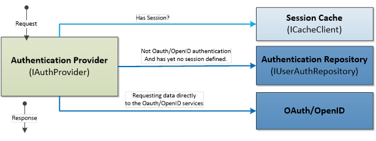
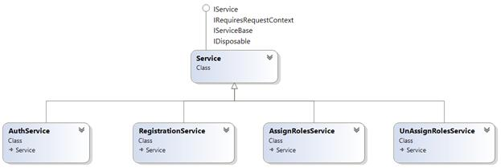

# 七、认证

我们已经看到了如何创建服务，现在我们想要控制对它的访问。在本章中，我们将研究一些保护 web 应用程序免受未授权用户攻击的选项。

|  | 注意:身份验证就是了解用户的身份。授权是决定是否允许用户执行操作。 |

ServiceStack 包含一个内置的身份验证机制，使服务能够验证用户、注册新用户和管理角色。身份验证功能分为四个不同的组件和一个身份验证域对象模型:

*   身份验证提供程序
*   身份验证会话缓存客户端
*   用户身份验证存储库
*   认证服务
*   领域对象模型:`AuthUserSession`、`UserAuth`和`UserOAuthProvider`

## 认证是如何工作的？

**认证提供者**负责定义认证和授权发生的方式。为了检索关于用户的信息，提供商将直接与**认证存储库**通信，并且在成功检索用户数据和用户的*事实上的*认证之后，给定用户的`Session`将在有限的时间内存储在缓存中。

在 OAuth[<sup>【24】</sup>](SS_0016.xhtml#_ftn24)或 OpenID[<sup>【25】</sup>](SS_0016.xhtml#_ftn25)认证的情况下，关于用户的信息将由服务(Twitter、Google、脸书等)直接提供。).



图 10:身份验证提供者

我们从哪里开始？正如我们已经多次看到的，一切都从应用程序主机配置开始，我们需要在其中启用身份验证功能。在详细介绍和解释所有上述组件之前，让我们看一下用`OrmLite Repository`运行`Basic Authentication`所需的最低配置。

```cs
    public override void Configure(Container container)
    {
        //1\. Registering the authorization provider.
        Plugins.Add(new AuthFeature(() => new AuthUserSession(),
                                    new IAuthProvider[]
                                        {
                                            new BasicAuthProvider()
                                        }));

        //2\. Enabling the /register service.
        Plugins.Add(new RegistrationFeature());

        //3\. Configuring the repository that uses a SQL Server back-end.
        var connString = "Data Source=;Initial Catalog=;User ID=;password=";

        var factory = new OrmLiteConnectionFactory(
            connString,
            SqlServerOrmLiteDialectProvider.Instance);

        var ormLiteRepository = new OrmLiteAuthRepository(factory);

        //Registering the repository.
        container.Register<IUserAuthRepository>(ormLiteRepository);

        //Should be run only once as this creates the necessary tables in the db.
        //There is a possibility to DropAndReCreate the entire table.
        ormLiteRepository.CreateMissingTables();
        //ormLiteRepository.DropAndReCreateTables();

        //Just for this example, we create a new user in code.
        if (ormLiteRepository.GetUserAuthByUserName("johnd") == null)
        {
            ormLiteRepository.CreateUserAuth(new UserAuth
                {
                    UserName = "johnd",
                    FirstName = "John",
                    LastName = "Doe",
                    Roles = new List<string> { RoleNames.Admin }
                }, "mypassword");
        }

        //4\. Registering the session cache.
        container.Register<ICacheClient>(new MemoryCacheClient());
    }

    [Authenticate]
    public class ProductService : ServiceStack.ServiceInterface.Service {…}

```

通过使用`Plugins.Add(new AuthFeature()…)`，我们指示 ServiceStack 启用身份验证功能。这是会话(`AuthUserSession`)和提供者(`IAuthProvider[]`)注册的地方，如下面的代码示例所示。

```cs
     Plugins.Add(new AuthFeature(() => new AuthUserSession(),
                                      new IAuthProvider[]
                                        {
                                            new BasicAuthProvider()
                                            //new DigestAuthProvider()
                                            //new CredentialsAuthProvider()
                                        }));

```

### 验证属性

为了让 ServiceStack 知道哪个服务需要认证，必须用`Authenticate`属性来标记。

```cs
    [Authenticate (ApplyTo.Get | ApplyTo.Post]
    public class ProductService : ServiceStack.ServiceInterface.Service
    {
        //..
    }

```

默认情况下，标记有`Authenticate`属性的服务的所有动词都需要身份验证。但是，可以通过直接在属性声明中指定动词列表(例如`ApplyTo.Get`)来细化对哪些动词需要身份验证的控制。

### 激素信息库

`OrmLiteRepository`是内置的身份验证存储库，它使用数据库作为身份验证的存储。存储库需要`OrmLiteConnectionFactory`对象，该对象简单地定义了连接字符串和正在使用的数据库的实际类型。

如果被指示这样做，当调用`CreateMissingTables`方法时，存储库将在数据库中创建所有必要的表。也可以使用`DropAndReCreateTables`。这两个选项在进行单元测试或应用程序第一次运行时都非常有用，但是我建议您避免在生产系统中使用它。

为了使示例更真实，我们创建了一个简单的用户，这样当应用程序启动时，系统中至少会有一个用户用于测试身份验证。

## 认证提供者

认证提供者构成了认证功能的核心；它们定义了要使用的身份验证的实际类型。认证提供者与认证储存库通信以检索关于用户的信息，或者它直接与高速缓存通信以检索关于高速缓存会话的信息。

如下类图所示，每个提供者继承的主接口是`IAuthProvider`，实现这个接口的抽象基类是`AuthProvider`。


图 11:身份验证提供者的层次结构

ServiceStack 目前支持以下提供程序。

表 11:支持的身份验证提供程序

| 供应者 | 描述 |
| --- | --- |
| 基本认证 | 实现为`BasicAuthProvider`类。它提供了标准的基本认证机制。基本身份验证依赖于用户身份验证存储库(`IUserAuthRepository`)来检索现有用户。 |
| 摘要认证 | 实现为`DigestAuthProvider`类。摘要式身份验证依靠用户身份验证存储库(`IUserAuthRepository`)来检索现有用户。 |
| 凭据身份验证 | `CredentialsAuthProvider`通过将请求发布到`/auth/credentials`服务，提供了一种使用用户名和密码进行身份验证的机制。它依赖用户认证存储库(`IUserAuthRepository`)来检索现有用户。 |
| OAuth[<sup>【26】</sup>](SS_0016.xhtml#_ftn26)提供商 | ServiceStack 实现了 Twitter、脸书和 Yammer OAuth，这是一个标准化的开放协议，允许来自 web、移动和桌面应用程序的安全授权。 |
| OpenID[<sup>【27】</sup>](SS_0016.xhtml#_ftn27)提供商 | 作为从 NuGet 的单独下载，包`ServiceStack.Authentication.OpenId`具有 OpenID 协议的提供者，用于:

*   **谷歌 OpenID** :允许用户使用谷歌进行认证。
*   **Yahoo OpenID** :允许用户向 Yahoo 认证。
*   **myopinid**:允许用户使用 myopinid 进行认证。
*   **OpenId** :允许用户向任何自定义 OpenId 提供者进行身份验证。

 |

### 延展性

通过继承`CredentialsAuthProvider`类，ServiceStack 为创建基于用户名和密码的定制身份验证提供者提供了一个很好的扩展点。这就像覆盖`TryAuthenticate`方法一样简单。

```cs
    public class MyCustomAuthorizationProvider : CredentialsAuthProvider
    {
        public override bool TryAuthenticate(IServiceBase authService, 
                                             string userName, string password)
        {
            //Your implementation here. 
        }
    }

```

## 用户认证库

身份验证存储库用于管理后端数据库或其他资源管理系统的用户。通过存储库，身份验证机制将能够根据存储库读取、写入或验证用户。`IUserAuthRepository`是存储库必须实现的基础接口。系统已经提供了几个存储库的实现，如下类图所示:Redis、InMemory 和 OrmLite，它本身支持几个主流数据库(Redis、SQL Server、Oracle、MySQL 等)。).


图 12:身份验证存储库类图

下表详细介绍了可以单独下载并在 NuGet 上提供的一些其他实现。

表 12:可用的身份验证存储库

| 存储库(数据库) | NuGet 包 |
| --- | --- |
| `MongoDB` | [`ServiceStack.Authentication.MongoDB`](https://nuget.org/packages/ServiceStack.Authentication.MongoDB) 通过类`MongoDBAuthRepository` |
| `RavenDB` | [`ServiceStack.Authentication.RavenDB`](https://nuget.org/packages/ServiceStack.Authentication.RavenDB) 通过类`RavenUserAuthRepository` |
| `NHibernate` | [`ServiceStack.Authentication.NHibernate`](https://nuget.org/packages/ServiceStack.Authentication.NHibernate/) 通过类`NHibernateUserAuthRepository` |

## 认证会话缓存

一旦认证发生，`AuthUserSession`模型被填充并存储在缓存中。缓存通过`ICacheClient`接口使用标准的 ServiceStack 缓存机制。缓存用于保存当前经过身份验证的用户的会话信息，由服务栈框架内部管理。

### 它是如何工作的？

身份验证成功后，客户端将收到一个带有会话标识的 cookie。第二个请求中存储在 cookie 中的信息将用于从`ICacheClient`中检索正确的会话信息。所有这些都是由 ServiceStack 在内部完成的。如果我们想检查会话当前包含的内容，可以使用`Service.GetSession()`方法访问这些信息，如下代码所示。

```cs
    [Authenticate]
    public class SomeService : ServiceStack.ServiceInterface.Service
    {
       public object Get(ServiceRequest request)
       {
         IAuthSession session = this.GetSession();
         return new ServiceResponse() {Message = "You're " + session.FirstName };
       }
    }

```

## 服务

公开的服务主要有四个与认证相关，如下图所示，都继承自`Service`类，使得那些非常普通的 ServiceStack 服务。



图 13:认证服务

下表包含可用服务列表及其说明和 URI。

表 13:认证服务解释

| 服务 | 暴露路径 | 描述 |
| `AuthService` | `/auth/{provider}` | 执行身份验证并返回当前登录的用户。`{Provider}`参数定义了提供者的名称，可以是以下之一。

&#124; uri &#124; **提供商类别** &#124;
&#124; `/auth/credentials` &#124; `CredentialsAuthProvider` &#124;
&#124; `/auth/basic` &#124; `BasicAuthProvider` &#124;
&#124; `/auth/twitter` &#124; `TwitterAuthProvider` &#124;
&#124; `/auth/facebook` &#124; `FacebookAuthProvider` &#124;
&#124; `/auth/yammer` &#124; `YammerAuthProvider` &#124;
&#124; `/auth/googleopenid` &#124; `GoogleOpenIdOAuthProvider` &#124;
&#124; `/auth/yahooopenid` &#124; `YahooOpenIdOAuthProvider` &#124;
&#124; `/auth/myopenid` &#124; `MyOpenIdOAuthProvider` &#124;
&#124; `/auth/openid` &#124; `OpenIdOAuthProvider`或任何自定义 OpenID 提供程序 &#124;

 |
| `AssignRolesService` | `/assignroles` | 向现有用户分配角色。 |
| `UnAssignRolesService` | `/unassignroles` | 从现有用户中删除角色。 |
| `RegistrationService` | `/register` | 允许创建新用户。 |

通过配置**注册**功能，可以通过应用主机启用或禁用注册服务。

```cs
    Plugins.Add(new RegistrationFeature());

```

### 验证用户

下面的单元测试展示了如何验证现有用户并从`ProductService`获取数据。在这个例子中，我们将看到如何使用 RestSharp(这只是另一个 REST 客户端库)来获得`ProductResponse`。

```cs
    [TestMethod]
    public void GetProductAndAuthenticateByUsingRestClient()
    {
      var client = new RestClient("http://localhost:50712");
      client.Authenticator = new HttpBasicAuthenticator("johnd", "mypassword");

        var request = new RestRequest("products/1", Method.GET);

        var productResponse = client.Get<ProductResponse>(request);

        Assert.IsTrue(productResponse != null);
        Assert.IsTrue(productResponse.Data.Id == 1);
    }

```

下面的测试方法做了完全相同的事情，但是使用的是 ServiceStack 客户端。

```cs
    [TestMethod]
    public void GetProductAndAuthenticateByUsingServiceStackClient()
    {
        //ARRANGE ---
        var client = new JsonServiceClient("http://localhost:50712/" );
        client.UserName = "johnd";
        client.Password = "mypassword";

        //ACT  ------ 
        var product = client.Get<ProductResponse>("/products/1");

        //ASSERT ---- 
        Assert.IsTrue(product != null);            
    }

```

### 使用 jQuery 进行基本身份验证

从 jQuery 调用服务和从 C#调用服务没什么区别。使用`$.ajax`功能，可以设置`Authorization`头并发送用户名和密码。

要了解完整的实现，请查看示例项目中提供的**ProductData.html**文件，该文件可在[https://bitbucket . org/syncfusiontech/service stack-简洁地说就是](https://bitbucket.org/syncfusiontech/servicestack-succinctly)上找到。

```cs
    <script type="text/javascript">
     function make_base_auth(user, password) {
         var tok = user + ':' + password;
         var hash = btoa(tok);
         return "Basic " + hash;
     }

     function authenticate() {
         //Getting the username and password.
         var username = $("input#username").val();
         var password = $("input#password").val();

          $.ajax({
             type: "GET",
             url: "/products/1",
             async: false,
             dataType: 'json',
             beforeSend: function (xhr) {
             xhr.setRequestHeader('Authorization', make_base_auth(username, 
                                                                  password));
             },
             success: function (result) { //Displaying the values.
                 $('#product_id').val(result.Id);
                 $('#product_name').val(result.Name);
             },
         });
     }
    </script>

```

### 注册新用户

通过使用`RegistrationService`，可以通过`/register` URI 注册新用户。下面的单元测试展示了如何注册新用户。`POST`动作的响应是一个定制的`UserResponse`，返回新的`UserId`、当前的`SessionId`和注册用户的`UserName`——在本例中为“约翰”。

```cs
    [TestMethod]
    public void RegisterNewUser()
    {
        var client = new RestClient("http://localhost:50712");
        client.Authenticator = new HttpBasicAuthenticator("johnd", "mypassword");

        var request = new RestRequest("register", Method.POST);
        request.RequestFormat = DataFormat.Json;
        request.AddBody(new
            {
                UserName = "JaneR",
                FirstName = "Jane",
                LastName = "Roe",
                DisplayName = "Jane Roe",
                Email = "jane.roe@email.com",
                Password = "somepassword",
                AutoLogin = true
            });
        var response = client.Post<UserResponse>(request);

        Assert.IsTrue(response != null);
        Assert.IsTrue(response.Data.UserId != null);
    }

    public class UserResponse
    {
        public string UserId { get; set; }
        public string SessionId { get; set; }
        public string UserName { get; set; }
    }

```

### 为现有用户分配角色

通过使用`AssignRolesService`，可以通过`/assignroles` URI 更改现有用户的`Roles`和`Permissions`，如下单元测试所示。

```cs
    [TestMethod]
    public void AssignRoles()
    {
        var client = new RestClient("http://localhost:50712");
        client.Authenticator = new HttpBasicAuthenticator("johnd", "mypassword");

          var request = new RestRequest("assignroles", Method.POST);

```

request . request format =`DataFormat`JSON；

请求。添加正文(`new`

{

用户名= `"JaneR"`，

权限= `"some_permissions"`，

角色= `"Admin, Reader"`

});

`var`响应=客户端。< `AssignRoleResponse` >发文(请求)；

`Assert`。IsTrue(响应！=`null`)；

}

`public` `class` `AssignRoleResponse`

{

`public` `string`【全球通{`get`；`set`}

`public` `string`所有许可{`get`；`set`}

`public` `object`响应状态{`get`；`set`；}

}

|  | 注意:由于未分配的角色遵循相同的结构，因此省略了实际的代码示例。 |

|  | 提示:分配或取消分配角色的用户必须是管理员。 |

## 授权

除了身份验证，ServiceStack 还提供了授权机制。有一种方法可以控制允许哪个`Role`或`Permission`执行某个服务或方法。

我们已经看到，可以注册用户，并因此分配角色和权限。因此，每当用户进行身份验证时，所有这些信息都将在会话中可用。

### 如何控制对服务的访问

主要看两个属性:`RequiredRole`和`RequiredPermission`。

这些属性可以关联到:

*   服务本身。
*   任何服务方法。
*   《请求 DTO 宣言》。

```cs

      [Authenticate]

```

`public` `class` `ProductService`:服务包.服务接口。`Service`

{

[ `RequiredRole`(角色名。管理)]

[ `RequiredPermission` ( `"some_permission"` )]

`public` `ProductResponse`获取(`GetProduct`请求){ `…` }

`//To execute this method a user has to be authenticated.`

`public` `List` < `ProductResponse` >获得(`GetProducts`请求){ `…` }

}

`//This is the equivalent declaration.`

[ `Authenticate` ]

[ `RequiredRole`(角色名。管理)]

[ `RequiredPermission` ( `"some_permission"` )]

`public`级`GetProduct` { … }

[ `Authenticate` ]

`public`级`GetProducts` { … }

如果用户没有分配正确的`Role`或`Permission`，将返回`403 Invalid Role`或`403 Invalid Permission`状态。