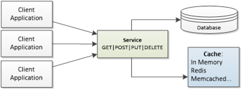
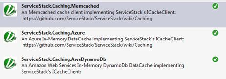

# 第八章缓存

在[第 1 章](01.html#_Chapter_1_)中，我们简单提到了 ServiceStack 包含了对服务器端缓存的内置支持。



图 14:服务堆栈中的缓存

ServiceStack 为许多不同的缓存提供者提供了 **ICacheClient** ，一个干净的缓存接口:

*   **内存中:**使用 RAM 作为缓存机制。
*   **Redis** :一个开源的，BSD 许可的，高级键值存储。[<sup>【28】</sup>](SS_0016.xhtml#_ftn28)
*   **Memcached** :一个高性能、分布式内存、对象缓存系统，旨在通过减轻数据库负载来加速动态网络应用程序。[<sup>【29】</sup>](SS_0016.xhtml#_ftn29)
*   **Azure 客户端**:用于与微软 Azure 接口。
*   **AWS 缓存客户端**:用于与亚马逊 Web Services 上托管的 Amazon DynamoDB 后端接口。
*   **磁盘**:写入硬盘。

您使用哪种缓存提供程序主要取决于应用程序的需求。

*MemCached***Azure、*或*awsdynaminodb*提供商需要通过 NuGet 单独安装。*

 *

图 15: NuGet 缓存提供程序

## 配置缓存

`ICacheClient`接口是所有支持的缓存选项的起点，因为它定义了每个缓存提供者必须实现的基本接口。

要开始使用缓存机制，就像在应用程序主机中注册提供程序一样简单。注册后，`ICacheClient`的一个实例将在运行时被注入到服务中，并将作为属于`ServiceBase`类的`Cache`属性提供。

下面的示例显示了如何配置应用程序主机中的各种提供程序。

```
    public override void Configure(Container container)
    {
        //MemoryCacheClient
        container.Register<ICacheClient>(new MemoryCacheClient());

        //Redis
        container.Register<IRedisClientsManager>
                     (c => new PooledRedisClientManager("<redis_address_here>"));
        container.Register
                     (c => c.Resolve<IRedisClientsManager>().GetCacheClient())
                                                  .ReusedWithin(ReuseScope.None);

        //MemCached
        container.Register<ICacheClient>
                          (new MemcachedClientCache(new[] {"<memcached_host>"}));

        //Azure
        container.Register<ICacheClient>(new AzureCacheClient("CacheName")); 

        //AWS DynamoDB
        container.Register<ICacheClient>(new DynamoDbCacheClient(...))
    }

```

## 响应缓存

为了演示如何使用缓存，我们将重用我们的`ProductService`。这里需要注意的一点是，缓存将包含完整的响应，而不是响应 DTO 本身。

为了支持这个场景，我们不得不将方法的输出改为`object`，而不是现有的`ProductResponse`。关于缓存，我们应该知道两件事:

*   缓存基本上是一个字典，它需要一个唯一的键来识别缓存的对象。密钥是一个字符串，可以由`UrnId`助手类生成。
*   `RequestContext.ToOptimizedResultUsingCache`是负责从缓存返回数据的方法。

下面的代码示例包含修改后的`Get()`方法。如果在具有给定关键字的缓存中没有找到任何内容，将执行突出显示的代码(这总是在第一次从缓存中请求特定项目时发生)，并且对于所有后续调用，它将被忽略。

```
    public object Get(GetProduct request)
    {
        var key = UrnId.Create<GetProduct>(request.Id.ToString());

        var cachedProduct = 
            RequestContext.ToOptimizedResultUsingCache(this.Cache, key, () =>
            {

                  var product = ProductRepository.GetById(request.Id);
                  if (product == null)
                  {
                      Response.StatusCode = (int) HttpStatusCode.NotFound;
                      return default(ProductResponse);
                  }
                  return ProductMapper.ToProductResponse(product);

```

});

`return`缓存产品；

}

### 时间到期缓存

基本的缓存方法对静态对象很有效，我们知道这些静态对象在很长一段时间内不会改变。但是对于可以改变的项，通过一个`TimeSpan`存在一个支持时间过期的方法的重载，定义了一个周期，超过这个周期缓存的项将被自动删除，因此在下一次调用中被刷新。

```
    RequestContext.ToOptimizedResultUsingCache(this.Cache, key, new TimeSpan(0,1,0), 
        () =>
            {
                //…
            }

```

### 缓存项目删除

但是，时间过期方法仍然不能确保从缓存返回的对象实际上是存储在存储库中的最新版本。理论上，在对象应该在缓存中的时间段内，可以更新(更改)对象。

解决这个问题的方法是手动确保对象在缓存中被刷新，以防对象被更改。一种可能的方法是更改`Put()`(更新)方法，从缓存中移除已更改的对象。

```
    public ProductResponse Put(UpdateProduct request)
    {
        var key = UrnId.Create<GetProduct>(request.Id.ToString());
        base.RequestContext.RemoveFromCache(base.Cache, key); 
    }

```*