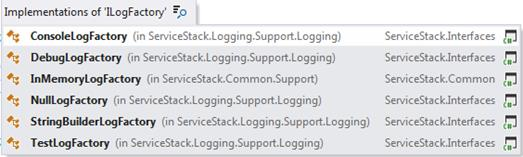
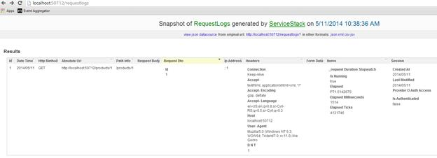

# 第九章日志记录

ServiceStack 提供了一个日志框架，为主要的微软公司公开了`ILog`接口和适配器。NET 日志记录提供程序(log4net、NLog 等)。).

通过依赖`ILog`接口，web 服务和应用程序逻辑不再直接依赖于任何外部日志库，然后可以在运行时注入日志库。

以下 NuGet 包可供下载:

*   ServiceStack。日志记录
*   ServiceStack。伐木业，埃尔马
*   ServiceStack。日志记录
*   ServiceStack。日志记录。日志 4 网络 129
*   ServiceStack。日志记录

然而，ServiceStack 包含一些基本的记录器实现，如下图所示。



图 16:内置的日志工厂

主要有三个要研究的对象:

*   `LogManager`:日志配置的入口点。
*   `ILog`:通过提供通用接口来抽象提供者。
*   `LogFactories`:每个提供商一个；实例化一个提供程序。


图 17:日志类

## log4net 集成

log4net 可能是微软最常用的日志库。NET 世界。许多开发人员都熟悉它的配置和用法。在本章中，我们将了解如何配置和开始使用日志记录功能，以及如何使用 log4net 提供程序适配器。

要开始使用 log4net，首先要做的是从 NuGet: `ServiceStack.Logging.Log4Net`安装一个包。

在应用程序主机配置中，我们需要注册我们想要使用 log4net 提供程序的事实。这是通过创建`Log4NetFactory`的新实例并将对象分配给`LogManager.LogFactory`来完成的。

```cs
    public override void Configure(Container container)
    {
        LogManager.LogFactory = new Log4NetFactory(true);
    }

```

要获得我们刚刚在应用程序主机配置中注册的记录器的实例，我们将使用`LogManager.GetLogger()`方法。

```cs
    public class ProductService : ServiceStack.ServiceInterface.Service
    {
        private ILog Logger { get; set; }

        public ProductService()
        {

              Logger = LogManager.GetLogger(GetType());

```

}

`public` `ProductResponse`获得(`GetProduct`请求)

{

伐木工。调试(`"Getting the product"`)；

`return``new``ProductResponse`()；

}

}

## 使用 ILog 界面

如果您认为在每个服务中实例化记录器是一种开销，那么您可以使用依赖注入并将记录器注入到类中。在这种情况下，我们需要更改前面的示例，以包括`ILog`界面的注册。

```cs
    public override void Configure(Container container)
    {
        LogManager.LogFactory = new Log4NetFactory(true);
        container.Register<ILog>(LogManager.GetLogger(""));
    }

```

通过将`ILog`(记录器)属性更改为公共的，IoC 容器将在服务创建时注入实例。

```cs
    public class ProductService : ServiceStack.ServiceInterface.Service
    {
        public ILog Logger { get; set; }

        public ProductResponse Get(GetProduct request)
        {

              Logger.Debug("Getting the product");

```

`return``new``ProductResponse`()；

}

}

## 请求日志功能插件

除了上述通过公开`ILog`接口启用日志记录的可能性之外，服务堆栈还包含一个内置插件，支持对最近的请求和错误响应进行可配置的内存跟踪。

要启用插件，我们必须通过将其添加到应用程序主机中的插件列表来注册`RequestLogsFeature`。

```cs
    public override void Configure(Container container)
    {
        Plugins.Add(new RequestLogsFeature()
        {
            RequiredRoles = new string[]{}
        });               
    }

```

启动应用程序后，将注册一个新的 URI `http://<servername>/requestlogs`，并立即可供查询。

该插件公开了一个可配置属性的列表，这些属性可以更改，并且会影响记录的内容。

| 财产 | 描述 |
| --- | --- |
| `AtRestPath`默认值:/request log | 可以查询日志输出的位置。作为一个可配置的选项，可以设置一个新的位置(例如“`/lastrequests`”)。 |
| `EnableSessionTracking`默认值:假 | 跟踪关于当前用户会话的信息。日志将包含第 7 章中提到的`IAuthSession`的实施者所暴露的信息。 |
| `EnableRequestBodyTracking`默认值:假 | 允许跟踪请求的原始主体(如在请求头中)。 |
| `EnableResponseTracking`默认值:假 | 启用对返回对象(服务调用的结果)的跟踪。 |
| `EnableErrorTracking`默认值:真 | 允许跟踪错误(服务呼叫的结果)。 |
| `Capacity`默认值:1000 | 定义要跟踪的最大(最新)请求数。在可配置的情况下，这可以更改为在`InMemoryRollingRequestLogger`中定义的更高或更低的值。 |
| `RequiredRoles`默认值:“管理员” | 包含允许查询 URI 的角色列表。作为一个集合，可以配置多个角色。如果留空，每个人都可以进入 URI。 |
| `RequestLogger`默认值:的实例在内存滚动请求记录器中 | 包含实现`IRequestLogger`接口的系统定义记录器的实例。您可以创建自己的`IRequestLogger`实现。系统默认配置的记录器是`InMemoryRollingRequestLogger`。 |
| `ExcludeRequestDtoTypes`默认值:类型(请求日志) | 包含我们不想跟踪其日志记录的 dto 列表。 |
| `HideRequestBodyForRequestDtoTypes`默认值:类型(授权)，类型(注册) | 不会跟踪列表中指定类型的请求正文。 |

### 免疫机能失调症

`InMemoryRollingRequestLogger`是实现`IRequestLogger`接口的内置类(`IRequestLogger`接口只在`RequestLogs`插件中使用)。顾名思义，记录器实现跟踪并将值作为`RequestLogEntry`条目存储在内存中。

`RequestLogEntry`值列表在`/requestlog` URI 返回。`RequestLogEntry`类的定义如下。

```cs
    public class RequestLogEntry
    {
        public long Id { get; set; }
        public DateTime DateTime { get; set; }
        public string HttpMethod { get; set; }
        public string AbsoluteUri { get; set; }
        public stringPathInfo { get; set; }
        public string RequestBody { get; set; }
        public object RequestDto { get; set; }
        public string UserAuthId { get; set; }
        public string SessionId { get; set; }
        public string IpAddress { get; set; }
        public string ForwardedFor { get; set; }
        public string Referer { get; set; }
        public Dictionary<string, string> Headers { get; set; }
        public Dictionary<string, string> FormData { get; set; }
        public Dictionary<string, object> Items { get; set; }
        public object Session { get; set; }
        public object ResponseDto { get; set; }
        public object ErrorResponse { get; set; }
        public TimeSpan RequestDuration { get; set; }
    }

```

并且，当在浏览器中显示时，它看起来像下图。



图 18:请求日志结果屏幕