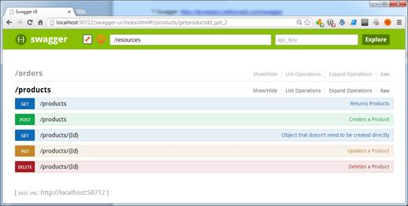

# 十二、使用文档记录网络服务

公开 RESTful web 服务时要做的重要事情之一是提供良好的文档。没有真正的标准(或者至少有一个*事实上的*标准)来揭露 REST 合同(WADL[<sup>【31】</sup>](SS_0016.xhtml#_ftn31)是一种尝试)。许多 REST APIs 公开了人类可读的文档，如果手动编辑，很难与 API 的当前状态保持完美同步。另一种方法是从代码本身创建文档。

ServiceStack 目前支持两种从代码中记录 web 服务的方法:

*   元数据页面
*   霸气整合[<sup>【32】</sup>](SS_0016.xhtml#_ftn32)

## 元数据页面

我们已经提到，有一个由框架自动生成的元数据页面；它包括服务中包含的操作和类型的主要信息。

为了让元数据页面显示所需的信息，主要的信息来源是`RouteAttribute`。这同样适用于应用程序主机中的`Route`定义，因为两者提供相同的功能。

`RouteAttribute`提供了五个可以设置的属性。以下是`RouteAttribute`定义的公共 API。

```cs
    public class RouteAttribute : Attribute
    {
        public object TypeId { get; set; }
        public string Path { get; set; }
        public string Verbs { get; set; }
        public string Notes { get; set; }
        public string Summary { get; set; }
    }

```

但是，支持新属性`Api`、`ApiResponse`、`ApiMember`和`ApiAllowableValues`，这些属性现在可用于进一步丰富对象。新的属性将主要在与 Swagger 集成时使用，但是，正如我们将看到的，其中一些属性也可以在元数据页面中找到。

我们来看一个`Route`和`Api`属性用法的例子。

```cs
     [Route("/products/{Id}", Verbs="GET", Notes = "Gets the product by id",
    Summary = "Object that doesn't need to be created directly")]
    [Api("Get the product by id")]
    [ApiResponse(HttpStatusCode.NotFound, 
    "No products have been found in the repository")]
    public class GetProduct
    {
        [ApiMember(AllowMultiple = false,  
        DataType = "int", Description = "Represents the ID passed in the URI",
        IsRequired = false, Name = "Id", ParameterType = "int", Verb = "GET")]
        public int Id { get; set; }
    }

```

一旦我们在元数据页面中运行了应用程序，我们就可以看到前面代码示例中的所有信息。如下图所示，所有信息都可用。


图 23:元数据页面

编写时，元数据页面中不显示`ApiResponse`和`ApiAllowableValues`。

`ApiResponse`允许您指定服务可以返回的不同错误响应状态。它可以声明几次，每个错误一次。

`ApiAllowableValues`属性允许您指定允许的最小和最大数值范围、命名值列表、命名值枚举或返回名称列表的自定义工厂。

## 霸气整合

以下对斯瓦格的描述直接取自公司网页:

”*swaggle 是一个规范和完整的框架实现，用于描述、生产、消费和可视化 RESTful web 服务。*”

ServiceStack 有一个允许与 Swagger 框架集成的应用编程接口。你可以在几分钟内整合斯瓦格。

1.  安装`ServiceStack.Api.Swagger` NuGet 包。这将创建一个**swaggui**文件夹，其中存储了 swaggjavascript 和 HTML 页面。此外，这将创建两个新的服务:`/resources`和`/resource/name*`。这两个服务是斯瓦格用户界面的数据源。
2.  通过添加`SwaggerFeature`配置应用主机。

```cs
    Plugins.Add(new SwaggerFeature());

```

1.  通过将`discoveryUrl`值更改为“`../resources`，在**swag-ui**文件夹中配置`index.html`页面。

```cs
    <script type="text/javascript">
       $(function () {
        window.swaggerUi = new SwaggerUi({
        discoveryUrl:"../resources",

```

1.  运行应用程序。在浏览器中，导航至`/swagger-ui/index.html`。如下图所示，Swagger 将为您提供大量关于您的 API 的信息。



图 24:霸气界面

我们可以看到所有通过`Api`属性提供的信息都是可见的。


图 25:swaggy 获得带参数的产品