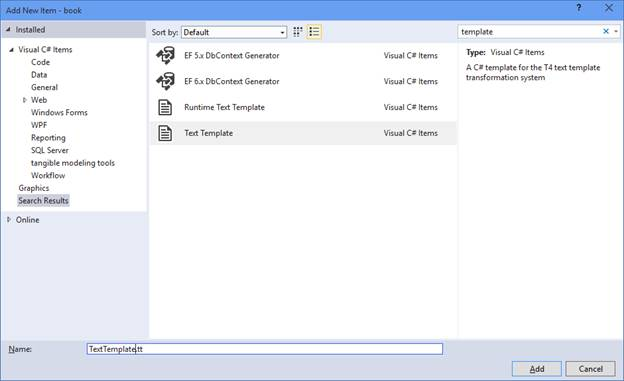
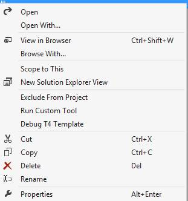
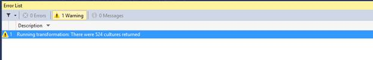

# 第二章入门

## 两种模板

我们有两种类型的模板:文本模板和运行时文本模板。文本模板将产生由模板直接控制的输出，而运行时文本模板将产生一个由代码调用的类，以产生模板中描述的输出。

本章将重点介绍文本模板，但是我们将要介绍的关于 T4 模板的结构和语法的所有内容对这两种类型都适用。不同之处在于产出的类型以及如何使用它们。

选择**新增项目**时，可以过滤显示模板项目。



图 1:添加新项目模板

## 向项目添加模板

让我们从一个控制台应用程序项目开始。从**添加新项目**对话框中，选择**文本模板**。对于我们的第一个模板，我们将保留缺乏想象力的名称， **TextTemplate.tt** 。模板中的初始代码将非常基本。

```
          <#@ template debug="true" hostSpecific="true" #>
          <#@ output extension=".cs" #>
          <#@ Assembly Name="System.Core" #>
          <#@ Assembly Name="System.Windows.Forms" #>
          <#@ import namespace="System" #>
          <#@ import namespace="System.IO" #>
          <#@ import namespace="System.Diagnostics" #>
          <#@ import namespace="System.Linq" #>
          <#@ import namespace="System.Collections" #>
          <#@ import namespace="System.Collections.Generic" #>
          <#

          #>

```

代码清单 1:初始基本模板

保存此模板将运行自定义工具，该工具将处理模板。您也可以通过在解决方案资源管理器的模板上下文菜单中选择**运行自定义工具**来运行自定义工具。



图 2:解决方案资源管理器上下文菜单

运行自定义工具后，您将在解决方案资源管理器中找到嵌套在模板下的新文件。该文件将与模板同名，但带有一个**。cs** 分机。这将是运行模板的输出。此时，输出将是空白的，因为我们实际上还没有告诉我们的模板做任何事情。

向模板中添加以下代码，现在让我们看看输出。

```
          <#@ template debug="true" hostSpecific="true" #>
          <#@ output extension=".cs" #>
          <#@ Assembly Name="System.Core" #>
          <#@ Assembly Name="System.Windows.Forms" #>
          <#@ import namespace="System" #>

          using System;

          namespace book
          {
           class Program
           {
            static void Hello(string[] args)
            {
               Console.WriteLine("Hello World");
               Console.ReadKey();
            }
           }
          }

```

代码清单 2:硬编码模板

输出相当简单，虽然有点缺乏灵感，但是我们会努力的。现在让我们看看输出是什么样的。

```
          using System;
          using System.Collections.Generic;
          using System.Linq;
          using System.Text;
          using System.Threading.Tasks;

          namespace book
          {
           class Program
           {
            static void Hello(string[] args)
            {
               Console.WriteLine("Hello World");
               Console.ReadKey();
            }
           }
          }

```

代码清单 3:模板输出

这展示了 T4 的美丽和魅力。查看模板中的文本，很容易看到输出的外观。

现在让我们把注意力转向语法和这个模板的组件。

## 模板的解剖

模板由**指令**、**文本块**、**代码块**和**特征块**组成。我们将依次探讨其中的每一个。

### 指令

指令标有``<#@`` ``#>`` 分隔符。

一般语法是:

``<#@`` `DirectiveName [AttributeName = "AttributeValue"] ...` ``#>``

指令应该在模板文件的顶部。它们不能包含在代码块中或任何功能块之后。

在我们正在查看的模板中，使用了以下指令:

```
          <#@ template debug="true" hostSpecific="true" #>
          <#@ output extension=".cs" #>
          <#@ Assembly Name="System.Core" #>
          <#@ Assembly Name="System.Windows.Forms" #>
          <#@ import namespace="System" #>

```

代码清单 4:输出模板的指令

我们现在来看看这些指令的细节。

#### 模板指令

这是一个关键指令。每个模板都将包含一个模板指令，并且只能包含该指令一次。如果您的模板有多个模板指令，您将收到如下警告消息:

*在模板中发现多个模板指令。除了第一个，其他都将被忽略。模板指令的多个参数应在一个模板指令*中指定。

如果您没有模板指令，则不会给出警告或错误消息，但是您通常需要设置一些关键属性。

| 属性 | 描述 |
| --- | --- |
| 语言 | 可以指定 C#或者 VB。默认值将是 C#。这将是编写代码块和表达式块的语言，而不是模板生成的语言。 |
| 编译选项 | 任何有效的编译器选项。这些选项在编译模板时传递给编译器。对于运行时模板，这将被忽略。 |
| 文化 | 指定在表达式块转换为文本时用于计算表达式块的区域性。这默认为不变量文化。 |
| 调试 | 指定是否保留为编译模板而创建的中间文件。这有助于获得更好的错误消息，并在编译模板时出现问题时找到问题的根源。 |
| 寄主专化的 | 可以是真、假或 trueFromBase。默认值为假。如果设置为 true，模板的基类将包含一个属性 Host，该属性将允许您访问宿主引擎。此属性不适用于运行时模板。 |
| 继承 | 对于文本模板，这是运行自定义工具时用于创建模板的中间类的基类。这可以是从任何类派生的。 |
| 能见度 | 此属性仅适用于运行时模板。这指定了为创建运行时模板而生成的类的可见性。默认值是公共的。您也可以将其设置为内部，以限制谁可以使用该模板。 |
| linepragma | 该属性可以是真也可以是假，它将决定用于创建模板的生成代码中是否包含 linePragma 指令。这允许您在编译模板时出现问题时获得更好的错误消息。 |

#### 输出指令

该指令仅适用于文本模板，并将控制生成文件的文件扩展名和编码。

| 文件扩展名 | 描述 |
| 延长 | 指定生成文件的扩展名。默认值为`“.cs”`。这不会影响生成文件的语言，只会影响文件名的扩展名。对于运行时模板，它被忽略，因为它不会更改相关嵌套文件的文件扩展名，但如果提供了它，也不会导致任何错误。 |
| 编码 | 指定生成文件的编码。系统默认值为`0`。有效值可以是来自调用`Encoding.GetEncodings()`的任何`WebName`或`CodePage`值。 |

#### 装配指令

该指令与向 Visual Studio 项目添加引用具有相似的效果。只有一个属性:名称。您可以指定 GAC 中记录的全名、完全限定的程序集名称或程序集的绝对路径。

您也可以使用如下语法引用 Visual Studio 变量:

**`<#@`****`assembly`****`name`****=****`"$(SolutionDir)\BaseTemplate\bin\debug\BaseTemplate.dll"`****`#>`**

或者

**`<#@`****`assembly`****`name`****=****`"%LibraryDirectory%\Library\%Version%\BaseTemplate.dll"`****`#>`**

#### 进口指令

这个指令类似于 C#中的 **`using`** 指令或者 VB 中的 **`Imports`** 指令。您指定的任何命名空间都必须在程序集指令中提到的程序集之一中找到。该指令只有一个属性，即要导入的命名空间的名称。

## 包括指令

这个指令类似于经典 ASP 中的 **`#include`** 指令。另一个文件的内容被插入到正在处理的模板中。

| 文件 | 文件路径可以是要包含的文件的相对路径或绝对路径。该路径还可以包括前面针对程序集指令讨论的任何变量。 |
| 一次 | 可设置为`true`以确保指定文件只包含一次 |

### 文本块

文本块是从模板中输入的直文本创建的，并直接复制到生成的文件中。这允许我们编写看起来像将要产生的输出的模板代码。

原始模板的文本块在下面的代码中用虚线框标出:

```
          <#@ template debug="true" hostSpecific="true" #>
          <#@ output extension=".cs" #>
          <#@ Assembly Name="System.Core" #>
          <#@ Assembly Name="System.Windows.Forms" #>
          <#@ import namespace="System" #>
          <#@ import namespace="System.IO" #>
          <#@ import namespace="System.Diagnostics" #>
          <#@ import namespace="System.Linq" #>
          <#@ import namespace="System.Collections" #>
          <#@ import namespace="System.Collections.Generic" #>

          ---------------------------------------------
            using System;
            using System.Collections.Generic;
            using System.Linq;
            using System.Text;
            using System.Threading.Tasks;

            namespace book
            {
             class Program
             {
              static void Hello(string[] args)
              {
                 Console.WriteLine("Hello World");
                 Console.ReadKey();
              }
             }
            }
       ---------------------------------------------

```

代码清单 5:突出显示文本块的模板

### 表达模块

表达式块插入到文本块中。使用表达式块，您可以将元数据中的值或表达式的计算结果注入到生成的代码中。在将该值注入生成的代码之前，模板引擎将通过 **`ToString`** 函数运行该值，同时考虑到在 **`Template`** 属性中指定的区域性。

任何做过 ASP 编程的人都熟悉表达式的语法。

``<#=`` `DateTime.Today` ``#>``

这个表达式将把今天的日期插入到生成的代码中。表达式块中可以使用任何有效的表达式，但不能使用语句。在幕后，表达式将被包装在对用于创建模板的生成类中的 **`this.Write()`** 的调用中。

让我们在原始模板中添加一个表达式，看看它如何改变生成的代码。

```
          <#@ template debug="true" hostSpecific="true" #>
          <#@ output extension=".cs" #>
          <#@ Assembly Name="System.Core" #>
          <#@ Assembly Name="System.Windows.Forms" #>
          <#@ import namespace="System" #>
          <#@ import namespace="System.IO" #>
          <#@ import namespace="System.Diagnostics" #>
          <#@ import namespace="System.Linq" #>
          <#@ import namespace="System.Collections" #>
          <#@ import namespace="System.Collections.Generic" #>

          using System;
          using System.Collections.Generic;
          using System.Linq;
          using System.Text;
          using System.Threading.Tasks;

          namespace book
          {
           // Generated on <#= DateTime.Today #>
           class Program
           {
            static void Hello(string[] args)
            {
               Console.WriteLine("Hello World");
               Console.ReadKey();
            }
           }
          }

```

代码清单 6:带有表达式块的简单模板

现在输出如下所示:

```
          using System;
          using System.Collections.Generic;
          using System.Linq;
          using System.Text;
          using System.Threading.Tasks;

          namespace book
          {
           // Generated on 04/23/2015 00:00:00
           class Program
           {
            static void Hello(string[] args)
            {
               Console.WriteLine("Hello World");
               Console.ReadKey();
            }
           }
          }

```

代码清单 7:表达式块的输出

如果我们更改区域性，我们可以看到该属性对模板指令的影响:

让我们像这样更改模板指令:

**`<#@`****`template`****`debug`****=****`"true"`****`hostSpecific`****=****`"true"`****`culture`****=****`"en-GB"`**`#>`

现在输出如下，日期采用英国格式:

```
          using System;
          using System.Collections.Generic;
          using System.Linq;
          using System.Text;
          using System.Threading.Tasks;

          namespace book
          {
           // Generated on 23/04/2015 00:00:00
           class Program
           {
            static void Hello(string[] args)
            {
               Console.WriteLine("Hello World");
               Console.ReadKey();
            }
           }
          }

```

代码清单 8:使用大不列颠文化的输出

### 代码块

除了简单的表达式，我们可能希望执行具有更复杂逻辑的代码语句。

为了演示这一点，让我们创建一个新的模板，它将遍历并列出可以传递给 **`template`** 指令的 **`culture`** 属性的有效区域性。

在我们的解决方案中，让我们添加一个新模板，并将其称为 **culture.tt** 。

向该模板添加以下代码:

```
          <#@ template debug="false" hostspecific="false" language="C#" #>
          <#@ assembly name="System.Core" #>
          <#@ import namespace="System.Linq" #>
          <#@ import namespace="System.Text" #>
          <#@ import namespace="System.Collections.Generic" #>
          <#@ import namespace="System.Globalization" #>
          <#@ output extension=".txt" #>

          <#

                var cultures = 
                     CultureInfo.GetCultures(CultureTypes.SpecificCultures);
                foreach (var culture in cultures )
                {
          #>
                // <#= culture.DisplayName #>
                      template debug="false" hostspecific="false" language="C#" culture="<#=culture.Name #>"

          <#
                }
          #>

```

代码清单 9:带有代码块的简单模板

代码块由``<#`` 和```#>``` 分隔

在代码块中，我们可以声明变量、条件语句、循环语句、调用方法等。任何可以进入方法主体的东西都可以进入代码块。

如果我们看`culture.txt`，输出会是这样的:

```
    // Arabic (Saudi Arabia)
    template debug="false" hostspecific="false" language="C#" culture="ar-SA"

    // Bulgarian (Bulgaria)
    template debug="false" hostspecific="false" language="C#" culture="bg-BG"

    // Catalan (Catalan)
    template debug="false" hostspecific="false" language="C#" culture="ca-ES"

    // Chinese (Traditional, Taiwan)
    template debug="false" hostspecific="false" language="C#" culture="zh-TW"

    // Czech (Czech Republic)
    template debug="false" hostspecific="false" language="C#" culture="cs-CZ"

    // Danish (Denmark)
    template debug="false" hostspecific="false" language="C#" culture="da-DK"
    . . .
    // Chinese (Traditional, Hong Kong S.A.R.)
    template debug="false" hostspecific="false" language="C#" culture="zh-HK"

    // Chinese (Traditional, Macao S.A.R.)
    template debug="false" hostspecific="false" language="C#" culture="zh-MO"

    // Chinese (Simplified, Singapore)
    template debug="false" hostspecific="false" language="C#" culture="zh-SG"

    // Chinese (Traditional, Taiwan)
    template debug="false" hostspecific="false" language="C#" culture="zh-TW"

    // isiZulu (South Africa)
    template debug="false" hostspecific="false" language="C#" culture="zu-ZA"

```

这为您可能需要的任何特定文化创建了一个方便的参考。这也展示了 T4 的输出可以是任何类型的文本，而不仅仅是代码。

### 特征块

功能块允许我们创建新的功能，比如方法、属性，甚至类。

在处理功能块时，我们必须遵循几条规则:

*   不能在代码块或文本块中定义功能块。
*   特征块必须是模板文件中的最后一件东西。不能先定义功能块，然后再添加新的代码块或文本块。
*   要素块可以包含文本块，文本块可以包含表达式块。

特征块由``<#+ #>`` 字符分隔。

让我们回到之前工作的 **Template1.tt** ，添加一个特征块。将以下代码添加到**模板 1.tt** :

```
          <#@ template debug="true" hostSpecific="true" #>
          <#@ output extension=".cs" #>
          <#@ Assembly Name="System.Core" #>
          <#@ Assembly Name="System.Windows.Forms" #>
          <#@ import namespace="System" #>
          <#@ import namespace="System.IO" #>
          <#@ import namespace="System.Diagnostics" #>
          <#@ import namespace="System.Linq" #>
          <#@ import namespace="System.Collections" #>
          <#@ import namespace="System.Collections.Generic" #>

          using System;
          using System.Collections.Generic;
          using System.Linq;
          using System.Text;
          using System.Threading.Tasks;

          namespace book
          {
           class Program
           {
            static void Hello(string[] args)
            {
               Console.WriteLine("Hello World");
               Console.ReadKey();
            }
           }
          }

          <#+
           private void HelloWorld()
           {
          #>
             Hello World at <#= DateTime.Now #>
          <#+
           }
          #>

```

代码清单 10:添加到 Template1.tt 的特性块

这里我们有一个定义方法 **`HelloWorld`** 的新特征块。这个功能块包括一个文本块，简单地写出常用短语“Hello World”。文本块还包括一个表达式块，用于写出当前时间。

如果我们试图在特征块的结束分隔符之后包含任何内容，我们将会得到以下错误消息:

*这是一条有用的错误信息。*

更好的信息是:

*一旦定义了类要素，包含类要素的模板必须只包含类要素。*

看看下面的代码:

```
          <#+
           private void HelloWorld()
           {
          #>
            Hello World at <#= DateTime.Now #>
          <#+
           }
          #>

          Hello world

          <#+
           private void GoodBye()
           {
          #>
            Bye Bye World at <#= DateTime.Now #>
          <#+
           }
          #>

```

代码清单 11:出现错误的功能块

如果您的模板在底部看起来像这样，您将会得到一系列没有任何意义的错误消息。为了理解发生了什么，我们需要查看为支持模板而创建的中介类。只要你的模板指令中有 **`debug`** 设置为 **`true`** ，Visual Studio 就会为你保留中介文件；你只需要找到他们。

中间文件将位于 **%TEMP%** 目录中。默认情况下，这将在您的**应用数据/本地/临时**目录中。导航到该目录，按**修改日期**对内容进行排序。查找最近修改的**。cs** 文件。这将是自定义工具为实现您的模板而创建的类。

打开这个文件，我们就能看到正在发生的事情。

### 幕后文本模板

当您打开文件时，它将如下所示:

```
          namespace Microsoft.VisualStudio.TextTemplating9A2BB878B08A3E9F2B95519515D1CC499C63E7923662D35FE2106B665A51DC80F16C18CAEA399F9CBFB9C93D4CF2FD8B62D07A63C69BD85BB9D2458BB8A5FF3A
          {
           using System;
           using System.IO;
           using System.Diagnostics;
           using System.Linq;
           using System.Collections;
           using System.Collections.Generic;

           /// <summary>
           /// Class to produce the template output
           /// </summary>

           #line 1 "E:\t4\T4\project\book\book\Template1.tt"
           public class GeneratedTextTransformation : Microsoft.VisualStudio.TextTemplating.TextTransformation
           {
          #line hidden
            /// <summary>
            /// Create the template output
            /// </summary>
            public override string TransformText()
            {
            try
            {
             this.Write(@"

          using System;
          using System.Collections.Generic;
          using System.Linq;
          using System.Text;
          using System.Threading.Tasks;

          namespace book
          {
           class Program
           {
            static void Hello(string[] args)
            {
            Console.WriteLine(""Hello World"");
            Console.ReadKey();
            }
           }
          }

          ");
            }
            catch (System.Exception e)
            {
             e.Data["TextTemplatingProgress"] = this.GenerationEnvironment.ToString();
             throw new System.Exception("Template runtime error", e);
            }
            return this.GenerationEnvironment.ToString();
            }
            private global::Microsoft.VisualStudio.TextTemplating.ITextTemplatingEngineHost hostValue;
            /// <summary>
            /// The current host for the text templating engine
            /// </summary>
            public virtual global::Microsoft.VisualStudio.TextTemplating.ITextTemplatingEngineHost Host
            {
            get
            {
             return this.hostValue;
            }
            set
            {
             this.hostValue = value;
            }
            }

            #line 34 "E:\t4\T4\project\book\book\Template1.tt"

           private void HelloWorld()
           {

            #line default
            #line hidden

            #line 37 "E:\t4\T4\project\book\book\Template1.tt"
          this.Write("  Hello World at ");

            #line default
            #line hidden

            #line 38 "E:\t4\T4\project\book\book\Template1.tt"
          this.Write(Microsoft.VisualStudio.TextTemplating.ToStringHelper.ToStringWithCulture(DateTime.Now));

            #line default
            #line hidden

            #line 38 "E:\t4\T4\project\book\book\Template1.tt"
          this.Write("\r\n");

            #line default
            #line hidden

            #line 39 "E:\t4\T4\project\book\book\Template1.tt"

           }

            #line default
            #line hidden

            #line 41 "E:\t4\T4\project\book\book\Template1.tt"
          this.Write("\r\nHello world\r\n\r\n\r\n");

            #line default
            #line hidden

            #line 46 "E:\t4\T4\project\book\book\Template1.tt"

           private void GoodBye()
           {

            #line default
            #line hidden

            #line 49 "E:\t4\T4\project\book\book\Template1.tt"
          this.Write("  Bye Bye World at ");

            #line default
            #line hidden

            #line 50 "E:\t4\T4\project\book\book\Template1.tt"
          this.Write(Microsoft.VisualStudio.TextTemplating.ToStringHelper.ToStringWithCulture(DateTime.Now));

            #line default
            #line hidden

            #line 50 "E:\t4\T4\project\book\book\Template1.tt"
          this.Write("\r\n");

            #line default
            #line hidden

            #line 51 "E:\t4\T4\project\book\book\Template1.tt"

           }

            #line default
            #line hidden
           }

           #line default
           #line hidden
          }

```

代码清单 12:T4 为实现模板而创建的中间类

根据我们一直在处理的模板，其中一些看起来应该很熟悉，但有些看起来会很奇怪。

不要担心看起来可怕的命名空间。它每次都会改变，只在 T4 内部需要。

在幕后，T4 创造了一个名为 **`GeneratedTextTransformation`** 的新职业，这个职业来源于 **`Microsoft.VisualStudio.TextTemplating.TextTransformation`** 。

注意，这个生成的类覆盖了 **`TransformText`** 方法。更重要的是，这个方法的实现输出我们模板的所有文本块，并执行任何代码块中的代码，作为 **`TransformText`** 方法的一部分。

特征块被区别对待；一旦我们获得了一个特征块，我们就不再在 **`TransformText`** 方法的上下文中工作了。相反，我们现在在特征块中定义的方法的上下文中工作。

这解释了编译模板时错误消息中报告的问题。

类、结构或接口成员声明中的“*无效标记‘this’”错误消息引用了生成的中间文件的第 113 行。*

文本块被转换为对 **`Write`** 方法的调用，这在 **`TransformText`** 方法的上下文中有意义，或者在特征块中定义的方法的上下文中有意义，但是在方法的上下文之外没有意义。现在，错误信息有了意义。

这种幕后窥视向我们展示了一些指导原则，在编写模板时有助于牢记这些原则:

*   文本块从 **`TextTransformation`** 类转换为对 **`Write`** 方法的调用。
*   表达式块被转换为对 **`ToStringHelper`** 类的 **`ToStringWithCulture`** 方法的调用。
*   无论代码块是用什么方法定义的，都可以直接对其进行评估。如果尚未定义特征块，将使用 **`TransformText`** 方法进行评估。

既然我们知道我们的模板实际上是定义一个从 **`TextTransformation`** 类派生的新类，让我们把注意力转向这个类提供了什么实用函数。

## 实用方法

在查看为实现我们的模板而创建的中间类时，我们已经看到了一些在生成的类中使用的实用方法。让我们进一步探讨这些方法。

| 输出函数 |
| --- |
| 写 | 将指定文本写出到生成的文本输出中。此方法有一个重载，其行为类似于字符串。用于处理更复杂的字符串连接的格式。这是唯一的超载。传递给此方法的每个参数必须已经是字符串。没有其他重写来处理其他数据类型。 |
| 写线 | WriteLine 的行为就像 Write 一样，只是它在输出的末尾添加了回车和换行符。 |

| 错误报告功能 |
| --- |
| 警告 | 向将在输出窗口中显示的内部错误列表添加新的警告。这不影响模板的执行，只是记录一条警告消息。 |
| 错误 | 工作方式与警告方法类似，只是您传入的消息将被标记为错误，而不是“错误列表”窗口中的警告。这也不影响模板的执行；它只是记录一条错误消息。如果您想要暂停模板的执行，您将需要添加一个 return 语句来退出您所在的方法。通常这将是被覆盖的 TransfromText 方法。 |

| 格式化函数 |
| --- |
| ClearIndents | 将 CurrentIndent 属性重置为空。 |
| 推入缩进 | 将指定的值追加到 CurrentIndent 属性。一般来说，这应该是一个带有要缩进的空格数的字符串 |
| pop 缩进 | 删除 CurrentIndent 属性最近添加的文本 |

### 输出功能

根据您尝试输出的内容，在代码块中简单地使用 **`Write`** 和 **`WriteLine`** 可能会更容易，而不是创建新的文本块。

让我们回去看看我们在讨论特征块时添加到**模板 1** 中的 **`HelloWorld`** 和 **`GoodByeWorld`** 方法。

这些方法可以写成这样:

```
          <#+
           private void HelloWorld()
           {
               this.WriteLine(" Hello World at {0}",
               ToStringHelper.ToStringWithCulture(DateTime.Now ));
           }

           private void GoodBye()
           {
               this.WriteLine ("Bye Bye World at {0}",
               ToStringHelper.ToStringWithCulture(DateTime.Now ));
           }
          #>

```

代码清单 13:使用写线编写的特性方法

根据您尝试输出的内容，这可能比添加我们最初拥有的文本块和表达式块更容易阅读。

### 错误报告

您经常会遇到想要警告使用模板的开发人员的情况，或者需要抱怨的错误情况。这就是 **`Error`** 和 **`Warning`** 功能派上用场的地方。

为了展示这一点，让我们回到之前创建的 **culture.tt** 模板。将模板代码块更改如下:

```
          <#

                var cultures = CultureInfo.GetCultures(CultureTypes.SpecificCultures);
                Warning("There were " + cultures.Count() + " cultures returned");
                foreach (var culture in cultures )
                {
          #>
          // <#= culture.DisplayName #>
          template debug="false" hostspecific="false" language="C#" culture="<#=culture.Name #>"

          <#
                }
          #>

```

代码清单 14:显示警告方法的代码阻塞

当您运行此模板时，您将收到一条警告，指出返回了 524 个区域性。



图 3:调用警告函数的输出

### 格式化功能

我们还可以利用输出助手使这个模板更易读。

```
          <#

                var cultures = CultureInfo.GetCultures 
                      (CultureTypes.SpecificCultures);
                Warning("There were " + cultures.Count() + " cultures returned");
                foreach (var culture in cultures )
                {
                    WriteLine ("// " + culture.DisplayName);
                    WriteLine (" template debug=\"false\" hostspecific=\"false\" language=\"C#\" culture=\"{0}\" ", culture.Name );
                }
          #>

```

代码清单 15:重写区域性模板以使用助手函数来改进格式

## 一个简单的例子

现在让我们把我们学过的所有知识组合成有用的东西。

让我们加载配置文件，找到 **`appSettings`** 。然后，我们将创建一个类，为我们找到的每个 **`appSetting`** 公开一个属性。

首先添加一个新的文本模板并命名为 **appSettings.tt** 。

首先，我们有几个与 T4 无关的任务要做。让我们从找到配置文件开始。根据您使用此模板的项目类型，它可以是**应用程序配置**或**网络配置**。我们需要做的第一件事是找到模板，然后在根文件夹中查找包含两个**应用程序的项目。配置**和一个**网页。配置**。如果找不到，我们想记录一个错误。

找到配置文件后，我们会将其加载为 **`XmlDocument`** 并解析它以找到 **`appSettings`** 下的元素。然后，我们将为找到的每个元素输出一个只读属性，该属性将从配置文件中返回当前值。

要找到配置文件，我们将使用 **`EnvDte`** 对象。“Dte”代表开发人员工具可扩展性。我们将在这里简单地涉及这个对象，并在第 8 章中更彻底地探讨它。

我们先从 **`FindConfigFile`** 法说起。将以下代码添加到 **appSettings.tt** 文件的底部。

```
          <#+
          public string FindConfigFile ()
          {
           var visualStudio = (this.Host as
           IServiceProvider).GetService(typeof(EnvDTE.DTE))
           as EnvDTE.DTE;
           var project =
           visualStudio.Solution.FindProjectItem
           (this.Host.TemplateFile).ContainingProject
             as EnvDTE.Project;
           foreach (EnvDTE.ProjectItem item in project.ProjectItems)
           {
              if (item.FileNames[0].EndsWith(".config"))
              {
                  return item.FileNames[0];
              }
            }
            return "";
          }

          #>

```

代码清单 16:查找配置文件方法

该方法将返回到 **web.config** 或 **app.config** 的完整路径，如果它在项目中的每一项之间循环而没有找到配置文件，则返回一个空字符串。

现在我们可以获取配置文件了，我们准备好解析了。首先，如果我们没有找到配置文件，我们将记录一个错误，然后我们准备解析我们找到的文件。

将以下代码添加到特征块上方的模板中。

```
          <#@ template debug="true" hostspecific="true" language="C#" #>
          <#@ assembly name="System.Core" #>
          <#@ assembly name="EnvDte" #>
          <#@ assembly name="System.Xml"#>
          <#@ output extension=".cs" #>
          <#@ import namespace="System.Xml" #>
          using System;

          namespace book
          {
           public class AppSettings
           {
          <#
           PushIndent (" ");
           var xml = new XmlDocument();
           var configFile = FindConfigFile();
           if (string.IsNullOrEmpty(configFile))
           {
            Error("No config file found");
            return "";
           }
           xml.Load(configFile);
           var element = xml.SelectSingleNode
            ("/configuration/appSettings");
           for (int i=0; i<element.ChildNodes.Count; i++)
           {var key = element.ChildNodes[i].Attributes["key"].Value;
             var value = this.CurrentIndent
                + element.ChildNodes[i].Attributes["value"].Value.Trim();
             WriteLine(this.CurrentIndent + "public string "
                + key + "{get { return \""
                + value +"\";}}");
           }
           PopIndent();
          #>
           }
          }

```

代码清单 17

这段代码中有几个关键事项需要注意。这个例子展示了如何使用**`CurrentIndent`****`PushIndent`**和 **`PopIndent`** 很好地格式化生成的代码。

我们还看到了使用 **`Error`** 方法记录错误的一个很好的例子，以及从 **`TransformText`** 方法显式返回暂停处理。

在你的项目中，添加一个 **app.config** ，配置设置如下:

```
           <appSettings>
           <add key="PreserveLoginUrl" value="true" />
           <add key="ClientValidationEnabled" value="true" />
           <add key="UnobtrusiveJavaScriptEnabled" value="true" />
           </appSettings>

```

代码清单 18:示例应用程序设置

这个样本 **`appSettings`** 会生成一个类，如下所示:

```
          using System;

          namespace book
          {
           public class AppSettings
           {
            public string PreserveLoginUrl{get { return " true";}}
            public string ClientValidationEnabled{get { return " true";}}
            public string UnobtrusiveJavaScriptEnabled{get { return " true";}}
           }
          }

```

代码清单 19:应用程序设置模板的输出

## 总结

在本章中，我们已经介绍了大量的内容——我们已经介绍了制作文本模板的主要组件，并探讨了这些指令的所有指令和属性。这一部分将为这本书的其余部分提供方便快捷的参考。

我们还研究了模板的各个部分，密切关注文本块、表达式块、代码块和特性块。我们探讨了每个区块扮演的不同角色，以及它们之间的相互关系。

特别是在处理特征块时，我们探索了在编译模板时可能出错的地方。这促使我们在幕后窥视 T4 为实现模板而生成的中介类。

看到这个中间类让我们第一次看到了基类为模板提供的实用函数。我们查看了帮助创建输出、报告错误和格式化输出的实用函数。

最后，我们构建了第一个有用的模板来生成一个类，该类将为配置文件的 **`appSettings`** 中定义的每个配置设置公开一个只读属性。这也让我们第一次看到了我们将在第四章中进一步探索的 **`EnvDte`** 物体。

既然我们已经探索了文本模板，让我们将注意力转向文本模板与运行时模板的区别。