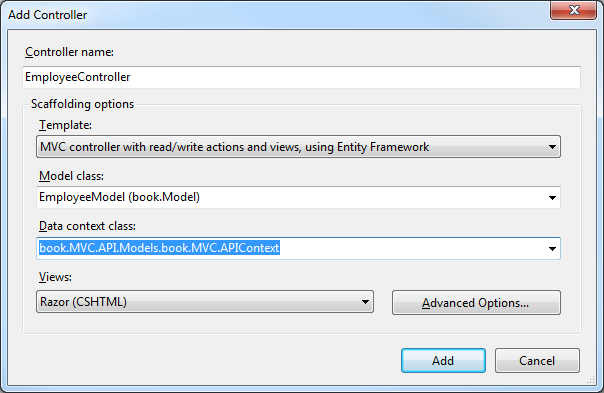

# 第七章思考工作

## 简介

反射是我们在运行时如何访问关于代码的元数据。这打开了一些奇妙的动态运行时可能性，但也可以利用它来创造一些令人兴奋的代码生成机会。

在本章中，我们将浏览现有的各种类型的元数据，展示这些元数据是如何组合在一起的。一旦我们完成了这个反射技术的调查，我们将把它和一个代码生成器联系在一起，这个代码生成器将加载一个程序集，并找到从 **`ApiController`** 派生的所有类型。对于这些类中的每一个，我们将找到暴露的动作，并使用 **`HttpClient`** 创建一个方法来自动调用该动作。

在本章中，我们将为一个名为 **`ReflectionHelper`** 的新类添加功能，我们可以用它来简化对反射数据的访问。在我们在第 4 章创建的 **T4Utilities** 项目中，继续创建一个名为 **`ReflectionHelper`** 的新类。

## 加载组件

加载程序集可能有点棘手。如果不小心，您可能会锁定试图加载的程序集。如果您正在思考由当前解决方案生成的程序集，那么每次运行模板时都必须关闭 Visual Studio，这可能会使您陷入困境。

我们有几个选择来避免这种情况。最直接的方法是将汇编的内容读入一个 **`Byte`** 数组，然后加载该数组。使用这种方法，没有要锁定的文件。我们可以在代码清单 54 中看到一个简单的实现。将以下方法添加到我们添加到 T4Utilities 项目的 **`ReflectionHelper`** 类中。

```cs
            public void LoadAssembly(AssemblyName assembly)
            {
               var url = new Uri(assembly.CodeBase);
               var bytes = File.ReadAllBytes(url.AbsolutePath);
               TargetAssembly = Assembly.Load(bytes);
            }
            public Assembly TargetAssembly {get;set;}

```

代码清单 57:加载没有锁定的程序集

**`AssemblyName`** 是 **`Reflection`** 命名空间中一个方便的对象，它简化了引用程序集的过程，并确保您引用的是正确的程序集。它可以这样初始化:

```cs
          var path = this.Host.ResolvePath (@"..\WebApi\bin\WebApi.dll");
          var name = System.Reflection.AssemblyName.GetAssemblyName(assemblyPath);

```

代码清单 58:初始化程序集名称

这种加载程序集的方法将确保您可以继续编译生成正在加载的程序集的代码，并使用该程序集重新运行模板，而不会相互冲突。

|  | 注意:这非常重要，因为没有什么比仅仅为了解锁程序集以便重新编译而必须退出并重新启动 Visual Studio 更令人沮丧的了。这是在更高版本的 Visual Studio 中得到极大增强的一个领域，在许多地方，Visual Studio 用于在幕后锁定程序集。但是从 Visual Studio 2013 开始，这应该是过去的事情了。任何锁定的程序集都应该是自己造成的，并且可以通过遵循这个简单的技巧来避免。 |

## 获取类型列表

在收集元数据以支持代码生成时，我们通常会对一个程序集中的多种类型感兴趣。这意味着我们将调用 **`GetTypes`** 来获取集合中的所有类型。根据您的元数据要求，您可能知道自己感兴趣的类型。如果是这种情况，可以调用 **`GetType`** 方法，该方法将返回单个 **`Type`** 对象。

|  | 提示:一般来说，对 GetTypes 进行一次调用比多次调用 GetTypes 更好。除非您对单一类型非常感兴趣，否则 GetTypes 可能是更好的选择。 |

获取类型列表非常简单:

```cs
                  private IList<Type> _cachedTypes;
                  public IList<Type> GetTypes()
                  {
                      if (_cachedTypes == null)
                          _cachedTypes = TargetAssembly.GetTypes().ToList();
                      if (_cachedTypes.First().Assembly != TargetAssembly)
                          _cachedTypes = TargetAssembly.GetTypes().ToList();
                      return _cachedTypes;
                  }

```

代码清单 59:获取类型列表

|  | 注意:缓存类型列表是为了提高性能。获取类型列表是一项相当昂贵的操作。如果 TargetAssembly 没有改变，就没有理由反复去通过构建这个列表的成本。 |

我们可以在此基础上，使用 **`Type`** 公开的任何方法或属性，通过对结果运行 LINQ 查询来简化一些常见的过滤器。

例如:

```cs
            public IList<Type> GetTypesInNamespace (string nameSpace)
            {
               return GetTypes()
                  .Where(t=>t.Namespace == nameSpace).ToList();
            }

```

代码清单 60:按名称空间过滤类型

或者

```cs
            public IList<Type> GetInterfaces()
            {
                return GetTypes()
                      .Where(t => t.IsInterface ).ToList();
            }

```

代码清单 61:获取所有接口

我们可以添加几个助手函数来提供更多选项:

```cs
            public bool HasBaseType (Type currentType, Type baseType)
            {
               return GetBaseClasses(currentType).Any(b => b == baseType);
            }  
            public List<Type> GetBaseClasses(Type type)
            {
               var allBases = new List<Type>();
               var derived = type;
               do
               {
                  derived = derived.BaseType;
                  if (derived != null)
                     allBases.Add(derived);
               } while (derived != null);
               return allBases;
            }

```

代码清单 62:确定一个类是否有特定的基类

**`GetBaseClasses`** 方法将遍历整个继承层次回到对象，并将其作为列表返回。 **`HasBaseType`** 将确定返回的物品是否与我们要找的物品匹配。

有了这些助手函数，我们现在可以包含一个类似这样的过滤器:

```cs

            public IList<Type > GetTypesDerivedFrom (Type baseType)
            {
               return GetTypes()
                   .Where(t=> HasBaseType(t, baseType)).ToList();
            }

```

代码清单 63:基于基类过滤类型

一旦我们加载了一个程序集，我们就可以很容易地获得所有类型，一个按名称排序的类型，或者一个按任意方式筛选的类型列表。

## 获取类型的属性

一旦我们确定了我们感兴趣的类型，我们就可以开始更多地了解该类型的成员。

同样，获取属性相当简单:

```cs
            public IList<PropertyInfo> GetProperties (Type name)
            {
               return name.GetProperties().ToList();
            }

```

代码清单 64:获取类型的属性

有一些内置的过滤器。NET 提供了直接通过 **`BindingFlags`** 即可以传递到 **`GetProperties`** 的方法。很快就会看到，这些 **`BindingFlags`** 可以传递到多个地方。

根据您的元数据要求，您可能需要不同的过滤器，但通常的做法是只返回在这种继承级别定义的公共属性。

```cs
            public IList<PropertyInfo> GetProperties (Type name)
            {
               return name.GetProperties(
                       BindingFlags.DeclaredOnly |
                       BindingFlags.Public |
                       BindingFlags.Instance).ToList();
            }

```

代码清单 65:向获取属性添加绑定标签

这将过滤属性，只返回在这个继承级别定义的非静态的公共属性。

## 获取类型的方法

获取类型中定义的方法与获取属性非常相似。

```cs
            public IList<MethodInfo> GetMethods(Type name)
            {
               return name.GetMethods(
                       BindingFlags.DeclaredOnly |
                       BindingFlags.Public |
                       BindingFlags.Instance)
                    .Where(m => !m.Name.StartsWith("get_")
                              && !m.Name.StartsWith("set_")).ToList();
            }

```

代码清单 66:获取包含绑定标志过滤属性的方法列表

我们正在使用前面看到的绑定标志，但是我添加了一个额外的过滤器。我们要去掉以**`get_`****`set_`**开头的方法。这些是为类型中的属性实现 getters 和 setters 的方法。一般来说，当我们处理方法时，我们对实现属性的方法不感兴趣。我们将在处理财产时处理这些方法。

方法也有几个有趣的属性值得探索: **`ReturnType`** 和 **`Parameters`** 。

我们可能要根据 **`ReturnType`** 这样过滤:

```cs
            public IList<MethodInfo> GetMethodsReturningVoid(Type name)
            {
               return GetMethods(name)name)
                    .Where(m=>m.ReturnType == typeof(void)).ToList();
            }
            }

```

代码清单 67:基于返回类型的过滤方法

或者，我们可能希望基于参数的某些属性进行过滤。

```cs
            public IList<MethodInfo> GetMethodsWithNoParameters(Type name)
            {
            return GetMethods( name ))
             .
             .Where(m => m.GetParameters().Count() == 0).ToList();
            }

```

代码清单 68:基于参数的过滤

## 获取类型、方法或属性的属性

**`GetCustomAttributes`** 法被定义为 **`MemberInfo`** 类的一部分。幸运的是，这恰好是类型、方法和属性的基类。我们可以很容易地编写一个方法来获取这些类型的自定义属性，如下所示:

```cs
            public IEnumerable<Attribute> GetAttributes(MemberInfo member)
            {
               var list = member.GetCustomAttributes(true).ToList();
               var returnValue = new List<Attribute>();
               foreach (var item in list)
               {
                  returnValue.Add(item as Attribute);
               }
               return returnValue;
            }

```

代码清单 69:获取属性

一旦我们有了这个属性列表，我们就可以定义一个方便的函数来轻松确定我们感兴趣的成员是否有特定的属性。

```cs
            public bool HasAttribute(MemberInfo member, string attr)
            {
               return GetAttributes(member)
                .Any(a => a.GetType().Name == attr);
            }

```

代码清单 70:检查成员是否有特定属性

现在我们有了方便的 **`HasAttribute`** 方法，我们可以针对属性或方法编写新的过滤器，考虑它们的自定义属性。

```cs
            public IList<PropertyInfo> GetRequiredProperties (Type member)
            {
               return GetProperties(member)
                .Where(p => HasAttribute(p, "RequiredAttribute")).ToList();
            }

```

代码清单 71:按属性过滤属性

这里需要记住的一个关键点是，即使我们想到了“必需”属性，这个属性的全称也是 **`“RequiredAttribute”`** 。

## 定义自定义属性

现在我们知道了如何访问程序集中的类型和类型的各种成员，以及这些成员的自定义属性，下一个问题是:“如何创建自己的自定义属性？”

这很简单。我们需要做的就是定义一个新的类，并从 **`System.Attribute`** 中派生出来。

让我们继续为我们的解决方案添加一个新项目，并将其命名为**书。模型**。让我们给这个项目增加一个新的类，叫做 **`HideMethodAttribute`** 。

将以下代码添加到 **`HideMethodAttribute`** :

```cs
          using System;

          namespace book.Models
          {

             [System.AttributeUsage(System.AttributeTargets.Method)]
             public class HideMethodAttribute : Attribute
             {
             }
          }

```

代码清单 72:定义简单属性

**`AttributeUsageAttribute`** 一开始可能会显得有些奇怪。它只是指示编译器该属性仅对方法有效。由于这个属性，如果你试图在其他地方使用它，你会得到一个编译错误。

属性的属性是添加到此类的简单属性，与任何其他属性一样定义，在应用时设置，并在代码生成期间访问。这是一个简单的属性。属性的解释和意义来自于当我们检测到属性已经被应用于一个方法时所做的事情。

## 齐心协力

回到我们一直在研究的解决方案，并添加一个新项目。这次，添加一个新的 MVC 网络应用编程接口项目。


图 12:添加一个网络应用编程接口项目

添加对**书的引用。我们在讨论创建自定义属性时创建的模型**项目。在这个项目中，让我们创建一个名为 **`EmployeeModel`** 的新类。

将以下代码添加到 **`EmployeeModel.cs`** :

```cs
          namespace book.Model
          {
            public class EmployeeModel
            {
              public int Id { get; set; }
              public string FirstName { get; set; }
              public string LastName { get; set; }
              public DateTime DateOfBirth { get; set; }
              public DateTime HireDate { get; set; }
              public DateTime LastReview { get; set; }
            }
          }

```

代码清单 73:雇员模型的一些常见属性

现在让我们回到网络应用编程接口项目，并基于这个模型创建一个控制器。



图 13:添加指定脚手架选项的控制器

在**脚手架选项**部分，我们可以指定**模板**；这是将用于生成控制器的 MVC 模板。我们将选择 **MVC 控制器读/写动作和视图**。我们还为实体框架指定了**模型类**和**数据上下文类**。在这种情况下，我们选择**创建一个新的**，并提示名称给它。

有了这些最少的信息，支架系统将生成完整的控制器和实体框架上下文。

让我们看看为控制器生成的代码。

```cs
          using System;
          using System.Collections.Generic;
          using System.Data;
          using System.Data.Entity;
          using System.Data.Entity.Infrastructure;
          using System.Linq;
          using System.Net;
          using System.Net.Http;
          using System.Web.Http;
          using System.Web.Http.Description;
          using book.MVC.API1.Models;
          using book.Model;

          namespace book.MVC.API1.Controllers
          {
           public class EmployeeController : ApiController
           {
            private ApplicationDbContext db = new ApplicationDbContext();

            // GET: api/EmployeeModels
            public IQueryable<EmployeeModel> GetEmployeeModels()
            {
            return db.EmployeeModels;
            }

            // GET: api/EmployeeModels/5
            [ResponseType(typeof(EmployeeModel))]
            public IHttpActionResult GetEmployeeModel(int id)
            {
            EmployeeModel employeeModel = db.EmployeeModels.Find(id);
            if (employeeModel == null)
            {
             return NotFound();
            }

            return Ok(employeeModel);
            }

            // PUT: api/EmployeeModels/5
            [ResponseType(typeof(void))]
            public IHttpActionResult PutEmployeeModel(int id, EmployeeModel employeeModel)
            {
            if (!ModelState.IsValid)
            {
             return BadRequest(ModelState);
            }

            if (id != employeeModel.Id)
            {
             return BadRequest();
            }

            db.Entry(employeeModel).State = EntityState.Modified;

            try
            {
             db.SaveChanges();
            }
            catch (DbUpdateConcurrencyException)
            {
             if (!EmployeeModelExists(id))
             {
              return NotFound();
             }
             else
             {
              throw;
             }
            }

            return StatusCode(HttpStatusCode.NoContent);
            }

            // POST: api/EmployeeModels
            [ResponseType(typeof(EmployeeModel))]
            public IHttpActionResult PostEmployeeModel(EmployeeModel employeeModel)
            {
            if (!ModelState.IsValid)
            {
             return BadRequest(ModelState);
            }

            db.EmployeeModels.Add(employeeModel);
            db.SaveChanges();

            return CreatedAtRoute("DefaultApi", new { id = employeeModel.Id }, employeeModel);
            }

            // DELETE: api/EmployeeModels/5
            [ResponseType(typeof(EmployeeModel))]
            public IHttpActionResult DeleteEmployeeModel(int id)
            {
            EmployeeModel employeeModel = db.EmployeeModels.Find(id);
            if (employeeModel == null)
            {
             return NotFound();
            }

            db.EmployeeModels.Remove(employeeModel);
            db.SaveChanges();

            return Ok(employeeModel);
            }

            protected override void Dispose(bool disposing)
            {
            if (disposing)
            {
             db.Dispose();
            }
            base.Dispose(disposing);
            }

            private bool EmployeeModelExists(int id)
            {
            return db.EmployeeModels.Count(e => e.Id == id) > 0;
            }
           }
          }

```

代码清单 74:生成的控制器代码

如您所见，该控制器包括每个 HTTP 动词**`GET`****`POST`****`PUT`**和 **`DELETE`** 的动作。

最好有一个代理类，通过使用通过 NuGet 提供的`Microsoft.Net.Http`包，使用 HttpClient 库自动调用这些方法。

让我们回到我们的解决方案，在书籍项目中，使用 NuGet 添加`Microsoft.Net.Http`包。


图 14:安装微软。Net.Http

现在，在图书项目中，我们想要创建一个新的文本模板，并将其命名为 **services.tt** 。

为了访问`book.WebApi`组件，我们需要向模板添加一些引用。

```cs
          <#@ assembly name="C:\Program Files (x86)\Reference Assemblies\Microsoft\Framework\.NETFramework\v4.5\System.Data.Entity.dll"#>
          <#@ assembly name="$(SolutionDir)book.Model\bin\debug\book.Models.dll" #>
          <#@ assembly name="$(SolutionDir)packages\EntityFramework.5.0.0\lib\net45\EntityFramework.dll" #>
          <#@ assembly name="$(SolutionDir)packages\Microsoft.AspNet.Mvc.4.0.30506.0\lib\net40\System.Web.Mvc.dll" #>
          <#@ assembly name="$(SolutionDir)packages\Microsoft.AspNet.WebApi.Core.4.0.30506.0\lib\net40\System.Web.Http.dll" #>
          <#@ assembly name="$(SolutionDir)T4Utilities\bin\Debug\T4Utilities.dll" #>

```

代码清单 75:服务所需的程序集引用

为了使代码简单一点，我们将添加一些基本的导入指令。

```cs
          <#@ import namespace = "T4Utilities" #>
          <#@ import namespace = "System.Web.Http" #>
          <#@ import namespace= "System.Web.Mvc" #>
          <#@ import namespace= "System.Reflection" #>

```

代码清单 76:服务需要的导入指令

现在，我们的指令的基础知识已经过时了，让我们考虑一下我们想要生成的类的类型。

让我们为找到的每个 API 动作生成一个带有方法的类。我们将从初始化我们的 **`ReflectionHelper`** 开始，然后输出一些样板代码:

```cs
          <#
           reflection = new ReflectionHelper();
           NamespaceName = "book";

          #>
          using System;
          using System.Collections.Generic;
          using System.Linq;
          using System.Net.Http;
          using System.Net.Http.Headers;
          using Newtonsoft.Json;
          using Newtonsoft.Json.Converters;
          namespace <#= NamespaceName #>
          {
           public class DataAPIServices
           {

          <#
           var path = this.Host.ResolvePath (@"..\WebApi\bin\WebApi.dll");
           OutputActionCalls(path);
          #>
           }
          }

```

代码清单 77:初始化服务模板

生成的大部分代码将是对我们在程序集中找到的各种操作的调用。

现在让我们把注意力转向模板的特征块。我们需要为之前初始化的模板定义一些属性，以及 **`OutputActionCalls`** 方法。

```cs
          <#+
           public ReflectionHelper reflection{get ; set;}
           public string NamespaceName {get; set;}
           public void OutputActionCalls(string assemblyPath)
           {
             var name = AssemblyName.GetAssemblyName(assemblyPath);
             reflection.LoadAssembly (name);
             var targetType= typeof (ApiController);
             var controllers= reflection.GetTypes()
                     .Where (t=> reflection.HasBaseType(t, targetType));
             foreach (var controller in controllers)
             {
                PushIndent("  ");
                this.WriteLine( CurrentIndent+"//" + controller.Name);
                var actions= reflection.GetMethods(controller);
                ProcessGetMethods(actions);
                ProcessPostMethods(actions);
                ProcessPutMethods(actions);
                PopIndent();
             }
             PopIndent();
           }

```

代码清单 78:输出调用方法

属性的定义就像任何其他属性一样， **`OutputActionCalls`** 相当简单。我们把大部分重担交给了 **`ReflectionHelper`** 。因为我们希望以不同的方式处理各种动作，所以我们将通过检查它们的属性来过滤它们，以查看哪些动作处理哪些动词。

|  | 注意:这确实需要更改由网络应用编程接口支架生成的代码。如果您不想进行这种更改，您还可以通过匹配方法上的命名约定来识别哪些动作与哪些动词相匹配。 |

让我们回到控制器和生成代码的一些动作选择器属性。因为这是从脚手架生成的，所以我们可以根据需要自由地更改这些代码——这总是一次性的代码生成。

| 动作选择器属性 |
| --- |
| HttpGetAttribute | 将对动作的访问限制为`HTTP GET`请求 |
| HttpPostAttribute | 将对动作的访问限制为`HTTP POST`请求 |
| HttpPutAttribute | 将对动作的访问限制为`HTTP PUT`请求 |
| HttpDeleteAttribute | 将对动作的访问限制为`HTTP DELETE`请求 |

让我们看看这些不同的处理方法。

```cs
           private void ProcessGetMethods(IList<MethodInfo> actions)
           {
              this.WriteLine(this.CurrentIndent + "// Get");
              foreach (var action in actions
                    .Where (a=>reflection
                           .HasAttribute(a, "HttpGetAttribute")))
              {
                  this.Write(CurrentIndent + "public " +
                  reflection.FormatType( action.ReturnType)+ " "
                             + action.Name);
                  var parameterString = reflection
                         .GetParameterString (action);
                  if (string.IsNullOrWhiteSpace(parameterString))
                        parameterString = " string url";
                  else
                        parameterString += ", string url";
                  this.WriteLine("(" + parameterString + ")");
                  this.WriteLine(CurrentIndent + "{");
          #>
            HttpClient client = new HttpClient();
            var response = client.GetAsync(url).Result;
            var data = JsonConvert.DeserializeObject<<#=reflection.FormatType(action.ReturnType)#>>(response.Content.ReadAsStringAsync().Result);
            return data;
          <#+
                  this.WriteLine(CurrentIndent + "}");
              }
           }

```

代码清单 79:支持过程方法

这个方法的实际实现不一定非常令人兴奋，但是有几件事需要注意。首先，我们调用以字符串形式获取参数，并希望为 URL 添加一个额外的参数。我们首先需要做一点条件逻辑来正确处理最初没有参数的情况。

另一个可能感兴趣的项目是使用 **`HttpClient`** 。对于每个动词，我们将调用对应于我们正在使用的动词的适当方法。这里，我们称之为 **`GetAsync`** 。对于 **`POST`** ，我们将称之为 **`PostAsJsonAsync`** 。对于 **`PUT`** ，我们称之为 **`PutAsJsonAsync`** ，对于 **`DELETE`** ，我们称之为 **`DeleteAsync`** 。

以下是此模板中定义的其余方法，供您参考:

```cs
           private void ProcessPostMethods(IList<MethodInfo> actions)
           {
              this.WriteLine(this.CurrentIndent + "// Post");
              foreach (var action in actions
                        .Where (a=>reflection.HasAttribute(a,
                               "HttpPostAttribute")))
              {
                 this.Write(CurrentIndent + "public "
                        + reflection.FormatType( action.ReturnType)+ " "
                        + action.Name);
                 var parameterString = reflection
                    .GetParameterString (action);
                 if (string.IsNullOrWhiteSpace(parameterString))
                     parameterString = " string url";
                 else
                     parameterString += ", string url";
                 this.WriteLine("(" + parameterString + ")");
                 this.WriteLine(CurrentIndent + "{");
          #>
            var client = new HttpClient();
            client.DefaultRequestHeaders.Accept.Add(
             new MediaTypeWithQualityHeaderValue("application/json"));
            var response = client.PostAsJsonAsync(url, <#=action.GetParameters()[0].Name #>).Result;
            return response;
          <#+
                 this.WriteLine(CurrentIndent + "}");
              }
           }

           private void ProcessPutMethods(IList<MethodInfo> actions)
           {
              this.WriteLine(this.CurrentIndent + "// Put");
              foreach (var action in actions
                       .Where (a=>reflection.HasAttribute(a,
                               "HttpPutAttribute")))
              {
                 this.Write(CurrentIndent + "public "
                        + reflection.FormatType( action.ReturnType)+ " "
                        + action.Name);
                 var parameterString= reflection
              .      GetParameterString (action);
                 if (string.IsNullOrWhiteSpace(parameterString))
                     parameterString = " string url";
                 else
                     parameterString += ", string url";
                 this.WriteLine("(" + parameterString + ")");
                 this.WriteLine(CurrentIndent + "{");
          #>
            var client = new HttpClient();
            client.DefaultRequestHeaders.Accept.Add(
             new MediaTypeWithQualityHeaderValue("application/json"));
            var response = client.PutAsJsonAsync(url, <#=action.GetParameters()[0].Name #>).Result;
            return response;
          <#+
                 this.WriteLine(CurrentIndent + "}");
              }
           }
          #>

```

代码清单 80:服务模板的支持过程方法

|  | 注意:这不是一个编写网络应用编程接口调用的指南。有关最佳实践和对网络应用编程接口的更好理解，请参考简明网络应用编程接口手册。这个例子的一个重要收获应该是，随着最佳实践的改进，修改模板以更改生成的代码是多么容易。 |

## 总结

在本章中，我们已经讨论了与通过反射访问数据相关的大多数主题。我们看到了如何在不锁定程序集的情况下加载它，并探索了如何获取和过滤该程序集中包含的类型。我们已经看到了一些简单的方法来格式化一些复杂类型的名称，以便它们在我们生成的代码中看起来很漂亮。

我们探索了检索和过滤代码生成中常用的基本类型组件。有类似的方法可以从类型中检索字段和事件。

在这一章中，我们已经看到了这一点。NET 为我们保存了大量关于正在运行的代码的信息。唯一的缺点是代码必须在通过反射获得这些信息之前编译。

在下一章中，我们将探索直接从源代码中检索类似信息的方法，而不必等待代码编译。