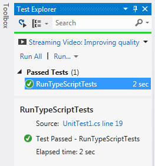

# 七、将TypeScript用于单元测试

## 用海啸测试

如果您想要一个用您正在编写的语言编写的单元测试框架，那么您可以选择 TypeScript。海啸测试框架被写成一个单一的模块，它有一个测试运行器、断言和轻量级的赝品。该项目已在 CodePlex 上发布，使用与 TypeScript 相同的 Apache 2.0 许可证。

[http://tsuit . code lex . com/](http://tsunit.codeplex.com/)

### 设置

设置海啸又快又容易。您实际上只需一个文件就可以开始使用它，但是我建议您从 CodePlex 上的**源代码**选项卡中获取以下三个文件:

*   tsUnit.ts
*   app.css
*   default.htm

*tsuit*文件是实际的单元测试框架； *app.css* 和*default.html*形成了一个很好的模板，用于在网络浏览器中显示测试结果。您可以将这些添加到任何 TypeScript 程序中来开始测试。

|  | 注意:海啸框架是完全自测试的，因此您可以在 Tests.ts 文件和 CodePlex 上故意失败的 BadTests.ts 文件中查看示例测试。 |

如果您在 TypeScript 程序中使用 CommonJS 或 AMD 模块，您将需要删除*文件中的封闭模块，如[第 5 章“加载模块”所述](05.html#sigil_toc_id_64)*

### 测试中的代码

为了演示海啸测试，我将使用以下示例模块，这是一个经典的测试示例，它采用两个数字并返回它们的总和。我用了一个简单的例子，这样你就可以花更多的时间思考测试，而花更少的时间研究这个例子是做什么的。

计算

```ts
    module Calculations {
        export class SimpleMath {
            addTwoNumbers(a: number, b: number): number {
                return a + b;
            }
        }
    }

```

`SimpleMath`类没有依赖关系，但是如果有，你可以创建测试替身来代替真实代码，使你的测试更加可预测。本章稍后我将回到测试双打的主题。

### 写海啸测试

为了测试`Calculations`模块，您需要引用或导入*计算*和*程序*。您的所有测试都分组在一个测试模块中。将单元测试组织成模块和类将它们排除在全局范围之外，并且还允许单元测试框架对一个类执行自动发现，以找到所有要运行的函数。这种结构类似于框架使用的风格，比如测试时的 MSTest 或 nUnit。NET 代码。

计算测试–空结构

```ts
    /// <reference path="Calculations.ts" />
    /// <reference path="tsUnit.ts" />

    module CalculcationsTests {

    }

```

从技术上来说，每个测试类都应该实现`tsUnit.ITestClass`接口，但是 TypeScript 足够聪明，可以将你写的任何类转换为空的`ITestClass`接口，所以不需要明确指定。你所需要做的就是提供一些函数，这些函数将会为你找到并运行。

计算测试–测试类别

```ts
    /// <reference path="Calculations.ts" />
    /// <reference path="tsUnit.ts" />

    module CalculcationsTests {
        export class SimpleMathTests {
            addTwoNumbers_3and5_8(context: tsUnit.TestContext) {
                // arrange
                var math = new Calculations.SimpleMath();

                // act
                var result = math.addTwoNumbers(3, 5);

                // assert
                context.areIdentical(8, result);
            }
        }
    }

```

我已经将测试类命名为`SimpleMathTests`，但是如果对特定的函数有很多测试，我有时会为每个被测试的函数编写一个单独的类。您可以从将您的测试添加到一般测试类开始，然后根据需要拆分它们。到目前为止，我只添加了一个测试，使用了罗伊·奥谢洛夫的命名约定*function name _ scenario _ experience*。

函数名`addTwoNumbers_3and5_8`告诉任何读取测试输出的人，测试正在调用一个名为“addTwoNumbers”的函数，参数为 3 和 5，并且正在测试结果为 8。当一个测试失败时，只要函数名是正确的，一个名称准确描述了被测试内容的测试函数是一个很大的帮助。

这个函数中唯一来自于海啸的特殊部分是参数:`context: tsUnit.TestContext`。当测试运行时，测试运行人员将通过一个`TestContext`类，该类包含可用于测试结果的函数，并且通过或未通过测试。这些大多是你自己编写代码的快捷方式。他们没有做任何神奇的事情，他们只是让你的测试更短，更容易阅读。我已经总结了本章后面提供的测试上下文断言。

测试函数是使用排列行为断言测试结构编写的，这也称为三 A 测试语法。

*   安排—执行设置测试所需的任务。
*   act—调用要检查的函数。
*   断言—检查结果是否符合您的预期。

有时使用安排行为断言注释来提醒你这个结构会有所帮助，直到它成为第二天性。注释没有任何特殊的含义，TypeScript 或海啸也不需要这些注释。

现在，您可以通过将测试类的一个实例传递给它，来注册您的测试。测试类中的所有函数都会被自动检测到。

```ts
    // Create an instance of the test runner.
    var test = new tsUnit.Test();
    // Register the test class.
    test.addTestClass(new CalculcationsTests.SimpleMathTests());
    // Run the tests and show the results on the webpage.
    test.showResults(document.getElementById('result'), test.run());

```

在本例中，您可以将这一部分添加到*计算测试*文件的末尾。在一个合适的 TypeScript 程序中，您会有许多测试模块，并将它们组成一个测试注册文件。

可以多次调用`addTestClass`函数，将所有的测试类添加到一个测试运行器实例中。我将在本章后面讨论一种组合模式，它将注册移动到每个测试模块，这使得注册更容易保持最新。

这个例子使用了默认的 HTML 输出，但是也可以使用海啸中的原始结果数据。这可以通过调用`run`函数并使用返回的`TestResult`类来记录错误，或者以自定义格式显示它们以在您的构建系统中使用来实现。

```ts
    var testResult = test.run();
    for (var i = 0; i < testResult.errors.length; i++) {
        var err = testResult.errors[i];
        console.log(err.testName + ' - ' + err.funcName + ' ' + err.message);
    }

```

### 运行测试

要在网络浏览器中运行这个测试，您可以使用标准的海啸 HTML 文件，并引用您的被测模块和测试模块。

default.html–测试主机

```ts
    <!DOCTYPE html>
    <html lang="en">
    <head>
        <meta charset="utf-8" />
        <title>tsUnit</title>
        <meta http-equiv="Content-Type" content="text/html; charset=utf-8">
        <link rel="stylesheet" href="app.css" type="text/css" />
    </head>
    <body>
        <div id="result">
            <h1>Awaiting result...</h1>
            <span>If this section doesn't update, check your console for errors!</span>
        </div>
        <script src="tsUnit.js"></script>
        <script src="Calculations.js"></script>
        <script src="CalculationsTests.js"></script>
    </body>
    </html>

```

当您在浏览器中打开此页面时，您应该会看到以下输出:


图 9:海啸测试报告

如果您没有看到测试结果，请确保您已经引用了所有需要编译的 JavaScript 文件:在这种情况下*Sunit . js*、 *Calculations.js、*和*calculation tests . js*。您还可以使用网络浏览器的错误控制台来跟踪任何错误。

当您向测试类添加额外的函数时，它们将自动出现在测试报告中。当测试失败时，它会显示在“错误”标题下，并附带测试失败的详细解释。

### 测试成分

出于相同原因而更改的代码应该放在同一个位置，在最初的例子中，如果一个新的测试类被添加到一个现有的测试模块中，将需要更改两个不同的代码文件。为了提高凝聚力，您应该将注册添加到您的测试模块中。通过注册模块中的类，您只需要编辑一个代码文件来添加一个新的测试类，并将其注册到测试运行程序中。

计算测试–作曲类

```ts
    module CalculcationsTests {
        export class Composer {
            static compose(test: tsUnit.Test) {
                test.addTestClass(new CalculcationsTests.SimpleMathTests());
            }
        }
        export class SimpleMathTests {
            addTwoNumbers_3and5_8(context: tsUnit.TestContext) {
                var math = new Calculations.SimpleMath();
                var result = math.addTwoNumbers(3, 5);
                context.areIdentical(8, result);
            }
        }
    }

```

`Composer`类有一个单一的静态方法，它接收一个测试运行器，并根据它注册测试类。它只注册模块中的测试类。

然后更新调用代码来调用编写器，而不是注册测试类。测试注册代码将在每个测试模块上调用一个编写器。

```ts
    // Create an instance of the test runner.
    var test = new tsUnit.Test();
    // Register the test class.
    CalculcationsTests.Composer.compose(test);
    // Run the tests and show the results on the webpage.
    test.showResults(document.getElementById('result'), test.run());

```

当您添加新的测试类或更改现有的测试类时，您不需要在测试模块之外进行任何更改。

计算测试–增加了测试类别

```ts
    module CalculcationsTests {
        export class Composer {
            static compose(test: tsUnit.Test) {
                test.addTestClass(new CalculcationsTests.SimpleMathTests());
                test.addTestClass(new CalculcationsTests.ComplexMathTests());
            }
        }
        export class SimpleMathTests {
            addTwoNumbers_3and5_Expect8(c: tsUnit.TestContext) {
                var math = new Calculations.SimpleMath();
                var result = math.addTwoNumbers(3, 5);
                c.areIdentical(8, result);
            }
        }
        export class ComplexMathTests {
            addThreeNumbers_3and5and2_10(context: tsUnit.TestContext) {
                var math = new Calculations.ComplexMath();
                var result = math.addThreeNumbers(3, 5, 2);
                context.areIdentical(10, result);
            }
        }
    }

```

### 测试上下文断言

测试上下文包含内置断言，以缩短您必须在测试中编写的代码。在下面的示例中，使用断言的代码比手动编写的代码短得多，并且非常容易理解。使用断言使您在确定测试结果时不太可能犯微妙的错误，例如使用`!=`代替`!==`，这可能会给您带来不正确的行为。生成的错误消息在使用`areIdentical`断言的版本中也要好得多。

```ts
    // with context.areIdentical(8, result);
     // without if (result !== 8) {
        throw new Error("The result was expected to be 8, but was " + result);
    }

```

为了充分利用断言，值得将下面的列表提交到内存中，即使在您键入代码时 TypeScript 会自动完成。了解哪些函数可用将有助于您在测试中选择最合适的检查来编写更简洁的代码。

同一的

`areIdentical`和`areNotIdentical`的函数测试类型和值的两个参数。这意味着“1 的字符串”将与数字 1 不匹配。要通过`areIdentical`测试，对于基本类型，值必须是相同的类型和相同的值，或者对于复杂类型，值必须是相同的对象实例。`areNotIdentical`断言则相反。

真或假

`isTrue`断言检查布尔参数为真，`isFalse`检查布尔参数为假。要检查不是布尔型，但在 JavaScript 中可以强制为真或假的其他类型，可以使用`isTruthy`和`isFalsey`。被视为虚假或类似虚假的值有:

*   空
*   不明确的
*   错误的
*   圆盘烤饼
*   Zero
*   ``''``

任何不在清单上的东西都是真实的。这可以让人措手不及，因为字符串``'false'`` 评估为类真，因为它不是空字符串。

投

`throws`断言以函数为参数。为了通过测试，函数必须在运行时引发错误。这个测试对于检查您的错误处理例程是否在应该出现错误的时候出现错误非常有用。传递给`throws`断言的函数通常只包含您预期会失败的调用。例如，如果`addTwoNumbers`函数不接受负数，您可以检查带有负数的函数调用是否会导致错误。

```ts
    addTwoNumbers_NegativeNumber_Error(context: tsUnit.TestContext) {
        var math = new Calculations.SimpleMath();

        context.throws(function () {
            math.addTwoNumbers(-1, 2);
        });
    }

```

如果对`addTwoNumbers`的调用抛出错误，测试通过，否则失败。

失败

`fail`断言只是强迫测试每次都失败。虽然这听起来没什么用，但是您可以使用这个断言来通过基于您自己的定制逻辑的测试。`fail`断言有时在编写测试时用作占位符，以防止意外的测试失败。例如，如果您正在安排测试，您可以在测试结束时放置一个`fail`断言，以确保它失败，这提醒您测试尚未完成。如果您没有这样做，并且忘记添加任何断言，测试将会给你错误的信心。

### 测试双打

为了保护您的单元测试不受其他模块变化的影响，您需要通过用测试替身替换掉真正的依赖来隔离您测试的类。这是中的常见做法。NET 使用内置的假货程序集，或一个模拟存储库，如 Rhino、Moq 或 nMock。

TypeScript 有一些智能特性，可以很容易地提供一个测试替身来代替真正的依赖。在使用为您提供一个框架之前，值得看一下手动双重测试。

```ts
    module Example {
        export class ClassWithDependency {
            constructor (private dep: MyDependency) {
            }

            exampleFunction() {
                return this.dep.functionOnDependency(2);
            }
        }
    }

    module Test {
        export class ExampleTests {
            testIsolation(context: tsUnit.TestContext) {
                var dependency: MyDependency = new MyDependency();
                var target = new Example.ClassWithDependency(dependency);

                var result = target.exampleFunction();

                context.areIdentical('Fake string', result);
            }
        }
    }

```

在这个例子中，`ClassWithDependency`类需要一个`MyDependency`的实例来工作，并且调用`functionOnDependency`作为`exampleFunction`的一部分。在测试中，我创建了一个真实的`MyDependency`的实例，但是这是有问题的，因为测试不再与依赖类的变化相隔离。单元测试应该只依赖于它测试的类；当它依赖于其他类时，它会使单元测试变得更加脆弱，因为对所有引用类的更改都可能需要对测试进行更改。你也会陷入长长的依赖链；例如，如果`MyDependency`依赖于另一个类，你也需要创建一个这样的类，以此类推。

为了解决这些问题，您可以创建一个测试替身来代替真正的依赖。你的双重测试也可以提供固定答案，让你的测试更容易预测。

```ts
    module Test {
        class MyTestDouble extends MyDependency {
            functionOnDependency(a: number): string {
                return 'Fake string';
            }
        }

        export class ExampleTests {
            testIsolation(context: tsUnit.TestContext) {
                var testDouble: MyDependency = new MyTestDouble();
                var target = new Example.ClassWithDependency(testDouble);

                var result = target.exampleFunction();

                context.areIdentical('Fake string', result);
            }
        }
    }

```

测试 double 只是一个类，它只在测试模块中可用，测试模块继承了您需要替换的类。函数的实现返回一个固定值，这使得测试更加可预测。

这种方法的一个缺点是，如果基类有构造函数，您将需要传入一个 TypeScript 可以与构造函数上的参数类型匹配的值。在大多数情况下，您应该能够使用``null`` 或`undefined`来打破依赖链，因为基类上的任何方法都不会被调用。这是不在构造函数中执行任何操作的一个很好的理由，因为构造函数将被调用。您还需要确保您的测试 double 实现测试运行时将调用的任何函数或变量。如果您遗漏了什么，它将在基类上被调用。

如果你正在基于一个接口创建一个双测试，你将需要实现所有的属性和方法，但是对于任何没有被使用的，请随意返回``null`` 或`undefined`，而不是浪费你的时间为所有的函数创建实现。

### 轻量级假货

现在，您已经看到了手动测试替身，您已经准备好用自动生成的假货替换它们了。

```ts
    module Test {
        export class ExampleTests {
            testIsolation(context: tsUnit.TestContext) {
                var fake = new tsUnit.Fake(new MyTestDouble());
                var testDouble = <MyDependency> fake.create();
                var target = new Example.ClassWithDependency(testDouble);

                var result = target.exampleFunction();

                context.areIdentical('Fake string', result);
            }
        }
    }

```

这个例子表明，您可以只使用两行代码创建一个测试 double，不管您需要伪造的真实类有多复杂。您不需要提供任何函数或变量，除非您需要测试 double 的特定行为。

## 在 Visual Studio 中运行测试

能够在浏览器中运行您的 TypeScript 测试是非常好的，但是理想情况下，您应该将它们作为正常测试运行的一部分。通过在. NET 单元测试中包装您的 TypeScript 测试，您可以在 Visual Studio 内部运行它们，并且还可以将它们包含在您的持续集成过程中。在这一节中，例子来自于 MSTest 和 MSBuild，但是同样的技术也适用于任何一个。NET 测试运行程序和构建引擎。

TypeScript测试将被编译成 JavaScript，单元测试将使用微软脚本引擎对这些 JavaScript 文件运行。测试不会在浏览器环境中运行。

### 单元测试项目

您可以将TypeScript测试添加到现有的单元测试项目中，或者创建一个新的单元测试项目。第一步是为 COM Microsoft Script Control 1.0 添加对单元测试项目的引用，该项目将使用 JScript(微软的 ECMAScript 实现)运行测试。


图 10:引用微软脚本控件

为了使脚本控制更容易使用，您可以使用斯蒂芬·沃尔特的``JavaScriptTestHelper`` 的改编版本。这个类处理您与脚本控件的所有交互。现在，您可以将它添加到您的单元测试项目中；长期来看，它属于所有单元测试项目都可以访问的地方。

```ts
    public sealed class JavaScriptTestHelper : IDisposable
    {
        private ScriptControl _scriptControl;
        private TestContext _testContext;

        public JavaScriptTestHelper(TestContext testContext)
        {
            _testContext = testContext;
            _scriptControl = new ScriptControl()
            {
                Language = "JScript",
                AllowUI = false
            };
            LoadShim();
        }

        public void LoadFile(string path)
        {
            _scriptControl.AddCode(File.ReadAllText(path));
        }

        public void ExecuteTest(string testMethodName)
        {
            dynamic result = null;
            try
            {
                result = _scriptControl.Run(testMethodName, new object[] { });
            }
            catch
            {
                RaiseTestError();
            }
        }

        public void Dispose()
        {
            _scriptControl = null;
        }

        private void RaiseTestError()
        {
            var error = ((IScriptControl)_scriptControl).Error;
            if (error != null && _testContext != null)
            {
                _testContext.WriteLine(String.Format("{0} Line: {1} Column: {2}",
                    error.Source, error.Line, error.Column));
            }
            throw new AssertFailedException(error.Description);
        }

        private void LoadShim()
        {
            _scriptControl.AddCode(@"
                var isMsScriptEngineContext = true;
                var window = window || {};
                var document = document || {};");
        }
    }

```

一旦这两个项目被添加到项目中，您就可以将它们付诸行动了。我个人更喜欢在一个单独的。NET 单元测试。如果有任何一个测试失败了，这个错误足够描述性地告诉你哪一个失败了；如果你把它们分成多个。NET 单元测试，您创建了额外的工作，将新的 TypeScript 测试映射到右边。NET 测试。

### 引用脚本文件

虽然可以使用相对路径遍历出测试项目并进入包含 TypeScript 文件的项目，但是在作为持续集成构建的一部分运行测试时，这样做可能会很脆弱。一个更好的机制是将编译后的 JavaScript 文件作为链接文件添加到您的测试项目中，并将它们设置为始终复制。

1.  给你的单元测试项目添加一个名为**references scripts**的新文件夹。
2.  右键点击文件夹，选择**添加**，然后点击**已有项目**。
3.  将文件类型过滤器更改为**所有文件**。
4.  浏览到包含您的 TypeScript 和 JavaScript 文件的文件夹。
5.  选择用于测试的编译后的 JavaScript 文件、您正在测试的模块以及运行它们的测试模块。
6.  打开**添加**菜单，选择**添加为链接**。

JavaScript 文件现在将列在**参考脚本**文件夹中。选择所有选项并更改其属性，将**复制到输出目录**设置为**始终复制**。

这将导致脚本文件在构建时被放置在测试项目的 bin 目录中。当您在构建系统下运行时，这是必需的，因为它可能在一个特殊的目录结构中构建您的项目，并且相对路径会被破坏。

### 调整TypeScript测试

当您的测试在微软脚本控件下运行时，没有浏览器窗口或文档，所以您将希望捕获结果并使用它来通过或失败测试，而不是使用TypeScript HTML 输出。

您不需要重写您的测试来使它们工作，因为``JavaScriptTestHelper`` 包含一个垫片，它通知脚本它正在无浏览器的上下文中运行。在本书的前面，测试文件的最后几行叫做海啸，是这样的:

```ts
    // Create an instance of the test runner.
    var test = new tsUnit.Test();
    // Register the test class.
    CalculcationsTests.Composer.compose(test);
    // Run the tests and show the results on the webpage.
    test.showResults(document.getElementById('result'), test.run());

```

要使这一点同时适用于海啸跑者和微软脚本控制跑者，您可以更改此代码，根据``JavaScriptTestHelper`` 传递的`isMsScriptEngineContext`标志进行切换。

```ts
    class TestRunner {
        private test: tsUnit.Test;
        constructor() {
            this.test = new tsUnit.Test();
            CalculcationsTests.Composer.compose(this.test);
        }
        runInBrowser() {
            this.test.showResults(document.getElementById('results'), this.test.run());
        }
        runInScriptEngine() {
            var result = this.test.run();
            if (result.errors.length > 0) {
                var message = '';
                for (var i = 0; i < result.errors.length; i++) {
                    var err = result.errors[i];
                    message += err.testName + ' ' +
                        err.funcName + ' ' +
                        err.message + '\r\n';
                }
                throw new Error(message);
            }
        }
    }

    declare var isMsScriptEngineContext: bool;

    var testRunner = new TestRunner();
    if (!isMsScriptEngineContext) {
        testRunner.runInBrowser();
    }

    function getResult() {
        testRunner.runInScriptEngine();
    }

```

当您在浏览器中运行时，它将像以前一样显示结果，但是当。NET 单元测试运行时，输出将由`runInScriptEngine`功能中的代码控制。如果测试失败，这个函数会将完整的错误消息转发给。NET 测试。

### 创建单元测试

拼图的最后一块是。NET 测试方法。

```ts
    [TestClass]
    public class TypeScriptTests
    {
        private TestContext _context;

        public TestContext TestContext
        {
            get { return this._context; }
            set { this._context = value; }
        }

        [TestMethod]
        public void RunTypeScriptTests()
        {
            var runner = new JavaScriptTestHelper(_context);

            // Load JavaScript files.
            runner.LoadFile("ReferenceScripts\\tsUnit.js");
            runner.LoadFile("ReferenceScripts\\Calculations.js");
            runner.LoadFile("ReferenceScripts\\CalculationsTests.js");

            // Execute JavaScript test.
            runner.ExecuteTest("getResult");
        }
    }

```

当您运行测试时，``TypeScriptTests`` 测试类将与您的其他测试无法区分。如果有问题，它会用完整的细节报告任何测试失败，如果测试通过，会有一个大的绿色勾号。



图 11:测试浏览器

当您的持续集成构建运行时，它将能够像任何其他测试一样运行这些测试，并且您应该可以使用. NET 的任何流行单元测试框架获得类似的结果

## 用 JavaScript 框架进行测试

您可以使用任何现有的 JavaScript 单元测试框架在 TypeScript 中编写测试。您可能需要查找或编写环境声明来获得类型检查和编译警告，这是您使用海啸免费获得的。您可能还会发现，由于一些单元测试框架过多地增加了全局范围，导致了一些命名冲突；例如，qUnit 在全局范围内有一个名为 module 的函数，这与 TypeScript 中的保留字冲突。我在[附录 C“外部资源”中列出了一些 JavaScript 单元测试框架的链接](11.html#sigil_toc_id_111)