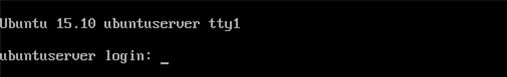

# 三、启动Ubuntu 服务器

一旦电脑开机或重启，就会加载 Ubuntu Server。执行一系列任务后，将出现登录屏幕。



图 27: Ubuntu 服务器登录屏幕

必须输入安装期间选择的用户名和密码，才能启动 Ubuntu 服务器会话。会话开始时，屏幕上会出现命令提示符。


图 28: Ubuntu 服务器命令提示符

命令提示符有以下几个部分:用户名、`@` (at)符号、安装过程中给计算机的主机名、工作目录(在本例中是主目录，用~符号表示)和美元符号(`$`)，表示非根用户登录。光标位于末端出现的`$`符号之后，等待用户输入命令。一些概念，如主目录或非根用户，将在后面解释。

## 苏多命令

安装 Ubuntu 服务器时，会提供用户名和密码，以便在安装后登录会话。此用户帐户缺乏管理权限，因此任何执行需要这些权限的命令的尝试都将被拒绝。但是如果必须完成一项管理任务呢？`sudo`命令来了，拯救世界！

`sudo`代表“超级用户 do”，一般读作“苏面团”当用户在任何命令前面加上`sudo`时，它将以提升的权限运行。执行某些管理任务(如关闭或重新启动计算机)需要提升的权限。

对于那些习惯于 Windows 的人来说，`sudo`非常类似于 WUAC (Windows 用户帐户控制)对话框，当你尝试做任何重要的事情时都会弹出这个对话框。该对话框询问用户是否希望继续，如果回答为“是”，则执行任务。

Ubuntu 中的故事更具戏剧性；没有适当的许可，事情可能会变得非常奇怪。配置文件可能无法正确保存，或者以前安装的程序可能只是拒绝运行，但需要做的只是请求许可。这时`sudo`命令开始生效。

当用户试图发出以下命令时:

代码清单 1

```
  $ reboot

```

该命令失败，引用为:“必须是超级用户。”在这种情况下，超级用户指的是根用户，拥有执行任何任务的所有必要权限。为了避免这种失败，使用了`sudo`命令，如下面的代码片段所示。

代码清单 2

```
  $ sudo reboot

```

`sudo`询问当前用户密码，如果提供正确，则执行指示的命令。

|  | 注意:出现在这里并将出现在每个给定示例中的$符号指的是 Ubuntu Server 命令提示符。用户在输入命令时不必键入。 |

### 为什么苏多更好？

`sudo`是获得提升权限的最佳和最安全的方式，因为用户不需要知道根密码。每次执行`sudo`时，都需要用户的密码。

让我们看看另一种做事方式。切换用户命令`su`会询问使用电脑的人根密码。然后，它给那个人一个超级用户提示，由`#`符号标识。`#`符号的意思是“危险！您以 root 用户身份登录！”这个人发出的第一个命令可能会顺利。但是他们的遗忘会导致他们以 root 身份登录。一个错别字，然后砰！整个硬盘被删除，而不是下载的假文件。有了`sudo`，每次发出命令，那个人都要进入`sudo`。因此，他们不必记得切换回常规用户模式，事故会更少。

### sudoers 文件

该文件控制谁可以使用`sudo`命令获得提升的权限。一般位于 **/etc/sudoers** 。编辑该文件的最佳和最安全的方法是使用以下命令。

代码清单 3

```
  $ sudo visudo -f /etc/sudoers

```

该命令将以提升的权限启动 VI 编辑器，以便用户可以编辑并保存文件。编辑器还会在 sudoers 文件上设置一个文件锁，在保存之前避免被任何人编辑。此外，在保存文件之前，编辑器将解析它，寻找简单的错误。

默认情况下，`visudo`命令将编辑/etc/sudoers，因此下面的示例对编辑该文件也有效。

代码清单 4

```
  $ sudo visudo

```

默认 sudoers 文件被配置为授予超级用户(root)和组管理员的所有成员提升的权限。此外，sudo 组的所有成员都可以执行任何命令。管理员和 sudo 组之外的任何用户都不能使用`sudo`命令来获得提升的权限。下图显示了该默认配置。


图 sudoers 默认文件

sudoers 文件由别名(基本上是变量)和用户规范组成，它们控制谁可以运行什么。

别名

别名有四种:`User_Alias`、`Runas_Alias`、`Host_Alias`、`Cmnd_Alias`。别名定义必须使用以下形式存储在文件中。

代码清单 5

```
  Alias_Type NAME = item1, item2…

```

`Alias_Type`为`User_Alias`、`Runas_Alias`、`Host_Alias`或`Cmnd_Alias`之一。名称是由大写字母、数字和下划线组成的字符串，以大写字母开头。相同类型的几个别名可以放在一行上，方法是用冒号(`:`)分隔，使用以下形式。

代码清单 6

```
  Alias_Type NAME1 = item1,
  item2… : NAME2 = item3

```

用户别名

用户别名允许您指定用户组。可以声明用户名、系统组(以`%`为前缀)和网络组(以`+`为前缀)，如下例所示。

代码清单 7

```
  # Everybody in the system group
  "admin" is covered by the alias ADMINS
   User_Alias ADMINS = %admin
   # The users "tom",
  "dick", and "harry" are covered by the USERS alias
   User_Alias USERS = tom, dick,
  harry
   # The users "tom"
  and "mary" are in the WEBMASTERS alias
   User_Alias WEBMASTERS = tom,
  mary
   # You can also use "!" to exclude
  users from an alias
   # This matches anybody in the
  USERS alias who isn't in WEBMASTERS or ADMINS aliases
   User_Alias LIMITED_USERS =
  USERS, !WEBMASTERS, !ADMINS

```

Runas aliases(别名)

Runas 别名几乎与用户别名相同，但是您可以通过用户标识(uid)指定用户。例如:

代码清单 8

```
  # Note the hash (#) on the
  following line indicates a uid, not a comment.
  Runas_Alias ROOT = #15
  # This is for all the admin
  users similar to the User_Alias of ADMINS set
  earlier 
  # with the addition of
  "root"
  Runas_Alias ADMINS =
  %admin, root

```

在前面的例子中，UID 15 被指定为`ROOT`别名的成员。然后用管理组和根用户定义一个别名`ADMINS`。假设 sudoers 文件有一个命令定义，其中一个或多个命令需要以超级用户权限执行，并且该定义为两个别名(`ROOT`和`ADMINS`)授予这些权限，UID 为 15 的用户将获得超级用户权限。

主机别名

主机别名是主机名、IP 地址、网络和网络组的列表(前缀为`+`)。如果网络未指定网络掩码，匹配时将使用主机以太网接口的网络掩码。

代码清单 9

```
  # This is all the servers present in
  the network
   Host_Alias SERVERS =
  192.168.0.1, 192.168.0.2, server1
   # This is the whole network
   Host_Alias NETWORK =
  192.168.0.0/255.255.255.0
   # And this is every machine in the network that is not a server
   Host_Alias WORKSTATIONS =
  NETWORK, !SERVER
   # This could have been done in
  one step with 
   # Host_Alias WORKSTATIONS =
  192.168.0.0/255.255.255.0, !SERVERS
   # But this method may be clearer.

```

命令别名

命令别名是命令和目录的列表。您可以使用它来指定一组命令。如果您指定一个目录，它将包括该目录中的任何文件，但不包括任何子目录。

代码清单 10

```
  # All the shutdown commands
   Cmnd_Alias
  SHUTDOWN_CMDS = /sbin/poweroff, /sbin/reboot, /sbin/halt
   # Printing commands
   Cmnd_Alias PRINTING_CMDS =
  /usr/sbin/lpc, /usr/sbin/lprm
   # Admin commands
   Cmnd_Alias ADMIN_CMDS =
  /usr/sbin/passwd, /usr/sbin/useradd, /usr/sbin/userdel, /usr/sbin/usermod,
  /usr/sbin/visudo
   # Web commands
   Cmnd_Alias WEB_CMDS =
  /etc/init.d/apache2

```

用户规格

用户规范是 sudoers 文件设置谁能作为谁来运行什么的地方。这是文件的关键部分，所有的别名都是为此而设置的。如果这是一部电影，那么在气候结束前的荣耀揭幕中，故事的所有关键线索都汇聚在这里。基本上，这很重要，没有这一点，文件中的任何预先设置都没有意义。

用户规范采用以下格式:

代码清单 11

```
<user list> <host list> = <operator list> <tag list>: <command list>

```

用户列表是已经设置的用户或用户别名的列表，主机列表是主机或主机别名的列表，操作员列表是他们必须作为或`Runas_alias`运行的用户的列表，命令列表是命令或`Cmnd_alias`的列表。

标签列表允许您为每个命令设置特殊的东西。`PASSWD`和`NOPASSWD`子句可以用来指定用户是否必须输入密码。`NOEXEC`还可以用来阻止任何程序自己启动 shell(一旦一个程序以`sudo`作为 root 运行，它就拥有完全的 root 权限，因此它可以启动一个 root shell 来规避 sudoers 文件中的任何限制)。

例如:

代码清单 12

```
  # This lets the webmasters run
  all the web commands on the machine 
  # "webserver"
  provided they give a password
  WEBMASTERS webserver= WEB_CMDS
   # This lets the admins run all
  the admin commands on the servers
   ADMINS SERVERS= ADMIN_CMDS
   # This lets all the USERS run admin commands on the workstations
  provided 
   # they give the root password
  or an admin password (using "sudo -u <username>")
   USERS WORKSTATIONS=(ADMINS)
  ADMIN_CMDS
   # This lets "harry"
  shut down his own machine without a
  password
   harry harrys-machine= NOPASSWD: SHUTDOWN_CMDS
   # And this lets everybody
  print without requiring a password
   ALL ALL=(ALL) NOPASSWD:
  PRINTING_CMDS

```

无密码关闭计算机

每次使用`sudo`发出关机命令，都需要当前用户的密码才能执行。这对服务器管理员来说可能很烦人。有一种方法可以防止关闭命令的密码要求，这是通过编辑 sudoers 文件来实现的。

出于安全原因，建议制作默认 sudoers 文件的备份副本。以下命令可以完成这项任务。

代码清单 13

```
  $ sudo cp
  /etc/sudoers /etc/sudoers.bak

```

`cp`是复制文件或目录的命令。在这种情况下，默认 sudoers 文件的副本将存储在 **sudoers.bak** 中。当`cp`试图复制 sudoers 文件时，`sudo`命令用于避免“拒绝访问”错误。

|  | 注意:第一次发出 sudo 命令时，Ubuntu 会询问登录用户的密码。之后，下一次执行 sudo 时，sudo 不会再询问用户密码，直到 15 分钟后。可以使用 sudoers 文件中的 timestamp_timeout 选项来更改此行为(例如，timestamp_timeout = 3 会将超时时间缩短为三分钟)。 |

以下命令将打开文件进行编辑。

代码清单 14

```
  $ sudo visudo 

```

visudo 编辑器中有两种模式:命令模式，按 Esc 键进入，插入模式，按 I 键进入。用户总是在其中之一。

要在 sudoers 文件中移动，用户必须按下 ESC 键，并使用箭头键将光标放在需要进行更改的地方。然后，按下 I 键将把 visudo 切换到插入模式，在该模式下可以输入文本。

首先，需要创建一个`Cmnd_Alias`，以指定关闭计算机时必须考虑哪些命令。

代码清单 15

```
  #Add this line below "# Cmnd alias
  specification" section
  Cmnd_Alias SHUTDOWN_CMDS =
  /sbin/poweroff, /sbin/halt, /sbin/reboot

```

在上例中，创建了一个`SHUTDOWN_CMDS`别名。它对命令`poweroff`、`halt`和`reboot`进行分组，这些命令位于/sbin 目录中并执行关闭计算机的所有操作。

然后，必须创建用户规范以将`SHUTDOWN_CMDS`分配给负责服务器管理的用户。

代码清单 16

```
  #Add this after the "%admin ALL = (ALL) ALL" line
  <username> ALL=(ALL) NOPASSWD:
  SHUTDOWN_CMDS

```

在这种情况下，`<username>`必须替换为负责服务器管理的人员的用户名。该规范指出，每次`sudo`试图执行来自`SHUTDOWN_CMDS`别名的任何命令，并且用户名对应于服务器管理员时，将不需要密码。

一旦添加了前面的行，sudoers 文件应该如下图所示。


图 30:编辑后的 sudoers 文件

要保存所有更改，请按 Esc 键进入命令模式。然后，键入 **:w** ，按回车键将更改保存到磁盘。要退出 visudo，请键入 **:q** 并按回车键。打字**:问！**按回车键将退出 visudo，不保存任何更改。

此时，如果您使用`SHUTDOWN_CMDS`别名中指定的任何一个发出`sudo`命令，您将无需提供密码，该命令将按预期执行。

要关闭计算机服务器管理员，您可以键入以下内容:

代码清单 17

```
  $ sudo poweroff

```

|  | 提示:在对任何文件进行修改之前，都应该对其进行备份。 |

本章开头显示了关于登录 Ubuntu 服务器的描述。本章的其余部分集中在`sudo`命令是如何工作的。`sudo`是 Ubuntu 中最重要的命令，用于授予随其执行的任何命令超级用户权限。这是执行管理任务的最佳选择，因为每次此类任务结束执行时，`sudo`都会撤销提升的权限，并将系统恢复到正常用户状态。这迫使每个行政命令都使用`sudo`，帮助您避免致命事故。使用`sudo`命令时，系统会要求输入当前用户密码。可以使用 sudoers 文件修改此行为。sudoers 文件告诉`sudo`命令哪些用户可以获得超级用户权限，在某些情况下，某些命令必须如何执行，由谁执行。本章以一个例子结束，解释了如何通过`sudo`命令在没有密码请求的情况下关闭计算机。