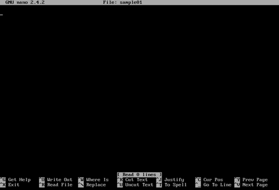

# 四、管理文件和目录

管理文件系统可能是用户需要的最基本的技能，以便了解周围的情况以及登录时如何管理它。此时，控制操作系统的所有任务都已从命令行完成。因此，本章试图让用户了解基础知识。

与任何其他操作系统一样，存储在磁盘中的每个文件或目录都必须用一个名称来标识。在 Ubuntu 服务器中，根据最佳文件命名实践，每个文件或目录的名称应符合以下规则，以确保跨平台操作:

*   所有文件或目录名都区分大小写。因此，名为*位置*的文件不同于名为*位置*的文件。
*   大小写字母、数字和点号(。)和下划线(_)符号。
*   可以用空格，但最好避开。
*   扩展名可用于识别类似的文件。这个扩展名放在文件名之后，前面有一个点(。)
*   文件或目录的名称最长可以是 255 字节。
*   文件名在其目录中必须是唯一的。
*   文件名中应避免下列字符:/ < > | : & *？

本节显示了基本命令，这些命令允许用户知道它们在文件系统中的确切位置，以及如何在文件系统中移动。

一旦用户登录到服务器，他或她通常会被放入用户的主目录，因为这是用户拥有完全控制权的位置。如果用户的主目录不存在，用户将被放入根目录(/)中。

要找出主目录与文件系统其余部分的关系，必须发出以下命令。

代码清单 18

```
  $ pwd

```

然后，操作系统将返回如下内容:

`/home/ubuntu-user`

主目录以用户账号命名，存储在名为 **/home** 的目录中。对于前面的例子，操作系统返回的名称表示登录的用户名为 **ubuntu-user** 。

### 显示目录的内容

要显示目录的内容，请键入`ls`命令，如下例所示。

代码清单 19

```
  $ ls /usr/share

```

操作系统将返回一个包含 **/usr/share** 目录内容的列表，这些内容可以是文件、包含在其中的其他目录或两者的组合。对于前面的示例，内容可以如下所示显示。

代码清单 20

| adduser | 格罗夫 | PAM-configs(PAM-配置文件) |
| 应用程序 | 食物 | 实际抽取与汇报语言 |
| 幻像 | grub-gfxpayload-list | perl5 |
| 应用程序 | 硬件抽象层（Hardware Abstract Layer 的缩写） | 像素地图 |
| 恰当的 | i18n | pkgconfig |
| 才能 | 核标准情报中心 | 波克士一号 |
| apt-xapian 索引 | 信息 | 人气竞赛 |
| 。。。 |  |  |

前面的列表只显示了文件或目录的名称。如果需要关于目录内容的更多信息，您必须使用`–l`标志。

代码清单 21

```
  $ ls /usr/share -l

```

获得的列表显示了大量信息，可能看起来像下面的示例。

代码清单 22

```
  total 440
  drwxr-xr-x   2 root
  root  4096 Apr 17  2014 adduser
  drwxr-xr-x   2 root
  root  4096 Sep 24 19:11 applications
  drwxr-xr-x   6 root
  root  4096 Oct  9 18:16 apport
  drwxr-xr-x   3 root
  root  4096 Apr 17  2014 apps
  drwxr-xr-x   2 root
  root  4096 Oct  9 18:15 apt
  drwxr-xr-x   2 root
  root  4096 Apr 17  2014 aptitude
  drwxr-xr-x   4 root
  root  4096 Apr 17  2014 apt-xapian-index
  drwxr-xr-x   2 root
  root  4096 Apr 17  2014 awk
  . . .

```

第一块描述文件类型和权限。后面的每一列用空格分隔，描述所有者、组所有者、项目大小(以字节为单位)、上次修改日期和时间以及项目名称。对于前面的例子，第一个块开头的`d`表示“目录”如果列出了普通文件，该字符可以是破折号(`-`)。下表显示了可用的文件类型。

*   `d`:目录；存放其他文件或目录的容器。
*   `l`:符号链接；重定向到另一个文件或目录的指针。
*   `p`:命名管道；文件系统上没有内容的文件的特殊实例。
*   `s`:插座；一种特殊的文件类型，允许使用文件系统的访问控制保护进行进程间联网。
*   `b`:闭塞装置；标识存储设备的名称(例如，硬盘 0 的/dev/sda)。
*   `c`:字符装置；一种特殊文件，提供对硬件设备的无缓冲直接访问(例如，正在运行的终端的`/dev/input/tty`)。

#### Ubuntu 中的文件权限

`ls`命令的`–l`标志在返回的每个项目的开头显示一个 10 个字符的块。第一个字符表示文件类型，如目录(`d`)或普通文件(`-`)。其他九个字符指的是该文件的权限。这些字符可以分成三个块。每个块指示按顺序授予文件“所有者”、“组”和“其他”用户哪些权限。表 4 给出了这类用户的解释。

表 Ubuntu 中的用户类型

| 用户类型 | 描述 |
| --- | --- |
| 物主 | 文件或目录所有者的用户名。默认情况下，创建文件或目录的用户将成为其所有者。 |
| 组 | 拥有文件或文件夹的用户组。与创建文件或目录的用户属于同一组的所有用户将对该文件或文件夹拥有相同的访问权限。 |
| 其他的 | 不是文件或目录所有者并且不属于文件或文件夹所属组的用户。 |

关于文件权限，有三种类型:

表 Ubuntu 中的权限类型

| 权限类型 | 描述 |
| --- | --- |
| r | 用户可以读取文件或目录。 |
| w | 用户可以写入、覆盖、追加或删除文件或目录。 |
| x | 用户可以“运行”文件。例如，脚本或程序。 |

如果`ls`命令显示的列表中的某个项目显示了类似`drwxr-xr-x`的块，则表示该项目是一个目录(`d`)，拥有所有者的读取(`r`)、写入(`w`)和执行(`x`)权限；本例中的组拥有读取(`r`)和执行(`x`)权限，其他用户也拥有读取(`r`)和执行(`x`)权限。

#### 通配符

通配符用于添加显示目录内容的条件。Ubuntu 中使用了以下通配符:

*   星号(`*`):用于表示任何字符出现 0 次或更多次，从出现星号的点开始。例如，如果用户输入`lop*`，这意味着所有名称以 *lop* 开头的文件或目录都将被考虑，无论 lop 后出现哪些字符。
*   问号(`?`):用于表示单个未知字符出现的位置。例如，如果用户输入`mem*.tx?`，这意味着所有名称以 *mem* 开头的文件，无论哪个字符出现在点之前，扩展名以 *tx* 开头的文件，无论哪个字符出现在 *x* 之后，都将被考虑。
*   括号(`[]`):用于指定范围。例如，如果用户想要列出所有以图像和 10 到 30 之间的数字开头的 JPG 文件名，则应在`ls`命令后输入`image[10-30].jpg`。
*   花括号(`{}`):用于分隔术语，此时每个术语必须是某物的名称或通配符。例如，如果用户在`ls`命令后输入`{*.pdf,*.png}`，将列出所有扩展名为 *pdf* 或 *png* 的文件。

要在文件系统中移动，用户需要将当前位置(通常是主目录)更改为系统中存在的任何其他位置。这可以使用`cd`命令来完成。在下面的例子中，用户移动到 **/bin** 目录。

代码清单 23

```
  $ cd /bin

```

上例中提供的目录名被称为*绝对路径*。在 Ubuntu 中，每个文件和目录都在最上面的目录下，这被称为“根目录”。该目录由单个前导正斜杠(`/`)引用。绝对路径指向目录相对于最顶层目录的位置。这避免了在引用文件系统中任何位置的目录时出现不明确的引用。

另一种选择是使用*相对路径*。这些指的是与当前目录(用户所在的目录)相关的目录。相对路径的使用使得导航更加容易，尤其是当目录在层次结构上接近时。在相对路径中，当前目录中的任何目录都可以通过名称引用，而无需前导正斜杠。假设用户在`/usr/share`目录中，并且其中存在一个“地区”目录，以下命令将位置更改为地区目录。

代码清单 24

```
  $ cd locale

```

同样，通过提供当前目录之后的路径部分，可以使用相对路径移动到多个目录级别。同样，假设用户在`/usr/share`目录中，并且一个`docs`目录存在于一个公共目录中，那么可以通过键入以下命令来更改该目录。

代码清单 25

```
  $ cd common/docs

```

移动到与其层次结构相关的上一个目录也是可能的。这个目录叫做*父目录*。以下命令将当前位置更改为父目录。

代码清单 26

```
  $ cd ..

```

`cd`命令后的双点指示器指的是父目录。另一个特殊的指标是单点，指的是当前目录。

最后，在不提供目录名的情况下发出`cd`命令会将用户带回主目录。

代码清单 27

```
  $ cd

```

与一些操作系统相反，Ubuntu 和其他类似 Unix 的操作系统在系统的大部分时间里依赖纯文本文件。本节讨论查看这些文件的不同方法。

查看文件的一种方法是使用`less`命令。这个命令被称为“传呼机”，因为它允许用户滚动文件的页面。与前面讨论的命令不同，这些命令在执行后立即返回命令行，`less`是一个应用程序，它将继续运行并占据屏幕，直到用户退出。

要打开`/etc/services`文件，这是一个系统知道的带有服务信息的配置文件，必须发出以下命令。

代码清单 28

```
  $ less
  /etc/services

```

`less`将打开文件，将显示文档中适合屏幕的部分。

代码清单 29

```
  # Network services,
  Internet style
  #
  # Note that it is
  presently the policy of IANA to assign a single well-known
  # port number for
  both TCP and UDP; hence, officially ports have two entries
  # even if the protocol doesn't support UDP operations.
  #
  # Updated from
  http://www.iana.org/assignments/port-numbers and other
  # sources like
  http://www.freebsd.org/cgi/cvsweb.cgi/src/etc/services .
  # New ports will be
  added on request if they have been officially assigned
  # by IANA and used
  in the real-world or are needed by a debian package.
  # If you need a
  huge list of used numbers please install the nmap package.

  tcpmux         
  1/tcp                         # TCP port service multiplexer
  echo            7/tcp
  . . .

```

下表显示了允许您在文件中导航的键。

表 6:少了导航键

| 钥匙 | 描述 |
| --- | --- |
| 向上箭头键和向下箭头键 | 向上或向下滚动文件一行。 |
| 页上移 | 将文件向后滚动一页。 |
| 下一页 | 将文件向前滚动一页。 |
| / | 允许文本搜索(例如，`/mail`在文件中查找“邮件”)。 |
| n(小写) | 获取先前用 **/** 键输入的文本搜索的下一个结果。 |
| n(大写) | 获取先前用 **/** 键输入的文本搜索的先前结果。 |
| q | 退出 less 程序。 |

本节展示了如何在文件系统中创建和操作文件和目录。

创建文件最基本的方法是使用`touch`命令。该命令使用指定的文件名和位置创建一个空文件。以下命令在主目录中创建一个名为`sample01`的文件。

代码清单 30

```
  $ cd
  $ touch sample01

```

`cd`命令允许用户进入用户的主目录。然后，`touch`命令创建文件。

`touch`允许同时创建多个文件。也可以使用绝对路径。以下命令在主目录中创建了两个名为`sample02`和`sample03`的文件，假设登录的用户名为`ubuntu-user`。

代码清单 31

```
  $ touch
  /home/ubuntu-user/sample02 /home/ubuntu-user/sample03

```

此外，`touch`用于更改现有文件和目录的时间戳(即最近访问和修改的日期和时间)。这样做有几种选择。例如，`-a`选项仅改变访问时间，`-m`选项仅改变修改时间。以下命令将访问和修改时间更改为文件`sample03`的当前时间。

代码清单 32

```
  $ touch –am
  /home/ubuntu-user/sample03

```

关于时间戳的另一个选项是`–r`，它与跟在它后面的一对文件名一起使用。该选项告诉`touch`第二个文件的时间戳必须用于第一个文件，而不是当前时间。

代码清单 33

```
  $ touch –r
  /home/ubuntu-user/sample03 /home/ubuntu-user/sample02

```

在前面的示例中，`/home/ubuntu-user/sample03`的时间戳用于`/home/Ubuntu-user/sample02`。

`touch`的另一个不错的选择是，与`cp`命令(用于复制文件和目录)和`mv`命令(用于移动或重命名文件和目录)不同，它不会自动覆盖具有相同名称和位置的现有文件。相反，它会将此类文件的上次访问时间更改为当前时间。

此外，`touch`允许您通过后退或前进指定的秒数来修改时间戳。`-B` 选项用于后退，`-F`选项用于前进。

代码清单 34

```
  $ touch –r
  /home/ubuntu-user/sample03 –B 40 /home/ubuntu-user/sample02

```

前一个样本使`/home/ubuntu-user/sample02`比`/home/ubuntu-user/sample03`老 40 秒。

`-d`选项用于添加特定的最后访问时间。*日、月、年、分:秒*格式的字符串必须跟随选项。

代码清单 35

```
  $ touch –d '3 Feb 2016
  12:15' /home/ubuntu-user/sample03

```

上例将`/home/ubuntu-user/sample03`最后一次访问时间设置为 2016 年 2 月 3 日下午 12:15

可以使用部分日期时间字符串。如果只提供日期部分，时间部分将自动设置为 0:00。

代码清单 36

```
  $ touch –d '3 Feb 2016' /home/ubuntu-user/sample03

```

同样，如果时间部分没有日期，它会自动设置为当前日期。

代码清单 37

```
  $ touch –d '16:20' /home/ubuntu-user/sample03

```

与`touch`命令类似，`mkdir`命令允许创建空目录。与`touch`命令一样，可以使用绝对或相对路径。在以下示例中，在主目录中创建了一个名为`test`的目录。

代码清单 38

```
  $ cd
  $ mkdir test

```

再次，`cd`将用户移动到主目录。然后，`mkdir`命令继续创建目录。

以下命令将导致错误:

代码清单 39

```
  $ cd
  $ mkdir
  test/docs/pdfs

```

操作系统会抛出以下消息:

代码清单 40

```
  $ mkdir: cannot
  create directory test/docs/pdfs: No such file or directory

```

显示上一条消息是因为在`mkdir`试图创建`pdfs`目录时目录`docs`不存在。为了确保`mkdir`创建构建给定目录路径所需的所有目录，必须使用`–p`标志。现在，命令如下所示。

代码清单 41

```
  $ cd
  $ mkdir -p
  test/docs/pdfs

```

`–p`标志告诉`mkdir`必须在`pdfs`目录创建之前创建`docs`目录，以防它不存在。

命令`mv`用于将文件从一个位置移动到另一个位置。以下示例将位于主目录中的文件`sample01`移动到也位于主目录中的测试目录。

代码清单 42

```
  $ cd
  $ mv sample01 test

```

命令的第一部分指示用户希望移动的所有项目，目标目录显示在末尾。

如果用户想将文件`sample01`从`test`目录移回，可以使用特殊的点引用来指向我们当前的目录。

代码清单 43

```
  $ cd
  $ mv test/sample01
  .

```

`mv`命令也用于重命名文件，这似乎是不直观的。本质上，移动和重命名都只是调整现有项目的位置和名称。

因此，要将`test`目录重命名为`tested`，必须输入以下命令。

代码清单 44

```
  $ cd
  $ mv test tested

```

在这种情况下，`mv`命令的第一部分指示将被重命名的项目，新名称在末尾指示。

|  | 注意:重要的是要意识到 Ubuntu 不会阻止用户的某些破坏性行为。如果用户正在重命名文件，并选择了一个已经存在的名称，则前一个文件将被正在移动的文件覆盖。如果前一个文件被意外覆盖，就没有办法恢复了。 |

要复制现有项目，即创建其副本，使用`cp`命令。例如，可以在名为`sample02`的新文件中创建`sample01`文件的副本。

代码清单 45

```
  $ cd
  $ cp sample01
  sample02

```

与`mv`操作不同的是，`sample01`文件不再存在，现在`sample01`和`sample02`文件可用。

|  | 注意:和 mv 命令一样，如果用户不注意操作所用的目标文件名，就有可能覆盖文件。例如，如果 sample02 在前面的示例中已经存在，它的内容将被 sample01 的内容完全替换。 |

复制目录需要使用`–r`标志。这个标志代表“递归”，因为它告诉`cp`命令它必须复制目录及其所有内容。即使目录为空，该标志也是必要的。

以下示例将测试目录复制到名为`production`的新目录中，包括其内容。

代码清单 46

```
  $ cd
  $ cp -r
  tested production

```

与现有目标可能导致覆盖事故的文件不同，如果目标目录存在，文件或目录将被复制到其中。

代码清单 47

```
  $ cd
  $ cp sample01
  production

```

前面的示例创建了`sample01`的副本，并将其放入生产目录中。

文件删除可以通过`rm`命令完成。要删除的文件名必须传递给`rm`命令。以下示例删除位于主目录中的`sample01`文件。

代码清单 48

```
  $ cd
  $ rm sample01

```

同样，要删除空目录，必须使用`rmdir`命令。以下命令删除主目录中的测试目录。

代码清单 49

```
  $ cd
  $ rmdir tested

```

如果测试的目录中没有任何内容，前面的示例将会成功。否则，操作系统将抛出以下消息。

代码清单 50

```
  Rmdir: failed to
  remove tested: Directory not empty

```

要删除非空目录，必须使用带有`–r`标志的命令`rm`。同样，`-r`旗代表“递归”因此，所有目录的内容都将被递归删除，包括目录本身。

代码清单 51

```
  $ cd
  $ rm -r
  tested

```

前面的命令删除了被测试的目录以及其中存储的所有内容。

|  | 注意:使用任何破坏性命令时，都要极其小心。这些操作没有“撤消”命令或回收站(如在 Windows 中)，因此可能会意外永久销毁重要文件。 |

到目前为止，我们已经讨论了文件和目录操作，但是这种操作是在对象级别进行的。现在，我们将了解如何编辑内容并将其添加到文件中。

文件编辑的一个很好的起点是`nano`命令。像前面解释的`less`命令一样，`nano`命令占据整个终端，直到用户退出。

nano 编辑器可以打开现有文件或创建新文件。如果用户想要创建一个新文件，那么在调用 nano 编辑器时必须键入文件名。以下命令允许您编辑位于主目录中的`sample01`文件。

代码清单 52

```
  $ cd
  $ nano sample01

```

然后，屏幕上会出现纳米界面。



图 31:纳米编辑器界面

屏幕顶部会显示应用程序的名称和文件的名称。文件内容(当前为空白)显示在中间，屏幕底部显示一系列组合键。这些组合表示编辑器的一些基本控件。每个组合中出现的`^`字符表示 Ctrl 键。

按 Ctrl+G 将显示帮助屏幕。一旦用户浏览完帮助屏幕，按下 Ctrl+X 会将用户带回文件进行编辑。

当用户编辑完文件后，按 Ctrl+O 将保存对文件所做的所有更改。现在，屏幕底部出现一个条目，允许用户确认将要保存的文件的名称。


图 32:纳米编辑器中的文件名确认条目

要保存文件，请按回车键。文件保存后，编辑器返回主屏幕，继续编辑文件以进行进一步更改。

要退出纳米编辑器，用户可以按 Ctrl+X。如果有未保存的更改，将询问用户是否保存这些更改。


图 33:纳米编辑器要求保存更改

用户可以按 Y 键保存更改，按 N 键全部放弃并退出，或者按 Ctrl+C 键取消退出操作。如果用户选择保存更改，将出现前面显示的文件名确认条目。同样，要保存文件，用户需要按回车键。文件保存后，编辑器结束其执行。

到目前为止，用户已经对 Ubuntu 服务器文件系统导航有了基本的了解。这包括如何使用`ls`命令查看可用的文件和目录。用户还应该知道一些查看、复制、移动或删除文件的基本文件操作命令。最后，使用 nano 编辑器完成了一些基本的编辑任务。

有了这几个技巧，用户应该能够继续下面的章节，并学习如何最大限度地利用 Ubuntu 服务器。