到目前为止，与 Ubuntu 服务器的配置和操作相关的所有方面都是从命令行进行的。对于那些来自 Windows 的用户来说，这似乎有点奇怪，因为 Windows Server 提供了一个友好的图形用户界面来执行配置和操作任务。然而，Ubuntu 服务器也可以有一个类似于窗口的桌面界面，将该界面带到服务器上只需安装几个软件包。

以下命令将在 Ubuntu 服务器中安装桌面环境。

代码清单 153

```
  $
  sudo apt-get update
  $
  sudo apt-get install buntu-desktop

```

将下载安装桌面环境所需的所有软件包。这些包包括一些应用程序，如火狐网络浏览器、LibreOffice 套件等。因此，根据可用的互联网连接带宽，该过程可能需要几分钟。

下载完成后，Ubuntu 将负责下载的每个软件包的安装。根据计算机的可用资源，此过程也可能需要几分钟。不幸的是，因为该过程是从命令行执行的，所以没有进度条指示器来指示安装进度。

安装结束时，将出现命令提示符。要运行 Ubuntu 的桌面环境，需要使用以下命令重新启动系统。

代码清单 154

```
  $
  sudo reboot

```

现在，Ubuntu 服务器将带用户进入桌面环境工作。

和 Windows 一样，Ubuntu Server 从显示登录屏幕开始，询问用户的凭据。这些凭据对应于安装过程中创建的管理用户的用户名和密码，或者对应于该过程之后添加的任何其他用户的用户名和密码。

出于本节的目的，登录屏幕分为四个部分。这些部分如图 36 所示。

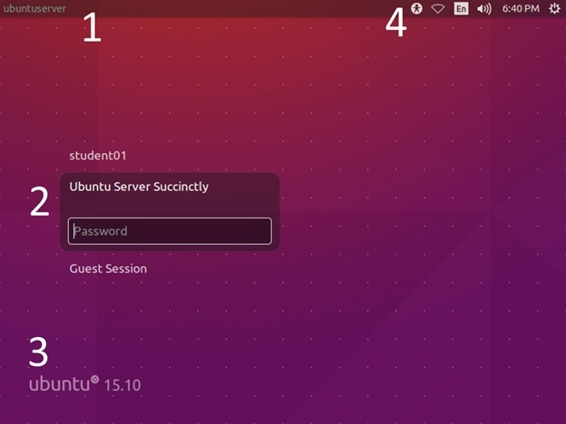

图 36:登录屏幕分为四个部分

下表解释了上图中显示的部分。

表 13:登录屏幕中每个部分的用途

| 部分 | 描述 |
| --- | --- |
| one | 面板。本节显示安装过程中分配给计算机的名称。 |
| Two | 用户列表和密码输入区。此区域显示在系统中注册的所有用户的名称。默认情况下，需要管理用户的密码。在要求输入密码的文本条目上方，会显示用户的全名，除非没有定义全名。在这种情况下，将显示用户名。要登录系统，必须输入密码并按回车键。 |
| three | 这个部分显示了 Ubuntu 软件的版本。 |
| four | 面板指示器。该区域显示了一组六个图形元素，旨在执行一系列没有管理权限的常见任务。 |

这些指示器显示在屏幕的右上角。它们是六个图形元素或图标，每个都有特定的功能。如下图所示。


图 37:面板指示器

每个图标的功能将在以下章节中解释。

#### 辅助功能选项菜单

这个菜单是通过点击公共任务栏中的第一个图标来显示的，它包含了提供方便用户的计算工作的可用选项。选项如下图所示。

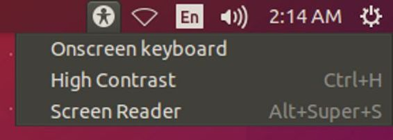

图 38:登录屏幕中的辅助功能选项

菜单中每个选项的名称都给出了它的用途。*屏幕键盘*会在屏幕上调出一个图形键盘，一般用于触摸屏设备。*高对比度*选项使视觉障碍人士可以轻松使用桌面界面。*屏幕阅读器*为视力受损和失明的用户提供语音引导帮助。当启用其中一个选项时，其描述的左侧会出现一个复选标记。如果未显示复选标记，则禁用该选项。

有些选项会在菜单右侧显示组合键的描述。在这种情况下，如果用户按下 Ctrl+H，高对比度选项将被启用或禁用。对于屏幕阅读器选项，按下超级(窗口徽标)键，将启用或禁用它。

#### 网络连接菜单

常见任务栏中的第二个图标显示可用于建立连接的网络适配器。此时，用户只能使用菜单中显示的任何适配器连接到网络，或者获取有关连接的信息。

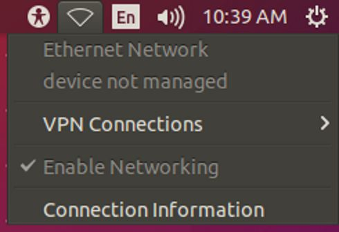

图 39:网络连接菜单

#### 语言选项菜单

当用户单击带有语言首字母(英语为 en)的图标时，该菜单出现，并显示可用于建立系统使用的键盘布局的语言。可以通过单击键盘布局的名称来选择它。对应于当前使用的键盘布局的名称左侧会出现一个白点。


图 40:可用的键盘布局

#### 声音配置控制

当用户点击扬声器图标时，显示该菜单。它用于调节或静音机器的扬声器。


图 41:声音配置控制

#### 交互式日历

当用户单击面板指示器栏中的时钟时，该日历出现。


图 42:交互式日历

上图显示了交互式日历。默认情况下，当前日期显示在顶部。与该日期对应的日期会突出显示。用户可以通过单击月份名称和年份编号旁边的左右箭头来浏览月份和年份。

#### 设置菜单

通过单击面板指示器栏末端的齿轮，出现该菜单。


图 43:设置菜单

由于菜单是从登录屏幕调用的，因此用户可以暂停、重新启动或关闭计算机。

### 关闭对话框

当用户从**设置**菜单中选择**关闭**选项时，该对话框出现。


图 44:关闭对话框

**关闭**对话框有两个巨大的图标。对话框右侧的图标允许用户通过点击关闭计算机。左边的图标用于重新启动计算机。

用户登录后，系统会启动 Ubuntu 桌面。这是使用桌面界面的起点。

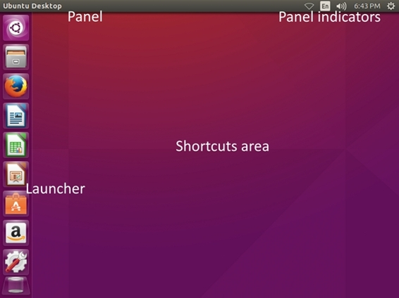

图 45:Ubuntu 桌面界面

图 45 显示了 Ubuntu 桌面并标注了它的主要特性。在顶部，面板显示了每个活动应用程序的菜单。它还包含一组图标指示器，可用作某些任务的快捷方式，例如配置日期和时间、配置声音、连接网络或更改全局系统设置。在左侧，一个称为启动器的任务栏，保存着作为快捷方式运行某些应用程序的图标，如火狐网络浏览器、文件资源管理器、LibreOffice 套件和主页按钮。最后，快捷方式区域允许用户以图标形式放置文件或应用程序的快捷方式，以便快速访问。

在桌面环境中，没有与系统一起工作的命令；图形元素取代了命令。为了向用户展示这些元素，桌面环境需要一个地方来做这些事情。这个地方被称为对话框(或窗口)。

对话框有一系列元素，每个元素都有特定的功能。这些元素可以通过用指针点击来使用。下图显示了一个对话框示例。

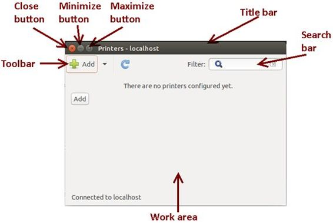

图 46:对话框(窗口)结构

下图所示的每个元素的功能在下面的列表中有详细说明。

*   **关闭按钮**:关闭对话框。
*   **最小化按钮**:隐藏对话框，并将其作为图标放置在桌面的启动器中。
*   **最大化按钮**:扩展对话框以适合整个桌面，不包括面板和启动器覆盖的区域。
*   **标题栏**:显示使用对话框的应用程序、命令或位置的名称。
*   **搜索栏**:允许用户搜索对象(文件、目录、设备等)。)的名字。
*   **工具栏**:作为某些常用命令的容器，显示为按钮。
*   **工作区**:作为其他图形元素(按钮、文本条目、标签等)的容器。)用于系统工作。

到目前为止，本书中所有涉及任何命令类执行的例子都使用了 Ubuntu 服务器命令行。现在，在接下来的几节中，我们将解释桌面环境中的一些命令及其相应的操作。此外，还将解释一些重要的系统设置。

#### 显示用户主目录的内容

命令`ls /home/<username>`以前用于显示用户主目录的内容。在桌面环境中做这个更容易——只需点击位于**启动器**中的**文件**按钮。


图 47:启动器中的文件浏览器按钮

当用户单击该按钮时，将显示文件资源管理器对话框，并显示用户主目录的内容。

文件浏览器对话框

文件资源管理器对话框就像一个典型的窗口对话框；它有标题栏和内容显示区。还有常用的**关闭**、**最小化**、**最大化**按钮。

下图显示了文件资源管理器对话框的结构，其中的元素已被完全识别。

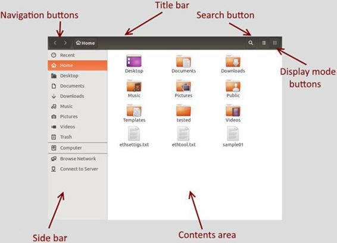

图 48:文件资源管理器对话框

*   **标题栏**:显示用户所在文件夹的名称。显示用户主目录的主目录。
*   **导航按钮**:允许用户在嵌套目录中前后导航。
*   **侧栏**:允许用户直接进入书签文件系统位置之一，如文档目录或下载目录(网络浏览器用来存储从互联网下载的文件)。
*   **搜索按钮**:激活搜索栏，查找当前目录下的文件或文件夹。
*   **显示模式按钮**:以图标网格(默认)或列表形式显示目录内容。
*   **内容区**:显示目录的内容。

搜索栏

此功能允许您在当前目录中按名称搜索文件或目录。此外，还可以添加一系列基于文件类型的标准来细化搜索。


图 49:激活搜索栏的文件资源管理器对话框

上图显示了带有活动搜索栏的文件资源管理器对话框。为了搜索文件，用户键入要搜索的名称，当文本条目中的文件名改变时，文件资源管理器将开始搜索。栏尾的加号(+)允许您根据文件类型添加搜索标准。

搜索的默认文件类型称为*任意*，这意味着所有文件都将被考虑搜索，无论其中存储了什么类型的数据。然后，建议使用一系列常见类型来细化搜索操作。这些类型包括文档、音乐、视频、图片、插图、电子表格、演示文稿、Pdf/Postscript 和文本文件。类型名称建议必须为每个要考虑搜索的文件类型存储的数据类型。

文件类型标准不限于显示的类型。在文件类型列表的末尾，显示了**其他类型**选项。当用户选择此选项时，将出现一个对话框，根据桌面环境中安装的应用程序显示不同文件类型的列表。用户可以选择这些类型中的一种来将其包括在搜索条件中。

当指定了多个标准时，搜索操作应用**或**逻辑操作。例如，如果考虑“文档”和“视频”，则通过包括名称与所提供的文本条目相对应的所有文件，以及搜索标准中指示的一种或所有文件类型来完成搜索。


图 50:显示文件类型列表的搜索栏

如果用户想要搜索名称中包含 *eth* 的文件，只考虑文本文件，该搜索将如下图所示。

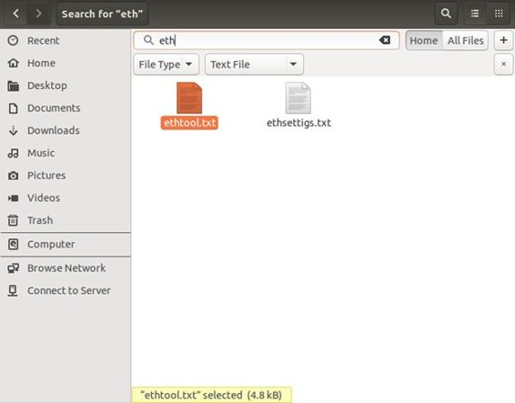

图 51:带有搜索结果的文件资源管理器对话框

文件资源管理器对话框的菜单栏

文件资源管理器有几个被分组到称为菜单的部分的命令。这些菜单被放置在一个叫做菜单栏的图形元素中。可以通过将指针放在桌面面板上来显示此栏。下图显示了文件资源管理器的菜单栏。


图 52:文件资源管理器菜单栏

共有六组命令或菜单，分别为**文件**、**编辑**、**查看**、**前往**、**书签**、**帮助**。经典的**关闭**、**最小化**、**最大化**按钮也出现在栏的开头。要执行这些命令，用户必须单击所需的菜单，然后单击命令来执行它。

“文件”菜单

位于此菜单中的命令对应于某些关于文件管理或导航的任务。根据当前选定项目的文件类型，或者如果内容区域中没有选定项目，菜单可以增大或缩小。与“文件”菜单相关联的命令如下:

*   **新窗口**:打开新的文件浏览器对话框。这个命令也可以按 Ctrl+N 执行。
*   **新建标签页**:在内容区新建一个标签页。用户可以在两个选项卡中导航到文件系统中的不同位置。这个命令也可以按 Ctrl+T 执行。
*   **新建文件夹**:在当前位置新建一个目录。这个命令也可以通过按 Shift+Ctrl+N 来执行。
*   **新建文档:**在当前位置创建一个空文档文件。
*   **打开**:在内容区显示当前选中目录的内容。这个命令也可以按 Ctrl+O 执行。
*   **在新标签页打开:**显示当前选中目录的内容，在内容区新建一个标签页。这个命令也可以通过按 Shift+Ctrl+T 来执行。
*   **在新窗口**中打开:通过打开一个新的文件浏览器对话框，显示当前选中目录的内容。这个命令也可以通过按 Shift+Ctrl+O 来执行。
*   **用**打开:显示一组命令，对应所有可能的应用程序，能够打开所选的目录或文件。
*   **连接服务器**:允许用户连接网络中的另一台服务器。
*   **属性**:显示文件或文件夹权限以及与当前选定项目相关的其他属性。
*   **关闭**:关闭文件浏览器对话框。
*   **关闭所有窗口**:关闭所有打开的文件浏览器对话框。

如前所述，“文件”菜单中显示的命令取决于对内容区域中一个或多个项目的选择。如果未选择任何项目，“打开”命令会消失，但“打开方式”命令除外。

下图显示了三种不同情况下的“文件”菜单:未选择项目时、选择目录时和选择文件时。注意菜单是如何根据情况变化的。


图 53:未选择项目时的文件菜单命令


图 54:选择文件夹时的文件菜单命令

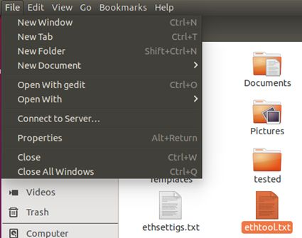

图 55:选择文件时的文件菜单命令

编辑菜单

“编辑”菜单对与选择文件或文件夹、移动文件、删除文件、重命名文件和创建快捷方式相关的所有命令进行分组。此外，还可以更改文件资源管理器对话框的行为。与“编辑”菜单相关联的命令有:

*   **撤销**:恢复上次执行的命令所执行的动作。另一种执行命令的方法是按 Ctrl+Z。
*   **重做**:重复执行最后一个命令。另一种执行命令的方法是按 Shift+Ctrl+Z。
*   **剪切**:标记选择要移动到另一个位置的文件或文件夹。另一种执行命令的方法是按 Ctrl+X。
*   **复制**:将所选文件或文件夹的副本发送到剪贴板。另一种执行命令的方法是按 Ctrl+C。
*   **粘贴**:将剪贴板上的文件或文件夹的副本放置到当前位置。另一种执行命令的方法是按 Ctrl+V。
*   **全选**:选择当前位置的所有项目。另一种执行命令的方法是按 Ctrl+A。
*   **选择符合**的项目:选择符合标准的所有项目。另一种执行命令的方法是按 Ctrl+S。
*   **反转选择**:选择当前选择对面的所有项目。也就是说，如果在当前位置没有选择任何项目，所有项目都将被该命令选择。另一种执行命令的方法是按 Shift+Ctrl+I。
*   **建立链接**:创建快捷方式来访问当前选定的文件或目录。另一种执行命令的方法是按 Ctrl+M。
*   **重命名**:允许重命名当前选中的项目。另一种执行命令的方法是按 F2 键。
*   **移至垃圾桶**:将当前选中的项目移至垃圾桶。此项目将不再显示。另一种执行命令的方法是按下删除键。
*   **首选项**:允许更改文件浏览器对话框的行为。


图 56:编辑菜单命令

“视图”菜单

这组命令允许您更改项目在"文件资源管理器"对话框中的显示方式。与“视图”菜单相关联的命令有:

*   **重新加载**:刷新当前位置的内容。按下 Ctrl+R 也会执行该命令。
*   **列表**:以列表的形式显示当前位置的内容，包括每个项目的详细信息。按下 Ctrl+1 也会执行该命令。
*   **图标**:将当前位置的内容显示为图标视图(默认)。按下 Ctrl+2 也会执行该命令。
*   **按名称**:按文件或目录名称对当前位置的内容进行排序。
*   **按大小**:按文件或目录大小对当前位置的内容进行排序。
*   **按类型**:按文件类型对当前位置的内容进行排序。
*   **按修改日期**:按上次修改日期对当前位置的内容进行排序。
*   **倒序**:在图标视图中，根据默认视图将图标倒序放置，默认视图将目录放在文件之前。
*   **将视图重置为默认值**:将所有视图参数恢复为默认值。
*   **显示隐藏文件**:显示所有加盖隐藏属性的文件。按下 Ctrl+H 也会执行该命令。
*   **显示侧边栏**:显示和隐藏侧边栏(显示书签的地方)。按 F9 键也会执行命令。
*   **放大**:放大文件浏览器的内容。按下 Ctrl+加号也会执行该命令。
*   **缩小**:缩小文件浏览器的内容。按下 Ctrl+连字符也会执行该命令。
*   **正常大小**:以正常比例(100%)显示文件浏览器的内容。按 Ctrl+0 也会执行该命令。


图 57:查看菜单命令

“开始”菜单

Go 菜单命令允许涉及移动到文件系统中另一个位置的操作。与“开始”菜单相关联的命令有:

*   **打开父目录**:根据文件系统层次结构，打开当前目录的祖先目录。按下 Ctrl+向上箭头也会执行该命令。
*   **返回**:在查看当前目录之前，转到文件资源管理器所在的目录。按下 Ctrl+左箭头也会执行该命令。
*   **前进**:在执行后退命令之前，转到已查看的目录。按下 Ctrl+右箭头也会执行该命令。
*   **输入位置**:显示一个弹出对话框，指定要直接前往的位置(绝对或相对)。
*   **搜索文件**:激活文件浏览器对话框的搜索栏。

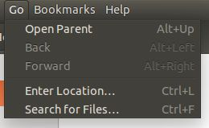

图 58:转到菜单命令

书签菜单

书签菜单命令允许您创建指向文件系统中特定位置的快捷方式，以便更快地使用它们。与书签菜单相关联的命令有:

*   **将此位置加入书签**:为当前目录创建快捷方式。如果当前目录已经定义了快捷方式，此命令将被禁用。按下 Ctrl+D 也会执行该命令。
*   **书签**:显示可用书签列表。按下 Ctrl+B 也会执行该命令。


图 59:书签菜单命令

|  | 注意:书签出现在文件资源管理器对话框的边栏中。 |

帮助菜单

这组命令允许您浏览与文件资源管理器相关的帮助文档。该菜单的命令如下:

*   **所有主题**:显示文件资源管理器帮助文档涵盖的所有主题。按下 F1 键也会执行命令。
*   **搜索文件**:显示关于搜索文件和目录的文档。
*   **文件和文件夹排序**:显示文件浏览器对话框内容排序的文档。
*   **查找丢失的文件**:显示用户在文件系统中查找文件的方法的文档。
*   **共享和传输文件**:显示网络中文件共享和文件传输的文档。
*   **关于**:显示关于文件(文件浏览器)应用的学分。

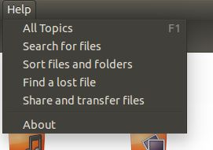

图 60:帮助菜单命令

#### 执行关机和重启命令

通过选择位于**设置**菜单中的**关闭**选项，可以在桌面环境中执行前面解释的`shutdown`和`reboot`命令，该菜单通过单击位于桌面面板末端的齿轮图标显示。

关闭命令显示了本章前面 [*关闭对话框*](#_The_Shut_Down) 部分解释的对话框。

#### 桌面界面中的设置菜单

与登录屏幕不同，桌面界面显示的**设置**菜单有更多可用选项(命令)。其中一些选项执行仅系统管理员可用的操作。因此，当用户尝试执行这些选项之一时，将出现一个对话框，要求输入密码来检查该用户的身份验证级别。

**设置**菜单中可用的选项有:

*   **关于这台电脑**:显示安装了 Ubuntu Server 的电脑的详细信息。
*   **Ubuntu 帮助**:显示关于桌面环境的常规帮助对话框。
*   **系统设置**:显示自定义系统的对话框。
*   **锁定/切换账号**:锁定电脑并显示锁屏。
*   **注销**:关闭当前用户的会话，返回登录界面。
*   **暂停**:使电脑进入休眠状态。当用户“唤醒”计算机时，会显示锁定屏幕，要求输入密码。
*   **关机**:如前所述，这允许用户执行关机或重启命令。

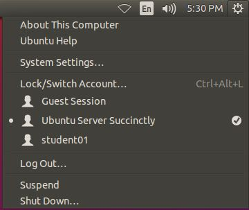

图 61:设置菜单

除了前面提到的命令之外，**设置**菜单显示了一个包含所有注册用户帐户的部分。当前登录用户的姓名右侧会显示一个复选标记。

#### 锁屏

无人值守时锁定计算机是一个重要的安全问题，Ubuntu 的桌面环境就考虑到了这一点。锁屏负责这个任务。用户只需按 Ctrl+Alt+L 即可调出此画面。锁定屏幕的另一种方法是选择**设置**菜单中的**锁定/切换账户**项目，如前一节所述。

锁定屏幕看起来几乎像登录屏幕，只是只显示登录用户的姓名。用户必须输入密码才能返回桌面界面。

下图显示了锁定屏幕。


图 62:锁定屏幕

#### 定制系统

用户可以通过选择**设置**菜单中的**系统设置**选项，以多种方式自定义系统。这种定制包括界面外观、添加或删除硬件以及系统级更改，如用户帐户管理或更新软件。

前几章解释的许多任务，如网络和安全，可以通过访问**系统设置**对话框来管理。该对话框分为三个部分:

*   **个人**:允许您更改与界面外观、文本输入设备使用和隐私参数相关的设置。
*   **硬件**:允许您配置当前安装的硬件并安装新设备，以便将它们连接到计算机。
*   **系统**:可以配置软件更新、时间日期、用户账号等全局系统设置。


图 63:突出显示外观图标的系统设置对话框

“外观”对话框

点击位于**系统设置**对话框的**个人**部分的**外观**图标，可以显示**外观**对话框。

**外观**对话框包含两个部分:

*   **外观**:允许你改变桌面的背景和启动器图标的大小。
*   **行为**:允许您修改启动器和对话框(窗口)菜单的行为。

更改桌面背景

可以修改桌面背景，在**外观**对话框的**外观**部分显示任何想要的图像。

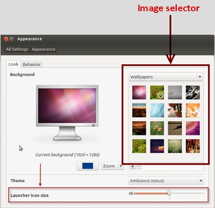

图 64:显示外观部分的外观对话框

要更改桌面的背景图像，用户需要从上图所示的图像选择器中选择一张图片。Ubuntu 会立即用选中的图片替换之前的图片。此外，可以使用位于对话框底部的滑块控件来更改启动器图标的大小。图标的大小以像素为单位。接受的最小尺寸是 16 像素，启动器图标的最大尺寸是 64 像素。默认大小为 48 像素。图标大小的改变会立即发生。

更改启动器的行为和菜单的显示位置

在某些情况下，如果启动器覆盖的屏幕区域可用，使用应用程序可能会更舒服。处理这个问题的一个好方法是告诉桌面环境，每次对话框激活时，启动器必须隐藏。“外观”对话框的“行为”部分用于执行此操作。

关于应用程序菜单，本章的 [*文件资源管理器对话框*](#fileExplorerDialog) 部分解释了通过将指针放在桌面面板上来显示菜单。这不仅适用于文件资源管理器应用程序，也适用于桌面环境中执行的所有应用程序。这也可以在“外观”对话框的“行为”部分进行更改。


图 65:外观对话框的行为部分

上图突出显示了启动器参数和菜单参数的区域。

拖动位于启动器参数区域右侧的**关闭**标签上的按钮，桌面环境会立即隐藏启动器。用户可以在屏幕上指示指针必须放在哪里，以便在需要时显示启动器。有两个位置可用:屏幕的左侧或左上角。揭示过程的灵敏度也可以调整。灵敏度调整越低，显示过程就越困难(耗时)。

可以通过选择对话框中两个可用选项之一来更改菜单行为。第一个告诉桌面环境，所有菜单都将放在面板中，这是默认行为。第二个强制所有菜单都放在自己的应用程序对话框中。

控制屏幕亮度和自动电脑锁定

如今，保护自然环境已经成为许多行业中更重要的问题之一。计算机和软件也不例外。因此，为了省电(并延长电池寿命)，桌面环境允许您在使用笔记本电脑时调整屏幕亮度，并且可以在系统没有活动时关闭任何类型电脑的屏幕。此外，锁定屏幕可以配置为自动运行，无论是在屏幕关闭时，还是在经过一定时间后。**系统设置**对话框中的**亮度&锁定**项目提供了这些选项。


图 66:亮度和锁定图标


图 67:亮度和锁定参数对话框

要调整亮度，用户可以拖动图 67 所示的滑块。向左拖动滑块将降低屏幕亮度。如果向右拖动滑块，则会发生相反的情况。**调暗屏幕省电**选项会在系统空闲(无键盘或鼠标移动)时降低屏幕亮度。清除此选项可以避免屏幕亮度降低。

**亮度**滑块下的**非活动时关闭屏幕下拉菜单允许您指定系统空闲后关闭屏幕必须经过多少秒。这可以通过从列表中选择**永不**来避免。**

通过向左拖动对话框中显示的**锁定**按钮，可以禁用锁定屏幕。向右拖动将启用锁定屏幕。位于**锁定**按钮后的下拉菜单中的**非活动时关闭屏幕允许您指定系统进入空闲状态后必须经过多少秒才能自动锁定计算机，并显示锁定屏幕。如果用户选择**屏幕关闭**选项，每次屏幕关闭时电脑都会被锁定。然后，当用户打开屏幕时，会显示锁定屏幕，系统会询问用户密码。**

#### 管理用户帐户

**用户帐户**对话框相当于[第 5 章“安全”中解释的所有关于用户帐户的文本命令](05.html#_Chapter_5_)点击**系统设置**对话框中的**用户账户**图标可以显示该对话框。


图 68:用户帐户图标

然后，将显示**用户账户**对话框。


图 69:用户帐户对话框

在上图中，**解锁**按钮突出显示，表示禁止对用户帐户进行任何操作。这是因为用户帐户管理是一项管理任务。在管理用户之前，有必要解锁对话框。这和执行本书开头解释的`sudo`命令是一样的。用户需要点击**解锁**按钮，然后系统会询问用户密码才能继续。

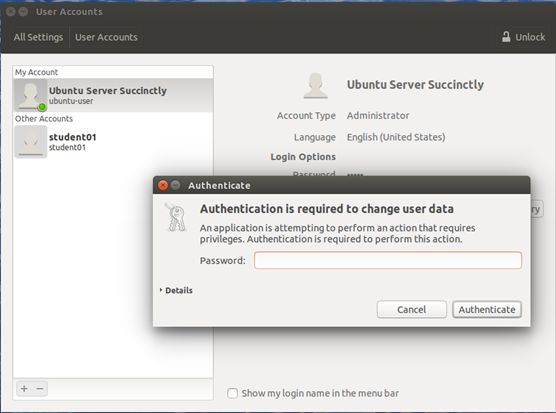

图 70:身份验证对话框

当用户输入正确的密码后，该对话框将被解锁，并允许用户帐户管理。

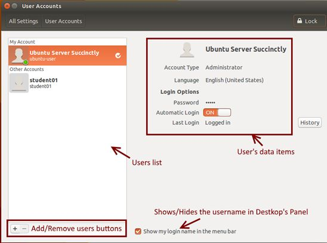

图 71:启用用户帐户对话框

对话框底部带有加号(+)和减号(-)字符的按钮可用于添加或删除用户帐户。当选择当前登录用户的帐户时，减号按钮将自动禁用。

选择用户帐户后，与该帐户相关联的数据将显示在对话框的右侧，允许当前登录的用户编辑所有项目。除了所选帐户属于当前登录用户时的帐户类型之外，每个帐户都可以通过单击进行编辑。下表解释了用户帐户数据项。

表 14:用户帐户数据项

| 项目 | 描述 |
| --- | --- |
| 账户类型 | 管理员或标准。标准帐户不能更改系统。 |
| 语言选项 | 用户使用的语言或语言变体。 |
| 密码 | 登录系统的用户密码。 |
| 自动登录 | 允许用户在计算机开机时跳过密码请求，提供自动登录。这可以通过将“自动登录”按钮放在右侧来实现，该按钮将显示一个带有橙色背景色的“开”信号。 |

位于对话框底部的菜单栏中的**显示我的登录名复选框允许您在桌面面板的右侧显示用户的全名。**

添加帐户

点击位于对话框左下角的 **+** (加号)按钮，可以添加用户账户。然后，将显示以下对话框。

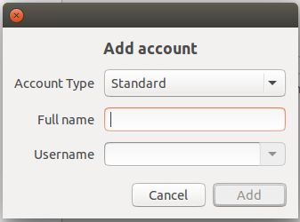

图 72:添加帐户对话框

**添加账户**对话框包含创建用户账户必须填写的三个项目。这些物品是。

*   **账户类型**:标准或管理员。标准用户不能对系统进行更改。
*   **全名**:用户全名(如:John Summers)，使账户名人性化。
*   **用户名**:用于系统目的的用户帐户名(如 johnsummers)。

点击**添加**按钮后，账户将被添加。

删除帐户

点击位于对话框左下方的**–**(减号)按钮可以删除用户账户。此操作将显示以下对话框。


图 73:删除帐户对话框

对话框中显示的选项对应于`deluser`命令提供的选项，这在本书的[“安全”](05.html#_Adding_and_deleting)一章中有解释。**取消**选项用于取消删除账户操作，不产生任何后果。其他按钮执行以下操作:

*   **删除文件**:相当于`deluser –remove-home`命令，删除用户账号及其主目录。
*   **保留文件**:相当于`deluser`命令，只删除用户账号，保留磁盘上的主目录。

#### 安装打印机

要安装打印机设备，用户需要点击**系统设置**对话框的**打印机**图标。

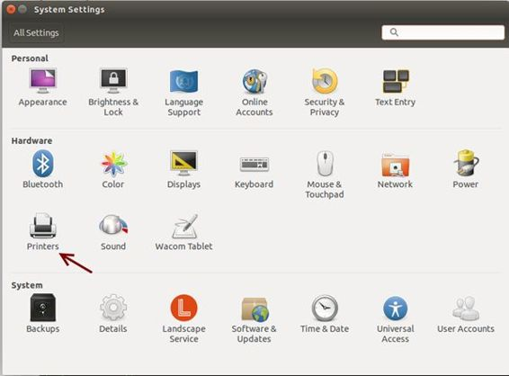

图 74:系统设置对话框中的打印机图标

然后，打印机对话框将出现在屏幕上。


图 75:本地主机的打印机对话框

点击顶部工具栏中的**添加**按钮，或者点击对话框中出现的**添加**按钮，可以添加新的打印机。将出现**新打印机**对话框。

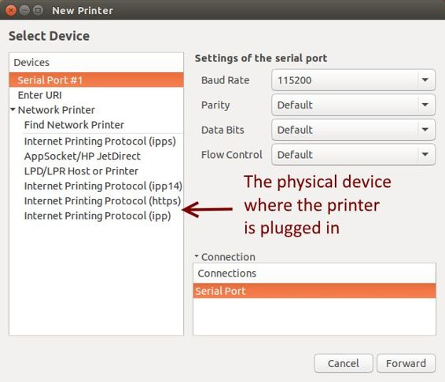

图 76:询问设备的新打印机对话框

此时，用户需要选择要添加的打印机所插的物理设备，然后点击**前进**按钮。在上图中，假设打印机插入的设备是串行(RS232)端口。

现在，系统将允许为正在安装的打印机型号选择驱动程序。选择驱动程序有三种选择。第一种是从内部驱动数据库中选择；第二个允许您选择位于文件系统中的先前下载的 PPD 文件；第三个允许您在 Ubuntu 网站上搜索特定的制造商和型号，以便下载合适的驱动程序。

点击**前进**按钮后，安装过程将继续。


图 77:驱动程序选择对话框

当用户从列表中选择制造商时，Ubuntu 会要求从列表中选择一个特定的型号。然后，要求用户提供打印机的描述，以便为该打印机分配人类可读的描述，以及可选的人类可读的物理位置(例如，“销售部门”)。


图 78:打印机描述对话框

当用户点击**应用**按钮时，安装过程结束。然后，系统会要求打印测试页。

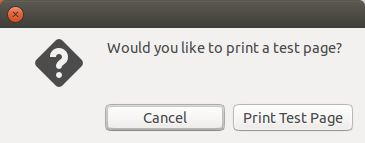

图 79:测试页面对话框

用户可以选择向打印机发送测试页或取消请求。在这两种情况下，安装过程都会结束。

Ubuntu 软件中心是一个在 Ubuntu 中安装、购买和删除软件的实用程序，是 Ubuntu 整体软件处理的主要部分。

Ubuntu 软件中心允许用户浏览和安装成千上万个免费和付费的 Ubuntu 应用程序。用户可以按类别查看可用软件，或者按名称或描述快速搜索。您还可以检查已经安装的软件，并删除不再需要的项目。

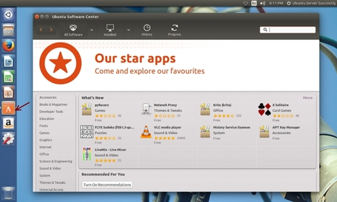

图 80: Ubuntu 软件中心主屏幕

Ubuntu 软件中心可以从启动器执行，如上图所示。

该工具栏包含四个按钮，用于浏览所有可用软件。


图 81:软件中心工具栏

**所有软件**按钮显示列表中所有可用的软件，由 Ubuntu 或 Canonical 合作伙伴提供。当列出的软件已经安装时，其图标上会出现一个绿色勾号。

**已安装**按钮过滤软件列表，仅显示系统中安装的所有软件。此外，该软件可以由 Ubuntu 或 Canonical 合作伙伴提供。


图 82:所有软件列表

要删除已经安装的软件，用户必须从列表中选择要卸载的软件，然后点击**删除**按钮。


图 83:选择要卸载的软件

反之，从列表中选择所需软件，然后点击**安装**按钮，即可安装新软件。


图 84:选择要安装的软件

**历史记录**按钮允许用户按日期跟踪每次安装、更新或软件删除。该列表是从最近的操作日期开始显示的。该列表中有四个组:

*   **所有更改**:显示对系统所做的所有更改。这包括安装、更新和软件删除。
*   **安装**:仅显示软件安装操作。
*   **更新**:仅显示软件更新操作。
*   **删除**:仅显示与软件卸载操作相关的操作。


图 85:软件历史列表

最后，仅当软件安装或软件卸载操作正在进行时，才会显示**进度**按钮。操作完成后，按钮消失。

Ubuntu 中有一个界面，允许从文本条目中搜索应用程序、文件和文件夹，甚至网络。这个界面叫做 Dash，可以通过按超级(Windows logo)键或者点击**启动器**中的 **Dash** 按钮来激活。

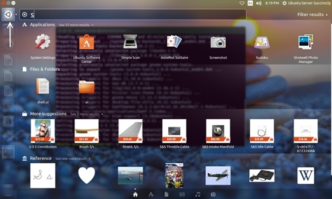

图 86:在桌面中激活的仪表板

每次在搜索栏中输入一个字符，破折号都会搜索系统，然后搜索网络，以查找与键入的文本匹配的元素。当用户从搜索栏的文本条目中删除一个字符时，也会执行该搜索。Dash 搜索文件、文件夹、应用程序、音乐、视频和照片。

当进行搜索时，用户可以点击所需元素的图标，对象将被适当的应用程序打开。

要关闭仪表板，用户点击位于**发射器**中的**仪表板**按钮，或按下 Esc 键。

桌面环境提供了一个界面，允许您键入和执行基于文本的命令，就像在命令行中键入这些命令一样。这个界面叫做终端，按 Ctrl+Alt+T 即可显示。


图 87:终端界面

使用此界面的目的是完成一些任务，这些任务可以通过键入文本命令比使用图形应用程序更快地完成。要关闭该界面，用户必须在命令提示符下键入**退出**。

用户执行的常见终端任务是软件安装。在某些情况下，与通过软件中心导航相比，通过执行一个命令可以更容易地安装应用程序。

例如，如果用户和组实用程序软件的名称以前是已知的(gnome-system-tools)，那么使用`sudo apt-get install`命令更容易安装软件包。下图显示了执行此命令时的终端界面。


图 88:安装用户和组实用程序

此外，使用以下命令可以轻松删除用户和组实用程序。


图 89:删除用户和组实用程序

在 Ubuntu 中，通过将一系列命令写入文本文件，可以一次执行这些命令。这个文件被称为 shell 脚本，可以用文本编辑器创建。

桌面界面有一个文本编辑器应用程序。要执行它，用户需要调用 Dash 并在搜索栏中写入**文本**。

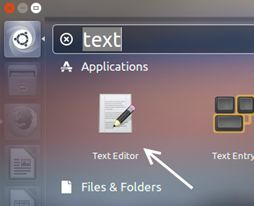

图 90:桌面的文本编辑器

下面的示例显示了一个简单的脚本。

代码清单 155

```
  #!/bin/bash
  #First
  script
  echo
  "Hello World"

```

剧本的第一行很重要。这是一个特殊的线索，叫做一个 shebang，给了 shell 指示哪个程序被用来解释脚本。在这种情况下，就是`/bin/bash`。

第二行是注释。bash 会忽略出现在`#`符号之后的所有内容。随着 shell 脚本变得更大、更复杂，注释变得至关重要。程序员用它们来解释正在发生的事情，以便其他程序员能够弄清楚。最后一行是`echo`命令。这个命令只是在屏幕上显示它的参数。

一旦脚本保存在磁盘上，接下来要做的就是授予它由 shell 执行的权限。下图显示了如何为脚本赋予执行权限以及运行脚本的结果，假设该脚本将保存在`/home/Ubuntu-user`目录下名为`hello_world`的文件中。


图 91:授予执行权限并执行脚本

更进一步，下面的脚本示例将用户的主目录内容复制到位于`/home`目录的备份文件夹中。

代码清单 156

```
  #!/bin/bash
  #Backup
  Script
  echo
  "Backing Up Home Directory"
  cp
  -r /home/buntu-user
  /home/backups/Ubuntu-user

```

在大多数情况下，可以在命令行上输入的命令都适用于 shell 脚本。关于 shell 脚本，可以考虑几件事:

*   有不同的命令解释器，称为 shells。默认的是 bash，但是还有其他的，比如 zsh、ksh、dash、perl、python 等等。
*   要运行 shell 脚本，用户需要使文件可执行，这可以通过`chmod`命令来完成。
*   通常可以在文件名中添加扩展名。嘘，但这不是必须的。
*   `#!/bin/bash`必须写在文件的第一行，告诉 Ubuntu 用什么程序来运行脚本。

Ubuntu Server 提供了一个 GUI(图形用户界面)来代替默认安装的命令行。这个界面叫做桌面环境，可以使用`sudo apt-get update`和`sudo apt-get install buntu-desktop`命令进行部署。

安装后，登录屏幕将取代文本登录提示。用户需要提供用户名和密码才能访问系统。

桌面界面的主程序是 Ubuntu Desktop，它为系统中安装的所有应用程序以及所有可用的系统管理程序提供了一个入口点。

桌面环境中用户交互的主要元素叫做对话框。对话框有一系列元素，每个元素都有特定的功能。这些元素可以在你用指针点击它们时使用。此外，其中一些元素允许用户在需要时输入文本。

桌面环境提供了一组图形应用程序来模拟文本命令的行为。其中一个应用是**文件**对话框(文件浏览器)，相当于`ls`命令。

`shutdown`和`reboot`命令有一个图形等价物，称为**关闭**对话框。点击**设置**菜单中的**关闭**选项可启动该对话框。点击位于 Ubuntu 桌面屏幕右上角的齿轮图标，即可进入该菜单。

通过按超级(Windows 徽标)键+L，调出锁定屏幕，可以锁定用户的会话。要返回工作会话，用户必须输入密码。

**系统设置**对话框用于自定义系统。此对话框有三个部分:个人，允许您自定义界面外观、文本输入设备和用户隐私设置；硬件，允许您安装新的硬件设备或配置已安装的硬件设备；和系统，允许您配置全局设置，如日期和时间、软件更新和用户帐户。

Ubuntu 软件中心是一个用来管理已安装应用程序和安装新应用程序的工具。该工具可以将软件过滤为三类:所有可用的软件(安装在系统中或位于 Ubuntu 网站上)、系统中安装的软件以及软件安装操作的历史记录。

Dash 是一个界面，用于搜索系统或网络中的任何内容。这个界面可以通过按超级(窗口)键来执行。它执行文本搜索来定位用户正在寻找的内容。搜索的内容可以是文件、目录、应用程序、音乐、图像或视频。搜索操作首先在本地系统中执行，然后在互联网上执行。

有时，键入文本命令是比使用图形界面更好的选择。在这种情况下，Ubuntu 提供了一个名为终端的接口。这个界面可以通过按 Ctrl+Alt+T 来显示，本书解释的任何文本命令都可以在终端界面使用。

通过将命令放在文本文件中，可以一次执行一系列命令。这个文件被称为 shell 脚本，可以使用文本编辑器创建。Ubuntu 桌面有一个可用的文本编辑器应用程序。这个应用程序可以通过使用 Dash 搜索它，然后单击应用程序的图标来执行。

在大多数情况下，可以在命令行上输入的命令都适用于 shell 脚本。关于 shell 脚本，可以考虑几件事:

*   有不同的命令解释器，称为 shells。默认的是 bash，但是还有其他的，比如 zsh、ksh、dash、perl、python 等等。
*   要运行 shell 脚本，用户需要使文件可执行，这可以通过`chmod`命令来完成。
*   通常可以在文件名中添加扩展名。嘘，但这不是必须的。
*   `#!/bin/bash`必须写在文件的第一行，告诉 Ubuntu 用哪个程序来运行脚本。