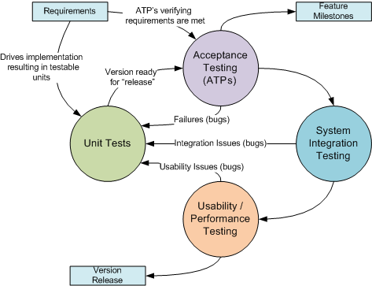

# 第二章什么是单元测试？

单元测试就是证明正确性。为了证明某个东西工作正常，你首先必须了解一个*单元*和一个*测试*实际上是什么，然后你才能探索在单元测试的能力范围内什么是可证明的。

## 什么是单位？

在单元测试的环境中，一个单元有几个特征。

### 纯单位

纯单元是编写单元测试最简单和最理想的方法。一个纯单元有几个便于测试的特性。

一个单元不应该(理想地)调用其他方法

关于单元测试，一个单元首先应该是一个不调用任何其他方法就能做某事的方法。这些纯单位的例子可以在`String`和`Math`类中找到——执行的大多数操作不依赖于任何其他方法。例如，下面的代码(取自作者写的东西)

```
    public void SelectedMasters()
    {
      string currentEntity = dgvModel.DataMember;
      string navToEntity = cbMasterTables.SelectedItem.ToString();
      DataGridViewSelectedRowCollection selectedRows = dgvModel.SelectedRows;

      StringBuilder qualifier = BuildQualifier(selectedRows);
      UpdateGrid(navToEntity);
      SetRowFilter(navToEntity, qualifier.ToString());
      ShowNavigateToMaster(navToEntity, qualifier.ToString());
    }

```

不应被视为一个单位，原因有三:

*   它不是获取参数，而是从用户界面对象，特别是一个 DataGridView 和一个 ComboBox 获取计算中涉及的值。
*   它对其他有可能成为*单位的方法进行了几次调用。*
*   其中一种方法似乎是更新显示，将计算与可视化相结合。

第一个原因指出了一个微妙的问题——属性应该被认为是方法调用。事实上，它们在底层实现中。如果您的方法正在使用其他类的属性，这是一种方法调用，在编写合适的单元时应该仔细考虑。

实际上，这并不总是可能的。通常，需要调用框架或其他应用编程接口，单元才能成功完成工作。但是，应该检查这些调用，以确定是否可以改进该方法，使其成为更纯的单元，例如，将调用提取到更高的方法中，并将调用结果作为参数传递给该单元。

#### 一个单位应该只做一件事

“一个单元不应该调用其他方法”的一个推论是，一个单元是*做一件事*只做一件事的方法。经常调用其他方法来做*不止一件事*——这是一项宝贵的技能，可以知道什么时候某件事实际上由几个子任务组成——即使它可以被描述为一个高级任务，这让它听起来像一个单一的任务！

下面的代码看起来像是一个合理的单元，它只做一件事:在数据库中插入一个名称。

```
    public int Insert(Person person)
    {
      DbProviderFactory factory = SqlClientFactory.Instance;

      using (DbConnection connection = factory.CreateConnection())
      {
        connection.ConnectionString = "Server=localhost; Database=myDataBase;
            Trusted_Connection=True;";
        connection.Open();

        using (DbCommand command = connection.CreateCommand())
        {
          command.CommandText = "insert into PERSON (ID, NAME) values (@Id, @Name)";
          command.CommandType = CommandType.Text;

          DbParameter id = command.CreateParameter();
          id.ParameterName = "@Id";
          id.DbType = DbType.Int32;
          id.Value = person.Id;

          DbParameter name = command.CreateParameter();
          name.ParameterName = "@Name";
          name.DbType = DbType.String;
          name.Size = 50;
          name.Value = person.Name;

          command.Parameters.AddRange(new DbParameter[] { id, name });

          int rowsAffected = command.ExecuteNonQuery();

          return rowsAffected;
        }
      }
    }

```

然而，这段代码实际上做了几件事:

*   获取`SqlClient`工厂提供者实例。
*   实例化一个连接并打开它。
*   实例化命令并初始化该命令。
*   创建两个参数并添加到命令中。
*   执行命令并返回受影响的行数。

这种代码有各种各样的问题，使它没有资格成为一个单位，并使它很难减少到基本单位。编写这段代码的更好方法可能如下所示:

```
    public int RefactoredInsert(Person person)
    {
      DbProviderFactory factory = SqlClientFactory.Instance;
      using (DbConnection conn = OpenConnection(factory, "Server=localhost; Database=myDataBase;
         Trusted_Connection=True;"))
      {
        using (DbCommand cmd = CreateTextCommand(conn, "insert into PERSON (ID, NAME) values (@Id, @Name)"))
        {
          AddParameter(cmd, "@Id", person.Id);
          AddParameter(cmd, "@Name", 50, person.Name);
          int rowsAffected = cmd.ExecuteNonQuery();

          return rowsAffected;
        }
      }
    }

    protected DbConnection OpenConnection(DbProviderFactory factory, string connectString)
    {
      DbConnection conn = factory.CreateConnection();
      conn.ConnectionString = connectString;
      conn.Open();

      return conn;
    }

    protected DbCommand CreateTextCommand(DbConnection conn, string cmdText)
    {
      DbCommand cmd = conn.CreateCommand();
      cmd.CommandText = cmdText;
      cmd.CommandType = CommandType.Text;

      return cmd;
    }

    protected void AddParameter(DbCommand cmd, string paramName, int paramValue)
    {
      DbParameter param = cmd.CreateParameter();
      param.ParameterName = paramName;
      param.DbType = DbType.Int32;
      param.Value = paramValue;
      cmd.Parameters.Add(param);
    }

    protected void AddParameter(DbCommand cmd, string paramName, int size, string paramValue)
    {
      DbParameter param = cmd.CreateParameter();
      param.ParameterName = paramName;
      param.DbType = DbType.String;
      param.Size = size;
      param.Value = paramValue;
      cmd.Parameters.Add(param);
    }

```

请注意，除了看起来更干净之外，方法`OpenConnection`、`CreateTextCommand`和`AddParameter`如何更适合单元测试(忽略它们是受保护方法的事实)。这些方法只做一件事，并且作为单元，可以被测试以确保它们正确地做那一件事。由此，测试`RefactoredInsert`方法就没有什么意义了，因为它完全依赖于其他具有单元测试的功能。最好的情况是，您可能想编写一些异常处理测试用例，并可能对`Person`表中的字段进行一些验证。

#### 可证明正确的代码

如果更高级别的方法不只是调用其他有单元测试的方法，比如说某种额外的计算，会怎么样？在这种情况下，执行计算的代码应该移动到它自己的方法中，应该为它编写测试，并且更高级别的方法也可以依赖于它调用的代码的正确性。这是构造可证明正确的代码的过程。当高级方法只调用具有正确性证明(单元测试)的低级方法时，它们的正确性会提高。

#### 一个单元不应该(理想地)有多个代码路径

圈复杂度通常是单元测试和应用测试的克星，因为它增加了测试所有代码路径的难度。理想情况下，一个单元不会有任何`if`或`switch`语句。这些陈述的主体应该被视为单元(假设它们满足单元的其他标准)并且要成为可测试的，应该被提取到它们自己的方法中。

下面是作者的 MyXaml 项目(解析器的一部分)中的另一个例子:

```
    if (tagName=="*")
    {
      foreach (XmlNode node in topElement.ChildNodes)
      {
        if (!(node is XmlComment))
        {
          objectNode = node;
          break;
        }
      }

      foreach (XmlAttribute attr in objectNode.Attributes)
      {
        if (attr.LocalName == "Name")
        {
          nameAttr = attr;    
          break;
        }
      }
    }
    else
    {
      ... etc ...
    }

```

这里我们有多个涉及`if`、`else`和`foreach`语句的代码路径，它们:

*   创建设置复杂性，因为执行内部代码必须满足许多条件。
*   创建测试复杂性，因为代码路径需要不同的设置来确保每个代码路径都经过测试。

显然，条件分支、循环、case 语句等。不可避免，但考虑重构代码，使条件和循环的内部成为可以独立测试的独立方法可能是值得的。那么高级方法的测试可以简单地确保状态(由条件、循环、开关等表示。)被正确处理，与它们执行的计算无关。

### 从属单位

依赖于其他类、数据和状态信息的方法测试起来更复杂，因为这些依赖转化为对实例化对象、数据存在和预定状态的要求。

#### 前提

最简单的形式是，从属单位有必须满足的先决条件。单元测试引擎提供了实例化测试依赖关系的机制，既可以用于单个测试，也可以用于测试组或“夹具”中的所有测试。

#### 实际或模拟服务

复杂的从属单元需要实例化或模拟数据库连接等服务。在早期的[代码示例](#InsertExample)中，`Insert`方法不能在没有连接到实际数据库的能力的情况下进行单元测试。如果可以模拟数据库交互，通常通过使用接口或基类(抽象或非抽象)，那么这段代码就变得更容易测试。

前面描述的`Insert`代码中的[重构方法](#RefactoredInsertExample)就是一个很好的例子，因为`DbProviderFactory`是一个抽象基类，所以可以很容易地创建一个从`DbProviderFactory`派生的类来模拟数据库连接。

#### 处理外部异常

依赖单元，因为它们正在调用其他 API 或方法，也更脆弱——它们可能需要显式地处理由它们调用的方法可能产生的错误。在前面的代码示例中，`Insert`方法的代码可以被包装在一个 try-catch 块中，因为数据库连接可能不存在。异常处理程序可能会返回受影响行数的`0`，通过其他机制报告错误。在这种情况下，单元测试必须能够模拟这个异常，以确保所有代码路径都被正确执行，包括`catch`和`finally`块。

## 什么是测试？

测试为单元的正确性提供了一个有用的断言。断言单元正确性的测试通常以两种方式运行单元:

*   测试设备在正常情况下的表现。
*   测试设备在异常情况下的表现。

### 正常条件测试

测试单元在正常条件下的行为是目前为止最容易编写的测试。毕竟，当我们编写一个函数时，我们要么是为了满足显式需求，要么是为了满足隐式需求。实现反映了对这一需求的理解，这在一定程度上包含了我们期望作为函数输入的内容，以及我们期望函数如何处理这些输入。因此，我们在给定预期输入的情况下测试函数的结果，不管函数的结果是返回值还是状态变化。此外，如果该单元依赖于其他功能或服务，我们也期望它们能够正确运行，并且正在用这个隐含的假设编写测试。

### 异常情况测试

测试该单元在异常条件下的行为要困难得多。它需要确定什么是异常情况，这通常通过检查代码是不明显的。当测试一个依赖单元时，这就变得更加复杂了——这个单元期望另一个功能或服务能够正常工作。此外，我们不知道另一个程序员或用户会如何操作这个单元。

## 单元测试和其他测试实践



图 1:作为综合测试方法一部分的单元测试

单元测试不会取代其他测试实践；它应该补充其他测试实践，提供额外的文档支持和信心。图 1 展示了“应用程序开发流程”的一个概念——其他测试如何与单元测试集成。请注意，客户可以参与任何阶段，尽管通常是在验收测试程序、系统集成和可用性阶段。

将此与软件开发和测试流程的 [V 型](http://en.wikipedia.org/wiki/V-Model_(software_development))进行对比。虽然它与软件开发的[瀑布模型](http://en.wikipedia.org/wiki/Waterfall_model)有关(最终，所有其他软件开发模型要么是其子集，要么是其扩展)，但是 V 模型很好地描述了软件开发过程的每一层需要什么样的测试:


图 2:测试的 V 型模型

此外，当一个测试点在其他测试实践中失败时，一段特定的代码通常可以被识别为导致失败的原因。在这种情况下，可以将这段代码视为一个单元，编写一个单元测试来首先创建故障，并在代码更改后验证修复。

### 验收测试程序

验收测试程序通常被用作合同要求，以证明某些功能已经实现。可承诺量通常与里程碑相关联，里程碑通常与付款或进一步的项目融资相关联。可承诺量不同于单元测试，因为可承诺量表明与整个行项目需求相关的功能已经实现。例如，单元测试可以确定计算是否正确。但是，可承诺量可能会验证用户界面中提供了用户元素，并且用户界面显示了需求指定的计算结果。单元测试不包括这些要求。

### 自动化用户界面测试

可承诺量最初可能被写成一系列用户界面交互，以验证需求已经得到满足。随着应用程序的不断发展，应用程序的回归测试适用于单元测试和验收测试。自动化用户界面测试是另一个完全独立于单元测试的工具，它节省了时间和人力，同时减少了测试错误。与 ATPs 一样，单元测试绝不能取代自动化用户界面测试的价值。

### 可用性和用户体验测试

单元测试、可承诺量和自动化用户界面测试不会以任何方式取代可用性测试——将应用程序放在用户面前，并获得他们的“用户体验”反馈。可用性测试不应该是寻找计算缺陷(bug)，因此完全不在单元测试的范围之内。

### 性能和负载测试

一些单元测试工具提供了一种测量方法性能的方法。例如，Visual Studio 的测试引擎报告执行时间，NUnit 具有可用于验证方法是否在分配的时间内执行的属性。

理想情况下，一个单元测试工具。NET 语言应该显式地实现性能测试，以补偿首次执行代码时的实时(JIT)代码编译。

大多数负载测试(以及相关的性能测试)不适合单元测试。某些形式的负载测试也可以通过单元测试来完成，至少在硬件和操作系统的限制下是如此，例如:

*   模拟内存限制。
*   模拟资源限制。

然而，这些类型的测试理想情况下需要框架或操作系统应用编程接口的支持来为被测试的应用程序模拟这些类型的负载。强制整个操作系统消耗大量内存和/或资源会影响所有应用程序，包括单元测试应用程序。这不是一个可取的方法。

其他类型的负载测试，例如模拟同时运行一个操作的多个实例，不适合单元测试。例如，用一台机器测试每分钟一百万个事务的 web 服务的性能可能是不可能的。虽然这种测试可以很容易地写成一个单元，但实际的测试将涉及一套测试机器。最后，您只在非常特定的网络条件下测试了 web 服务的一个非常狭窄的行为，这根本不能代表真实的世界。

因此，性能和负载测试在单元测试中的应用非常有限。