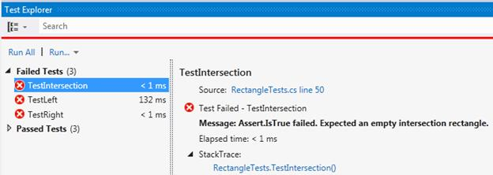

# 第七章常用单元测试工具

## N 单位

NUnit([www.nunit.org/](http://www.nunit.org/))最初是从 JUnit 移植过来的，作为一个开源的单元测试引擎，提供了一套丰富的测试夹具、方法和变量属性，以及测试断言。NUnit 所有版本的文档可以在[www.nunit.org/index.php?p=documentation](http://www.nunit.org/index.php?p=documentation)找到。NUnit 仍在维护中。在撰写本文时，最新的稳定版本是 2012 年 10 月 22 日发布的 2.6.2 版。

## 单位

CSUnit([http://www.csunit.org/](http://www.csunit.org/))是一款重量更轻的单元测试发动机。请注意，它似乎没有得到维护，因为最后一次发布是在 2009 年 3 月。它提供了一个最小但功能性的属性集，用于定义测试夹具和测试方法。

## Visual Studio 测试项目

Visual Studio 提供了直接在 IDE 中创建测试项目的能力。作者发现的一个问题是，在 VS 2008 和 VS 2012 之间，用户界面发生了变化:

### Visual Studio 2008 测试结果 UI


图 4: VS2008 测试结果界面

在 VS2008 中，测试运行执行得非常快，并显示一个易于阅读的测试结果列表，对于失败的测试，还会显示错误消息，提供有关测试失败原因的信息。

此外，当测试项目是活动项目时，运行测试(或调试测试)与运行任何其他应用程序相同，您可以使用 Ctrl+F5(运行)或 F5(调试)运行它们。

### Visual Studio 2012 测试结果 UI



图 5: VS2012 测试结果界面

在 VS2012 中，测试运行程序需要几秒钟来初始化。更糟糕的是，与测试结果相关的消息是通过点击失败获得的*。*额外的点击需求是一个重要的可用性问题。由于故障显示方式的变化，Visual Studio 2008 被用于本书的截图。

最后，测试运行程序不再像常规应用程序那样通过相同的快捷键启动。相反，开发人员必须使用 Ctrl+R，A 来运行测试。没有映射到调试单元测试的键盘快捷键。

### Visual Studio 与 NUnit 集成

微软为 Visual Studio 2010([http://visualstudiogallery . msdn . Microsoft . com/c 8164 c71-0836-4471-80ce-633383031099](http://visualstudiogallery.msdn.microsoft.com/c8164c71-0836-4471-80ce-633383031099))和 2012([http://visualstudiogallery . msdn . Microsoft . com/6a b 922d 0-21 c 0-4f 06-ab5f-4ecd 1fe 7111)提供了 NUnit 的集成工具](http://visualstudiogallery.msdn.microsoft.com/6ab922d0-21c0-4f06-ab5f-4ecd1fe7175d)

## 其他单元测试工具

这里还有其他几个值得一提的测试引擎。

### MSTest

MSTest([http://msdn.microsoft.com/en-us/library/ms182489](http://msdn.microsoft.com/en-us/library/ms182489)是微软测试运行程序的命令行版本。

### mbutu/gallio

姆布尼特([http://www.mbunit.com/](http://www.mbunit.com/))和加里奥([http://gallio.org/](http://gallio.org/))关系密切。Gallio 是一个测试自动化平台，允许您集成各种测试框架和报告工具。一旦你熟悉了单元测试原理和其他引擎，这是一个值得探索的复杂工具。

### 微软测试管理器

微软测试管理器([http://msdn.microsoft.com/en-us/library/jj635157.aspx](http://msdn.microsoft.com/en-us/library/jj635157.aspx))是一个手动或自动规划、管理和执行测试的工具。Microsoft 测试管理器与错误跟踪集成，允许编写与您的测试相关的笔记，并允许您配置可以在测试运行前重置为已知状态的虚拟实验室机器。

### FsUnit

FsUnit([https://github.com/dmohl/FsUnit](https://github.com/dmohl/FsUnit))是一个测试引擎，方便使用 F#语言。

## 集成测试框架

单元测试旨在验证计算代码单元的正确性。集成测试旨在测试用户界面的行为。

### NBehave

对于熟悉 Ruby 的读者来说，nbe have([http://nbehave.tumblr.com/](http://nbehave.tumblr.com/))是类似于黄瓜([http://cukes.info/](http://cukes.info/))的功能的早期原型，因为它编写行为测试。例如，测试是用自然语言编写的(这两个例子都来自 github NBehave 网站[https://github.com/nbehave/NBehave/wiki/Getting%20Started](https://github.com/nbehave/NBehave/wiki/Getting%20Started)):

```
    Scenario: Login
      Given I am not logged in
      When I log in as Morgan with a password SecretPassw0rd
      Then I should see a message, "Welcome, Morgan!"

```

和方法实现短语(当然可以重复使用):

```
    [Given("I am not logged in")]
    public void LogOut()
    {
      . . .
    }

```

请记住，这不是单元测试，相反，它促进了一种被称为行为驱动开发([http://en.wikipedia.org/wiki/Behavior-driven_development](http://en.wikipedia.org/wiki/Behavior-driven_development))的范式，这里提到它是为了说明补充单元测试的其他测试形式。