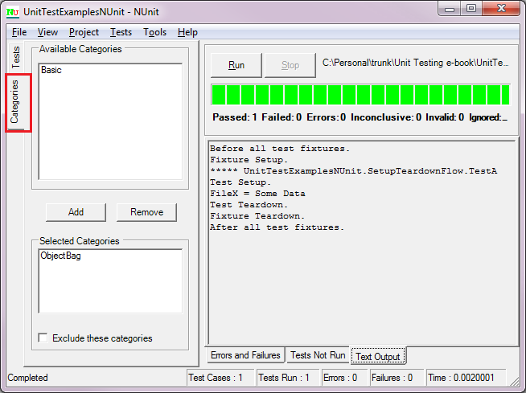
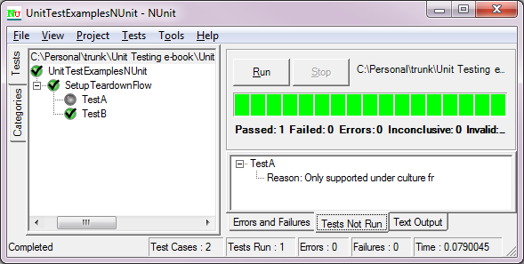
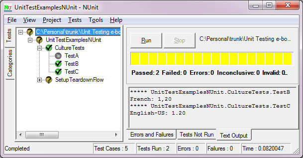
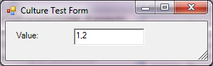
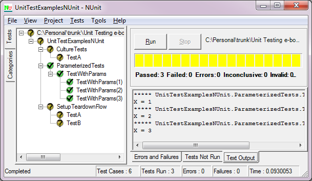
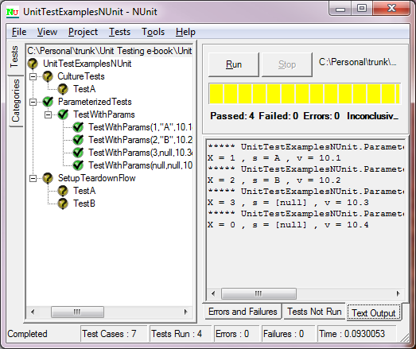
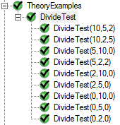

# 第十章用 NUnit 进行单元测试

本章讨论了 NUnit 的测试及其支持的属性和断言。在撰写本文时，使用了 NUnit 2.6.2。这里对属性和断言的描述应该被认为是对在线 NUnit 文档的补充；然而，在大多数情况下，提交人试图提供有价值的补充信息。

## 无属性

下表映射了在 Visual Studio 中使用 NUnit 编写测试时使用的属性:

| 无属性 | Visual Studio 属性 | 描述 |
| 试验夹具 | 测试类 | 定义测试夹具。 |
| 试验 | TestMethod(测试方法) | 在测试夹具类中定义测试方法。 |
| TestFixtureSetUp | 类初始化 | 指定在测试夹具中的所有测试方法运行之前运行的代码。 |
| TestFixtureTearDown | 类清理 | 指定夹具中所有测试完成后运行的代码。 |
| 设置 | 测试化 | 指定在运行每个测试之前要运行的代码。 |
| 拆卸 | 测试清理 | 指定每次测试完成时运行的代码。 |
| 设置固定(见下文) | AssemblyInitialize | 指定加载包含所有测试夹具的程序集时要运行的代码。 |
| 设置固定(见下文) | AssemblyCleanup | 指定卸载包含所有测试夹具的程序集时要运行的代码。 |
| 忽视 | 忽视 | 忽略特定测试。 |
| 描述(也适用于测试夹具) | 描述 | 测试方法的描述。在 NUnit 中，这个属性也可以修饰一个测试夹具。 |

下列 Visual Studio 属性不对应任何 NUnit 属性:

*   物主
*   部署项目
*   主机类型
*   优先
*   工作项
*   CSS 迭代
*   CssProjectStructure
*   TestProperty

### 设置固定属性

应用于类的 SetUpFixture 属性不同于 Visual Studio 的 AssemblyInitialize 和 AssemblyCleanup，因为它应用于给定命名空间中的装置。如果所有的测试设备类都在同一个名称空间中，那么这个属性的行为类似于 AssemblyInitialize 和 AssemblyCleanup。给定代码:

```cs
    namespace UnitTestExamplesNUnit
    {
      [SetUpFixture]
      public class SetupFixtureForNamespace
      {
        [SetUp]
        public void RunBeforeAllFixtures()
        {
          Console.WriteLine("Before all test fixtures.");
        }

        [TearDown]
        public void RunAfterAllFixtures()
        {
          Console.WriteLine("After all test fixtures.");
        }
      }

      [TestFixture]
      public class SetupTeardownFlow
      {
        [TestFixtureSetUp]
        public void SetupFixture()
        {
          Console.WriteLine("Fixture Setup.");
        }

        [TestFixtureTearDown]
        public void TeardownFixture()
        {
          Console.WriteLine("Fixture Teardown.");
        }

        [SetUp]
        public void SetupTest()
        {
          Console.WriteLine("Test Setup.");
        }

        [TearDown]
        public void TeardownTest()
        {
          Console.WriteLine("Test Teardown.");
        }

        [Test]
        public void TestA()
        {
          Console.WriteLine("Test A.");
        }

        [Test]
        public void TestB()
        {
          Console.WriteLine("Test B.");
        }
      }
    }

```

结果输出是:

```cs
    Before all test fixtures.
    Fixture Setup.
    ***** UnitTestExamplesNUnit.SetupTeardownFlow.TestA
    Test Setup.
    Test A.
    Test Teardown.
    ***** UnitTestExamplesNUnit.SetupTeardownFlow.TestB
    Test Setup.
    Test B.
    Test Teardown.
    Fixture Teardown.
    After all test fixtures.

```

但是，添加另一个命名空间:

```cs
    namespace AnotherNamespace
    {
      [SetUpFixture]
      public class AnotherSetupFixtureForNamespace
      {
        [SetUp]
        public void RunBeforeAllFixtures()
        {
          Console.WriteLine("Another before all test fixtures.");
        }

        [TearDown]
        public void RunAfterAllFixtures()
        {
          Console.WriteLine("Another after all test fixtures.");
        }
      }
    }

```

产生以下输出:

```cs
    Another before all test fixtures.
    Another after all test fixtures.
    Before all test fixtures.
    Fixture Setup.
    ***** UnitTestExamplesNUnit.SetupTeardownFlow.TestA
    Test Setup.
    Test A.
    Test Teardown.
    ***** UnitTestExamplesNUnit.SetupTeardownFlow.TestB
    Test Setup.
    Test B.
    Test Teardown.
    Fixture Teardown.
    After all test fixtures.

```

执行特定于名称空间上下文的代码的能力具有能够在不同的装置中组织一套测试的优势，但是所有的测试都在同一个名称空间中，需要特定的设置和拆卸过程。

另请参见下一节“用户定义的动作属性”下的“[装配动作](#sigil_toc_id_141)”。

## 额外的 NUnit 属性

NUnit 有一组广泛的属性，为单元测试提供了相当多的附加功能。

### 试验分组和控制

*   种类
*   套房
*   明确的
*   超时

#### 种类

“类别”属性允许您对测试进行分组，并在选定的类别中运行测试。该属性可以应用于夹具中的测试以及夹具中的单个测试。可以使用/include 和/exclude 参数从控制台运行程序或从 GUI 运行程序中选择特定类别:



图 17:无信息类别

用于选择要包括或排除的类别的选项卡位于图形用户界面运行程序的左侧。

#### 套房

Suite 属性提供了一种以编程方式指定控制台运行程序应该测试的测试装置的方法。此选项仅在控制台运行程序中可用。前面描述的类别属性更好地支持了只运行特定测试或测试套件(装置)的概念。

#### 明确的

此属性指定只有当图形用户界面或控制台运行程序被明确告知通过选择测试来运行测试时，测试才会运行。如果测试是要运行的测试类别的一部分，测试也将运行。

此属性的用途是仅在明确需要时、服务启动并运行时等运行长期运行的测试。

#### 超时

此属性可用于确保测试仅在以毫秒为单位的指定时间内运行。如果测试超过了指定的时间范围，运行人员将取消执行并报告测试失败。

将此属性与下面描述的 MaxTime 属性进行比较。

还要注意，当在调试器中运行单元测试时，超时属性被忽略，否则，您正在调试的测试可能会在您手动遍历代码、检查值等时终止。

### 文化属性

*   文化
*   SetCulture
*   SetUICulture

#### 文化

“区域性”属性可用于夹具，以定义应运行测试的区域性。特定于区域性的测试也应该用这个属性来修饰，描述它们测试的区域性。如果*当前培养物*与为其编写测试的培养物不匹配，则跳过测试或夹具。例如:

```cs
    [TestFixture, SetupData]
    [Culture("fr, en")]
    public class SetupTeardownFlow
    {
      [Test, Category("ObjectBag")]
      [Culture("fr")]
      public void TestA()
      {
        Console.WriteLine("FileX = "+Globals.objectBag["FileX"].ToString());
      }

      [Test, Category("Basic")]
      public void TestB()
      {
       Console.WriteLine("Test B.");
      }
    }

```

在前面的代码中，如果当前区域性是“fr”或“en”，则夹具运行；但是，TestA 指定只有当区域性为“fr”时，才应运行测试。因此，该夹具将导致:



图 18:文化单元测试

因为“TestA”不运行，因为当前区域性不是“fr”。

省略任何区域性规范的测试(如“TestB”)总是会运行，除非由于当前区域性不匹配而排除了整个夹具。

#### SetCulture

此属性应用于整个装置或特定测试，在测试(或装置中的测试)期间设置当前的区域性，然后恢复原始值。与此之前的区域性属性不同，只能指定一个区域性，尽管根据 NUnit 文档，为多个区域性运行测试是未来的增强计划。请注意，在装置中设置区域性不会改变使用“区域性”属性的测试是否运行。例如:

```cs
    [TestFixture]
    [SetCulture("fr-FR")]
    public class CultureTests
    {
      [Test]
      [Culture("fr-FR")]
      public void TestA()
      {
        double value = 1.2;
        Console.WriteLine(value.ToString("0.00", CultureInfo.CurrentCulture));
      }

      [Test]
      public void TestB()
      {
        double value = 1.2;
        Console.WriteLine("French: " + value.ToString("0.00", CultureInfo.CurrentCulture));
      }

      [Test, SetCulture("en-US")]
      public void TestC()
      {
        double value = 1.2;
        Console.WriteLine("English-US: " + value.ToString("0.00", CultureInfo.CurrentCulture));
      }
    }

```

导致 TestA 不运行。还要观察在夹具中设置区域性时 TestB 的默认行为，以及如何在 TestC 中覆盖它:



图 19:在 TestC 中覆盖

#### SetUICulture

该属性应该设置用户界面的区域性；然而，它显然没有任何作用。例如(不要写这样的单元测试，这只是为了举例说明):

```cs
    [TestFixture]
    [SetUICulture("fr-FR")]
    public class CultureTests
    {
      public event EventHandler ValueChanged;

      protected CultureTestForm ctForm;
      protected double val;

      public double Value
      {
        get { return val; }
        set
        {
          val = value;

          if (ValueChanged != null)
          {
            ValueChanged(this, EventArgs.Empty);
          }
        }
      }

      [TestFixtureSetUp]
      public void SetupFixture()
      {
        ctForm = new CultureTestForm();
        ctForm.tbFrench.DataBindings.Add(new Binding("Text", this, "Value"));
      }

      [TestFixtureTearDown]
      public void TeardownFixture()
      {
        ctForm.ShowDialog();
      }

      [Test]
      public void TestA()
      {
        Value = 1.2;
      }
    }

```

导致在我当前的文化中显示“1.2”的值，即 en-US:


图 20:设置文化属性不起作用

如果我将属性更改为“SetCulture”，那么用户界面将以正确的区域性格式显示该值(您可能需要眯着眼睛才能看到“1 点 2”和“1 个逗号 2”之间的区别:



图 21:设置文化改变用户界面表示

### 参数化测试

参数化测试是单元测试描述参数及其值的测试，这些参数及其值将用于迭代运行测试，直到所有参数组合都运行。

例如，这个测试:

```cs
    [TestFixture]
    public class ParameterizedTests
    {
      [Test]
      public void TestWithParams([Values(1, 2, 3)] int x)
      {
        Console.WriteLine("X = " + x);
      }
    }

```

结果如下所示(注意测试图也显示了测试参数):



图 22:参数化测试

以下属性用于参数化测试:

*   价值观念
*   价值来源
*   组合的
*   成对(未实现)
*   连续的
*   随意
*   范围
*   判例案件
*   TestCaseSource

#### 价值观念

如前一个示例所示，Values 属性用于为每个参数指定传递到测试方法中的值。因为这些是在属性中赋值的值，所以它们必须是值类型:常量表达式、表达式类型或属性类型数组。

还要注意，默认情况下，NUnit 将测试每个参数值的每个组合(请参见属性组合、成对和顺序)。

#### 价值来源

使用 ValueSource 属性，可以为特定参数的值指定一个 IEnumerable 源。源可以是单独类或当前类的字段、属性或方法。例如，这些都是表达价值来源的有效方式:

```cs
    public class NumeratorList
    {
      protected List<int> values;

      public IEnumerable Values {get {return values;}}

      public NumeratorList()
      {
        values = new List<int>() {10, 20, 30};
      }
    }

    public class DenominatorList
    {
      public List<int> values = new List<int>() { 1, 2, 3 };
    }

    [TestFixture]
    public class ValueSourceExamples
    {
      List<int> results = new List<int>() { 10, 10, 10};

      [Test, Sequential]
      public void DivideTest(
        [ValueSource(typeof(NumeratorList), "Values")] int n,
        [ValueSource(typeof(DenominatorList), "values")] int d,
        [ValueSource("results")] int expectedResult)
      {
        int r = MyMath.Divide(n, d);
        Assert.AreEqual(expectedResult, r);
      }
    }

```

请注意测试中顺序属性的使用，它确保源值是顺序使用的，而不是组合使用的。因此，结果是:


图 23:价值来源测试

#### 组合的

该属性是可选的，因为 NUnit 将自动在所有可能的组合中应用测试参数。例如:

```cs
    [TestFixture]
    public class ParameterizedTests
    {
      [Test, Combinatorial]
      public void TestWithParams(
         [Values(1, 2, 3)] int x,
         [Values("A", "B")] string s)
      {
        Console.WriteLine("X = " + x + " , " + s);
      }
    }

```

导致“x”和“s”的所有组合，无论是否指定了“组合”:


图 24:组合测试

#### 成对地

此属性存在，但未实现—它旨在减少指定组合参数时的组合数量；但是，该属性被忽略。

#### 连续的

该属性指定测试将通过依次遍历参数值来运行。如果每个参数的值的数量不同，将使用默认值。请注意，字符串的默认值为 null。例如，这段代码使用顺序属性:

```cs
    [TestFixture]
    public class ParameterizedTests
    {
      [Test, Sequential]
      public void TestWithParams(
      [Values(1, 2, 3)] int x,
      [Values("A", "B")] string s,
      [Values(10.1, 10.2, 10.3, 10.4)] double v)
      {
        Console.WriteLine("X = " + x + " , s = " + ((s == null) ? "[null]" : s) + " , v = " + v);
      }
    }

```

产生以下输出:



图 25:顺序属性

注意字符串(只有两个值)在最后两个参数化测试中默认为 null，而 int 参数有三种情况，在最后一种情况下默认为 0。

#### 随意

随机属性可以应用于组合参数化测试，以提供随机值，而不是参数的特定值。随机值参数总是双精度类型。例如:

```cs
    [TestFixture, Platform("Windows7")]
    public class ParameterizedTests
    {
      [Test]
      public void RandomTest([Random(5)] double x)
      {
        Console.WriteLine("X = " + x);
      }
    }

```

五次随机值测试的结果:


图 26:随机测试

也可以为随机值范围指定最小值和最大值。

使用组合参数化测试很容易创建数百个(如果不是数千个)测试用例。考虑使用顺序属性来防止大量组合被测试。应用于测试的顺序属性可以与测试参数的随机属性结合使用。

#### 范围

范围属性指定要测试的值的范围。除了整数范围，其他范围(长、浮点、双精度)都需要指定步长。整数值的步骤是可选的。

范围与其他参数化值组合在一起，因此再次考虑使用顺序属性来限制生成的测试组合的数量。

#### 判例案件

您可以显式地定义传递给每个测试用例的参数值，以便为特定测试运行，而不是组合或顺序参数化测试。这具有减少组合测试的数量以及针对特定测试场景的优势。此外，TestCase 属性包括能够将返回值(只要它是“值”类型)测试为属性元数据中指定的值的附加特性。最后，其他属性，如镜像属性，在 TestCase 属性中公开。

一个基本的测试用例如下所示(注意缺少 TestFixture 属性):

```cs
    public class TestCaseExamples
    {
      public int Divide(int n, int d)
      {
        return n / d;
      }

      [TestCase(10, 2)]
      [TestCase(20, 10)]
      public void DivideTest(int n, int d)
      {
        int r = Divide(n, d);
        Assert.AreEqual(r, n / d);
      }
    }

```

然而，TestCase 属性的真正力量在于能够将测试用例直接应用于方法并检查结果:

```cs
    public class TestCaseExamples
    {
      [TestCase(10, 2, Result=5)]
      [TestCase(20, 10, Result=2)]
      public int Divide(int n, int d)
      {
        return n / d;
      }
    }

```

请记住，属性中指定的值必须是值类型:常量表达式、表达式类型或属性参数类型的数组创建表达式。

还要注意，TestCase 属性可能会鼓励测试用例与生产代码放在同一个程序集中，而不是放在单独的测试程序集中——属性不会在程序集的发布版本中被移除。建议在使用 TestCase 属性时，不要将属性直接应用于您想要测试用例的代码，而是测试夹具本身。因此，理想情况下，正确的代码应该如下所示:

```cs
    // In the application's assembly:
    public static class MyMath
    {
      public static int Divide(int n, int d)
      {
        return n / d;
      }
    }

    // In the unit test assembly:
    [TestFixture]
    public class TestCaseExamples
    {
      [TestCase(10, 2, Result=5)]
      [TestCase(20, 10, Result=2)]
      public int DivideTest(int n, int d)
      {
        return MyMath.Divide(n, d);
      }
    }

```

其中 MyMath 类在应用程序的程序集中，测试夹具在单元测试程序集中。然后，division 方法成为应用程序方法的一个薄包装器。

本例中说明了可以分配给测试夹具的其他属性:

```cs
    [TestFixture]
    public class TestCaseExamples
    {
      [TestCase(10, 2,
        Result=5,
        Description = "Normal usage.",
        TestName = "Normal divide test.")]
      [TestCase(5, 0,
        ExpectedException=typeof(ArgumentOutOfRangeException),
        Description = "Divide by 0 test.",
        TestName = "Divide by 0 test.")]
      [TestCase(10, 5,
        Result=2,
        Ignore = true,
        Reason = "Already tested normal usage.")]
      [TestCase(15, 5,
        Result=3,
        IgnoreReason = "Yet another already tested normal usage.")]
      public int DivideTest(int n, int d)
      {
        return MyMath.Divide(n, d);
      }
    }

```

还有指定预期异常的替代方法:

*   预期异常名称
*   预期异常消息
*   数学类型

它允许您指定全名(匹配类型的值。全名属性)或异常消息，以及异常消息应该如何匹配—包含、精确、正则表达式或开始开关。

#### TestCaseSource

TestCaseSource 属性的行为类似于前面描述的 ValueSource 属性；但是，首选的实现是指定一个实现 IEnumerable 的类类型。这种首选实现将您限制在这样的情况下:

```cs
    public class ValuesList : IEnumerable
    {
      public List<int[]> values = new List<int[]>()
        {
          new int[] {10, 1, 10},
          new int[] {20, 2, 10},
          new int[] {30, 3, 10} };

      public IEnumerator GetEnumerator()
      {
        return new ValuesListEnum(values);
      }
    }

    public class ValuesListEnum : IEnumerator
    {
      protected List<int[]> values;
      protected int pos = -1;

      public ValuesListEnum(List<int[]> values)
      {
        this.values = values;
      }

      public bool MoveNext()
      {
        ++pos;

        return pos < values.Count;
      }

      public object Current
      {
        get { return values[pos]; }
      }

      public void Reset()
      {
        pos = -1;
      }
    }

    [TestFixture]
    public class TestCaseSourceExamples
    {
      [Test, Sequential]
      [TestCaseSource(typeof(ValuesList))]
      public void DivideTest(int n, int d, int expectedResult)
      {
        int r = MyMath.Divide(n, d);
        Assert.AreEqual(expectedResult, r);
      }
    }

```

请注意测试用例值如何是 int[](整数数组)，其中数组的每个元素映射到测试函数中的一个参数。还要注意的是，顺序属性是为测试指定的，确保测试数据是顺序使用的，而不是组合使用的。

### 其他属性

还有其他几个 NUnit 属性，将在下面描述。

#### 平台

平台属性可用于指定测试应该运行的平台。如果平台与当前平台不匹配，测试将不会运行，甚至不会包含在被忽略的测试或测试总数中。查看[http://www.nunit.org/index.php?p=platform&r = 2 . 6 . 2](http://www.nunit.org/index.php?p=platform&r=2.6.2)的文档，查看支持的平台说明符列表。

#### 财产

您可以使用该属性在测试或夹具上设置名称或值对，然后显示在 XML 输出文件中。通过反射，您可以访问这些属性。也可以通过从属性属性类派生自定义属性类来创建自定义属性属性。

#### 最大时间

MaxTime 属性(如果与前面描述的超时属性相比较)将导致测试失败，如果它超过以毫秒为单位的指定时间。但是，与超时属性不同，测试将被允许完成。

#### 重复

重复属性只能应用于测试，对于参数化测试，该属性被忽略。它指示测试引擎重复测试指定的次数。如果重复测试失败，则不运行其余测试，发动机报告失败。

#### 要求数据

使用此属性，您可以指定单元测试所需的其他程序集(在 AssemblyInfo 文件中)。

#### 要求数据

该属性应用于测试或夹具，指示测试应该在多线程单元中运行。如果出现以下情况，NUnit 将为测试创建一个新线程:

*   程序集尚未在 MTA 线程上运行。
*   包含夹具尚未在 MTA 螺纹上运行。

如果为整个夹具创建了一个螺纹，则该夹具中的所有测试都在新螺纹上运行。

#### 要求 a

此属性应用于测试或夹具，表示测试应该在单线程单元中运行。如果出现以下情况，NUnit 将为测试创建一个新线程:

*   程序集尚未在 STA 线程上运行。
*   包含夹具尚未在 STA 线程上运行。

如果为整个夹具创建了一个螺纹，则该夹具中的所有测试都在新螺纹上运行。

#### 要求阅读

应用于测试或夹具的该属性指示测试应该在单独的线程中运行。如果在 AssemblyInfo 文件中指定了此属性，则不会创建新线程:

```cs
    [assembly:RequiresThread]

```

如果夹具指定了该属性，夹具中的所有测试都在新创建的线程上运行。

如果测试指定了此属性，测试将在新创建的线程上运行。

或者，也可以指定单元状态，这将导致创建 MTA 或 STA 线程。

例如:

```cs
    [TestFixture, RequiresThread]
    public class ThreadExamples
    {
      [Test]
      public void TestA()
      {
        Console.WriteLine(Thread.CurrentThread.ManagedThreadId);
      }

      [Test, RequiresThread]
      public void TestB()
      {
        Console.WriteLine(Thread.CurrentThread.ManagedThreadId);
      }

      [Test]
      public void TestC()
      {
        Console.WriteLine(Thread.CurrentThread.ManagedThreadId);
      }
    }

```

请注意测试运行时的线程标识:


图 27:线程示例

测试 A 和测试 C 在夹具创建的线程上运行，而测试 B 在指定了 RequiresThread 属性后，在与夹具中其他测试不同的线程上运行。

#### 理论和数据点

理论是一种参数化测试，用于验证关于传入值的假设。如果假设失败，测试不会失败。它与数据点属性一起工作。

这两个类是等价的。第一个说明了数据点属性的使用，第二个说明了数据点属性:

```cs
    public class TheoryExample1
    {
      [Datapoint]
      public int a = 10;
      [Datapoint]
      public int b = 5;
      [Datapoint]
      public int c = 2;
      [Datapoint]
      public int d = 0;

      [Theory]
      public void DivideTest(int n, int d, int expectedResult)
      {
        Assume.That(d > 0);
        Assume.That(n / d == expectedResult);

        int r = MyMath.Divide(n, d);
        Assert.AreEqual(expectedResult, r);
      }
    }

    public class TheoryExample2
    {
      [Datapoints]
      public int[] values = new int[] { 10, 5, 2, 0 };

      [Theory]
      public void DivideTest(int n, int d, int expectedResult)
      {
        Assume.That(d > 0);
        Assume.That(n/d == expectedResult);

        int r = MyMath.Divide(n, d);
        Assert.AreEqual(expectedResult, r);
      }
    }

```

注意在第一个类，理论示例 1 中，使用离散数据点值，而在第二个类，理论示例 2 中，使用数组。

在这两种情况下，NUnit 将从数据点创建所有可能的值组合。注意测试方法如何做出某些假设:

*   分母不能为 0。
*   预期结果必须等于 n/d。

第二个假设的原因是，大多数组合的测试都会失败——例如，5/10 不等于 2。从测试运行中可以看出，假设不会导致测试失败:



图 28:理论

测试中省略了未通过假设的参数值组合。理论测试的典型模式是:

*   陈述关于参数的假设。
*   执行测试。
*   对结果做出断言。

理论测试应该小心，因为参数组合的数量激增。

还要注意，除非明确指定，否则 NUnit 将自动填充 bool 和 enum 类型的参数值组合。

## 用户定义的动作属性

动作属性是用户定义的属性，允许为每个测试合成不相关的测试设置代码。通常，将所有设置代码放在夹具或命名空间设置中违反了单一责任原则——一些测试需要某些设置，而其他测试需要其他设置。操作属性允许您精确指定测试所需的设置。

用户定义的动作属性的一个优点是，它将设置和拆卸代码移出夹具本身，进入一个更可重用和可维护的代码库。

### 定义动作

用户定义的操作或者从 TestActionAttribute 派生:

```cs
    public class UserDefinedAttribute : TestActionAttribute
    {
      public override void BeforeTest(TestDetails testDetails)
      {
        Console.WriteLine("User defined action before test.");
      }

      public override void AfterTest(TestDetails testDetails)
      {
        Console.WriteLine("User defined action after test.");
      }
    }

```

或者可以从系统中导出。属性并实现 ITestAction 接口:

```cs
    public class AnotherUserDefinedAttribute : Attribute, ITestAction
    {
      public ActionTargets Targets { get { return ActionTargets.Default; } }

      public void BeforeTest(TestDetails testDetails)
      {
        Console.WriteLine("Another user defined action before test.");
      }

      public void AfterTest(TestDetails testDetails)
      {
        Console.WriteLine("Another user defined action after test.");
      }
    }

```

在后一种情况下，还必须定义属性“目标”。

### 行动目标

可以通过 ActionTargets 枚举(在 NUnit 中定义)来定义动作目标(固定设备或套件)或测试方法。框架):

```cs
    // Summary:
    //     The different targets a test action attribute can be applied to.
    [Flags]
    public enum ActionTargets
    {
      // Summary:
      //     Default target, which is determined by where the action attribute is attached.
      Default = 0,
      //
      // Summary:
      //     Target an individual test case.
      Test = 1,
      //
      // Summary:
      //     Target a suite of test cases.
      Suite = 2,
      }
    }

```

#### ActionTargets。默认

指定 ActionTargets 的值。默认允许用户定义的属性应用于测试装置(类)和测试(方法)。然而，当应用到一个夹具(类)时，属性的行为就像 ActionTargets 一样。已经指定了套件-用户定义的操作对整个测试套件运行一次。

#### ActionTargets。试验

如果 ActionTargets。测试由用户定义的操作返回，这改变了调用用户定义的操作时的行为。如果应用于夹具(类)，则为每个测试执行用户定义的动作*。*如果用户属性被应用于特定的测试，那么用户定义的动作被执行用于该特定的测试。

#### ActionTargets。套房

如果属性操作目标是一个套件，但在测试方法的上下文中使用，则不会报告错误—操作根本不会运行。

#### 测试和套件行动目标

ActionTargets 是标志，因此它们可以组合在一起:

```cs
    public ActionTargets Targets
    {
      get
      {
        return ActionTargets.Suite | ActionTargets.Test;
      }
    }

```

指定用户定义的动作应该为夹具(测试套件)和单独的测试执行。

### 测试细节类

这个类用即将运行的夹具或测试的信息来实例化(从 NUnit。框架.测试细节):

```cs
    // Summary:
    //     The fixture that the test is a member of, if available.
    public object Fixture { get; }
    //
    // Summary:
    //     The full name of the test.
    public string FullName { get; }
    //
    // Summary:
    //     Indicates if the test represents a suite of tests.
    public bool IsSuite { get; }
    //
    // Summary:
    //     The method that implements the test, if available.
    public MethodInfo Method { get; }
    //
    // Summary:
    //     A string representing the type of test, e.g. "Test Case".
    public string Type { get; }

```

可以检查这些属性并采取特定的操作，例如提供额外的控制台输出诊断消息。

### 装配动作

遵循 Visual Studio 的 AssemblyInitialize 和 AssemblyCleanup 概念，可以使用基于程序集的用户操作。例如，在前面的代码中，如果将以下行添加到 AssemblyInfo.cs 文件中:

```cs
    [assembly: UnitTestExamplesNUnit.UserDefined]

```

然后，用户定义的操作将在加载程序集时运行:

```cs
    User-defined action before test.
    Before all test fixtures.
    Fixture Setup.
    ***** UnitTestExamplesNUnit.SetupTeardownFlow.TestA
    Test Setup.
    Test A.
    Test Teardown.
    ***** UnitTestExamplesNUnit.SetupTeardownFlow.TestB
    Test Setup.
    Test B.
    Test Teardown.
    Fixture Teardown.
    After all test fixtures.
    User defined action after test.

```

如果用户定义动作的目标动作是套件，则用户定义动作在所有夹具测试之前和之后执行，表现为“在所有套件之前或之后”但是，请注意，如果目标操作。指定测试后，动作在所有套件中的所有测试之前或之后运行。因此，应该注意 Target 属性的返回值和用户定义动作的期望行为。

### 从用户定义的动作向/从测试传递信息

两个问题可能是:

*   如何将信息从夹具传递到用户定义的动作？
*   如何在测试中使用由用户定义的动作实例化的对象？

#### 将信息传递给用户定义的操作

这直接作为用户操作的参数来处理。假设您想要传入一个连接字符串来测试特定用户角色的行为。例如，使用这个存根:

```cs
    public class InitializeDatabaseConnection : TestActionAttribute
    {
      protected string connection;

      public InitializeDatabaseConnection(string myConnection)
      {
        connection = myConnection;
      }

      public override void BeforeTest(TestDetails testDetails)
      {
        Console.WriteLine("Using " + connection);
      }

      public override void AfterTest(TestDetails testDetails)
      {
        Console.WriteLine("Closing connection.");
      }
    }

```

并将其应用于夹具:

```cs
    [TestFixture, InitializeDatabaseConnection("Username=Foo, Password=Bar")]
    public class SetupTeardownFlow
    {
      ... etc ...

```

导致以下测试流程:

```cs
    Before all test fixtures.
    Fixture Setup.
    Using Username=Foo, Password=Bar
    ***** UnitTestExamplesNUnit.SetupTeardownFlow.TestA
    Test Setup.
    Test A.
    Test Teardown.
    ***** UnitTestExamplesNUnit.SetupTeardownFlow.TestB
    Test Setup.
    Test B.
    Test Teardown.
    Closing connection.
    Fixture Teardown.
    After all test fixtures.

```

请注意，套件的用户定义操作是在“名称空间”设置之后和夹具设置之后执行的。如果用户定义的操作需要一些不能使用构造函数传递的信息(属性构造函数仅限于常量)，那么类似下面概述的方法可能会有用。但是，请记住，用户定义的操作应该尽可能自主，避免与测试状态纠缠在一起。

#### 将信息从用户定义的动作传递到测试/测试套件

如果没有某种形式的跨界集装箱，这是不可能的。一个极其简单的实现是从键值字典创建一个对象包:

```cs
    /// <summary>
    /// A wrapper class for a key-value lookup.
    /// </summary>
    public class ObjectBag : Dictionary<string, object>
    {
    }

    /// <summary>
    /// A global container class.
    /// </summary>
    public static class Globals
    {
      public static ObjectBag objectBag = new ObjectBag();
    }

```

这允许断开连接的对象轻松共享数据，例如在用户定义的操作属性中:

```cs
    public class SetupData : TestActionAttribute
    {
      public override void BeforeTest(TestDetails testDetails)
      {
        Globals.objectBag["FileX"] = "Some Data";
      }
    }

```

然后可以在测试方法中访问数据:

```cs
    [Test]
    public void TestA()
    {
      Console.WriteLine("FileX = "+Globals.objectBag["FileX"].ToString());
    }

```

存在更复杂的方法，前面的示例旨在说明如何协调用户定义的操作和信息共享。前面的例子有许多问题——类型安全，没有检查容器中是否已经存在对象，等等——健壮的容器类应该处理这些问题。

## 无核心断言

NUnit 在 NUnit 中提供了相同或相似的断言。如前所述，可以在 Visual Studio 的 Assert 类中找到断言类。NUnit 还提供了额外的断言:

### IsEmpty/IsNotEmpty

这些断言验证字符串是否为空，或者集合是否为空:

```cs
    [TestFixture]
    public class OtherAssertions
    {
      [Test]
      public void IsEmptyTest()
      {
        List<object> itemList = new List<object>();
        Assert.IsEmpty(itemList);
      }
    }

```

### 更大/更小

这两个断言处理数值和实现 IComparable 的对象，断言第一个值大于或小于第二个值。这个断言的目的是提高测试的可读性。

### 大于等于/小于等于

这两个断言处理数值和实现 IComparable 的对象，断言第一个值要么“大于或等于”要么“小于或等于”第二个值。这个断言的目的是提高测试的可读性。

### isAssignableFrom/is NotAssignableFrom

这一对方法断言期望的类型可以从兼容类型的对象实例中赋值。这类似于 Visual Studio 测试引擎中的 IsInstanceOfType 断言。例如，假设:

```cs
    public class A { }
    public class B : A { }

    [TestFixture]
    public class OtherAssertions
    {
      [Test]
      public void IsAssignableFrom()
      {
        Assert.IsAssignableFrom(typeof(B), new A());
      }
    }

```

此测试通过，因为类型 A 的对象可以被分配一个类型 b 的实例

### 投掷/投掷<T>/不投掷

此断言的非泛型形式验证调用指定方法时是否引发了异常。例如:

```cs
    [Test]
    public void DivideByZeroThrownTest()
    {
      Assert.Throws(typeof(ArgumentOutOfRangeException), () => MyMath.Divide(5, 0));
    }

```

这个测试通过了。

通用版本将异常类型作为通用参数:

```cs
    [Test]
    public void DivideByZeroThrownTest()
    {
      Assert.Throws<ArgumentOutOfRangeException>(() => MyMath.Divide(5, 0));
    }

```

### 接住/接住< T >

这两个方法断言一个方法抛出一种类型的异常或从它派生的异常。相比之下，在此之前的抛出方法断言恰好抛出了指定的异常类型。例如，这段代码传递:

```cs
    [Test]
    public void CatchTest()
    {
      Assert.Catch<Exception>(() => MyMath.Divide(5, 0));
    }

```

## 集合断言

在努涅特。框架. CollectionAssert 类，NUnit 实现了与 Visual Studio 的 CollectionAssert 类中相同的断言，具有以下附加断言:

*   IsEmpty/IsNotEmpty
*   被命令

请注意，这些方法中的集合参数期望集合实现 IEnumerable(与 Visual Studio 的测试框架形成对比，后者期望 ICollection)。

### IsEmpty/IsNotEmpty

CollectionAssert。IsEmpty 方法与 Assert 方法相同。IsEmpty 方法。

### 被命令

此方法验证集合中的值是否有序。例如，因为一个对象实现了 IComparable:

```cs
    public class AnObject : IComparable
    {
      public int SomeValue { get; set; }

      public override bool Equals(object obj)
      {
        return SomeValue == ((AnObject)obj).SomeValue;
      }

      public int CompareTo(object obj)
      {
        return SomeValue.CompareTo(((AnObject)obj).SomeValue);
      }
    }

```

该测试通过:

```cs
    [Test]
    public void OrderedObjectTest()
    {
      List<object> itemList = new List<object>()
      {
        new AnObject() { SomeValue = 1 },
        new AnObject() { SomeValue = 2 }
      };

      CollectionAssert.IsOrdered(itemList);
    }

```

## 字符串断言

这些断言方法是 NUnit 的成员。和与 Visual Studio 的 StringAssert 类中的相同，但有一些不同:

*   AreEqualIgnoringCase
*   伊斯马特

这将在下面讨论。

### AreEqualIgnoringCase

断言“AreEqualIgnoringCase”执行两个字符串的比较，忽略大小写。

### -= ytet-伊甸园字幕组=-翻译:粒粒尘紫月猫姐校对

这种方法类似于 Visual Studio 的 StringAssert。Matches 方法—它断言一个字符串匹配一个正则表达式模式。

## 文件断言

这些断言方法是 NUnit 的成员。框架。文件断言类。

### 面积相等/砂岩

这些方法断言两个文件是否相同。对这两个文件进行逐字节比较。如果文件为空，则认为它们是相等的。如果其中一个或两个文件都不存在，将引发 FileNotFoundException。

## 目录断言

这些断言方法是 NUnit 的成员。框架。目录支持类。

### 面积相等/砂岩

这些方法断言两个目录中的文件相等或不相等。

### IsEmpty/IsNotEmpty

这些方法断言目录是否为空。

### 是在/不是在内

这些方法断言路径是否包含指定的子目录。

## 其他断言

### 那个

虽然这种方法的一种形式确实将布尔参数作为真理的断言(行为完全类似于 Assert。这种方法的主要形式是能够使用特定的约束来比较实际值。关于约束的 [NUnit 文档](http://www.nunit.org/index.php?p=constraintModel&r=2.6.2)在约束方面非常广泛，因此这里只提供一个简短的例子。例如，给定这个测试:

```cs
    [TestFixture]
    public class CollectionTests
    {
      [Test]
      public void AreEquivalentTest()
      {
        List<object> itemList1 = new List<object>()
        {
            new AnObject() { SomeValue = 1 },
            new AnObject() { SomeValue = 2 }
        };
        List<object> itemList2 = new List<object>()
        {
            new AnObject() { SomeValue = 2 },
            new AnObject() { SomeValue = 1 }
        };

        CollectionAssert.AreEquivalent(itemList1, itemList2);
      }
    }

```

使用约束系统，断言可以重写为:

```cs
    [TestFixture]
    public class CollectionTests
    {
      [Test]
      public void AreEquivalentTest()
      {
        List<object> itemList1 = new List<object>()
        {
            new AnObject() { SomeValue = 1 },
            new AnObject() { SomeValue = 2 }
        };
        List<object> itemList2 = new List<object>()
        {
            new AnObject() { SomeValue = 2 },
            new AnObject() { SomeValue = 1 }
        };

        Assert.That(itemList1, Is.EquivalentTo(itemList2);
      }
    }

```

约束语法有助于单元测试的可读性，也促进了新方法的可扩展架构。

### 伊斯南

此方法测试双精度值是否为“非数字”值不是数字的典型情况是除以零或负值的平方根。

## 实用方法

assert 类还提供了几种实用方法:

### 通过

断言。Pass 通过引发 SuccessException 立即结束测试，这将导致测试被标记为通过。

### 失败

断言。失败通过引发 AssertionException 立即结束测试，这将导致测试被标记为失败。

### 忽略

断言。忽略通过抛出一个 IgnoreException 立即结束测试，报告测试被忽略。

### 不确定

断言。非决定性的通过抛出一个 InconclusiveException 立即结束测试，报告测试为非决定性的。当一个单元测试或夹具确定一个需要的服务被关闭，因此针对该服务的测试不能继续时，这可能是有用的。