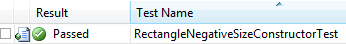
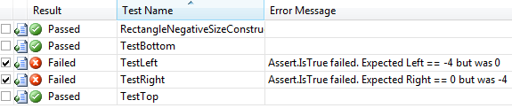

# 第 12 章用于其他目的的单元测试

单元测试对于其他目的也是有价值的。

## 作为用法的例子

单元测试的一个附带好处是它创建了一个大的代码库来示范如何使用代码。例如，我们之前看到的代码:

```
    [Test]
    public void FilenameParsingTest()
    {
    Dictionary<string, string> options = CommandLineParser.Parse("-f foobar");
    Assert.That(options.Count == 1, "Count expected to be 1");
    Assert.That(options.ContainsKey("-f"), "Expected option '-f'");
    Assert.That(options["-f"] == "foobar");
    }

```

记录命令行分析器的预期有效用例。还要考虑编写单元测试——不仅是为你自己的代码，也是为第三方库提供例子。(参见随后的例子和揭示的关于矩形结构的有趣的事情。)

## 黑盒测试

黑盒测试假设您对类或服务的内部一无所知，并且严格地从公开的接口中验证它的行为。当您没有可用的代码时，这通常是必要的。例如，当与记录管理公司合作时，我们需要使用政府机构提供的网络服务来更新记录。通过为 web 服务编写单元测试，我们能够证明提供给我们的文档没有导致 web 服务的预期行为。

当使用不同部门提供的代码时，也可以使用这种技术。例如，数据库组可能有自己的白盒单元测试；但是，您还应该通过检查向您公开的功能的事务结果来验证从黑盒的角度来看，触发器和约束已经被正确编程。

## 测试你的假设

单元测试是一种简单的方法，可以将一些关于我们对应用编程接口的假设的测试组合在一起。我们以`System.Drawing.Rectangle`结构为例，测试一些看似合理的实现假设。

### 测试构造器假设

有两个`Rectangle`构造函数:一个具有`Point`和`Size`参数，另一个具有 x，y，宽度和高度参数。文档没有说明大小(宽度或高度)是否必须是正的，所以让我们写一个测试来验证我们可以构造一个宽度或高度为负的矩形:

```
    [TestMethod]
    public void RectangleNegativeSizeConstructorTest()
    {
        Rectangle r = new Rectangle(0, 0, -4, -6);
    }

```

我们在这个测试中所做的就是验证当我们构造矩形时没有抛出异常，事实上，情况就是这样:



图 29:矩形构造函数测试

### 测试关于属性值的假设

现在让我们测试一下我们对某些属性的假设。属性`Top`、`Left`、`Bottom`、`Right`描述如下(见
[:](http://msdn.microsoft.com/en-us/library/system.drawing.rectangle.aspx)

顶部:获取此矩形结构上边缘的 y 坐标。

左:获取此矩形结构左边缘的 x 坐标。

底部:获取 Y 坐标，它是此矩形结构的 Y 和高度属性值的总和。

右:获取该矩形结构的 X 和宽度属性值之和的 X 坐标。

因此，对于前面的矩形，具有负的宽度和高度，因此具有坐标[(-4，-6)，(0，0)]，我们将做出以下假设:

```
    [TestMethod]
    public void TestLeft()
    {
        Rectangle r = new Rectangle(0, 0, -4, -6);
        Assert.IsTrue(r.Left == -4, "Expected Left == -4 but was " + r.Left);
    }

    [TestMethod]
    public void TestTop()
    {
        Rectangle r = new Rectangle(0, 0, -4, -6);
        Assert.IsTrue(r.Top == 0, "Expected Top == 0 but was " + r.Top);
    }

    [TestMethod]
    public void TestRight()
    {
        Rectangle r = new Rectangle(0, 0, -4, -6);
        Assert.IsTrue(r.Right == 0, "Expected Right == 0 but was " + r.Right);
    }

    [TestMethod]
    public void TestBottom()
    {
        Rectangle r = new Rectangle(0, 0, -4, -6);
        Assert.IsTrue(r.Bottom == -6, "Expected Bottom == -6 but was " + r.Bottom);
    }

```

然而，事实并非如此:



图 30:测试关于矩形属性的假设

事实上，顶部和底部的确定似乎也完全是任意的，因为我在完全相同的矩形尺寸上运行了测试，并且在`Top`和`Bottom`属性值上观察到了不同的结果。

### 对方法结果的测试假设

MSDN 文件规定`Rectangle.Intersect`方法:

*   *返回第三个矩形结构，表示另外两个矩形结构的交集。*
*   *如果没有交集，则返回一个空的矩形。*

因此，我们可以构建一个简单的测试:

```
    [TestMethod]
    public void TestIntersection()
    {
        Rectangle r1 = new Rectangle(0, 0, 10, 10);
        Rectangle r2 = new Rectangle(10, 10, 5, 5);
        Assert.IsFalse(r1.IntersectsWith(r2), "Expected R1 and R2 not to intersect.");
        Assert.IsTrue(Rectangle.Intersect(r1, r2) == Rectangle.Empty,
                        "Expected an empty intersection rectangle.");
    }

```

结果是:


图 31:测试我们对方法回报的假设

这告诉我们，我们基于文档的预期是不正确的。