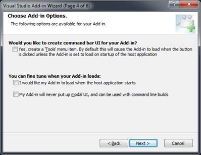
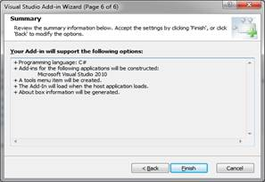

# 第二章外挂《你好世界》

自从《C 编程语言》一书中的经典示例以来，Hello World 程序一直是新示例程序的起点。在本章中，我们将使用项目向导来创建这个经典示例的 Visual Studio 外接程序版本。

## 创建项目

要创建新的外接程序项目，我们将使用 Visual Studio 内置的外接程序向导:

1.  打开 Visual Studio，在**文件**菜单中选择**新项目**。
2.  从**已安装模板**列表中选择**其他项目类型**。
3.  选择**延展性**。


图 1:创建一个新项目

您可以创建两种类型的外接程序，一种可以加载到 Visual Studio 中(这是本书的重点)，另一种是可以跨不同 Microsoft 产品(如 Word、Excel、Outlook 等)使用的共享外接程序。).

|  | 注意:我们在本书中创建的所有插件模块都将从向导屏幕开始，因此您会使用它很多次。与手动创建实现类代码和 XML 文件相比，这绝对是一个省时的方法。 |

### 选择你的语言

向导启动后，您将可以选择生成代码的编程语言。选项包括:

*   Visual C#
*   visualbasic 语言
*   Visual C++ /CLR
*   Visual C++/ATL

对于本书中的示例，我们将使用 Visual C#，但是您可以使用您最适合编程的任何语言。此选择决定了生成外接程序项目的语言，但不影响外接程序的运行或使用。

### 应用主机

应用程序主机选择屏幕允许您指示哪些主机应用程序可以运行您的外接程序。选项包括:

*   可视化工作室
*   Visual Studio 宏

您可以选择一个或两个选项。对于本书中的例子，我们只需要选择 Visual Studio。该插件 XML 文件将包含一个``<`` ``HostApplication`` ``>`` 条目，用于所选的每个选项。本书中的大多数外接程序都有一个用户界面组件，所以您不应该需要选择 Visual Studio 宏。

|  | 注意:使用 Visual Studio 宏时，交互命令如 LaunchWizard、OpenFile 等。不可用。其他命令(如退出)的行为不同。例如，“退出”命令关闭宏集成开发环境并返回到 Visual Studio，而不是关闭 Visual Studio 本身。 |

### 名称和描述

您可以为外接程序提供名称和描述。该名称将用作菜单标签以及代码实现的命令的内部名称。描述存储为工具提示文本，当用户从**插件管理器**窗口选择插件时，IDE 会显示该文本。


图 2:向外接程序添加名称和描述

|  | 注意:当引用您的外接程序模块的命令时，向导将生成一个唯一的、合格的命令名，包括 <filename>.Connect. <commandname>。</commandname></filename> |

### 插件选项

外接程序选项屏幕有助于控制为外接程序生成的代码。在我们的例子中，我们将把我们的类挂入**工具**菜单，所以我们选择第一个选项在 Connection 方法上生成代码来加载我们的外接程序。



图 3:插件选项

出于调试目的，当主机应用程序启动时，不要选中**加载插件**复选框。忽略此选项将使调试更容易。当您准备部署应用程序时，在启动时加载外接程序是一个简单的更新。

|  | 注意:在一些示例中，我们可能会连接到不同的菜单或工具栏，但是让向导生成默认方法仍然是有益的，即使我们调整了它的代码。 |

### 关于信息

**关于信息**选项允许您指定要在 Visual Studio **关于**框中显示的文本。运行**关于 Visual Studio** 菜单选项时，对话框显示所有已安装产品的列表，包括加载项。当用户导航到您的外接程序时，您提供的任何信息都将显示在外接程序列表下方。

### 总结

填写完所有信息后，将显示一个摘要屏幕:



图 4:插件选项摘要

再次检查您的选择，如果它们看起来都没问题，请单击**完成*。*** 向导会工作一会儿，然后生成一个源文件，为 **IDTExtensibility2** 和**idtcommantarget**接口提供实现方法。它还将使用您的外接程序加载指令生成 XML 配置文件。

## 连接码

由 **OnConnection** 方法生成的代码看起来像下面的代码示例(根据语言和设置可能会有所不同):

```cs
    public void OnConnection(object application, ext_ConnectMode connectMode,
                             object addInInst, ref Array custom)
    {
           _applicationObject = (DTE2)application;
           _addInInstance = (AddIn)addInInst;
           if(connectMode == ext_ConnectMode.ext_cm_UISetup)
           {
                  object []contextGUIDS = new object[] { };
                  Commands2 commands = (Commands2)_applicationObject.Commands;
                  string toolsMenuName = "Tools";
                  //Place the command on the tools menu.
                  //Find the MenuBar command bar,                       
                  CommandBars.CommandBar menuBarCommandBar =
                 ((CommandBars.CommandBars)_applicationObject.CommandBars)["MenuBar"];
                  //Find the Tools command bar on the MenuBar command bar:
                  CommandBarControl toolsControl = menuBarCommandBar.Controls[toolsMenuName];
                  CommandBarPopup toolsPopup = (CommandBarPopup)toolsControl;
                  try
                  {
                  //Add a command to the Commands collection:
                  Command command = commands.AddNamedCommand2(_addInInstance,
                         "HelloWorld", "HelloWorld",
                         "Executes the command for HelloWorld", true,
                          59, ref contextGUIDS,
                          (int)vsCommandStatus.vsCommandStatusSupported+
                          (int)vsCommandStatus.vsCommandStatusEnabled,          
                          (int)vsCommandStyle.vsCommandStylePictAndText,
                          vsCommandControlType.vsCommandControlTypeButton);
                  //Add a control for the command to the tools menu:
                  if((command != null) && (toolsPopup != null))
                         { command.AddControl(toolsPopup.CommandBar, 1);
                         }
                  }
                  catch(System.ArgumentException)
                  {
                  // If here, the exception is probably because a command with that name
                  // already exists. If so there is no need to re-create the command and we
                  // can safely ignore the exception.
                  }
           }
    }

```

代码查看连接模式，只在`UI Setup`调用时安装插件。当 Visual Studio 启动时，在闪屏显示期间调用此事件。 **OnConnection** 会被 Visual Studio 调用其他次，但是不需要多次将命令安装到菜单结构中。

代码将搜索 IDE 的命令菜单结构来找到**工具**菜单，然后将您的插件添加到该菜单中。大多数插件模块都放在**工具**菜单上，但你可以随意将它们放在任何你想放的地方。

请注意， **Application** 参数被分配给了类中的私有变量 **_applicationObject** 。这个变量和 **_addInInstance** 变量将允许您的外接程序代码与各种 Visual Studio 元素进行交互。

|  | 注意:私有类变量(_applicationObject 和 _AddInInstance)是在连接例程期间填充的，因此可以在您的 Exec()和 Query Status()方法调用期间引用它们。 |

## 执行代码

生成的代码包含一个 **Exec()** 方法，您可以在其中添加希望外接程序执行的代码。通过引用传递的 **Handled** 变量应设置为 true，以通知 Visual Studio 该特定命令已由外接程序方法处理。

```cs
    public void Exec(string commandName, vsCommandExecOption executeOption, ref object varIn, ref object varOut, ref bool handled)
    {
           handled = false;
           if(executeOption == vsCommandExecOption.vsCommandExecOptionDoDefault)
           {
                  if(commandName == "HelloWorld.Connect.HelloWorld")
                  {  
                    MessageBox.Show("Hello World!", "Hello" ,MessageBoxButtons.OK);
                    handled = true;
                    return;
                  }
           }
    }

```

|  | 注意:您需要添加对系统的引用。窗体将消息框代码包含在外接程序中。 |

## 查询状态码

当 Visual Studio 请求您的方法的当前状态时，此方法会向 Visual Studio 返回状态代码。

```cs
    public void QueryStatus(string commandName, vsCommandStatusTextWanted neededText,
                            ref vsCommandStatus status, ref object commandText)
    {
           if(neededText == vsCommandStatusTextWanted.vsCommandStatusTextWantedNone)
           {
                  if(commandName == "HelloWorld.Connect.HelloWorld")
                  {      status = (vsCommandStatus)vsCommandStatus.vsCommandStatusSupported
                                           |vsCommandStatus.vsCommandStatusEnabled;
                         return;
                  }
           }
    }

```

虽然生成的代码提供了基本的查询结果，但是如果在 Visual Studio 的调试过程中不应该调用外接程序模块，您可能需要调整代码以返回“不支持”状态。

如果您的代码没有更新状态变量，默认行为是禁用菜单或工具栏项。

## 生成的文件

该向导将生成标准项目文件(project 和 AssemblyInfo.cs)，以及包含外接程序代码的源代码文件:

*   **Connect.cs** :生成的插件源代码。
*   **T2>你的名字。加载项**:您的加载项的 XML 配置文件。
*   **<你的名字> -用于测试。加载项**:测试您的加载项的 XML 配置文件。