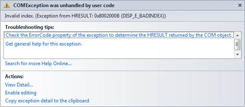
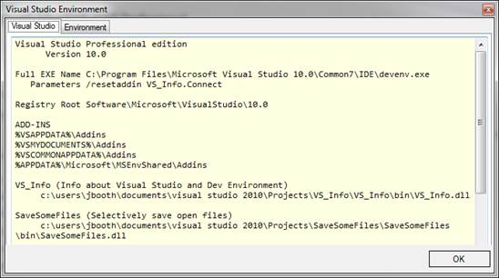

# 第七章 Visual Studio 环境

在本章中，我们将创建一个外接程序模块，以提供有关 Visual Studio 安装版本和当前运行 ide 的计算机的一些详细信息。虽然收集的信息将以 Windows 窗体显示，但您也可以添加逻辑来创建信息的文本文件，允许用户在需要时在另一台计算机上复制 Visual Studio 环境。

## VS 信息向导

使用向导和以下设置启动您的 **VS Info** 插件:

*   Visual C#(或您喜欢的语言)。
*   应用程序主持人:只有 Visual Studio，因为我们不会在宏中使用它。
*   名称/描述:VS_ *信息*和*关于 Visual Studio 和开发环境*的信息。
*   未选择“创建用户界面菜单并在启动时加载”。

在**汇总**屏幕验证设置，如果看起来没问题，生成代码。

## VS 信息表单

我们需要创建一个窗体来保存我们的 Visual Studio 信息，因此我们需要向项目中添加一个 Windows 窗体。此外，我们将使用字符串构建器对象来组装我们的信息，因此在您的 **connect.cs** 文件中添加以下行:

```
    using System.Text;

```

创建一个类似下图的形式，但请随意添加您自己的艺术触动。


图 Visual Studio 信息表单

但是，请确保两个文本框都有 PUBLIC 修饰符。我已经命名了 Visual Studio 文本框 **VSINFO** 和环境文本框 **ENVINFO** 。如果你使用不同的名字，你需要在你的 **Exec()** 方法中调整代码。

命名您创建的表单**VSInfoForm**；我建议使用等间距字体，这样生成的文本会很好地对齐。

## Exec()方法

在我们的 **Exec()** 方法中，我们将收集信息并构建文本行以传输到表单的窗口。我们将简单地从 **_applicationObject** 变量中获取一些简单的字符串属性开始，如下面的代码所示:

```
    if(commandName == "VS_Info.Connect.VS_Info")
    {                         
        VSInfoForm theForm = new VSInfoForm();          // Create the form.
        StringBuilder sb = new StringBuilder();

        // Get information specifically about Visual Studio.
        sb.AppendLine("Visual Studio " + _applicationObject.Edition + " edition");
        sb.AppendLine("      Version " + _applicationObject.Version.ToString());
        sb.AppendLine("");
        sb.AppendLine("Full EXE Name " + _applicationObject.FullName);
        sb.AppendLine("   Parameters " + _applicationObject.CommandLineArguments.ToString());
        sb.AppendLine("");
        sb.AppendLine("Registry Root " + _applicationObject.RegistryRoot.ToString());
        sb.AppendLine("");

```

### 获取选项

Visual Studio 有一个选项菜单，允许您调整集成开发环境的设置和行为。可以在**选项**下的**工具**菜单中找到。


图 8: Visual Studio 选项

您可以使用**_ 应用对象**变量的 **get_Properties** 方法访问任何 Visual Studio 选项。该方法采用两个参数，类别名和页面名。下面的示例代码显示了如何从**环境**类别**常规**页面获取选项集合。

```
    // Gives you access to various IDE options (see Tools | Options menu).
    Properties theSection = _applicationObject.get_Properties("Environment", "General");

```

此方法将返回一个 properties 集合对象，其中包含指示部分中的选项。然后，我们可以遍历 properties 集合来查找各个选项。

|  | 注意:你需要知道类别和页面的确切名称；否则，您将会遇到错误消息。 |



图 9:不匹配的选项类别和页面的错误结果

如果您打算使用这些选项，您可以转到以下注册表项来获取实际的类别名称:**HKEY _ LOCAL _ MACHINE \ SOFTWARE \ Microsoft \ VisualStudio \<ver>\ automation properties**。

该注册表位置将向您显示与 **get_Properties** 方法一起使用的实际文本字段。


图 10:用于 Get_properties 方法的文本字段

对于我们的代码，我们将获取 Visual Studio 在加载外接程序时查看的文件夹列表。

```
    // Gives you access to various IDE options (see Tools | Options menu).
     Properties theSection = _applicationObject.get_Properties("Environment",
                                                               "AddinMacrosSecurity");
     foreach (Property theProp in theSection)
         {   // Add-in locations are handled specially.
             if (theProp.Name == "AddinFileLocations")
             {
                object[] theArr = (object[])theProp.Value;
                for (int i = 0; i < theProp.Collection.Count;i++)
                {
                    string s = (string)theArr[i];
                    sb.AppendLine(s);
                 }
              }
          }

```

为了访问属性，我们将 **get_Properties** 的结果分配给类型为 **Properties** 的变量。然后，我们遍历这个集合，为类别和页面中的每个条目获取一个单独的属性对象。属性内容会有所不同，从简单的名称和值对到前面代码示例中稍微复杂一点的代码，以迭代外接程序的路径列表。

### 安装加载项

一旦我们收集了设置和路径，我们还想报告当前安装的外接程序。下面的代码示例显示了如何实现这一点:

```
    sb.AppendLine("");
    foreach (AddIn theItem in _applicationObject.AddIns)
        {
         sb.AppendLine(theItem.Name.ToString()+" (" + theItem.Description.ToString() + ") ");
         sb.AppendLine("     "+theItem.SatelliteDllPath.ToString());
         sb.AppendLine("");
         }
         // And put the results into the form’s edit box.
         theForm.VSINFO.Text = sb.ToString();

```

最后一步是将我们刚刚组装好的字符串放入表单的**编辑**框中。

### 环境信息

我们可以采取类似的方法向用户提供一些关于 Visual Studio 正在运行的开发环境的信息。

```
    sb.Clear();
    // Get information about development machine.
       sb.AppendLine("    Machine Name: "+Environment.MachineName.ToString());
       sb.AppendLine("            User: "+Environment.UserDomainName + "/" +
                                          Environment.UserName.ToString());
       sb.AppendLine("Operating System: "+ 
                     OSVersionToFriendlyName(Environment.OSVersion.Version.Major,
                                             Environment.OSVersion.Version.Minor));

       sb.AppendLine("                  "+Environment.OSVersion.ToString() +
                                          " with " + Environment.ProcessorCount.ToString() +
                                          " processors");
       if (Environment.OSVersion.Platform == PlatformID.Win32Windows ||
           Environment.OSVersion.Platform == PlatformID.Win32Windows)
          {
            sb.AppendLine("You are using an older, unsupported OS,                          you should consider upgrading to a later version");
          }
       if (System.Windows.Forms.SystemInformation.MonitorCount > 1)
          {
            sb.AppendLine("Multiple monitors setup");
          }

       theForm.ENVINFO.Text = sb.ToString();

```

### 获得操作系统友好的名称

您可以使用环境类中提供的版本信息将版本转换为更友好的名称(如 Windows XP、Windows Vista 等)。)函数处理该任务。

```
    public string OSVersionToFriendlyName(int MajorVer,int MinorVer)
    {
        string OsName = "Unknown";
        switch (MajorVer)
        {
            case 1 : { OsName="Windows 1.0"; break; }
            case 2 : { OsName ="Windows 2.0"; break; }
            case 3:
                 {
                   switch (MinorVer)
                   {
                      case 10: { OsName = "Windows NT 3.1"; break; }
                      case 11: { OsName = "Windows for Workgroups 3.11"; break; }
                      case 5:  { OsName = "Windows NT Workstation 3.5"; break; }
                      case 51: { OsName = "Windows NT Workstation 3.51"; break; }
                    }
                  }
                  break;
            case 4:
                 {
                   switch (MinorVer)
                   {
                      case 0: { OsName = "Windows 95"; break; }
                      case 1: { OsName = "Windows 98"; break; }
                      case 90: { OsName = "Windows Me"; break; }
                    }
                  }
                  break;
            case 5:
                 {
                   switch (MinorVer)
                   {
                       case 0: { OsName = "Windows 2000 Professional"; break; }
                       case 1: { OsName = "Windows XP"; break; }
                       case 2: { OsName = "Windows XP Professional x64"; break; }
                    }
                  }
                  break;
            case 6:
                 {
                    switch (MinorVer)
                    {
                       case 0: { OsName = "Windows Vista"; break; }
                       case 1: { OsName = "Windows 7"; break; }
                     }
                  }
                  break;
             default:
                   break;
        }
        return OsName;
    }

```

## 显示表单

一旦信息被收集并传输到表单，我们现在只需显示表单。

```
       theForm.ShowDialog();
       handled = true;
       return;

```

## 最终结果

构建并运行外接程序后，您的屏幕应该如下所示:



图 11:完整的信息表单

您可以调整代码以包含不同的按钮选项，甚至可以添加一个打印按钮，将 Visual Studio 设置的内容打印到打印机或文本文件中。