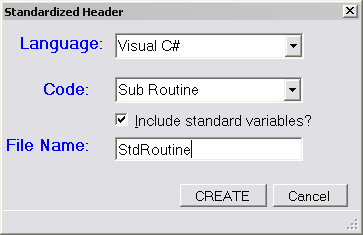

# 十五、源代码生成

可以添加到 Visual Studio IDE 中的一个节省时间的选项是生成源代码的能力。作为开发人员，我们经常需要执行一些常见的代码编写任务，通过设计输入屏幕和代码生成器，我们可以创建一个插件模块来节省开发周期的时间。

## 源代码助手类

为了帮助生成源代码，创建一个助手类可能是有益的，该类基本上是例程的集合，用于执行生成代码时可能发生的一些常见任务。我们从定义我们想要支持的不同编程语言开始我们的类定义，并提供一个属性来允许用户决定他们想要用哪种语言生成代码。

```cs
    // <summary>
    // Code Gen class: Helper class to generate code for add-ins.
    // </summary>
    public class CodeGen
    {
        // <summary>
        // List of programming languages generator works with.
        // </summary>
        public enum ProgrammingLanguages
        {
            VisualBasic = 1,
            CSharp = 2
        }

        private  ProgrammingLanguages theLang = ProgrammingLanguages.VisualBasic;
        private  bool inComment = false;

        // <summary>
        // Programming language to generate code for.
        // </summary>
        public  ProgrammingLanguages Programming_Language {
            get { return theLang; }
            set { theLang = value; }
        }
    }

```

一旦创建了基本类，我们就可以添加一些方法来生成适当的注释文本。最简单的方法是**单线注释()**，它为一行代码中的注释生成适当的语法和注释文本。

```cs
    public string SingleLineComment(string theComment)
    {
        string res = string.Empty;
        switch (theLang) {
           case ProgrammingLanguages.CSharp:
                    res = "// " + theComment;
                    break;
           case ProgrammingLanguages.VisualBasic:
                    res = "' " + theComment;
                    break;
           }
           return res;
     }

```

代码根据选择的编程语言确定适当的分隔符，然后返回一个分隔符和注释文本的字符串。我们还可以添加一个名为 **StartComment()** 的方法，该方法编写一个多行注释起始分隔符，并设置一个标志来指示我们在注释代码中。

```cs
    public string StartComment()
    {
        return StartComment("");
    }

    public string StartComment(string theComment)
    {    
      string res = string.Empty;
        switch (theLang) {
           case ProgrammingLanguages.CSharp:
                    res = "/* " + theComment;
                    break;
           case ProgrammingLanguages.VisualBasic:
                    res = "’ " + theComment;
                    break;
           }
           inComment = true;
           return res;
    }

```

**StopComment()** 方法写入适当的结束注释分隔符并关闭注释标志。

```cs
    public string StopComment()
    {
      string res = string.Empty;
        switch (theLang) {
           case ProgrammingLanguages.CSharp:
                    res = "*/ ";
                    break;
           case ProgrammingLanguages.VisualBasic:
                    break;
           }
           inComment = false;
           return res;
     }

```

有几个额外的方法来完善我们的助手类。其中包括 **MakeFileName()** ，用于将适当的扩展名附加到文件名中。

```cs
    public string MakeFileName(string theName)
    {
        string res = theName;
        switch (theLang)
        {
            case ProgrammingLanguages.CSharp:
               res += ".cs";
               break;
            case ProgrammingLanguages.VisualBasic:
               res += ".vb";
               break;
        }
        return res;
    }

```

我们也可以使用**declaraveriable()**来创建任何语言的变量。

```cs
    public string DeclareVariable(string varName, string DataType, string DefaultValue)
    {
        string res = string.Empty;
        switch (theLang)
        {
          case ProgrammingLanguages.CSharp:
              res = DataType + " " + varName;
              if (DefaultValue.Length > 0)
              { res += " = " + DefaultValue;  }
              res += ";";
              break;
          case ProgrammingLanguages.VisualBasic:
              res = "DIM " + varName + " AS " + DataType;
              if (DefaultValue.Length > 0)
              {  res += " = " + DefaultValue;  }
              break;
         }
         return res;
    }

```

我们的最终函数 **StartRoutine()** 返回一个函数声明和定界符 shell。

```cs
    public string StartRoutine(string typeOfCall, string RoutineName,string ReturnType)
    {
       string res = string.Empty;
       switch (theLang)
       {
          case ProgrammingLanguages.CSharp:
             if (typeOfCall.StartsWith("P"))
             { res = "public void ";   }
             else
             { res = "public "+ReturnType+" ";  }
             res += RoutineName+"()"+Environment.NewLine;
             res += "{";
             break;
          case ProgrammingLanguages.VisualBasic:
             if (typeOfCall.StartsWith("P"))
             { res = "sub " + RoutineName; }
             else
             { res = "function " + RoutineName + "() as " + ReturnType; }
             res += Environment.NewLine;
             break;
       }
       return res;
    }

```

有了这个简单的类库来帮助代码生成，我们现在可以开始我们的附加程序代码了。

## 标准化表头

想象一下，您的公司有一套每个代码模块都必须包含的标准头文件。这些标题包括程序创建的日期和时间，以及用于创建文件的 Visual Studio 版本。

### 向导设置

使用向导和以下设置启动标准标头附加程序:

*   Visual C#(或您喜欢的语言)。
*   应用宿主:仅限 Visual Studio。
*   名称/描述:*标准标题**生成标准标题模块*。
*   创建用户界面菜单，不要在启动时加载。

在**汇总**屏幕验证设置，如果看起来没问题，生成代码。

## 移至文件菜单

对于我们的标准标题插件，我们更希望使用图标将菜单项附加到**文件**菜单，而不是**工具**菜单。我们需要在我们的**在线连接**方法中更改几行:

```cs
    public void OnConnection(object application, ext_ConnectMode connectMode,
                            object addInInst, ref Array custom)
    {
           _applicationObject = (DTE2)application;
           _addInInstance = (AddIn)addInInst;
           if(connectMode == ext_ConnectMode.ext_cm_UISetup)
           {
                  object []contextGUIDS = new object[] { };
                  Commands2 commands = (Commands2)_applicationObject.Commands;
                  string toolsMenuName = "File";

```

在这种情况下，我们将**工具菜单中的**变量从**工具**更改为**文件**。

```cs
      const int DOCUMENTS_ICON = 1197;

```

我们还将为文档图标添加常量，并使用该值而不是在 **AddNamedCommand2()** 调用中硬编码的 59。

```cs
    //Add a command to the Commands collection:
    Command command = commands.AddNamedCommand2(_addInInstance, "StdHeaders",
                    "StdHeaders", "Standardized headers", true,
           DOCUMENTS_ICON,
           ref contextGUIDS,
          (int)vsCommandStatus.vsCommandStatusSupported+
          (int)vsCommandStatus.vsCommandStatusEnabled,
          (int)vsCommandStyle.vsCommandStylePictAndText, 
           vsCommandControlType.vsCommandControlTypeButton);

```

## 选项屏幕

选项屏幕是一个窗口表单，询问用户一些关于他们想要生成的代码头类型的问题。作为起点，我们将需要知道要保存的文件、要使用的编程语言，以及是否生成函数或子程序调用。



图 16:标准标题插件的选项屏幕

## 生成表头

如果用户点击**确定**生成表头代码，我们将从 Windows 表单中拉出选择的选项，并使用它们来设置我们生成的表头和代码模板。

```cs
    StringBuilder sb = new StringBuilder();     // String to hold header.
    CodeGen Gen = new CodeGen();                // Code generation helper.
    StdHeaderForm theForm = new StdHeaderForm();
    theForm.ShowDialog();
    if (theForm.DialogResult == DialogResult.OK)
       {
         string cFile = theForm.CODEFILE.Text;
         // Get programming language choice.
         switch (theForm.LANGCOMBO.SelectedIndex)
         {
              case 0:
             { Gen.Programming_Language = CodeGen.ProgrammingLanguages.CSharp;
               break;
             }
             case 1:
             { Gen.Programming_Language = CodeGen.ProgrammingLanguages.VisualBasic
               break;
             }
         }

         sb.AppendLine(Gen.StartComment());
         sb.AppendLine(Gen.WriteCode("=============================================="));
         sb.AppendLine(Gen.WriteCode("     Program: "  + cFile ));
         sb.AppendLine(Gen.WriteCode("      Author: " + Environment.UserName));
         sb.AppendLine(Gen.WriteCode("   Date/Time: " + DateTime.Now.ToShortDateString() +
                                     "/" + DateTime.Now.ToShortTimeString()));
         sb.AppendLine(Gen.WriteCode(" Environment: Visual Studio " +
                                     _applicationObject.Edition));
         sb.AppendLine(Gen.WriteCode("=============================================="));
         sb.AppendLine(Gen.StopComment());
         sb.AppendLine(Gen.WriteCode(""));

```

### 添加子/函数调用

下面的代码示例添加了对例程 TBD 的调用(希望开发人员会更新例程的名称):

```cs
    //Write the function prototype.
    sb.AppendLine(Gen.StartRoutine(theForm.TYPECOMBO.Text.ToUpper(), "TBD", "string"));

```

### 添加标准变量

在一些应用中，使用标准变量，以便每个程序员使用相同的变量名和含义。在这里的例子中，我们使用名为 **SourceModified** 和 **StartTime** 的变量来跟踪修改并监控性能。

```cs
    // Optionally, write standard variables.
    if (theForm.INCLUDECHECK.Checked)
    {
        sb.AppendLine(Gen.DeclareVariable("SourceModified","string"));  
        sb.AppendLine(Gen.DeclareVariable("StartTime","DateTime","DateTime.Now()"));
    }
    sb.AppendLine(Gen.EndRoutine(theForm.TYPECOMBO.Text.ToUpper()));

```

## 打开新窗口

一旦创建了带有标题的字符串生成器变量，我们需要将其保存到一个文件中，然后在 IDE 中打开它。

```cs
    cFile = Gen.MakeFileName(cFile);
    StreamWriter objWriter = new System.IO.StreamWriter(cfile);
         objWriter.Write(sb.ToString());
         objWriter.Close();

    ItemOperations itemOp;
         itemOp = _applicationObject.ItemOperations;
         itemOp.OpenFile(cfile, Constants.vsViewKindCode);

```

附加程序完成后，将打开一个新窗口，其代码类似于以下示例:

```cs
    ’
    ' ========================================================
    '      Program: Sample
    '       Author: Joe
    '    Date/Time: 10/13/2012/9:24 AM
    '  Environment: Visual Studio Professional
    ' ========================================================
    '
    Function TBD() As String
        Dim SourceModified As String
        Dim StartTime As DateTime = DateTime.Now()
    End Function

```

### ItemOperations 对象

**_applicationObject** 的 **ItemOperations** 对象提供了在 Visual Studio IDE 中打开和添加文件的方法。在前面的例子中，我们已经创建了该文件，并使用 **ItemOp** 变量，指示 Visual Studio 在代码编辑器窗口中打开该文件。该对象允许您以编程方式执行**文件**菜单中的一些选项。

**项目操作**对象的其他方法包括:

*   **AddExistingItem()** :向项目中添加现有文件。
*   **AddNewItem()** :向项目中添加新项。您可以传递两个参数:类别名称/项目名称(如常规/XML 文件)和项目窗口中的显示名称。
*   **IsFileOpen()** :作为参数传递的文件名是否在 IDE 窗口中打开？
*   **导航()**:打开浏览器窗口到指定的网址。
*   **NewFile()** :使用指示文件类型的虚拟路径创建新文件。您可以选择指定项目的文件名和打开文件的视图类型。
*   **OpenFile()** :使用指定的视图种类在编辑器中打开一个现有文件。在我们的示例代码中，我们创建了一个文件，并在代码视图中打开了它。

## 总结

本章演示了如何通过从 Visual Studio 和环境中提取信息来创建标准化的头文件，从而构建源代码文件。它还展示了如何在 Visual Studio 文档窗口中打开源文件，以允许用户立即开始编程。