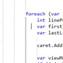

# 十九、第三方附加程序

自从微软向外部提供创建附加程序的能力以来，已经有成千上万的第三方附加程序被开发人员编写和共享。许多附加模块都是免费的或者很少的费用。一个很好的起点是位于 http://visualstudiogallery.msdn.microsoft.com/的微软视觉工作室画廊。

## 微软附加程序

微软开发人员已经向该图库提供了许多附加程序。可用的几个示例附加程序包括:

*   [彩色打印](http://visualstudiogallery.msdn.microsoft.com/00ec88c2-1553-47d2-8170-3c5baa0c6e44):允许彩色打印代码文件。
*   [Regex 编辑器](http://visualstudiogallery.msdn.microsoft.com/55c24bf1-2636-4f94-831d-28db8505ce00) : IntelliSense，语法颜色，测试正则表达式。如果您使用正则表达式，这个附加程序是对 IDE 的一个很好的补充。
*   [电源命令](http://visualstudiogallery.msdn.microsoft.com/e5f41ad9-4edc-4912-bca3-91147db95b99):对 Visual Studio IDE 的有用扩展。添加*撤销关闭*、*插入 GUID* 、*提取常量*等命令。到集成开发环境。
*   [生产力电动工具](http://visualstudiogallery.msdn.microsoft.com/3a96a4dc-ba9c-4589-92c5-640e07332afd):开发者生产力扩展。
*   对 IDE 的增强，例如组织 Visual Basic 导入(类似于 C#中的组织 Usings)、对齐赋值语句、自定义文档选项卡等。

看到微软内部开发的附加程序模块的功能进入 Visual Studio 的未来版本并不罕见。

## 社区附加程序

有一个很大的程序员社区，他们正在为网站编写和共享他们的插件。社区中一些有用的附加程序包括:

**缩进参考线**

[缩进参考线](http://visualstudiogallery.msdn.microsoft.com/e792686d-542b-474a-8c55-630980e72c30)插件显示垂直线以显示缩进等级。它为对齐语句提供了一个有用的视觉指南。

图 19:缩进指南插件

**路由助手**

通过[路由助手](http://visualstudiogallery.msdn.microsoft.com/f0589156-a8e6-47db-8bac-90f01ca6b8a3)插件，用户可以直接在 Visual Studio 中轻松浏览、定义、匹配和过滤 ASP.NET 应用和网站的 ASP.NET MVC 路由。随着 MVC 框架的流行，这个插件模块是一个很好的节省时间和理解 MVC 路由行为的方法。

**【devcolor】**

[开发颜色](http://visualstudiogallery.msdn.microsoft.com/7dbae8b3-5812-490e-913e-7bfe17f47f1d)插件为样式表中的颜色加下划线，并包含一个颜色选择器对话框。

图 20:开发颜色插件

Visual Studio 图库是一个值得访问和添加书签的网站。如果你创建了一个对其他程序员有用的插件，你也可以贡献你自己的插件。

名誉和荣耀等着你！