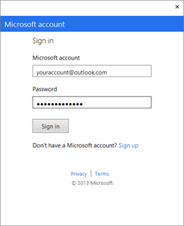
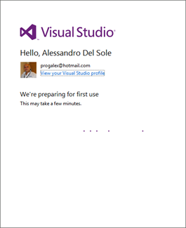
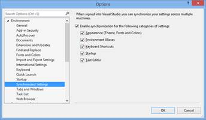
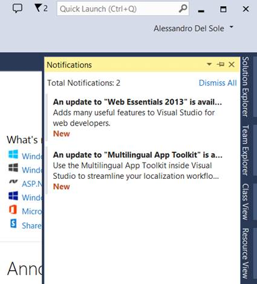

# 第 1 章同步设置和通知

大多数开发人员在不同的计算机上工作，例如台式工作站、笔记本电脑和服务器。在大多数情况下，开发人员会将 Visual Studio 安装到他们使用的每台计算机上。如您所知，IDE(集成开发环境)是可定制的，允许调整许多设置，例如向工具栏添加按钮、更改颜色、使用不同的字体等。在 Visual Studio 2013 之前，您必须在每次安装 Visual Studio 时手动调整设置，这需要更多的时间，并且有忘记更改某些设置的风险。Visual Studio 2013 引入了*同步设置*，这样每次在环境中进行自定义时，这些都会自动应用到不同计算机上的 Visual Studio 的其他安装中。本章介绍了这一新功能的工作原理，以及如何一次性自定义您的工作环境。

## 登录到 Visual Studio

第一次启动 Visual Studio 2013 时，系统会要求您指定一个默认配置文件，例如 web 编程、Visual Basic 编程、常规开发以及 IDE 早期版本中的其他配置文件。这是你已经走了很多次的一步，所以我不会在这里花太多时间。选择配置文件后，Visual Studio 2013 将要求您使用微软帐户(以前称为 Windows Live ID)登录。微软帐户是基于微软提供商之一(如 Hotmail、Live 或 Outlook)的电子邮件地址。图 1 展示了这一点。

图 1: Visual Studio 2013 要求您使用微软帐户登录。

使用微软帐户登录不是强制性的；您当然可以在没有电子邮件地址的情况下使用 Visual Studio。但是，登录是有利的，原因如下:

*   如本章后面所述，您可以利用同步设置。
*   使用 Microsoft 帐户登录将永久解锁您安装的任何 Visual Studio Express。
*   如果您订阅了此服务，您将自动登录到与您的电子邮件地址关联的 Team Foundation Service 帐户。
*   您可以使用 Visual Studio 的试用版 90 天，而不是 30 天。
*   如果您的 Microsoft 帐户与 MSDN 订阅相关联，登录将解锁 Visual Studio。

假设你已经有了微软账号，点击**登录**。此时，您将被要求输入您的电子邮件地址和密码，如图 2 所示。

图 2:输入您的凭据开始。

点击**登录**。此时，Visual Studio 将识别您的概要文件，并在为首次使用准备环境时显示一些信息(参见图 3)。

|  | 提示:如果您是第一次在计算机上安装 Visual Studio 2013，但已经将其安装到不同的计算机上，这也是设置同步的时刻。关于如何同步设置的信息即将到来。 |

图 3:输入您的凭据开始。

Visual Studio 还会要求您选择一个可用的开发设置。如果您安装了以前的版本，如 Visual Studio 2012，新的集成开发环境提供了一个从以前版本导入自定义设置的选项。您可以从常规、JavaScript、SQL Server、Visual Basic、Visual C#、Visual C++、Visual F#、Web 开发和 Web 开发(仅限代码)中进行选择。选择一个最符合你兴趣的。如果您不知道什么是最适合您的选择，只需选择常规设置。此外，您还可以选择一个可用的图形主题(浅色、深色、蓝色)。登录后，Visual Studio 会在 IDE 的右上角显示您的配置文件名称和图片，包括访问您的配置文件详细信息和连接到 Team Foundation Service 的快捷方式。

|  | 注意:Team Foundation Service 是 Team Foundation Server 的基于云的版本，Team Foundation Server 是微软流行的团队协作平台。借助团队基础服务，您可以托管团队项目，并利用源代码管理和其他团队开发工具。使用 Microsoft 帐户登录 Visual Studio 的另一个重要原因是，IDE 会自动将您的帐户连接到关联的 Team Foundation Service 帐户。要创建您的团队基础服务帐户，请访问[http://tfs.visualstudio.com](http://tfs.visualstudio.com)。 |

图 4:集成开发环境识别用户并提供有用的快捷方式。

登录后，您的设置就可以在多台计算机上同步和共享了。

## 同步设置

默认情况下，Visual Studio 2013 可以同步以下设置:

*   开发设置。这些与您第一次运行 Visual Studio 时选择的开发配置文件相关，可以通过选择工具、导入和导出设置、重置所有设置进行更改。
*   主题设置，在选项、环境页面、常规选项卡中可用
*   选项、启动中可用的启动设置
*   “选项”、“文本编辑器”中可用的文本编辑器的所有设置
*   选项、环境、字体和颜色中可用的所有字体和颜色设置
*   所有默认和自定义键盘快捷键，在选项、环境、键盘中可用
*   自定义命令别名

|  | 提示:命令别名是在命令窗口中输入命令的一种方式，允许在 Visual Studio 中打开对话框或启动其他任务，而不是使用菜单和菜单项。内置别名的完整列表位于:[http://msdn.microsoft.com/en-us/library/c3a0kd3x.aspx](http://msdn.microsoft.com/en-us/library/c3a0kd3x.aspx) |

当您进行更改或自定义时，Visual Studio 会将上述设置存储在云(即微软服务器)上，并将这些设置与您用来登录的微软帐户相关联。当您在不同的计算机上使用相同的帐户登录到 Visual Studio 时，IDE 会下载与您的帐户相关联的设置，并将它们应用于活动环境。开发人员已经请求该功能很长时间了，最终 Visual Studio 2013 解决了这个问题。这只是另一个例子，说明作为开发人员，云如何让您的生活变得更轻松。请记住，即使您有不同版本的 Visual Studio 2013，如终极版、高级版和专业版，同步也是有效的。同步也适用于快速版，但如果您在同一台计算机上有快速版和非快速版，它将不起作用。

### 选择性同步

您可以禁用设置同步，或者在上一段列出的设置中选择您想要同步的设置。为此，进入**工具**菜单，然后选择**选项**子菜单，然后选择**同步设置**命令。图 5 显示了此时选项对话框是如何出现的。

图 5:启用同步和设置选择

默认情况下选择**启用以下类别设置的同步**复选框。如果取消选择它，同步将停止，直到您明确地重新启用它。您还可以选择一个或多个要同步的特定设置，不包括不使用的设置。单击**确定**应用您的更改。

### 同步冲突

由于各种原因，跨多台机器的同步偶尔会失败。如果发生这种情况，Visual Studio 会在通知中心显示一条消息(请参见本章的下一个主题)。 [MSDN 文档](http://msdn.microsoft.com/en-us/library/dn135229(v=vs.120).aspx)描述了三种可能的解决方案，其中包括一些手动操作。作为个人建议，在同步不成功的计算机上关闭同步，然后注销。接下来，再次登录并再次打开同步。

## 通知中心

Visual Studio 2013 引入了通知的新概念。目标是让开发人员了解产品更新、扩展更新、文档更新、许可证问题、微软帐户问题、未解决的冲突和其他错误。集成开发环境通过通知中心向您呈现通知。通知中心由一个名为通知的新工具窗口和一个位于快速启动栏附近的小标志图标(通知按钮)组成，该图标指示可用通知的数量。要打开“通知”窗口:

1.  点击**查看**菜单。
2.  选择**通知**条目。

您也可以点击快速启动栏上的**通知**按钮，以便更快地打开。图 6 显示了通知中心。

图 6:启用同步和设置选择

如果单击按钮，通知工具窗口将打开，并显示通知的完整列表。您可以展开通知描述，如果通知是关于更新的，您将能够单击超链接，将您重定向到下载页面。您也可以通过点击**取消所有**来忽略所有通知。

## 章节总结

在 IDE 中的新功能中，Visual Studio 2013 可以通过同步设置轻松地在多台计算机之间共享设置；有了这个功能，大多数设置都会保存到云中，并应用到您的所有其他 Visual Studio 安装中。通知中心提供了一种简单的方法来下载更新并显示与 Visual Studio 相关的其他问题的信息。这两项功能都要求您使用您的微软帐户登录到 Visual Studio，这也允许您无需额外的努力即可连接到其他微软服务。