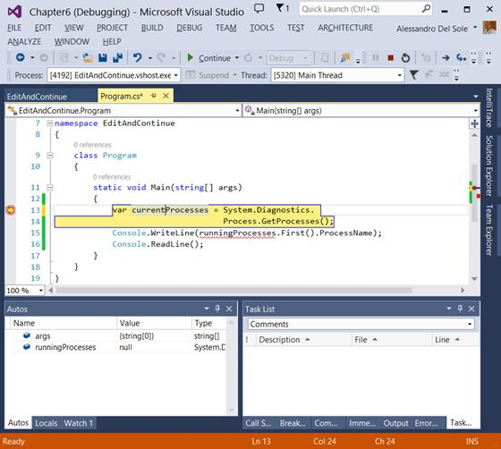
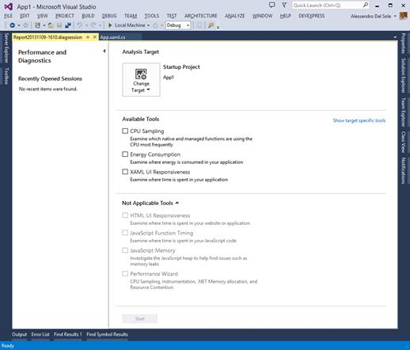
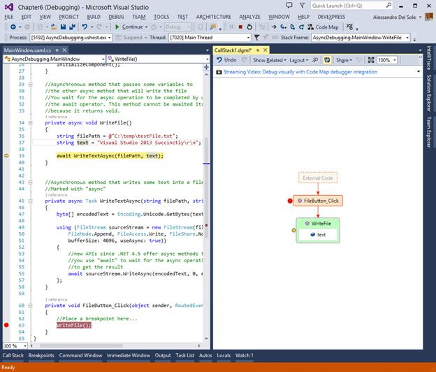
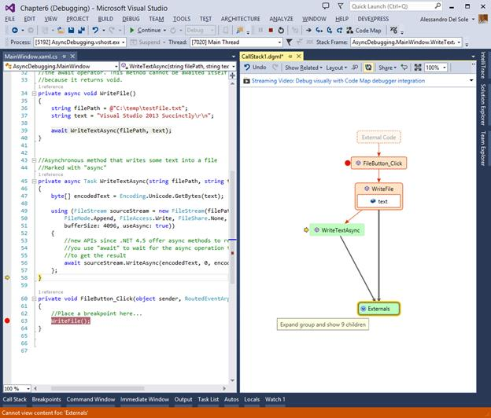
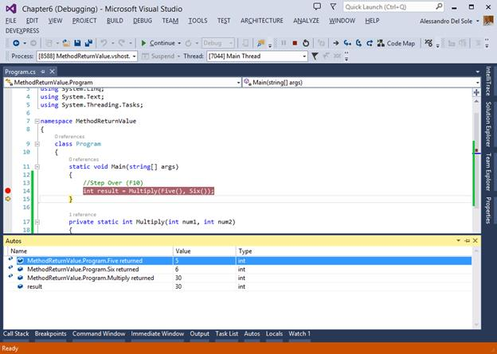

# 第 6 章新的和增强的调试工具

作为开发人员，您可能会花费大量时间测试和调试代码。Visual Studio 2013 引入了新的调试工具并更新了一些现有工具，继续其提供有史以来最高效环境的目标。

## 64 位编辑并继续

Visual Studio 2013 最终为 64 位应用程序引入了“编辑并继续”。如您所知，使用“编辑并继续”，您可以中断应用程序的执行，编辑您的代码，然后重新启动。到目前为止，这仅适用于 32 位应用程序。演示这个特性是如何工作的非常容易。考虑一个非常简单的 Console 应用程序，其目标是检索正在运行的进程列表，并显示列表中第一个进程的名称；代码如下。

*Visual C#*

```cs
    class Program
    {
    static void Main(string>[] args)
    {
    var runningProcesses = System.Diagnostics.
    Process.GetProcesses();
    Console.WriteLine(runningProcesses.First().ProcessName);
    Console.ReadLine();
    }
    }

```

*Visual Basic*

```cs
    Module Module1

    Sub Main()
    'Add a breakpoint here and make your edits at 64-bits!
    Dim runningProcesses = System.Diagnostics.Process.GetProcesses()
    Console.WriteLine(runningProcesses.First().ProcessName)
    Console.ReadLine()
    End Sub

    End Module

```

运行应用程序前，打开项目属性，选择 **Build** 选项卡，将平台目标更改为 **x64** ，如图 75 所示。


图 75:选择 64 位目标体系结构

现在回到代码，通过按下 **F9** ，在包含`runningProcesses`变量声明的行上放置一个断点。最后，按 **F5** 运行应用程序。当调试器遇到断点时，将显示代码编辑器。您可以简单地将`runningProcesses`变量重命名为`currentProcesses`(见图 76)；这足以证明“编辑并继续”现在是如何工作的。在 Visual Studio 2013 之前，如果您尝试编辑代码，此时您会收到一条错误消息，称仅 32 位应用程序支持“编辑并继续”。



图 76:您可以在继续执行之前编辑代码。

## 异步调试

Visual Studio 2012 和。NET Framework 4.5 引入了一种新的异步操作编码模式，称为[异步/等待模式](http://msdn.microsoft.com/en-us/library/vstudio/hh191443.aspx)，基于托管语言中新的`async`和`await`关键字。这种模式的目标是使 UI 线程始终响应；编译器可以生成 [`Task`](http://msdn.microsoft.com/en-us/library/system.threading.tasks.task.aspx) 类的适当实例，甚至可以在同一个线程中异步执行一个操作。您将很快看到一个代码示例，这将使您更容易理解，但是关于异步/等待还有很多要说的，因此强烈建议您阅读 [MSDN 文档](http://msdn.microsoft.com/en-us/library/vstudio/hh191443.aspx)，如果您从未使用过它。我

如果您已经熟悉这个模式，那么您知道在调试时很难获得关于异步操作的进度和状态的信息。为此，Visual Studio 2013 引入了一个名为“任务”的新工具窗口。这个新工具窗口的目的是显示正在运行的任务列表，并提供有关活动和挂起任务、执行时间和执行代码的信息。“任务”窗口作为 Windows Store 应用程序开发的一个新功能被广泛宣传，但它实际上也适用于许多其他技术，例如 WPF。这就是为什么在本章而不是下一章讨论 Windows 8.1 的原因。

### 创建一个样本项目

为了理解这个特性是如何工作的，让我们创建一个名为*异步调试*的新 WPF 应用程序项目。当用户点击一个按钮时，这个应用程序将创建一个新的文本文件。用户界面的 XAML 代码非常简单，如下面的清单所示。

```cs
    <Window x:Class="AsyncDebugging.MainWindow"

    xmlns:x="http://schemas.microsoft.com/winfx/2006/xaml"
    Title="MainWindow" Height="350" Width="525">
    <Grid>
    <Button Width="100" Height="30" Name="FileButton" Content="Create file" Click="FileButton_Click"/>
    </Grid>
    </Window>

```

主窗口的代码隐藏文件将包含以下代码(参见内部注释)。

*Visual C#*

```cs
    using System.IO;

    //Asynchronous method that passes some variables to
    //the other async method that will write the file
    //You wait for the async operation to be completed by using
    //the await operator. This method cannot be awaited itself
    //because it returns void.
    private async void WriteFile()
    {
    string filePath = >@"C:\temp\testFile.txt";
    string text = >"Visual Studio 2013 Succinctly\r\n";

    await WriteTextAsync(filePath, text);
    }

    //Asynchronous method that writes some text into a file
    //Marked with "async"
    private async Task >WriteTextAsync(string filePath, string text)
    {
    byte[] encodedText = Encoding.Unicode.GetBytes(text);

    using (FileStream sourceStream = new FileStream(filePath,
    FileMode.Append, FileAccess.Write, FileShare.None,
    bufferSize: 4096, useAsync: true))
    {
    //new APIs since .NET 4.5 offer async methods to read
    //and write files
    //you use "await" to wait for the async operation to be
    //completed and to get the result
    await sourceStream.WriteAsync(encodedText, 0,
    encodedText.Length);
    };
    }

    private void FileButton_Click(object sender, RoutedEventArgs >e)
    {
    //Place a breakpoint here...
    WriteFile();
    }

```

*Visual Basic*

```cs
    Imports> System.IO
    'Asynchronous method that passes some variables to
    'the other async method that will write the file
    'You wait for the async operation to be completed by using
    'the await operator. This method cannot be awaited itself
    'because it returns void.
    Private Async Sub WriteFile()
    Dim filePath As String = "C:\temp\testFile.txt"
    Dim text As String = "Visual Studio 2013 Succinctly"

    Await WriteTextAsync(filePath, text)
    End Sub

    'Requires Imports System.IO
    'Asynchronous method that writes some text into a file
    'Marked with "async"
    Private Async Function >WriteTextAsync(filePath As String,
    text As String) As Task
    Dim encodedText As Byte() = Encoding.Unicode.GetBytes(text)

    Using sourceStream As New FileStream(filePath, FileMode.Append,
    FileAccess.Write,
    FileShare.None,
    bufferSize:=4096,
    useAsync:=True)
    'new APIs since .NET 4.5: async methods to read and write files
    'you use "await" to wait for the async operation
    'to be completed and to get the result
    Await sourceStream.WriteAsync(encodedText, 0,
    encodedText.Length)
    End Using
    End Function

    Private Sub FileButton_Click(sender As Object, e As RoutedEventArgs)
    WriteFile()
    End Sub

```

为了运行代码没有任何错误，请确保您有一个 C:\Temp 文件夹；如果没有，则创建一个或编辑代码以指向不同的文件夹。如果您正常启动应用程序，几秒钟后，您将看到文本文件已正确创建到 C:\Temp 文件夹中。如果您过去已经使用过异步/等待模式，那么您知道，在 Visual Studio 2012 之前可用的调试工具无法显示任务的生命周期；您无法知道哪个任务处于活动状态，哪个任务正在等待。让我们看看 Visual Studio 2013 在这一点上是如何改变事情的。

### 通过任务窗口了解任务生命周期

在按钮点击事件处理程序内部的`WriteFile`方法调用上放置一个断点(参见前面清单中的注释)。启动应用程序，准备就绪后，单击按钮。当 Visual Studio 在断点处中断执行时，转到**调试**、**窗口**，选择**任务**。“任务”工具窗口将被打开并停靠在集成开发环境中。按下 **F11** 开始调试。当调用异步方法时，任务窗口显示它们的状态，如图 77 所示。


图 77:任务窗口显示了异步任务的状态。

默认情况下，“任务”窗口显示以下列和相关信息:

*   标识，表示任务标识符。
*   状态，指示任务是活动的还是等待的。
*   开始时间(秒)，表示任务的开始时间(秒)。
*   位置，它显示调用任务的方法的名称。
*   任务，它总结了正在进行的操作。
*   您可以通过添加或删除列来自定义“任务”窗口。如果右键单击任一列，然后选择**列**，弹出菜单将显示可用列的完整列表；例如，您可能对“线程分配”列感兴趣，以查看哪个线程包含所选任务。当您需要更好地理解异步操作的生命周期时，包括当您需要分析任务的性能时，“任务”窗口肯定是有用的。如果在使用 F11 单步执行代码行时“任务”窗口没有显示信息，并且您正在使用桌面应用程序，请重新启动调试并重试。这是一个已知的问题。如果您使用的是 Windows Store 应用程序，则不会遇到此问题。

## 性能和诊断中心

分析应用程序的性能和行为至关重要。如果你的应用程序速度快，流畅，不消耗大量系统资源(包括移动应用的电池)，用户会喜欢的。Visual Studio 多年来一直提供分析工具，专注于不同的领域，如内存使用、CPU 使用、单元测试和代码分析。随着移动应用的大幅增长，Visual Studio 也一直在提供针对移动平台的分析工具。在 Visual Studio 2013 中，微软又向前迈出了一步，引入了一个新的独特的地方，在那里您可以找到这样的分析工具。这个地方叫做性能和诊断中心。选择**调试**、**性能**、**诊断**或按 **ALT** + **F2** 即可。图 78 显示了性能和诊断中心在 Windows 商店应用程序项目中的显示方式。



图 78:性能和诊断中心

Visual Studio 2013 将仅启用特定于目标的工具。图 78 引用了一个 XAML 视窗商店应用程序，因此所有其他针对 HTML 视窗商店应用程序的工具都被禁用了。对于 ASP.NET 和桌面应用程序，只有中央处理器采样可用。表 3 显示了每个项目类型的可用分析工具列表。

表 3:每个项目类型的分析工具

| 分析工具 | 目的 | 项目类型 |
| --- | --- | --- |
| 性能向导(包括中央处理器采样) | 分析 CPU 使用率、托管内存分配、应用程序状态的运行时诊断 | 所有项目类型 |
| --- | --- | --- |
| 能耗 | 通过 Windows 模拟器分析潜在的电池使用情况 | Windows 商店应用程序 |
| --- | --- | --- |
| XAML 用户界面响应 | 分析渲染布局花费的时间 | XAML 视窗商店应用程序 |
| --- | --- | --- |
| 用户界面响应能力 | 分析渲染布局花费的时间 | 视窗商店应用程序 |
| --- | --- | --- |
| JavaScript 内存 | 分析 JavaScript 堆以帮助发现诸如内存泄漏等问题 | 视窗商店应用程序 |
| --- | --- | --- |
| JavaScript 函数计时 | 分析执行 JavaScript 代码所花费的时间 | 视窗商店应用程序 |
| --- | --- | --- |

中央处理器采样分析工具调用 Visual Studio 附带的探查器，您已经从以前的版本中了解到了这一点。要开始诊断会话，您只需选择所需的工具，然后单击页面底部的**开始**。当您手动关闭应用程序或中断诊断会话时，Visual Studio 将根据您选择的分析类型生成报告。在下一章中，当我们讨论 Windows 8.1 的新功能时，您将获得该工具的更详细的演示。请记住，您仍然可以通过“分析”菜单访问分析工具，就像以前版本的集成开发环境一样。

## 代码图调试

|  | 注意:代码映射仅在 Visual Studio 2013 Ultimate 中可用。 |

Visual Studio 2013 的另一个有趣的补充是代码映射。实际上，代码映射在 Visual Studio 2012 的更新 1 中是可用的，但是现在该工具被集成到了 IDE 中。使用代码映射，您可以获得应用程序和依赖关系的增量可视化。更简单地说，在调试时，您可以在交互式窗口中获得方法调用、引用和字段的可视化表示，您还可以在该窗口中添加注释、标记要跟进的项目以及将图形导出到图像文件。

为了理解代码映射是如何工作的，让我们考虑一下我们在本章前面为演示异步调试而创建的 WPF 示例应用程序。确保断点仍在按钮的点击事件处理程序中，然后用 **F5** 启动应用程序。单击应用程序中的按钮，然后当调试器遇到断点并中断时，单击工具栏上的**代码映射**(见图 79)。


图 79:代码映射按钮

Visual Studio 将在此时开始生成地图。几秒钟后，您将在代码映射中看到方法调用，如图 80 所示。


图 80:一个新的代码映射

在继续之前，您可以使用窗口工具栏上的各种按钮。例如，如果您选中“共享”按钮，您将看到如何轻松地将图表导出或通过电子邮件发送为图像文件或便携式 XPS 文件。“布局”按钮提供了一个以不同方式显示代码映射的选项，而“显示相关”允许在映射中查找对所选项目的方法和类型的引用。现在按 **F11** 执行下一行代码。通过调用`WriteFile`方法，立即更新代码映射，如图 81 所示。


图 81:代码映射在调试时被更新。

对象也在代码映射中表示。例如，在调试`WriteFile`方法时，右键单击`text`变量，然后单击**在代码图上显示**。映射将使用引用的变量进行更新(见图 82)，显示在其包含的对象中。



图 82:代码映射在调试时被更新。

如果右键单击地图中的某个方法，您将能够显示许多数据点，例如对其他方法的调用、方法引用的字段以及包含类型。例如，右键单击`WriteFile`方法，然后选择**显示此调用的方法**。Visual Studio 将显示`WriteFile`对其他方法的调用，如图 83 所示。



图 83:显示所选方法的方法调用。

方法调用`WriteTextAsync`，调用外部代码。这样的外部代码就是运行时如何将异步/等待模式转换为后备模式的。NET 方法。这可以通过单击内部的扩展按钮来扩展**外部**节点来轻松演示。正如工具提示所建议的，如果您展开 Externals 节点，您将能够看到九个子对象，如图 84 所示。


图 84:调查外部呼叫

您在映射中看到的所有方法调用都由运行时处理，以代表您管理异步操作。值得一提的是，每次将鼠标指针放在一个方法上时，都会有一个工具提示显示代码中的方法定义。您还可以添加评论和标记项目以供跟进。要添加评论，右键单击一个项目，然后选择**新评论**。您可以在文本框中输入您的评论。要标记跟进项目，右键单击该项目，然后选择**标记跟进**。在图 85 中，您可以看到一个注释和标记为后续的`WriteTextAsync`方法。


图 85:添加注释和标志

通过在上下文菜单中选择**高级**组，您最终可以右键单击一个项目并查看高级属性。图 86 显示了命令**显示包含类型**、**命名空间**和**装配**的结果。


图 86:可视化高级属性

值得一提的是，右键单击任何项目时看到的上下文菜单将显示“转到定义”命令，该命令会将您重定向到代码编辑器或对象浏览器窗口中的对象定义。正如您很容易理解的那样，代码映射提供了一个很大的好处，因为它允许调试，同时可以看到正在发生的事情；这样更容易发现最细微的 bug。

## 方法返回值

Visual Studio 2013 为 Visual C#和 Visual Basic 带来了一项 C++已经具备的功能，即无需进入代码就能在 Autos 窗口中查看方法的返回值。要了解此功能的工作原理，请创建一个新的控制台应用程序。现在考虑下面的代码。

*Visual C#*

```cs
    class Program
    {
    static void Main(string>[] args)
    {
    //Step Over (F10)
    int result = Multiply(Five(), Six());
    }

    private static int Multiply(int num1, int num2)
    {
    return (num1 * num2);
    }

    private static int Five()
    {
    return (5);
    }

    private static int Six()
    {
    return (6);
    }
    }

```

*Visual Basic*

```cs
    Module Module1

    Sub Main()
    'Step over (F10)
    Dim result As Integer = Multiply(Five(), Six())
    End Sub

    Private Function Multiply(num1 As Integer, num2 As Integer) As Integer
    Return (num1 * num2)
    End Function

    Private Function Five() As Integer
    Return (5)
    End Function

    Private Function Six() As Integer
    Return (6)
    End Function
    End Module

```

如您所见，这段简化的代码通过调用两个方法返回乘法结果，每个方法返回一个整数值。按照代码中的建议，在`Main`方法中的唯一一行代码上放置一个断点，然后按 **F5** 启动应用程序。您可以跨( **F10** )执行该方法，而不用一行一行地执行其他方法。此时，您将能够在自动窗口中看到每个中间方法调用返回的值，如图 87 所示。

|  | 提示:如果自动窗口没有自动显示，请转到调试，然后选择窗口，然后选择自动。 |



图 87:不逐行执行自动窗口中显示的方法返回值

当您需要专注于一段代码，并且不想深入每一行，但仍然希望看到每个方法调用的结果时，这个特性非常有用。

## 章节总结

因为调试是应用程序开发中最重要的活动之一，所以微软进行了大量投资，以使 Visual Studio 2013 中的调试体验更加高效。现在，您终于可以对 64 位应用程序使用流行的“编辑并继续”功能了。您可以利用异步调试来理解基于异步/等待模式的异步操作的生命周期。借助全新的性能和诊断中心，您现在有了一个统一的位置来分析应用程序的性能和行为。使用代码映射进行调试时，可以获得代码执行的图形表示。最后，您现在可以获得方法返回值，而无需单步执行每一行代码，只需单步执行调用方方法。所有这些新功能将节省您的时间，并帮助您编写高质量的代码。