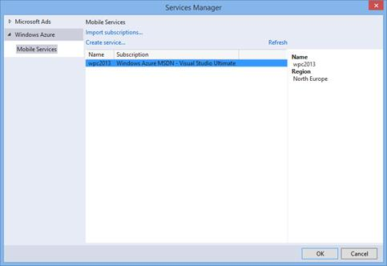
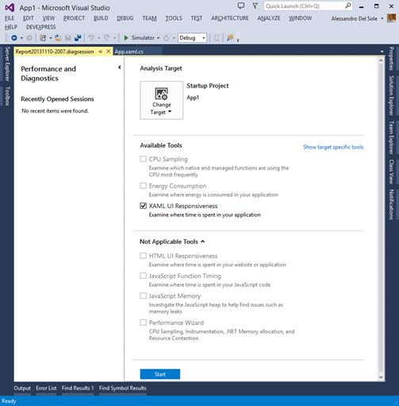

# 第七章 Visual Studio 2013
for Windows 8.1

仅仅一年后就发布了新版本的 Visual Studio 的一个原因是其他几项技术已经更新。可能最重要的更新是 Windows 8.1。，它在现有基础架构中引入了许多新的 API 和更改。因此，开发人员需要更新版本的。NET 框架(4.5.1)来支持 Windows 8.1 和基于。NET 4.5.1。本章介绍了集成开发环境中与 Windows 商店应用程序开发相关的新功能。如果您希望了解 Windows 8.1 中的新 API，可以参考 [MSDN 文档](http://msdn.microsoft.com/en-us/library/windows/apps/bg182410.aspx)。

|  | 提示:第 4 章中讨论的 XAML 智能感知改进对 Windows 8.1 应用程序开发当然有效。由于我之前已经详细谈过这样的改进，我在这里不再重复。 |

## 新建项目模板

Windows 8.1 引入了一个名为`Hub`的新控件，它提供了在您的 Windows Store 应用程序中创建中央中枢的能力。基本上，hub 的概念是为用户提供一个登录页面，在一个地方提供应用程序不同部分的概述。在 Windows 8.1 之前，开发人员必须做一些工作来手动创建一个中枢。为了突出该控件的重要性，Visual Studio 2013 引入了`Hub`控件和一个名为 Hub App 的特定项目模板，该模板既可用于 XAML 模式，也可用于 HTML 模式，并且只有在 Windows 8.1 上运行 Visual Studio 2013 时才可用。图 88 显示了选择了新模板的新项目对话框。


图 88:新的中枢应用项目模板

理解`Hub`控件是如何工作的非常容易。您可以基于中枢应用程序模板创建一个新项目。项目准备好之后，在查看代码之前启动应用程序。通过使用鼠标或手指，您可以水平滚动主页，查看 Hub 如何允许创建内容部分或附加页面的快捷方式。图 89 显示了运行的示例应用程序。


图 89:中心控件允许组织内容和快捷方式。

现在看看 XAML 密码。内置的项目模板提供了一个非常丰富和强大的例子，但是您需要在更高层次了解的内容在下面的代码中表示。

```cs
    <Hub SectionHeaderClick="Hub_SectionHeaderClick">
    <Hub.Header>
    <Grid>
    <!-- Controls here... -->
    </Grid>
    </Hub.Header>
    <HubSection Width="780" Margin="0,0,80,0">
    <HubSection.Background>
    <!-- Your brush here... -->
    </HubSection.Background>
    <Grid>
    <!-- Controls here... -->
    </Grid>
    </HubSection>
    <HubSection Width="500" Header="Section 1">
    <DataTemplate>
    <!-- Your data-bound items here... -->
    </DataTemplate>
    </HubSection>
    </Hub>

```

其中，`Hub`控件公开了`Header`属性，该属性显示概述该部分主题的内容。由于 XAML 的等级性质，`Header`不仅可以是文本，还可以是一组嵌套控件。`Hub`控件包含`HubSection`控件，您需要总结多少主题就总结多少主题。`HubSection`控件非常通用，因为它可以存储任何类型的内容。从前面清单中的代码片段可以看到，您可以放置文本或面板，设置背景，甚至可以通过`DataTemplate`元素放置数据绑定控件。MSDN 代码库包含了一个非常好的用于 XAML 和 T10 的 T7 控件的例子，你可以下载用于附加测试。当然，MSDN 文档提供了所有你需要知道的关于使用`Hub`控件构建应用程序的信息。由于详细解释如何编程该控件超出了本书的范围，您可以查看 MSDN 上的相关[页面。](http://msdn.microsoft.com/en-us/library/windows/apps/windows.ui.xaml.controls.hub.aspx)

## 改进的设备工具窗口

当您在 Windows Store 应用程序上与设计人员一起工作时，您可以利用一个名为“设备”的有用工具窗口(也称为“设备”面板)。它允许更改应用程序的一些属性，这样您就可以在设计时预览您的编辑，避免每次都需要启动应用程序。设备面板在 Visual Studio 2013 中不是新的；它已经在 Visual Studio 2012 中可用，但现在已经重新组织并更新了新功能。图 90 显示了设备面板。


图 90:设备工具窗口

窗口上的属性是不言自明的，当您更改它们时，很容易在设计器上看到结果。总之，您可以:

*   使用“显示”属性在设计器中更改应用程序分辨率。
*   使用“方向”属性在水平和垂直方向之间切换。
*   使用 Edge 属性测试应用程序在屏幕上的显示方式。
*   选择具有高对比度属性的屏幕对比度。
*   使用覆盖缩放属性在不同的缩放上测试应用程序。缩放比例增加 40%。
*   更改主题，查看应用程序如何使用“主题”属性响应系统设置。
*   使用最小宽度属性建立最小应用宽度
*   使用 chrome 属性在设计器中显示或移除设备 Chrome。
*   使用“剪切显示”属性剪切整个文档或显示文档显示。

“设备”面板是一个很好的伴侣，可以直接在设计器中预览应用程序的行为，这样您就可以更改应用程序的布局和外观，并查看您得到的结果是否是您(和您的用户)所期望的。

## 连接 Windows Azure 移动服务

在第 5 章中，您在服务器资源管理器窗口中发现了新的特性，可以从集成开发环境中提供与 Windows Azure 服务的集成。您已经学习了什么是移动服务，以及如何从服务器资源管理器创建移动服务。继续与云平台集成，Visual Studio 2013 允许在 Windows 8.1 应用程序中轻松连接到移动服务。

在商店应用程序中，首先保存项目——否则工具不会工作，不会给你任何警告。然后在解决方案资源管理器中右键单击项目名称，然后选择**添加**、**连接服务**。此时将出现“服务管理器”对话框。选择 **Windows Azure** 节点，查看可用服务列表，如图 91 所示。



图 91:服务管理器对话框显示了可用的移动服务。

单击**确定**后，会添加一个服务参考。Visual Studio 2013 将自动添加对所需程序集的引用，以便在代码中连接到服务并管理存储在服务中的数据。您可以在解决方案资源管理器中展开**引用**节点，查看引用了哪些库；图 92 展示了这一点。


图 92:添加了支持移动服务编码的参考

与移动服务交互所需的新程序集是 Microsoft.WindowsAzure.Mobile.dll 和 Microsoft.WindowsAzure.Mobile.Ext.dll。其他程序集是。NET 运行时，并且是通过网络上的 JSON 格式序列化和反序列化数据所必需的。不限于此，Visual Studio 2013 还将在`App`类代码中添加以下行(`yourmobileservice`代表您的服务的名称，`YOURSECRETKEY`代表客户端密钥，这两个都是适当添加的):

*Visual C#*

```cs
    public static >Microsoft.WindowsAzure.MobileServices.MobileServiceClient yourmobileserviceClient = new
    Microsoft.WindowsAzure.MobileServices.MobileServiceClient(
    "https://yourmobileservice.azure-mobile.net/",
    "YOURSECRETKEY");

```

*Visual Basic*

```cs
    Public Shared >yourmobileserviceClient As New
    Microsoft.WindowsAzure.MobileServices.MobileServiceClient(
    "https://yourmobileservice.azure-mobile.net/",
    "YOURSECRETKEY");

```

通过创建`Microsoft.WindowsAzure.MobileServices.MobileServiceClient`类的实例，您的应用程序将能够连接到指定的移动服务。要更深入地了解您需要编写的代码，以便从应用程序中管理数据和通信设备操作，您可以遵循 Windows Azure 文档中[移动服务入门](http://www.windowsazure.com/en-us/develop/mobile/tutorials/get-started/)页面中显示的示例，该页面还提供了在其他平台中使用这些服务的指导。

## 异步调试

Visual Studio 2013 引入了一个名为“任务”的新工具窗口，它帮助开发人员调试根据上一版本引入的异步/等待模式编写的异步操作。这个功能在上一章已经详细讨论过了，所以您应该可以在 Windows Store 应用程序中成功使用它。

## 使用 XAML 用户界面响应工具分析性能

Visual Studio 2013 为 XAML 商店应用程序带来了用户界面响应工具，该工具已经可用于 HTML/JavaScript 商店应用程序。顾名思义，该工具分析用户界面性能，并生成关于应用程序行为的详细报告。要使用此工具，您需要打开在上一章中发现的性能和诊断中心。可见时，必须选择 **XAML UI 响应**复选框，如图 93 所示。



图 93:选择 XAML 用户界面响应工具

准备好后，点击**开始**按钮。使用你的应用一段时间，然后关闭它或返回到 Visual Studio，点击**停止收集**超链接。几秒钟后，Visual Studio 显示关于收集的表演信息的详细报告；图 94 显示了一个例子。


图 94:选择 XAML 用户界面响应工具

报告可分为四个主要部分。让我们更详细地讨论它们。

### 诊断会话

诊断会话报告显示关于应用程序生命周期和用户交互的信息。它显示测试持续时间，并显示应用程序激活所需的时间。本节对于发现成功提交应用程序必须避免的重要性能问题非常有用。

### 用户界面线程利用率

用户界面线程利用率部分显示了运行时管理的不同任务如何利用用户界面线程的百分比。您可以了解 XAML 解析器消耗了多少资源(蓝色)，渲染用户界面消耗了多少资源(深橙色)，执行应用程序代码消耗了多少资源(浅绿色)，以及与 XAML 相关的其他任务消耗了多少资源(不是解析)。这对于了解代码的哪些部分对整体性能有最大的负面影响非常有用。

### 视觉吞吐量(FPS)

此部分显示了在应用程序生命周期中每秒渲染多少帧(FPS)；对于计时，您可以将诊断会话作为参考。这个工具非常简单，可以在用户界面线程和合成线程中显示框架。如果将鼠标指针放在图形上，您将看到一个工具提示，显示给定时间两个线程的每秒帧数。

|  | 提示:如果您是 Windows Store 应用程序开发的新手，您可能不熟悉合成线程的概念。合成线程是在 Windows Phone 中引入的，并且是用户界面线程的伴随线程，因为它做了一些用户界面线程通常会做的工作。合成线程通常负责组合图形纹理，并将其发送到图形处理器进行渲染。这都是由运行时管理的；通过调用复合线程，运行时可以让应用程序保持更高的响应速度，而作为开发人员，您不需要做任何额外的工作。 |

### 热元素和解析

在报告的底部，您会发现两个选项卡，**热元素**和**解析**。热元素显示用户界面元素列表(。NET 对象及其完全限定名)以及它们忙于应用程序执行的时间(以毫秒为单位)。列表中的对象可以展开以显示嵌套的控件和类型。当您单击一个对象时，您还将能够在窗口的右侧看到其他信息，如嵌套元素计数、XAML 代码文件(如果不是系统对象)和控件模板。“解析”选项卡显示应用程序包中的 XAML 文件列表，以及解析所需的时间(毫秒)。该工具不仅限于您在解决方案资源管理器中看到的 XAML 文件，还可用于应用程序中预打包的内置 XAML 文件。

## 章节总结

Windows 8.1 是 Windows 8 操作系统的新重大升级，它引入了大量新的 API 和功能，开发人员可以利用它们来构建令人惊叹的应用程序。Visual Studio 2013 是您为 Windows 8.1 构建应用程序所需的环境。这个新版本引入了一个新的`Hub`控件，Visual Studio 2013 使用 Hub App 项目模板支持该控件。在设计时，您可以通过“设备”面板获得应用程序外观的预览。您现在可以轻松连接到 Windows Azure 移动服务，Visual Studio 将为您完成大部分工作。优秀的应用程序是流动且快速的应用程序，因此有了 Visual Studio 2013，您就有了一个名为 XAML UI responsibility 的新分析工具，它可以帮助您了解应用程序如何以及在哪里花费更多的时间和消耗更多的资源。