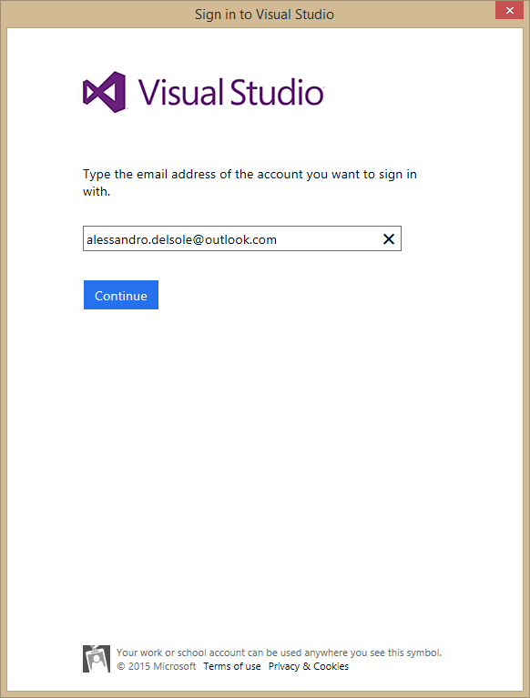
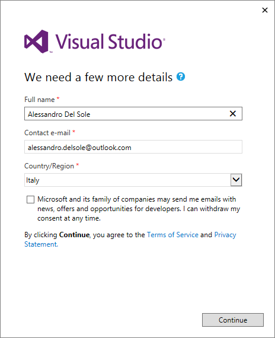

# 第一章账户管理经验

你从我之前的书 *Visual Studio 2013 简洁地*中了解到，Visual Studio 2013 第一次给了开发人员使用微软账号登录 Visual Studio 的能力。虽然不是强制性的，但这提供了许多好处，例如如果您是 MSDN 订阅者，可以解锁 Visual Studio，永久解锁 Visual Studio Express 版本(现已被 Visual Studio Community 取代)，以及延长试用版期限。最重要的是，开发人员可以利用同步设置，这些设置可以在 Visual Studio 的多个安装中漫游；这意味着他们将自动在他们使用的任何计算机上使用相同的设置。正如您将在本章中了解到的，Visual Studio 2015 通过使用微软帐户登录，进一步提供了更多可能性。

## 账户管理

Visual Studio 2015 通过支持多个微软帐户登录开发环境，扩展了登录体验。有多个帐户登录到 Visual Studio 很常见，原因如下:

*   用于开发和测试应用程序(或其他目的)的独立帐户。
*   工作和家庭分开记账。
*   在一台机器上工作的多个开发人员的独立帐户。

要简化账户管理，使用**账户设置**窗口。您有两个选项来启动它:

*   选择**文件** > **账户设置**。
*   点击**账户设置...**位于当前配置文件信息下的超链接，位于集成开发环境的右上角(见图 1)。

图 1:定位**账户设置**超链接。

假设您只有一个与 Visual Studio 相关联的 Microsoft 帐户，那么“帐户设置”窗口应该如图 2 所示。

图 2:帐户设置窗口。

如您所见，Visual Studio 2015 显示了当前用户的摘要信息。在底部可以找到**所有账户**组，包含关联的微软账户列表；该列表允许添加和删除帐户。要添加另一个帐户，请单击**添加帐户……**超链接。此时，Visual Studio 需要指定您想要添加的 Microsoft 帐户，如图 3 所示。

图 3:向 Visual Studio 2015 添加微软帐户。

如果这是您第一次使用该帐户登录，Visual Studio 2015 还将创建一个新的在线配置文件，这是在 [Visual Studio Online](http://www.visualstudio.com/en-us/products/what-is-visual-studio-online-vs.aspx) (以前称为 Team Foundation Service)上同步信息和注册帐户所必需的。如果是这种情况，Visual Studio 将要求您指定基本身份信息，如图 4 所示。

图 4:创建新的在线配置文件时指定基本身份信息。

|  | 提示:通过在“帐户设置”窗口的“个性化帐户”组中选择“管理 Visual Studio 配置文件”，可以编辑 Microsoft 帐户的在线配置文件。您还可以指定一张图片，并查看与该配置文件相关联的 Visual Studio Online 帐户列表。 |

一旦创建了在线配置文件，或者如果不是第一次使用该帐户，则**帐户设置**窗口将更新关联的微软帐户列表，如图 5 所示。

图 5:可用帐户的更新列表。

这样，您就有了一个集中的地方来管理帐户，每个微软帐户都可以利用同步设置等优势。当您管理完账户后，只需点击**关闭**或从当前账户注销并使用不同的账户登录。

|  | 提示:更改帐户时，不需要关闭打开的项目。 |

## 自动登录微软服务

使用 Visual Studio 2015 构建应用程序时，您可能需要访问许多 Microsoft 服务，例如您的 Azure 订阅、Visual Studio Online 帐户、应用程序洞察(托管在 Azure 上)、Azure 移动服务或 Windows Store 开发人员订阅。

|  | 注意:Application Insights 目前是托管在您的 Microsoft Azure 订阅上的预览服务，它允许对 web 和移动应用程序的可用性、性能和使用情况进行实时监控和遥测。为网络或移动应用程序创建项目时，可以启用应用程序洞察。对应用程序洞察的支持是在 Visual Studio 2013 更新 2 中引入的，因此这里不做介绍。您可以在这里找到更多信息[。](http://bit.ly/1w2hCLm) |

前面提到的所有服务都需要使用微软帐户登录。在 Visual Studio 2015 中，当您登录时，IDE 会自动将当前帐户连接到任何关联的 Microsoft 服务；您不需要每次都输入您的凭据。例如，如果您用来登录的 Microsoft 帐户也是 Microsoft Azure 订阅上的管理员帐户，Visual Studio 2015 将自动将“服务器资源管理器”窗口连接到 Azure 订阅，以便您可以立即从 IDE 中与服务进行交互；如果您之前设置了 Visual Studio Online 帐户，Visual Studio 将自动连接到该帐户，并使源代码管理立即可用。此外，Visual Studio 2015 使得在创建连接的服务或设置应用程序洞察时可以轻松选择帐户。例如，图 6 显示了连接到 Visual Studio Online 的团队资源管理器，以及在访问订阅时选择相关帐户之一的选项。

图 6:使用微软帐户轻松登录服务。

图 7 显示了在向新项目添加应用洞察遥测时选择微软帐户是多么容易(这需要一个活动的 Azure 订阅)。

图 7:为应用洞察选择微软账户。

值得一提的是，当您使用微软帐户登录时，Visual Studio 2015 不会存储您的任何凭据。身份验证是针对基于网络的身份提供者进行的，身份提供者可以是微软帐户提供者或 Azure 活动目录。如果身份验证成功，身份提供程序会给 Visual Studio 一些身份验证令牌，这允许 Visual Studio 2015 安全地处理身份验证令牌。

## 章节总结

Visual Studio 2015 通过引入对多个微软帐户的支持，并通过启用到与登录帐户相关联的微软服务的自动连接，扩展和增强了登录体验。毫无疑问，这使得连接到服务变得更加容易，并通过避免注销然后使用不同的帐户再次登录来提高生产率。