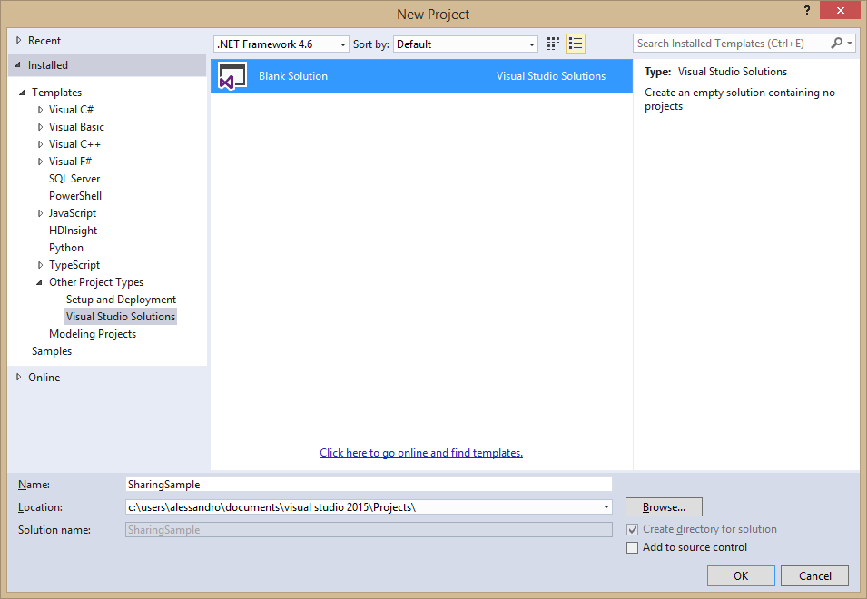
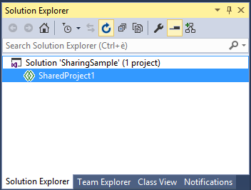
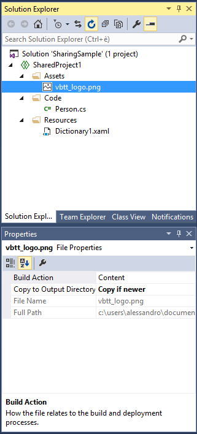
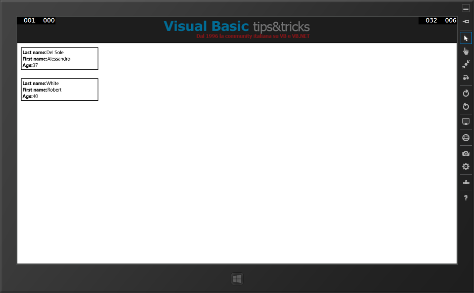

# 第二章共享项目

对开发人员来说，最理想的特性之一是能够一次性编写代码，并在多种类型的应用程序之间共享该代码。Visual Studio 2015 通过引入共享项目简化了共享代码的过程。如果您在过去使用 Visual Studio 2013 Update 2 或更高版本创建了通用 Windows 应用程序，那么您已经了解了什么是共享项目，但是现在您可以使用它们在其他项目类型之间共享代码。本章讨论共享项目，并解释它们的结构和用法。

|  | 注意:本章假设您在创建和管理解决方案和项目、添加对其他项目的引用方面有一定的经验，并且您知道这些任务的术语。 |

## 了解共享项目

共享项目允许跨多个项目类型共享代码、资产和资源。更具体地说，以下项目类型可以引用和使用共享项目:

*   控制台、窗口窗体和窗口演示基础。
*   Windows 商店 8.1 应用程序和 Windows Phone 8.1 应用程序。
*   Windows Phone 8.0/8.1 Silverlight 应用程序。
*   可移植类库。

Visual Studio 2013 Update 2 首先引入了共享项目，为构建支持 Windows 8.1/Windows Phone 8.1 对的通用 Windows 应用程序提供了一个简单的机会；现在，共享项目对上述所有项目以及 C#和 Visual Basic 都可用。需要强调的重要一点是，您不仅共享代码，还共享资产和资源，例如(但不限于)图像和 XAML 模板。从技术上讲，共享项目是松散的文件分类，然后像链接文件一样添加到引用它们的任何项目中。他们实际上并不针对任何特定的目标。NET 子集，并且不生成. dll 库；在幕后，构建解决方案时，MSBuild 工具对共享项目执行与链接文件相同的规则。

## 创建和使用共享项目

共享项目可通过**新建项目**对话框中的特定项目模板获得。要了解它们是如何工作的，请创建一个包含共享项目、WPF 项目和 Windows 8.1 Store 应用程序项目的新解决方案。在 Visual Studio 2015 中，选择**文件** > **新建** > **项目**。不要直接新建项目，选择**其他项目类型**/**Visual Studio Solutions**下的**空白解决方案**新建空白解决方案(见图 8)。命名新解决方案**共享示例**，点击**确定**。



图 8:创建空白解决方案。

下一步是添加共享项目。您可以在解决方案资源管理器中右键单击解决方案名称，然后选择**添加** > **新项目**或选择**文件** > **添加** > **新项目**。在**新增** **新增** **项目**对话框中可以看到(见图 9)，列表中有**共享项目**模板。您可以选择 C#或 Visual Basic(两者都有示例)。


图 9:添加共享项目。

您可以选择您想要的任何名称或保留默认名称，然后单击**确定**。正如您在解决方案资源管理器中看到的，共享项目具有非常简单的结构；它由绿色图标表示，如图 10 所示。



图 10:解决方案资源管理器中的共享项目。

|  | 注意:在幕后，共享项目由带有。shproj 扩展名，它基本上包含编译过程所需的 MSBuild 规则，加上一个扩展名为. projitems 的文件，该文件包含要共享的项目列表。 |

共享项目的目标是更容易共享代码、资源和资产。向名为**代码**、**资源**和**资产**的项目添加三个文件夹。现在，假设您想在 WPF 项目和 Windows 8.1 商店项目之间共享一个 XAML 模板、一个图像和一些代码。右键单击**代码**文件夹，选择**添加** > **新项目**。在**新增项目**对话框中，选择**类**模板，命名新类 **Person.cs** (见图 11)。


图 11:添加共享类。

下面的代码示例包含一个`Person`类的定义和一个名为`People`的集合，该集合包含一些`Person`类的示例实例。

C#代码示例

```cs
      using System.Collections.ObjectModel;

      namespace SharedProject1
      {
          public class Person
          {
              public string FirstName { get; set; }
              public string LastName { get; set; }
              public int Age { get; set; }
          }

          public class People : ObservableCollection<Person>
          {

              public People()
              {
                  //Add sample data
                  var p1 = new Person();
                  p1.LastName = "Del Sole";
                  p1.FirstName = "Alessandro";
                  p1.Age = 37;

                  var p2 = new Person();
                  p2.LastName = "White";
                  p2.FirstName = "Robert";
                  p2.Age = 40;

                  this.Add(p1);
                  this.Add(p2);
              }
          }}

```

Visual Basic 代码示例

```cs
      Imports System.Collections.ObjectModel

      Public Class Person
          Public Property FirstName() As String
          Public Property LastName() As String
          Public Property Age() As Integer
      End Class

      Public Class People
          Inherits ObservableCollection(Of Person)

          Public Sub New()
              'Add sample data
              Dim p1 = New Person()
              p1.LastName = "Del Sole"
              p1.FirstName = "Alessandro"
              p1.Age = 37

              Dim p2 = New Person()
              p2.LastName = "White"
              p2.FirstName = "Robert"
              p2.Age = 40

              Me.Add(p1)
              Me.Add(p2)
          End SubEnd Class

```

`People`集合是 WPF 和视窗商店应用程序都将在屏幕上显示的数据；由于这两种应用程序类型都基于 XAML，因此创建一个将在解决方案中共享的数据模板是一个好主意。为此，右键单击**资源**文件夹，选择**添加** > **新项目**。在**新增项目**对话框中，定位 **XAML** 节点，选择**资源字典**，如图 12 所示。


图 12:添加共享资源字典。

在代码中，您指定了一个新的`DataTemplate`对象，它包含一些`TextBlock`控件，排列在`StackPanel`容器中，绑定到`Person`类的属性。

```cs
      <ResourceDictionary

          xmlns:x="http://schemas.microsoft.com/winfx/2006/xaml">

        <DataTemplate x:Key="MyTemplate">
          <Border Width="240" BorderBrush="Black" BorderThickness="2" Margin="3">
            <StackPanel Orientation="Vertical" Margin="3">
              <StackPanel Orientation="Horizontal">
                <TextBlock Text="Last name:" FontWeight="Bold" />
                <TextBlock Text="{Binding LastName}"/>
              </StackPanel>
              <StackPanel Orientation="Horizontal">
                <TextBlock Text="First name:" FontWeight="Bold"/>
                <TextBlock Text="{Binding FirstName}"/>
              </StackPanel>
              <StackPanel Orientation="Horizontal">
                <TextBlock Text="Age:" FontWeight="Bold"/>
                <TextBlock Text="{Binding Age}"/>
              </StackPanel>
            </StackPanel>
          </Border>
        </DataTemplate></ResourceDictionary>

```

为了成功地将资源字典共享给两个目标，您必须删除以下特定于 Windows Store 和 Windows Phone 的 XML 命名空间别名。

```cs
      xmlns:local="using:SharedProject1.Resources"

```

共享项目的最后一步是添加示例图像。右键单击**资产**文件夹，选择**添加** > **现有项目**，然后从支持的文件格式中选择一个您选择的图像文件，如 JPG、PNG、GIF 或 BMP。为了使图像文件可供 WPF 使用，在**属性**窗口中，将**复制到输出目录**属性设置为**如果更新则复制**。图 13 显示了共享项目如何出现在解决方案资源管理器中，以及如何在属性窗口中设置图像文件的属性。



图 13:共享项目的当前外观。

此时，您希望添加第一个客户端项目。选择**文件** > **添加** > **新项目**并在**新项目**对话框中选择 **WPF 应用**项目模板；为了示例的一致性，将新项目命名为 **MyWPFApp** (见图 14)。


图 14:添加 WPF 客户端项目。

项目可用后，首先要做的是添加对共享项目的引用。正如我之前告诉您的，共享项目不会生成程序集，因此添加对共享项目的引用实际上意味着将共享项目中的代码文件链接到当前项目。向共享项目添加引用时，**引用管理器**对话框会显示一个名为**共享项目**的特殊节点，您可以在其中找到解决方案中的共享项目列表(参见图 15)。


图 15:添加对共享项目的引用。

选择共享项目，点击**确定**。

|  | 提示:如果在解决方案资源管理器中展开“引用”节点，您将看到共享项目的图标与程序集的图标不同。这提醒我们，共享项目不会生成程序集。 |

在 WPF 应用程序中，您希望使用驻留在共享资源字典中的资源。要实现这一点，您需要在 App.xaml 文件(或 Visual Basic 中的 Application.xaml)中添加一个资源字典，如下面的代码所示。

```cs
          <Application.Resources>
                       <ResourceDictionary>
                  <ResourceDictionary.MergedDictionaries>
                      <ResourceDictionary Source="/Resources/Dictionary1.xaml"/>
                  </ResourceDictionary.MergedDictionaries>
              </ResourceDictionary>    </Application.Resources>

```

请注意如何通过相对统一资源标识符(URI)指定字典位置，该标识符包括共享项目中的子文件夹名称。不要担心如果`Source`属性值带有错误标记下划线(语义错误通知)，资源字典肯定会在运行时被解析。示例应用程序的用户界面非常简单。在**主窗口中，放置一个`Grid`容器；这将显示作为应用程序徽标的图像文件和呈现数据列表的`ListBox`控件。请注意如何使用简化的相对 URI 指向图像文件；URI 包括子文件夹名称，因为它出现在共享项目中。**

```cs
      <Window x:Class="MyWPFApp.MainWindow"

              xmlns:x="http://schemas.microsoft.com/winfx/2006/xaml"
              xmlns:d="http://schemas.microsoft.com/expression/blend/2008"
              xmlns:mc="http://schemas.openxmlformats.org/markup-compatibility/2006"
              xmlns:local="clr-namespace:MyWPFApp" Loaded="Window_Loaded"
              mc:Ignorable="d"
              Title="MainWindow" Height="350" Width="525">
          <Grid>
              <Grid.RowDefinitions>
                  <RowDefinition Height="80"/>
                  <RowDefinition/>
              </Grid.RowDefinitions>

              <!--Replace with a file name of your choice...-->
              <Image Source="../SharedProject1/Assets/LogoVBTT.jpg"/>

              <ListBox ItemTemplate="{StaticResource MyTemplate}" Name="DataBox"
                       Grid.Row="1"/>
          </Grid></Window>

```

如代码中突出显示的，您还必须为`Window.Loaded`事件提供一个事件处理程序，这是加载数据的地方。关于`ListBox`，您分配在共享资源字典中定义的名为`MyTemplate`的`DataTemplate`作为项目模板来呈现`Person`类的每个实例。`Window.Loaded`事件处理程序只是创建一个`People`集合的实例；实例被分配给`ListBox.ItemsSource`属性来填充它。

C#代码示例

```cs
              //Requires a using SharedProject1.Code directive
              private void Window_Loaded(object sender, RoutedEventArgs e)
              {
                  this.DataBox.ItemsSource = new People();        }

```

Visual Basic 代码示例

```cs
          Private Sub Window_Loaded(sender As Object, e As RoutedEventArgs)
              Me.DataBox.ItemsSource = New People()    End Sub

```

|  | 提示:请记住，C#为项目中包含代码的每个子文件夹定义了一个命名空间。为此，您必须放置一个`using SharedProject1.Code`指令来导入子文件夹的内容。 |

如果您现在运行示例项目，您将获得类似于图 16 的结果(当然，您可能使用了不同的图像文件)。


图 16:添加对共享项目的引用。

这当然是一个简单的例子，但目标是了解如何共享不同类型的资源。此时，使用**空白应用(Windows 8.1)** 模板添加一个新的 Windows Store 应用，如图 17 所示。将新项目命名为**我的窗口 App** ，点击**确定**。


图 17:添加一个窗口商店项目。

现在执行以下操作:

*   添加对共享项目的引用，就像您在 WPF 项目中所做的那样。
*   在 App.xaml 文件(或 Visual Basic 中的 Application.xaml)中，添加与您已经在 WPF 项目的 App.xaml 中编写的相同的 xaml 代码。
*   在 MainPage.xaml 文件中，添加您已经在 WPF 项目的 MainWindow.xaml 文件中编写的相同的`Grid`内容定义。

为`Page.Loaded`事件添加事件处理程序。MainPage.xaml 的完整 XAML 代码如下。

```cs
      <Page
          x:Class="MyWindowsApp.MainPage"

          xmlns:x="http://schemas.microsoft.com/winfx/2006/xaml"
          xmlns:local="using:MyWindowsApp" Loaded="Page_Loaded"
          xmlns:d="http://schemas.microsoft.com/expression/blend/2008"
          xmlns:mc="http://schemas.openxmlformats.org/markup-compatibility/2006"
          mc:Ignorable="d">

          <Grid Background="{ThemeResource ApplicationPageBackgroundThemeBrush}">
              <Grid.RowDefinitions>
                  <RowDefinition Height="80"/>
                  <RowDefinition/>
              </Grid.RowDefinitions>
              <Image Source="Assets/vbtt_logo.png"/>
              <ListBox ItemTemplate="{StaticResource MyTemplate}" Name="DataBox"
                       Grid.Row="1"/>
          </Grid></Page>

```

`Page.Loaded`事件处理程序与 WPF 事件处理程序相同，除了这里有一个`Page`而不是一个`Window`。

C#代码示例

```cs
              //Requires a using SharedProject1.Code directive
              private void Page_Loaded(object sender, RoutedEventArgs e)
              {
                  this.DataBox.ItemsSource = new People();        }

```

Visual Basic 代码示例

```cs
          Private Sub Page_Loaded(sender As Object, e As RoutedEventArgs)
              Me.DataBox.ItemsSource = New People()    End Sub

```

将 Windows Store 项目设置为启动项目，然后按 **F5** 。如您所见，该应用程序显示了相同的图像和数据，这是通过使用与 WPF 应用程序相同的数据模板呈现的(见图 18)。



图 18:运行的视窗商店应用程序。

很容易理解如何利用共享项目在多个项目类型之间共享各种项目，包括代码、资产和资源。共享 XAML 和 C#/VB 代码可能是共享项目提供的最有趣的机会。

|  | 注意:共享项目和可移植类库(PCL)都允许共享代码、XAML 资源和资产，但是当然也有一些不同之处，可以总结如下。共享项目不会产生可重用的程序集，因此只能在解决方案中使用。共享项目支持特定于平台的代码，因为它支持环境变量，如 WINDOWS_PHONE_APP 和 WINDOWS_APP，您可以使用它们来检测代码运行在哪个平台上。最后，共享项目不能依赖于第三方库。相比之下，PCL 产生了一个可重用的。dll 库，并且可以依赖于第三方库，但是它不支持平台环境变量。 |

## 章节总结

Visual Studio 2015 共享项目首次在 Visual Studio 2013 Update 2 中推出，用于构建通用 Windows 应用程序，可用于各种项目类型，如 WPF、Windows 窗体、Windows 商店、Windows Phone 和便携式库。使用共享项目，您可以一次性编写 C#/VB 代码，并将其共享给解决方案中的多个项目，还可以轻松共享 XAML 资源，如样式、控件模板和数据模板，以及图像文件等资产。共享项目并不总是共享项目的最终解决方案；事实上，在某些情况下，您可能会更喜欢可移植库，比如您需要创建一个可重用的。以特定的。NET 子集。无论如何，共享项目绝对是一个节省时间的简单而轻量级的机会。