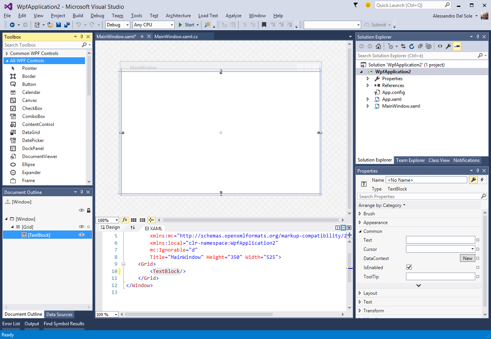
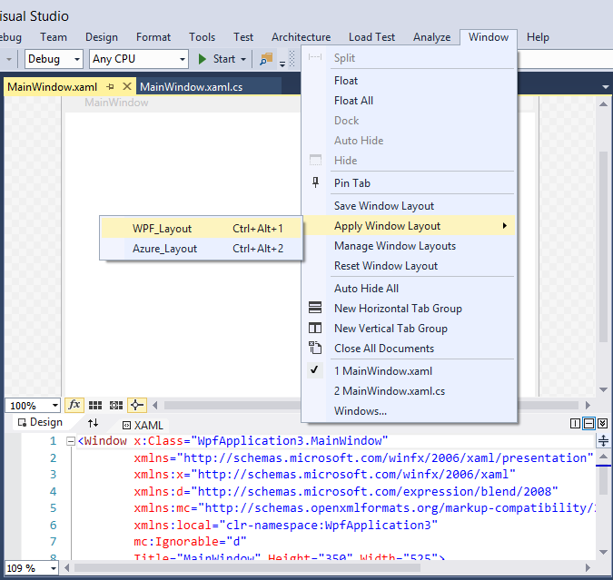

# 第 5 章 IDE 定制:窗口布局

多年来，Visual Studio 提供了大量定制开发环境的方法。这包括自定义工具栏、设置、菜单命令、代码编辑器和工作区的其他部分。毕竟，作为一名开发人员，你在 Visual Studio 中花了这么多时间，所以你必须能够根据个人喜好和需求调整环境。Visual Studio 2015 引入了一个名为“自定义窗口布局”的新自定义，它使您更容易组织工作空间。

## 自定义窗口布局

Visual Studio 2015 以及它的前辈有许多工具窗口，它们可以排列在工作区上，甚至可以停靠在开发环境的四面。解决方案资源管理器、工具箱、错误列表和属性都是相关工具窗口的示例。通常，您会根据正在处理的项目类型来组织工作空间。但是，当您切换到另一个项目类型时，您可能会使用不同的工具窗口并重新组织您的工作空间。在不同的项目类型之间切换，并因此切换到不同的窗口布局，将需要手动重新排列所有必要的工具窗口。此外，如果您在多台机器上使用 Visual Studio，则必须在每次安装时安排您的窗口布局。为了让您的生活更轻松，Visual Studio 2015 引入了一种自定义工作区的新方法，称为“自定义窗口布局”。这个新功能允许使用方便的工具保存、管理、重新应用和漫游您的窗口布局。

### 保存窗口布局

要了解自定义窗口布局是如何工作的，首先假设您在为 windows 处理 WPF 项目时打开了特定的工具窗口。图 40 提供了一个示例，您可以在其中看到工具箱、文档大纲、解决方案资源管理器和属性工具窗口。

图 40:WPF 项目的示例窗口布局。

假设您现在需要更改项目类型，切换到 Azure 平台的 web 项目。您将需要打开完全不同的工具窗口，这意味着现在和项目的未来工作将失去当前布局。Visual Studio 2015 现在为保存和恢复窗口布局提供了一个简单的机会。**窗口**菜单提供了一个名为**保存窗口布局**的新命令。这将打开**保存窗口对话框**，在这里您可以输入当前布局的名称，如图 41 所示。

图 41:为窗口布局提供一个名称。

此时，您的窗口布局将被保存以备后用。

|  | 提示:当您使用 Microsoft 帐户登录时，自定义窗口布局会在所有 Visual Studio 2015 安装中同步。这意味着您可以在不同的机器上运行 Visual Studio 2015，并找到所有保存的布局。 |

### 应用窗口布局

想象一下，在完成一个 WPF 项目后，您需要切换到一个用于 Azure 平台的项目，例如一个移动服务项目。您肯定会使用不同的工具窗口，如服务器资源管理器、SQL Server 对象资源管理器和 HDInsight 任务列表。图 42 显示了这种项目的窗口布局示例，但是您的有效首选项可能不同。

图 42:为不同的项目类型使用另一个窗口布局。

您可以保存当前的窗口布局，就像您在上一段中看到的那样，但是最重要的考虑是当您返回到您的 WPF 项目时。为了更好地理解，请关闭 Azure 项目并打开一个新的或现有的 WPF 项目。**窗口**菜单提供了一个名为**应用窗口布局**的命令，允许在保存的布局列表中选择不同的窗口布局，如图 43 所示。

图 43:应用窗口布局。

当您从列表中选择一个时，Visual Studio 2015 将在应用不同的布局之前要求确认。此时，您将恢复原始工作空间，显示与 WPF 一起工作所需的所有工具窗口。

|  | 注意:只有当前项目类型支持窗口布局中的所有工具窗口，Visual Studio 2015 才能完全恢复窗口布局。例如，在当前示例中，如果您试图在 Azure 项目仍处于打开状态时应用 WPF 布局，则文档大纲工具窗口将不会被恢复，因为 Azure 项目不支持它。更一般地说，它没有得到不同于 XAML 项目的支持。这就是为什么您应该首先打开一个特定的项目，然后应用布局。 |

### 管理自定义窗口布局

Visual Studio 2015 还提供了一种管理自定义窗口布局的简单方法。“窗口”菜单中的“管理窗口布局”命令打开“管理窗口布局”对话框(参见图 44)，您可以在其中删除布局、重命名布局以及移动列表中的布局。

图 44:管理窗口布局。

### 恢复默认布局

Visual Studio 2015 附带默认窗口布局。使用**窗口**菜单中的**重置窗口布局**命令恢复默认布局。当您想要完全清理您的环境首选项并重新应用保存的布局时，此选项非常有用。

## 章节总结

Visual Studio 2015 中的自定义窗口布局通过保存、管理和恢复工作区中不同项目的工具窗口排列，提供了一种自定义 IDE 的新方法。这个特性帮助您保持一个组织良好的开发环境。