# 八、ASP.NET 和 Azure 的 Visual Studio 2015

为网络和云环境构建应用程序是成千上万开发人员的核心业务。随着网络和云环境的持续并发发展，微软意识到开发人员需要合适的工具来快速高效地上市。基于。NET Core 5，最近发布的 ASP.NET 5 标志着 web 开发的新时代；ASP.NET 现在是一个能够在多个操作系统上运行的[开源](https://github.com/aspnet/Home)平台，比如 Linux 和 Mac OSX，你创建的项目只通过 NuGet 包使用必要的库，而不是完全依赖。NET 框架。这就是众所周知的云优化 ASP.NET；它使将 web 应用程序部署到 Microsoft Azure 变得更加容易。此外，微软 Azure 每次更新都提供强大的新服务和工具。所有这些重要的改进和新功能使 Visual Studio 2015 成为与 ASP.NET 和微软 Azure 一起构建网络应用程序的最佳场所。本章从开发环境的角度解释了有哪些新功能可以帮助您提高工作效率。

|  | 注意:详细解释 ASP.NET 5 和微软 Azure 需要整本书，所以在这种情况下，提供如何构建应用程序的指导是不可能的。ASP.NET 有一个完全重访的基础设施和许多新功能，使得在这本书里做一个简短的总结是不可能的。相反，在官方网站上了解更多关于[ASP.NET](http://www.asp.net/)和[微软 Azure](http://azure.microsoft.com) 的信息，包括这两项技术的完整文档。 |

## 章节先决条件

假设您从可用的安装选项中选择了 web 开发工具，那么使用 ASP.NET 5 所需的一切都已经包含在 Visual Studio 2015 中了。为了完成这一章，您需要以下两项:

*   Microsoft Azure 订阅—如果您是 MSDN 订户，您可以激活计划中包含的 Azure 订阅；如果您没有 Azure 套餐，可以获得 30 天的[免费试用。](http://azure.microsoft.com/en-us/pricing/free-trial/)
*   Visual Studio 2015 的 [Azure SDK](http://azure.microsoft.com/en-us/downloads/) ，可以通过免费的[微软网络平台安装工具](http://www.microsoft.com/web/downloads/platform.aspx)获得。发布时，Azure SDK 的当前版本是 2.5.1。

假设您已经安装了所有必要的组件并激活了 Microsoft Azure 订阅，那么您就可以在 Visual Studio 2015 中发现新功能了。

## ASP.NET 5 的 Visual Studio 2015

支持 ASP.NET 5 的最有趣的工具。Visual Studio 2015 中的 NET Core 5 基本上是新的项目模板、新的项目系统、支持多框架目标的增强 IntelliSense 以及更新的 NuGet 管理器。

|  | 提示:本章不包括如何管理 NuGet 包，因为它在第 7 章中已经讨论过了。请记住，前一章也适用于 ASP.NET。 |

### ASP.NET 5 个核心项目模板

Visual Studio 2015 添加了五个新的项目模板来支持 ASP.NET 5 Core。特别是**新项目**对话框的**网页**节点增加了两个新项目模板；它们是**类库(包)**和**控制台应用程序(包)**(见图 65)。

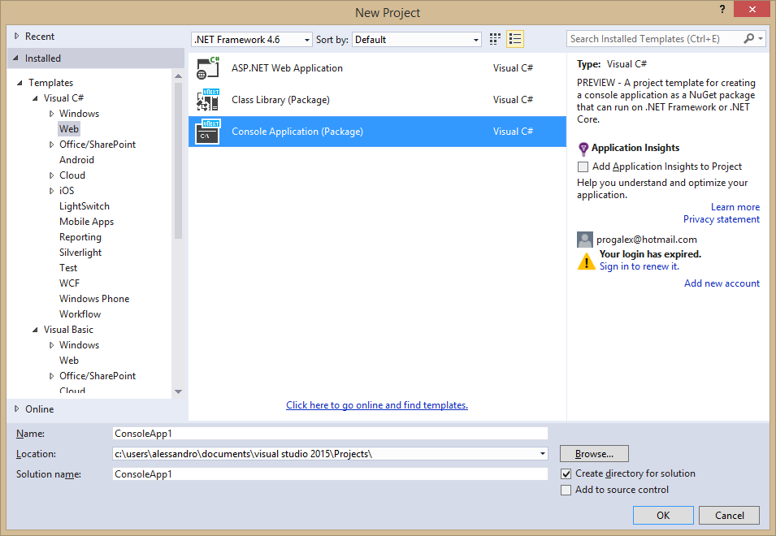

图 65:ASP.NET 5 类库和控制台应用程序新项目模板。

当您使用 ASP.NET 5 内核时，类库和控制台应用程序模板都会生成可以在多个平台上运行的程序集。其他三个项目模板已经添加到**新 ASP.NET 项目**对话框中，当您在**新项目**对话框中选择**ASP.NET 网络应用**模板时，该对话框出现。具体来说，您现在有一个名为 ASP.NET 5 预览模板的新组，包含**空**、**网站**和**网络应用编程接口**项目模板，如图 66 所示。

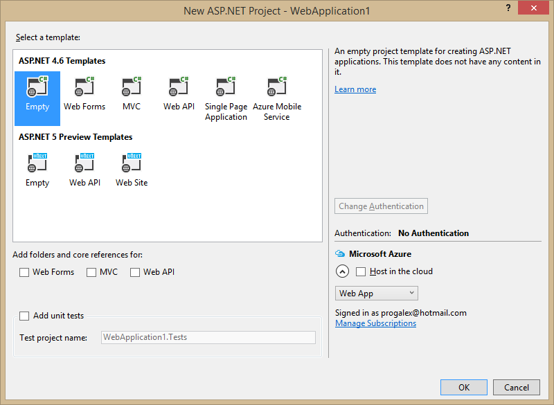

图 66:ASP.NET 5 新项目模板。

|  | 提示:当您安装 Azure SDK 2.5.1 或更高版本时，另一个名为 Azure Mobile App 的项目模板会添加到 ASP.NET 4.6 模板中。 |

ASP.NET 5 Starter Web 模板所做的是基于 [MVC 6](http://www.asp.net/mvc) 创建一个基本的 Web 应用程序，包括一些身份模型、控制器、视图和对实体框架迁移的支持。图 67 显示了当您创建一个新的 Starter Web 项目时会发生什么。您可以看到 Visual Studio 2015 如何提供一个重要的链接列表，用于学习新内容；它还在解决方案资源管理器中显示新的项目系统。

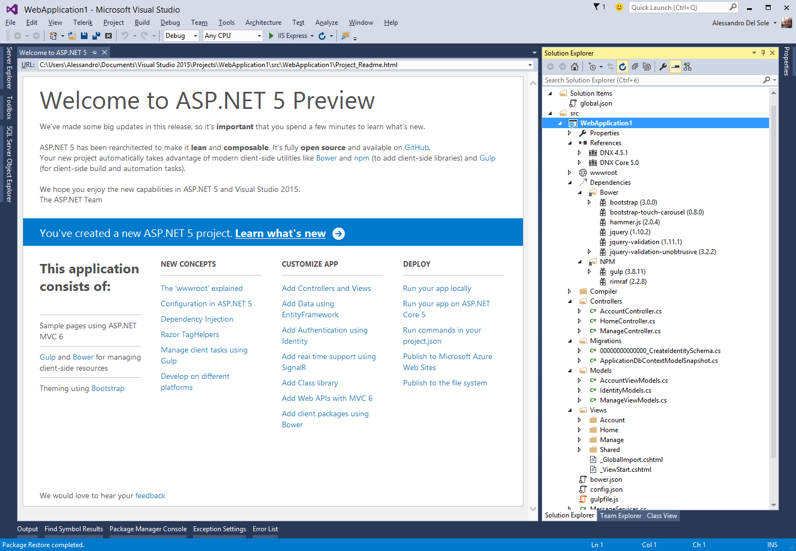

图 67:创建一个初学者网站项目。

如果您熟悉 ASP.NET MVC，您将能够重用您关于模型、视图和控制器的技能。这个项目模板还支持 Web API 来构建 RESTful HTTP 服务。巨大的差异反而与新的项目体系有关。

### 新的项目体系

正如您在解决方案资源管理器中展开所有项目项所看到的，ASP.NET 5 核心项目有了新的结构。这个新的项目系统允许静态文件和代码文件之间更清晰的分离，自动化的项目管理，以及更好的包管理。

#### wwwroot 节点

**wwwroot** 节点包含所有静态代码文件，如资产、字体、CSS 文件、JavaScript 文件和 HTML 文件。像 C#和 Razor 文件这样的代码文件永远不应该放在这个文件夹中，因为 wwwroot 在代码文件和静态文件之间提供了一个干净的隔离。

#### 依赖关系节点

**依赖关系**节点包含[鲍尔](http://bower.io/)和 [NPM](https://www.npmjs.org/) 的依赖关系。Bower 基本上是一个 Web 客户端包管理器，允许安装和恢复客户端包，包括 JavaScript 和 CSS 库。Bower 在客户端工作，所以您仍然会在服务器端框架(如 MVC 6)上使用 NuGet。相反，NPM 是一个最初为 Node.js 构建的包管理器。Visual Studio 2015 自动使用 Bower 来安装包，并在您可以在解决方案资源管理器中找到的 **Bower.json** 文件中生成包列表。您可以通过向**依赖关系**节点添加依赖关系来手动编辑 Bower.json。假设您想使用**requires js**库，您可以开始键入并获得 IntelliSense 帮助来在可用的库中进行选择，如图 68 所示。不限于此，您可以获得智能感知支持来选择可用版本之一(参见图 69)。

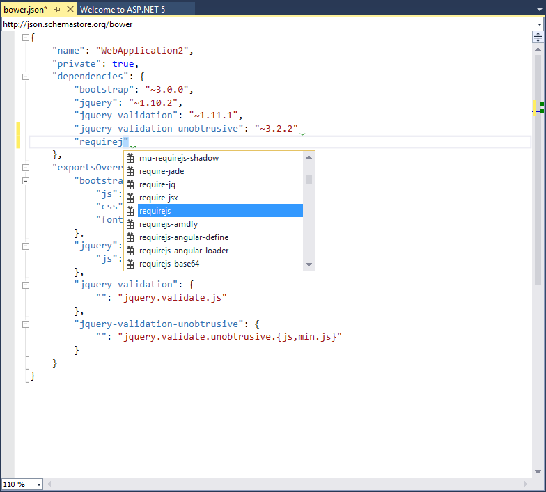

图 68:在智能感知支持下编辑 Bower.json 文件。


图 69:智能感知帮助您选择一个可用的版本。

完成编辑后，右键单击解决方案资源管理器中的 **Bower** 子文件夹，并选择**恢复包**(参见图 70)。

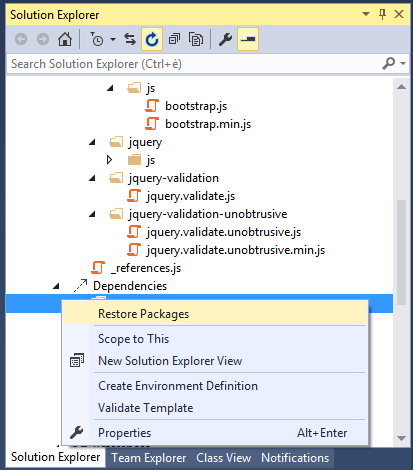

图 70:编辑 Bower.json 后恢复适当的包

在解决方案资源管理器中，您还会看到一个名为 **package.json** 的文件，其中包含 NPM 的依赖项列表。NPM 子文件夹包含特定于[咕噜](http://gruntjs.com/)的附加 JSON 文件。Grunt 是一个基于 JavaScript 的任务运行器，帮助自动化日常开发任务。ASP.NET 官方网站有一个[有趣的例子](http://www.asp.net/vnext/overview/aspnet-vnext/grunt-and-bower-in-visual-studio-2015#bower)展示了如何使用 Grunt 和 Starter Web 项目模板。这样的一个例子也解释了如何使用额外的特定于咕噜的工具，比如[任务运行器浏览器](http://www.hanselman.com/blog/IntroducingGulpGruntBowerAndNpmSupportForVisualStudio.aspx)窗口。

#### 新项目文件和 JSON 文件

ASP.NET 5 核心项目对文件和配置信息有不同的组织。具体而言，差异包括以下几点:

*   项目文件有**。kproj** 分机。项目文件不再包含任何目录项或引用，因为 Visual Studio 2015 会自动包含必要的文件。
*   **project.json** 文件包含引用和包依赖项、版本定义、框架配置、编译选项、构建事件、包创建元数据和命令的列表。将所有这些信息保存在一个 JSON 文件中非常有用，因为它可以在运行于 Linux 和 MacOS 并且没有安装 Visual Studio 2015 的项目上手动编辑。
*   使用 **config.json** 文件代替 Web.config，包含所有应用程序和服务器配置信息。当然，对于 ASP.NET 4.5 项目，Web.config 仍然存在。

#### 参考节点

参考节点显示 project.json 中列出的所有框架，默认选择(显示)的框架为 **DNX 4.5.1** 、 **DNX 核心 5.0** 。每个框架都包含在. NET 执行环境中引导和运行应用程序所需的代码，并由一个节点表示，该节点可以扩展以显示每个框架的包列表。

#### 编译器节点

编译器节点包含基于 Razor 引擎的预编译指令的代码文件。

### 智能感知改善

IntelliSense 是 Visual Studio 2015 中针对 ASP.NET 5 Core 进行改进的另一个地方。例如，由于您可能以多个框架为目标，例如 ASP.NET 5 和 ASP.NET 核心 5，所以当一个框架不支持某个成员时，IntelliSense 可以混合建议来显示警告，如图 71 所示。


图 71:智能感知可以针对多个框架。

不限于此，“错误列表”窗口可以显示特定框架的错误，如图 72 所示，它反映了图 71 所示的代码。

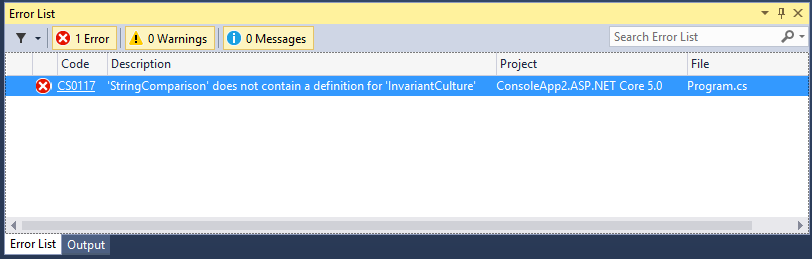

图 72:错误列表显示了每个框架的错误。

IntelliSense 对 bower.json 和 package.json 文件有特定的支持，并在 HTML 编辑器中引入了对`<link rel="import"/>`元素的支持，这是 [Web 组件标准](http://www.w3.org/TR/components-intro/)的一部分，如图 73 所示。

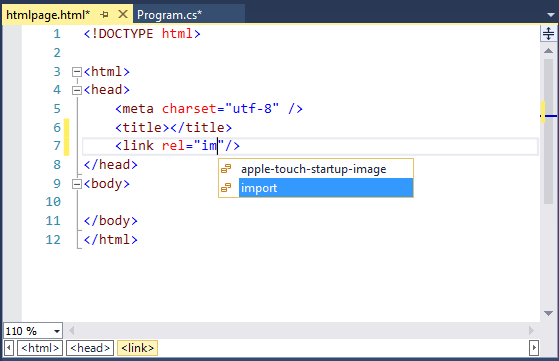

图 HTML 编辑器的智能感知更新。

## 面向微软 Azure 的 Visual Studio 2015

在本章的开头，您被邀请为微软 Azure 安装最新的 SDK，该 SDK 扩展了 Visual Studio 2015，以便从 IDE 内部与 Azure 平台进行交互。现在，您将获得关于最相关的新功能的指导，这些新功能将使您在使用 Visual Studio 中的 Azure 时更加轻松。

|  | 注意:至于以前的版本，当前的 Azure SDK 不仅为 Visual Studio 添加了许多功能，而且还提供了额外的工具和服务。在本书中，我们将重点介绍 Visual Studio 2015 的 IDE 中提供的功能。有关新功能的全面列表，您可以阅读 [Azure SDK 2.5.1 了解。网络发行说明](http://azure.microsoft.com/en-us/documentation/articles/app-service-release-notes/)。此外，本章还提到了微软 Azure 公开的许多服务和平台；在这种情况下，提供了到官方页面和文档的超链接，而本书的重点是新的工具。 |

### 快速启动

快速启动提供了一组示例项目，演示了各种 Azure 服务和应用编程接口的使用。它们在**新项目**对话框的**云** > **快速开始**节点中可用，如图 74 所示。

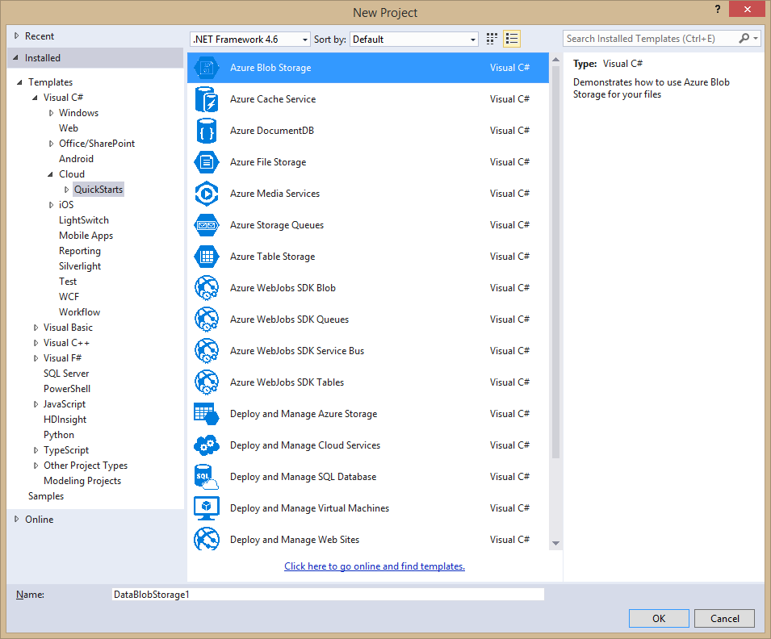

图 Azure 的快速启动项目。

快速启动项目也组织在子节点中，称为**应用服务**、**计算**和**数据服务**。每个项目都提供了一个功能完整的示例，演示了如何使用特定于目标服务的 API。这意味着示例代码包含关于如何在代码中与所需服务交互的非常详细的注释和示例。例如，下面的清单是从 **Azure Blob Storage** 模板生成的代码的重要摘录，并展示了如何与您的 Azure Blob Storage 帐户进行交互。

```cs
      namespace DataBlobStorage3Sample
      {
          using Microsoft.WindowsAzure;
          using Microsoft.WindowsAzure.Storage;
          using Microsoft.WindowsAzure.Storage.Blob;
          using System;
          using System.Collections.Generic;
          using System.IO;
          using System.Linq;
          using System.Threading.Tasks;

          /// <summary>
          /// Azure Storage Blob Sample - Demonstrate how to use the Blob Storage service.
          /// Blob storage stores unstructured data such as text, binary data, documents or media files.
          /// Blobs can be accessed from anywhere in the world via HTTP or HTTPS.
          ///
          /// Note: This sample uses the .NET 4.5 asynchronous programming model to demonstrate how to call the Storage Service using the
          /// storage client libraries asynchronous API's. When used in real applications, this approach enables you to improve the
          /// responsiveness of your application. Calls to the storage service are prefixed by the await keyword.
          ///
          /// Documentation References:
          /// - What is a Storage Account - http://azure.microsoft.com/en-us/documentation/articles/storage-whatis-account/
          /// - Getting Started with Blobs - http://azure.microsoft.com/en-us/documentation/articles/storage-dotnet-how-to-use-blobs/
          /// - Blob Service Concepts - http://msdn.microsoft.com/en-us/library/dd179376.aspx
          /// - Blob Service REST API - http://msdn.microsoft.com/en-us/library/dd135733.aspx
          /// - Blob Service C# API - http://go.microsoft.com/fwlink/?LinkID=398944
          /// - Delegating Access with Shared Access Signatures - http://azure.microsoft.com/en-us/documentation/articles/storage-dotnet-shared-access-signature-part-1/
          /// - Storage Emulator - http://msdn.microsoft.com/en-us/library/azure/hh403989.aspx
          /// - Asynchronous Programming with Async and Await  - http://msdn.microsoft.com/en-us/library/hh191443.aspx
          /// </summary>
          public class Program
          {
              // *************************************************************************************************************************
              // Instructions: This sample can be run using either the Azure Storage Emulator that installs as part of this SDK - or by
              // updating the App.Config file with your AccountName and Key.
              //
              // To run the sample using the Storage Emulator (default option)
              //      1\. Start the Azure Storage Emulator (once only) by pressing the Start button or the Windows key and searching for it
              //         by typing "Azure Storage Emulator". Select it from the list of applications to start it.
              //      2\. Set breakpoints and run the project using F10.
              //
              // To run the sample using the Storage Service:
              //      1\. Open the app.config file and comment out the connection string for the emulator (UseDevelopmentStorage=True) and
              //         uncomment the connection string for the storage service (AccountName=[]...)
              //      2\. Create a Storage Account through the Azure Portal and provide your [AccountName] and [AccountKey] in
              //         the App.Config file. See http://go.microsoft.com/fwlink/?LinkId=325277 for more information
              //      3\. Set breakpoints and run the project using F10.
              //
              // *************************************************************************************************************************
              static void Main(string[] args)
              {
                  Console.WriteLine("Azure Storage Blob Sample\n ");

                  // Block blob basics.
                  Console.WriteLine("Block Blob Sample");
                  BasicStorageBlockBlobOperationsAsync().Wait();

                  // Page blob basics.
                  Console.WriteLine("\nPage Blob Sample");
                  BasicStoragePageBlobOperationsAsync().Wait();

                  Console.WriteLine("Press any key to exit");
                  Console.ReadLine();
              }

              /// <summary>
              /// Basic operations to work with block blobs.
              /// </summary>
              /// <returns>Task<returns>
              private static async Task BasicStorageBlockBlobOperationsAsync()
              {
                  const string ImageToUpload = "HelloWorld.png";

                  // Retrieve storage account information from connection string.
                  // How to create a storage connection string - http://msdn.microsoft.com/en-us/library/azure/ee758697.aspx
                  CloudStorageAccount storageAccount = CreateStorageAccountFromConnectionString(CloudConfigurationManager.GetSetting("StorageConnectionString"));

                  // Create a blob client for interacting with the blob service.
                  CloudBlobClient blobClient = storageAccount.
                                  CreateCloudBlobClient();

                  // Create a container for organizing blobs within the storage account.
                  Console.WriteLine("1\. Creating Container");
                  CloudBlobContainer container = blobClient.
                  GetContainerReference("democontainerblockblob");
                  try
                  {
                      await container.CreateIfNotExistsAsync();
                  }
                  catch (StorageException)
                  {
                      Console.WriteLine("If you are running with the default configuration please make sure you have started the storage emulator. Press the Windows key and type Azure Storage to select and run it from the list of applications - then restart the sample.");
                      Console.ReadLine();
                      throw;
                  }

      // To view the full Quick Start code, create a new Azure Blob Storage Quick 

// Start in Visual Studio 2015.

      }

```

如您所见，该代码提供了一些示例，这些示例介绍了在所选场景中需要完成的最重要的任务。所有可用的快速启动都是这样的。

### Azure 资源管理器工具

Azure SDK 引入了一个新的工具，叫做 Azure 资源管理器。这个新工具基本上可以帮助您创建一个 web 项目和一个部署项目，其中包含配置 Azure 资源所必需的工件，代表您为应用程序创建合适的环境。您可以利用名为**云部署项目的新项目模板来使用 Azure 资源管理器。**该项目模板位于**新建项目**对话框的**云**节点，如图 75 所示。请注意对话框右侧丰富的模板描述。

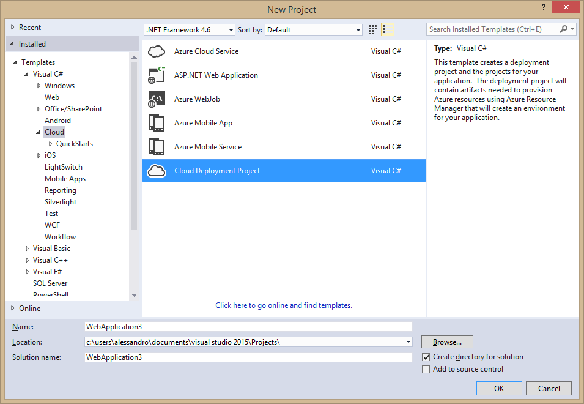

图 75:云部署项目模板。

云部署项目使用 Azure Gallery 上的模板，这允许深度定制，但也减少了在环境之间移动时的成本和工作量。这样的模板通过简单地从您的订阅中指定一些信息，使得配置应用程序部署变得容易。要了解这是如何工作的，请使用此模板创建一个新项目。您将被要求选择一个可用的 Azure 图库模板，如图 76 所示。

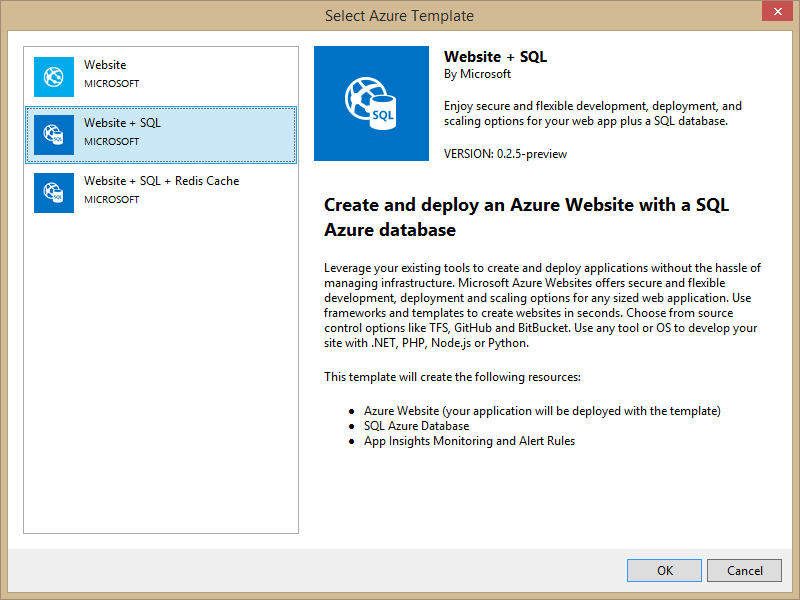

图 76:蔚蓝色图库模板。

|  | 注意:在 Azure SDK 的未来版本中，微软还应该为目标服务(如网络、存储和虚拟机)添加更多模板。 |

当前示例，选择**网站+ SQL 模板**(见图 76)。接下来，您将被要求指定一个 asked 项目模板。只需选择**空**一个，作为示例。那么项目就准备好了；在解决方案资源管理器中，您将看到两个项目:ASP.NET 项目和 Azure 资源管理器部署项目，其名称以**结尾。部署**。如果在此项目中展开子文件夹，您将看到以下内容:

*   对 ASP.NET 项目的引用，这是一个负责向 Azure 发布资源的 PowerShell 脚本。
*   部署模板(**网站部署. json** )。
*   包含配置文件使用的值的参数文件(**WebSiteDeploy . param . dev . JSON**)。
*   一个部署工具(**AzCopy.exe**)。

假设您的 ASP.NET 项目已经准备好执行一些任务，那么您现在可以准备部署到 Azure 了。部署云部署项目时，将其部署到 Azure 资源组，该资源组是资源的逻辑分组，包括(但不限于)网站、数据库和存储。右键点击**。部署**项目名称，选择**部署** > **新部署**。在**新建部署**对话框中(见图 77)，选择**资源组**选项，该选项针对当前场景，点击**确定**。

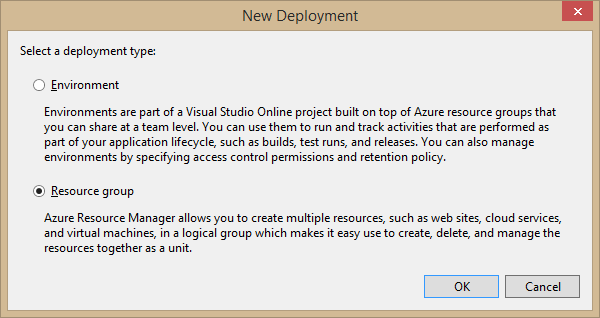

图 77:新部署对话框。

现在您将看到**部署到资源组**对话框(见图 78)，除了需要指定资源组的**资源组**框外，其字段将由 Visual Studio 自动填充适当的值。这可以是默认组或以前创建的组之一。

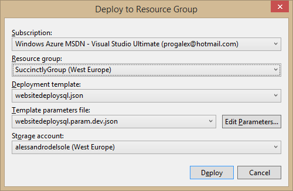

图 78:部署到资源组对话框。

要创建资源组，请单击组合框中的**新建…** 选项，并在**创建资源组**对话框中指定自定义名称和区域。这必须代表离你最近的位置(见图 79)。


图 79:创建一个新的资源组。

在部署应用程序之前，您需要编辑 WebSiteDeploy.param.dev.json 文件的参数。点击**编辑参数**，可以在**编辑参数**对话框中可视化编辑参数，如图 80 所示。


图 80:编辑部署参数。

设置的数量因您在开始时选择的 Azure 图库模板而异。您将看到许多空字段，并且它们都是必填的；您将看到带有白色感叹号的红色字形，突出显示强制参数。表 1 总结了常见的强制参数。

表 1:表 1—部署的通用强制参数

| 参数 | 描述 | 价值 |
| 网站名称 | 网站网址的第一部分。 | 例如，如果你的网站叫**vs2015succinctly.azurewebsites.net**，这里你可以简洁地指定**vs 2015**。 |
| 网站主机计划名称 | 网络托管计划代表了一组功能和容量，您可以跨网站共享；它支持四个 Azure 网站定价层(免费、共享、基本和标准)。 | 网络托管计划名称。强烈建议您阅读微软关于创建网络托管计划的[官方页面。](http://azure.microsoft.com/en-us/documentation/articles/azure-web-sites-web-hosting-plans-in-depth-overview/) |
| 网站位置 | 网站地理位置。 | 支持的[蔚蓝区域之一](http://azure.microsoft.com/en-us/regions/)。 |

当您使用**网站+ SQL** 模板时，需要额外的参数，如当前示例所示。表 2 总结了与 SQL 相关的参数。

表 2:表 2—SQL 强制参数

| 参数 | 描述 | 价值 |
| sqlServerName | 您的数据库服务器的名称，可以在[管理门户](https://manage.windowsazure.com)中检索。 | 服务器名称类似于**yourserver.database.windows.net**，其中**您的服务器**代表您的服务器名称。 |
| SQL server 位置 | 服务器的地理位置。如果服务器尚不存在，将使用此选项。 | 支持的[蔚蓝区域之一](http://azure.microsoft.com/en-us/regions/)。 |
| SQL server radminlog in | 数据库管理员的用户名。 | 参见*说明。* |
| sqlServerAdminPassword | 管理员的密码。 | 参见*说明。* |

准备好之后，点击**部署**。Visual Studio 2015 会将应用程序发布到您的 Microsoft Azure 订阅，并创建适当的资源组，包括数据库(如果不存在的话)。操作进度像往常一样显示在输出窗口中。然后，您将能够运行和管理该应用程序。

### 支持多个微软账户

正如您在第 1 章中了解到的，Visual Studio 2015 引入了对多个微软帐户的支持。这在谈论微软 Azure 时更有用，因为您可以同时登录多个订阅，并利用**服务器资源管理器**窗口来管理您在云上的资源。在服务器资源管理器中，右键单击 **Azure** 节点，然后选择**管理和过滤订阅**。这将打开**管理微软 Azure 订阅**对话框，如图 81 所示。

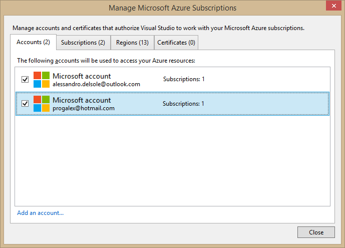

图 81:管理 Azure 订阅。

在这里，您可以选择或取消选择将为服务器资源管理器自动登录的帐户；在**订阅**选项卡中，您可以选择或取消选择订阅，以便服务器资源管理器仅显示选定订阅的资源。

### 斑点存储文件夹

Visual Studio 2013 和 Azure SDK 2.2 引入了直接从集成开发环境中通过服务器资源管理器窗口及其存储节点与您的 Azure 存储帐户交互的能力，该帐户包括 blobs、表和队列。关于 Blob 存储，这些工具允许创建和管理容器，以及向/从容器上传/下载文件。Visual Studio 2015 和 Azure SDK 2.5.1 通过提供对 blob 文件夹的支持，使它更进一步。这些允许 blob 被分组到逻辑单元中，这在您只使用一个 blob 容器时非常有用。Blob 文件夹实际上是 blob 名称的前缀；这些前缀包括/分隔符。例如，假设您有一个名为*vs 2015 简洁地说*的存储帐户，有一个名为 *documents* 的容器和一个名为 *personal* 的 blob 文件夹，这里有一个名为 *mydocument.docx* 的 Word 文件。网址如下所示:

https://vs2015succinctly.blob.core.windows.net/documents/personal/mydocument.docx

这非常直观，让人回想起你是如何访问网站上的文件夹的(这实际上就是你所做的)。

虽然可以导航现有的 blob 文件夹，但不能从服务器资源管理器创建文件夹；因此，在将第一个文件上传到 blob 文件夹时，会创建一个 blob 文件夹。为了更好地理解，请遵循以下步骤:

1.  右键单击服务器资源管理器中某个存储帐户的**Blob**节点(本例中我使用的是本地开发存储)，然后选择**创建 Blob 容器**。
2.  在**创建斑点容器**对话框中，输入**文档**作为容器名称(见图 82)。
3.  双击新创建的容器，以便 Visual Studio 打开**容器**工具窗口。
4.  点击**上传**并指定想要上传的文件名和文件夹名，如**个人**。图 83 显示了一个例子。
5.  准备好之后，点击**确定**。此时，Visual Studio 显示了**个人** blob 文件夹的内容及其内容(见图 84)。在这里，您可以用通常的方式管理 blobs。
6.  点击**打开父目录**，位于 blob 文件夹名称附近。这将把你带到上层，并显示当前容器中 blob 文件夹的列表。


图 82:创建一个 blob 容器。


图 83:上传文件并创建 blob 文件夹。

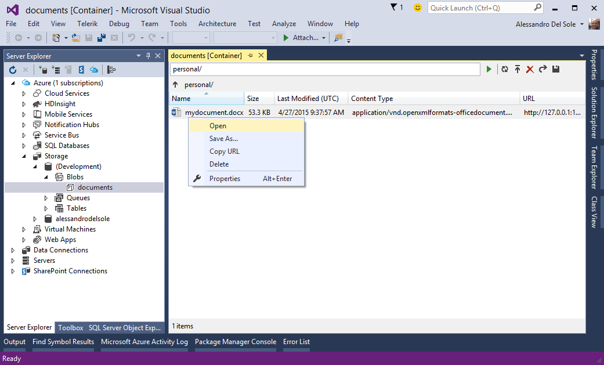

图 84:管理 blob 文件夹中的 blob。

强调删除特定文件夹中的所有 blobs 也会导致文件夹删除，这一点非常重要。原因是 blob 文件夹只是一个逻辑分组，而不是一个物理位置，所以当您从一个文件夹中移除所有 blob 时，这就没有理由再存在了。

### 添加连接的服务

Visual Studio 2015 和 Azure SDK 2.5.1 使连接到基于 Azure 的服务变得更加容易，如 Azure 移动服务、Azure 存储、Office 365 和 Salesforce。为了理解这些改进，假设您有一个 ASP.NET web 应用程序。在解决方案资源管理器中，右键单击项目名称并选择**添加** > **连接服务**。将显示**添加连接服务**对话框，提供如图 85 所示的选择。


图 85:添加连接的服务。

假设您想要连接到 Azure 存储；选择**蔚蓝存储**，点击**配置**。此时，系统将提示您在 Azure Storage 对话框中选择一个存储帐户(参见图 86)，您还可以选择轻松切换 Microsoft 帐户。

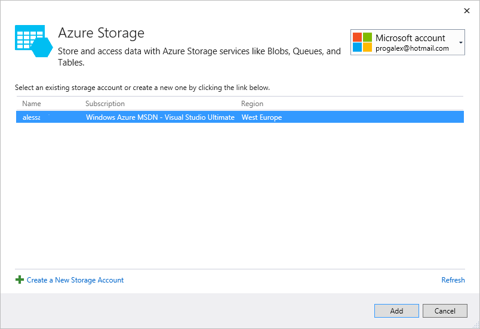

图 86:选择存储帐户。

当您单击**添加**时，Visual Studio 将启动您的默认网络浏览器，指向一个“入门”网页，在该网页中，您可以获得关于您选择的连接服务中需要与之交互的代码的指导。图 87 显示了一个基于当前选择的示例。

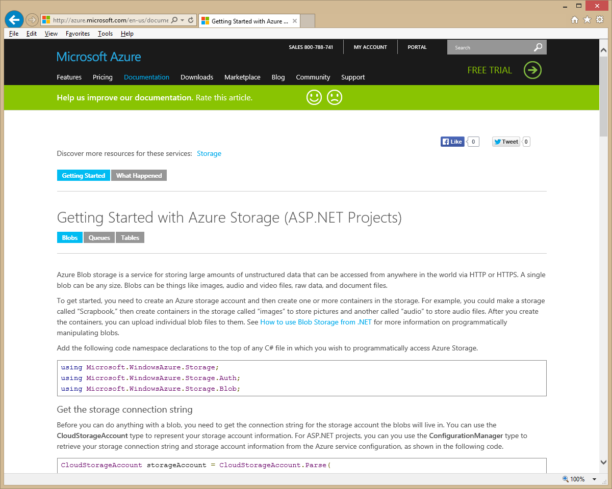

图 87:获得当前场景中所需代码的指导。

最重要的是，Visual Studio 2015 会自动添加对调用 NuGet 的必要库的引用以及 Web.config 文件中的连接字符串。这种情况发生在您在**添加连接服务**对话框中选择的任何连接服务上。在这本书里描述每种服务是如何工作的是不可能的，所以这要留给你进一步的研究。这里需要强调的是，新的参考服务方式如何让事情变得更快、更容易。

### 天蓝色的代码分析

那个。NET 编译器平台，以前称为罗斯林项目，在您键入时为编译器提供实时代码分析和问题检测。这些能力在第 3 章中以灯泡和快速行动为例进行了说明。微软还专门为 Azure 创建了一个额外的规则集，该规则集分析您的代码中的问题，并提出可能的修复建议。Azure 的代码分析可以作为 NuGet 包获得。也就是说，假设您有一个类似 Web 角色或 Worker 角色的 Azure 项目，搜索 Azure 代码分析包，如图 88 所示。

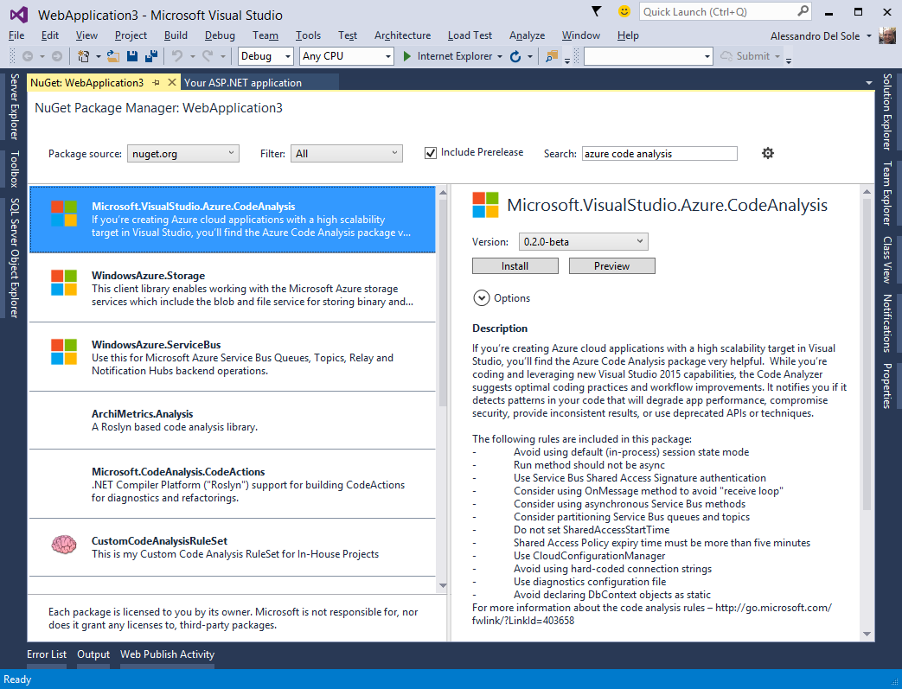

图 88:将 Azure 代码分析添加到您的项目中。

安装软件包后，编译器能够实时检查代码是否符合 Azure 规则和最佳实践。例如，图 89 显示了 Worker 角色中`Run`方法的一个问题，该方法已被标记为`async`，但不符合 Azure 规则；图 89 还显示了正在工作的灯泡。


图 89:将 Azure 代码分析添加到您的项目中。

当您构建具有高可伸缩性目标的应用程序时，Azure 代码分析特别有用，因为它建议了最佳实践，并帮助您编写更好、更高效的代码。

### HDInsight 支持

Azure SDK 2.5.1 和 Visual Studio 2015 支持大数据的 [HDInsight](http://azure.microsoft.com/en-us/services/hdinsight/) 服务和查询数据集的 [Hive](https://hive.apache.org/) 。支持是由项目模板组成的(见图 90)，包括一个 Hive 示例，它附带了一些演示代码，以及一个与 HDInsight 项目的服务器资源管理器交互，就像您对任何其他订阅服务所做的那样。

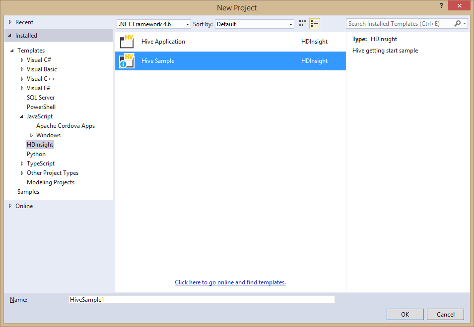

图 90:在 HDInsight 支持下创建 Hive 项目。

Hive 示例模板(见图 90)让您了解了 HDInsight 是如何工作的。如果双击模板创建一个示例项目，您将看到 Visual Studio 如何生成两个。hql 文件，每个文件分别包含针对 Azure 网站(WebLogAnalysis.hql)和设备传感器(SensorDataAnalysis.hql)的特定 SQL 查询。下面的清单重现了 WebLogAnalysis.hql 的示例代码。请注意，注释解释了每个代码片段是如何工作的，以及代码是如何由基于 SQL 的熟悉语法节点组成的。

```cs
      --Part 1: Introduction
      -- In this sample you will use an HDInsight query that analyzes website log files
      -- to get insight into how customers use the website. With this analysis, you can see
      -- the frequency of visits to the website in a day from external websites, and a
      -- summary of website errors that the users experience.
      -- In this tutorial, you'll learn how to use HDInsight to:
      -- *Connect to an Azure Storage Blob containing website log files.
      -- *Create Hive tables to query those logs.
      -- *Create Hive queries to analyze the data.

      --Part 2: Prerequisites
      -- The script here is only for your reference. You need to log in to
      -- https://yourclusteraddress.azurehdinsight.net/ in order to trigger the HDInsight
      -- service to load the sample data.
      -- For clusters provisioned before 10/15/2014, go to
      -- http://azure.microsoft.com/en-us/documentation/services/hdinsight/ for more details
      -- since those clusters do not have the sample data installed.

      --Part 3: Website Log Data Loaded into Windows Azure Storage Blob
      -- The data stored in Windows Azure Storage Blob can be accessed by expanding a
      -- HDInsight cluster and double-clicking the default container of your default storage
      -- account. The data for this sample can be found under the
      -- /HdiSamples/WebsiteLogSampleData/SampleLog path in your default container.

      --Part 4: Creating Hive table to Query Website Log Data
      -- The following Hive statement creates an external table that allows Hive to query
      -- data stored in Azure Blob Storage. External tables preserve the data in the original
      -- file format, while allowing Hive to perform queries against the data within the file.
      -- The Hive statement below creates a new table, named weblogs, by describing the
      -- fields within the files, the delimiter between fields, and the location of the file
      -- in Azure Blob Storage. In the Creating Hive Queries to Analyze Data section of this
      -- tutorial, you will perform queries on the data stored in this table.
      -- You could also create a table by right-clicking on a database and selecting
      -- "Create Table". We will provide you with a UI to help you to create this table.

      DROP TABLE IF EXISTS weblogs;
      -- Create table weblogs on space-delimited website log data.
      -- In this sample we will use the default container. You could also use
      -- 'wasb://[container]@[storage account].blob.core.windows.net/Path/To/Data/' to access
      -- the data in other containers.
      CREATE EXTERNAL TABLE IF NOT EXISTS weblogs(s_date date,
                       s_time string, s_sitename string, cs_method string, cs_uristem string,
                       cs_uriquery string, s_port int, cs_username string, c_ip string,
                       cs_useragent string,
                       cs_cookie string, cs_referer string, cs_host string,
                       sc_status int, sc_substatus int,
                       sc_win32status int, sc_bytes int, cs_bytes int, s_timetaken int )
      ROW FORMAT DELIMITED FIELDS TERMINATED BY ' '
      STORED AS TEXTFILE LOCATION '/HdiSamples/WebsiteLogSampleData/SampleLog/'
      TBLPROPERTIES ('skip.header.line.count'='2');

      -- The following HIVE queries create two new tables based on the queries run on the
      -- weblogs table. The new tables are called clienterrors and refersperday.
      -- The query for clienterrors extracts data from the weblogs table for HTTP status
      -- codes between 400 and 500, and groups them by the users facing those errors and the
      -- type of error codes. The range of status code between 400 and 500, represented by
      -- sc_status column in the weblogs table, corresponds to the errors clients get while
      -- accessing the website. The extracted data is then sorted on the number of
      -- occurrences of each error code and written to the clienterrors table.
      -- The query for refersperday extracts data from the weblogs table for all external
      -- websites referencing this website. The external website information is extracted
      -- from the cs_referer column of the weblogs table. To make sure the referring links did
      -- not encounter an error, the table only shows data for pages that returned an HTTP
      -- status code between 200 and 300\. The extracted data is then written to the
      -- refersperday table.

      DROP TABLE IF EXISTS ClientErrors;
      -- Create table ClientErrors for storing errors users experienced and their frequencies.
      CREATE EXTERNAL TABLE ClientErrors(sc_status int, cs_referer string, cs_page string, cnt int)
      ROW FORMAT DELIMITED FIELDS TERMINATED BY ',';

      -- Populate table ClientErrors with data from table weblogs.
      INSERT OVERWRITE TABLE ClientErrors
      SELECT sc_status, cs_referer,
                    concat(cs_uristem,'?', regexp_replace(cs_uriquery,'X-ARR-LOG-ID=[0-9a-f]{8}-[0-9a-f]{4}-[0-9a-f]{4}-[0-9a-f]{4}-[0-9a-f]{12}','')) cs_page,
                    count(distinct c_ip) as cnt
      FROM weblogs
      WHERE sc_status >=400 and sc_status < 500
      GROUP BY sc_status, cs_referer, concat(cs_uristem,'?', regexp_replace(cs_uriquery,'X-ARR-LOG-ID=[0-9a-f]{8}-[0-9a-f]{4}-[0-9a-f]{4}-[0-9a-f]{4}-[0-9a-f]{12}',''))
      ORDER BY cnt;

      DROP TABLE IF EXISTS RefersPerDay;
      -- Create table RefersPerDay for storing references from external websites.
      CREATE EXTERNAL TABLE IF NOT EXISTS RefersPerDay(year int, month int, day int, cs_referer string, cnt int)
      ROW FORMAT DELIMITED FIELDS TERMINATED BY ',';

      -- Populate table RefersPerDay with data from the weblogs table.
      INSERT OVERWRITE TABLE RefersPerDay
      SELECT year(s_date), month(s_date), day(s_date), cs_referer, count(distinct c_ip) as cnt
      FROM weblogs
      WHERE sc_status >=200 and sc_status <300
      GROUP BY s_date, cs_referer
      ORDER BY cnt desc;

      --Part 6: Executing Queries and Viewing the Results
      -- Select Submit/Submit(Advanced) in the HDInsight toolbar to execute the queries. You
      -- can also use Alt+Shift+S for a quick submission. After submitting the job, you can
      -- view details by right-clicking on the cluster and selecting "View Hive Jobs".-- You can also expand the Hive databases and right-click on the tables you just created, select "View Top 100 Rows" and sample the table you just created.

```

当然，您需要用您的名称替换示例网站名称，并根据您的服务和需求调整代码，但这是一个很好的例子来理解 HDInsight 的目的。

### 介绍网络工作

[Azure WebJobs](http://azure.microsoft.com/en-us/documentation/articles/web-sites-create-web-jobs/) 提供了运行程序的能力，例如。exe 和。cmd 文件，在 Azure 网站上。运行一个程序可能有很多原因，比如执行后台任务、CPU 密集型工作、上传 blobs 时的图像处理、RSS 聚合等。为了让网络作业编程更容易，微软还发布了一个[网络作业软件开发工具包](http://azure.microsoft.com/en-us/documentation/articles/websites-dotnet-webjobs-sdk/)，它提供了一个简化的框架，可以最大限度地减少你的工作量，减少你需要编写的代码量。适用于 Visual Studio 2015 的 Azure SDK 2.5.1 以多种方式为 IDE 提供支持。首先，您有项目模板。**新建项目**对话框的**云**节点包含一个名为 **Azure WebJob** 的项目模板，如图 91 所示。


图 91: Azure WebJob 项目模板。

但是，这是最基本的项目模板，不提供任何代码。相反，您可以使用 Azure 快速入门来开始使用 SDK 示例；图 92 显示了网络作业快速启动。

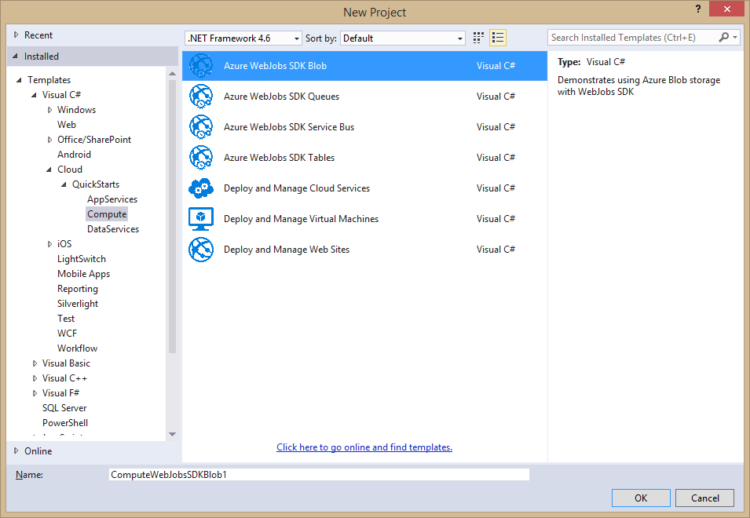

图 92: Azure 网络作业从软件开发工具包快速启动。

例如，Azure WebJobs SDK Blob 模板演示了如何在 WebJobs 中使用 Azure Blob 存储。更具体地说，这个例子演示了如何读取/写入队列中的对象，以及如何将信息写入文本文件。从图 92 中可以看出，类似的例子也适用于其他 Azure 服务。要将网络作业发布到 Azure 网站，您可以在解决方案资源管理器中右键单击项目名称，然后选择**发布为 Azure 网络作业**。此时出现**添加 Azure 网络作业**对话框(见图 93)，允许指定信息，如名称、运行模式(**连续运行**、**按计划运行**、**按需运行**)以及开始和结束时间，以防您的网络作业代表重复操作。

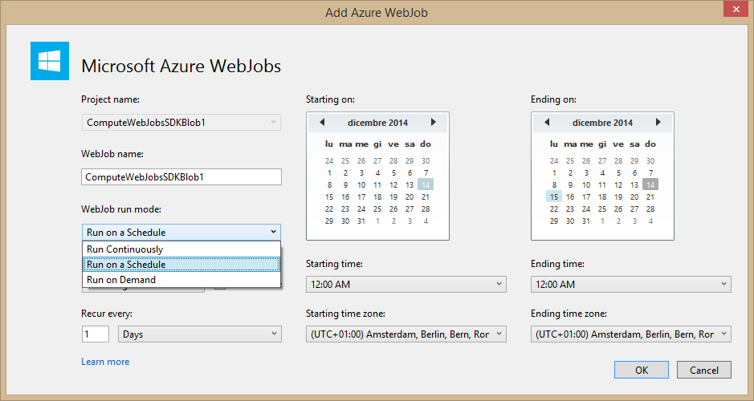

图 93: Azure 网络作业从软件开发工具包快速启动。

当网络作业发布到 Azure 时，服务器资源管理器将允许以下操作:

*   在相关网站名称下显示一个网络作业节点。
*   将用于远程调试的调试器附加到指定的网络作业。
*   启动和停止网络作业。

所有这些交互都是由于 WebJobs SDK 而成为可能的，它不仅简化了您编写的代码量，而且使通过可视化工具处理 WebJobs 变得更加容易。

## 章节总结

本章解释了 Visual Studio 2015 中用于网络和云开发的一些关键功能。在第一部分中，您了解了新的项目模板，这些模板使开发人员能够以 ASP.NET 5.0 核心运行时为目标。然后，您学习了如何将模板组织到新的项目系统中，包括新的项目文件、用于配置的新 JSON 文件，以及更简单的包管理，该包管理允许这类应用程序跨平台运行，并通过 NuGet 仅使用所需的包。在本章的第二部分，您熟悉了微软 Azure 的新工具，例如快速启动项目模板和对多个微软帐户的支持，以便从服务器资源管理器轻松连接到云资源。您学习了 Visual Studio 2015 如何允许管理 Blob 文件夹，以及它如何简化您向项目添加连接服务的方式。您已经了解了 Azure 包的代码分析，它提供了实时代码分析和对可能的代码问题的适当建议。最后，您学习了如何与面向大数据的 HDInsight 服务进行交互，以及如何通过 WebJobs 在您的网站上运行后台程序。