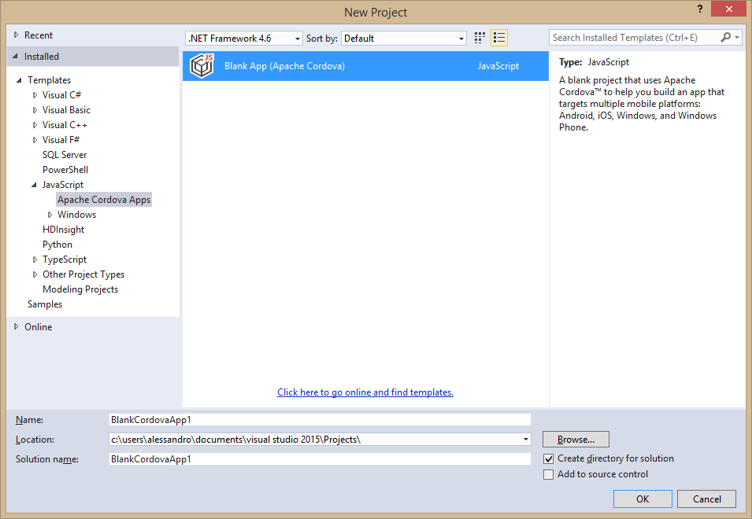
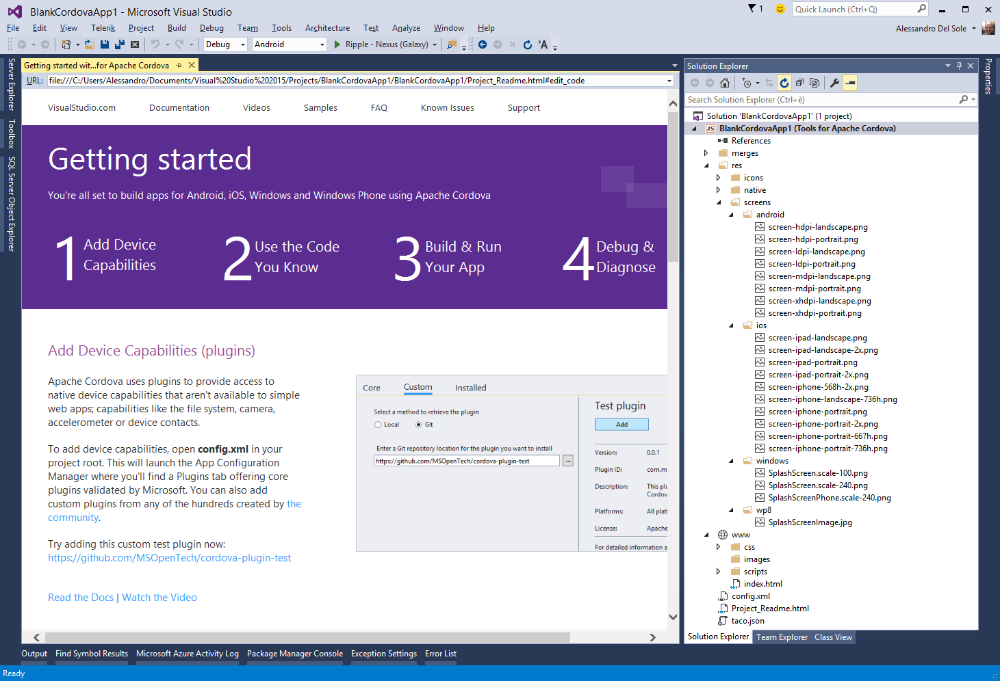
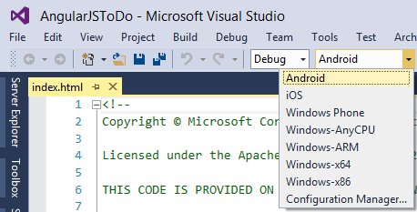
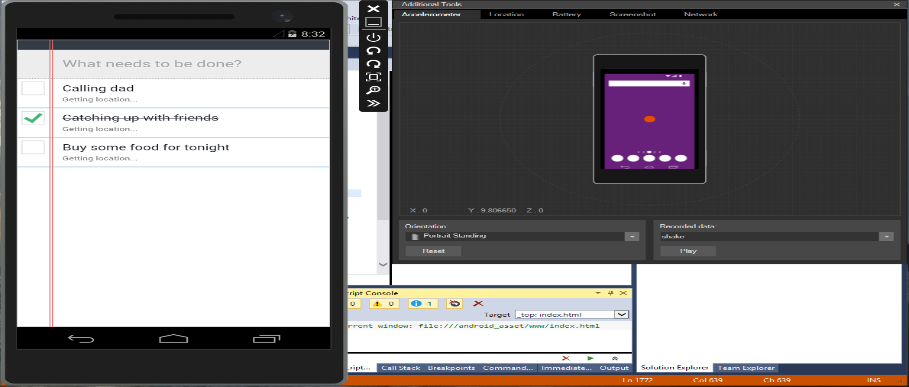

# 第九章面向移动开发的 Visual Studio 2015

Visual Studio 的最新版本为在微软操作系统和平台(如 Windows Phone 7.x、Windows Phone 8.x 和 Windows 8.x)之上构建移动应用程序提供了最佳支持。但是，这些 ide 仅支持运行微软操作系统的设备的应用程序开发。众所周知，安卓和 iOS 操作系统在平板电脑和智能手机等移动设备市场中扮演着巨大的角色。微软意识到了这一点，借助 Visual Studio 2015，他们开辟了新的场景，提供了构建跨平台移动应用的工具。本章为您提供了一个关于您在 Visual Studio 2015 中有哪些可能性的背景，并解释了不同平台的新机会。

## 背景

开发移动应用程序的开发人员最大的目标之一是能够一次性编写一个应用程序，并看到它在多个设备和操作系统上运行。这其实就是跨平台移动开发的意义。毫无疑问，微软 Visual Studio 多年来一直是最好的开发环境。IDE 支持多种语言(包括 HTML5 和 JavaScript，这是构建跨平台应用程序最流行的语言)，为每个支持的开发平台提供丰富的设计器、交互式代码编辑器、调试器集成、代码分析和生产力功能。它还简化了开发人员如何使用强大的可视化工具和服务来管理应用程序开发生命周期。在 Visual Studio 2015 之前，只有为 Windows Phone 和 Windows 8.x 构建应用程序的开发人员才能利用如此丰富的开发环境。唯一的例外是 Visual Studio 2013，它允许使用 Xamarin 开发的第三方产品进行跨平台开发。Visual Studio 2015 和新的。NET 生态系统标志着微软的一个革命性的时代:该公司正在开放许多构件。NET 运行时。同样，Visual Studio 2015 现在允许使用非。NET 平台和库，以安卓和 iOS 操作系统为目标。这意味着微软正试图吸引那些一直在使用 Eclipse 和 Cocoa/Objective C 等进化程度较低的环境的开发人员；开发人员最终可以使用 Visual Studio 来利用其所有的功能和生产力工具。

## VS 2015 可以构建哪些移动应用？

Visual Studio 2015 是构建移动应用程序最完整的开发环境。通过此版本，您可以构建:

*   Windows 10 的应用程序。发布时，Windows 10 作为[技术预览版](http://windows.microsoft.com/en-us/windows/preview-iso)提供，您可以通过为 Visual Studio 2015 安装[开发工具来为预发布版本构建应用程序。](https://dev.windows.com/en-US/downloads/windows-10-developer-tools)
*   使用 XAML 和 C#/VB 的 Windows 8 和 Windows 8.1 应用程序。
*   使用 XAML 和 C#/VB 的 Windows Phone 8 和 Windows Phone 8.1 应用程序。
*   使用 XAML 和 C#的通用视窗应用程序。也支持 Visual Basic，但需要一些额外的手动步骤。
*   使用 WinJS 库(HTML5/JavaScript)的 Windows 8 和 Windows 8.1 的应用程序。
*   使用 WinJS 库(HTML5/JavaScript)的 Windows Phone 8 和 Windows Phone 8.1 的应用程序。
*   使用 WinJS 库的通用窗口应用程序。
*   Windows、Windows Phone、Android 和 iOS 的跨平台应用，C#/F#和 XAML 从 [Xamarin](http://xamarin.com/) 安装扩展和工具。
*   使用 [Apache Cordova](http://cordova.apache.org/) 和 Apache Cordova 的集成 Visual Studio 工具，为 Windows、Windows Phone、Android 2.3.3 及更高版本以及 iOS (6、7 和 8)提供跨平台应用。

|  | 注意:本书不涉及 Windows 10 app 开发，因为 Universal Windows Platform 应用模型是一个非常复杂的环境；开发 Universal 应用程序也有几种方法，包括移植现有的 iOS 和 Android 代码，这将涵盖整本书。 |

微软和 Xamarin 联手合作，在 Visual Studio 2015 中实现更好的工具集成。但是，Xamarin 套件不随 Visual Studio 一起提供，并且是您必须单独购买的产品。使用 XAML/为 Windows 8.x 和 Windows Phone 8.x 构建应用程序。NET 或 HTML5/JavaScript，MSDN 库提供了非常好的文档。也就是说，在这一章中，我们将重点介绍使用来自带有 Visual Studio 2015 的 Apache Cordova 的 JavaScript APIs 构建应用程序的新工具，包括由微软构建的全新 Android 仿真器。

|  | 注意:从现在开始，我会用阿帕奇科尔多瓦的全名或简称科尔多瓦来称呼它。 |

## 先决条件

要使用 Visual Studio 2015 和 Apache Cordova 开发跨平台移动应用，需要安装一些先决条件。这些总结在表 3 中。

表 3:表 3—阿帕奇科尔多瓦先决条件

| 先决条件 | 描述 |
| --- | --- |
| 阿帕奇涟漪 | 安卓和 iOS 的模拟器。 |
| 谷歌 Chrome | 运行波纹模拟器所需的网络浏览器和组件。 |
| Apache Ant 1.8.0 | 安卓构建过程所需。 |
| 安卓 SDK | 安卓构建过程和 Ripple 模拟器所需的。 |
| Oracle Java SDK 7 | 安卓构建过程所需。 |
| Node.js | 将 Visual Studio 与 Apache Cordova 命令行界面和 Ripple 仿真器集成在一起。 |
| 苹果 iTunes | 需要将应用程序远程部署到 iOS 设备。 |

Visual Studio 2015 安装程序将为您安装所有先决条件，只要确保您在安装程序的欢迎窗口中选择了所有必需的组件。

|  | 注意:Hyper-V 是另一个先决条件，因为它是运行用于安卓的 Visual Studio 仿真器和用于 Windows Phone 8.1 的仿真器所必需的。 |

### 为 iOS 构建应用

iOS 应用程序无法在 Windows 上构建。这不是 Windows 的限制；相反，是苹果许可证要求开发者在 Mac 上构建应用程序。为此，为了使用 Visual Studio 2015 和 Apache Cordova 为 iOS 构建应用程序，您需要一台 Mac 电脑和一些额外的配置来进行远程调试。MSDN 文档中有一个关于使用 iOS 配置环境的[特定文档](http://msdn.microsoft.com/en-us/library/dn771551.aspx)。在这本书里，我们不涉及 iOS 开发，因为我们不能假设读者有一台 Mac，因为我们关注的是你可以在 Windows 和 Visual Studio 上使用的工具。在本章中，我们将讨论使用 Visual Studio 2015 开发安卓系统。

## 使用 Apache Cordova 构建应用程序

Apache Cordova 是一个开源项目，它提供了一组丰富的 API，使开发人员能够从 JavaScript 代码中访问本机设备功能。例如，使用这些 API，您可以轻松访问设备的摄像头或其他传感器。在使用 Apache Cordova 时，您基本上使用 JavaScript，不会编写任何一行本机语言，如 Java、Objective-C (iOS)或 C#。科尔多瓦的 JavaScript APIs 只允许访问设备功能，因此您需要与 jQuery Mobile 或 Dojo Mobile 等 UI 框架相结合。科尔多瓦和用户界面框架的结合允许用 HTML、CSS 和 JavaScript 编写移动应用程序。科尔多瓦的 JavaScript APIs 和 UI 框架在多个设备平台上都是一致的，因此您用科尔多瓦构建的应用程序可以在多个操作系统和设备上运行。这就是微软 Visual Studio 2015 的用武之地。IDE 将通常强大的可视化环境及其所有工具与 Apache Cordova 集成在一起，为跨平台移动应用程序提供最佳的开发体验，并使 Cordova 项目与 UI 框架的集成变得容易。毕竟，多年来，随着对代码编辑器的不断改进，Visual Studio 已经增强了对 JavaScript 的支持。当然，我们假设您知道如何用 JavaScript 编码来利用本章中描述的特性。

### Apache Cordova 的 Visual Studio 工具

在幕后，Visual Studio 2015 能够通过 Apache Cordova 的 Visual Studio Tools 支持 Cordova 的开发，这是集成开发环境的一部分。其中，这些工具提供了一个名为**空白应用程序(Apache Cordova)** 的项目模板，该模板位于**新项目**对话框中 **JavaScript** 文件夹下的 **Apache Cordova 应用程序**节点中(见图 94)。

图 94:Apache Cordova 项目模板。

当您创建一个科尔多瓦项目时，Visual Studio 会显示一个“入门”页面，其中包含许多有用的链接；您将在解决方案资源管理器中看到许多常见的元素(参见图 95)，例如:

*   一个**index.html**文件，是你的应用的主屏幕。
*   一个 **config.xml** 文件，其中包含配置信息，只需双击它就可以用可视化编辑器进行编辑。
*   特定于平台的文件夹，包含针对安卓、iOS 和 Windows/Windows Phone 的优化图标、资源和脚本。
*   一个 **res** 文件夹，其中包含特定于平台的 JavaScript 代码。它被组织在子文件夹中，每个子文件夹针对一个特定的平台。
*   一个**脚本**文件夹，默认位置为 JavaScript 或 TypeScript 文件。

图 95:阿帕奇科尔多瓦项目结构。

双击 **config.xml** 文件配置项目。当您这样做时，Visual Studio 2015 显示了一个特殊的设计器，如图 96 所示。

图 96:配置通用应用属性。

配置设计器由六个选项卡组成。公共选项卡是关于公共属性的，它们都是不言自明的。平台选项卡允许您指定科尔多瓦命令行界面(命令行界面)的版本，这是构建和测试科尔多瓦应用程序所需的基础架构。插件选项卡(见图 97)非常重要，因为它允许您添加插件；每个插件都提供一个 API 来访问特定的设备特性。

图 97:使用插件添加设备访问功能。

值得一提的是，对于每个插件，Visual Studio 2015 都展示了支持的平台。当您添加插件时，Visual Studio 会向项目中添加许多 JavaScript 文件和特定于平台的文件，您可以在解决方案资源管理器中轻松发现这些文件。其他选项卡允许设置特定于平台的选项，尤其是应用商店的信息。探索这些标签是留给你的一个练习。为了理解测试应用程序是如何工作的，一个好主意是使用 Apache Cordova 的现有示例之一。

|  | 注意:使用一个现有的例子也是一个好主意，因为这本书没有解释插件或详细说明所有的科尔多瓦应用编程接口。 |

MSDN 文档提供了一个名为[到](http://msdn.microsoft.com/en-us/library/dn832630.aspx)的示例应用程序。这个例子有三种不同的风格，每一种都使用不同的用户界面框架。对于当前示例，下载 [AngularJS 版本](http://go.microsoft.com/fwlink/p/?LinkID=398516)并提取下载的。zip 存档到硬盘上的本地文件夹。ToDoList 应用程序非常好，因为它也是如何使用必应地图和连接服务的一个例子。假设您已经在 Visual Studio 2015 中打开了示例解决方案，此时您希望尝试示例应用程序。选择目标操作系统，这可以通过标准工具栏上适当的组合框来完成，如图 98 所示。

图 98:指定目标操作系统。

接下来，您必须选择要运行应用程序的位置，可以是物理设备或仿真器，如图 99 所示。

图 99:选择物理设备或仿真器。

你有几种不同的选择，尤其是安卓。你有安卓 SDK 中包含的安卓仿真器，以及 Cordova 附带的 Ripple 仿真器；最后，您有了新的用于 Android 的 Visual Studio Emulator。对于当前示例，选择 **VS 仿真器安卓手机**并按下 **F5** 。

#### 安卓系统的 Visual Studio 仿真器

除了现有的安卓仿真器，微软还为安卓开发了一个新的 Visual Studio 仿真器。图 100 显示了在这个新模拟器中运行的示例应用程序。

图 100:用于安卓的 Visual Studio 仿真器。

如果你已经为 Windows Phone 构建了应用程序，安卓模拟器看起来会很熟悉，因为它们有相似的布局和工具；两者都包括模拟加速度计和位置等传感器的能力，或者截图的能力。该模拟器还提供了一个重要的测试功能，即调整电池电量。模拟器还支持摄像头、模拟 SD 卡、音频回放和键盘输入。在 Visual Studio 博客上，您可以找到一篇详细的[博文](http://blogs.msdn.com/b/visualstudioalm/archive/2014/11/12/introducing-visual-studio-s-emulator-for-android.aspx)，内容是关于安卓模拟器中可用的功能。在幕后，Visual Studio 创建了一个托管在 Hyper-V 中的虚拟机。其他教程和代码示例可以在 [MSDN 文档](http://msdn.microsoft.com/en-us/library/dn848421.aspx)中找到。

#### 打包和部署 Apache Cordova 应用程序

一般来说，移动应用程序必须打包成适当的二进制文件，并部署到平台的商店。安卓、iOS 和 Windows 应用有不同的特点和不同的商店。幸运的是，Visual Studio 2015 通过方便的设计器编辑 config.xml 文件，使得为所有支持的平台创建包变得容易。当您构建解决方案时，Visual Studio 会创建一个名为 bin 的子文件夹，您可以在其中找到每个平台的包。一旦你建立了你的项目，你将需要部署应用程序包到适当的商店，就像你通常做的那样。关于构建包的附加信息可以在特定的 MSDN [页面](https://msdn.microsoft.com/en-us/library/dn757048.aspx)中找到。

## 章节总结

谈到 Visual Studio 2015，跨平台移动开发是一个关键话题。本章向您概述了当前使用 Visual Studio 构建移动应用程序的可能性。然后，您了解了为安卓和 iOS 以及 Windows 8.x 和 Windows Phone 8.x 构建移动应用程序的新功能，以及针对 Apache Cordova 的 Visual Studio Tools。您有项目模板、完整的 Visual Studio 工具，现在还有全新的用于 Android 的 Visual Studio Emulator，它通过模拟设备功能简化了测试应用程序的过程。