# 一、为Windows、Linux和OS X开发的代码编辑器

VSCode 不仅仅是另一个具有语法着色和自动缩进的进化记事本。相反，它是一个非常强大的以代码为中心的开发环境，专门设计用于使用不同开发平台可用的语言编写 web、移动和云应用，并通过内置的 Node.js 调试器和对流行的 Git 版本控制引擎的集成支持来支持应用开发生命周期。使用代码，您可以使用单个代码文件或基于文件夹的结构化文件系统。本章提供了有关可用的强大编辑功能的完整指导，并解释了 VSCode 如何管理其工作区中的代码文件。

|  | 提示:在本书中，我将交替使用 VSCode、VS 代码和代码名称。 |

在您学习如何使用 VSCode、它提供了哪些功能以及它如何提供改进的代码编辑体验之前，了解它的用途非常有帮助。VSCode不是简单的代码编辑器；这是一个强大的环境，将编写代码放在中心位置。VSCode的主要目的不是构建二进制文件(例如。exe 和。dll 文件)；这使得为任何在不同操作系统(如 Windows、Linux 和 OS X)上工作的开发人员编写网络、移动和云平台代码变得更加容易，让您不受专有开发环境的影响。为了更好地理解，我将举一个例子:想想 ASP.NET 核心 1.0，这是一种新的跨平台、开源的技术，能够在 Windows、Linux 和 OS X 上运行，是微软为创建可移植的网络应用而生产的。强迫你用微软 Visual Studio 2015 构建跨平台、可移植的网络应用会让你依赖这个 IDE。你可以辩称 Visual Studio 2015 社区版是免费的，但它只在 Windows 上运行，那么 Linux 或 Mac 用户呢？另一方面，虽然它肯定不是为了取代更强大和完整的环境，比如它的主要兄弟，但是 VSCode 可以在各种操作系统上运行，并且可以管理不同的项目类型，以及最流行的语言。为此，VSCode提供了以下核心功能:

*   内置支持多种语言的编码，包括您通常在跨平台开发场景中使用的语言，具有高级编辑功能，并通过可扩展性支持其他语言。
*   Node.js 的内置调试器，通过可扩展性支持额外的调试器(如 Mono)。
*   基于流行的 Git 引擎的版本控制，它为支持代码提交和分支的协作提供了集成的体验，并且是用于任何语言的工具的正确选择。

为了将所有这些功能正确地组合到一个工具中，VSCode 提供了一个不同于其他开发人员工具(如 Microsoft Visual Studio)的编码环境。事实上，VSCode 是一个基于文件夹的环境，可以轻松处理项目中没有组织的代码文件，并提供了一种使用不同语言的统一方式。从这个假设出发，代码提供了高级编辑体验，其功能是任何支持的语言所共有的，此外还有一些特定语言可用的功能。正如您将在整本书中了解到的那样，通过提供自定义语言、语法着色、编辑工具、调试器以及许多扩展点，代码还可以轻松扩展其内置功能。现在，您对代码的目标有了更清晰的认识，您已经准备好学习惊人的编辑功能，这些功能使它超越了任何其他代码编辑器。

顾名思义，VSCode 是一个以代码为中心的工具，主要关注 web、跨平台代码。也就是说，它没有提供完整的、更复杂的应用开发和应用生命周期管理所需的所有功能，也不是某些开发平台的正确选择。如果必须做出选择，请考虑以下几点:

*   VSCode不调用编译器，因此不会生成二进制文件，如。exe 或。dll 文件。您当然可以实现任务自动化，这将在[第 3 章](3.html#_Chapter_3_Git)中讨论，但这不同于集成编译过程。
*   VSCode 没有设计器，因此只能通过手动编写所有相关代码来创建应用的用户界面。可以想象，这对于某些语言和场景来说很好，但是对于某些应用和开发平台来说可能会非常复杂，尤其是如果您习惯于使用微软 Visual Studio 中强大的图形工具。
*   内置调试器特定于网络、跨平台语言，目前仅针对 Node.js. Plus，不如 Visual Studio 调试器高级。
*   VSCode 是一个通用工具，不是构建 Windows 桌面应用等特定开发场景的合适选择。

如果您的需求不同，可以考虑使用 Microsoft Visual Studio 2015，它是构建、测试、部署和维护任何类型应用的首要开发环境。 [Visual Studio 2015 社区](https://www.visualstudio.com/en-us/downloads/download-visual-studio-vs.aspx)版免费，为任何开发平台提供完整的开发环境。

## 语言支持

VSCode 内置了对许多语言的现成支持。表 1 按编辑功能对支持的语言进行了分组。

表 1:语言支持

| 按编辑功能分组的可用语言 |
| --- |
| 批处理、C++、Clojure、CoffeeScript、Dockerfile、F#、Go、Jade、Java、Handlebars、Ini、Lua、Makefile、Objective-C、Perl、PowerShell、Python、R、Razor、Ruby、Rust、SQL、Visual Basic、XML | 常见功能(语法着色、括号匹配) |
| Groovy、Markdown、PHP、Swift | 常见功能和代码片段 |
| CSS，HTML，JSON，Less，Sass | 常见功能、代码片段、智能感知、大纲 |
| Java Script 语言 | 常见功能、代码片段、智能感知、大纲、参数提示。JavaScript 语言服务基于 [Salsa](https://github.com/Microsoft/TypeScript/issues/4789) 。 |
| 打字稿，C# | 常见功能、代码片段、智能感知、大纲、参数提示、重构、查找所有引用。C#由[罗斯林](https://github.com/dotnet/roslyn)和 [OmniSharp](http://www.omnisharp.net/) 提供动力，并针对跨平台进行了优化。NET 开发配合 [DNX](http://docs.asp.net/en/latest/dnx/index.html) 。 |

从 0.10.10 版本开始，C#不再开箱即用；相反，它可以作为[扩展](https://marketplace.visualstudio.com/items?itemName=ms-vscode.csharp)使用。我在表 1 中包含 C#的原因是为了与以前的版本保持一致，并且因为你们中的许多人可能已经在过去体验过 C#编辑功能。要安装 C#程序，请执行以下步骤:

1.  打开 C#代码文件(。在 VSCode中。
2.  当被询问时，接受安装 C#扩展的选项。
3.  安装完成后，重新启动 VSCode。

VSCode可以通过开发人员社区提供的工具扩展为其他语言。这些扩展可以从 [VSCode市场](https://marketplace.visualstudio.com/vscode/Languages)下载。这在[第 5 章“定制和扩展 VSCode”中有更详细的讨论](5.html#_Chapter_5_Customizing)在此期间，您可以看一下可用的语言。

|  | 注意:这本书描述了 VSCode 中基于常见开发和编码场景的所有可用特性。但是，VSCode 也支持非常具体的场景，包括 C#、JSON、HTML、Markdown、TypeScript 和 DockerFile，所以不要错过文档中的[语言](https://code.visualstudio.com/docs/languages/overview)页面。 |

VSCode 提供了许多您期望从强大的代码编辑器中获得的功能。本节描述了使用这个新工具时，哪些编辑功能会让您的编码体验变得惊人。如果您熟悉微软 Visual Studio 2013 及更高版本，您还将看到一些功能是如何从该 IDE 继承的。值得一提的是，VSCode 为几乎所有的编辑功能提供了键盘快捷键，使您能够更快地编辑代码。为此，我还将提到我描述的每个功能的键盘快捷键。关于这一点，请记住，Windows 在 Mac 中的 Ctrl 键对应的是 Cmd。

VSCode 为编写代码文件的语言提供了正确的语法颜色。图 1 显示了一个基于 C#代码文件的例子。

图 1:语法高亮显示

语法着色可以说是编辑代码文件时最重要的功能，所有支持的语言都可以使用。您也可以在添加自定义语言时定义自己的高亮显示规则(参见[第 5 章](5.html#_Chapter_5_Customizing))。

代码编辑器可以突出显示匹配的括号，如图 2 所示。

图 2:匹配的括号突出显示。

这个特性对于识别长代码块的开始和结束非常有用，并且一旦光标靠近其中一个括号就会被触发。

智能感知是一项功能，通过在您键入时出现的方便弹出窗口提供丰富、高级的单词完成。在微软的开发工具中，如 Visual Studio，智能感知一直是最受欢迎的功能之一，因为它不仅仅是单词完成。事实上，智能感知会在您键入时提供建议，显示关于成员的文档(如果可用)，并在每个建议附近显示一个图标，描述一个单词代表哪种语法元素。图 3 显示了智能感知的作用。

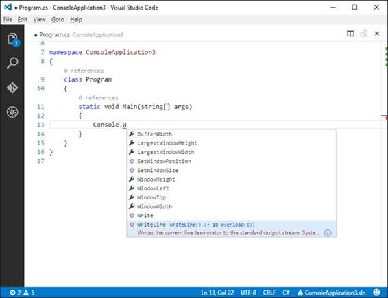

图 3:智能感知在您键入时显示建议，并提供丰富的单词补全。

如图 3 所示，当您编写时，智能感知显示了给定类型的可用成员列表——在本例中是控制台。当您从完成列表中选择一个单词时，“代码”会显示成员文档的摘要。此外，如果您单击 **i** 符号(代表信息)，您可以看到完整的成员文档(见图 4)。

图 4:获取成员的完整文档。

要快速完成单词插入，请使用制表符或回车。不限于此，VSCode 中的 IntelliSense 还支持建议筛选:基于 CamelCase 约定，您可以键入成员名称的大写字母来筛选建议列表。例如，如果您正在与系统对抗。控制台类型，您编写 cv，建议列表将显示 CursorVisible 属性，如图 5 所示。

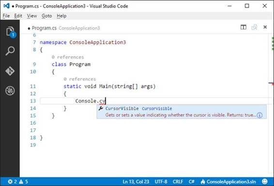

图 5:过滤建议

开箱即用，IntelliSense 可用于以下语言:CSS、HTML、JavaScript、JSON、Less、Sass、TypeScript 和 C#。

#### 参数提示

当您编写函数调用时，如果提供了文档(如 C#中的 XML 注释)，智能感知还会显示描述每个参数的工具提示。这个特性叫做**参数提示**，你可以在图 6 中看到它的作用。

图 6:可视化参数提示

代码编辑器允许折叠分隔的代码块。只需将指针悬停在行号上, **-** 符号将出现在代码块的开始附近。只需点击它来折叠代码块。此时，您将看到 **+** 符号，然后您可以单击该符号展开代码块。

通过支持的语言，VSCode 提供了一个有趣的特性，叫做**转到定义**。您可以用指针悬停在符号上，该符号将显示为超链接。此外，工具提示将显示声明该符号的代码(参见图 7)。

图 7:使用转到定义来发现代码中符号的定义。

此外，您可以按住 Ctrl 键并单击符号，代码将直接在包含相关代码的文件中打开定义。

|  | 提示:或者，您可以按 F12 或右键单击并选择转到定义。 |

您可以将鼠标悬停在类型、变量和类型成员上，VSCode 将显示一个工具提示，其中包含所选对象的文档。只有在提供了文档(如 C#的 XML 注释)的情况下，此功能才可用。图 8 显示了一个示例，其中您可以看到一个名为 Document 的描述性工具提示。

图 8:通过工具提示获取类型和成员文档。

如果将鼠标悬停在变量名上，工具提示将显示变量的类型。

**查找所有引用**是一个非常有用的功能，它可以很容易地看到一个成员在代码中被使用了多少次以及在哪里。对于每个成员，代码编辑器显示找到的引用数量。如果您单击这个数字，代码编辑器会显示一个包含第一次出现的代码的弹出窗口，而弹出窗口的右侧显示出现的列表，如图 8 所示。

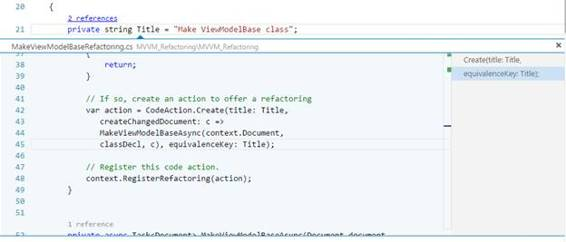

图 9:查看成员在“查找所有引用”中被使用的位置和次数

只需点击列表中的每个事件，就可以看到引用它的代码。非常重要的一点是，这个弹出窗口是交互式的，这意味着您可以直接编辑代码，而不必单独打开包含代码的文件。这允许您将注意力集中在代码上，从而节省时间。还要注意，交互式弹出窗口在顶部显示了包含所选引用的文件名。

|  | 提示:您也可以通过按 Shift+F12 或右键单击然后选择“查找所有引用”来启用“查找所有引用”。 |

重命名符号是一项常见的编辑任务，因此 VSCode 提供了一种方便的方法来实现这一点。如果您在想要重命名的符号上按 F2，或者右键单击然后选择**重命名**命令，会出现一个小的交互式弹出窗口(见图 10)。在那里你可以不用任何对话框来写新名字，把你的注意力集中在代码上。

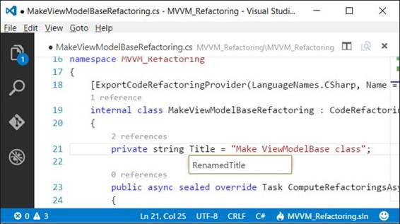

图 10:重命名内嵌符号

此外，您可以重命名标识符的所有出现。只需右键单击标识符，然后选择**更改所有事件**(或按 Ctrl+F2)；当您键入新名称时，所有出现的内容都将被突出显示并更新(参见图 11)。

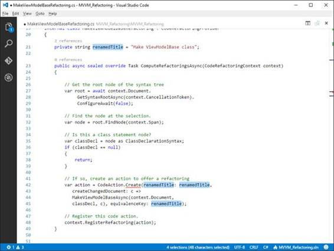

图 11:更改标识符的所有出现

假设您有几十个代码文件，并且想要查看或编辑当前使用的类型的定义。使用其他编辑器，您可以在代码文件中进行搜索，这不仅很烦人，还会将您的注意力从原始代码上移开。VSCode 通过一个名为 **Peek Definition** 的特性出色地解决了这个问题。您只需右键单击一个类型名称，然后选择**查看定义**(快捷键为 Alt+F12)。将出现一个交互式弹出窗口，显示定义该类型的代码，不仅提供查看代码的选项，还提供直接编辑代码的选项。图 12 显示了正在运行的 peek 窗口。

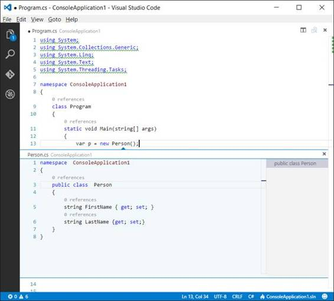

图 12:使用 Peek 定义调查类型定义

如您所见，查看窗口非常类似于“查找所有引用”功能，它仍然在其顶部显示定义类型的文件名。双击文件名，在单独的编辑器中打开代码文件。

您可以按 Ctrl+D 选择光标右侧的单词或标识符。

VSCode编辑器支持多光标。每个光标独立操作，您可以通过按住 Alt 并在所需位置单击来添加辅助光标。您将看到辅助光标被渲染得更细。您想要使用多游标的最典型情况是，您想要在代码文件的不同位置添加(或替换)相同的文本。图 13 显示了一个例子。

图 13:多光标可以用于在多个位置添加相同的文本。

您之前看到的“更改所有出现次数”功能也会自动使用多光标。

另一个有趣而强大的功能是**转到符号**。按 Ctrl+Shift+O，可以浏览当前代码文件中的符号。此外，如果您在搜索框中键入 **:** ，符号将按类别分组。图 14 显示了如何浏览按类别分组的符号。

图 14:浏览符号

使用上下箭头键突出显示代码文件中相应的符号定义。此外，符号列表会根据您在搜索框中键入的内容自动过滤。

#### 按名称打开符号

C#和 TypeScript 语言支持按名称打开符号，而不管包含该符号的代码文件是什么。只需按 Ctrl+T，在 **#** 提示下开始输入符号名称，如图 15 所示。

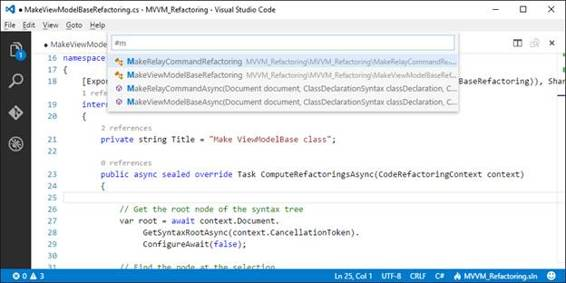

图 15:按名称浏览符号

如果您单击在不同代码文件中定义的符号名称，它将在新的编辑器窗口中打开。

您可以通过按 Shift+Alt+右箭头轻松展开文本选择，并通过在代码块的封闭分隔符内按 Shift+Alt+左箭头来收缩文本选择。

### 代码问题和重构

使用 C#和 TypeScript，VSCode 可以在您键入时检测代码问题，提出修复建议并提供代码重构。这是该工具中最强大的功能之一，这是您在大多数其他代码编辑器中找不到的。

|  | 注意:这个特性对 C#和 TypeScript 完全可用，但是对 JavaScript 和 CSS 有一些基本的支持。本节描述了基于一些 C#代码的全部功能。 |

根据代码问题的严重程度，VSCode 会用波浪线在需要您注意的代码段下面画线。绿色的曲线意味着警告；红色曲线表示必须修复的错误。如果您将鼠标悬停在带有曲线的线条或符号上，您将获得描述该问题的工具提示。图 16 显示了两个代码问题，一个是不必要的 using 指令的绿色曲线，另一个是不存在的符号的红色曲线。该图还显示了严重性级别较高的代码问题的工具提示。

图 16: VSCode在您键入时检测问题。

当然，VSCode 还提供了一种集成的、简单的方法，通过图 17 中不必要的使用指令下显示的所谓灯泡来修复代码问题。

图 17:灯泡提供了解决代码问题的快捷方式。

当您单击灯泡时，VSCode 会显示当前上下文的可能代码修复。在这种情况下，它允许您删除不必要的指令并对指令进行排序，如图 18 所示。

图 18:修复灯泡的代码问题。

只需单击所需的修复，它将应用于代码问题。实际上，这个工具要强大得多。考虑一个名为 logContent 的符号，它不存在于代码文件中，并如预期的那样被加下划线作为代码问题(参见图 16)。如果您单击这个符号，然后打开 Light Bulb，代码编辑器将显示一个列表，列出当前上下文可能的正确修复，例如创建一个字段、创建一个属性、创建一个局部变量等等，如图 19 所示。

图 19:灯泡根据上下文提供了正确的代码修复。

例如，如果选择**创建属性**选项，VSCode 会为您生成一个属性存根，如图 20 所示。

图 20:属性已经按照预期生成。

还有比这更强大的力量。考虑图 21，其中您看到一个需要实现 IDisposable 接口的类。正如您所看到的，存在一个代码问题，因为代码编辑器找不到这个接口的定义，所以它提供了可能的修复。

图 21:获取缺失接口实现的可能修复

我们知道这个接口来自系统命名空间，所以正确的修复方法是使用系统；选项。选中时，VSCode使用系统添加一个；对代码文件的指令。然而，这不足以解决代码问题，因为该类实际上缺少接口实现。如果您再次单击灯泡，您将看到代码编辑器如何基于四个不同的选择为您实现接口，如图 22 所示。

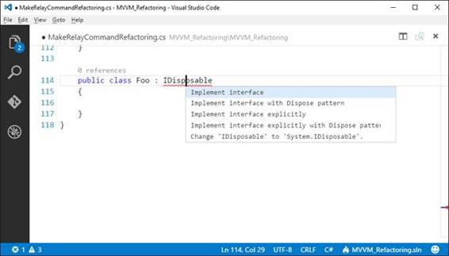

图 22:接口实现的上下文化建议

如果选择带有 Dispose 模式的**实现接口**，您将看到 VSCode 如何为正确的接口实现提供所有管道代码，如图 23 所示。

图 23: VSCode应用了代码修复，添加了所有管道代码。

如果您选择其他代码修复之一，您将获得类似的结果，但实现不同。虽然不可能显示代码可以应用的所有代码修复的示例，但您必须记住的是，建议和代码修复是基于代码问题的上下文的，这是一个非常强大的功能，使 VSCode 成为一个独特的编辑器。一旦你知道如何使用灯泡，你将会根据你遇到的代码问题看到你自己可能的修复。VSCode 还提供了另一种方式来查看它发现的所有代码问题。选择**查看** > **错误和警告** (Ctrl+Shift+M)或点击左下角的**错误和警告**符号。这将打开一个代码问题列表(参见图 24)，您也可以通过在搜索框中键入内容来进行过滤。然后，您只需单击一个代码问题并立即处理它。

图 24:显示代码问题列表

|  | 注:幕后，此功能基于[。NET 编译器平台](https://github.com/dotnet/roslyn)，也叫罗斯林。Roslyn 为开源 C#和 Visual Basic 编译器提供了丰富的代码分析 API。VSCode 不像 Visual Studio 那样与编译器一起工作，但它调用一种特殊的语言服务，在您键入时执行代码分析。Visual Studio 2015 大量使用罗斯林应用编程接口，为代码编辑器提供更高级的功能，如实时预览。如果你想了解更多关于罗斯林的信息。NET，考虑简洁地阅读[罗斯林](https://www.syncfusion.com/resources/techportal/details/ebooks/roslyn)。 |

[Markdown](https://en.wikipedia.org/wiki/Markdown) 是一种流行的标记语言，用于为网络编写文档。如果你曾经在流行的 GitHub 平台上处理过开源项目，你可能已经写了一些 Markdown 文档。VSCode 集成了对编辑 Markdown 文件(。md)，以及现场预览。图 25 显示了一个标记文档的编辑。

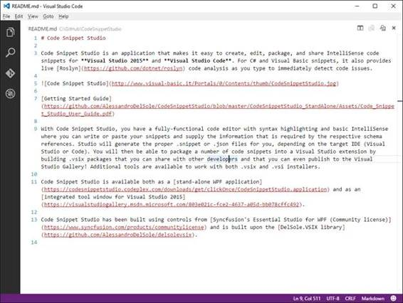

图 25:写一份降价文档。

如果您按 Ctrl+Shift+V，VSCode 会显示文档将如何呈现的实时预览，如图 26 所示。

图 26:降价直播预览

这是一个非常有用的功能，可以让您立即看到文档的外观。

VSCode 附带了许多内置的代码片段，您可以使用 Emmet 缩写语法并按 Tab 键轻松添加这些代码片段。表 1 列出了哪些语言支持代码片段。例如，在 C#中，您可以通过使用 **prop** 代码片段轻松添加属性定义，如图 27 所示。

图 27:使用埃米特缩写插入代码片段

键入时，智能感知弹出窗口中提供了代码片段。它们可以通过小白表图标识别。在上图中的代码片段上按 Tab 键会产生如图 28 所示的结果。

图 28:通过代码片段添加的属性

作为另一个例子，对于 JavaScript 代码文件，您可以使用**定义**片段(参见图 29)来添加模块定义。这段代码片段产生了如图 30 所示的结果。

图 29:添加一个 JavaScript 代码片段

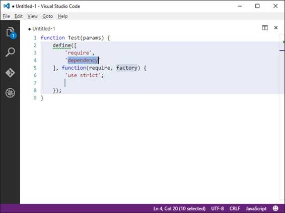

图 30:通过代码片段添加的 JavaScript 模块定义

VSCode不限于内置代码片段。您可以下载开发人员社区为多种语言生成的代码片段，甚至可以创建和共享自己的代码片段。这在[第 5 章“定制和扩展 VSCode”](5.html#_Chapter_5_Customizing)中讨论。

## 处理文件和文件夹

VSCode基于文件和文件夹。这意味着您可以单独打开一个或多个代码文件，但也意味着您可以打开包含源代码文件的文件夹，并以结构化、有组织的方式处理它们。打开文件夹时，VSCode会搜索以下文件之一:

*   package.json
*   project.json
*   tsconfig.json 文件
*   。sln 或。ASP.NET 核心的 Visual Studio 解决方案和项目文件

如果代码找到其中一个文件，它能够将文件结构组织成方便的编辑体验，并提供额外的丰富编辑功能，如智能感知和代码重构。如果一个文件夹只包含源代码文件，而没有任何上述内容。json 或。sln 文件，它仍然打开并显示该文件夹中的所有源代码文件，提供了一种在它们之间切换的便捷方式。以下各节描述了如何在 VSCode中使用单个文件和文件夹，以及代码如何管理项目。

开始编辑 VSCode的最简单方法是使用一个代码文件。您可以使用**文件** > **打开**或按 Ctrl+O 打开现有支持的代码文件。在 Windows 上，如果您在安装 VS Code 时启用了该选项，您也可以在文件资源管理器中右键单击文件名并选择**代码打开**。VSCode自动检测代码文件的语言，并启用适当的编辑功能。当然，你当然可以打开更多的文件，按 Ctrl+Tab 就可以轻松地在文件之间切换。如图 31 所示，一个方便的弹出窗口显示了打开文件的列表；通过按下 Ctrl+Tab，您将能够浏览文件，当您释放键时，选定的文件将成为活动的编辑窗口。

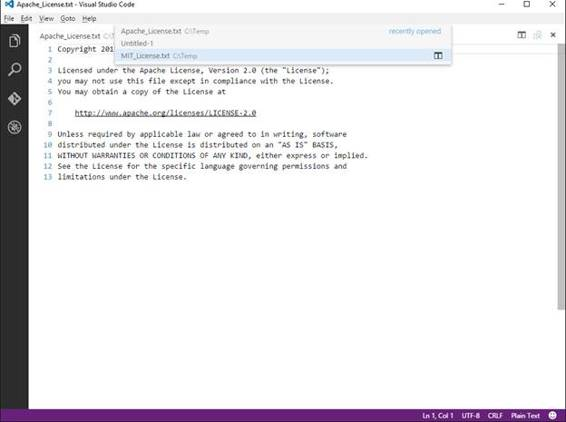

图 31:在代码文件之间切换

|  | 提示:VSCode 还提供了资源管理器，它提供了当前打开的文件的结构化、有组织的视图。这将在[第 2 章“工作空间和用户界面”中讨论](2.html#_Chapter_2_The) |

使用右上角的**关闭**按钮，或者使用**文件**菜单中的**关闭所有文件**命令，可以关闭编辑器。

您可以通过单击**文件** > **新文件**或按下 **Ctrl** + **N** 来创建新文件。默认情况下，新文件被视为纯文本文件。要更改新文件的语言，单击 VS Code 右下角微笑符号附近的**选择语言模式**项。在这种情况下，您将看到纯文本作为当前模式，因此单击它。如图 32 所示，您将看到一个支持的语言列表，您可以在其中为当前文件选择新的语言。您也可以开始键入语言名称来过滤列表。

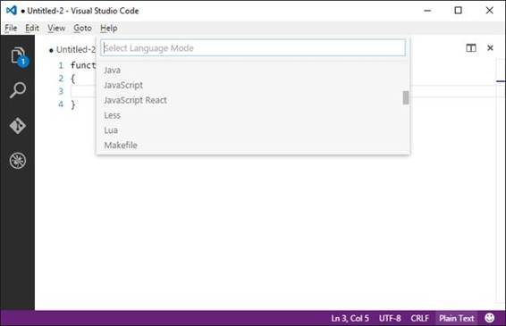

图 32:在代码文件之间切换

当您选择一种新的语言时，选择语言模式弹出窗口会更新为所选的语言，编辑器会为其启用适当的功能，如图 33 所示，其中语法着色和智能感知基于选择 JavaScript。

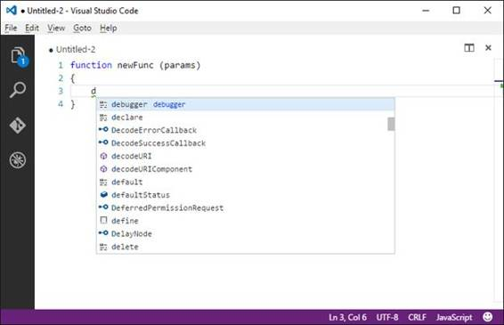

图 33:改变代码文件的语言可以实现适当的特性。

当然，您可以更改任何现有文件的当前语言，而不仅仅是新文件。

VSCode允许您为新文件和现有文件指定编码。新文件的默认编码是 UTF-8。您可以通过单击右下方的**选择编码**项来更改当前编码，在上图中表示为当前编码 UTF-8。您将看到一个支持的编码列表和一个搜索框，您可以在其中输入编码名称来过滤列表(参见图 34)。

图 34:选择不同的编码

同样，您可以通过单击编辑器右下角的**选择行序列结束**项目来更改行终止符，在前面的图中，该项目由 CLRF 表示。VSCode 支持 CRLF(回车换行)和 LF(换行)；默认选择是 CRLF。您也可以通过单击**转到第**行，立即转到一行代码，由状态栏中的行号和列号表示。这将打开一个搜索框，您可以在其中键入要转到的行号，并且该代码行将在您键入时立即突出显示。也可以通过按 **Ctrl** + **G** 导航到一行(见图 35)。

图 35:转到运行中的行

### 使用文件夹和项目

与其他开发环境(如微软 Visual Studio)相比，VSCode是基于文件夹的，而不是基于项目的。这使得 VSCode独立于专有项目系统。VS Code 可以在磁盘上打开包含多个代码文件的文件夹，并以环境中可能的最佳方式组织它们，它还支持各种项目文件。更具体地说，当您打开一个文件夹时，代码首先搜索:

*   **project.json** 文件。如果找到，代码会将该文件夹视为用 C#编写的 DNX 项目。DNX 代表。NET 执行环境，它是一个运行时，在其上构建了一个软件开发工具包。NET Core，用于构建便携式、跨平台的 ASP.NET Core 解决方案。
*   **MSBuild 解决方案文件(。sln)** 。如果找到，VSCode 知道这是为 Microsoft Visual Studio 构建的解决方案，因此它会扫描引用的项目(*。csproj 和*。vbproj 文件)并以适当的方式组织文件和子文件夹。
*   **tsconfig.json** 文件。如果找到，VSCode 知道这代表了 TypeScript 项目的根，因此它会扫描引用的文件，并提供适当的文件和文件夹表示。
*   **jsconfig.json** 文件。如果找到了，VSCode 知道这代表了一个 JavaScript 项目的根。因此，与 TypeScript 类似，它扫描引用的文件，并提供适当的文件和文件夹表示。
*   **package.json** 文件。这些通常包含在 JavaScript 项目和 DNX 项目中，因此 VSCode 会根据文件夹的内容自动解析项目类型。

|  | 提示:打开一个. sln 或。json 文件直接将导致编辑单个文件的内容。因此，您应该打开一个文件夹，而不是解决方案或项目文件。 |

如果找不到任何受支持的项目，VSCode 会将文件夹中的所有代码文件作为松散的分类加载，并将它们组织到一个虚拟文件夹中，以便于导航。现在让我们来看看 VSCode如何允许您使用文件夹和支持的项目。

#### 打开文件夹

一般来说，你通过**文件** > **打开文件夹**打开一个有代码的文件夹。在 Windows 上，如果您在安装过程中选择了该选项，您可以在文件资源管理器中右键单击文件夹名称，然后选择**用代码打开**。无论打开哪个文件夹，代码都会将文件和子文件夹组织到浏览器侧栏中表示的结构化视图中。图 36 显示了一个例子。

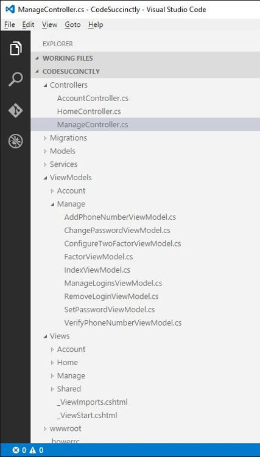

图 36:在资源管理器中组织文件夹和文件

根容器是文件夹名称。文件和子文件夹嵌套在其中，您可以展开每个子文件夹来浏览其中包含的每个文件。只需点击一个文件，打开它的编辑器窗口。资源管理器工具不仅仅是文件浏览，让我们把它留到[第 2 章](2.html#_Chapter_2_The)中，我将在这里深入讨论代码的用户界面。现在，关注它为任何文件夹提供的可视化表示。

#### 与 DNX 项目合作(ASP.NET 核心)

VSCode 对以 ASP.NET 核心为目标的 DNX 项目有着深厚的支持。当您打开包含 DNX 项目的文件夹时，VSCode 会将所有代码文件组织到资源管理器栏中，并启用 C#的所有可用编辑功能。图 37 显示了一个例子。

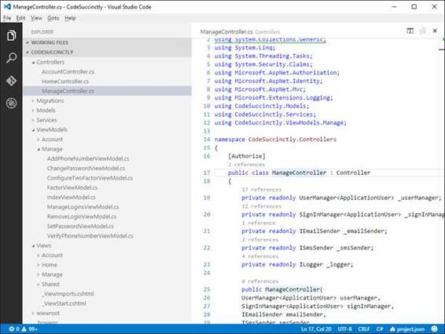

图 37:用 VSCode打开 DNX 项目

请注意资源管理器中的根级别是如何作为项目名称的。您可以浏览文件夹、代码文件以及编辑 VSCode 能够正确识别的任何内容。您还可以查看 project.json 文件，其中包含项目信息、依赖项列表、脚本和其他信息。图 38 显示了一个摘录。

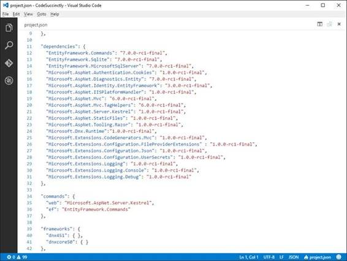

图 38:检查一个项目

|  | 注意:对于 DNX 项目，您需要使用命令面板中的 dnu 恢复命令来恢复 NuGet 包。这在[第 4 章“实践中”有更详细的描述](4.html#_Chapter_4_Creating) |

#### 使用 JavaScript 项目

与 DNX 类似，VSCode 可以通过搜索 jsconfig.json 或 package.json 文件来管理 JavaScript 文件夹。如果找到了，代码以正确的方式组织文件夹和文件列表，并为它支持的所有文件启用所有可用的编辑功能，如图 39 所示。

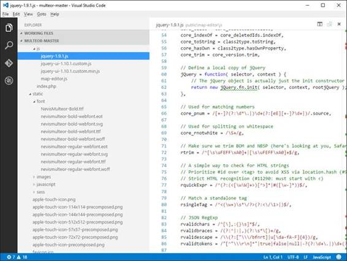

图 39:打开一个 JavaScript 项目

VSCode中的 TypeScript 项目行为与 JavaScript 相同。

#### 使用 MSBuild 解决方案

您可能还需要打开 Microsoft Visual Studio 解决方案(。带有 VSCode。如果是这种情况，请不要打开。直接 sln 文件。这将导致编辑器窗口显示文件的 XML 内容。相反，请打开包含解决方案文件的文件夹。正如您所期望的那样，VSCode 在资源管理器中组织项目文件和文件夹，并为选定的文件启用所有可用的编辑功能。图 40 显示了一个例子。

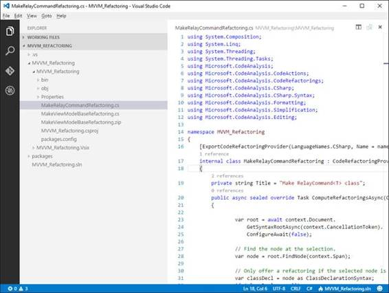

图 40:打开一个 Visual Studio 解决方案

值得注意的是，如果 VSCode 在解决方案内部检测到 NuGet 包，则会启用查找所有引用和代码问题检测等功能。

|  | 提示:在[第 3 章“Git 版本控制和任务自动化”](3.html#_Chapter_3_Git)中，您还将学习如何从 VS Code 启动 MSBuild 引擎，并编译一个用 C#编写的 DNX 项目。 |

#### 使用松散的文件夹

VSCode当然允许打开包含不相关的松散文件的文件夹。VSCode基于文件夹名称创建逻辑根，显示文件和子文件夹。图 41 显示了一个基于名为 MyFiles 的示例文件夹的示例。

图 41:打开包含松散文件的文件夹

VSCode 是一个开源、跨平台、多语言的开发环境，它将编写代码放在中心位置。代码支持多种语言，并通过语法着色等常见功能以及智能感知、代码问题检测和代码浏览等更高级的功能提供增强的编辑体验。为了支持不同的项目系统，VSCode 是基于文件和文件夹的，这意味着它支持使用松散的代码文件以及包含项目和代码文件的有组织的结构化文件夹。在对可用的编辑功能进行了长时间的概述之后，下一个合乎逻辑的步骤是讨论工作空间和用户界面。