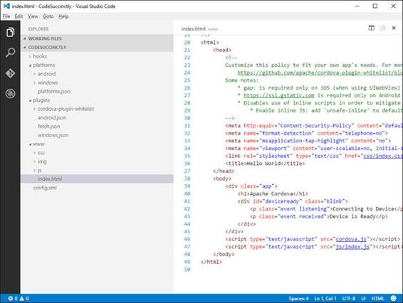
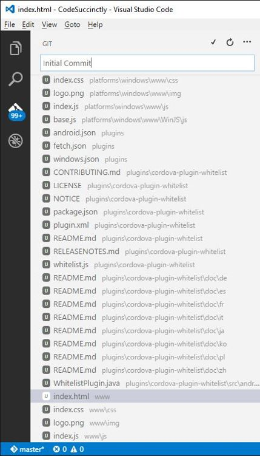
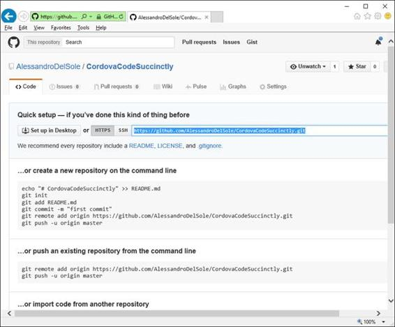
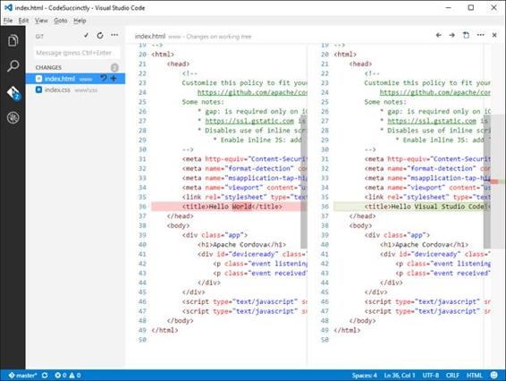
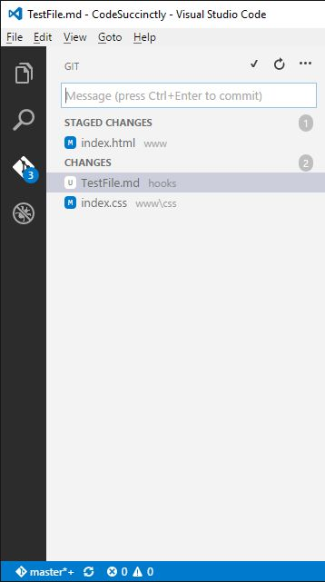
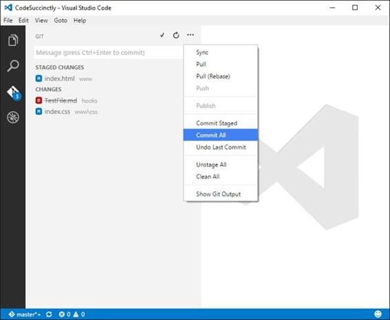
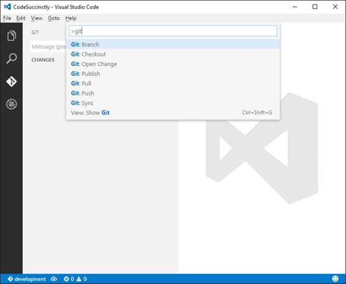
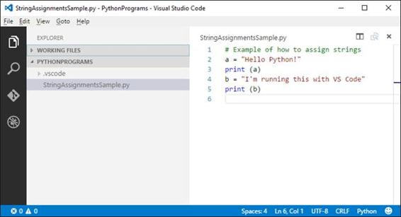
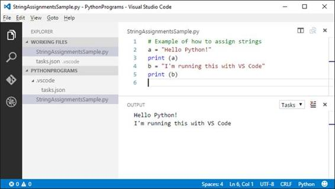
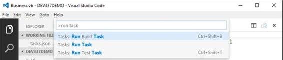

# 第三章 Git 版本控制和任务自动化

编写软件通常需要协作。例如，您可能是工作中的开发团队的一员，或者您可能参与开源社区项目。微软强烈支持协作和开源，因此 Visual Studio Code 与 Git 完美集成。此外，在许多情况下，您需要启动外部工具，Visual Studio 代码通过任务支持这些工具。本章描述了这两个主题。

|  | 注意:由于 Visual Studio 代码的开源、跨平台特性，在本章中，我将提供基于独立应用程序开发框架的示例。例如，这里没有微软的 Visual Studio，但是你可以使用任何你在这里学习到的用 VS 代码打开的 Visual Studio 解决方案。 |

Git 是一个非常受欢迎的开源分布式版本控制引擎，它使小型和大型项目的协作变得更加容易。Visual Studio Code 可以与任何 Git 存储库(如 GitHub 或 Visual Studio Team Services)一起工作，并提供了一种集成的方法来管理您的代码提交。请注意，本章不是 Git 的指南，而是 Visual Studio Code 如何使用它的解释，因此要了解更多信息，请访问 [Git](https://git-scm.com/) 官方页面。此外，请记住 Visual Studio Code 要求 Git 引擎安装在本地，因此如果您还没有安装，请[下载](https://git-scm.com/downloads)并为您的操作系统安装 Git。为了演示 Git 版本控制如何与 Visual Studio 代码一起工作，我将创建一个小的 Apache Cordova 项目。您可能知道，Apache Cordova 是一个框架，您可以使用它来创建基于 JavaScript 和 HTML5 的跨平台移动应用程序。当然，本章中描述的所有步骤和技术都适用于 Visual Studio Code 支持的任何语言的任何项目。继续之前，确保您的机器上安装了 [Node.js](https://nodejs.org/en/) 。

为了使用 Apache Cordova 工具，您首先需要安装 Cordova 命令行界面。当然，如果您已经为 Visual Studio 2015 安装了 Apache Cordova 工具，您可以跳过这一步。要完成安装，假设您已经安装了 Node.js，打开命令提示符并键入以下内容:

npm 安装-g Cordova

安装命令行界面不会花很长时间。

|  | 提示:VS 代码有一个扩展叫做 [Cordova Tools](https://marketplace.visualstudio.com/items?itemName=vsmobile.cordova-tools) ，它提供了额外的特性，比如特定的调试器和命令。这个例子中没有用到它，但是如果使用科尔多瓦对你来说是最重要的，你可能会想要下载它。 |

从命令行创建一个科尔多瓦项目非常容易。这是创建科尔多瓦项目所需的简单命令:

> cordova 简洁地创建代码

其中代码简洁地是项目的名称。请注意，该工具将创建一个名为“代码简洁”的文件夹，用于放置项目文件。当该选择项目地点时，请记住这一点。新的科尔多瓦项目目前只包含一个带有几个文件的应用程序框架，但这对于我们的目的来说已经足够了。准备就绪后，用 Visual Studio 代码打开项目，这意味着打开新创建的文件夹。图 51 显示了此时代码的样子。



图 51:用代码打开的科尔多瓦项目

现在，您已经准备好开始使用 Git 了。

如果您熟悉 Git，那么您知道版本控制既适用于本地存储库，也适用于远程存储库。您需要做的第一件事是为当前项目创建一个本地存储库。这是通过从侧栏打开 Git 工具来实现的，如图 52 所示。


图 52:准备初始化本地 Git 存储库

点击**初始化 git 库**。Visual Studio Code 将初始化本地存储库，并显示版本控制正在跟踪但尚未提交的文件列表(参见图 53)。



图 53:准备好第一次提交的文件

请注意 Git 图标如何显示待定更改的数量。这是一个重要的指标，你总是会看到任何时候你有待定，未提交的变化。编写提交描述，然后按 Ctrl+Enter。此时，文件被提交到本地存储库，挂起的更改列表将被清除。现在有一个问题:您需要一个远程存储库，但是官方文档没有描述如何将它与代码相关联。让我们看看如何实现这一点。

Visual Studio 代码可以与任何 Git 存储库一起工作。有很多平台使用 Git 作为版本控制引擎，但最受欢迎的平台可能是 GitHub 和微软 Visual Studio Team Services。为了与平台无关，我将展示如何创建一个 GitHub 远程存储库，并将其与本地项目相关联。当然，我假设你有一个现有的 GitHub 账户。如果没有，可以[免费创建一个](https://github.com/join?source=header-home)新账号和一个新的储存库。图 54 显示了一个例子。


图 54:创建新的远程存储库

一旦创建了存储库，GitHub 就提供了将远程存储库与本地存储库相关联所需的基本信息。图 55 显示了 Git 版本控制引擎的远程地址和执行关联必须键入的命令。



图 55:获取将远程存储库与本地存储库相关联的必要信息

下一步是打开命令提示符，导航到包含科尔多瓦项目的文件夹。接下来，写下下面两行:

> git 远程添加原产地 https://github.com/YourAccount/YourRepository.git

> git push -u 原点主控

其中您的帐户和存储库分别代表您的 GitHub 用户名和存储库名称。第一行告诉 Git，当前文件夹(包含本地存储库)的远程来源是指定的 URL。第二行将本地存储库的内容推入名为 master 的分支。根据您的互联网连接，可能需要几分钟才能完成上传操作。现在，您真正拥有了所需的一切，您可以开始发现 Visual Studio Code 提供的 Git 集成。

Git 监控本地存储库中的代码，并检测任何更改。Git 图标显示有待定更改的文件数量。在图 56 中，您可以看到一个基于两个编辑文件的例子。

|  | 提示:图标上的数字实际上只有在本地保存文件时才会更新。 |


图 56:获取具有待定更改的文件列表

通过单击列表中的一个文件，您可以看到新文件版本和旧文件版本之间的差异，如图 57 所示。这个工具叫做 **Diff** 。



图 57:比较工具允许你比较不同版本之间的变化。

左边是旧版本，右边是新版本。当使用任何版本控制引擎时，这都是一个非常重要的工具。您还可以升级文件以进行转移，这意味着将它们标记为准备好进行下一次提交。这实际上不是强制性的，因为您可以直接提交，但是有一个可视化的变更表示是很有用的。您可以通过单击文件名称附近的 **+** 符号来暂存文件。Visual Studio Code 将暂存文件组织到一个逻辑容器中，如图 58 所示。同样，您可以通过单击**–**符号来取消文件的归档。



图 58:分阶段的变更被单独分组。

准备就绪后，您可以单击 **…** 按钮，访问其他操作，如提交、同步、拉取和拉取(重定位)。图 59 显示了如何提交所有文件，也显示了标记为删除的文件如何用红色图标表示。



图 59:访问 Git 命令

准备好之后，点击**全部提交**。请记住，此操作会将文件提交到本地存储库。然后，您必须**同步**，以便与远程存储库同步更改。您还可以选择撤消上次提交，并使用**撤消上次提交**命令恢复到以前的版本。拉和拉(基础)允许您将一个分支合并到另一个分支。Pull 实际上是非破坏性的，并且合并了两个分支的历史，而 Pull (Rebase)通过为原始分支中的每个提交创建新的提交来重写项目历史。

命令面板支持特定的 Git 命令，您可以像在命令外壳中一样键入这些命令。图 60 显示了可用 Git 命令的列表。



图 60:命令面板中支持的 Git 命令

例如，您可以使用 **Git Sync** 来同步本地和远程存储库，或者您可以使用 **Git Push** 来将挂起的更改发送到远程存储库。使用 Git 命令的一个常见场景是使用分支。

我将用一个例子来解释什么是分支。假设您有一个项目，在其生命周期的某个时刻投入生产。现在，您需要继续开发您的项目，但是您不想在您已经编写的代码上这样做。您可以使用一个分支创建两个历史记录。创建存储库时，还会得到一个名为 **master** 的默认分支。继续这个例子，主分支可以包含已经投入生产的代码，现在您可以创建一个新的分支，一个名为**开发**的分支，基于主分支，但不同于它。在命令面板中，您可以输入 **Git 分支**，然后系统会要求您指定一个新的分支名称。这将基于 master 在本地创建一个新分支。如图 61 所示，状态栏显示新分支为活动分支。当您准备好之后，您可以使用**发布分支**按钮(由云图标表示)将新的分支发布到远程存储库。


图 61:新建分支和发布分支按钮

使用这个工具，您不需要在 Git 存储库提供程序中创建和管理分支。

## 自动化任务

我多次提到，Visual Studio Code 不仅仅是一个代码编辑器；这是一个端到端的开发环境。读完这本书，我希望你能更好地理解我的意思。但还有更多。任何值得尊敬的开发环境都需要运行外部任务，如程序、编译器或通用工具。当然，代码也是如此。Visual Studio 代码允许运行外部程序**任务**。运行任务时，Visual Studio 代码将显示“输出”窗口，外部程序的输出将重定向到该窗口。这个窗口很快就会被覆盖。

|  | 注意:您将在本节中看到任务的实际实现。当然，Visual Studio Code 支持很多很多类型的任务和更复杂的操作。也就是说，一定要查看官方的[文档](https://code.visualstudio.com/docs/editor/tasks)，了解具体复杂的任务配置。 |

当您想要运行外部程序时，您需要配置一个新任务。任务是用 JSON 符号表示的一组指令和属性。需要记住的重要一点是，任务仅适用于项目和文件夹，因此您不能针对单个代码文件运行任务。要配置任务，首先需要打开一个项目或文件夹，然后打开命令面板，键入**配置任务运行器**。Visual Studio Code 添加了一个名为**的子文件夹。vscode** 并生成一个名为 **tasks.json** 的新文件，其中包含一个或多个将针对项目或文件夹执行的任务。对于特定的场景，自动生成的 task.json 包含一个预配置的任务(参见代码清单 1)和一些附加的包含在注释中的任务。

代码清单 1

```js
  //
  A task runner that calls the TypeScript compiler (tsc) and
  //
  compiles a HelloWorld.ts program.
  {
        "version": "0.1.0",

        // The command is tsc. Assumes that
  tsc has been installed using npm install -g typescript.
        "command": "tsc",

        // The command is a shell script.
        "isShellCommand": true,

        // Show the output window only if
  unrecognized errors occur.
        "showOutput": "silent",

        // args is the HelloWorld program to
  compile.
        "args": ["HelloWorld.ts"],

        // Use the standard tsc problem
  matcher to find compile problems
        // in the output.
        "problemMatcher": "$tsc"
  }

```

预配置的默认任务针对一个名为 HelloWorld.ts 的文件启动 TypeScript 编译器。我将很快向您展示如何实现您的自定义任务，但在此之前，您需要了解任务是由什么组成的。在其最基本的形式中，任务由以下 JSON 元素组成:

*   版本。这代表 VS 代码的最低版本，应该保持不变。
*   命令。这是您想要运行的外部程序。请记住，如果尚未为程序配置环境路径变量，则需要包含程序的完整路径。
*   isShellCommand。这表示一个命令是否是一个 shell 脚本(在大多数情况下，您将保持这个状态)。
*   显示输出。这指定了输出窗口必须显示从外部程序捕获的输出的时间。支持的值总是、从不和静默。它们将始终、从不或仅在检测到无法识别的错误时显示输出窗口。
*   args:要传递给命令的一个或多个参数。典型的参数是文件名和命令行开关。

也可以指定 [**问题匹配器**](https://code.visualstudio.com/docs/editor/tasks#_processing-task-output-with-problem-matchers) ，这是一种让 Visual Studio Code 理解和处理外部程序产生的错误和警告样式的方法。例如，$tsc 问题匹配器(TypeScript)假设输出中的文件名是相对于打开的文件夹的；$ m compile(c#和 Visual Basic)和$ lescompile(Less)问题匹配器假设文件名表示为绝对路径。代码支持许多开箱即用的问题匹配器，但是您可以为不直接支持的程序定义自己的匹配器。此外，您还可以配置多个任务，在本章的后面，您将看到一个基于批处理文件的示例。发现定制的问题匹配器留给你作为练习(查看 [Visual Studio 代码文档](https://code.visualstudio.com/docs/editor/tasks))。在这里，您将学习如何配置实际任务，例如运行 Python 程序、执行批处理文件以及使用 MSBuild 编译 Visual Studio 解决方案。

|  | 提示:在保存 task.json 之前，您定义的任务不会被执行，所以不要忘记这一点。此外，如果您的任务针对不同的活动代码文件运行(或者至少将视图切换到代码文件)，请记住关闭 task.json 编辑器。 |

#### 预定义的公共变量

Visual Studio 代码支持许多预定义变量，您可以使用这些变量来代替常规字符串，并且在将这些变量传递给命令时，这些变量对于表示文件和文件夹名称非常有用。以下是支持的变量列表(也可以在 task.json 开头的注释中看到):

*   ${workSpaceRoot}。根文件夹。
*   ${file}。活动代码文件。
*   ${fileBaseName}。活动代码文件的基本名称。
*   ${fileDirname}。包含活动代码文件的目录的名称。
*   ${fileExtname}:活动代码文件的文件扩展名。
*   ${cwd}:派生进程的当前工作目录。
*   ${env。VARIABLENAME}:引用指定的环境变量，如{$env。PATH}。

当您运行在项目或文件夹级别工作的任务时，或者针对您无法预测或不想硬编码的文件名运行任务时，使用变量非常常见。在接下来的部分中，您将看到几个例子。

|  | 注意:本节假设您已经安装了 Python。如果没有，可以从[官网](https://www.python.org/downloads/)下载。 |

Python 是一种非常流行的编程语言，Visual Studio Code 开箱即用地支持 Python 语法。但是，如果您想运行 Python 程序，您应该单独启动解释器。幸运的是，您可以配置任务并从代码中运行 Python。因为任务是针对项目和文件夹运行的，所以您必须做的第一件事是在磁盘上设置一个文件夹，您可以在其中放置 Python 代码文件。接下来要做的是用 Visual Studio 代码打开这个文件夹。图 62 显示了一个名为 PythonPrograms 的示例文件夹，其中包含一个名为 StringAssignmentsSample.py 的代码文件，在 Visual Studio Code 中打开。



图 62:在 Visual Studio 代码中打开的 Python 程序

按下**Ctrl**+**Shift**+**P**或 **F1** 键打开命令面板。接下来，输入**配置任务运行器**或选择输入时出现的自动填充建议项，如图 63 所示。


图 63:调用任务配置工具

此时，Visual Studio Code 为当前文件夹生成一个新的 task.json 文件。要么清除文件内容，要么对预配置的 TypeScript 任务进行注释，并编写代码清单 2 所示的新任务。

代码清单 2

```js
  //
  A task runner that calls the Python interpreter and
  //
  runs the current program.
  {
        "version": "0.1.0",

        // The command is Python.exe. 
        "command": "C:\\Python34\\Python.exe",

        // The command is a shell script.
        "isShellCommand": true,

        // Always show the output window.
        "showOutput": "always",

        // args is the program to compile.
        "args": ["${file}"]
  }

```

代码清单 2 非常简单:它为 Python 解释器指定了完整的路径，因为在我的机器上，它没有向 path 环境变量注册。接下来，它指定总是在“输出”窗口中显示解释器的输出，以及参数，该参数是一个变量，表示我们要运行的当前打开的文件。保存 task.json，关闭，然后按**Ctrl**+**Shift**+**B**或在命令面板中键入**运行构建任务**。此时，Visual Studio Code 针对活动文件启动 Python.exe，并在输出窗口中显示结果，如图 64 所示。



图 64:输出窗口显示了外部程序的结果。

正如您所看到的，这是一个非常有用和强大的特性，因为它运行一个外部程序，并将其输出直接带入开发环境。

|  | 提示:“输出”窗口不是交互式的。例如，如果您的程序需要用户输入，输出窗口将无法捕捉到它。在配置任务时，请记住这一点。 |

带有批处理文件(。bat)，您可以执行操作系统支持的一个或多个 DOS 命令。假设您有一个名为 CreateDir.bat 的批处理文件，其目的是在磁盘上创建一个文件夹，并将 Dir 命令的输出重定向到一个文本文件中，该文件将在新创建的文件夹中创建。代码清单 3 显示了这方面的代码。

代码清单 3

```js
  @ECHO
  OFF

  SET
  FOLDERNAME=C:\TEMP\TESTFOLDER
  SET
  FILENAME=%FOLDERNAME%\TEXTFILE.TXT
  MKDIR
  %FOLDERNAME%

  ECHO
  %FOLDERNAME%  CREATED

  REM
  REDIRECT OUTPUT TO A TEXT FILE
  ECHO
  This is a text file created programmatically>>%FILENAME%

  REM
  REDIRECT DIR LIST TO A TEXT FILE
  DIR
  >>%FILENAME%

  ECHO %FILENAME%
  CREATED

```

现在假设这个文件存储在我们在 Visual Studio 代码中打开的文件夹中。目标是从代码本身运行这个批处理程序。为此，您再次运行**配置任务运行器**命令，并编辑 tasks.json，如代码清单 4 所示。

代码清单 4

```js
  {
    "version": "0.1.0",
    "command": "${workspaceRoot}/CreateDir.bat",
    "isShellCommand": true,
    "showOutput": "always",
    "args": [ ]
  }

```

在这种情况下，您的命令是批处理文件，其执行由操作系统处理，操作系统会将其视为可执行程序。这里没有参数，因为批处理文件不需要任何参数。请注意${workspaceRoot}变量是如何指定的，以告诉代码文件在根文件夹中。如果保存 tasks.json 并按下**Ctrl**+**Shift**+**B**，Visual Studio Code 将启动批处理文件并在输出窗口显示结果，如图 65 所示。


图 65:输出窗口显示了执行批处理文件的结果。

|  | 注意:这个例子只适用于微软视窗系统。 |

如果您习惯于使用微软的 Visual Studio，那么在 Visual Studio Code 中您肯定想要的东西之一就是编译您的解决方案和项目的能力。虽然这不应该成为一个要求，但拥有它肯定会很好，实际上你可以通过几个步骤获得它。事实上，您可以配置一个任务来运行 Visual Studio 使用的构建引擎 MSBuild.exe。在下一个示例中，您将看到如何编译由两个 Visual Basic 项目组成的 MSBuild 解决方案，但当然所有步骤都适用于任何项目。sln 文件和任何支持的语言。要启用 MSBuild 执行，您需要用代码清单 5 中显示的 JSON 代码配置一个任务。

代码清单 5

```js
  //
  A task runner that calls the MSBuild engine and
  //
  compiles a .sln solution.
  {
        "version": "0.1.0",

        // The command is msbuild. 
        "command": "msbuild",

        // The command is a shell script.
        "isShellCommand": true,

        // Always show the output window for
  detailed information.
        "showOutput": "always",

        // args is the solution name.
        "args": ["WPCDemo.Sln"],

        // Use the standard problem matcher
  to find compile problems
        // in the output.
        "problemMatcher": "$msCompile"
  }

```

值得注意的是，该命令是 msbuild，该任务使用标准的$msCompile 问题匹配器来查找特定于 Visual Basic 和 C#的编译问题。通过按下**Ctrl**+**Shift**+**B**运行该任务，会使 VS Code 在指定的解决方案文件上运行 MSBuild.exe，产生如图 66 所示的示例输出。


图 66:输出窗口显示了编译 MSBuild 解决方案的结果。

如果您想使用 Visual Studio Code 强大的编辑功能，并且希望能够编译您的解决方案，这个选项绝对是一个不错的补充。

到目前为止，您已经看到了如何配置一个任务。实际上，您可能需要为一个项目或文件夹配置多个任务。开箱即用，Visual Studio Code 支持两个常规名称的任务:构建任务(**Ctrl**+**Shift**+**B**)和测试任务(**Ctrl**+**Shift**+**T**)。如果您只配置一个任务，就像您在前面的示例中所做的那样，它会自动被视为一个构建任务。如果您想要区分构建和测试任务，您需要在 tasks.json. Code 清单 6 显示了一个基于之前配置的 MSBuild 任务的例子。

代码清单 6

```js
  {
    "version": "0.1.0",
    "command": "msbuild",
    "isShellCommand": true,
    "showOutput": "always",
    "args": ["WPCDemo.sln"],
    "tasks": [

  {

  "taskName": "build",

  "isBuildCommand": true,

  "showOutput": "always"

  },

  {

  "taskName": "test",

  "showOutput": "never"

  }
    ]
  }

```

以下是关于配置多个任务的要点列表:

*   称为 tasks 的 JSON 数组用于指定多个任务。
*   每个任务都由 taskName 属性表示。
*   因为不再有默认任务，所以 isBuildCommand 属性设置为 true 表示生成任务与哪个任务相关联

代码清单 6 为 Visual Studio 代码支持的构建和测试任务定义了两个任务。通过按**Ctrl**+**Shift**+**B**可以获得构建任务，通过按**Ctrl**+**Shift**+**T**可以获得测试任务。两者都可以通过命令面板获得，如图 67 所示。



图 67:从命令面板调用构建和测试任务。

不限于此，您还可以使用自定义名称指定其他任务。代码清单 7 显示了如何定义一个名为 onError 的新任务，只有在检测到编译错误时，它才会显示在输出窗口中。最后，图 68 显示了如何从命令面板调用定制任务。

代码清单 7

```js
  {
    "version": "0.1.0",
    "command": "msbuild",
    "isShellCommand": true,
    "showOutput": "always",
    "args": ["WPCDemo.sln"],
    "tasks": [

  {

  "taskName": "build",

  "isBuildCommand": true,

  "showOutput": "always"

  },

  {

  "taskName": "test",

  "showOutput": "never"

  },

  {

  "taskName": "onError",

  "showOutput": "silent"

  },
    ]
  }

```


图 68:从命令面板调用定制任务

通过定义多个任务，您可以针对不同的配置在项目和文件夹上运行外部程序。

Visual Studio Code 为基于 Git 引擎的源代码版本控制提供了集成支持，提供了可以轻松提交和管理您的更改(包括分支)的工具。代码还允许您定义构建、测试和自定义任务，使您能够在项目和文件夹上运行外部程序，如编译器。这些是使 Visual Studio 代码不同于简单源代码记事本的关键特性。现在，您已经掌握了开始使用代码编写优秀应用程序所需的所有强大功能，这将是下一章的主题。